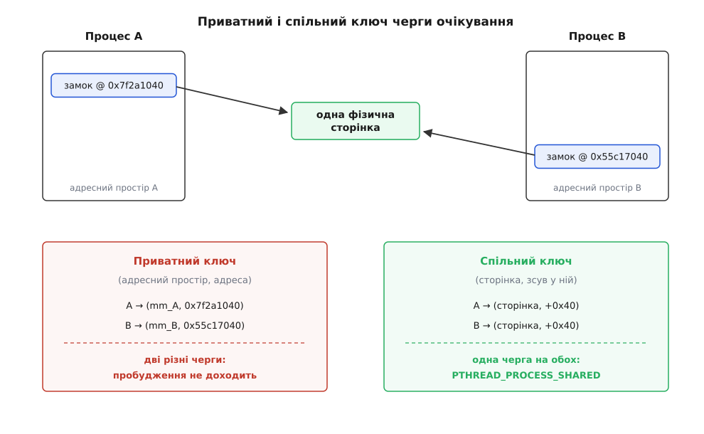
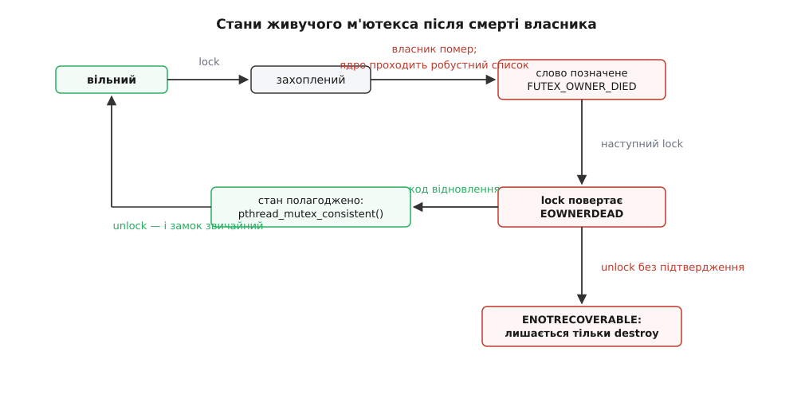
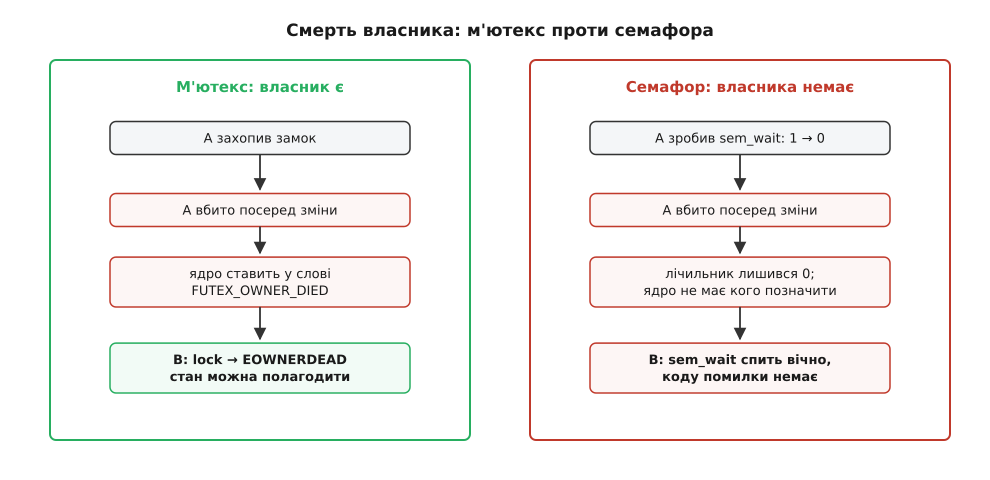

# Синхронізація між процесами: POSIX-семафори й спільні м'ютекси

<preknowlist>
- [Спільна пам'ять POSIX](topic:sys-unix/posix-shared-memory) — як дві окремі програми дістають одні й ті самі байти через `shm_open` і `mmap`.
- [Віртуальний адресний простір](topic:sf-os/virtual-address-space) — у кожного процесу свої адреси, і одна фізична сторінка лежить у них за різними адресами.
- [Перегони даних і замки](topic:sf-tasks/data-races-locks) — що таке критична ділянка й навіщо взаємне виключення.
- [eventfd і futex](topic:sys-unix/eventfd-and-futex) — механізм, яким задача засинає на слові в пам'яті й прокидається від чужого запису.
- [Потоки як задачі](topic:sys-unix/threads-as-tasks) — для планувальника Linux потік і процес є та сама сутність, різна лише мірою спільного.
- [Монітори й умовні змінні](topic:sf-tasks/monitor-sync) — чекання на умову, а не тільки на звільнення замка.
</preknowlist>

Служба зчитує кадри з камери й кладе їх у буфер. Переглядач — окрема програма, запущена окремо, зі своїм життям і своїм падінням, — той самий буфер читає. Байти в них спільні, тож рано чи пізно настане мить, коли одна пише заголовок кадру, а друга саме його читає: половина полів нова, половина стара. Потрібне звичайне взаємне виключення — поки одна всередині, друга чекає.

Усередині однієї програми відповідь відома до автоматизму: м'ютекс. Перша думка — узяти той самий м'ютекс і покласти його в спільний буфер, щоб обидві програми його бачили. Думка правильна, і працює вона майже. Ціна цього «майже» висока: код проходить тести й розсипається під навантаженням у бою, а одна з двох поломок узагалі не має способу відновитися. Розберімо, чого саме бракує звичайному замку, щоб він став замком між процесами.

## Замок — це кілька байтів, а не привілей

`pthread_mutex_t` — звичайна структура: слово стану, ідентифікатор власника, лічильник рекурсії, прапорці. Захоплення вільного замка — це одна атомарна операція «порівняй і заміни» над словом стану: побачив нуль, записав своє — увійшов. Ядро при цьому не турбують взагалі, і саме тому незаперечуваний м'ютекс коштує десятки наносекунд.

Якщо ж слово вже зайняте, самотужки далі не пройти: треба заснути й чекати, поки власник вийде. А заснути й прокинутись без ядра неможливо. Отже, механізм замка складається з двох різних половин — швидкої атомарної над словом і повільної системної над чергою очікувачів.

Перша половина між процесами працює без жодних змін. Атомарна операція діє над фізичною коміркою пам'яті й нічого не знає ані про процеси, ані про адресні простори: покладіть структуру в сегмент, який відображають обидві програми, і «порівняй і заміни» буде чесним для обох. Ламається друга половина — чекання.

## Приватна черга і спільна черга

Коли захопити не вдалося, задача каже ядру: поклади мене спати на цьому слові. Ядро мусить десь тримати чергу тих, хто спить, і мусить уміти знайти саме цю чергу, коли інша задача скаже: розбуди тих, хто спить на цьому слові. Отже, ядру потрібен **ключ** — щось, що з адреси слова однозначно дає чергу.

Найдешевший ключ — пара «адресний простір плюс віртуальна адреса». Ні переглядів таблиць сторінок, ні взяття посилань: узяв покажчик на структуру пам'яті процесу, узяв число-адресу, згорнув у хеш. Саме такий ключ дає futex із прапорцем `FUTEX_PRIVATE_FLAG`, і саме його отримує звичайний м'ютекс.

Тепер погляньмо, що з таким ключем станеться між процесами. Кожен процес відображає сегмент окремим викликом `mmap`, і адреси виходять різні — `mmap` не зобов'язаний давати ту саму адресу двом викликачам і зазвичай її не дає. Два різні адресні простори, дві різні адреси — два різні ключі. Той, хто чекає, стоїть в одній черзі; той, хто виходить із критичної ділянки й будить наступного, б'є по іншій. Пробудження не приходить ніколи.

Щоб цього не сталося, ключ треба будувати не від адреси, а від того, на що ця адреса вказує. Для сегмента, відображеного з файлового об'єкта, ядро бере пару «inode плюс зсув»; для анонімного спільного відображення — саму сторінку. Тоді дві різні віртуальні адреси, за якими лежить одна сторінка, дають однаковий ключ, і черга виходить одна на всіх. Коштує це помітно більше: треба пройти таблиці сторінок і взяти посилання на сторінку, щоб вона не поїхала з-під ключа. Тому вибір ключа не вгадують — його оголошують заздалегідь.

Оголошують атрибутом при створенні: `pthread_mutexattr_setpshared(&attr, PTHREAD_PROCESS_SHARED)`. Типове значення — `PTHREAD_PROCESS_PRIVATE`, тобто дешевий приватний ключ. Атрибут, отже, керує не тим, «чи вміє м'ютекс працювати між процесами» — байти вміють завжди, — а тим, за яким ключем реалізація шукатиме чергу.



*Приватний ключ рахується від адреси й адресного простору, тому в двох процесів він різний; спільний рахується від самої сторінки й збігається.*

Звідси й головна пастка теми. Забутий атрибут не дає ані помилки при створенні, ані попередження компілятора. Поки суперечка рідкісна — а на розробницькій машині вона рідкісна майже завжди — захоплення вдається з першої спроби, до чекання просто не доходить, і все виглядає справним. Ламається воно рівно тоді, коли навантаження виростає настільки, що комусь таки треба заснути: той, хто заснув, лишається у своїй порожній черзі назавжди.

> 🔧 **Навіщо це.** Симптом «зависає тільки в бою, тільки під навантаженням і тільки на кілька хвилин на добу» майже завжди означає роботу з чергами очікування, а не з логікою. Коли така картина трапилася на спільному сегменті, першою перевіркою має бути не журнал, а створення примітивів: чи стоїть `PTHREAD_PROCESS_SHARED` на кожному м'ютексі й кожній умовній змінній усередині сегмента. Ця перевірка займає хвилину й закриває значну частку таких випадків.

## Усередині спільної структури не може бути покажчиків

З того самого «адреси різні» випливає правило, ширше за замки. Будь-яка структура в спільному сегменті не може містити покажчик на щось у цьому ж сегменті: записаний процесом-творцем, у сусіда він указує в чужу пам'ять або в порожнечу. Замість покажчиків тримають зсуви від початку сегмента. Самої реалізації м'ютекса це стосується з одним застереженням: у glibc `pthread_mutex_t` покажчики таки містить — це ланки списку захоплених живучих замків, про який ітиметься нижче. Правила вони не порушують лише тому, що читає їх виключно поточний власник, у власному адресному просторі; для сусіда ці байти сенсу не мають і він до них не заглядає.

Двоє сусідів мусять ще й однаково розуміти саму структуру: її розмір і розкладку полів. Різні збірки libc, а тим паче 32-бітна програма поруч із 64-бітною ([32-бітні програми на 64-бітному ядрі](topic:sys-unix/compat-32-on-64)), побачать у тих самих байтах різні поля. Спільний замок — це спільний ABI, і тримати його треба так само свідомо, як і формат самих даних.

## Хто ініціалізує й коли

`pthread_mutex_init` має відпрацювати рівно один раз, до першого захоплення, і зробити це має один учасник. Тут з'являються перегони, яких у потоках немає: два процеси стартують одночасно, обидва відкривають сегмент, обидва бачать однакові байти — і обидва вважають себе першими.

Розв'язок звичайний для іменованих об'єктів: право ініціалізувати належить тому, хто створив. Виклик `shm_open` з `O_CREAT | O_EXCL` вдається лише одному; він виставляє потрібний розмір, ініціалізує примітиви й **лише потім** пише в заголовок ознаку готовості. Решта відкривають сегмент без `O_EXCL` і чекають на цю ознаку. Тонкість: читати й писати ознаку треба атомарно, з семантикою випуску й захоплення ([впорядкування пам'яті](topic:sf-tasks/memory-ordering-barriers)) — інакше сусід побачить «готово» раніше, ніж до нього дійдуть байти самого м'ютекса, і захопить недоініціалізовану структуру.

Є спокуса зрізати кут: свіжий сегмент заповнений нулями, а обнулений `pthread_mutex_t` у glibc випадково збігається зі звичайним незахопленим м'ютексом. Це справді працює — і саме тому небезпечно. Нуль ніде не означає `PTHREAD_PROCESS_SHARED`, тож так виходить рівно той приватний ключ, від якого ми щойно тікали. Ініціалізуємо явно, з атрибутами.

```c
pthread_mutexattr_t a;
pthread_mutexattr_init(&a);
pthread_mutexattr_setpshared(&a, PTHREAD_PROCESS_SHARED);  /* спільний ключ черги */
pthread_mutexattr_setrobust (&a, PTHREAD_MUTEX_ROBUST);    /* пережити смерть власника */
pthread_mutex_init(&hdr->lock, &a);                        /* hdr лежить у сегменті */
pthread_mutexattr_destroy(&a);
```

## Власник може вмерти

Тепер друга різниця, і вона глибша за ключі. У потоках власник замка не зникає окремо від решти: якщо потік помер від помилки доступу до пам'яті, разом із ним пішов увесь процес, а з процесом — і його замки, і його дані. Питання «що робити з м'ютексом, який тримав мрець» просто не виникає.

Між процесами воно виникає постійно. Сусіда може вбити `SIGKILL` від адміністратора, [вбивця за нестачею пам'яті](topic:sys-unix/overcommit-and-oom), падіння на власному сегменті або звичайний вихід із помилковою логікою. Процес зник — замок у спільному сегменті лишився захопленим, і всі решта сплять на ньому вічно. Дані під замком при цьому майже напевно недороблені: власник помер посеред зміни.

Показово, що для інших ресурсів такої біди немає. [Замки на файлах](topic:sys-unix/file-locking) ядро знімає само при закритті дескриптора чи завершенні процесу — бо володіє ними воно саме й знає про них усе. Спільний м'ютекс живе в пам'яті програми, і ядро не має жодних підстав вважати ті кілька байтів замком.

Не має — якщо йому не сказати. Механізм такий: задача заводить у власній пам'яті однозв'язний список захоплених живучих м'ютексів і одним викликом `set_robust_list` повідомляє ядру лише адресу голови цього списку. Далі облік веде сама програма, задарма, без жодного системного виклику на кожне захоплення. Ядро читає список рівно один раз — у момент завершення задачі: проходить його, ставить у кожному слові біт `FUTEX_OWNER_DIED` і будить одного очікувача. Виклик з'явився в Linux 2.6.17, а з 2.6.28 сповіщення охопило й випадок, коли задача не померла, а виконала `execve` і разом зі старою пам'яттю загубила замки.

З боку програми механізм вмикає атрибут `PTHREAD_MUTEX_ROBUST`, і наслідок для коду один: `pthread_mutex_lock` тепер може повернути `EOWNERDEAD`. Це не відмова, а **успіх із попередженням**: замок захоплено, ви всередині — але стан під ним лишив по собі мрець.

Далі йде зобов'язання, і його порушення карається. Або ви приводите стан до ладу й кажете `pthread_mutex_consistent()` — тоді м'ютекс знову звичайний. Або ви цього не зробили й просто відпустили замок — тоді він стає непридатним назавжди: кожне наступне захоплення повертає `ENOTRECOVERABLE`, і єдина дозволена дія з ним — знищити. Жорстокість тут удавана: реалізація не має способу перевірити, чи цілі ваші дані, тож вона фіксує єдине, що знає напевно — цілісність ніхто не підтвердив.



*Після смерті власника замок віддається наступному з попередженням; без pthread_mutex_consistent він переходить у непоправний стан.*

Головне не переплутати. Живучий м'ютекс **не лагодить дані** — він лише доносить звістку, що дані могли зіпсуватися. Лагодити мусите ви, а це вимога вже не до прапорця, а до самої структури в сегменті: вона має бути такою, щоб недороблену зміну можна було або докотити, або відкотити. Класичні способи — лічильник поколінь поруч із кожним записом, невеликий журнал наміру перед зміною або складання нового стану збоку з одним атомарним перемиканням покажчика-зсуву наприкінці. Якщо ж стан такий, що його цілісність узагалі неможливо перевірити, живучість не рятує: чесніше оголосити сегмент непридатним і почати з чистого.

Робочий приклад того, як усе це зводиться докупи — заголовок сегмента з лічильником поколінь, живучий м'ютекс, умовна змінна й процедура відновлення після `EOWNERDEAD`, що переживає `kill -9` посеред роботи, — розібрано у вставці [черга задач на два процеси](topic:sys-unix/process-shared-sync/proj-shared-work-queue.md).

Історія назв тут показова: у glibc живучі м'ютекси з'явилися раніше за стандарт, під іменами з суфіксом `_np` (non-portable) — від версії 2.4. POSIX ухвалив їх у редакції 2008 року, і безсуфіксні `pthread_mutexattr_setrobust` та `pthread_mutex_consistent` glibc дала у версії 2.12.

## Пріоритети: замок уміє перевернути планувальник

Третя хвороба спільного замка — [інверсія пріоритетів](topic:sf-os/priority-inversion): низькопріоритетний процес тримає замок, високопріоритетний на ньому чекає, а середній спокійно витісняє низького й тримає високого заручником. Між процесами вона вилазить частіше, ніж між потоками, бо різні пріоритети процесам ставлять свідомо ([пріоритети, nice і реальний час](topic:sys-unix/priority-nice-realtime)) — саме заради того, щоб важлива служба випереджала фонову.

Ліки — атрибут `PTHREAD_PRIO_INHERIT`: поки високий чекає, ядро тимчасово піднімає пріоритет власникові, щоб той швидше вийшов. Щоб так зробити, ядро мусить знати, **хто** власник, а отже, ідентифікатор власника має лежати просто в слові futex, у наперед відомому місці. Тому в м'ютексів зі спадкуванням пріоритету слово має жорстко визначену розкладку, тоді як у звичайного futex слово — довільне ціле, про зміст якого ядро не знає нічого. Механізм увійшов у ядро Linux 2.6.18 (2006); започаткували його Інґо Молнар і Томас Ґляйкснер.

## Чекання на умову теж перетинає межу

Взаємне виключення відповідає на питання «чи можна зараз увійти». Воно не відповідає на «чи вже є що робити». Споживач, який щоразу захоплює замок, зазирає в порожню чергу й відпускає, спалює процесор намарне. Для чекання на умову є умовна змінна, і вона так само має бути спільною: `pthread_condattr_setpshared` із тим самим `PTHREAD_PROCESS_SHARED`, і лежати вона мусить у тому ж сегменті, що й м'ютекс, який її захищає.

На стику двох механізмів є тонкість, яку легко проґавити. Якщо умовна змінна працює в парі з живучим м'ютексом, то `pthread_cond_wait` теж може повернути `EOWNERDEAD` — власник помер, поки ви спали на умові. Код, написаний за звичкою «ненульове повернення означає помилку, виходимо», поводиться тут неправильно двічі: він не лагодить стан і не відпускає замок, який йому щойно віддали.

## Семафор — інший інструмент, а не інша обгортка

Другий примітив, яким синхронізують процеси, — семафор: невід'ємний лічильник із двома операціями. `sem_wait` зменшує його на одиницю, а якщо там нуль — засинає, доки не з'явиться що зменшувати; `sem_post` збільшує й будить одного зі сплячих.

Різниця з м'ютексом не в наборі викликів, а у **володінні**. У м'ютекса власник є, і відпустити його має саме той, хто захопив. У семафора власника немає взагалі: `sem_post` може зробити будь-хто, зокрема той, хто ніколи не робив `sem_wait`. З цієї єдиної відмінності випливає все інше.

Сильний бік: семафор виражає не право входу, а **дозвіл**, який можна створити й передати. Ним природно записуються «є ще N вільних місць у кільці» та «з'явилася порція роботи»: виробник підвищує, споживач знижує, і ніхто нікому нічого не повертає. Це не взаємне виключення, це сповіщення з рахунком. Тому ж семафор — єдиний примітив синхронізації, дозволений в обробнику сигналу: `sem_post` лише збільшує лічильник і будить, він не може заснути ([що можна робити в обробнику сигналу](topic:sys-unix/async-signal-safety)).

Слабкий бік — прямий наслідок тієї самої відсутності власника: рятувати нема кого. Ядро не може позначити «власник помер», бо власника не було; у робустному списку семафорам місця немає. Процес узяв дозвіл і помер — лічильник просто лишився на одиницю меншим, назавжди, без жодного коду помилки й без жодної ознаки, за якою це можна відрізнити від «усі дозволи чесно зайняті». Живучих семафорів не існує й існувати не може; спадкування пріоритету — теж, бо піднімати нема кому. Семафор у ролі м'ютекса між процесами означає свідому відмову від відновлення.



*Володіння — це те, що дає ядру кого позначити мертвим; без нього втрачений дозвіл нічим не відрізнити від зайнятого.*

Натомість у семафора є перевага, якої у спільного м'ютекса немає в принципі. Іменований семафор не змушує вас будувати спільний сегмент самотужки: один виклик `sem_open("/ім'я", …)` — і бібліотека сама дає й пам'ять, і спосіб знайти її за іменем (фізично це той самий tmpfs: файл `sem.ім'я` у `/dev/shm`, відображений у ваш простір). Дві незнайомі програми домовляються самим лише рядком-іменем, без `shm_open`, без `mmap`, без узгодження розкладки заголовка. Ціна — звична для іменованих об'єктів: семафор переживає своїх користувачів і живе до `sem_unlink` або до перезавантаження, тож наступний запуск має шанс підхопити лічильник із чужим значенням. Іменовані й безіменні семафори, межі їхньої видимости й правила прибирання розібрано окремо — [семафори POSIX](topic:sys-unix/posix-semaphores).

Повний перелік атрибутів, прапорців та кодів помилок обох родин — які виклики що приймають, які значення повертають і що після кожного з них зобов'язаний зробити код — зібрано у вставці [контракт процесних примітивів](topic:sys-unix/process-shared-sync/api-process-shared-sync.md).

## Спільний замок — це спільна вразливість

Живучість закриває смерть, і тільки смерть. Сусід, який має право захопити ваш замок, має право вас спинити — і для цього йому не треба вмирати чи зловмисничати. Досить зупинки сигналом `SIGSTOP` від налагоджувача, довгої помилки доступу до сторінки на мережевій файловій системі або звичайного нескінченного циклу під замком. Процес живий, замок законно його, ядро не втручається.

Практична відповідь — тайм-аути: `pthread_mutex_timedlock` і `sem_timedwait` приймають абсолютний строк і повертають `ETIMEDOUT`, коли він минув. Тут ховається дрібний, але дошкульний факт: за стандартом обидва відлічують строк за `CLOCK_REALTIME`, тобто за годинником, який можна перевести. Стрибок годинника вперед обриває чекання достроково, назад — розтягує його на різницю; для служби, що стартує до синхронізації часу, це справжня причина зависань. Тому з glibc 2.30 є `pthread_mutex_clocklock` і `sem_clockwait`, яким годинник передають явно — для тайм-ауту правильний вибір `CLOCK_MONOTONIC`. І ще одна асиметрія: `EINTR` повертає лише семафорне чекання, тож `sem_timedwait` і `sem_clockwait` завжди стоять у циклі, а `pthread_mutex_timedlock` не переривається сигналом ніколи ([EINTR і перезапуск](topic:sys-unix/eintr-and-restart)).

## Що з цього обирати

Вибір диктує не зручність інтерфейсу, а відповідь на одне питання: що станеться, коли сусід помре посеред роботи.

Якщо нічого — бо критичної ділянки немає взагалі, дані пише лише один, а читач бере їх за атомарними індексами з випуском і захопленням, — то замок не потрібен, і це найкращий варіант із можливих. Якщо стан можна полагодити після недоробленої зміни — беремо спільний живучий м'ютекс, а в задачах реального часу додаємо до нього спадкування пріоритету. Якщо полагодити неможливо, зате дешево почати з чистого — простіше мати сторонній наглядач, який помічає смерть учасника й перестворює сегмент, ніж вигадувати відновлення. Якщо швидкість некритична, а самозвільнення замка при смерті хочеться отримати задарма — беремо [замки на файлах](topic:sys-unix/file-locking), якими володіє ядро. А якщо сусід за межею довіри, спільної пам'яті йому не дають зовсім: там, де є спільний замок, є й спільна здатність усе спинити, тож дані передають копіюванням через [сокети домену Unix](topic:sys-unix/unix-domain-sockets).
