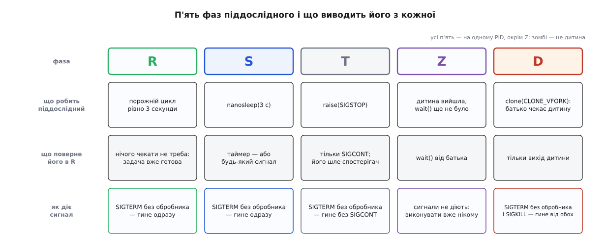
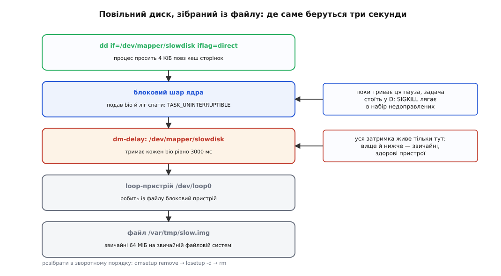

# ⚙️ Спіймати стан D: лабораторія на п'ять літер

Стани процесу більшість людей уперше бачить у чужому `ps` посеред аварії — і саме тоді розбиратися найгірше. Тут зібрано протилежне: піддослідну програму, яка сама себе проводить крізь `R`, `S`, `T`, `Z` і `D` за півхвилини, і спостерігача, який друкує цей шлях смугою символів, де один символ дорівнює одній вибірці.

## Чотири літери задарма й одна складна

Чотири стани з п'яти влаштувати легко, бо кожен з них має очевидний і чіткий привід у поведінці програми.

`R` — це активний порожній цикл, у якому задача виконує арифметичні обчислення й нічого не чекає, отже постійно стоїть у черзі готових або займає процесорне ядро. `S` — системний виклик `nanosleep()`, тобто переривний сон, який обробляється таймером високої роздільності ядра (`hrtimer`) і переривається будь-яким сигналом. `T` — виклик `raise(SIGSTOP)`, при якому ядро знімає задачу з виконання й переводить у стан зупинки `__TASK_STOPPED`: задача не чекає на ресурси, її виконання призупинено адміністративно, і повернути її до роботи може лише сигнал `SIGCONT`. `Z` — процес-дитина, який виконав `_exit()`, звільнивши віртуальну пам'ять, але чий батько ще не викликав `waitpid()`, щоб забрати код виходу зі структури ядра.

Уся складність полягає в тому, щоб надійно зафіксувати стан `D`. Наївна спроба виглядає так: «попросимо в диска прочитати блок даних і подивимося на стан у `ps`». Проте на сучасному NVMe-накопичувачі читання чотирьох кілобайтів триває близько ста мікросекунд, і спостерігач, який опитує `/proc` двадцять разів на секунду (період 50 мілісекунд), у цей крихітний проміжок майже не влучить. Порахуймо ймовірність такого влучання:

```
шанс, що вибірка впаде всередину епізоду ≈ d / T      (для d < T)

d = 100 мкс — епізод непереривного сну під час читання диска
T = 50 мс   — період опитування спостерігача

0.0001 / 0.05 = 0.002  →  0.2 %
```

Тобто щоб побачити такий короткий `D` бодай один раз, треба згенерувати сотні послідовних операцій вводу-виводу. Коротких сплесків звичайним періодичним опитуванням `/proc` не спіймати — для них використовують подійні трасувальні точки ядра, про які йдеться наприкінці.

Отже, для надійного спостереження потрібен непереривний сон, який триває **керовано довго**. Таких способів існує два, і вони цінні саме тим, що демонструють `D` різної природи: один — це гібридний непереривний сон `TASK_KILLABLE`, який можна перервати смертельним сигналом, а другий — непереривний сон у чистому вигляді `TASK_UNINTERRUPTIBLE`, який ігнорує навіть `SIGKILL`.

## Спосіб перший: сон, який дарує vfork

Найдешевший і найпростіший `D` не потребує ні привілеїв `root`, ні справжнього диска, ні додаткових пристроїв. Його дає системний виклик `vfork()` або `clone(CLONE_VFORK)`.

Коли процес породжує дитину з прапорцем `CLONE_VFORK`, ядро зупиняє **батьківський процес** і тримає його заблокованим доти, доки дитина не викличе `execve()` або не завершиться через `_exit()`. Внутрішньо ядро реалізує це через структуру примітива синхронізації `completion` (`vfork_done`). Це і є той рідкісний випадок, коли чекання непереривного сну цілком підконтрольне нашому коду: скільки секунд дитина проспить у `nanosleep()`, стільки батько й простоїть в очікуванні. Системний виклик `clone()` є узагальненням `fork()`, де набором прапорців задається, які саме ресурси дитина поділить із батьком. Стандартний `vfork()` у бібліотеці glibc реалізовано саме через `clone()` із прапорцями `CLONE_VM | CLONE_VFORK` ([vfork, posix_spawn і clone](root:sys-unix/spawn-alternatives)).

Тепер найцікавіше — у якому саме стані чекає батьківський процес. У коді ядра це виклик `wait_for_completion_state()` із `kernel/fork.c`:

```c
static int wait_for_vfork_done(struct task_struct *child,
                               struct completion *vfork)
{
    unsigned int state = TASK_KILLABLE|TASK_FREEZABLE;
    ...
    killed = wait_for_completion_state(vfork, state);
```

Спеціальне константне значення `TASK_KILLABLE` — це не окремий самостійний стан ядра, а сума двох бітових прапорців: `TASK_UNINTERRUPTIBLE` (0x0002) плюс `TASK_WAKEKILL` (0x0100). Проте назовні у простір користувача `/proc` віддає не всі біти `__state`, а лише ті, які проходять крізь маску `TASK_REPORT`; прапорець `TASK_WAKEKILL` до цієї маски не входить. З двох прапорців у підсумкову літеру перетворюється лише перший — і утиліти `ps` чи `top` чесно друкують літеру `D`.

Виходить рівно та класична ситуація, заради якої ставиться цей дослід: перед нами в `ps` висить літера `D`, яка виглядає як безнадійне зависання драйвера, але насправді цей процес слухається сигналу, що його вб'є. З'ясувати цю різницю можна лише практичною дією: надіслати сигнал, якого процес не перехоплює, — `SIGKILL` або звичайний `SIGTERM`, на який обробника не поставлено, — і побачити, що задача негайно прокидається й гине.

Так було не завжди. До ядра 3.3, що вийшло в березні 2012 року, батько при виклику `vfork()` чекав у звичайному непереривному сні `TASK_UNINTERRUPTIBLE`, і процес, що щойно породив дитину, не вбивався жодним сигналом — досить було дитині заснути чи зависнути. Патч, який перевів це очікування на `wait_for_completion_killable()`, надіслав Олег Нестеров (Oleg Nesterov). Обґрунтування зміни було логічним: якщо чекання обривається смертельним сигналом, процес усе одно завершується й не повертається в простір користувача, тож збереження цілісності пам'яті дитини більше не потрібне. Латку схвалив Теджун Хо (Tejun Heo).

## Піддослідний

Програма нічого не обчислює — вона лише по черзі стає в кожен зі станів і голосно повідомляє, у який саме. Виклики `clone()`, `raise(SIGSTOP)` і `_exit()` вжито напряму — щоб між програмою і ядром не стояло нічого зайвого.

:::tabs
```c
/* states.c — піддослідний: сам себе проводити крізь R, S, T, Z і D.
 * Збірка:  cc -O2 -o states states.c
 * Запуск:  ./states &   (у фоні, бо фаза T зупиняє процес)
 */
#define _GNU_SOURCE
#include <sched.h>
#include <signal.h>
#include <stdio.h>
#include <string.h>
#include <sys/mman.h>
#include <sys/wait.h>
#include <time.h>
#include <unistd.h>

static double now(void)
{
    struct timespec ts;
    clock_gettime(CLOCK_MONOTONIC, &ts);
    return ts.tv_sec + ts.tv_nsec * 1e-9;
}

static double t0;

static void banner(const char *tag, const char *why)
{
    fprintf(stderr, "%7.3f  [%s] %s\n", now() - t0, tag, why);
    fflush(stderr);
}

/* Літера стану з /proc/PID/stat.
   Друге поле — ім'я програми в дужках, і воно може містити і пробіли,
   і самі дужки. Тому єдиний надійний спосіб — шукати ОСТАННЮ ')'. */
static char state_of(pid_t pid)
{
    char path[64], buf[512];
    snprintf(path, sizeof path, "/proc/%d/stat", (int)pid);
    FILE *f = fopen(path, "r");
    if (!f) return '?';
    size_t n = fread(buf, 1, sizeof buf - 1, f);
    fclose(f);
    buf[n] = '\0';
    char *p = strrchr(buf, ')');
    return (p && p[1] && p[2]) ? p[2] : '?';
}

/* ── R: нічого не бракує, крім вільного ядра ────────────────────────── */
static void phase_running(double secs)
{
    banner("R", "порожній цикл: задача стоїть у черзі готових");
    double end = now() + secs;
    volatile unsigned long x = 0;
    while (now() < end)
        for (int i = 0; i < 100000; i++) x++;
}

/* ── S: сон, який будить і таймер, і сигнал ─────────────────────────── */
static void phase_sleeping(int secs)
{
    banner("S", "nanosleep: переривний сон");
    struct timespec ts = { secs, 0 };
    nanosleep(&ts, NULL);
}

/* ── T: задача не чекає нічого, їй заборонено бігти ─────────────────── */
static void phase_stopped(void)
{
    banner("T", "raise(SIGSTOP): вийти можна лише через SIGCONT");
    raise(SIGSTOP);
    banner("T", "прийшов SIGCONT — знову в черзі готових");
}

/* ── Z: зомбі. Це окремий PID — наша дитина, не ми ──────────────────── */
static void phase_zombie(int secs)
{
    pid_t kid = fork();
    if (kid == 0) _exit(42);

    struct timespec ts = { 0, 50 * 1000 * 1000 };
    nanosleep(&ts, NULL);                  /* дати дитині вийти */
    fprintf(stderr, "%7.3f  [Z] дитина %d у стані '%c' — код виходу ще нічий\n",
            now() - t0, (int)kid, state_of(kid));

    ts.tv_sec = secs; ts.tv_nsec = 0;
    nanosleep(&ts, NULL);
    waitpid(kid, NULL, 0);
    banner("Z", "wait() забрав код виходу — запис зник");
}

/* ── D: непереривний сон на замовлення ──────────────────────────────── */
#define STACK_SZ (256 * 1024)
static int hold_seconds;

static int vfork_child(void *arg)
{
    struct timespec ts = { *(int *)arg, 0 };
    nanosleep(&ts, NULL);
    _exit(0);
}

static void phase_disk_sleep(int secs)
{
    void *stack = mmap(NULL, STACK_SZ, PROT_READ | PROT_WRITE,
                       MAP_PRIVATE | MAP_ANONYMOUS | MAP_STACK, -1, 0);
    if (stack == MAP_FAILED) { perror("mmap"); return; }

    hold_seconds = secs;
    banner("D", "clone(CLONE_VFORK): батько стоїть, поки дитина не вийде");
    fprintf(stderr, "         спробуйте в іншому терміналі:  kill -TERM %d\n"
                    "         обробника на TERM нема, тож цей D від нього гине\n",
            (int)getpid());
    fflush(stderr);

    pid_t kid = clone(vfork_child, (char *)stack + STACK_SZ,
                      CLONE_VFORK | SIGCHLD, &hold_seconds);
    if (kid < 0) { perror("clone"); return; }

    waitpid(kid, NULL, 0);
    munmap(stack, STACK_SZ);
    banner("D", "дитина вийшла — батько прокинувся");
}

int main(void)
{
    t0 = now();
    setvbuf(stderr, NULL, _IONBF, 0);
    fprintf(stderr, "PID %d\n", (int)getpid());

    phase_running(3.0);
    phase_sleeping(3);
    phase_stopped();
    phase_zombie(3);
    phase_disk_sleep(12);
    return 0;
}
```
```cpp
/* states.cpp — піддослідний мовою C++: сам себе проводить крізь R, S, T, Z і D.
 * Збірка:  g++ -O2 -std=c++20 -o states states.cpp
 * Запуск:  ./states &   (у фоні, бо фаза T зупиняє процес)
 */
#include <chrono>
#include <csignal>
#include <fstream>
#include <iostream>
#include <string>
#include <thread>

#include <sched.h>
#include <sys/mman.h>
#include <sys/wait.h>
#include <unistd.h>

using namespace std::chrono_literals;

static auto t0 = std::chrono::steady_clock::now();

static void banner(const std::string& tag, const std::string& why)
{
    auto dt = std::chrono::duration<double>(std::chrono::steady_clock::now() - t0).count();
    std::clog.width(7);
    std::clog.precision(3);
    std::clog << std::fixed << dt << "  [" << tag << "] " << why << "\n" << std::flush;
}

static char state_of(pid_t pid)
{
    std::ifstream f("/proc/" + std::to_string(pid) + "/stat");
    if (!f) return '?';
    std::string buf((std::istreambuf_iterator<char>(f)), std::istreambuf_iterator<char>());
    auto pos = buf.rfind(')');
    return (pos != std::string::npos && pos + 2 < buf.size()) ? buf[pos + 2] : '?';
}

static void phase_running(double secs)
{
    banner("R", "порожній цикл: задача стоїть у черзі готових");
    auto end = std::chrono::steady_clock::now() + std::chrono::duration<double>(secs);
    volatile unsigned long x = 0;
    while (std::chrono::steady_clock::now() < end) {
        for (int i = 0; i < 100000; ++i) x++;
    }
}

static void phase_sleeping(int secs)
{
    banner("S", "nanosleep: переривний сон");
    std::this_thread::sleep_for(std::chrono::seconds(secs));
}

static void phase_stopped()
{
    banner("T", "raise(SIGSTOP): вийти можна лише через SIGCONT");
    std::raise(SIGSTOP);
    banner("T", "прийшов SIGCONT — знову в черзі готових");
}

static void phase_zombie(int secs)
{
    pid_t kid = fork();
    if (kid == 0) _exit(42);

    std::this_thread::sleep_for(50ms);
    std::clog << "         дитина " << kid << " у стані '" << state_of(kid)
              << "' — код виходу ще нічий\n" << std::flush;

    std::this_thread::sleep_for(std::chrono::seconds(secs));
    waitpid(kid, nullptr, 0);
    banner("Z", "wait() забрав код виходу — запис зник");
}

constexpr size_t STACK_SZ = 256 * 1024;
static int hold_seconds;

static int vfork_child(void* arg)
{
    int secs = *static_cast<int*>(arg);
    std::this_thread::sleep_for(std::chrono::seconds(secs));
    _exit(0);
}

static void phase_disk_sleep(int secs)
{
    void* stack = mmap(nullptr, STACK_SZ, PROT_READ | PROT_WRITE,
                       MAP_PRIVATE | MAP_ANONYMOUS | MAP_STACK, -1, 0);
    if (stack == MAP_FAILED) { std::perror("mmap"); return; }

    hold_seconds = secs;
    banner("D", "clone(CLONE_VFORK): батько стоїть, поки дитина не вийде");
    std::clog << "         спробуйте в іншому терміналі:  kill -TERM " << getpid() << "\n"
              << "         обробника на TERM нема, тож цей D від нього гине\n"
              << std::flush;

    pid_t kid = clone(vfork_child, static_cast<char*>(stack) + STACK_SZ,
                      CLONE_VFORK | SIGCHLD, &hold_seconds);
    if (kid < 0) { std::perror("clone"); return; }

    waitpid(kid, nullptr, 0);
    munmap(stack, STACK_SZ);
    banner("D", "дитина вийшла — батько прокинувся");
}

int main()
{
    t0 = std::chrono::steady_clock::now();
    std::clog << "PID " << getpid() << "\n";

    phase_running(3.0);
    phase_sleeping(3);
    phase_stopped();
    phase_zombie(3);
    phase_disk_sleep(12);
    return 0;
}
```
:::

Два місця тут варті окремого слова.

Перше — `CLONE_VFORK` **без** `CLONE_VM`. Справжній `vfork()` віддає дитині спільну з батьком пам'ять, і саме через це в ній заборонено робити майже все: спільний стек, спільний `errno`, спільні замки всередині libc. Нам ця спільність не потрібна — потрібне лише те, що батько чекає. Тому ми беремо голий `CLONE_VFORK`: дитина дістає власну копію адресного простору, поводиться як звичайна дитина `fork()`, і при цьому батько так само стоїть у `wait_for_vfork_done()`. Власний стек через `mmap()` ми все одно виділяємо, бо `clone()` іншого й не приймає.

Друге — розбір `/proc/PID/stat` через `strrchr(buf, ')')`. Спокуса взяти третє поле через пробіли велика й закінчується завжди однаково: програма з назвою на кшталт `(sd-pam)` або `kworker/u16:2-events` ламає розбір, і спостерігач починає показувати сміття. Ім'я процесу вибирає користувач, а не ви.

## Спостерігач

Спостерігач робить дві речі: раз на 50 мілісекунд читає літеру стану й веде смугу — рядок, у якому один символ дорівнює одній вибірці. На зміну стану він друкує позначку з часом і `wchan`. Плюс одна активна дія: коли процес просидів у `T` довше двох секунд, спостерігач сам шле йому `SIGCONT` — інакше дослід зупиниться назавжди, бо `T` не минає сам.

:::tabs
```sh
#!/bin/sh
# watch-state.sh <pid> [період_мс] — смуга станів одного процесу.
pid=$1
per=${2:-50}
[ -r "/proc/$pid/stat" ] || { echo "немає процесу $pid" >&2; exit 1; }

start=$(date +%s.%N)
nap=$(awk -v p="$per" 'BEGIN{ print p/1000 }')
prev='' band='' held=0 cont=0

elapsed() { awk -v a="$(date +%s.%N)" -v b="$start" 'BEGIN{ printf "%7.3f", a-b }'; }

while [ -r "/proc/$pid/stat" ]; do
    line=$(cat "/proc/$pid/stat" 2>/dev/null) || break
    [ -n "$line" ] || break
    st=${line##*") "}          # ім'я програми може містити ')' — ріжемо по останній
    st=${st%% *}
    band="$band$st"

    if [ "$st" != "$prev" ]; then
        wch=$(cat "/proc/$pid/wchan" 2>/dev/null || echo '?')
        printf '%s  %s   wchan=%s\n' "$(elapsed)" "$st" "$wch"
        prev=$st; held=0
    fi

    held=$((held + 1))
    if [ "$st" = T ] && [ "$cont" -eq 0 ] && [ "$held" -gt $((2000 / per)) ]; then
        kill -CONT "$pid"; cont=1
        printf '%s  →   надіслано SIGCONT\n' "$(elapsed)"
    fi

    sleep "$nap"
done

printf '\nсмуга: %s\n' "$band"
```
```python
#!/usr/bin/env python3
"""watch_state.py <pid> [період_мс] — смуга станів і час у кожному стані."""
import os, signal, sys, time


def state_of(pid):
    with open(f"/proc/{pid}/stat", "rb") as f:
        raw = f.read()
    # ім'я програми — в дужках і може містити ')': ріжемо по ОСТАННІЙ
    return raw[raw.rindex(b")") + 2:].split(b" ", 1)[0].decode()


def wchan_of(pid):
    try:
        with open(f"/proc/{pid}/wchan") as f:
            return f.read().strip() or "0"
    except OSError:
        return "0"


def main():
    pid = int(sys.argv[1])
    nap = (float(sys.argv[2]) if len(sys.argv) > 2 else 50) / 1000
    band, dwell = [], {}
    prev = prev_t = None
    cont_sent = False
    t0 = time.monotonic()

    while True:
        try:
            st = state_of(pid)
        except (OSError, ValueError):
            break
        t = time.monotonic() - t0

        if st != prev:
            if prev is not None:
                dwell[prev] = dwell.get(prev, 0.0) + (t - prev_t)
            print(f"{t:7.3f}  {st}   wchan={wchan_of(pid)}")
            prev, prev_t = st, t
        band.append(st)

        if st == "T" and not cont_sent and t - prev_t > 2.0:
            os.kill(pid, signal.SIGCONT)
            cont_sent = True
            print(f"{t:7.3f}  →   надіслано SIGCONT")

        time.sleep(nap)

    total = time.monotonic() - t0
    if prev is not None:
        dwell[prev] = dwell.get(prev, 0.0) + (total - prev_t)

    print("\nсмуга:", "".join(band))
    for st, sec in sorted(dwell.items(), key=lambda kv: -kv[1]):
        print(f"  {st}: {sec:6.2f} c   ({100 * sec / total:4.1f} %)")


main()
```
:::

Версія на оболонці не потребує нічого, крім `awk`, `date` і `sleep`, який розуміє дробові секунди (coreutils і busybox розуміють). Версія на Python витримує рівніший період і наприкінці підсумовує, скільки часу процес простояв у кожному стані, — саме те число, заради якого такі спостерігачі й пишуть.

## Прогін

```sh
cc -O2 -o states states.c
./states & pid=$!
sh watch-state.sh "$pid"
```

Вивід піддослідного й вивід спостерігача змішуються в одному терміналі, і це якраз добре: видно водночас і те, що програма робить, і те, як це виглядає ззовні.

```
PID 31904
  0.000  [R] порожній цикл: задача стоїть у черзі готових
  0.014  R   wchan=0
  3.001  [S] nanosleep: переривний сон
  3.049  S   wchan=hrtimer_nanosleep
  6.002  [T] raise(SIGSTOP): вийти можна лише через SIGCONT
  6.051  T   wchan=0
  8.104  →   надіслано SIGCONT
  8.106  [T] прийшов SIGCONT — знову в черзі готових
  8.152  S   wchan=hrtimer_nanosleep
  8.157  [Z] дитина 31907 у стані 'Z' — код виходу ще нічий
 11.160  [Z] wait() забрав код виходу — запис зник
 11.161  [D] clone(CLONE_VFORK): батько стоїть, поки дитина не вийде
         спробуйте в іншому терміналі:  kill -TERM 31904
         обробника на TERM нема, тож цей D від нього гине
 11.205  D   wchan=kernel_clone

смуга:
RRRRRRRRRRRRRRRRRRRRRRRRRRRRRRRRRRRRRRRRRRRRRRRRRRRRRRRRRRRRSSSSSSSSSSSSSS
SSSSSSSSSSSSSSSSSSSSSSSSSSSSSSSSSSSSSSSSSSSSSSTTTTTTTTTTTTTTTTTTTTTTTTTTTT
TTTTTTTTTTTTTSSSSSSSSSSSSSSSSSSSSSSSSSSSSSSSSSSSSSSSSSSSSSSSSSSSSSSSSSSSSS
DDDDDDDDDDDDDDDDDDDDDDDDDDDDDDDDDDDDDDDDDDDDDDDDDDDDDDDDDDDDDDDDDDDDDDDDDD
DDDDDDDDDDDDDDDDDDDDDDDDDDDDDDDDDDDDDDDDDDDDDDDDDDDDDDDDDDDDDDDDDDDDDDDDDD
DDDDDDDDDDDDDDDDDDDDDDDDDDDDDDDDDDDDDDDDDDDDDDDDDDDDDDDDDDDDDDDDDDDDDDDDDD
DDDDDDDDDDDDDDDDDD
```

Смуга — найкорисніший рядок у всьому виводі: один символ у ній дорівнює одній вибірці, тож видно не окремі стани, а їхні пропорції. Точне ім'я функції у `wchan` залежить від версії ядра й від того, що інлайнер злив із сусідньою функцією; `kernel_clone`, `wait_for_completion_state` і просто `0` — усе це нормальні відповіді, і жодна з них не є ознакою біди.



*Літера каже, чому задачі немає на процесорі; повернути її може щоразу інша подія — і саме тому станів кілька, а не два.*

Тепер головне. Поки програма стоїть у `D`, надішліть їй з іншого термінала `kill -TERM` — і процес зникне одразу. Це не збій досліду: убиванний сон рве не `SIGKILL` за номером, а будь-який сигнал, після якого повертатися в програму вже нема куди. Обробника на `SIGTERM` піддослідний не ставить, тож ядро оголошує вихід усієї групи потоків і кожному потокові кладе в набір недоправлених `SIGKILL` — саме він і будить сон.

Щоб побачити другу половину правила, поставте на `SIGTERM` порожній обробник — `static void on_term(int s) { (void)s; }` і `signal(SIGTERM, on_term)` на початку `main()` — і зберіть програму наново. Тепер той самий `kill -TERM` сну не обірве: після обробника довелося б чесно вернутися в програму, тож ядро задачу не будить, і сигнал лежить у наборі недоправлених до кінця фази `D`. А `kill -9` і далі вбиває миттєво. Оце й уся зовнішня різниця між убиванним сном і переривним: перший рве лише те, що вбиває. Наступний дослід покаже третій випадок — `D`, з якого не виводить навіть `kill -9`. Літера в усіх трьох та сама, і `ps` цієї різниці не показує ніяк.

## Спосіб другий: диск, який відповідає через три секунди

Щоб побачити `D`, з якого не виводить навіть `SIGKILL`, потрібен пристрій, який поводиться повільно, але передбачувано. Ламати нічого не треба — такий пристрій збирається з файлу за три команди.

Device mapper — підсистема ядра, яка робить блоковий пристрій із **таблиці відображень**: кожен рядок каже, який діапазон секторів кому віддавати й через який шар обробки. Серед цих шарів є `delay` — він просто затримує кожен запит на задану кількість мілісекунд ([device mapper](root:sys-unix/device-mapper)). Тобто повільний диск можна не шукати, а описати.

Другий інгредієнт — `O_DIRECT`. Звичайне читання спершу зазирає в кеш сторінок і, якщо блок там уже є, повертається миттєво, не турбуючи пристрій узагалі; з таким читанням дослід просто не відбувся б. Прапорець `O_DIRECT` каже ядру нести дані повз кеш, прямо між пристроєм і буфером програми ([буферизований і прямий ввід-вивід](root:sys-unix/buffered-and-direct-io)). Задача, яка подала таке читання, чекає на завершення операції в `TASK_UNINTERRUPTIBLE` — тому що операцію вже віддано контролеру й відкликати її нема як.

```sh
#!/bin/bash
# slow-disk.sh — потрібні права root. Робить D, з якого не виводить SIGKILL.
set -e
IMG=/var/tmp/slow.img

modprobe dm-delay || true
truncate -s 64M "$IMG"
LOOP=$(losetup --find --show "$IMG")
dmsetup create slowdisk --table "0 $(blockdev --getsz "$LOOP") delay $LOOP 0 3000"

dd if=/dev/mapper/slowdisk of=/dev/null bs=4k count=1 iflag=direct &
victim=$!

sleep 0.5
echo "--- поки триває читання:"
ps -o pid,stat,wchan:28,comm -p $victim

kill -9 $victim
sleep 0.5
echo "--- через півсекунди після kill -9:"
ps -o pid,stat,wchan:28,comm -p $victim

wait $victim || true
echo "--- операція завершилася — аж тепер сигнал подіяв"

dmsetup remove slowdisk
losetup -d "$LOOP"
rm -f "$IMG"
```

Обидва виклики `ps` покажуть той самий рядок зі станом `D`. Смертельний сигнал уже доправлено, він уже лежить у наборі недоправлених у `task_struct->pending` — і не робить нічого, поки `dm-delay` не відлічить свої три секунди і не викличе асинхронне завершення `bio_endio()`. Порівняйте це з попереднім дослідом: там `kill -9` спрацював миттєво через прапорець `TASK_WAKEKILL` у сні `vfork()`, а тут не спрацював зовсім, бо підсистема блокового вводу-виводу чекає фізичного завершення `bio`. Літера в обох випадках одна — `D`.



*Затримку внесено в один-єдиний шар, а стоїть через неї процес нагорі — і стоїть непереривно, бо запит уже пішов униз.*

Затримку варто підняти до `dmsetup create ... delay $LOOP 0 130000` і не вбивати процес узагалі: за 120 секунд потік `khungtaskd` напише в журнал ядра свій рядок про заблоковану задачу, і ви побачите те саме повідомлення `INFO: task blocked for more than 120 seconds`, що зазвичай приходить із бойового сервера, — тільки на власному лабораторному стенді й із наперед відомою причиною.

## Пастки

**Опитуванням `/proc` короткі стани не ловляться.** Це не хиба спостерігача, а фундаментальне обмеження опитувального методу: епізод сну чи обчислень, коротший за період вибірки (наприклад, 100 мікросекунд на NVMe-диску при періоді 50 мілісекунд), потрапляє у вибірку лише з імовірністю частки відсотка. Коли треба порахувати всі без винятку епізоди `D`, а не лише подивитися на довготривалі зависання, потрібні трасувальні точки ядра. Точка `sched_switch` спрацьовує на кожному перемиканні контексту процесора й серед іншого друкує поле `prev_state` — ту саму літеру стану задачі, яку знімають з процесора ([ftrace і трасувальні точки](root:sys-unix/ftrace-kernel-tracing)):

```sh
cd /sys/kernel/tracing
echo 1 > events/sched/sched_switch/enable
grep --line-buffered 'prev_state=D' trace_pipe
```

Готовий інструмент для цього ж — `offcputime` з набору bcc / bpftrace: він збирає стеки ядра, у яких задача сходила з процесора, і вміє фільтрувати за маскою стану (`--state 2` — це рівно `TASK_UNINTERRUPTIBLE`). Інструмент працює через [eBPF](root:sys-unix/ebpf-programming-model-and-toolchain), майже не навантажуючи систему, і показує, скільки часу поза процесором припало на кожен стек, — тобто відповідає на питання «де саме ми чекали», а не «чи чекали взагалі».

**`ps` за замовчуванням зводить потоки в один рядок.** Стан лежить у полі `__state` конкретної задачі (`task_struct`), а не процесу в цілому, тож у багатопотокової програми станів стільки, скільки потоків ([потоки як задачі](root:sys-unix/threads-as-tasks)). Одного потоку, намертво застряглого в `D`, у звичайному `ps` не видно взагалі: рядок процесу показує літеру лідера групи — скажімо, `S`, якщо лідер спить у переривному сні. Дивитися треба через `ps -L -p <pid>` або перелічувати теку `/proc/<pid>/task/`.

**`wchan` часто дорівнює `0`, і це не помилка.** Ядро віддає символьне ім'я функції лише тому спостерігачеві, якому дозволено доступ рівня `ptrace_may_access()` до цієї задачі — інакше з міркувань безпеки друкується нуль (щоб запобігти витоку розкладки адресної пам'яті ядра KASLR). Нуль вийде й тоді, коли задача не спить (перебуває в `R`), і тоді, коли символ функції не вдалося розпізнати. Так само поводяться `/proc/<pid>/stack` (потрібні права root та ядро, зібране з підтримкою `CONFIG_STACKTRACE`) та решта глибоких полів [procfs](root:sys-unix/proc-reading-process-and-kernel-state).

**Фаза `T` — це пастка для того, хто запустив.** Сигнал `SIGSTOP` не минає ні від часу, ні від закриття сеансу термінала. Якщо запустити піддослідного без спостерігача, він зупиниться назавжди й висітиме в списку процесів; повертає його до роботи лише `kill -CONT <pid>` (убити зупинений процес можна й так — `TASK_STOPPED` будиться на смертельному сигналі, — але це вже не продовження досліду). Тому в нашому лабораторному сценарії сигнал `SIGCONT` надсилає сам спостерігач, а не людина — піддослідна програма не повинна зависати, якщо за нею не стежать.

**`dm-delay` не наводять на робочий диск.** У таблиці device-mapper ви вказуєте блоковий пристрій, і помилка в його імені коштує даних. У досліді підкладкою навмисно служить файл через loop-пристрій (`/dev/loopX`): найгірше, що станеться при помилці, — зіпсуються 64 мебібайти тимчасового файлу в `/var/tmp`. Розбирати тестову конструкцію треба суворо в зворотному порядку — спершу `dmsetup remove slowdisk`, потім `losetup -d $LOOP`, і лише наприкінці видаляти файл. Якщо `dmsetup remove` каже `device-mapper: remove ioctl failed: Device or resource busy`, це означає, що процес `dd` або інший процес іще тримає пристрій відкритим, і його PID слід знайти через `lsof /dev/mapper/slowdisk`.

**Не всюди є з чого будувати.** У контейнерах Docker/Kubernetes без прапорця `--privileged` немає доступу до `/dev/mapper` та немає права завантажувати модулі ядра; у WSL2 ядро Linux справжнє, але зібране з мінімальним набором модулів, і модуля `dm-delay` у ньому може бути не передбачено. Спосіб через `CLONE_VFORK` працює скрізь, де є стандартне ядро Linux, незалежно від прав користувача чи наявності модулів пристроїв.

**Спостерігач сам є процесом.** Кожна вибірка стану — це системні виклики `open`, `read`, `close` по `/proc`, а у версії на оболонці ще й нові процеси `cat`, `date` та `awk` на кожному колі. При періоді 50 мілісекунд цього не помітно, але спроба опитувати раз на мілісекунду перетворює спостерігача на конкурента піддослідного за те саме ядро процесора — і псує рівно те, що він міряє. Треба така роздільність — беріть трасувальні точки ядра або eBPF, а не опитування `/proc`.
