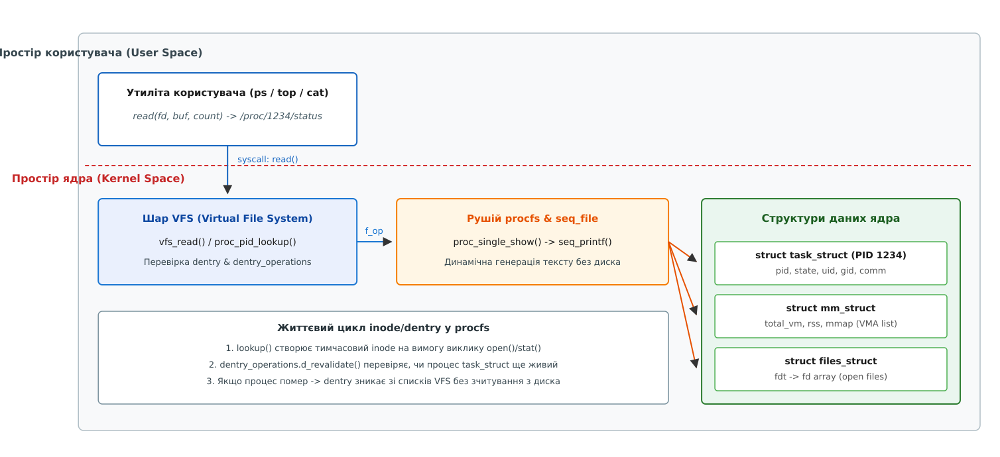

# Архітектура procfs та структура /proc/[pid]

<preknowlist>
- [Віртуальна файлова система VFS](topic:sys-unix/vfs-layer) — абстракція inode, dentry та масиви file_operations.
- [Модель процесів у Linux](topic:sys-unix/process-model) — структура task_struct, ідентифікатори PID та дескриптори ресурсів.
</preknowlist>

Виклик `stat("/proc/1234/status")` повертає `st_size = 0`, а `cat` того самого шляху виводить понад тисячу байтів тексту. Утиліта, яка чесно спитала розмір і виділила буфер під нього, прочитає нуль байтів і вирішить, що про процес нема чого сказати. Розбіжність не є помилкою обліку: файла немає — ні на диску, ні в кеші сторінок. Те, що має вигляд файла, ядро складає з полів `task_struct` у момент читання, а розмір наперед невідомий нікому, бо тексту ще не існує. Саме так псевдофайлова система процесів — procfs (англ. *process file system*) — замінила старий спосіб дізнатися про процес: читання пам'яті ядра через `/dev/kmem` за адресами конкретної збірки, з правами суперкористувача й ризиком зіпсувати ядро записом не за тією адресою. Шлях самої ідеї — від 8th Edition Unix до сьогоднішнього ядра — простежено окремо: [еволюція procfs](topic:sys-unix/procfs-kernel-implementation/hist-procfs-evolution.md).

## Динамічна файлова система без дискового носія

На відміну від класичних файлових систем (ext4, XFS, Btrfs), які відображають блоки даних з фізичних накопичувачів, procfs не має ані блокового пристрою, ані власних даних на ньому: усе, що вона показує, живе в оперативній пам'яті ядра як звичайні структури, а виглядом файлів обростає лише на час читання. У файлове дерево вона потрапляє звичайною командою монтування:

```bash
mount -t proc proc /proc
```

Головна відмінність procfs від звичайних файлових систем полягає у способі створення об'єктів. Коли утиліта користувача (`ps`, `top` або `cat`) відкриває псевдофайл `/proc/1234/status`, ядро не зчитує сектори з диска. Натомість шар VFS викликає внутрішні функції драйвера procfs, які на льоту звертаються до структур даних ядра (`task_struct`, `mm_struct`, `files_struct`), зчитують поточні значення полів і друкують їх у текстовий буфер ядра, звідки готовий текст уже копіюється користувачеві.

### Динамічна генерація інодів та життєвий цикл dentry

Оскільки кількість процесів у системі постійно змінюється, ядро не може тримати статичну таблицю індексних вузлів (англ. *index node, inode*) для всіх потенційних PID. Створення та знищення об'єктів відбувається динамічно під час звернення до VFS.

Коли процес користувача запитує доступ до каталогу `/proc/[pid]`, ядро виконує функцію пошуку `proc_pid_lookup()`. Якщо процес із таким ідентифікатором існує у системному списку `task_struct`, ядро виділяє тимчасовий об'єкт `struct inode` у пам'яті за допомогою `proc_pid_make_inode()` та прив'язує його до запису каталогу (англ. *directory entry, dentry*).

Номер інода теж нема звідки взяти: диска немає. Ранні ядра Linux складали його з PID та внутрішнього типу псевдофайла бітовим зсувом — макрос `fake_ino()`:

```
ino = (pid << 16) | pid_file_type
```

Від цієї схеми відмовилися: у шістнадцять бітів PID перестав уміщатися, а на платформах із широкими PID номери починали збігатися. Сучасне ядро видає інодам procfs наступний вільний номер лічильником `get_next_ino()`, а зв'язок інода з процесом тримає не число, а покажчик `struct pid *` усередині `struct proc_inode`.

Схема викликів генерації контенту при відкритті файлу у procfs:

```
VFS sys_openat("/proc/1234/status")
  → proc_pid_lookup()
    → find_task_by_pid_ns(1234, ns)
    → proc_pid_make_inode()  [генерація inode у RAM]
  → seq_read() → proc_single_show()
    → proc_pid_status()      [форматування даних з task_struct]
```

Особливістю procfs є перевірка актуальності dentry. Оскільки процес може завершити виконання у будь-який момент, шар VFS для procfs реалізує спеціальний масив операцій `dentry_operations` із функцією `d_revalidate()`. Під час кожного звернення до `/proc/[pid]` функція `pid_revalidate()` перевіряє, чи живий іще відповідний `task_struct`, і заразом освіжає в іноді власника та права доступу: вони могли змінитися, якщо процес тим часом виконав `execve()` setuid-бінарника. Якщо процес помер, `d_revalidate()` повертає `0`, і VFS миттєво видаляє недійсний dentry з кешу, унеможливлюючи доступ до застарілих даних без перезавантаження файлової системи.


*Взаємодія VFS з підсистемою ядра через procfs-оператори*

Внутрішньо кожен inode у procfs розширюється спеціальною структурою `struct proc_inode`. Цей контейнер зберігає покажчик на відповідний об'єкт `struct pid`, поле `union proc_op` із конкретним обробником вузла та покажчик на запис каталогу `struct proc_dir_entry`. Заповнені поля різняться за походженням вузла: файли всередині `/proc/[pid]` описані таблицями `pid_entry` прямо в коді procfs і працюють через `union proc_op`, тоді як `pde` заповнюється для статичних записів, створених викликом `proc_create()` (`/proc/meminfo`, файли модулів ядра). Саме для других з ядра 5.6 у записі лежить не загальний `file_operations`, а вужчий `struct proc_ops`: він не тягне за собою десятків полів, потрібних лише справжнім файловим системам, і тому займає менше пам'яті на кожен запис. Незалежно від цього procfs обгортає роботу з таким записом парою `use_pde()`/`unuse_pde()`, які не дають зняти псевдофайл, поки в ньому висить паралельний `read()`.

### Механізм послідовних файлів seq_file

Перші реалізації procfs у ядрі Linux використовували прості буфери читання розміром у одну сторінку пам'яті (4096 байтів). Якщо згенерований текстовий дамп (наприклад, список усіх областей пам'яті у `/proc/[pid]/maps`) перевищував 4 КБ, виникали збої позиціонування та втрата даних при повторних викликах `read()`.

Для вирішення цієї проблеми у ядрі Linux розробили підсистему послідовних файлів — `seq_file` (англ. *sequential file interface*). Механізм `seq_file` надає ітератор над внутрішніми об'єктами ядра за допомогою чотирьох обов'язкових операцій. У просторі ядра C-структура `seq_operations` визначає цей контракт, а у просторі користувача C++ надає його ідіоматичний еквівалент через концепцію послідовного генератора даних.

:::tabs
```c
struct seq_operations {
    void *(*start) (struct seq_file *m, loff_t *pos);
    void  (*stop)  (struct seq_file *m, void *v);
    void *(*next)  (struct seq_file *m, void *v, loff_t *pos);
    int   (*show)  (struct seq_file *m, void *v);
};
```
```cpp
// Ідіоматичний еквівалент ітератора послідовного потоку у C++
template <typename T>
class SeqStreamIterator {
public:
    virtual ~SeqStreamIterator() = default;
    virtual std::optional<T> start(off_t& pos) = 0;
    virtual std::optional<T> next(off_t& pos) = 0;
    virtual void stop() = 0;
    virtual std::string render_item(const T& item) = 0;
};
```
:::

Коли утиліта читає великий псевдофайл через `seq_file`, ядро покроково викликає:
1. `start()` — знаходить перший об'єкт (наприклад, першу область віртуальної пам'яті `vm_area_struct`) за поточним офсетом `pos`;
2. `show()` — записує текстове представлення об'єкта у внутрішній буфер за допомогою `seq_printf()`;
3. `next()` — переходить до наступного елемента списку;
4. `stop()` — звільняє захоплені ядерні блокування (spinlock або секцію читання RCU) після завершення порції вводу-виводу.

Завдяки `seq_file` розробникам ядра більше не потрібно турбуватися про межі буферів користувача: якщо запис не вмістився, підсистема викидає недописане, виділяє вдвічі більший буфер і повторює `show()` з початку того самого запису. Гарантія тут саме поштучна: окремий запис ніколи не потрапить до користувача розрізаним навпіл — а от увесь файл, зібраний із кількох викликів `read()`, знімком одного моменту не є.

## Анатомія та внутрішня структура каталогу /proc/[pid]

Кожен активний процес в операційній системі Linux отримує власний каталог у `/proc`, названий за його числовим PID. Структура цього каталогу є уніфікованою для всіх процесів і розкриває майже всі аспекти життєвого циклу програми.

![Структура та анатомія каталогу /proc/[pid]](img/proc-pid-structure.svg)
*Ієрархія та ключові вузли каталогу процесу у procfs*

Детальний список усіх доступних вузлів, їхніх прав доступу та типів даних міститься у специфікації [Довідник вузлів та псевдофайлів каталогу /proc/[pid]](topic:sys-unix/procfs-kernel-implementation/api-proc-pid-nodes.md).

### Метадані та стан виконання

У корені каталогу процесу розташовані псевдофайли, що відображають ідентифікацію та параметри запуску:

* `cmdline` — містить повний масив аргументів командного рядка (`argv`), переданих процесу під час запуску. Аргументи відокремлені один від одного нульовими байтами (`\0`). Якщо процес є потоком ядра (kernel thread), цей файл порожній.
* `environ` — містить змінні середовища оточення процесу, також відокремлені нульовими байтами `\0`. З міркувань безпеки зчитування цього файла дозволено лише власникові процесу або процесам із привілеєм `CAP_SYS_PTRACE`.
* `status` — людиночитаний текстовий файл, що містить зведені метрики стану процесу: ідентифікатори користувачів (Uid: real, effective, saved, fs), маски сигналів, статистику використання пам'яті (VmSize, VmRSS, VmData) та кількість потоків (Threads).
* `stat` — машинночитаний дамп полів у один рядок, де 52 параметри розділені пробілами (PID, назва в дужках, стан, PPID, кванти часу користувача `utime` та ядра `stime`). Саме цей файл зчитують утиліти `ps` та `top` для мінімізації накладних витрат на парсинг.

### Віртуальна пам'ять та ресурси

Для аналізу розподілу оперативної пам'яті procfs надає доступ до структури `mm_struct`:

* `maps` — розкриває списки областей віртуальної пам'яті (Virtual Memory Areas, VMA). Кожен рядок описує діапазон адрес, права доступу (`rwxp` — read, write, execute, private/shared), зміщення у файлі, пристрій, inode та ім'я прив'язаного файла (наприклад, динамічної бібліотеки `.so`) або системний тег на кшталт `[stack]`.
* `smaps` — надає розширену деталізацію для кожної VMA. Вона містить метрики PSS (Proportional Set Size — частка пам'яті з урахуванням спільного використання декількома процесами), RSS, Private Clean/Dirty та Swap.
* `mem` — бінарний псевдофайл, що надає прямий доступ до віртуального адресного простору процесу. Відкриття та зчитування цього файла за допомогою `lseek()` та `read()` дозволяє відлагоджувачам (наприклад, `gdb`) інспектувати та модифікувати змінні процесу у пам'яті.

### Файлові дескриптори та магічні посилання

Каталог `/proc/[pid]/fd/` містить символічні посилання на всі відкриті процесом файлові дескриптори. Кожен запис у цьому каталозі є числом (`0` — stdin, `1` — stdout, `2` — stderr, `3`, `4`...), що вказує на відповідний файл, сокет або анонімний канал (pipe).

Сусідній каталог `/proc/[pid]/fdinfo/` містить текстові метадані для кожного дескриптора:
```
pos:    4096
flags:  02100002
mnt_id: 29
ino:    131078
```
Поле `pos` вказує поточну позицію каретки читання/запису, а `flags` — вісімкова маска прапорів, з якими було виконано системний виклик `open()`. Наведене `02100002` розкладається на `O_RDWR` (`02`), `O_LARGEFILE` (`0100000`) і `O_CLOEXEC` (`02000000`).

Окремої уваги заслуговують так звані «магічні символічні посилання» (англ. *magic symlinks*):
* `cwd` — посилається на поточний робочий каталог процесу;
* `exe` — посилається на бінарний виконуваний файл на диску;
* `root` — посилається на кореневий каталог процесу (враховує ізоляцію `chroot`).

На відміну від звичайних symlink на файловій системі, які зберігають шлях як текстовий рядок, магічні посилання у procfs вказують безпосередньо на об'єкт `struct path` у ядрі. Якщо бінарний файл було видалено з диска під час виконання процесу, виклик `readlink("/proc/[pid]/exe")` поверне шлях із позначкою ` (deleted)`, але файл залишатиметься доступним для зчитування через магічне посилання.

Внутрішньо при запиті розкодування `/proc/[pid]/fd/N` ядро виконує функцію `proc_fd_link()`. Вона знаходить `struct file` за номером `N` у таблиці дескрипторів `files_struct` цільового процесу (`fget_task()`), копіює з нього готовий `struct path` і бере на цей шлях власне посилання через `path_get()` — щоб дорога до файла не розсипалася, поки VFS її розкодовує. Якщо дескриптор є сокетом, `readlink()` повертає рядок `socket:[inode]`, де `inode` відповідає внутрішньому індексу сокета у віртуальній файловій системі сокетів `sockfs`.

### Багатопотоковість та простори імен

Для підтримки POSIX-потоків у ядрі Linux кожен потік має власну структуру `task_struct` та власний ідентифікатор TID (Thread ID). Усередині каталогу `/proc/[pid]/task/` створено підкаталоги для кожного потоку виконання процесу:

```
/proc/1234/task/
├── 1234/   (головний потік, TID = PID)
├── 1235/   (робочий потік 1)
└── 1236/   (робочий потік 2)
```

Кожен підкаталог `/proc/[pid]/task/[tid]/` має таку саму структуру файлів, як і батьківський `/proc/[pid]`, що дає змогу вимірювати використання пам'яті, процесорного часу та масок сигналів для кожного окремого потоку.

Підкаталог `/proc/[pid]/ns/` містить магічні посилання на простори імен (namespaces), у яких виконується процес:
```
net -> net:[4026531993]
pid -> pid:[4026531836]
mnt -> mnt:[4026531992]
```
Число у дужках — це inode простору імен у файловій системі `nsfs`; два процеси в одному просторі імен дають однакове число, і саме так порівнюють належність. Сталими є лише номери початкових просторів імен `pid`, `ipc`, `uts`, `user` і `cgroup` — вони зашиті константами `PROC_*_INIT_INO` (наприклад, `PROC_PID_INIT_INO` = `0xEFFFFFFC` = 4026531836, як у наведеному виводі). Номери для `mnt` і `net` таких констант не мають і роздаються лічильником під час завантаження, тож на іншій системі вони будуть іншими.

Зчитування індекса inode цих посилань або передача відкритих дескрипторів із `/proc/[pid]/ns/` у системний виклик `setns()` є основою ізоляції та функціонування контейнерних середовищ (Docker, LXC, systemd-nspawn).

> 🔧 **Навіщо це.**
> Половина звичних діагностичних утиліт — це обгортки над цим каталогом, і поводяться вони рівно так, як дозволяє його будова. Утиліта `lsof` знаходить відкриті сокети та файли шляхом сканування каталогів `/proc/[pid]/fd/`; контейнерні агенти витягують метрики CPU та RAM з `/proc/[pid]/statm` та `/proc/[pid]/cgroup`; а інструменти відлагодження відновлюють знімки виконання через магічні посилання `/proc/[pid]/exe` та `/proc/[pid]/mem`.

## Взаємодія з просторами імен PID (PID Namespaces)

У сучасних Linux-системах ідентифікатор процесу не є абсолютним значенням. Один і той самий процес може мати PID 1 усередині ізольованого контейнера і PID 4021 у кореневому просторі імен хост-системи.

Кожен простір імен PID (`pid_namespace`) зберігає власну ієрархію об'єктів `struct pid`. Коли у контейнері виконується команда монтування `mount -t proc proc /proc`, VFS створює екземпляр procfs, прив'язаний до поточного `pid_namespace` даного процесу.

Внутрішньо простір імен procfs бере не з процесу-читача, а з власного суперблоку: `ns = dentry->d_sb->s_fs_info`. Пошук за іменем каталогу виконує `find_task_by_pid_ns(tgid, ns)` — число з імені шукається лише серед тих `struct pid`, які видно в цьому просторі. Зворотний бік тієї самої медалі — `task_pid_nr_ns(task, ns)`: коли procfs перелічує каталоги або друкує `Pid:` у `status`, він показує номер, який процес має саме в `ns`, а не в кореневому просторі. Завдяки цьому:
1. Процес у контейнері бачить у каталозі `/proc` лише ті процеси, які належать його власному або вкладеним просторам імен PID.
2. Процеси хост-системи не відображаються у `/proc` контейнера, унеможливлюючи витік інформації про зовнішнє середовище.
3. Команди `ps` або `top`, запущені всередині контейнера, відображають номери PID відносно локального простору імен (з PID 1 на чолі).

Якщо замість монтування нового екземпляра procfs виконати звичайне перемонтування каталогу (`mount --bind /proc /container/proc`), процес у контейнері отримає доступ до інформації хоста. Саме тому ізоляція procfs через нові екземпляри `mount -t proc` є обов'язковим кроком при старті контейнерів.

## Розширений механізм взаємодії ядра та procfs

Чотири рядки схеми на початку статті приховують найцікавіше: де саме ядро бере блокування, у якому буфері народжується текст і чий процесорний час на це витрачається. Пройдімо той самий шлях повільно — хай утиліта `top` запитує вміст `/proc/1234/status`:

1. **Системний виклик `openat()`**: Передає шлях VFS, яка звертається до `proc_pid_lookup()`. Функція шукає `struct pid` за числом з імені каталогу — і не серед усіх процесів системи, а лише в таблиці ідентифікаторів того простору імен, до якого прив'язано цей екземпляр procfs. Якщо `struct pid` знайдено, ядро інстанціює об'єкт `proc_inode` за допомогою `proc_pid_make_inode()`.
2. **Системний виклик `read()`**: Шар VFS перенаправляє запит на масив `proc_single_file_operations`, читанням у якому завідує обробник `seq_read()`.
3. **Генерація контенту**: Підсистема `seq_file` викликає функцію `proc_single_show()`, яка всередині звертається до `proc_pid_status()`. Та бере потрібні блокування (`task_lock()`, читання під RCU), щоб поля не змінилися посеред знімка, форматує текстові рядки у внутрішній буфер ядра за допомогою `seq_printf()` — і відпускає блокування одразу, щойно поля скопійовано.
4. **Передавання буфера**: Надрукований текстовий блок копіюється з пам'яті ядра у буфер користувача викликом `copy_to_user()`.

Простір користувача при цьому не торкається внутрішніх структур: назовні виходить лише текст, надрукований під потрібними блокуваннями. Але «миттєвим фото» цей текст не є — між друком одного поля й наступного процес живе далі, тож рядки одного `status` цілком можуть належати трохи різним моментам.

### Особливості процесів-зомбі та блокувань вводу-виводу

У життєвому циклі процесів виникають крайові стани, які по-особливому виявляються в procfs:

* **Зомбі-процеси (стан Z)**: Коли процес завершує виконання, але батьківський процес ще не зчитав його код виходу викликом `waitpid()`, `task_struct` залишається у списку процесів ядра. Каталог `/proc/[pid]` залишається доступним для зчитування файлів `status` та `stat`, проте псевдофайли віртуальної пам'яті (`mem`, `maps`, `smaps`) повертають 0 байтів, оскільки `mm_struct` процесу вже повністю вивантажено викликом `mmput()`.
* **Процеси у сні, що не переривається сигналами (стан D)**: Якщо процес застряг в очікуванні відповіді від заблокованої файлової системи (наприклад, NFS) або апаратного пристрою, він може заснути, тримаючи блокування свого адресного простору `mmap_lock` (до ядра 5.8 воно звалося `mmap_sem`). Читач `/proc/[pid]/maps` чи `smaps` мусить узяти те саме блокування на читання — і засне поруч із ним. Тому агент моніторингу, який обходить усі процеси в один потік, зависає цілком через один-єдиний процес у стані D; натомість `stat` бере лічильники прямо з `task_struct` і `mm_struct`, не проходячи списком областей, тож читається далі.

## Простеження та діагностика через ftrace і eBPF

Для низькорівневого аналізу того, як процеси звертаються до procfs, можна використовувати системне простеження eBPF або класичну підсистему ftrace. Ядро Linux містить вбудовані точки простеження (tracepoints) для системних викликів вводу-виводу:

```bash
# Простеження відкриття псевдофайлів procfs за допомогою trace-cmd
trace-cmd record -e syscalls:sys_enter_openat -f 'filename.ustring ~ "/proc/*"'
```

Суфікс `.ustring` тут обов'язковий: поле `filename` у `sys_enter_openat` — це покажчик у простір користувача, і без суфікса фільтр порівнював би з адресою, а не з рядком. Підтримку `.ustring` додано в ядрах 5.x початку 2020-х; на старіших фільтрувати доведеться вже у знятому виводі.

Профіль такого запису показує, що додатки з інтенсивним читанням `/proc` витрачають суттєву частку часу у функціях `proc_single_show()` та `seq_read()`. Важливо, чий це час: генерація тексту йде синхронно, у контексті процесу-читача і в його кванті часу. Ядро не має фонового потоку, який готував би вміст `/proc` заздалегідь, — тож уся ціна форматування лягає на того, хто викликав `read()`.

## Права доступу та механізми безпеки

Доступ до інформації у procfs регулюється жорсткими правилами безпеки для запобігання витоку чутливих даних (паролів зі змінних оточення, адрес пам'яті для обходу ASLR або вмісту файлів інших користувачів).

### Перевірка прав при відкритті та зчитуванні

Права доступу на каталоги `/proc/[pid]` визначаються власником процесу (UID та GID). За замовчуванням будь-який користувач системи може переглядати перелік процесів та зчитувати основні псевдофайли (`cmdline`, `status`, `stat`).

Однак для вузлів, що показують адресний простір (`environ`, `mem`, `maps`, `pagemap`), ядро виконує додаткову перевірку функцією `ptrace_may_access()`: чи має процес-читач привілей `CAP_SYS_PTRACE`, чи збігаються його ідентифікатори EUID/EGID із власником цільового процесу. Строгість перевірки різна — `environ`, `maps` і `pagemap` відкриваються за режимом `PTRACE_MODE_READ`, а `mem`, у який можна й писати, вимагає повного `PTRACE_MODE_ATTACH`.

Ключове тут — **де саме** стоїть перевірка. Усі ці вузли відкриває спільна функція `proc_mem_open()`, і саме вона одноразово викликає `mm_access()`; далі отримана `struct mm_struct` осідає в `file->private_data`, а обробник читання `mem_rw()` прав уже не переперевіряє. Наслідок для класичної гонки — коли ціль між `open()` і `read()` виконує `execve()` setuid-бінарника (`su`, `passwd`) — виглядає так: дескриптор і далі вказує на **старий** `mm_struct`, той самий, доступ до якого вже було дозволено. Нового, привілейованого адресного простору він не бачить узагалі, тож витоку немає; читання поверне те, що лишилося від померлої пам'яті, або нуль байтів, якщо її вже звільнено. Помилки `EACCES` на цьому `read()` очікувати не варто: так поводилися старі ядра, які тримали `check_mem_permission()` на кожному читанні, — з переходом на модель «перевірка при відкритті, утримання `mm`» (ядра 3.x) цю перевірку прибрали як зайву.

Вузол `stack` до цієї групи не належить, хоч і виглядає так само чутливо: він показує не пам'ять процесу, а розгортку його ядерного стека, а це вже адреси символів ядра. Тому гейт у нього інший і жорсткіший — `file_ns_capable(..., CAP_SYS_ADMIN)` у самій функції `proc_pid_stack()`; збігу EUID із власником процесу тут не досить, і навіть власний `/proc/self/stack` без `CAP_SYS_ADMIN` віддає `EACCES`.

### Опції монтування hidepid та subset

Для посилення ізоляції у багатокористувацьких системах та контейнерах ядро Linux підтримує опції монтування `hidepid` та `subset`:

```bash
mount -o remount,hidepid=2,subset=pid /proc
```

Параметр `hidepid` приймає чотири основних значення:
* `hidepid=off` (або `hidepid=0`, типово) — усі користувачі бачать каталоги `/proc/[pid]` усіх процесів у системі.
* `hidepid=noaccess` (або `hidepid=1`) — звичайні користувачі бачать каталоги чужих процесів, але не можуть отримати доступ до їхніх внутрішніх псевдофайлів (`cmdline`, `status` тощо). Спроба відкриття повертає помилку `EACCES`.
* `hidepid=invisible` (або `hidepid=2`) — каталоги чужих процесів стають повністю невидимими для звичайних користувачів. Виклик `stat("/proc/[other_pid]")` або сканування списку каталогів повертає помилку `ENOENT` (No such file or directory), наче процесу взагалі не існує у системі.
* `hidepid=ptraceable` (або `hidepid=4`, з ядра Linux 5.8) — у `/proc` лишаються видимими лише ті процеси, які викликач має право трасувати через `ptrace()`; решта зникає так само, як за `invisible`.

Словесні назви режимів (`off`, `noaccess`, `invisible`, `ptraceable`) додано в ядрі Linux 5.8 разом із режимом `ptraceable`; числа працюють і на старіших ядрах, починаючи з 3.3.

Опція `subset=pid` (з ядра Linux 5.8) ховає з кореня `/proc` усі глобальні файли системи (`/proc/sys`, `/proc/meminfo`, `/proc/cpuinfo`), залишаючи доступними виключно каталоги процесів `/proc/[pid]`, що є стандартом безпеки для ізольованих контейнерних середовищ.

## Практична реалізація та ціна використання

Для отримання метричних даних про процеси у власному програмному забезпеченні немає потреби викликати зовнішні утиліти командного рядка (`ps` або `top`). Пряме зчитування псевдофайлів у procfs виконується за допомогою стандартних викликів вводу-виводу.

Приклад практичної утиліти для аналізу стану процесів мовами C та C++ з детальною обробкою помилок наведено у матеріалі [Практичний інспектор процесів через procfs](topic:sys-unix/procfs-kernel-implementation/proj-procfs-pid-inspector.md).

### Продуктивність та накладні витрати

Попри зручність текстового інтерфейсу, procfs має суттєву ціну з погляду продуктивності:

1. **Форматування і зворотний розбір**: Під час кожного зчитування ядро витрачає процесорний час на перетворення внутрішніх двійкових полів у текстові рядки за допомогою `snprintf()` або `seq_printf()`. Потім програма користувача витрачає час на зворотний парсинг рядків за допомогою `sscanf()` або `strtok()`.
2. **Накладні витрати VFS**: Відкриття, зчитування та закриття файлів супроводжуються викликами `open()`, `read()`, `close()`, виділенням тимчасових inode у пам'яті та оновленням кешу dentry.

При постійному опитуванні тисяч процесів (наприклад, у високонавантажених агентах моніторингу) регулярне сканування `/proc/[pid]/stat` може створювати високе навантаження на процесор та VFS. Для оптимізації високочастотного збору системних метрик у сучасних версіях Linux використовують підсистему eBPF (Extended Berkeley Packet Filter) або сокети `netlink` із протоколом `taskstats`, які передають бінарні структури даних ядра безпосередньо в простір користувача без створення файлових об'єктів у procfs.
