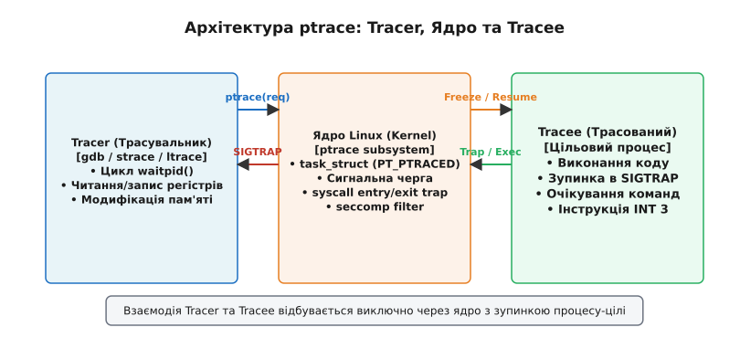
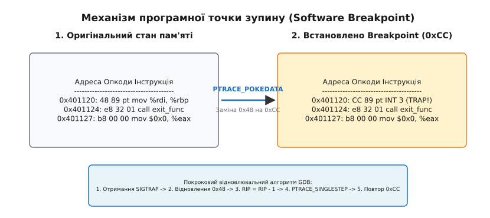
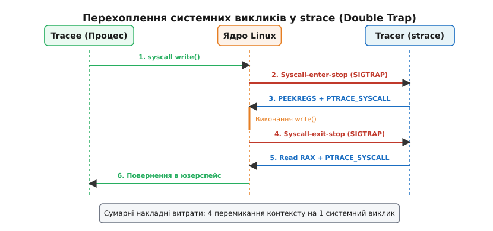

# ptrace: на чому тримається трасування й налагодження

<preknowlist>
- [Ядро й простір користувача](topic:sys-unix/kernel-and-userspace) — системні виклики, віртуальна пам'ять та перемикання контексту.
- [Системний виклик: як програма просить ядро](topic:sys-unix/syscall-mechanics) — механізм перемикання контексту та обробки системних викликів.
- [Архітектура та доставка сигналів](topic:sys-unix/signal-model) — сигнальна система ядра Linux, маски сигналів, доставка SIGTRAP та SIGSTOP.
</preknowlist>

Уявіть ситуацію: виконуваний файл, скомпільований без налагоджувальної інформації, раптово завершується з помилкою сегментації (`Segmentation fault`) за віртуальною адресою `0x401140`, або високонавантажений веб-сервер зупиняє обробку запитів і безконечно блокується всередині виклику `epoll_wait()`. У сучасних операційних системах апаратні механізми захисту віртуальної пам'яті (такі як таблиці сторінок MMU та рівні привілеїв CPU Ring 0 / Ring 3) жорстко ізолюють кожен процес. Процесорні регістри, вказівник верхівки стека (`%rsp`) та лічильник інструкцій (`%rip`) є приватним, недоторканним станом конкретного потоку виконання. Звичайний процес користувача A принципово позбавлений можливості зупинити виконання процесу B, прочитати його стек або змінити його інструкції.

Для того щоб інструменти налагодження (такі як `gdb` чи `lldb`) або трасувальники системних викликів (такі як `strace`) могли безпечно контролювати виконання іншої програми, операційна система дає спеціальний контрольований чорний хід крізь межі ізоляції процесів — системний виклик `ptrace` (від англійського *process trace*).

Глибоке розуміння `ptrace` — це ключ до розуміння архітектури налагоджувачів, механіки програмних і апаратних точок зупину (breakpoints / watchpoints), технологій ін'єкції коду та причин, чому сучасна аналітика продуктивності масово переходить від інструментів користувацького простору до підсистем усередині ядра, таких як `eBPF`.


*Архітектура ptrace: Tracer, Ядро та Tracee.*

---

## 1. Архітектура взаємодії: Tracer, Tracee та ядро Linux

Модель `ptrace` описує асиметричну взаємодію двох процесів у користувацькому просторі, де ядро операційної системи виступає арбітром, контролером та єдиним виконавцем усіх маніпуляцій:

- **Tracer (Трасувальник):** Процес-господар, який викликає `ptrace()`, керує покроковим виконанням цільової програми, аналізує її стан і приймає рішення про продовження або зупинку.
- **Tracee (Трасований):** Цільовий процес або окремий потік виконання (LWP — Light-Weight Process), чия робота перебуває під повним контролем трасувальника.
- **Підсистема ptrace у ядрі:** Перехоплює сигнали, винятки процесора та системні виклики tracee, переводить його в спеціальний стан зупинки (`TASK_TRACED`) і сповіщає tracer через сигнальну систему та системний виклик `waitpid()`.

Відношення трасування є суворо асиметричним: один трасувальник може одночасно контролювати декілька процесів-tracee, але кожен окремий tracee у будь-який момент часу може трасуватися лише **одним** трасувальником.

### Зміни у внутрішніх структурах ядра (task_struct)

Коли процес стає під трасування, ядро Linux модифікує його внутрішню структуру `task_struct`:

1. У полі `task->ptrace` виставляється бітовий прапор `PT_PTRACED`, який вказує всім підсистемам ядра (обробникам переривань, сигнальній системі та диспетчеру системних викликів), що цей процес перебуває під наглядом.
2. Вказівники ієрархії процесів змінюються: оригінальний батьківський процес зберігається у полі `task->real_parent`, тоді як поле `task->parent` тимчасово перенаправляється на процес-tracer. Це необхідно для того, щоб саме tracer отримував сповіщення про зміну стану процесу через системний виклик `waitpid()`.
3. Усі сигнали, які надходять до tracee, не доставляються йому негайно. Вони перехоплюються ядром і перенаправляються у чергу ptrace-зупинок для перевірки трасувальником.

### Збереження стану процесора у структурі pt_regs

Під час будь-якого переходу з користувацького простору в ядро (чи то через виняток процесора `INT 3`, чи через системний виклик `syscall`), процесор автоматично зберігає селектори стека та лічильник інструкцій. Потім ядро Linux у перших інструкціях обробника виклику формує на стеку ядра процесу структуру `struct pt_regs`.

Ця структура зберігає повне дзеркало всіх регістрів процесора на момент зупинки (`rax`, `rbx`, `rcx`, `rdx`, `rsi`, `rdi`, `rbp`, `rsp`, `r8`–`r15`, `rip`, `eflags`). Коли tracer запитує регістри через `PTRACE_GETREGS`, ядро просто копіює ці значення зі структури `pt_regs` на стеку ядра у користувацький буфер трасувальника.

Історичний екскурс про виникнення `ptrace` у 7-й редакції Unix (1979 рік) для PDP-11 та його еволюцію описано у вставці [📜 Історія виникнення та еволюції ptrace](topic:sys-unix/ptrace-model/hist-ptrace.md).

---

## 2. Ініціалізація трасування: PTRACE_TRACEME та PTRACE_ATTACH

Для встановлення контролю над цільовим процесом у POSIX-системах існує два фундаментальні сценарії: запуск нового процесу "під трасуванням" із нуля або приєднання до вже запущеного процесу в системі.

### Сценарій A: Запуск нового процесу під наглядом (PTRACE_TRACEME)

Цей сценарій є стандартним, коли розробник запускає програму безпосередньо усередині налагоджувача (наприклад, `gdb ./my_binary` або `strace ./my_binary`).

Послідовність системних викликів розгортається наступним чином:

1. **Форкування:** Трасувальник викликає системний виклик `fork()`, створюючи новий дочірній процес.
2. **Добровільна згода на трасування:** Усередині дочірнього процесу (до завантаження коду нової програми) викликається `ptrace(PTRACE_TRACEME, 0, NULL, NULL)`. Цей виклик встановлює прапор `PT_PTRACED` у структурі `task_struct` дочірнього процесу.
3. **Самозупинка або execve:** Дочірній процес зазвичай надсилає собі сигнал `SIGSTOP` через `raise(SIGSTOP)` або одразу викликає `execve()`.
4. **Перехоплення execve ядром:** При виконанні `execve()` ядро бачить прапор `PT_PTRACED`. Після формування нового адресної мережі та завантаження ELF-сегментів, але **до виконання першої машини інструкції** коду програми, ядро зупиняє процес і надсилає батькові сигнал `SIGTRAP`.
5. **Очікування у waitpid:** Трасувальник у цей час блокується у системному виклику `waitpid()`. Отримавши сповіщення про зупинку дочірнього процесу, tracer бере контроль і починає налагодження.

:::tabs
```c
#include <stdio.h>
#include <stdlib.h>
#include <unistd.h>
#include <sys/ptrace.h>
#include <sys/wait.h>

void launch_target_under_trace(const char *binary_path) {
    pid_t pid = fork();
    if (pid < 0) {
        perror("fork failed");
        exit(EXIT_FAILURE);
    }

    if (pid == 0) {
        /* Дочірній процес: оголошуємо дозвіл на трасування */
        if (ptrace(PTRACE_TRACEME, 0, NULL, NULL) < 0) {
            perror("ptrace(TRACEME) failed");
            exit(EXIT_FAILURE);
        }
        /* Призупиняємо виконання до того, как батько налаштує опції */
        raise(SIGSTOP);
        execl(binary_path, binary_path, NULL);
        perror("execl failed");
        exit(EXIT_FAILURE);
    } else {
        /* Батьківський процес (Tracer) */
        int status;
        waitpid(pid, &status, 0);
        if (WIFSTOPPED(status)) {
            printf("[Tracer] Tracee stopped successfully, signal: %d\n", WSTOPSIG(status));
        }
        /* Продовжуємо виконання цільової програми */
        ptrace(PTRACE_CONT, pid, NULL, NULL);
    }
}
```
```cpp
#include <iostream>
#include <system_error>
#include <unistd.h>
#include <sys/ptrace.h>
#include <sys/wait.h>

void launch_target_under_trace_cpp(const char* binary_path) {
    const pid_t pid = ::fork();
    if (pid < 0) {
        throw std::system_error(errno, std::generic_category(), "fork failed");
    }

    if (pid == 0) {
        if (::ptrace(PTRACE_TRACEME, 0, nullptr, nullptr) < 0) {
            std::perror("ptrace(TRACEME) failed");
            std::_Exit(EXIT_FAILURE);
        }
        ::raise(SIGSTOP);
        ::execl(binary_path, binary_path, nullptr);
        std::perror("execl failed");
        std::_Exit(EXIT_FAILURE);
    }

    int status = 0;
    if (::waitpid(pid, &status, 0) < 0) {
        throw std::system_error(errno, std::generic_category(), "waitpid failed");
    }

    if (WIFSTOPPED(status)) {
        std::cout << "[Tracer] Tracee stopped successfully, signal: " 
                  << WSTOPSIG(status) << "\n";
    }

    ::ptrace(PTRACE_CONT, pid, nullptr, nullptr);
}
```
:::

### Сценарій B: Приєднання до працюючого процесу (PTRACE_ATTACH / PTRACE_SEIZE)

Для налагодження вже запущених фонових процесів або сервісів використовуються команди приєднання:

- `PTRACE_ATTACH`: Трасувальник передає `pid` цільового процесу. Ядро перевіряє права доступу, встановлює прапор трасування і надсилає tracee сигнал `SIGSTOP`. Процес зупиняється, а tracer дізнається про це через `waitpid()`.
- `PTRACE_SEIZE`: Сучасна команда (Linux 3.4+). Вона приєднує tracer до процесу **без** примусової відправки сигналу `SIGSTOP`. Процес продовжує звичайне виконання, поки tracer не надрукує команду зупинки `PTRACE_INTERRUPT`.

Повний довідник команд `ptrace` та кодів помилок наведено у матеріалі [📋 Інтерфейс системного виклику ptrace та пов'язані структури](topic:sys-unix/ptrace-model/api-ptrace.md).

### Обмеження безпеки Yama LSM (ptrace_scope)

Приєднання до стороннього процесу є критичною операцією з точки зору кібербезпеки. У ядрі Linux модуль безпеки **Yama LSM** контролює приєднання через конфігураційний параметр `/proc/sys/kernel/ptrace_scope`:

- `0` (**Classic**): Будь-який процес користувача може трасувати будь-який інший процес того самого користувача.
- `1` (**Restricted**): Стандарт для більшості дистрибутивів. Процес може трасувати лише свої прямо породжені дочірні процеси. Для приєднання `gdb -p` цільовий процес повинен надати дозвіл через `prctl(PR_SET_PTRACER, pid)`.
- `2` (**Admin only**): Трасування дозволено лише процесам із правом `CAP_SYS_PTRACE` (користувачу `root`).
- `3` (**No ptrace**): `ptrace` повністю заблоковано в системі без можливості увімкнення до перезавантаження.

---

## 3. Модель подій та види ptrace-зупинок

Основний цикл роботи трасувальника побудовано навколо очікування подій від ядра. Коли процес перебуває під трасуванням, він зупиняється не випадково, а у строго визначених точках життєвого циклу. Усі ці зупинки називаються **ptrace-stops**.

Коли tracee входить у стан ptrace-stop, ядро призупиняє його виконання, змінює стан на `TASK_TRACED`, зберігає процесорні регістри на стеку ядра та розбудовує процес-tracer, який чекає у виклику `waitpid()`.

Ядро Linux виділяє чотири основні види ptrace-зупинок:

1. **Signal-delivery-stop:** Виникає, коли трасованому процесу доставляється будь-який сигнал (окрім необроблюваного `SIGKILL`). Ядро зупиняє процес *до* того, як викликати обробник сигналу або завершити процес. Tracer може оглянути сигнал, замінити його на інший або придушити його (передавши `0` при відновленні виконання через `PTRACE_CONT`).
2. **Syscall-enter-stop:** Виникає перед виконанням системного виклику, коли tracee знаходиться в режимі трасування системних викликів (`PTRACE_SYSCALL`). Tracer бачить номери та аргументи виклику.
3. **Syscall-exit-stop:** Виникає одразу після повернення ядра з системного виклику, але до повернення керування у користувацький простір. Tracer бачить код повернення (значення в регістрі `rax`).
4. **Ptrace-event-stop:** Виникає при спрацюванні розширених опцій трасування (`PTRACE_SETOPTIONS`), таких як створення нових процесів (`PTRACE_EVENT_FORK`, `CLONE`), заміна образу коду (`PTRACE_EVENT_EXEC`), завершення процесу (`PTRACE_EVENT_EXIT`) або спрацювання правил безпеки (`PTRACE_EVENT_SECCOMP`).

### Перехоплення та придушення сигналів у Signal-delivery-stop

Механізм перехоплення сигналів є потужним інструментом налагодження. Коли ядро готується доставити сигнал (наприклад, `SIGSEGV` через некоректний вказівник), воно спочатку зупиняє tracee і повідомляє tracer.

Трасувальник у `waitpid()` отримує `WSTOPSIG(status) == SIGSEGV`. У цей момент tracer може:
- **Дозволити доставку:** Викликати `ptrace(PTRACE_CONT, pid, NULL, (void*)SIGSEGV)`. Ядро передасть сигнал обробнику tracee або завершить процес із створенням core dump.
- **Придушити сигнал:** Викликати `ptrace(PTRACE_CONT, pid, NULL, 0)`. Ядро обнуляє номер сигналу, і tracee продовжує виконання так, наче сигналу ніколи не було.
- **Підмінити сигнал:** Передати інший номер сигналу (наприклад, `SIGINT`).

### Розкодування стану waitpid() та прапор PTRACE_O_TRACESYSGOOD

Отримавши ціле число `status` із виклику `waitpid(pid, &status, 0)`, трасувальник аналізує його за допомогою макросів з `<sys/wait.h>`:

:::tabs
```c
if (WIFSTOPPED(status)) {
    int sig = WSTOPSIG(status);
    /* Процес зупинився через сигнал sig */
}
```
```cpp
if (WIFSTOPPED(status)) {
    const int sig = WSTOPSIG(status);
    // Процес зупинився через сигнал sig
}
```
:::

За замовчуванням і зупинка через точку зупину (`int 3`), і зупинка на системному виклику (`PTRACE_SYSCALL`) повертають один і той самий сигнал `SIGTRAP` (`5`). Це створює неоднозначність: трасувальник не може зрозуміти, чи процес натрапив на точку зупину в коді, чи увійшов у системний виклик `read()`.

Щоб розв'язати цю проблему, tracer повинен під час ініціалізації встановити опцію `PTRACE_O_TRACESYSGOOD`:

:::tabs
```c
ptrace(PTRACE_SETOPTIONS, pid, NULL, (void*)PTRACE_O_TRACESYSGOOD);
```
```cpp
::ptrace(PTRACE_SETOPTIONS, pid, nullptr, reinterpret_cast<void*>(PTRACE_O_TRACESYSGOOD));
```
:::

Після цього ядро додає 7-й біт до сигналу `SIGTRAP` під час зупинок на системних викликах. У результаті `WSTOPSIG(status)` повертає значення `SIGTRAP | 0x80` (тобто `0x85` або `133`). Якщо `WSTOPSIG(status) == 0x85`, tracer точно знає, що це зупинка на системному виклику.

---

## 4. Доступ до внутрішнього стану процесу: Регістри та пам'ять

Коли трасований процес зупинений у стані ptrace-stop, його адресний простір і процесорні регістри зафіксовані й знаходяться в консистентному стані. Трасувальник отримує повний доступ до читання та модифікації цих даних.

### Читання та запис регістрів процесора

На архітектурі x86_64 стан регістрів загального призначення описується структурою `struct user_regs_struct` з заголовка `<sys/user.h>`.

Для читання регістрів використовується запит `PTRACE_GETREGS`, а для модифікації — `PTRACE_SETREGS`:

:::tabs
```c
#include <stdio.h>
#include <sys/ptrace.h>
#include <sys/user.h>

void inspect_registers(pid_t pid) {
    struct user_regs_struct regs;
    if (ptrace(PTRACE_GETREGS, pid, NULL, &regs) == 0) {
        printf("RIP (Instruction Pointer): 0x%llx\n", regs.rip);
        printf("RSP (Stack Pointer):       0x%llx\n", regs.rsp);
        printf("RAX (Syscall/Return):      0x%llx\n", regs.rax);
    }
}
```
```cpp
#include <iostream>
#include <system_error>
#include <sys/ptrace.h>
#include <sys/user.h>

void inspect_registers_cpp(pid_t pid) {
    user_regs_struct regs{};
    if (::ptrace(PTRACE_GETREGS, pid, nullptr, &regs) < 0) {
        throw std::system_error(errno, std::generic_category(), "PTRACE_GETREGS failed");
    }
    std::cout << "RIP (Instruction Pointer): 0x" << std::hex << regs.rip << "\n"
              << "RSP (Stack Pointer):       0x" << regs.rsp << "\n"
              << "RAX (Syscall/Return):      0x" << regs.rax << std::dec << "\n";
}
```
:::

Можливість перезаписувати значення регістрів через `PTRACE_SETREGS` дозволяє налагоджувачу змінювати напрямок виконання програми (наприклад, повертаючи `%rip` назад) або змінювати значення аргументів системних викликів на льоту.

### Доступ до пам'яті: PEEKDATA, POKEDATA та /proc/pid/mem

Для маніпуляції з пам'яттю трасованого процесу класичний API `ptrace` дає два виклики:
- `PTRACE_PEEKDATA` (або `PEEKTEXT`): читає одне слово розміром `sizeof(long)` (8 байт на 64-бітних системах) з віртуальної адреси `addr` у процесі-tracee.
- `PTRACE_POKEDATA` (або `POKETEXT`): записує одне слово у пам'ять tracee.

Оскільки кожен виклик `PTRACE_PEEKDATA` або `PTRACE_POKEDATA` потребує окремого системного виклику із двома перемиканнями контексту, читання великих масивів даних (наприклад, дампа стека розміром 1 МБ) по 8 байт через `ptrace` працює надзвичайно повільно (вимагає понад 130 000 системних викликів).

Тому сучасні налагоджувачі для швидкого читання й запису великих блоків пам'яті використовують віртуальний файл `/proc/<pid>/mem` або спеціальні системні виклики `process_vm_readv()` та `process_vm_writev()`. Вони дозволяють копіювати довільні блоки пам'яті між адресними просторами процесів за один системний виклик без необхідності побайтового читання через `ptrace`.

---

## 5. Анатомія GDB: Як працюють точки зупину (Breakpoints)

Найважливішою функцією будь-якого інтерактивного налагоджувача є можливість зупинити виконання програми на певній інструкції коду (команда `break` у GDB). Оскільки стандартні процесори не мають безкінечної кількості апаратних регістрів для стеження за кожною адресою пам'яті, налагоджувачі використовують **програмні точки зупину (Software Breakpoints)**.


*Механізм програмної точки зупину (Software Breakpoint).*

### Алгоритм роботи програмного Breakpoint'а

На архітектурі x86/x86_64 програмний breakpoint реалізується за допомогою спеціальної однобайтової інструкції `INT 3` (шестнадцятковий опкод `0xCC`). Коли процесор доходить до інструкції `0xCC`, він генерує переривання "Breakpoint Trap".

Коли розробник у `gdb` виконує команду `break main`, відбувається наступна послідовність дій:

1. **Пошук адреси:** GDB аналізує відлагоджувальну інформацію DWARF у ELF-файлі й знаходить віртуальну адресу першої інструкції функції `main` (наприклад, `0x401120`).
2. **Збереження оригіналу:** GDB зчитує оригінальне слово пам'яті за адресою `0x401120` за допомогою `PTRACE_PEEKDATA` і зберігає перший байт коду (наприклад, `0x48`) у своїй внутрішній таблиці breakpoints.
3. **Впровадження 0xCC:** GDB замінює перший байт інструкції за адресою `0x401120` на байт `0xCC` за допомогою виклику `PTRACE_POKEDATA`.
4. **Продовження виконання:** GDB запускає процес викликом `PTRACE_CONT`.

Коли трасований процес виконується і лічильник інструкцій `%rip` досягає адреси `0x401120`, процесор виконує інструкцію `0xCC`. Це негайно викликає апаратне переривання. Ядро Linux перехоплює його, перетворює на сигнал `SIGTRAP`, зупиняє tracee і розбудовує GDB у виклику `waitpid()`.

### Покрокове відновлення та крок через breakpoint

Коли GDB прокидається від `SIGTRAP` і розробник вирішує продовжити виконання програми (команда `continue`), виникає дилема: якщо просто відновити виконання, процесор знову натрапить на `0xCC` і знову зупиниться.

Для вирішення цієї проблеми GDB виконує 5-кроковий алгоритм відновлення:

1. **Тимчасове відновлення:** GDB записує оригінальний байт (`0x48`) назад за адресою `0x401120` через `PTRACE_POKEDATA`.
2. **Відкручування лічильника інструкцій:** Оскільки після виконання `0xCC` процесор уже встиг збільшити `%rip` на 1 байт (вказівник вказує на `0x401121`), GDB зменшує значення %rip на 1 байт (`%rip = 0x401120`) за допомогою `PTRACE_SETREGS`.
3. **Одиночний крок (Single-Step):** GDB викликає `ptrace(PTRACE_SINGLESTEP, pid, NULL, NULL)`. Процесор виконує РІВНО ОДНУ оригінальну інструкцію за адресою `0x401120` і знову зупиняється.
4. **Повторне встановлення breakpoint'а:** GDB знову записує `0xCC` за адресою `0x401120`, щоб точка зупину спрацювала при наступному вході у функцію.
5. **Продовження:** GDB викликає `PTRACE_CONT`, і процес продовжує звичайне виконання.

### Апаратні точки зупину (Hardware Breakpoints & Watchpoints)

Програмні точки зупину модифікують код у пам'яті, тому вони працюють лише для виконуваного коду (сегмент `.text`). Якщо потрібно перехопити момент **читання або запису змінної в оперативній пам'яті** (watchpoint), модифікація байтів неможлива.

Для цього використовуються апаратні точки зупину. На процесорах x86_64 існує 8 спеціальних налагоджувальних регістрів: `DR0`–`DR7`.
- `DR0`–`DR3`: Зберігають 64-бітні віртуальні адреси пам'яті (до 4 точок спостереження).
- `DR6`: Регістер стану (вказує, яка саме апаратна точка спрацювала).
- `DR7`: Регістр керування (задає умови спрацювання: виконання коду, запис у пам'ять, читання/запис, а також розмір адресної області: 1, 2, 4 або 8 байт).

GDB налаштовує ці регістри за допомогою системного виклику `ptrace(PTRACE_POKEUSER, pid, offsetof(struct user, u_debugreg[N]), value)`. Коли процесор виконує інструкцію, яка звертається за адресою з `DR0`–`DR3`, апаратне забезпечення самостійно генерує переривання `Debug Exception` (`#DB`, Вектор 1) без модифікації пам'яті. Ядро перетворює це переривання на `SIGTRAP` і сповіщає налагоджувач.

---

## 6. Анатомія strace: Перехоплення системних викликів

У той час як налагоджувач GDB фокусується на інструкціях та адресах пам'яті, утиліта `strace` відстежує межу між користувацьким простором та ядром операційної системи. Вона показує всі системні виклики, які виконує процес, їхні аргументи та повернуті значення.

Основною `strace` є режим `PTRACE_SYSCALL`.


*Перехоплення системних викликів у strace (Double Trap).*

### Механізм подвійного перехоплення (Double Stop)

Коли трасувальник викликає `ptrace(PTRACE_SYSCALL, pid, NULL, data)`, ядро запускає процес-tracee до першої з двох можливих подій:

1. **Вхід у системний виклик (Syscall Enter Stop):** Процес виконав інструкцію `syscall` (на x86_64) або `int 0x80` (на x86_32). Ядро перехоплює виконання *до* того, як викликати реальну функцію ядра (наприклад, `sys_write`).
2. **Вихід із системного виклику (Syscall Exit Stop):** Ядро завершило виконання функції, записало результат у регістр `rax`, але *до* повернення у користувацький простір знову зупиняє процес.

Повний цикл роботи `strace` виглядає так:

1. `strace` викликає `ptrace(PTRACE_SYSCALL, pid, NULL, NULL)` і блокується у `waitpid()`.
2. Tracee виконує системний виклик `write(1, "hello", 5)`.
3. Ядро зупиняє tracee на вході (`Syscall Enter Stop`).
4. `strace` прокидається, зчитує регістри через `PTRACE_GETREGS`.
   - `orig_rax` = `1` (номер системного виклику `write`).
   - `rdi` = `1` (file descriptor `stdout`).
   - `rsi` = `0x7ffcd50` (адреса буфера з текстом).
   - `rdx` = `5` (довжина запису).
5. `strace` зчитує рядок "hello" з адреси `rsi` у пам'яті tracee і друкує на екран: `write(1, "hello", 5`.
6. `strace` знову викликає `PTRACE_SYSCALL` і лягає в `waitpid()`.
7. Ядро виконує реальну функцію `sys_write()`, яка виводить рядок на консоль.
8. Ядро зупиняє tracee на виході (`Syscall Exit Stop`).
9. `strace` прокидається, знову зчитує регістри через `PTRACE_GETREGS`. Тепер регістр `rax` містить результат виконання: `5` (кількість записаних байтів).
10. `strace` додруковує на екран: `) = 5\n`.
11. `strace` знову викликає `PTRACE_SYSCALL`.

Повний приклад практичної реалізації власного міні-трасувальника системних викликів на C та C++ з розкодуванням регістрів наведено у вставці [⚙️ Практична реалізація міні-трасувальника системних викликів](topic:sys-unix/ptrace-model/proj-tracer.md).

### Емуляція системних викликів (PTRACE_SYSEMU)

Утиліти пісочниць (sandboxes) або емуляторів архітектур нерідко використовують розширену команду `PTRACE_SYSEMU`. Під час використання `PTRACE_SYSEMU` ядро зупиняє tracee на вході в системний виклик, але **скасовує його виконання ядром**.

Трасувальник зчитує аргументи, обробляє виклик самостійно у користувацькому просторі, підставляє результат у регістр `rax` через `PTRACE_SETREGS` і відновлює виконання процесу. Це дозволяє емулювати системні виклики чужих операційних систем без будь-яких змін у ядрі Host-системи.

### Порівняльна характеристика продуктивності механізмів спостереження

Накладні витрати різних підходів до інспектування стану процесів підсумовано у таблиці:

| Механізм | Перемикання контексту на операцію | Вплив на швидкість цілі | Безпека |
| :--- | :--- | :--- | :--- |
| `ptrace(PTRACE_SYSCALL)` | 4 контекст-світчі на виклик | Сповільнення у 10–100 разів | Обмежено Yama LSM |
| `PTRACE_PEEKDATA` (пам'ять) | 2 контекст-світчі на 8 байт | Вийкрай повільно на великих блоках | Потрібні права tracer |
| `/proc/<pid>/mem` (pread) | 2 контекст-світчі на блок (1 МБ) | Висока швидкість читання | Перевірка `PTRACE_MODE_ATTACH` |
| `process_vm_readv()` | 1 системний виклик (zero-copy) | Максимальна швидкість юзерспейсу | Перевірка `PTRACE_MODE_ATTACH` |
| `eBPF / Uprobes` | **0** перемикань (все в ядрі) | Майже нульовий overhead (<1-2%) | Перевірка BPF verifier та root |

---

## 7. Безпека, продуктивність та сучасна еволюція

Оскільки `ptrace` має високі накладні витрати й створює ризики для безпеки, сучасні операційні системи розробили альтернативні механізми спостережуваності та трасування.

### Seccomp-BPF та PTRACE_O_TRACESECCOMP

Для мінімізації накладних витрат у Linux було створено інтеграцію `ptrace` із підсистемою **Seccomp** (Secure Computing Mode).

За допомогою Seccomp програма або зовнішній менеджер контейнерів може завантажити BPF-фільтр у ядро, який перевіряє номери системних викликів. Замість того щоб зупиняти процес на *кожному* системному виклику, фільтр Seccomp повертає значення `SECCOMP_RET_TRACE`.

У цьому випадку ядро зупиняє tracee тільки тоді, коли фільтр розпізнав "цікавий" системний виклик (наприклад, `openat` або `execve`), згенерирувавши подію `PTRACE_EVENT_SECCOMP`. Усі інші некритичні системні виклики (`read`, `write`) виконуються ядром на повній швидкості без сповіщення трасувальника.

### Перехід до eBPF, Kprobes та Uprobes

Для завдань моніторингу та діагностики (Observability) у сучасних дистрибутивах Linux замість `ptrace` використовується технологія **eBPF** (Extended Berkeley Packet Filter):

- **Uprobes (User Probes):** Дозволяють ядру динамічно впроваджувати точки перехоплення у будь-яку функцію користувацьких бінарних файлів чи shared-бібліотек без використання `ptrace`.
- **eBPF Programs:** Програма трасування завантажується безпосередньо в ядро Linux, де вона виконується у безпечній віртуальній машині. Збір статистики, фільтрація та агрегація даних відбуваються всередині ядра на швидкості нативного коду.

Використання eBPF замість `ptrace` дає змогу відстежувати системні виклики та виклики функцій із накладними витратами менше ніж 1–2%, що робить трасування безпечним для використання у реальному продакшн-середовищі.

> 🔧 **Навіщо це.**
> `ptrace` — це фундамент усіх інтерактивних інструментів розробника у середовищі Unix/Linux. Без нього неможливе існування `gdb`, `lldb`, `strace`, `ltrace` та систем аналізу таімінгу процесів. Хоча для масового моніторингу продакшн-систем зараз використовуються технології на базі eBPF, `ptrace` залишається єдиним стандартом для крокового налагодження, аналізу краш-дампів у реальному часі та інтерактивного керування станом процесів.
