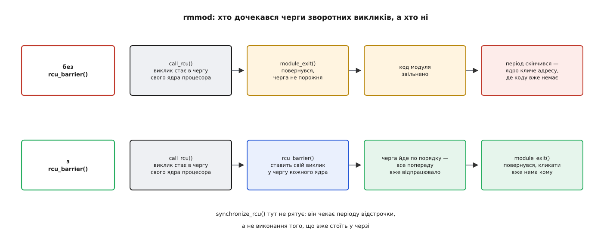

# ⚙️ Список псевдопристроїв під RCU: модуль на сто рядків і три пастки в ньому

Нижче — робочий [модуль ядра](topic:sys-unix/kernel-modules), який тримає список зареєстрованих псевдопристроїв, віддає його читачам через файл у `/proc` без жодного замка й звільняє вилучене відкладено. На ньому по черзі відтворено три помилки, на яких RCU найчастіше ламається на практиці: винесений назовні вказівник, обхід без ділянки читання й вивантаження модуля з непорожньою чергою.

## Задача

Файл `/proc/rcudemo` має працювати в обидва боки. Читання друкує перелік зареєстрованих пристроїв: номер і назву. Запис приймає дві команди — `add <назва>` й `del <номер>`.

Умови, які й роблять задачу цікавою:

- читач не має права виконати **жодного спільного запису** — ні лічильника, ні прапорця;
- письменників може бути кілька водночас, і вони мусять не заважати одне одному;
- пам'ять вилученого запису має повернутися розподілювачу, але не раніше, ніж останній читач із ним розійдеться.

Мову тут не обирають: код виконується в ядрі, торкається його структур і збирається тими самими заголовками, що й саме ядро. Це C.

## Ідея

Розділення обов'язків виходить асиметричним, і саме в цьому суть.

**Читачі між собою** не конфліктують ніяк: список вони не змінюють, тож їм досить обходити його примітивами, безпечними щодо одночасної правки, — `list_for_each_entry_rcu()` усередині пари `rcu_read_lock()` / `rcu_read_unlock()`. Ці дужки не блокують нікого; вони лише позначають проміжок, усередині якого вказівник на вузол лишається дійсним.

**Письменники між собою** конфліктують цілком звичайно: двоє, що правлять один список, зіпсують його так само, як без RCU. Тому між ними — звичайний `mutex`. Він не має жодного стосунку до читачів і не спиняє їх.

**Письменник і читач** розведені в часі: `list_del_rcu()` прибирає вузол з поля зору нових читачів негайно, `call_rcu()` віддає пам'ять пізніше — коли ядро переконається, що старих читачів не лишилося.

Саме тут найчастіше плутають: `mutex` стоїть не «для списку», а «між письменниками». Вибір [замка в ядрі](topic:sys-unix/kernel-locking) взагалі диктується не структурою даних, а тим, хто з ким змагається.

## Модуль

Механіку самого файлу в `/proc` — `proc_ops`, `single_open()`, правила обробника запису — тут не переказуємо: її розібрано окремо, у вправі [свій файл у /proc](topic:sys-unix/pseudo-filesystems/proj-seqfile-module.md). Нижче важить інше — де стоять дужки ділянки читання й де відкладене звільнення.

```c
/* rcudemo.c — список псевдопристроїв, який читають без замка */
#include <linux/init.h>
#include <linux/kstrtox.h>
#include <linux/module.h>
#include <linux/mutex.h>
#include <linux/proc_fs.h>
#include <linux/rculist.h>
#include <linux/seq_file.h>
#include <linux/slab.h>
#include <linux/string.h>
#include <linux/uaccess.h>

struct pdev {
    struct list_head node;
    struct rcu_head  rcu;      /* службове поле для call_rcu() */
    unsigned int     id;
    char             name[24];
};

static LIST_HEAD(pdev_list);
static DEFINE_MUTEX(pdev_mutex);          /* ЛИШЕ між письменниками */
static unsigned int next_id = 1;          /* під pdev_mutex */
static atomic_t freed = ATOMIC_INIT(0);   /* скільки записів уже звільнено */

/* ── читач ── */
static int pdev_show(struct seq_file *m, void *v)
{
    struct pdev *p;

    rcu_read_lock();
    list_for_each_entry_rcu(p, &pdev_list, node)
        seq_printf(m, "%u %s\n", p->id, p->name);
    rcu_read_unlock();

    seq_printf(m, "# freed %d\n", atomic_read(&freed));
    return 0;
}

/* ── письменник: додати ── */
static int pdev_add(const char *name)
{
    struct pdev *p = kzalloc(sizeof(*p), GFP_KERNEL);

    if (!p)
        return -ENOMEM;
    strscpy(p->name, name, sizeof(p->name));   /* поля — ДО публікації */

    mutex_lock(&pdev_mutex);
    p->id = next_id++;
    list_add_tail_rcu(&p->node, &pdev_list);   /* тут вузол стає видимим */
    mutex_unlock(&pdev_mutex);
    return 0;
}

/* ── письменник: вилучити ── */
static void pdev_free_rcu(struct rcu_head *head)
{
    struct pdev *p = container_of(head, struct pdev, rcu);

    atomic_inc(&freed);
    pr_info("rcudemo: звільнено %u %s\n", p->id, p->name);
    kfree(p);
}

static int pdev_del(unsigned int id)
{
    struct pdev *p;
    int ret = -ENOENT;

    mutex_lock(&pdev_mutex);
    list_for_each_entry(p, &pdev_list, node) {   /* під м'ютексом — звичайний обхід */
        if (p->id != id)
            continue;
        list_del_rcu(&p->node);            /* зник для нових читачів */
        call_rcu(&p->rcu, pdev_free_rcu);  /* звільнити після періоду відстрочки */
        ret = 0;
        break;
    }
    mutex_unlock(&pdev_mutex);
    return ret;
}

/* ── обв'язка /proc: розбір команди й реєстрація файлу ── */
static int pdev_open(struct inode *inode, struct file *file)
{
    return single_open(file, pdev_show, NULL);
}

static ssize_t pdev_write(struct file *f, const char __user *ubuf,
                          size_t count, loff_t *ppos)
{
    char cmd[40], *arg;
    unsigned int id;
    int ret;

    if (count == 0 || count >= sizeof(cmd))
        return -EINVAL;
    if (copy_from_user(cmd, ubuf, count))
        return -EFAULT;
    cmd[count] = '\0';
    arg = strim(cmd);

    if (!strncmp(arg, "add ", 4))
        ret = pdev_add(strim(arg + 4));
    else if (!strncmp(arg, "del ", 4))
        ret = kstrtouint(strim(arg + 4), 10, &id) ? -EINVAL : pdev_del(id);
    else
        return -EINVAL;

    return ret ? ret : count;
}

static const struct proc_ops pdev_proc_ops = {
    .proc_open    = pdev_open,
    .proc_read    = seq_read,
    .proc_write   = pdev_write,
    .proc_lseek   = seq_lseek,
    .proc_release = single_release,
};

static struct proc_dir_entry *entry;

static int __init rcudemo_init(void)
{
    entry = proc_create("rcudemo", 0644, NULL, &pdev_proc_ops);
    return entry ? 0 : -ENOMEM;
}

/* rcudemo_exit() — далі, у розділі про rcu_barrier();
   за ним у файлі йдуть module_init/module_exit і MODULE_LICENSE("GPL"). */
```

Три деталі варті того, щоб на них зупинитися.

**`list_add_tail_rcu()` уже містить публікацію.** Усередині нього — `rcu_assign_pointer()`, тобто запис із семантикою звільнення: усе, що письменник записав у вузол раніше, стає видним іншим ядрам раніше за сам вказівник. Саме тому `strscpy()` стоїть **до** нього, і саме тому після нього чіпати поля вузла не можна: читач уже може там бути.

**Письменник обходить список звичайним `list_for_each_entry()`.** Це не недогляд. Захисту потребує той, хто йде списком паралельно зі змінами; письменник тримає `pdev_mutex`, а другого письменника не існує за побудовою. Якщо все ж хочеться однакового вигляду коду, у макроса є четвертий аргумент саме для цього: `list_for_each_entry_rcu(p, &pdev_list, node, lockdep_is_held(&pdev_mutex))` — він каже перевіркам, що ділянки читання тут немає навмисно.

**`call_rcu()` стоїть під м'ютексом, і це нічому не шкодить**, бо він нічого не чекає: ставить виклик у чергу свого ядра процесора й одразу повертається. Коли єдине, що треба зробити з вузлом, — звільнити пам'ять, увесь цей обряд згортається до одного рядка `kfree_rcu(p, rcu)`. Тут узято повну форму лише заради `pr_info()`: без неї момент звільнення був би невидимий.

## Збірка й перший сеанс

```makefile
obj-m := rcudemo.o

KDIR ?= /lib/modules/$(shell uname -r)/build

all:
	$(MAKE) -C $(KDIR) M=$(CURDIR) modules

clean:
	$(MAKE) -C $(KDIR) M=$(CURDIR) clean
```

```sh
$ make && sudo insmod rcudemo.ko
$ echo 'add uart0' | sudo tee /proc/rcudemo >/dev/null
$ echo 'add spi1'  | sudo tee /proc/rcudemo >/dev/null
$ cat /proc/rcudemo
1 uart0
2 spi1
# freed 0
```

Найцікавіше — вилучення. Прочитаймо файл негайно після команди й ще раз за секунду:

```sh
$ echo 'del 1' | sudo tee /proc/rcudemo >/dev/null; cat /proc/rcudemo
2 spi1
# freed 0          ← запису вже немає, а пам'ять іще не повернуто
$ sleep 1; cat /proc/rcudemo
2 spi1
# freed 1
$ dmesg | tail -1
[ 8123.442817] rcudemo: звільнено 1 uart0
```

Ось він, розрив між двома подіями, який і є всім механізмом: **зникнути й звільнитися — різні моменти часу**, і між ними лежить період відстрочки. Записів у виводі стало менше одразу; пам'ять повернулася мілісекундами пізніше, коли ядро переконалося, що ніхто вже не йде за старим вказівником.

## Пастка перша: вказівник, винесений за rcu_read_unlock()

Тепер додамо до модуля команду `name <номер>`, яка друкує назву в журнал. Ось найприродніший спосіб її написати — і він неправильний:

```c
static void pdev_name_broken(unsigned int id)
{
    struct pdev *p, *found = NULL;

    rcu_read_lock();
    list_for_each_entry_rcu(p, &pdev_list, node)
        if (p->id == id) {
            found = p;
            break;
        }
    rcu_read_unlock();

    if (found)
        pr_info("rcudemo: %u = %s\n", id, found->name);   /* ✗ звільнена пам'ять */
}
```

Помилка тут не в тому, що вузол «міг зникнути». Вона точніша й неприємніша: `rcu_read_unlock()` — це **дозвіл**, який ви щойно видали. Письменник, що зробив `list_del_rcu()` під час вашого обходу, чекав саме на нього; ваше розблокування — остання умова, потрібна, щоб період відстрочки закрився й спрацював `pdev_free_rcu()`. Тобто небезпечний проміжок починається не «колись», а рівно з наступної інструкції.

На незавантаженій машині цей код працює бездоганно роками: період відстрочки триває мілісекунди, а `pr_info()` — наносекунди. А [використання після звільнення](topic:sf-security/use-after-free) вилізе вже на бойовому навантаженні — випадковим пошкодженням чужої пам'яті десь зовсім в іншому місці.

Правильних відповідей дві. Або зробити всю роботу з вузлом усередині ділянки — саме так написано `pdev_show()`, де `seq_printf()` стоїть до `rcu_read_unlock()`. Або, якщо вузол справді треба потримати довше, взяти на ньому [лічильник посилань](topic:sf-lang/reference-counting) **поки ділянка ще триває**, і тоді вказівник законно переживе розблокування.

## Пастка друга: те, що перевірки ловлять, і те, чого не ловлять

Зберімо ядро з `CONFIG_PROVE_LOCKING` — окремого перемикача `PROVE_RCU` вже немає, він вмикається разом із перевіркою замків. Тепер приберімо з `pdev_show()` дужки ділянки читання, лишивши сам обхід:

```
=============================
WARNING: suspicious RCU usage
6.12.0 #1 Not tainted
-----------------------------
./include/linux/rculist.h:398 RCU-list traversed in non-reader section!!
```

Це не здогад про можливу проблему, а точне твердження: макрос обходу перевіряє, чи виконується він усередині ділянки читання або під оголошеним замком, і в цьому місці не виконується ні те, ні те. Ту саму перевірку робить `rcu_dereference()`. Коштує вона нуль на робочому ядрі: у звичайній збірці розгортається в порожнечу, тож тримати окрему збірку для тестів варто завжди — про це є ціла вправа з [лабораторією lockdep](topic:sys-unix/kernel-locking/proj-lockdep-lab.md).

А тепер чесна межа цієї перевірки: **пастку першу вона не бачить**. Там кожне розіменування синтаксично законне — `list_for_each_entry_rcu()` виконано в правильному місці, — а порушено те, що діється **після** розблокування, і про це в коді не сказано нічого. Виявляти такі помилки доводиться інакше: складати ядро з KASAN (це той самий [санітайзер пам'яті](topic:sf-release/address-sanitizer), що й у просторі користувача, тільки для ядра) і вмикати `CONFIG_RCU_STRICT_GRACE_PERIOD` — режим, у якому періоди відстрочки закриваються щонайшвидше. Разом вони перетворюють «раз на місяць на бойовій машині» на «зараз, у виводі `dmesg`».

## Пастка третя: rmmod без rcu_barrier()

Прибирання при вивантаженні виглядає безневинно:

```c
static void __exit rcudemo_exit(void)
{
    struct pdev *p, *tmp;

    proc_remove(entry);        /* 1. нових звертань більше не буде */

    mutex_lock(&pdev_mutex);   /* 2. спорожнити список */
    list_for_each_entry_safe(p, tmp, &pdev_list, node) {
        list_del_rcu(&p->node);
        call_rcu(&p->rcu, pdev_free_rcu);
    }
    mutex_unlock(&pdev_mutex);

    rcu_barrier();             /* 3. дочекатися ВЛАСНИХ зворотних викликів */
}
```

Приберімо третій рядок і подивімося, що станеться. Додамо сотню записів і вивантажимо модуль негайно:

```sh
$ for i in $(seq 100); do echo "add dev$i" | sudo tee /proc/rcudemo >/dev/null; done
$ for i in $(seq 100); do echo "del $i"    | sudo tee /proc/rcudemo >/dev/null; done
$ sudo rmmod rcudemo
```

Команда проходить без нарікань. Через частку секунди машина падає, і в журналі — [аварія ядра](topic:sys-unix/kernel-oops-panic) з `rcu_core` у стеку й порожньою адресою переходу.

Причина проста, щойно її побачити. `call_rcu()` записав у чергу **адресу функції `pdev_free_rcu`**, а ця функція живе в тексті модуля. `module_exit()` повернувся, ядро звільнило пам'ять під код модуля — і коли період відстрочки нарешті скінчився, обробник черги пішов кликати за адресою, де вже нічого немає.



*Верхня доріжка закінчується переходом за адресою звільненого коду; нижня — порожньою чергою.*

Найпідступніше в цій пастці — що вона **не відтворюється на одному записі**. Один `call_rcu()`, і його виклик майже напевно встигне спрацювати, доки ви наберете `rmmod`. Потрібна саме пачка, та ще й на завантаженій машині, де черги обслуговуються ліниво.

Заміна `rcu_barrier()` на `synchronize_rcu()` виглядає розумно й не працює: період відстрочки — це умова, за якої виклик **дозволено** виконати, а не обіцянка, що його вже виконано. Черга обслуговується окремо й може відкластися ще надовго. Документація ядра каже про це прямо: чекати періоду тут «абсолютно недостатньо».

`rcu_barrier()` вирішує задачу іншим прийомом. Він ставить власний зворотний виклик у чергу **кожного** ядра процесора й чекає, доки всі вони спрацюють. Оскільки черга обслуговується по порядку, спрацювання його виклику на певному ядрі означає, що все, поставлене раніше, уже відпрацювало. Жодного перебирання ваших викликів — працює сам лише порядок у черзі.

Один виняток варто знати: `kfree_rcu()` цієї пастки не має. Функції звільнення в модулі там немає — ядро звільняє пам'ять власним кодом, а `struct rcu_head` лежить у виділеному блоці, а не в тексті модуля. Але щойно у вашому коді з'явився хоч один `call_rcu()` із власною функцією, бар'єр стає обов'язковим. Окремо: якщо модуль завів собі власний кеш об'єктів у [розподілювачі slab](topic:sys-unix/kernel-memory-slab), знищення цього кешу теж мусить дочекатися відкладених звільнень. Те, що поставлено через `kfree_rcu()`, сучасне `kmem_cache_destroy()` дочікує само; власні зворотні виклики `call_rcu()` доводиться закривати `rcu_barrier()` самому.

## Порядок, у якому все розбирається

Три кроки в `rcudemo_exit()` стоять у єдиному можливому порядку, і кожен наступний спирається на попередній.

`proc_remove()` іде **першим**, бо він не лише знімає запис, а й чекає тих викликів, що вже всередині вашого обробника. Доки він не повернувся, `pdev_show()` може досі йти списком; після нього нових звертань не буде взагалі. Тільки тепер множина тих, хто може поставити новий `call_rcu()`, порожня — а це і є перша умова коректного бар'єра: спершу перекрити джерело викликів, і лише потім чекати.

`rcu_barrier()` іде **останнім** і коштує щонайменше один період відстрочки, тобто одиниці — десятки мілісекунд. У `rmmod` це нічого не значить. Значення воно мало б у гарячому коді — тому в жодному іншому місці модуля бар'єра немає й бути не повинно.
