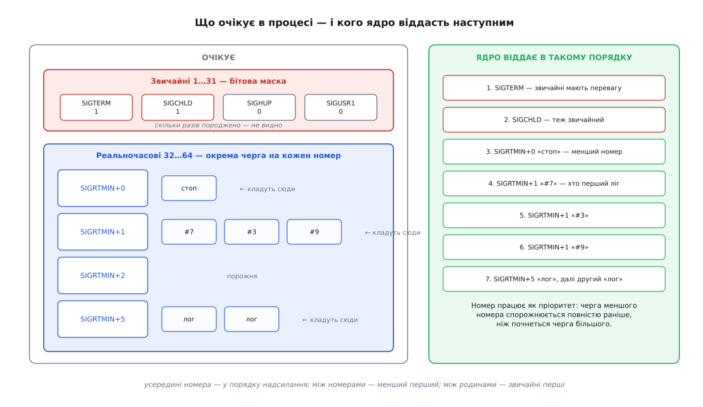
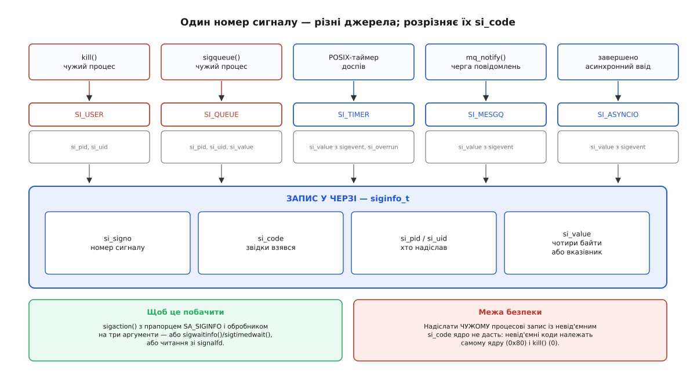
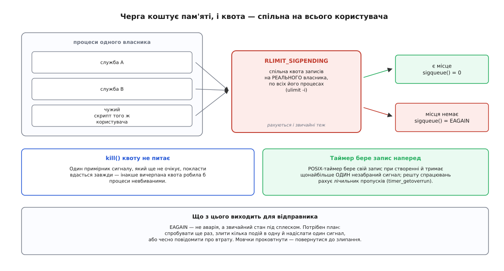

# Реальночасові сигнали: черга, порядок доставки й siginfo

<preknowlist>
- [Сигнал: асинхронне сповіщення](topic:sys-unix/signal-model) — сигнал це число; породження ставить біт у масці очікуваних, доправлення відбувається лише на межі повернення в простір користувача, а кілька породжень одного номера злипаються в один біт.
- [Диспозиція сигналу](topic:sys-unix/signal-disposition) — як `sigaction()` призначає обробник, ігнорування чи типову дію й що таке прапорці на кшталт `SA_SIGINFO`.
- [Маскування сигналів і signalfd](topic:sys-unix/signal-mask-signalfd) — заблокований сигнал не доправляється, а лежить очікуваним; заблоковані сигнали можна забирати явно.
- [Що можна робити в обробнику сигналу](topic:sys-unix/async-signal-safety) — обробник виконується в довільній точці програми, тому майже вся звична бібліотека в ньому заборонена.
- [Потоки як задачі](topic:sys-unix/threads-as-tasks) — процес складається з кількох задач, і сигнал адресують або групі потоків, або конкретній задачі.
- [Обмеження ресурсів](topic:sys-unix/resource-limits) — м'які й жорсткі межі `RLIMIT_*`, які ядро накладає на процес чи користувача.
</preknowlist>

## Коли «щось сталося» вже не відповідь

Служба обробляє замовлення: клієнт віддає їй завдання й хоче знати, коли кожне з них докінчено. Замовлень буває п'ять поспіль, вони завершуються в довільному порядку, і клієнтові важливо, яке саме готове — щоб забрати саме його результат.

Звичайний сигнал тут не годиться, і причина не в дрібниці, яку можна обійти. Він уміє сказати рівно одну річ: «подія цього роду сталася». Не скільки разів. Не яка саме. П'ять завершень поспіль злипнуться в один біт, і клієнт, прокинувшись, знатиме тільки те, що вже й так підозрював.

Обхід очевидний і поганий: хай служба після сигналу викладає перелік готових завдань кудись у файл, а клієнт його перечитує. Тоді сигнал стає дзвінком, а справжній вантаж їде іншим каналом — і всю домовленість треба будувати наперед, з обох боків.

Питання тому інше: **що треба додати до сигналу, щоб він сам ніс і кількість, і зміст**? Відповідь на нього й дала другу родину сигналів. Розширення реального часу до стандарту POSIX (IEEE Std 1003.1b-1993) описало **реальночасові сигнали** — з чергою, визначеним порядком і вантажем; у ядрі Linux вони з'явилися в гілці 2.2, разом із набором системних викликів `rt_*`, бо старі не вміли навіть передати достатньо широку маску.

## Чому це коштує пам'яті — і що звідси випливає

Щоб зберегти п'ять подій, треба п'ять місць. Одне слово в структурі процесу вміщує один біт на номер, і збільшити його не можна: наперед невідомо, скільки подій набіжить. Отже, кожне породження мусить **виділити собі запис** — і покласти його в чергу.

Саме тут ховається вся ціна. Звичайний сигнал бідний не з недогляду: його породжувач часто стоїть у контексті переривання або посеред обробника пастки, де виділяти пам'ять не можна, а невдале виділення означало б утрачену новину саме тоді, коли в системи скінчилася пам'ять. Поставити біт у слові, яке вже існує, — дія, що не може не вдатися.

Черга скасовує цю гарантію. Виділення здатне не вдатися, а отже, **надсилання здатне відмовити**. Звідси один наслідок, який визначає все подальше: реальночасовий сигнал надійніший за звичайний у тому, що не губить подій, — і ненадійніший у тому, що може взагалі не піти. Обмін, а не покращення.

Ось чому нову поведінку не дали старим номерам 1…31. Програми, писані десятиліттями, покладаються на те, що `kill()` не відмовляє й що один `SIGCHLD` покриває сплеск смертей. Стандарт додав окрему родину замість того, щоб міняти семантику наявної.

## Номери без значення

Ядро Linux відводить під цю родину номери 32…64. Але просто взяти 32 не можна: бібліотека GNU резервує перші номери під власні потреби — реалізація потоків NPTL уживає два (скасування потоку й узгоджена зміна ідентифікаторів користувача), давніша LinuxThreads уживала три. Тому `SIGRTMIN` у програмі — не стала, а **значення, яке бібліотека обчислює під час виконання** (зазвичай воно дорівнює 34). Писати номер числом — помилка, яка не виявиться на вашій машині й вибухне на чужій; пишуть завжди `SIGRTMIN+n`, а межу перевіряють через `SIGRTMAX`. POSIX гарантує щонайменше вісім таких номерів і щонайменше тридцять два записи в черзі процесу — Linux дає значно більше.

Друга особливість родини: у цих номерів **немає наперед визначеного значення**. Ніякого «перервано користувачем» чи «помер нащадок» — сенс кожного номера призначаєте ви самі, домовляючись між своїми процесами.

Свобода має зворотний бік, на якому спотикаються майже всі. Типова дія для реальночасового сигналу — **завершити процес**. Не «проігнорувати», як для `SIGCHLD` чи `SIGWINCH`. Надішліть `SIGRTMIN+2` процесові, який його не чекає, — і він помре без жодного пояснення в журналі.

> 🔧 **Навіщо це.** Дві незалежні бібліотеки всередині однієї програми легко обирають той самий `SIGRTMIN+1` для своїх потреб — і починають красти сповіщення одна в одної. Загальноприйнятий вихід: бібліотека не обирає номер сама, а бере його параметром від програми, яка одна знає весь свій розподіл номерів.

## Порядок доправлення

Щойно з'явилася черга, з'явилося й питання, якого для біта не існувало: **у якому порядку ядро віддає накопичене**. Тут діють три правила, і кожне з них варте того, щоб знати його точно.

**Усередині одного номера — у порядку надсилання.** Черга є черга: перший покладений піде першим. Це і є та властивість, заради якої все затівалося: п'ять завершень доїдуть як п'ять записів у тій послідовності, у якій сталися.

**Між різними реальночасовими номерами — спершу менший номер.** Ядро вибирає найменший номер, для якого є що віддати, і спорожняє його чергу. Отже, номер тут працює як **пріоритет**: `SIGRTMIN+0` обжене `SIGRTMIN+5`, скільки б записів той не назбирав. Це навмисна риса реального часу — терміновій новині дають дорогу поперед звичайної.

**Між родинами — спершу звичайні сигнали.** Коли очікують і `SIGTERM`, і ваш `SIGRTMIN+0`, Linux віддасть `SIGTERM`. Стандарт цього не визначає й лишає на розсуд системи, але поведінка Linux стала: смертельне й термінальне не має чекати за прикладною чергою.



*Ядро щоразу вибирає одного «переможця»: звичайний біт має перевагу над будь-якою чергою, а серед черг виграє менший номер.*

Практичний висновок: **номер обирають за терміновістю, а не за алфавітом**. Якщо у вас є «завдання готове» й «негайно спинися», друге має отримати менший номер — інакше воно чекатиме, доки розсмокчеться черга першого. І навпаки: не садіть часті дрібні сповіщення на найменший номер, бо вони затримуватимуть усе інше.

## Запис черги: siginfo

Раз під кожну подію однаково виділено пам'ять, безглуздо було б класти в неї саме лише число. Тому реальночасовий сигнал приходить не сам, а зі **структурою `siginfo_t`** — тим самим записом, що лежав у черзі.

Щоб її побачити, обробник треба оголосити інакше: у `sigaction()` виставляють прапорець `SA_SIGINFO` і подають функцію на три аргументи — номер, вказівник на `siginfo_t` і контекст перерваного виконання.

Що в тому записі лежить:

```
si_signo   номер сигналу
si_code    ЗВІДКИ він узявся (див. нижче)
si_pid     номер процесу-відправника
si_uid     реальний ідентифікатор власника відправника
si_value   вантаж: union sigval { int sival_int; void *sival_ptr; }
```

Вантаж кладе відправник, викликаючи `sigqueue()` замість `kill()`. Одне число або один вказівник — більше туди не влізе, і це не випадковість: більший вантаж означав би копіювання довільного обсягу пам'яті в контексті, де породжувач і так ледве може виділити запис.

Тут ховається пастка, на яку легко натрапити: `sival_ptr` **не має сенсу між процесами**. Адреса з чужого адресного простору в вашому вказує в нікуди. Поле лишили для випадку, коли процес надсилає сигнал сам собі (наприклад, таймер приносить назад вказівник на свою структуру); між різними процесами передають `sival_int` — а по ньому вже шукають деталі там, де обидві сторони домовилися їх тримати.

Поле `si_code` каже, **хто саме породив** сигнал, і саме воно робить запис придатним для розбору:

```
SI_USER      kill()
SI_QUEUE     sigqueue()
SI_TKILL     tgkill() / pthread_kill()
SI_TIMER     доспів POSIX-таймер
SI_MESGQ     у порожній черзі повідомлень з'явилося повідомлення
SI_ASYNCIO   завершено асинхронне введення-виведення
SI_KERNEL    породило ядро
```

Знак цього значення — не примха нумерації, а межа безпеки. Невід'ємні коди належать самому ядру (`SI_KERNEL` — 0x80) і простому `kill()` (`SI_USER` — 0), решта від'ємні. Ядро **забороняє** процесові надіслати іншому процесові запис із невід'ємним `si_code`: інакше будь-хто міг би підробити «це від ядра» й збити з пантелику отримувача, який на цю позначку спирається. Собі підробити можна, чужому — ні.



*Один і той самий номер сигналу може приїхати від таймера, від черги повідомлень або від чужого процесу — розрізняє їх лише si_code.*

Повний перелік підписів і полів — `sigqueue`, `sigwaitinfo`, `sigtimedwait`, структура `sigevent`, розкладка `siginfo_t` для кожного `si_code` й повний набір кодів помилок — винесено окремо: [контракт реальночасових сигналів](topic:sys-unix/realtime-signals/api-realtime-signals.md).

## Скільки записів вам дозволять

Черга не безмежна, і межа поставлена не там, де її звикли шукати.

Рахунок ведеться **на реального власника процесу**, а не на процес і не на систему: обмеження `RLIMIT_SIGPENDING` каже, скільки всього записів може одночасно очікувати по **всіх процесах** цього користувача. Побачити чинне значення можна командою `ulimit -i`. У цей рахунок ідуть і звичайні сигнали теж, хоча в них і немає черги як такої.

А от **перевіряється** межа лише для `sigqueue()`. `kill()` завжди зможе поставити один примірник сигналу, який ще не очікує, — саме тому вбити процес вдається навіть тоді, коли користувач вичерпав усю квоту.

Історично було інакше: до ядра 2.6.8 діяв **загальносистемний** ліміт `/proc/sys/kernel/rtsig-max`. Його замінили саме на подушний, бо системний ліміт означав, що один недбалий процес міг позбавити черги всіх інших; тепер він шкодить лише своєму користувачеві.

Коли квоту вичерпано, `sigqueue()` повертає `-1` і виставляє `EAGAIN` — «спробуй пізніше». Це не аварія й не рідкісний випадок: під сплеском він настає закономірно. Тому в кожного відправника має бути **план на відмову**: спробувати ще раз, злити кілька подій в одну (записати «є новини» у спільне місце й надіслати один сигнал), або чесно повідомити про втрату. Мовчки проковтнути `EAGAIN` — те саме, що повернутися до злипання, тільки непомітно.



*Квота спільна для всіх процесів одного власника; таймер натомість бере свій запис наперед, при створенні, і рахує пропущені спрацювання.*

Показово, як ту саму проблему розв'язали для сповіщень, що народжуються в ядрі: їм відмовляти нікому. **POSIX-таймер** бере свій запис один раз — коли його створюють, — і тримає щонайбільше **один** незабраний сигнал: якщо він доспів удруге, а перший ще не доправлено, другого запису не з'явиться — натомість зросте лічильник пропусків, і програма дізнається його через `timer_getoverrun()`. Тобто найкоротший чесний шлях виявився таким: обмежена черга плюс лічильник того, що в неї не влізло. Те саме роблять [таймери процесу](topic:sys-unix/process-timers) в усіх своїх різновидах, і `mq_notify` у [чергах повідомлень](topic:sys-unix/message-queues) — той узагалі сповіщає один раз, після чого підписку треба поновити.

## Де саме лежить черга

Процес — це, як правило, кілька задач, і черга в нього не одна. Ядро тримає **спільну чергу групи потоків** і, крім неї, **власну чергу кожної задачі**.

Куди ляже запис, вирішує спосіб надсилання. `sigqueue()`, як і `kill()`, цілиться в процес як ціле — запис іде в спільну чергу, і забрати його зможе будь-який потік, що не заблокував цей номер; який саме, наперед не відомо. `pthread_kill()` (а під ним системний виклик `tgkill()`) цілиться в конкретну задачу — запис лягає в її власну чергу, і жоден інший потік його не побачить.

Це пояснює, чому усталений прийом саме такий: сигнал блокують **у всіх** потоках, і тоді записи зі спільної черги нікому не доправляються, а спокійно чекають, доки їх забере один призначений потік. Заблокувати лише в ньому було б безглуздо: ядро віддало б запис першому-ліпшому потоку, який його не блокував, і тайм-аут у призначеному потоці спрацював би даремно.

А от порядок вибору, розібраний вище, діє **всередині** черги, а не між чергами. Ядро спершу дивиться власну чергу задачі й лише тоді, коли віддавати з неї нічого, заглядає у спільну. Тож `SIGRTMIN+5`, надісланий саме цьому потокові через `pthread_kill()`, вийде поперед `SIGRTMIN+0`, що чекає у спільній черзі: номер як пріоритет порівнює лише те, що лежить в одній черзі.

## Як їх приймати, щоб вантаж не пропав дарма

Ми домоглися того, що новина несе зміст. Але обробник сигналу — найгірше місце, щоб цей зміст використати: він виконується в довільній точці програми, у довільному потоці, і майже нічого з бібліотеки в ньому робити не можна. Записати `sival_int` кудись у масив і поставити прапорець — усе, на що обробник має право.

Тому реальночасові сигнали майже завжди приймають **не обробником, а явно**: сигнал блокують у всіх потоках, і тоді ядро не доправляє його, а лишає в черзі — звідки програма забирає записи тоді, коли їй зручно.

**Приймання з розбором вантажу і з тайм-аутом.**

```c
#define _POSIX_C_SOURCE 200809L
#include <signal.h>
#include <errno.h>
#include <stdio.h>

#define SIG_JOB_DONE  (SIGRTMIN + 1)   /* завдання докінчено; вантаж — його номер */
#define SIG_SHUTDOWN  (SIGRTMIN + 0)   /* менший номер = обжене чергу завершень */

int main(void)
{
    sigset_t set;
    sigemptyset(&set);
    sigaddset(&set, SIG_SHUTDOWN);
    sigaddset(&set, SIG_JOB_DONE);

    /* Блокуємо ДО того, як хтось міг надіслати: інакше типова дія вб'є процес. */
    if (sigprocmask(SIG_BLOCK, &set, NULL) == -1)   /* у потоках — pthread_sigmask */
        return 1;

    for (;;) {
        siginfo_t si;
        struct timespec wait = { .tv_sec = 5, .tv_nsec = 0 };
        int sig = sigtimedwait(&set, &si, &wait);

        if (sig == -1) {
            if (errno == EAGAIN)        /* нічого не прийшло за 5 с */
                continue;
            if (errno == EINTR)         /* урвав інший, не заблокований сигнал */
                continue;
            return 1;
        }
        if (sig == SIG_SHUTDOWN)
            break;

        /* si.si_code == SI_QUEUE, si.si_pid — хто надіслав, si_value — вантаж */
        printf("завдання %d готове (від pid %d)\n",
               si.si_value.sival_int, (int)si.si_pid);
    }
    return 0;
}
```

Відправник кладе в чергу номер завдання:

```c
union sigval v;
v.sival_int = job_id;
if (sigqueue(client_pid, SIG_JOB_DONE, v) == -1 && errno == EAGAIN) {
    /* квота користувача вичерпана — сюди й приходить план на відмову */
}
```

Порядок дій у цьому коді не довільний. Блокування мусить статися **перед** будь-яким можливим надсиланням, бо доти діє типова дія — «завершити процес». І `sigtimedwait()` має право забирати лише **заблоковані** сигнали: на незаблокованому його поведінка не визначена, бо ядро доправить сигнал раніше, ніж виклик устигне його побачити.

Той самий вантаж можна отримати й через дескриптор: `signalfd` віддає структуру, де поля `ssi_int` та `ssi_ptr` несуть той-таки `si_value`, — і тоді сигнали чекаються нарівні з сокетами й файлами в спільному циклі подій ([маскування сигналів і signalfd](topic:sys-unix/signal-mask-signalfd)).

Як усе це поводиться під навантаженням — чи справді менший номер обганяє більший, скільки записів удається покласти до `EAGAIN` і що коштує кожне надсилання проти запису в канал — виміряно окремо: [диспетчер завдань на реальночасових сигналах](topic:sys-unix/realtime-signals/proj-rt-signal-dispatch.md), маленька пара процесів із двома пріоритетами й лічильником відмов.

## Де вони справді доречні

Реальночасові сигнали живуть насамперед там, куди звичайний канал не проведеш: **ядро** саме користується ними, щоб доправити подію з вантажем. Доспілий [POSIX-таймер](topic:sys-unix/process-timers) приносить у `si_value` те, що ви поклали в `sigevent` при створенні, — так один обробник розрізняє десяток таймерів. Дескриптор, налаштований на [сигнальне введення-виведення](topic:sys-unix/signal-driven-io) через `F_SETSIG`, приносить у `si_fd` номер того самого дескриптора, що став готовим, — і саме тому там радять ставити реальночасовий номер замість `SIGIO`: інакше під навантаженням готовності злипнуться й доведеться перепитувати всі дескриптори. Завершене [асинхронне введення-виведення POSIX](topic:sys-unix/posix-aio) сповіщає так само.

А ось для звичайного обміну між своїми процесами вони — рідко найкращий вибір, і причина видна з усього дотеперішнього. Черга чужа й спільна: її вичерпає будь-який інший процес того самого користувача, і ваше надсилання відмовить не з вашої вини. Вантаж — чотири байти. Приймання все одно доводиться зводити до дескриптора, щоб мати нормальний цикл подій. Там, де сторони й так домовляються наперед, [канал або сокет](topic:sys-unix/pipe-and-fifo) везе довільний обсяг, має власний буфер і під тиском чемно гальмує відправника, замість повертати відмову ([огляд засобів взаємодії](topic:sys-unix/ipc-landscape)).

Справжня ніша лишається вузькою й чіткою: коли **ядро** мусить сказати вам щось із деталями, або коли треба вклинитися з новиною в процес, що не відкривав жодного дескриптора для вас, — і при цьому не втратити жодної події й не переплутати терміновість. Заради цього родину й додали; поза цим вона тільки виглядає привабливо.
