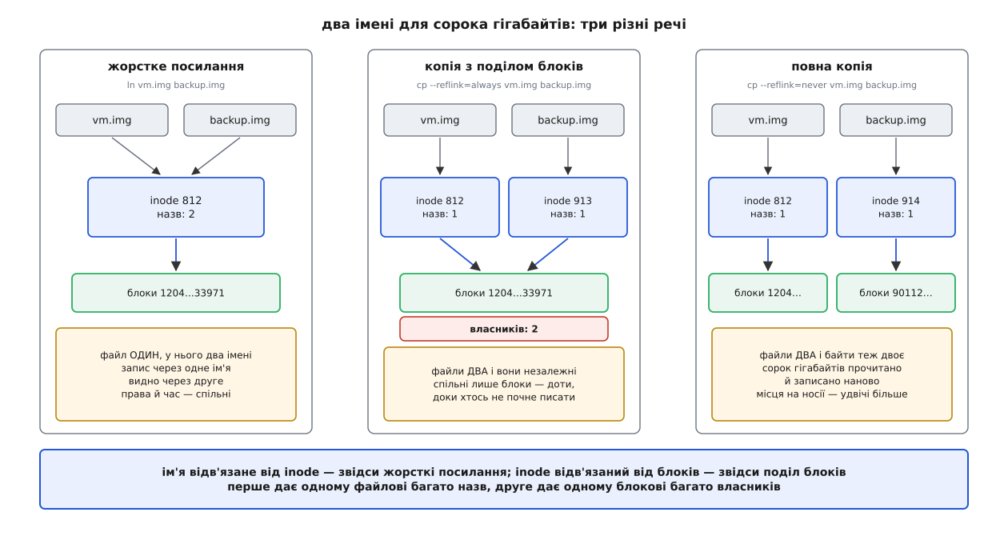
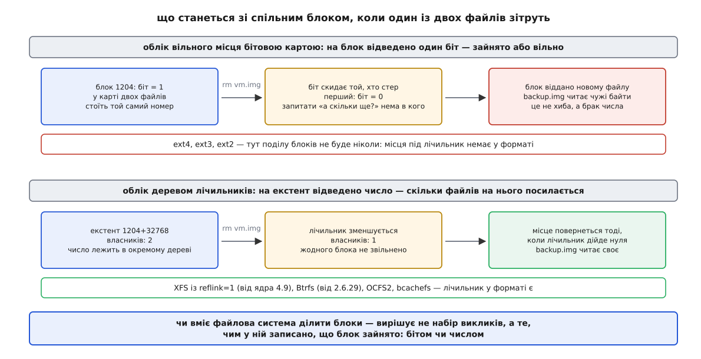

# Копії з поділом блоків: reflink і copy_file_range

<preknowlist>
- [Inode: файл без імені](topic:sys-unix/inode-model) — справжній файл є записом із правами, розміром і картою блоків; імені всередині нього немає.
- [Жорсткі й символьні посилання](topic:sys-unix/hard-and-symbolic-links) — один inode може мати кілька імен, і файл живе, доки лічильник імен більший за нуль.
- [Родини файлових систем](topic:sys-unix/filesystem-families) — карту файлу описують екстентами, а вільне місце ext4 обліковує бітовою картою, XFS і Btrfs — деревами.
</preknowlist>

Уявімо сервер із образами віртуальних машин чи архівами збірок. Копіювання файлу розміром у сорок гігабайтів звичайним циклом читання й запису змушує носій перегнати кожен байт крізь пам'ять. Ця операція триває декілька хвилин і подвоює витрати дискового простору.

Перша думка для обходу цієї затримки — зробити [жорстке посилання](topic:sys-unix/hard-and-symbolic-links). Команда `ln` виконується миттєво, але створює один inode із двома іменами. Це не копія: будь-яка зміна через одне ім'я негайно відображається в іншому, а права доступу й час модифікації залишаються спільними.

Для справжнього клонування потрібне інше: два незалежні файли із власними inode, якими можна керувати окремо, але які на диску посилаються на ті самі фізичні блоки. Цей механізм називається копіюванням із поділом блоків (reflink).

## Анатомія поділу блоків

Файлова система зберігає карту файлу як список [екстентів](topic:sys-unix/filesystem-families) — суцільних діапазонів блоків на носії. У звичайному стані кожен екстент належить одному файлу.

Під час клонування reflink файлова система створює новий inode і копіює в його карту номери блоків із джерела. Самі байти даних на диску не переписуються й не дублюються. Операція змінює лише метадані файлової системи — кілька сотень байтів у журналі. Файл на сорок гігабайтів клонується за кілька мілісекунд, а обсяг вільного місця на диску не змінюється ні на байт.


*Жорстке посилання створює друге ім'я для одного inode. Поділ блоків дає двом окремим inode спільні дискові блоки. Повна копія змушує носій виділити нові блоки й переписати всі байти.*

Файли залишаються повністю незалежними: вилучення одного з них не шкодить іншому, зміна атрибутів чи власника діє тільки на один файл, а розбіжність даних виникає лише під час наступних записів.

## Чому Btrfs та XFS вміють ділити блоки, а ext4 — ні

Головне ускладнення поділу блоків полягає в обліку вільного місця. Коли програма вилучає файл, файлова система повинна знати, чи можна повернути його блоки у вільний фонд. Якщо на ті самі блоки дивляться два різні файли, звільняти простір дозволено лише після вилучення останнього власника.

У класичних файлових системах родини ext (ext2, ext3, ext4) вільне місце обліковується бітовою картою: один біт на кожен блок групи (0 — вільно, 1 — зайнято). У такій структурі немає місця для збереження кількості посилань. Якщо дозволити двом файлам в ext4 посилатися на один блок, перший же виклик `unlink` скине біт у нуль. Після цього файлова система віддасть «вільний» блок іншому файлу, і той перепише чужі байти.

Файлові системи з підтримкою reflink (Btrfs, XFS із прапорцем `reflink=1`, OCFS2, bcachefs) використовують спеціальне дерево лічильників посилань (refcount btree).


*Формат ext4 зберігає стан блока у єдиному біті й не має місця для лічильника власників. XFS та Btrfs ведуть окреме дерево лічильників посилань на дискові екстенти.*

При клонуванні файлова система збільшує лічильник кожного екстента у дереві. При вилученні файлу лічильник зменшується на одиницю. Блок повертається у фонд вільного місця тільки тоді, коли лічильник досягає нуля. Зміна формату ext4 задля додавання такого дерева зробила б її іншою файловою системою, тому ext4 не підтримує reflink.

## Модифікація спільного блоку: Copy-on-Write

Коли програма записує нові байти у клонований файл, файлова система не може виконати запис поверх наявного блока, бо це зіпсувало б дані у другому файлі. Натомість виконується процедура Copy-on-Write (копіювання при записі):

1. Файлова система виділяє новий порожній блок на носії.
2. У новий блок копіюються незмінені сусідні байти та нові дані.
3. Карта файлу, в який ішов запис, перенаправляється на новий блок.
4. Лічильник посилань для старого блоку в дереві зменшується на одиницю.

З цього випливає важливий практичний наслідок: перезапис клонованого файлу потребує вільного місця на носії. На повністю заповненому диску спроба перезаписати наявні байти у рефлінк-копії поверне помилку `ENOSPC`, хоча розмір файлу не змінюється. Крім того, часті точкові записи у клонований файл розривають великі суцільні екстентні карти на дрібні фрагменти.

## Системні виклики: FICLONE та copy_file_range

У ядрі Linux існують два основні інтерфейси для створення швидких копій:

- `FICLONE` та `FICLONERANGE` (через системний виклик [ioctl](topic:sys-unix/ioctl-interface)) — тверда обіцянка поділити блоки. Якщо файлова система не підтримує reflink або файли лежать на різних змонтованих файлових системах, виклик відмовляє з помилкою `EOPNOTSUPP` чи `EXDEV`. Він ніколи не відкочується на звичайне копіювання байтів. Детальніше історію створення цього виклику описано в [історії системного виклику reflink](topic:sys-unix/reflink-copies/hist-reflink-syscall.md), а специфікацію параметрів зібрано в [контракті клонування](topic:sys-unix/reflink-copies/api-clone-and-copy.md).
- `copy_file_range` — системний виклик із гнучкою обіцянкою скопіювати діапазон байтів найдешевшим доступним способом. Якщо файлова система підтримує reflink, ядро виконає поділ блоків. Якщо копіювання йде між файлами на NFS-сервері, ядро попросить сервер скопіювати файл у себе (Server-Side Copy). Якщо жоден прискорений метод не працює, ядро самостійно прочитає й перепише байти у внутрішньому циклі без зайвих переходів між ядром та простором користувача.

## Робота у командному рядку та дедуплікація

Утиліта `cp` з пакету GNU coreutils (починаючи з версії 9.0) типово створює копії через reflink. Режими клонування задаються прапорцем `--reflink`:

```sh
cp --reflink=always src.img dst.img   # поділити блоки або повернути помилку
cp --reflink=auto   src.img dst.img   # спробувати reflink, інакше звичайне копіювання
cp --reflink=never  src.img dst.img   # завжди копіювати байти наново
```

Для файлів, які вже були виготовлені звичайним копіюванням або створені незалежно, існує зворотна операція — поблокова дедуплікація. За допомогою виклику `FIDEDUPERANGE` програма може попросити ядро порівняти вміст двох діапазонів і злити їхні блоки в один спільний екстент. Практичну реалізацію такої утиліти наведено в [проєкті поблокової дедуплікації](topic:sys-unix/reflink-copies/proj-dedupe-ranges.md).
