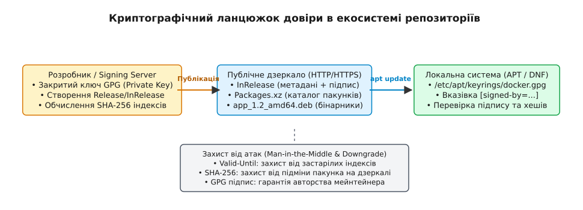
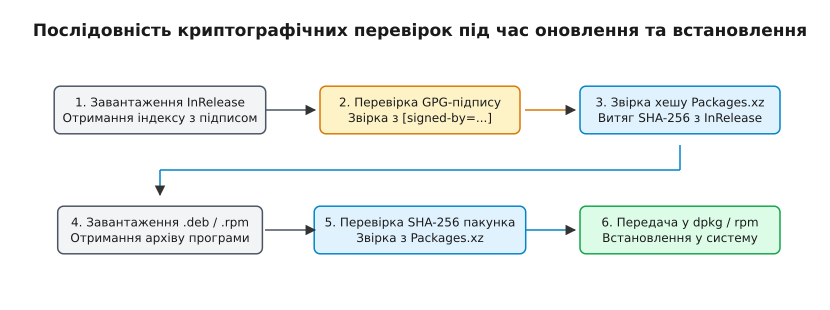

# Репозиторії, підписи й довіра

<preknowlist>
- [Модель пакетного менеджера](topic:sys-unix/package-manager-model) — концепція пакунків, локальної бази даних та індексів.
- [Формати DEB та RPM](topic:sys-unix/deb-and-rpm) — внутрішня структура архівів пакунків та заголовочних блоків.
</preknowlist>

Коли адміністратор на сервері виконує команду `apt install nginx` або `dnf install nginx`, системна утиліта завантажує бінарний архів по відкритому мережевому протоколу HTTP з публічного дзеркала (Mirror), розташованого у Франкфурті чи Варшаві. Якщо зловмисник підмінить DNS-запис або перехопить TCP-сесію на проміжному маршрутизаторі (атака Man-in-the-Middle), він може підкинути замість оригінального бінарника `nginx` підроблений файл `.deb` із вбудованим шкідливим кодом для отримання привілеїв `root`. Для запобігання цій загрозі система пакетного менеджменту Linux спирається не на надійність транспортного каналу, а на автономний криптографічний (грецьк. *κρυπτός* — прихований, *γράφο* — пишу) ланцюжок довіри: асиметричні цифрові підписи GPG, каскадне хешування індексів та ізольовані сховища ключів.

---

## 1. Першопричини: чому мережева дистрибуція потребує автономної довіри

У традиційних операційних системах довіра до завантажуваного коду часто покладається на захищеність мережевого з'єднання HTTPS (TLS-сертифікат вебсайту розробника). Однак у світі дистрибутивів Linux така модель виявляється принципово недостатньою через масштаби дистрибуції.

Магістральні дистрибутиви (Debian, Ubuntu, Fedora, RHEL) розповсюджують десятки тисяч пакунків загальним обсягом у сотні гігабайтів. Для обслуговування мільйонів установчих сесій розробники дистрибутиву залучають сотні публічних дзеркал (Mirrors), які утримуються сторонніми організаціями — університетами, провайдерами та волонтерами. 

Звідси випливає фундаментальна проблема: **операційна система не може довіряти власнику публічного дзеркала**. Навіть якщо транспортний канал між клієнтом і дзеркалом захищено за допомогою HTTPS, адміністратор дзеркала або зловмисник, що зламав цей сервер, має технічну можливість замінити будь-який архів `.deb` чи `.rpm` на власну модифіковану версію.

### Три стовпи криптографічного захисту

Щоб забезпечити безпеку встановлення програм у недовіреному мережевому середовищі, система репозиторіїв (латин. *reposition* — сховище) гарантує три криптографічні властивості:

1. **Автентичність (Authenticity)**: Гарантія того, що перелік доступних програм та самі бінарні пакунки створені саме розробниками дистрибутиву (або уповноваженими мейнтейнерами), а не стороннім нападником.
2. **Цілісність (Integrity)**: Доказ того, що жоден байт у файлі пакунка чи його метаданих не був змінений, випадково пошкоджений при передачі мережею або модифікований на сервері дзеркала.
3. **Свіжість (Freshness)**: Захист від атак повторення (Replay Attack) та зниження версії (Downgrade Attack), при яких зловмисник підсуває клієнту застарілі, але правильно підписані індекси зі списком старих пакунків, що містять відомі критичні вразливості (CVE).

---

## 2. Анатомія ланцюжка довіри (Chain of Trust)

Модель безпеки репозиторіїв побудована на асиметричній криптографії RSA або Ed25519 (OpenPGP / GnuPG). Замість того, щоб підписувати кожен із 60 000 бінарних пакунків окремим підписом і передавати їх мережею, система створює **ієрархічне дерево хешів**, вершина якого підписується єдиним закритим ключем розробника (або автоматизованого сервера збірки — Signing Server).


*Криптографічний ланцюжок довіри від ключа розробника через публічне дзеркало до локального пакетного менеджера.*

Послідовність формування та перевірки довіри працює за наступною схемою:

1. **Етап збірки (Signing Server)**: Мейнтейнер генерує індексні файли репозиторію, що містять списки всіх пакунків та їхні криптографічні хеші SHA-256. Кореневий індексний файл підписується закритим ключем GPG (Private Key). Захищений сервер підпису зберігається в ізольованому контурі організації.
2. **Етап дистрибуції (Public Mirrors)**: Підписані індекси разом із бінарними пакунками публікуються на сотнях відкритих HTTP/HTTPS дзеркал по всьому світу.
3. **Етап верифікації (Client Machine)**: Під час виконання команди `apt update` або `dnf makecache` локальний менеджер завантажує індекси та перевіряє цифровий підпис за допомогою відкритого ключа (Public Key), який заздалегідь встановлено в локальній системі через надійний канал (наприклад, включено до складу інсталяційного образу ОС).

Якщо підпис кореневого індексу збігається із локальним відкритим ключем, локальна система вважає весь список хешів довіреним. Подальша перевірка окремого пакунка зводиться до порівняння його фактичного хешу SHA-256 із хешем, записаним у підписаному індексі.

---

## 3. Криптографічний підґрунт: стандарти OpenPGP та алгоритми підпису

В основі механізму цифрових підписів Linux спирається на стандарт OpenPGP (RFC 4880 та його оновлення RFC 9580). Підпис є результатом математичного обчислення хешу від текстового тіла метаданих та його подальшого шифрування закритим ключем розробника.

### Алгоритми асиметричного шифрування та їхні характеристики

У розвитку систем підпису репозиторіїв використовувалися три покоління криптографічних алгоритмів:

- **RSA (Rivest–Shamir–Adleman)**: Історичний стандарт із довжиною ключа 2048 або 4096 біт. RSA спирається на складність факторизації великих цілих чисел. Ключі RSA 4096 біт забезпечують високий рівень безпеки, але вимагають відчутних процесорних ресурсів під час обчислення цифрового підпису та мають великий розмір бінарного блоку OpenPGP Tag 2 Signature.
- **ECDSA (Elliptic Curve Digital Signature Algorithm)**: Алгоритм на основі еліптичних кривих (NIST P-256, P-384). Дозволяє досягти еквівалентного RSA-4096 рівня стійкості при розмірі ключа усього 256 біт, що значно прискорює завантаження та перевірку підписів у мережевих інструментах.
- **Ed25519 (EdDSA на кривій Curve25519)**: Сучасний криптографічний стандарт, прийнятий у новітніх релізах Debian та Fedora. Ed25519 стійкий до атак за побічними каналами (Side-Channel Attacks), забезпечує високу швидкість верифікації та мінімальний розмір підпису (64 байти).

### Внутрішня бінарна структура пакетів OpenPGP

Під час зберігання відкритого ключа у файлах `.gpg` або розборі підписів `InRelease` системна бібліотека `libgpgme` обробляє бінарні теги OpenPGP (OpenPGP Packets):

1. `Tag 2 (Signature Packet)`: Містить версію підпису (v4/v5), тип підпису (наприклад, `0x01` для текстового документа), ідентифікатор ключа підписувача (Key ID / Fingerprint), криптографічний алгоритм хешування (SHA-256, SHA-512) та безпосередньо математичне значення підпису.
2. `Tag 6 (Public Key Packet)`: Містить матеріал відкритого ключа (модуль та експоненту для RSA або точку кривої для Ed25519), дату створення ключа та термін його придатності.
3. `Tag 13 (User ID Packet)`: Текстовий рядок у кодуванні UTF-8, що ідентифікує мейнтейнера або організацію (наприклад, `Ubuntu Archive Automatic Signing Key <ftpmaster@ubuntu.com>`).

---

## 4. Механіка підписів та каскадних хешів у Debian/Ubuntu (APT)

В екосистемі Advanced Package Tool (APT) структура довіри будується навколо файлів `Release` та `InRelease`.

```
/var/lib/apt/lists/ (Локальний кеш індексів)
├── repo.example.com_ubuntu_dists_noble_InRelease        <-- Підписано GPG (Корінь довіри)
└── repo.example.com_ubuntu_dists_noble_main_binary-amd64_Packages.xz <-- Містить SHA-256 файлів .deb
```

### Формат файлів `Release`, `Release.gpg` та `InRelease`

- `Release`: Текстовий файл, який містить метадані репозиторію (архітектуру, кодову назву дистрибутиву, дату створення) та список усіх індексних файлів пакунків (`Packages.xz`, `Sources.xz`) із вказівкою їхніх exact розмірів та SHA-256 хешів.
- `Release.gpg`: Окремий ("від'єднаний", detached) OpenPGP-підпис файлу `Release`.
- `InRelease`: Об'єднаний файл, у якому текстовий вміст `Release` та його PGP-підпис вміщено в один файл у форматі PGP Cleartext Signed Message. APT надає перевагу файлу `InRelease`, оскільки він завантажується за один мережевий HTTP-запит замість двох.

### Дерево каскадної верифікації в APT

Коли користувач ініціює встановлення програми `apt install app.deb`, відбувається трирівнева перевірка цілісності:

1. **Рівень 1 (GPG verification)**: APT перевіряє PGP-підпис файлу `InRelease` за допомогою відкритого ключа з локального сховища `/etc/apt/keyrings/`. Якщо підпис валідний, вміст `InRelease` вважається абсолютизованою правдою.
2. **Рівень 2 (Index Verification)**: З файлу `InRelease` вилучається еталонний SHA-256 хеш для стиснутого каталогу `main/binary-amd64/Packages.xz`. Завантажений файл `Packages.xz` розпаковується в пам'яті, і його обчислений хеш порівнюється з еталонним.
3. **Рівень 3 (Package Verification)**: З розпакованого `Packages` вилучається еталонний SHA-256 хеш безпосередньо для файлу `app_1.2.3_amd64.deb`. Після завантаження бінарного файлу `.deb` його фактичний хеш звіряється з цим значенням. Лише у разі повного збігу файл передається утиліті `dpkg` для розпакування у VFS.


*Покроковий потік верифікації цифрових підписів та хешів під час виконання apt update та apt install.*

### Захист від атак зниження версії (Replay / Downgrade Attacks)

Уявіть ситуацію: зловмисник перехоплює HTTP-трафік і замість свіжого індексу `InRelease` віддає клієнту старий файл `InRelease` тримісячної давнини. Оскільки той старий файл був легітимно підписаний розробниками дистрибутиву, його GPG-підпис буде успішно перевірено! Проте цей старий індекс посилається на застарілу версію пакунка `openssl`, у якій існує відома уразливість виконання коду. Після цього нападник підсуває клієнту цей вразливий пакет.

Для усунення цієї загрози файл `Release` обов'язково містить два заголовочних поля:

```txt
Date: Thu, 15 Aug 2026 10:00:00 UTC
Valid-Until: Thu, 22 Aug 2026 10:00:00 UTC
```

Під час виконання `apt update` система порівнює поточний системний час (`CLOCK_REALTIME`) із значенням `Valid-Until`. Якщо системний час перевищує вказаний поріг, APT відхиляє індекс із помилкою `E: Release file for ... is expired`, зупиняючи атаку застарілих індексів.

### Робота локального кешу індексів у файловій системі

Під час оновлення індексів за допомогою `apt update` менеджер пакунків працює з фаловою системою за строго атомарним сценарієм, щоб запобігти рассинхронізації баз даних при несподіваному вимкненні живлення чи мережевому збої:

1. Метадані завантажуються у тимчасові файли з розширенням `.tmp` у каталозі `/var/lib/apt/lists/partial/`.
2. Виконується повна верифікація підписів та контрольних сум завантажених `.tmp` файлів.
3. У разі успіху APT переміщує файли з `partial/` в основний каталог `/var/lib/apt/lists/` за допомогою системного виклику `rename()` або `renameat2()` із прапорцем атомарної заміни `RENAME_EXCHANGE`.

Для зменшення мережевого трафіку сучасні репозиторії APT підтримують технологію `PDiffs` (Patch Diffs). Замість завантаження всього стиснутого файлу `Packages.xz` (розмір якого може досягати 40–80 МБ), APT завантажує невеликі текстові розходження (diffs) за останні дні, перевіряє їхні SHA-256 хеші та застосовує їх до локального індексу за допомогою утиліти `rred` (restricted red).

---

## 5. Організація довіри в екосистемі RPM (Fedora / RHEL / SUSE)

У системах, що використовують RPM та менеджер DNF/YUM, підхід до криптографічного захисту має принципову відмінність: **підписуються як метадані репозиторію, так і кожен окремий файл `.rpm`**.

### Метадані `repodata/repomd.xml`

У корені RPM-репозиторію зберігається каталог `repodata/`, головним елементом якого є XML-індекс `repomd.xml`. Цей файл містить списки та SHA-256 хеші всіх інших баз даних (`primary.xml.gz`, `filelists.xml.gz`).

Поряд із `repomd.xml` розміщується від'єднаний підпис `repomd.xml.asc`. Під час оновлення кешу менеджер DNF завантажує ці файли та перевіряє підпис `repomd.xml.asc`.

### Вбудований PGP-підпис у файлах `.rpm`

На відміну від `.deb`, файл формату `.rpm` містить спеціальну секцію заголовка — **RPM Signature Header**. Під час збірки пакета утилітою `rpmbuild` або `rpmsign` за допомогою GPG-ключа підписується вміст метаданих пакета та його стиснутого CPIO-архіву з файлами.

```bash
# Перевірка вбудованого підпису файлу .rpm без залучення мережі
rpm -K package-1.2-1.el9.x86_64.rpm
# Вивід: package-1.2-1.el9.x86_64.rpm: digests signatures ok
```

Це надає додатковий рівень захисту: навіть якщо файл `.rpm` було скопійовано з репозиторії і передано на ізольований сервер на флеш-накопичувачі (Air-Gapped Environment), менеджер `rpm` або `dnf` спроможний перевірити його автентичність локально, за умови, що відкритий ключ імпортовано у внутрішню базу даних RPM (`/etc/pki/rpm-gpg/`).

При виконанні команди `rpm --import /etc/pki/rpm-gpg/RPM-GPG-KEY-fedora` відкритий ключ реєструється у локальній базі даних RPM (раніше розміщувалася у `/var/lib/rpm/Packages` на базі Berkeley DB, у сучасних дистрибутивах — SQLite база `/var/lib/rpm/rpmdb.sqlite`). Кожен імпортований ключ реєструється у базі під виглядом спеціального віртуального пакета з назвою `gpg-pubkey-<key_id>-<build_time>`.

Поведінка перевірки у DNF контролюється двома директивами у конфігураційних файлах `.repo`:

- `gpgcheck=1`: Вимагає перевіряти вбудований PGP-підпис кожного файла `.rpm` перед його встановленням.
- `repo_gpgcheck=1`: Вимагає перевіряти підпис самих метаданих репозиторію (`repomd.xml.asc`).

---

## 6. Ізоляція довіри: Еволюція від `apt-key` до `signed-by`

Історично у Debian та Ubuntu управління відкритими ключами репозиторіїв здійснювалося за допомогою утиліти `apt-key`. Коли адміністратор додавав новий сторонній репозиторій (наприклад, Docker, PostgreSQL або Google Chrome), інструкція пропонувала виконати:

```bash
# Застарілий та небезпечний спосіб!
curl -fsSL https://download.docker.com/linux/ubuntu/gpg | sudo apt-key add -
```

Ця команда зберігала публічний ключ у глобальному системному кільці ключів `/etc/apt/trusted.gpg` (або у `/etc/apt/trusted.gpg.d/`).

### Дефект глобального кільця ключів

Глобальне сховище ключів створювало критичну прогалину в безпеці: **будь-який ключ, доданий у глобальне кільце, мав повноваження підписувати пакунки ДЛЯ БУДЬ-ЯКОГО репозиторію в системі**.

Якщо адміністратор додав ключ стороннього розробника для встановлення однієї прикладної програми, а цей розробник (або зловмисник, що зламав його сервер) опублікував у своєму репозиторії пакет `systemd` або `base-files` із вищим номером версії, менеджер APT вважав би цей підпис цілком легітимним. Ключ стороннього розробника підтверджував би «автентичність» підробленого системного пакета, призводячи до повної компрометації системи.

Докладніше про історію веб-мережі довіри PGP, атаки на SKS-сервери та передумови відмови від `apt-key` можна прочитати у вставці [Історія моделей довіри PGP та еволюції apt-key](topic:sys-unix/repositories-and-trust/hist-keyservers-and-web-of-trust.md).

### Сучасна модель ізоляції keyrings (`signed-by`)

Починаючи з Debian 11 та Ubuntu 22.04, утиліту `apt-key` повністю вилучено з ужитку. Сучасний стандарт вимагає суворої ізоляції ключів підпису (Key Scope Isolation).

Ключі сторонніх репозиторіїв зберігаються у вигляді окремих файлів у каталозі `/etc/apt/keyrings/`, а конфігурація репозиторію явно прив'язується до конкретного ключа за допомогою директиви `signed-by` (формат deb822 або classic `sources.list`).

#### Покроковий приклад безпечного підключення репозиторію Docker

```bash
# 1. Створення ізольованого каталогу для ключів із правильними правами доступу
sudo install -m 0755 -d /etc/apt/keyrings

# 2. Завантаження ключа та збереження його у форматі keyring або ASCII-armored
curl -fsSL https://download.docker.com/linux/ubuntu/gpg | sudo gpg --dearmor -o /etc/apt/keyrings/docker.gpg
sudo chmod a+r /etc/apt/keyrings/docker.gpg

# 3. Створення конфігурації репозиторію з чіткою прив'язкою signed-by
sudo tee /etc/apt/sources.list.d/docker.sources > /dev/null <<EOF
Types: deb
URIs: https://download.docker.com/linux/ubuntu
Suites: noble
Components: stable
Architectures: amd64 arm64
Signed-By: /etc/apt/keyrings/docker.gpg
EOF
```

Завдяки опції `Signed-By: /etc/apt/keyrings/docker.gpg` менеджер APT використовуватиме ключ Docker **виключно** для верифікації індексів репозиторію `download.docker.com`. Навіть якщо цей ключ буде викрадено, зловмисник не зможе використати його для підробки пакетів з офіційних репозиторіїв Ubuntu або будь-яких інших сторонніх джерел.

---

## 7. Внутрішній алгоритм верифікації клієнта та обробка помилок

Коли локальний менеджер виконує оновлення індексів, ядро користувацького простору реалізує чіткий послідовний алгоритм обробки криптографічних даних.

```
[Завантаження InRelease] -> [Зчитування signed-by] -> [GPG Verify (libgpgme)]
                                                             |
                                                     (ОК) <--+--> (FAIL: зупинка)
                                                             v
[Хеш Packages.xz] <-------- [Звірка SHA-256] <------- [Витяг індексу]
```

Ознайомитися з повною специфікацією параметрів файлів `.sources`, `Release` та `.repo` можна у довідковій вставці [Специфікація конфігурацій довіри APT та DNF](topic:sys-unix/repositories-and-trust/api-apt-rpm-trust-config.md).

Для розробників інструментів автоматизації та системних агентів представлена практична реалізація автономного верифікатора у вставці [Практичний верифікатор підписів та хешів мовами C та C++](topic:sys-unix/repositories-and-trust/proj-gpg-verification-tool.md).

### Поширені помилки верифікації та їх діагностика

Під час діагностики системних сбоїв адміністратори найчастіше стикаються з трьома категоріями помилок криптографічної перевірки:

1. `GPG error: ... NO_PUBKEY <KEY_ID>`:
   *Першопричина*: Локальний менеджер завантажив підписаний файл `InRelease`, але в вказаному `keyring` (або системних сховищах) відсутній відкритий ключ із ідентифікатором `<KEY_ID>`.
   *Виправлення*: Отримати актуальний ключ мейнтейнера, зберегти у `/etc/apt/keyrings/` та оновити шлях у `signed-by`.

2. `The following signatures were invalid: EXPKEYSIG <KEY_ID>`:
   *Першопричина*: Ключ підпису розробника має обмежений термін дії (Expiration Date), і цей термін вичерпано. Це нормальна практика ротації ключів безпеки.
   *Виправлення*: Завантажити оновлену версію публічного ключа з продовженим терміном дії, яку опублікував мейнтейнер.

3. `E: Failed to fetch ... Hash Sum mismatch`:
   *Першопричина*: Фактичний SHA-256 хеш завантаженого індексу або файлу `.deb` не збігається із значенням, зафіксованим у підписаному `InRelease`.
   *Виправлення*: Ця помилка виникає у двох випадках: або сервер дзеркала перебуває у процесі неповного оновлення (Race Condition між індексами й бінарниками), або проміжний proxy-сервер закешував старий файл, або відбувається активна атака з підміни вмісту.

---

## 8. Безпека корпоративних репозиторіїв, CI/CD та еволюція до Sigstore

У корпоративних середовищах висуваються підвищені вимоги до захисту закритого ключа підпису репозиторіїв. Компрометація закритого ключа організації дозволяє нападникам непомітно поширювати шкідливе ПЗ на всі сервери компанії.

### Використання апаратних модулів HSM (Hardware Security Module)

У професійних пайплайнах збірки (CI/CD) закритий PGP-ключ підпису репозиторію ніколи не зберігається на звичайному файловому диску у вигляді бінарного файлу `secring.gpg`. 

Замість цього використовується модуль HSM (Hardware Security Module) — спеціалізований захищений плагін або USB-пристрій (наприклад, YubiHSM 2 чи Thales Luna HSM). Криптографічні операції підпису індексу `InRelease` виконуються безпосередньо всередині чипа HSM. Закритий ключ принципово неможливо вилучити з пам'яті пристрою, а доступ до підпису обмежується суворими списками контролю доступу (ACL) та PIN-кодами.

### Сучасна альтернатива: підписи без ключів (Keyless Signing / Sigstore)

З поширенням контейнеризації та іммутабельних операційних систем (RPM-OSTree, Flatpak, Kubernetes) традиційна модель PGP-підписів виявляється занадто складною в обслуговуванні через необхідність постійної ротації та дистрибуції ключів.

У новітніх екосистемах захисту ланцюжка постачання (Supply Chain Security) набирає популярності проєкт **Sigstore** (Cosign, Fulcio, Rekor):

- **Fulcio (Certifying Authority)**: Видає тимчасові (short-lived) сертифікати X.509 на основі підтвердження ідентичності розробника через OpenID Connect (OIDC, наприклад через акаунт GitHub Actions або Google).
- **Cosign**: Виконує підпис контенту іммутабельного образу або OSTree-коміту за допомогою тимчасового ключа, який живе лише кілька хвилин.
- **Rekor (Transparency Log)**: Записує факт створення підпису у публічний незаперечний лог (Append-only Ledger) на основі дерева Меркла (Merkle Tree). Клієнт при перевірці перевіряє запис у Rekor, що виключає потребу тривалого зберігання та ротації відкритих PGP-ключів у локальній файловій системі.

---

## 9. Порівняння моделей довіри сучасних форматів дистрибуції

З еволюцією систем пакування та появою самодостатніх бандлів (Flatpak, Snap, AppImage) і концепцій підпису контейнерів модель довіри зазнала подальших змін.

| Критерій | Класичний APT (Debian/Ubuntu) | Класичний RPM / DNF (RHEL/Fedora) | Flatpak / OSTree | Sigstore / Cosign (Контейнери) |
| :--- | :--- | :--- | :--- | :--- |
| **Об'єкт підпису** | Кореневий індекс `InRelease` (каскад хешів). | XML-метадані та кожен окремий файл `.rpm`. | Коміт контенту OSTree (подібно до Git-коміту). | OCI-образ контейнера у реєстрі. |
| **Криптографічний інструмент** | OpenPGP (GnuPG). | OpenPGP (GnuPG / Rpmgpm). | Ed25519 / GPG / OSTree Commit. | Ephemeral X.509 (Fulcio) + Rekor Transparency Log. |
| **Прив'язка до джерела** | Параметр `signed-by` у `.sources`. | Параметр `gpgkey=` у `.repo`. | Remote GPG Key у конфігурації OSTree. | OpenID Connect (OIDC) Identity. |
| **Захист від Downgrade** | Поле `Valid-Until` у `Release`. | Параметри часу в XML метаданих. | Історія комітів OSTree repository. | Timestamping authority + Rekor log. |

---

## 10. Синтез

Криптографічний захист репозиторіїв у UNIX-подібних операційних системах — це багатошаровий механізм, що дозволяє безпечно розповсюджувати програмне забезпечення через будь-які відкриті й недовірені мережеві канали та дзеркала. Безпека досягається не за рахунок ізоляції мережевого транспорту, а завдяки автономному криптографічному ланцюжку довіри: підписанню кореневих індексів асиметричними ключами GPG, каскадній перевірці хешів SHA-256 усіх проміжних каталогів і підключених бінарних пакунків, а також ізоляції повноважень ключів через утиліти `signed-by` та локальні сховища keyrings.
