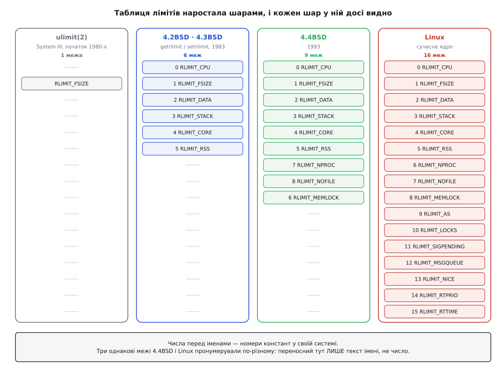

# 📜 Родовід лімітів: від однієї межі до шістнадцяти

Сучасна таблиця лімітів має шістнадцять рядків, і жоден із них не потрапив туди за планом. Механізм наростав шарами протягом трьох десятиліть — Мюррей-Гілл, Берклі, потім Linux, — і майже кожна дивина, з якою сьогодні стикається адміністратор, є слідом того шару, у якому її придумали. Ця історія варта уваги не заради дат: вона пояснює, чому команда зветься `ulimit`, хоча однойменного виклику вже нема, чому розмір файлу досі міряють блоками по 512 байтів, і чому номер константи `RLIMIT_NPROC` у Linux і в BSD різний.

## Одна межа — і та про розмір файлу

Найперша межа в родоводі — не про пам'ять і не про процеси. Це `ulimit(2)` зі світу AT&T — сторінка `ulimit(3)` і сьогодні виводить її походження від SVr4, — і вміла вона рівно одну річ: максимальний розмір файлу, який процес має право створити.

У System III виклик приймав номер команди й уже тоді розрізняв три дії: дізнатися межу розміру файлу, встановити її й дізнатися максимально можливе значення `break` — верхню позначку, до якої може дорости сегмент даних. Одиниця — **блок по 512 байтів**, тобто дисковий сектор тих машин. Обмеження успадковували нащадки. Опустити межу міг будь-хто, підняти — лише процес із ефективним ідентифікатором суперкористувача, інакше `EPERM`.

Чому саме розмір файлу? Тому що це була та єдина витрата, від якої в багатокористувацькій системі одна необережна програма справді валила решту. Пам'яті було мало, але вона поверталася при завершенні; місце на диску не поверталося ніколи. Нескінченний цикл із `write()` заповнював розділ і зупиняв усіх — а квот на файлові системи ще не існувало. Одна межа проти одної біди.

Тут-таки, у найпершому шарі, вже готова **асиметрія прав**: униз вільно, вгору лише привілейованому. Це не було винаходом системи лімітів — так узагалі влаштований Unix там, де йдеться про послаблення й посилення обмеження, і те саме правило видно, скажімо, у `umask`. Але саме звідси воно перейшло у все, що виросло далі.

## LIM_NORAISE: перша спроба Берклі

У Берклі до тієї самої задачі підійшли з іншого боку. У версіях BSD, що передували 4.2, був виклик `vlimit(2)` — родич `vtimes()` і решти «v»-сімейства, яке в 4.2BSD уже описували як застаріле: сторінка `vlimit(3c)` починається зі слів, що засіб **замінено на `getrlimit(2)`**, і чесно попереджає, що виклик властивий саме цій версії Unix і може змінитися або зникнути.

Але цікаве в ньому — набір. `vlimit()` знав не одну межу, а сім: `LIM_CPU` (процесорні секунди), `LIM_FSIZE` (найбільший файл), `LIM_DATA` (наскільки може вирости ділянка даних через `sbrk()`), `LIM_STACK` (автоматично розширюваний стек), `LIM_CORE` (розмір аварійного дампу), `LIM_MAXRSS` (м'яка межа на фізичну пам'ять) — і сьомий, `LIM_NORAISE`.

Сьомий — не ресурс. Це псевдо-межа: прапорець, який означає «більше жодну межу підняти не можна», і зняти його міг лише суперкористувач. Тобто одна незворотна засувка на весь процес одразу.

У цій засувці — зародок жорсткого ліміту, і водночас видно, чому її довелося переробити. `LIM_NORAISE` — усе або нічого. Процес не міг сказати «дескрипторів мені досить, а процесорного часу ще підкинь»; він або лишався вільним піднімати будь-що, або замикався весь. Задача була сформульована правильно (треба вміти незворотно себе обмежити), а розв'язок мав неправильну зернистість.

## 4.2BSD: пара чисел замість засувки

Розв'язок з'явився у 4.2BSD (серпень 1983): пара `getrlimit`/`setrlimit`. Сторінка `getrlimit.2` лежить у дереві вже в передрелізному 4.1cBSD із датою 26 лютого 1983 року.

Хід думки простий, коли його побачити. Візьмімо «не піднімати» й **прикріпімо його до кожного ресурсу окремо** — не як прапорець, а як число, вище якого поточна межа не піднімається. Так замість «одна межа плюс глобальна засувка» виходить **дві межі на кожен ресурс**. Структура з 4.2BSD не змінилася відтоді ані в один спосіб:

```c
struct rlimit {
        int     rlim_cur;       /* current (soft) limit */
        int     rlim_max;       /* maximum value for rlim_cur */
};

#define RLIM_NLIMITS    6               /* number of resource limits */
#define RLIM_INFINITY   0x7fffffff
```

І правила руху — теж дослівно ті самі, що діють сьогодні. Сторінка 4.2BSD формулює їх в одному реченні: підняти верхні межі може лише суперкористувач, інші користувачі можуть тільки міняти `rlim_cur` у проміжку від нуля до `rlim_max` або **незворотно** опустити сам `rlim_max`. Слово «незворотно» стоїть у дужках у оригіналі — це прямий спадкоємець `LIM_NORAISE`, тільки тепер по одній засувці на кожен ресурс.

Набір ресурсів Берклі взяли з `vlimit()` майже без змін — CPU, FSIZE, DATA, STACK, CORE, RSS, — викинувши сьомий елемент, бо він перестав бути потрібним: його ідея розчинилася в самій структурі. Шість меж. Стільки ж було й у 4.3BSD: заголовок `resource.h` там дослівно той самий, включно з коментарем про мілісекунди біля `RLIMIT_CPU`.

> 🔧 **Навіщо це.** Пара «м'яка–жорстка» — не інженерна прикраса, а мінімальна форма, у якій уміщуються дві несумісні вимоги: «дай процесові розпоряджатися своїм запасом» і «не дай йому підняти собі стелю». Одним числом їх не виразити, трьох не потрібно. Її придумали 1983 року і не змінювали жодного разу — рідкісний випадок, коли інтерфейс улучив у задачу з першого разу.

## Чому команда зветься `ulimit`

Тепер найпомітніший слід історії. Виклику `ulimit(2)` у Linux фактично немає — `ulimit(3)` лишилася сумісною обгорткою, POSIX.1-2001 її ще описував, а POSIX.1-2008 позначив застарілою. А команда в оболонці зветься саме так.

Річ у тім, що межі має міняти **та сама оболонка**, а не окрема програма: значення успадковують, а не передають. Тому команда мусить бути вбудованою — POSIX так її й описує: оскільки `ulimit` впливає на середовище виконання самої оболонки, вона **завжди** надається як звичайна вбудована команда.

Розділилися ці два світи так само, як розділялися всі інші. У Берклі команди зробили для `csh` і назвали їх `limit` та `unlimit` — вони згадані в самій сторінці `getrlimit.2`, а її розділ BUGS містить фразу, яку сьогодні читати смішно: «варто було б мати команди `limit` і `unlimit` в `sh(1)`, а не тільки в `csh(1)`». Сімейство Борна цієї поради послухалося — але взяло ім'я не з BSD, а зі свого світу System V, від виклику `ulimit()`. Так усередині опинився механізм Берклі, а зовні — назва AT&T. Це той самий шов, що проходить через увесь [родовід Unix](root:sys-unix/unix-lineage): дві гілки роками робили те саме різними словами, а [POSIX](root:sys-unix/posix-standard) потім склеював те, що встигло розійтися.

Скам'янілість не одна. У POSIX, якщо не дано жодного ключа, крім `-H` або `-S`, `ulimit` поводиться так, **ніби задано `-f`** — розмір файлу. Це просто первісний `ulimit(2)`, який іншого й не вмів: тридцять років потому команда без аргументів досі говорить про ту саму єдину межу, з якої все почалося. І одиниці розкидані так само історично: `-f` та `-c` міряють у блоках — тих самих 512 байтів у POSIX-режимі (bash типово бере 1024), а `-d`, `-s`, `-v` — у кілобайтах. Одна команда, дві одиниці — бо перші два ключі прийшли з тексту 1980 року, а решта з BSD, де межі задавали байтами.

## 4.4BSD: дескриптори, процеси і замкнена пам'ять

Наступний шар з'явився через десять років. У 4.4BSD (1993) до шести меж додалися три:

```c
#define RLIMIT_MEMLOCK  6       /* locked-in-memory address space */
#define RLIMIT_NPROC    7       /* number of processes */
#define RLIMIT_NOFILE   8       /* number of open files */

#define RLIM_NLIMITS    9       /* number of resource limits */
```

Десятирічна пауза тут промовиста. Усі три нові межі — про те, що стало дефіцитом саме в BSD і саме за ці роки. Дескриптори подорожчали, бо в 4.2BSD з'явилися сокети, і дескриптор перестав означати «відкритий файл»: тепер це ще й кожне мережеве з'єднання, і в сервера їх стільки, скільки клієнтів. Кількість процесів стала окремим ресурсом, бо вичерпати таблицю задач розмноженням виявилося простіше, ніж вичерпати диск. А `RLIMIT_MEMLOCK` — межа на замкнену в пам'яті ділянку — з'явилася разом із самою можливістю замикати сторінки: `mlock()` вилучає кадри з-під витіснення назавжди, тобто дозволяє процесові забрати фізичну пам'ять так, що ядро не зможе її повернути.

Помітно, що всі три — того самого крою, що й перші шість: ресурс видають **явним викликом**, отже є мить, у яку можна порівняти лічильник із числом і відмовити. Шар за шаром додавали не «що хотілося обмежити», а «що вдавалося обмежити дешево».

## Linux: чужа таблиця, свої номери

Linux успадкував інтерфейс Берклі цілком — імена, структуру, правила руху, — але не успадкував **чисел**. Порівняння двох заголовків показує це в один погляд:

```
4.4BSD                    Linux
  6  RLIMIT_MEMLOCK        6  RLIMIT_NPROC
  7  RLIMIT_NPROC          7  RLIMIT_NOFILE
  8  RLIMIT_NOFILE         8  RLIMIT_MEMLOCK
```

Три однакові межі з однаковими іменами дістали три різні номери. Наслідок практичний: переносне тут **ім'я константи, а не її значення**. Програма, скомпільована з чужим заголовком, попросить не той ліміт і не отримає жодної помилки — просто прочитає й перепише не той рядок таблиці. Це щоденна причина, чому системні виклики ніколи не викликають числами: між ядром і програмою переносний тільки текст, а числа кожна система роздає свої й [заморожує назавжди](root:sys-unix/userspace-abi-stability).

Змінилася й одиниця найстаршої межі. Коментар у 4.2BSD каже «cpu time in milliseconds», у Linux — «CPU time in sec». Мілісекунди мали сенс на машині, де процес рахували секундами; коли задачі почали жити тижнями, точність до мілісекунди в 32-бітному числі стала просто стелею в неповних двадцять п'ять діб.

І `RLIM_INFINITY` вже інше: у BSD це `0x7fffffff` — найбільше додатне значення знакового `int`, бо поля структури були знакові. У Linux — `(~0UL)`, усі одиниці в беззнаковому слові. Те саме поняття «стелі немає», але записане у типі, який дозволяє межу понад два гігабайти.

## Що додавали далі — і за яким принципом

Далі росло вже саме ядро Linux, і кожне додавання має свою причину.



*Механізм не спроєктували цілим — його доклали шарами, і в сучасній таблиці видно кожен. Заразом видно перенумерування: три спільні з 4.4BSD межі стоять під іншими номерами.*

**`RLIMIT_AS`** (номер 9) прийшов не з BSD, а зі світу System V і специфікацій Single UNIX — там ту саму річ звали `RLIMIT_VMEM`. Це перша межа, яка міряє не витрачене, а **видане**: розмір адресного простору, незалежно від того, чи стоять за ним фізичні сторінки. Її поява — визнання того, що обмежити справжнє споживання пам'яті цим механізмом не вдалося.

**`RLIMIT_LOCKS`** прожив недовго: з'явився в Linux 2.4.0 і перестав діяти з 2.4.25. Він обмежував кількість файлових блокувань, які процес тримає одночасно, — рахували об'єкти всередині ядра, поки їх було легко порахувати. Коли підсистему блокувань переробили, рахувати стало ніде, і межу лишили в заголовку мертвою. Так само вийшло з `RLIMIT_RSS`: у Linux він мав дію лише у гілці 2.4.

**`RLIMIT_SIGPENDING`** і **`RLIMIT_MSGQUEUE`** з'явилися разом, у Linux 2.6.8, і це знову той самий крій: обидва рахують **пам'ять ядра, яку процес змусив виділити на свою користь**. Черга сигналів, що чекають доставки, і байти в [чергах повідомлень POSIX](root:sys-unix/message-queues) — це структури, яких процес не бачить у своєму адресному просторі, але замовляє їх викликами. Раніше замовити їх можна було без ліку.

**`RLIMIT_NICE`** і **`RLIMIT_RTPRIO`** (Linux 2.6.12) — найдивніші в родоводі, бо вони **перевертають зміст слова «ліміт»**. Решта меж кажуть «не більше, ніж»; ці кажуть «тобі дозволено аж стільки». Звичайний користувач не може знизити собі `nice`, тобто взяти більше процесорного часу, — а `RLIMIT_NICE` вказує, наскільки саме йому це все-таки можна; `RLIMIT_RTPRIO` так само видає право на [реальночасовий пріоритет](root:sys-unix/priority-nice-realtime). Це вже не запобіжник проти божевільного процесу, а спосіб віддати дрібну частку прав суперкористувача, не віддаючи самих прав. Ту саму задачу — «розібрати всесилля root на шматки» — приблизно тоді ж розв'язували [можливості](root:sys-unix/capabilities), і два механізми зустрілися: підняти жорстку межу дозволено власникові `CAP_SYS_RESOURCE`, а самі межі роздають права.

**`RLIMIT_RTTIME`** (Linux 2.6.25) закриває дірку, яку відкрив `RLIMIT_RTPRIO`: реальночасова задача, що не блокується, захоплює ядро процесора назавжди, бо витіснити її нема кому. Межа на безперервний час без блокування — запобіжник саме проти цього.

Шістнадцять рядків, і остання поява — 2008 рік. Далі таблиця не росте, і це саме по собі відповідь: усе, що можна впровадити одним порівнянням на шляху запиту, вже впроваджено.

## Тридцять два біти й четвертий системний виклик

Останній шар — не про ресурси, а про арифметику. Ядро зберігало межі як 32-бітове `unsigned long`, і для `RLIMIT_FSIZE` цього перестало вистачати: файли переросли чотири гігабайти. Обгортка glibc поводилася тут неприємно тихо — значення, яке не вміщалося, вона мовчки перетворювала на `RLIM_INFINITY`. Тобто спроба поставити велику, але скінченну межу давала «межі немає».

Виправлення прийшло у вигляді нового виклику: **`prlimit()`, Linux 2.6.36, glibc 2.13**. Він з самого початку працює з 64-бітними значеннями, читає й пише пару за один захід і, крім того, вміє те, чого не вмів жоден попередник, — міняти межі **чужого** процесу за його PID.

І тут сталося те, що добре показує, як у Unix зникають старі інтерфейси: ніяк. Від glibc 2.13 обгортки `getrlimit()` і `setrlimit()` більше не викликають однойменних системних викликів — вони обидві звертаються до `prlimit()` з нульовим PID, тобто «про себе». Стара сигнатура лишилася в програмах, старі номери викликів лишилися в ядрі назавжди, а справжня робота переїхала. Ніхто нічого не переписував: під незмінним фасадом просто змінили те, що за ним.

## Куди пішла думка далі

Родовід лімітів обривається не тому, що механізм добудували, а тому, що подальші питання виявилися іншими за природою. Кожен шар цієї історії додавав межу там, де в ядрі був **момент запиту**. Коли залишилися ресурси без такого моменту — резидентна пам'ять, частка процесора, пропускна здатність диска, — виявилося, що додати сімнадцятий рядок неможливо: нема куди вставити порівняння.

Відповіддю став механізм зовсім іншої будови — [cgroups](root:sys-unix/cgroups-resource-model), де ресурс обліковують для цілого дерева процесів і тиснуть на групу, а не відмовляють одному викликові. Роботи він коштує незрівнянно більше, і саме тому пара чисел нікуди не поділася: шістнадцять рядків, що наросли за тридцять років, досі коштують рівно одного порівняння там, де ресурс і так видають.
