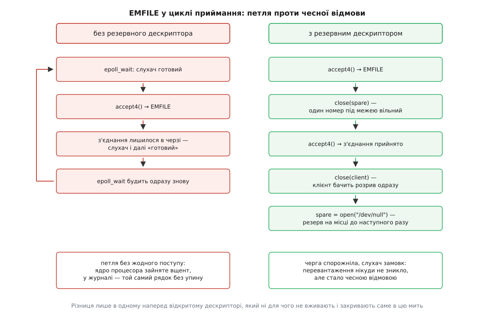

# ⚙️ Що видно, коли межа справді спрацьовує

Межу дескрипторів легко переказати словами й важко впізнати в живій системі: у журналі з'явиться «Too many open files», у коді буде `errno == EMFILE`, а число, яке треба правити, лежатиме за три ланки звідси. Тут три короткі програми, які прибирають здогади: перша міряє, скільки дескрипторів дають насправді, друга показує, у що межа перетворює цикл приймання з'єднань, третя ставить огорожу перед запуском чужого коду — таку, якої той не зніме.

Усе тримається на трьох викликах: `getrlimit()`, `setrlimit()` і звичайному `open()`. Решта — уважна арифметика.

## Скільки їх насправді

Питання здається наївним, доки не спробуєш відповісти. `ulimit -n` друкує межу оболонки, а не твоєї програми. `/proc/self/limits` друкує число, а не те, скільки з нього ще вільно. І жодне з них не каже, як саме виглядатиме кінець — а саме кінець потім і доведеться впізнавати в журналі. Найкоротший шлях до відповіді — узяти й порахувати.

```c
#define _GNU_SOURCE
#include <errno.h>
#include <fcntl.h>
#include <stdio.h>
#include <string.h>
#include <sys/resource.h>
#include <unistd.h>

int main(void)
{
    struct rlimit rl;

    if (getrlimit(RLIMIT_NOFILE, &rl) != 0) {
        perror("getrlimit");
        return 1;
    }
    printf("на старті:  м'який %llu  жорсткий %llu\n",
           (unsigned long long)rl.rlim_cur, (unsigned long long)rl.rlim_max);

    rl.rlim_cur = rl.rlim_max;              /* угору до жорсткого — прав не треба */
    if (setrlimit(RLIMIT_NOFILE, &rl) != 0)
        perror("setrlimit");                /* не фатально: міряємо те, що дали */
    getrlimit(RLIMIT_NOFILE, &rl);          /* що вийшло насправді */

    int first = -1, last = -1;
    long n = 0;

    for (;;) {
        int fd = open("/dev/null", O_RDONLY | O_CLOEXEC);
        if (fd < 0)
            break;
        if (first < 0)
            first = fd;
        last = fd;
        n++;
    }
    int stop = errno;                       /* зберегти до першого printf */

    printf("м'який тепер %llu; відкрито ще %ld\n",
           (unsigned long long)rl.rlim_cur, n);
    printf("номери від %d до %d; зупинив: %s (errno %d)\n",
           first, last, strerror(stop), stop);
    return 0;
}
```

На звичайній машині із systemd це виглядає так:

```
$ ulimit -n ; ulimit -Hn
1024
524288
$ ./nofile-probe
на старті:  м'який 1024  жорсткий 524288
м'який тепер 524288; відкрито ще 524285
номери від 3 до 524287; зупинив: Too many open files (errno 24)
```

Кожне число тут щось означає, і разом вони сходяться:

```
м'який ліміт після підняття     = 524 288
зайнято до початку циклу (0,1,2)=       3
─────────────────────────────────────────
вільних номерів                 = 524 285   ← стільки й відкрилося
найбільший виданий номер        = 524 287   = ліміт − 1
```

Перше: підняти м'який ліміт до жорсткого справді вдалося без жодних прав — програма стартувала з тисячею дозволених дескрипторів і закінчила з півмільйоном, нічого нікого не питаючи. Друге: відкрилося не 524 288, а 524 285, бо три номери вже були зайняті стандартними потоками; у справжній програмі на цю мить відкриті ще й журнал, і сокети, і бібліотечні файли, тож «скільки лишилося» завжди менше за «яка межа». Третє й найважливіше: рядок «зупинив» надрукував не здогад, а `errno` тієї миті, коли ядро сказало «ні». `EMFILE` означає, що вперлася саме ця програма. Якби там стояло `ENFILE`, ішлося б про геть іншу межу — вичерпалася б загальносистемна, і піднімати свою було б безглуздо.

> 🔧 **Навіщо це.** Три рядки різниці між «межа 524 288» і «нам лишилося 524 285» здаються дрібницею, поки не побачиш `EMFILE` при щедрій на вигляд межі. Найчастіша причина саме така: межа велика, але майже вся вже вибрана — тисячами з'єднань, які ніхто не закрив, або відображеними файлами, про які забули. Число з `ulimit -n` тут не скаже нічого; скаже лічильник у `/proc/<pid>/fd` і `errno` в момент відмови.

## Межа міряє номер, а не кількість

Довідка `setrlimit(2)` формулює `RLIMIT_NOFILE` дослівно так: це значення на одиницю більше за найбільший номер дескриптора, який процес може відкрити. Не «скільки штук», а «до якого номера». Різниця непомітна, доки номери роздає ядро: воно завжди повертає [найменший вільний номер](topic:sys-unix/file-descriptor) — дескриптор і є індексом у таблиці процесу, — тож кількість відкритого й найбільший номер ідуть поруч. Різниця стає видимою тієї миті, коли номер вибираєш ти сам.

```c
int fd = open("/dev/null", O_RDONLY);
int hi = dup2(fd, (int)rl.rlim_cur);    /* просимо номер рівно на межі */
/* hi == -1, errno == EBADF — а не EMFILE */
```

`dup2()` з номером за межею повертає `EBADF`, а `fcntl(fd, F_DUPFD, n)` із таким самим `n` — `EINVAL`. Жодна з цих помилок не згадує ані «too many», ані ліміт узагалі. Програма, яка кладе службовий дескриптор на наперед домовлений номер — звичайна річ у запускачах, пісочницях і тестах, — на вужчій межі отримає «поганий дескриптор» про дескриптор, який щойно сама успішно відкрила. Шукати причину будуть де завгодно, тільки не в `ulimit`.

## Коли межа спрацьовує в сервері

Одна відмова `open()` нікому не шкодить: програма побачила помилку й вирішила, що з нею робити. Біда починається там, де відмова потрапляє в цикл, який сам себе годує.

Цикл приймання з'єднань улаштований так: `epoll_wait()` каже, що слухач готовий, програма викликає `accept4()` і бере з'єднання з черги. Коли `accept4()` не може виділити номер під новий сокет, він повертає `EMFILE` — і, що вирішально, **з'єднання лишається в черзі**: ядро перевіряє номер перед тим, як зняти з'єднання з черги, тож не знявши нічого, воно нічого й не змінило. Слухач і далі «готовий». За [рівневого сповіщення](topic:sys-unix/select-poll-epoll), яке в `epoll` типове, наступний `epoll_wait()` повернеться миттєво з тією самою готовністю — і так без кінця.



*Ліворуч процес живий, гарячий і абсолютно безплідний; праворуч він розвантажує чергу, розриваючи з'єднання, які не може обслужити.*

Наслідок гірший за просте падіння. Процес не помер — його не перезапустить ані systemd, ані оркестратор. Він тримає ядро процесора зайнятим на сто відсотків, пише в журнал той самий рядок тисячі разів на секунду й не робить нічого корисного. Перемикання `epoll` на крайове сповіщення петлю прибирає, але замінює її на іншу неприємність: перервавши читання черги на `EMFILE`, програма більше не отримає сповіщення, доки не прийде **нове** з'єднання, — а ті, що вже стоять у черзі, чекатимуть без відповіді.

Розв'язок, який використовують справжні цикли подій, простий до образливого: тримати наперед відкритий дескриптор, який нікому не потрібен, саме на цей випадок. У libuv це `uv__emfile_trick`: при ініціалізації циклу відкривають наперед один непотрібний файл лише заради номера й кладуть його в `loop->emfile_fd`, а сам прийом у коментарі названо «best effort».

```c
/* Резервний номер: відкриваємо заздалегідь і не використовуємо. */
static int spare = -1;

static void spare_open(void)
{
    spare = open("/dev/null", O_RDONLY | O_CLOEXEC);
}

/* Викликати, коли accept4() повернув EMFILE. Мета не в тому, щоб обслужити
   клієнта, а в тому, щоб прибрати з'єднання з черги — інакше слухач
   лишиться «готовим» назавжди. */
static void emfile_relief(int listen_fd)
{
    if (spare < 0)
        return;

    close(spare);                    /* один номер під межею звільнився */
    spare = -1;

    for (;;) {
        int c = accept4(listen_fd, NULL, NULL, SOCK_CLOEXEC);
        if (c < 0)
            break;                   /* черга спорожніла або знову EMFILE */
        close(c);                    /* клієнт бачить розрив одразу */
    }

    spare_open();                    /* резерв на місці до наступного разу */
}
```

Чому «best effort» — видно з коду. Між `close(spare)` і `accept4()` звільнений номер може забрати інший потік того самого процесу: межа спільна на всю групу потоків, і резервувати номер за кимось конкретним нема як. Тоді `accept4()` знову поверне `EMFILE`, цикл вийде на першому ж кроці, а резерв відновиться — гірше, ніж було, не стало. І варто бачити межу самого прийому: він не лікує перевантаження, а перетворює нескінченну петлю на швидку відмову, після якої програма ще здатна закрити старі з'єднання й повернутися до роботи. Проти `ENFILE` він не працює зовсім: звільнений тобою номер не гарантує тобі ж вільного запису в загальносистемній таблиці.

## Замкнути межу за собою

Тепер зворотна задача. Ми зараз запустимо чужий код — обробник із репозиторію, перетворювач форматів, доповнення. Ми хочемо, щоб він дістав щонайбільше стільки-то дескрипторів, не зміг підняти цю межу назад і не отримав у спадок наших відкритих файлів.

Усе це робиться в дитині між `fork()` і `exec()`, поки вона ще «своя»:

```c
#define _GNU_SOURCE
#include <sys/resource.h>
#include <unistd.h>

/* Запустити чужу програму так, щоб вона не змогла ані взяти більше
   за nofile дескрипторів, ані повернути цю межу собі назад. */
static pid_t spawn_fenced(char *const argv[], rlim_t nofile, rlim_t cpu_sec)
{
    pid_t pid = fork();
    if (pid != 0)
        return pid;                       /* батько своїх меж не чіпав */

    /* Обидва поля разом: rlim_cur > rlim_max дало б EINVAL. */
    struct rlimit rl = { .rlim_cur = nofile, .rlim_max = nofile };
    if (setrlimit(RLIMIT_NOFILE, &rl) != 0)
        _exit(125);

    rl.rlim_cur = cpu_sec;                /* м'яка межа → SIGXCPU */
    rl.rlim_max = cpu_sec + 1;            /* ще секунда → SIGKILL */
    if (setrlimit(RLIMIT_CPU, &rl) != 0)
        _exit(125);

    /* Без цього чужа програма успадкує наші відкриті файли — і сокет бази,
       і журнал; кожен із них ще й з'їв би номер із її нової межі. */
    if (close_range(3, ~0U, 0) != 0)      /* Linux 5.9, glibc 2.34 */
        _exit(125);

    execvp(argv[0], argv);
    _exit(127);
}
```

Опустити жорсткий ліміт дитина може без жодних прав — рух униз дозволений завжди. Підняти назад — уже ні. Найпростіша перевірка: підсунути замість «чужого коду» програмку, яка чесно намагається це зробити.

```c
#include <stdio.h>
#include <sys/resource.h>

int main(void)
{
    struct rlimit rl;

    getrlimit(RLIMIT_NOFILE, &rl);
    printf("дали: м'який %llu, жорсткий %llu\n",
           (unsigned long long)rl.rlim_cur, (unsigned long long)rl.rlim_max);

    rl.rlim_cur = rl.rlim_max = 4096;
    if (setrlimit(RLIMIT_NOFILE, &rl) != 0)
        perror("спроба підняти назад");
    return 0;
}
```

```
$ ./fenced 64 -- ./raise-back
дали: м'який 64, жорсткий 64
спроба підняти назад: Operation not permitted
```

Варто одразу побачити, для кого саме ця межа незворотна. `EPERM` тут отримує процес без [можливості `CAP_SYS_RESOURCE`](topic:sys-unix/capabilities) — окремого дозволу, який ядро перевіряє замість колишнього «чи ти root». Дитина, запущена від root із повним набором можливостей, поверне межу на місце одним викликом, а привілейований процес ззовні зробить те саме через `prlimit()` за її PID. Огорожа з `setrlimit()` варта чогось лише разом зі [скиданням привілеїв](topic:sys-unix/setuid-and-privilege) — інакше вона тримає тільки чесного. І навіть тоді це не пісочниця: ліміти не заважають чужому коду читати файли, ходити в мережу чи чекати вічно — межа `RLIMIT_CPU` рахує процесорні секунди, а не час на годиннику. Там, де треба справді обмежити дозволене, розмову ведуть [фільтри системних викликів](topic:sys-unix/seccomp-filter-mechanism) і простори імен; `rlimit` відповідає лише на питання «скільки», і робить це за два виклики.

## Що це коштує і де тут пастки

Ціна самої перевірки — одне порівняння в тому місці, де ресурс і так видають; на тлі роботи, яку робить `open()`, її не видно. Коштує інше — те, що ти дозволив узяти:

```
відкритих дескрипторів         = 524 288
struct file в ядрі, порядок    ≈     256 Б   (залежить від версії ядра)
─────────────────────────────────────────────
пам'яті ядра, яку не витіснити ≈     134 МБ
масив указівників у процесі    = 524 288 · 8 Б ≈ 4 МБ
```

Це пам'ять, яка не піде у своп і не звільниться під тиском. Тому «просто підняти до мільйона» — не нейтральна дія, а обіцянка віддати сотні мегабайтів ядерної пам'яті одному процесові, якщо той вирішить її взяти.

Далі — місця, де ці програми ламаються не там, де на них дивляться.

**Заповнюй обидва поля свідомо.** `setrlimit()` бере структуру цілком, тож «підняти м'який до 65536», написане як `rl.rlim_cur = rl.rlim_max = 65536`, тихо **опускає жорсткий** із 524288 до 65536 — і назад його вже не підняти. Правильний порядок завжди той самий: `getrlimit()`, змінити рівно потрібне поле, `setrlimit()`. Помилка в інший бік менш підступна: структура з одним заповненим `rlim_cur` лишає `rlim_max` нулем, `rlim_cur > rlim_max` дає `EINVAL`, і це видно одразу.

**Опущена межа не закриває вже відкритого.** Перевірка стоїть на видачі, тож `prlimit --pid 1234 --nofile=1024:1024` для служби, яка тримає сорок тисяч дескрипторів, не закриє жодного — вона лише не дасть відкрити наступний. Це спосіб зупинити кровотечу, а не вилікувати. З того самого правила випливає й дрібниця в огорожі: порядок `setrlimit()` і `close_range()` не має значення, бо межа не діє заднім числом.

**Go підіймає межу сам.** Від версії 1.19 програма мовою Go, яка імпортує пакет `os`, на старті піднімає собі м'який `RLIMIT_NOFILE` до жорсткого, запам'ятавши початкову пару, а перед `exec` повертає в дитині те, що було. У релізних нотатках Go це названо прямо: старий м'який ліміт існує заради програм, які використовують `select()`, а Go його не використовує. Практичний наслідок подвійний: `ulimit -n`, запущений усередині Go-програми, покаже не те, що ти виставив, а програма мовою C, запущена з неї, отримає твою початкову тисячу, а не піднятий півмільйон.

**`RLIMIT_NPROC` як огорожа працює тільки з окремим користувачем.** Бюджет задач рахують на реальний UID по всій системі, тож обмеження «не більше 32 процесів» для чужого коду, запущеного від того самого користувача, що й решта твоїх служб, ділиться з ними — і вичерпає його, найімовірніше, не чужий код. Історична пастка поруч: колись `setuid()` міг відмовити з `EAGAIN`, якщо в цільового користувача вже було процесів понад `RLIMIT_NPROC`; у Linux цю перевірку прибрали з версії 3.1, але довідка досі радить її враховувати — і окремо попереджає, що не перевірити повернене `setuid()` значення є важкою помилкою безпеки навіть для root. Мовчазна відмова тут означає, що чужий код побіжить із твоїми правами.

**`close_range()` є не всюди.** До Linux 5.9 (і glibc 2.34) доводиться закривати вручну — циклом до `rlim_cur` або обходом `/proc/self/fd`, пам'ятаючи, що сам каталог теж відкритий дескриптором. І є деталь, за яку платять налагодженням: закривши все, дитина втрачає спосіб повідомити, чому впав `execvp()`. Класичний прийом — тримати `CLOEXEC`-трубу для звіту й обходити її двома діапазонами, `close_range(3, errfd - 1, 0)` і `close_range(errfd + 1, ~0U, 0)`; після вдалого `exec` ядро закриє її саме, і порожня труба в батька означає «запустилося». Флаг `CLOSE_RANGE_CLOEXEC` (Linux 5.11) робить ту саму роботу м'якше — не закриває, а лише позначає дескриптори як такі, що [не переживуть заміну образу](topic:sys-unix/exec-semantics).
