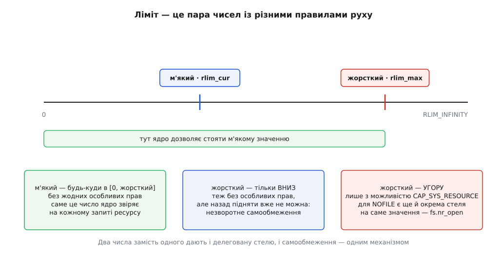
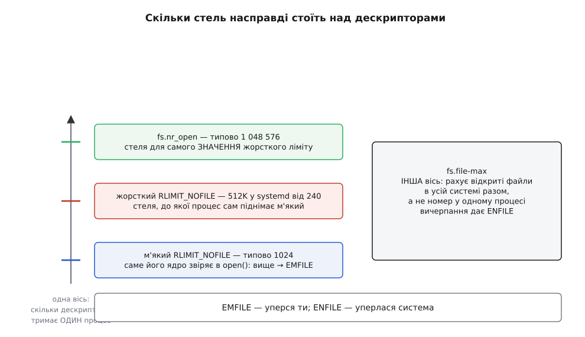
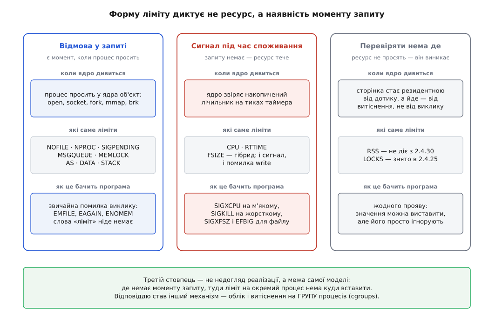
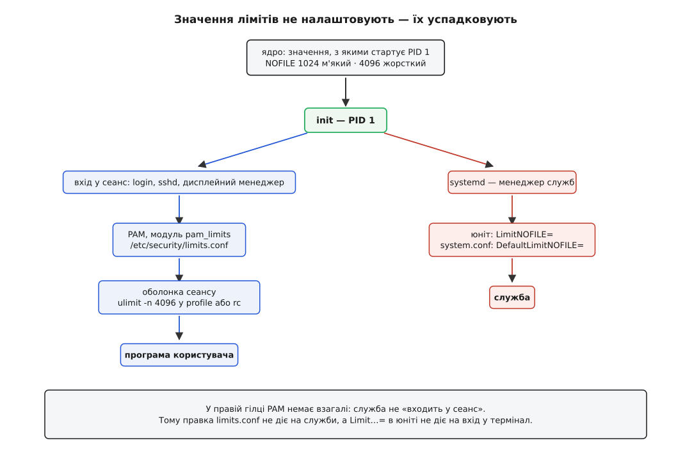

# Ліміти ресурсів: rlimit і ulimit

<preknowlist>
- [Процес: що це насправді](topic:sys-unix/process-model) — процес як обліковий запис у ядрі: власний адресний простір, таблиця дескрипторів, власник, лічильники.
- [Системний виклик](topic:sys-unix/syscall-mechanics) — як програма просить ядро зробити роботу і як звідти повертається помилка.
- [fork: розмноження процесу](topic:sys-unix/fork-semantics) — дитина починає життя точною копією батька й успадковує його властивості.
- [exec: заміна образу](topic:sys-unix/exec-semantics) — нова програма заступає стару в тому самому процесі, і частина властивостей переживає заміну.
- [Файловий дескриптор](topic:sys-unix/file-descriptor) — мале ціле число, індекс у таблиці процесу, через яке той читає й пише.
- [Сигнал: асинхронне сповіщення](topic:sys-unix/signal-model) — ядро вміє перервати процес повідомленням, у якого є типова дія.
- [Користувачі, групи й ідентичність процесу](topic:sys-unix/uid-gid-identity-model) — реальний і ефективний ідентифікатор користувача.
</preknowlist>

Ядро не вміє відрізнити помилку від наміру. Коли процес просить відкрити ще один файл, у самому проханні немає нічого, що сказало б, чи це сервер приймає тисячне з'єднання, чи цикл, у якому забули `close()`. Прохання виглядає однаково — а правильна відповідь на нього різна.

Тим часом кожне таке прохання коштує спільного. Відкритий файл — це структура в пам'яті ядра, яку не викине витіснення. Новий процес — запис у таблиці задач і сторінки під ядерний стек. Заблокована в пам'яті ділянка — фізичні кадри, які більше нікому не дістануться. Ресурси скінченні, і межу мусить провести ядро, бо більше нікому: воно єдине бачить усіх одразу.

Але вивести «досить» із самого прохання неможливо. Скільки дескрипторів забагато, залежить від того, що це за програма й навіщо її запустили, — а цього ядро не знає й знати не може. Отже число має прийти **ззовні й заздалегідь**: хтось, хто розуміє роль програми, чіпляє його до процесу ще до того, як той почав працювати, а ядро потім лише звіряє з ним кожен запит. Це і є ліміт ресурсу (лат. *limes* — межа, рубіж): не порада й не політика, а число, з яким порівнюють у мить видачі.

Далі все випливає з трьох запитань: де це число живе, скільки їх насправді і в яку саме мить на нього дивляться.

## Чому чисел два

Почнімо з місця. Прикріпити межу до виконуваного файлу не вийде: той самий `/usr/bin/python` — і скрипт для копії каталогу, і бойова служба, і їм потрібні різні межі. Зробити її глобальною теж не вихід. Глобальні межі існують (`fs.file-max` рахує відкриті файли в усій системі), але вони не розв'язують задачі: така межа лише повідомляє, коли зупиниться вся машина, і ніяк не заважає одному процесу з'їсти геть усе до цієї позначки. Отже число має бути **власністю процесу** — окреме для кожного, як окремі в нього дескриптори й адресний простір.

Тепер складніше: хто його виставляє. Тут дві вимоги штовхають у різні боки.

Виставляти має не сама програма — інакше та, що збожеволіла, спокійно підніме собі межу перед тим, як її перетнути, і захист нічого не вартий. Але й протилежне неправда: програма часто знає свою потребу краще за того, хто її запускає. Сервер, що тримає шістдесят тисяч з'єднань, знає про це напевно, а адміністратор мусив би здогадатися й прописати руками.

Доки ліміт — одне число, ці вимоги несумісні. Розв'язок у тому, що чисел **два**.

- `rlim_cur`, **м'який** ліміт — те, що ядро справді впроваджує. Саме з ним порівнюють кожен запит.
- `rlim_max`, **жорсткий** ліміт — стеля для м'якого, а не для ресурсу. Ядро ніколи не звіряє з ним запити безпосередньо.

Правила руху різні, і в цій різниці — уся суть:

- м'який ліміт **будь-який процес** ставить куди завгодно в проміжку від нуля до жорсткого — без жодних особливих прав;
- жорсткий ліміт будь-який процес може **опустити** — теж без прав, але **назад підняти вже не зможе**;
- підняти жорсткий ліміт може лише той, хто має можливість `CAP_SYS_RESOURCE`.



*Дві межі замість однієї: ядро впроваджує м'яку, а жорстка обмежує саму м'яку. Асиметрія правил руху й робить механізм придатним одразу для двох різних задач.*

Перша задача — **делегування запасу**. Привілейований запускач ставить жорсткий ліміт високо, а далі непривілейована програма сама піднімає собі м'який, коли впевнена, що потребує стільки. Адміністратор віддає стелю, не віддаючи прав.

Друга — **самообмеження**. Монотонність (жорсткий ліміт ходить лише вниз і ніколи вгору) перетворює ліміт на засіб безпеки. Процес, який зараз виконає чужий код або перейде до менш надійної фази роботи, опускає собі жорсткі межі — і повернути їх не зможе вже ніхто всередині цього процесу, хай би що з ним сталося далі. Саме незворотність робить це обіцянкою, а не побажанням.

Окреме значення `RLIM_INFINITY` означає «стелі немає». Воно не обіцяє безмежності — лише що з цього боку перевірки не буде; фізична пам'ять, місце на диску й інші ліміти нікуди не зникають.

> 🔧 **Навіщо це.** Пара чисел пояснює дві речі, які інакше виглядають довільними. Чому `ulimit -n 65536` від звичайного користувача каже «operation not permitted», а `ulimit -n 4096` спрацьовує: перше піднімає жорстку межу, друге лише м'яку. І чому в контейнері іноді видно щедрий жорсткий ліміт при мізерному м'якому: середовище виконання роздало стелю всім, а розпоряджатися нею залишило самим програмам.

## Ліміти не передають — їх успадковують

`setrlimit()` змінює межі **тільки собі**. Виклику «запусти он ту програму з отакими лімітами» в Unix немає, і це не прогалина, а той самий підхід, що й з усім іншим у запуску процесів: нову властивість не передають параметром, її успадковують. `fork()` копіює обидва числа в дитину, `exec()` їх зберігає — і саме тому послідовність працює.

```c
#include <sys/resource.h>
#include <unistd.h>

/* Запустити програму з власною межею на кількість дескрипторів. */
pid_t run_limited(char *const argv[], rlim_t nofile)
{
    pid_t pid = fork();
    if (pid != 0)
        return pid;                     /* батько лишається зі своїми межами */

    struct rlimit rl = { .rlim_cur = nofile, .rlim_max = nofile };
    if (setrlimit(RLIMIT_NOFILE, &rl) != 0)
        _exit(127);

    execvp(argv[0], argv);              /* межа переживе заміну образу */
    _exit(127);
}
```

Дитина, поки ще «своя», доводить себе до потрібного стану звичайними викликами — тими самими, якими це робить будь-хто, — і лише потім заміняє програму. Опустити жорсткий ліміт тут можна без жодних прав, бо рух униз завжди дозволений.

Звідси й дрібниця, яка часто дивує: `ulimit` в оболонці — не програма, а **вбудована команда**, і не може бути інакше. Якби це був окремий виконуваний файл, він змінив би межі собі й тут-таки помер, нічого не залишивши по собі. Оболонка мусить міняти свої власні ліміти, щоб їх успадкували команди, які вона запустить далі.

Саме ім'я `ulimit` — спадок від старішого виклику `ulimit(3)`, який умів рівно одну річ: межу розміру файлу в одиницях по 512 байтів. Він походить із System V (SVr4), стандарт POSIX.1-2001 його ще описував, а POSIX.1-2008 позначив застарілим. Механізм давно інший, а слово в оболонці лишилося. [Як межі росли від однієї до двох десятків](topic:sys-unix/resource-limits/hist-limits-lineage.md) — окрема історія: пара `getrlimit`/`setrlimit` з'явилася в 4.2BSD (1983) і принесла з собою і саму ідею пари «м'який–жорсткий», і перший набір ресурсів, а Linux потім дописав до нього свої.

Ще дві важливі подробиці про те, кому належать ці числа. Набір лімітів належить **групі потоків**, а не окремому потоку: усі потоки процесу дивляться в один і той самий масив пар, і виставити потокові особисту межу неможливо. І з правила «тільки собі» є один виняток — `prlimit()`, доданий у Linux 2.6.36: він міняє межі **чужого** процесу за його PID, якщо той належить тому самому власникові або якщо в того, хто просить, є `CAP_SYS_RESOURCE`. Однойменна утиліта `prlimit(1)` уміє і те, і те — і показати чужі межі, і запустити програму з новими.

## Де саме ядро дивиться на число

Ліміт перевіряють не «фоново» й не за розкладом, а **в тому самому місці коду ядра, де ресурс видають**. Одна перевірка на шляху запиту — це і є вся ціна механізму.

Практичний наслідок цього важливіший, ніж здається: **відмова приходить як звичайна помилка звичайного виклику**. `open()` повертає `EMFILE`, `fork()` — `EAGAIN`, `mmap()` і `brk()` — `ENOMEM`, `mq_open()` — знову `EMFILE`. Слова «ліміт» немає ніде. У журналі з'являється «Too many open files», і в цьому реченні нема жодної підказки, що число, яке треба правити, лежить у файлі юніта systemd. Програми, які чесно друкують `strerror(errno)`, звинувачують систему в тому, що зробив з ними той, хто їх запустив.

З дескрипторами до цієї плутанини додається ще одна: `EMFILE` і `ENFILE` — різні помилки про різні межі, і сплутати їх легко.



*М'який ліміт, жорсткий ліміт і `fs.nr_open` стоять один над одним на одній осі — «скільки дескрипторів тримає один процес». `fs.file-max` міряє зовсім інше: скільки відкритих файлів у всій системі разом.*

`fs.nr_open` — стеля для самого **значення** жорсткого ліміту: спроба виставити `rlim_max` понад нього дає `EPERM` навіть привілейованому процесові. Типово це 1 048 576. Systemd від версії 240 піднімає і `fs.nr_open`, і `fs.file-max` до практичного максимуму, свідомо лишивши з чотирьох обмежувачів тільки два — м'який і жорсткий ліміт процесу.

## Три способи впровадити межу

Форму ліміту диктує не ресурс сам по собі, а те, чи існує **момент запиту**, у який можна вставити перевірку. Ресурсів багато, а способів упровадити межу — рівно три, і третій з них означає «ніяк».



*Класифікація не за тим, який ресурс обмежують, а за тим, чи є в ядра точка, де можна сказати «ні».*

**Є момент запиту — відмовляємо.** Дескриптори, процеси, черги повідомлень, заблокована пам'ять, розмір адресного простору — усе це процес отримує явним викликом. Ядро порівнює лічильник із м'яким лімітом і повертає помилку. Просто, дешево, передбачувано.

**Моменту запиту немає — б'ємо сигналом.** Процесорний час не просять: він витікає сам, поки задача виконується. Відмовляти нема в чому, тож `RLIMIT_CPU` влаштований інакше: ядро звіряє накопичену секунду на тиках таймера і, коли м'яку межу перетнуто, надсилає `SIGXCPU`. Типова дія цього сигналу — завершити процес, але його можна перехопити, і тоді видно тонку деталь реалізації: від Linux 2.6.12, якщо обробник встановлено і процес після нього далі живе, ядро **піднімає м'який ліміт на одну секунду** й повторює сигнал наступної секунди. Інакше сигнал сипався б безперервно. Коли ж дійде до жорсткої межі, приходить `SIGKILL`, і обговорювати вже нема чого. Так само влаштований `RLIMIT_RTTIME` (від 2.6.25) — запобіжник проти реальночасової задачі, яка захопила ядро процесора й не збирається засинати.

`RLIMIT_FSIZE` — гібрид: спроба записати за межу дає і `SIGXFSZ`, і помилку `EFBIG` у `write()`, бо тут момент запиту таки є, але сама межа стосується наслідку, який накопичується.

**Моменту немає взагалі — вставити ліміт нема куди.** Найповчальніший випадок — `RLIMIT_RSS`, межа на резидентну пам'ять. Сторінка стає резидентною не тому, що процес про це попросив, а тому, що він її **торкнувся**; іде вона так само без його участі — коли ядро вирішить витіснити. Точки, у якій можна відповісти «ні», просто не існує: відмовити в дотику до власної пам'яті ядро не може, а витіснити сторінку — це не відмова, а окрема робота з власною політикою. Тому `RLIMIT_RSS` діяв лише у гілці 2.4 до версії 2.4.30, після чого його тихо перетворили на ніщо: значення досі можна виставити й прочитати, воно просто ні на що не впливає. Так само вийшло з `RLIMIT_LOCKS`, що прожив від 2.4.0 до 2.4.24.

Це не недогляд реалізації, а межа самої моделі. Обмежити те, що не просять, можна лише **обліком і витісненням**, і робити це доводиться не для одного процесу, а для групи — інакше програма обійде межу, розмножившись. Саме звідси виріс інший механізм: [cgroups](topic:sys-unix/cgroups-resource-model) ведуть облік пам'яті, процесорного часу й вводу-виводу для цілого дерева процесів і тиснуть на групу, коли та виходить за бюджет. Пара чисел на процес такого не вміє й ніколи не вміла.

## Одиниця обліку — і де вона розходиться з інтуїцією

Механізм рахує те, що ядру було легко порахувати, коли ліміт вводили. Двічі це дає поведінку, якої не чекають.

**`RLIMIT_NPROC` рахує не нащадків, а задачі реального користувача — по всій системі.** Межа стосується не піддерева процесів, а всіх процесів і потоків із таким самим реальним UID, де б вони не жили. Тому служба з лімітом у 512 задач може впасти на `fork()` через те, що той самий користувач тримає відкриті сеанси в іншому місці машини: бюджет спільний. Перевіряють його в мить створення задачі — і не перевіряють зовсім, якщо в процесу є `CAP_SYS_ADMIN` або `CAP_SYS_RESOURCE`. Звідси класична пастка програм, що скидають привілеї: поки процес був привілейований, межа його не обходила, а щойно він став звичайним користувачем, наступний `fork()` дає `EAGAIN`.

**`RLIMIT_AS` рахує адресний простір, а не пам'ять.** Ядро звіряє суму розмірів відображень — усе, що є в адресному просторі, незалежно від того, чи стоять за ним фізичні сторінки. Відображений на пам'ять великий файл, зарезервовані наперед арени розподілювача, віртуальні ділянки середовищ виконання, які резервують гігабайти й торкаються мегабайтів, — усе це вичерпує `RLIMIT_AS`, майже не займаючи пам'яті. Як запобіжник проти витоку він працює грубо: спрацьовує задовго до реальної біди або не спрацьовує зовсім. `RLIMIT_DATA` трохи ближчий до наміру — він обмежує те, що взяли через `brk()`/`sbrk()`, а від Linux 4.7 ще й приватні записувані відображення `mmap()`, — але й він міряє видане, а не вжите. Порівняти видане з ужитим допомагає [облік пам'яті процесу](topic:sys-unix/memory-accounting): VSZ, RSS і PSS відповідають на різні запитання, і `RLIMIT_AS` стоїть на першому з них.

Повний перелік — які ресурси взагалі мають межу, у чому вимірюється кожен, як саме він спрацьовує і з якої версії ядра існує — зібрано окремо: [довідка по RLIMIT_*](topic:sys-unix/resource-limits/api-rlimit.md). Там же — сигнатури `getrlimit`/`setrlimit`/`prlimit`, відповідність між константою ядра, буквою `ulimit` та директивою systemd.

## Звідки в живій системі беруться значення

Жоден процес не «налаштовує» свої межі з якогось файлу. Він їх **успадкував** — від того, хто його запустив, а той від свого запускача, і так до PID 1.



*Дві гілки різняться однією ланкою: у гілці входу в сеанс є PAM, у гілці служб його немає взагалі.*

Ядро дає PID 1 набір типових значень — для дескрипторів це 1024 м'який і 4096 жорсткий. Далі гілка розходиться.

**Вхід у сеанс** (`login`, `sshd`, дисплейний менеджер) проходить через [PAM](topic:sys-unix/pam-stack) — стек модулів, крізь який система пропускає кожен вхід користувача, щоб перевірити пароль і підготувати сеанс. Один із цих модулів, `pam_limits`, читає `/etc/security/limits.conf` і виставляє межі майбутньому сеансові. Далі оболонка може підправити їх командою `ulimit` у файлах, які читає при старті, — і все, що запущено з цієї оболонки, успадкує результат.

**Служба** не входить у жоден сеанс. Її запускає systemd, і PAM у цьому шляху немає. Тому правка `limits.conf` не діє на служби взагалі — скільки її не перечитуй і скільки не перезапускай службу. Межі служби задають директиви `LimitNOFILE=`, `LimitNPROC=` і подібні в її [юніті](topic:sys-unix/systemd-model), а типові для всіх — `DefaultLimit…=` у `system.conf`. Це, мабуть, найчастіша помилка навколо лімітів у сучасній системі, і вона повністю пояснюється формою малюнка: правлять не ту ланку ланцюга.

У версії 240 (грудень 2018) systemd змінив тут одну важливу річ: жорсткий ліміт дескрипторів для служб підняли до 512K, а **м'який лишили на 1024**. Це не половинчастість, а свідоме рішення, і причина в ньому досить повчальна.

## Чому м'яка стеля дескрипторів досі 1024

Річ у старому інтерфейсі очікування. `select()` приймає набір дескрипторів як `fd_set` — бітовий масив **сталого** розміру `FD_SETSIZE`, який дорівнює 1024. Макрос `FD_SET(fd, &set)` для дескриптора з номером 1024 і більше запише біт **за межами масиву**: це не помилка, яку хтось поверне, а псування чужої пам'яті на стеку. Програма не падає в цьому місці — вона падає пізніше й у геть іншому місці.

Ядро тут безсиле: воно роздає найменші вільні номери й не знає, хто з ними піде в `select()`, а хто в [epoll](topic:sys-unix/select-poll-epoll), якому байдуже до номерів. Єдина доступна оборона — не дати старій програмі дескриптор із номером понад 1023. Саме це й робить м'який ліміт 1024: він не про ресурси, а про сумісність.

І тут пара чисел спрацьовує рівно так, як задумано. Програма, яка знає, що `select()` не використовує, на старті сама піднімає собі м'який ліміт до жорсткого — прав для цього не треба:

```c
#include <sys/resource.h>

/* Забрати весь виданий нам запас дескрипторів. */
static void take_all_nofile(void)
{
    struct rlimit rl;

    if (getrlimit(RLIMIT_NOFILE, &rl) != 0)
        return;
    if (rl.rlim_cur >= rl.rlim_max)
        return;

    rl.rlim_cur = rl.rlim_max;          /* у межах жорсткого — без CAP_SYS_RESOURCE */
    setrlimit(RLIMIT_NOFILE, &rl);
}
```

Три рядки на старті — і сервер має свої півмільйона дескрипторів, а старий інструмент, запущений у тому самому середовищі, лишається під захистом 1024. Ту саму пару чисел використано і як стелю, і як запобіжник для тих, хто не знає, що з нею робити.

Як це виглядає на практиці — підняти межу, впертися в неї, побачити `EMFILE` замість здогадок і поставити собі незворотну межу перед запуском чужого коду — розібрано з робочим кодом: [що видно, коли межа справді спрацьовує](topic:sys-unix/resource-limits/proj-fd-limit.md).

## `RLIMIT_STACK`: ліміт, який читають як налаштування

Більшість меж роблять рівно те, що обіцяють. `RLIMIT_STACK` — виняток, повчальний тим, що **число, поставлене як межа, читають зовсім інші частини системи як параметр**.

По-перше, від нього залежить максимальний розмір командного рядка. Від Linux 2.6.23 сумарний обсяг `argv` і `envp` при `exec()` обмежено чвертю м'якого ліміту стека.

**Умова: `ulimit -s` показує 8192, тобто м'який ліміт стека — 8 МіБ. Скільки байтів витримають аргументи разом з оточенням?**

```
м'який RLIMIT_STACK   = 8192 КіБ      = 8 388 608 Б
правило чверті        = 8 388 608 / 4 = 2 097 152 Б   (від Linux 2.6.23)
стеля 3/4 від _STK_LIM= 8 МіБ · 3/4   = 6 291 456 Б
підлога 32 сторінки   = 32 · 4096     =   131 072 Б   (від Linux 2.6.25)
чинне обмеження = max(підлога, min(чверть, стеля)) = 2 097 152 Б
на ОДИН рядок   = 32 · 4096 = 131 072 Б               (MAX_ARG_STRLEN)
```

Опустивши `ulimit -s` до 256 КіБ, чверть дає 65 536 Б — менше за підлогу, тож чинними стануть 131 072 Б. Практичний висновок: `E2BIG`, тобто «argument list too long», залежить від ліміту стека, і `xargs`, що працював в одній оболонці, може відмовити в іншій — з тим самим списком файлів.

По-друге, glibc читає м'який `RLIMIT_STACK` як **типовий розмір стека для нових потоків**. Це важить: тисяча потоків при 8 МіБ на кожен резервує вісім гігабайтів адресного простору. А якщо ліміт стоїть на `unlimited`, замість нього беруть архітектурне значення — 2 МіБ на більшості платформ, 4 МіБ на POWER і Sparc-64.

По-третє, `unlimited` міняє **розкладку адресного простору**. Ядро не може відвести проміжок під стек, що росте безмежно, тож перемикає процес на стару розкладку: відображення роздають знизу вгору, а не згори вниз від стека. Побічний ефект — менше простору для випадкового розкидання відображень, тобто [слабша рандомізація адрес](topic:sys-unix/address-space-randomization).

> 🔧 **Навіщо це.** `ulimit -s unlimited` у скрипті запуску — не нейтральна дія «зняти зайве обмеження». Вона одночасно збільшує максимальний командний рядок, змінює типовий розмір стека потоків із восьми мегабайтів на два і послаблює рандомізацію адресного простору. Жодного з цих трьох наслідків у слові «unlimited» не написано, і жоден із них не проявиться в тому місці, де його ввімкнули.

## Що з цього видно ззовні

Межі процесу не сховані. Файл `/proc/<pid>/limits` (з'явився в Linux 2.6.24; від 2.6.36 його читають усі, а не тільки власник процесу) показує обидва числа й одиницю виміру для кожного ресурсу — це найпряміший спосіб дізнатися, з чим саме живе служба, замість здогадів про те, що мало б успадкуватися. Утиліта `prlimit(1)` читає й міняє те саме за PID, а `ulimit -a` показує межі самої оболонки, з ключами `-S` і `-H` для м'яких і жорстких окремо. Ці файли — частина загальної здатності [procfs](topic:sys-unix/proc-reading-process-and-kernel-state) показувати внутрішній стан процесу як звичайний текст.

```sh
cat /proc/$(pidof nginx | cut -d' ' -f1)/limits   # з чим служба реально працює
prlimit --pid 1234 --nofile                       # те саме, коротше
prlimit --pid 1234 --nofile=8192:8192             # змінити вже запущеному
ulimit -Hn; ulimit -Sn                            # жорсткий і м'який у цій оболонці
```

## Запобіжник, а не спосіб ділити машину

Варто побачити ясно, на яке саме запитання відповідає цей механізм. Ліміти ресурсів кажуть: **один процес не отримає більше, ніж стільки**. Вони нічого не кажуть про те, як поділити машину між двома робочими навантаженнями. У них немає ієрархії, немає спільного бюджету на кількох, немає зворотного зв'язку — тільки порівняння двох чисел на шляху запиту. Одиниці обліку в них подекуди дивні (задачі рахують на користувача, пам'ять — за адресним простором), бо їх обрали за тим, що ядро вміло дешево полічити тоді, коли межу вводили.

Саме тому поряд виросли cgroups — і саме тому rlimit не зник із їхньою появою. Це два різні шари. Груповий облік із тиском і витісненням відповідає на запитання «як розподілити», але коштує роботи на кожній сторінці й кожному тику. Пара чисел відповідає на запитання «де тут абсурд», і коштує рівно одного порівняння там, де ресурс і так видають. Дешевший запобіжник проти процесу, що збожеволів, придумати важко — і поки видача ресурсу лишається явним запитом до ядра, це порівняння нікуди не подінеться.
