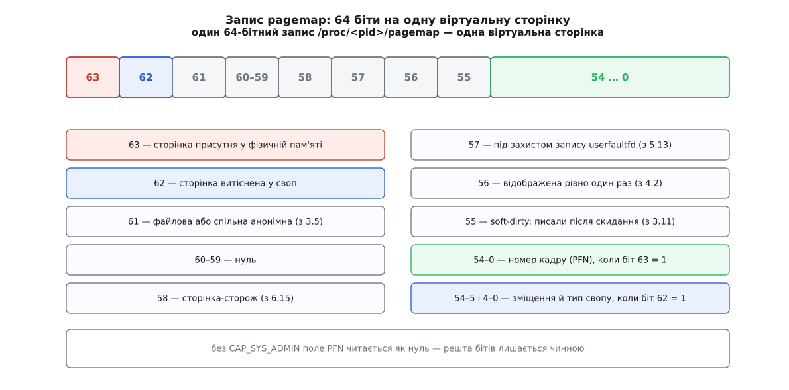

# ⚙️ Хто дивиться на цей кадр: зворотне відображення руками

Ядро не виставляє свого оберненого напрямку назовні: файлу «дай усіх, хто вказує на кадр номер N» у системі немає й ніколи не було. Зате воно щедро виставляє **прямий** напрямок — `/proc/<pid>/pagemap` для кожного процесу перекладає віртуальну сторінку у фізичний кадр. Отже, обернене відображення можна скласти самотужки: обійти всі процеси, прочитати їхні прямі відповідності й перевернути. Нижче — програма на C, яка так і робить: за номером кадру видає повний перелік пар «процес, віртуальна адреса», а тоді звіряє довжину переліку з тим, що про цей кадр каже саме ядро.

У вправи два виходи. Перший — діагностичний: це єдиний спосіб із простору користувача дізнатися, чому конкретний кадр не звільняється, чи справді сторінка бібліотеки спільна між контейнерами і чи справді сталося копіювання при записі там, де ви на нього розраховували. Другий — вимірювальний: наприкінці буде видно в цифрах, скільки коштує обхід «від усіх процесів» і чому ядро ходить з іншого кінця.

## Три файли, з яких усе складається

Уся потрібна інформація лежить у [файловій системі процесів](topic:sys-unix/proc-reading-process-and-kernel-state) — тому шарі, де ядро віддає свій внутрішній стан як звичайні файли, а програма читає їх звичайним `read`.

`/proc/<pid>/maps` — текст: по рядку на кожну ділянку адресного простору, з межами, правами, зміщенням у файлі та іменем. Звідси беремо, **де саме** в процесі є що читати: пробувати всі 2⁴⁷ байтів адресного простору безглуздо, а поза ділянками сторінок не буває.

`/proc/<pid>/pagemap` — двійковий масив по 8 байтів на віртуальну сторінку, індексований номером сторінки. Це і є прямий переклад, той самий, що його робить апаратура, тільки вже розібраний ядром у зручне число.

`/proc/kpagecount` і `/proc/kpageflags` — теж двійкові масиви по 8 байтів, але індексовані вже **номером кадру**: у першому лежить лічильник відображень цього кадру, у другому — набір прапорців про його стан. Це погляд з фізичного боку, і саме ним ми перевірятимемо себе.

Індексація в усіх трьох двійкових файлах однакова за задумом: номер запису множимо на 8 і читаємо звідти вісім байтів.

```
зміщення в /proc/<pid>/pagemap  =  (віртуальна адреса / 4096) · 8 байтів
зміщення в /proc/kpagecount     =  PFN · 8 байтів
зміщення в /proc/kpageflags     =  PFN · 8 байтів
```

Читання, що починається не на межі восьми байтів або має довжину не кратну восьми, ядро відкидає з `EINVAL` — це не примха, а наслідок того, що файл віддається порціями по цілому запису.

## Що всередині одного запису pagemap

Вісім байтів на сторінку — це не просто номер кадру. Номер займає нижні 55 бітів, а верхні дев'ять несуть відповіді на питання, без яких номер не має сенсу: чи є взагалі кадр, чи сторінка витіснена, чи вона файлова.



*Найважливіший біт — старший. Доки він нульовий, нижні 55 бітів не є номером кадру: у витісненої сторінки там лежать тип і зміщення свопу, у недоторканої — просто нулі.*

Порядок читання звідси випливає жорсткий: спершу біт 63, і лише потім маска. Програма, яка бере `entry & 0x7fffffffffffff` без перевірки присутности, на кожній недоторканій сторінці знайде «кадр номер 0» — там, де кадру немає взагалі.

## Дозволи: чому все може мовчки обнулитися

Номер фізичного кадру — небезпечне знання. Знаючи, за якою фізичною адресою лежить ваша сторінка, зловмисник може прицільно бити по сусідніх рядках мікросхеми пам'яті й перекидати в них біти — це [Rowhammer](topic:hw-components/rowhammer), фізична вада щільної DRAM, де багаторазове звертання до одного рядка збурює заряд у сусідньому. Саме через нього доступ до номерів кадрів і закрили.

Правило таке: з ядра 4.0 номери кадрів віддаються лише тому, хто має [привілей `CAP_SYS_ADMIN`](topic:sys-unix/capabilities) — окремий шматочок владних повноважень root, які в Linux порізані на десятки незалежних дозволів. У ядрах 4.0 і 4.1 спроба відкрити `pagemap` без цього привілею просто провалювалася з `EPERM`; це поламало наявні програми, тож із 4.2 файл знову відкривається всім, але поле номера кадру **обнулюється**. Решта бітів при цьому лишається чинною й правдивою. *(Доказовий статус: версії й поведінка — за чинною документацією ядра `Documentation/admin-guide/mm/pagemap.rst`, де там-таки названо й причину: інформація про номери кадрів допомагає експлуатувати Rowhammer.)*

Наслідок для налагодження вартий того, щоб запам'ятати його наперед: **без привілею програма не падає, вона бреше**. Усі сторінки світу мають номер кадру 0; лічильник, якого ви питаєте про кадр 0, чесно відповідає про справжній нульовий кадр — і ця відповідь не має до вашої сторінки жодного стосунку. Виглядає все разом як загадковий баг у вашому коді. Тому перша ж перевірка в програмі — «якщо кадр вийшов нульовим, це майже напевно бракує прав».

Два файли з фізичного боку взагалі не мають напівзаходів: `/proc/kpagecount` і `/proc/kpageflags` створені з правами `S_IRUSR` — читає їх лише власник, тобто root. А `/proc/<pid>/pagemap` чужого процесу вимагає тих самих повноважень, що й [приєднання налагоджувача](topic:sys-unix/ptrace-model): ядро питає, чи маєте ви право читати пам'ять цього процесу, і відповідає за тими самими правилами, що й для `ptrace`.

## Найкоротший шлях: одна адреса

Перш ніж будувати обхід, варто мати десять рядків, що переводять одну адресу в кадр і питають про нього лічильник. Це і перевірка прав, і зручний інструмент сам по собі.

:::tabs

```c
/* pfn.c — у який фізичний кадр дивиться ця віртуальна адреса.
 *   cc -O2 -Wall -o pfn pfn.c
 *   sudo ./pfn 1234 0x7f2a4c014000
 */
#define _GNU_SOURCE
#define _FILE_OFFSET_BITS 64
#include <stdio.h>
#include <stdlib.h>
#include <stdint.h>
#include <inttypes.h>
#include <fcntl.h>
#include <unistd.h>

static uint64_t read_u64(const char *path, off_t off)
{
    uint64_t v = 0;
    int fd = open(path, O_RDONLY);
    if (fd < 0) { perror(path); exit(1); }
    if (pread(fd, &v, 8, off) != 8) { perror("pread"); exit(1); }
    close(fd);
    return v;
}

int main(int argc, char **argv)
{
    if (argc != 3) { fprintf(stderr, "вжиток: %s <pid> <адреса>\n", argv[0]); return 2; }

    char path[64];
    uint64_t va = strtoull(argv[2], NULL, 0);
    snprintf(path, sizeof path, "/proc/%s/pagemap", argv[1]);

    uint64_t e = read_u64(path, (off_t)(va / 4096 * 8));
    if (!(e & (1ULL << 63))) { puts("кадру немає: сторінка не в пам'яті"); return 1; }

    uint64_t pfn = e & ((1ULL << 55) - 1);
    if (!pfn) { puts("кадр 0 — найпевніше бракує CAP_SYS_ADMIN"); return 1; }

    printf("кадр %#" PRIx64 ", відображень %" PRIu64 "\n",
           pfn, read_u64("/proc/kpagecount", (off_t)(pfn * 8)));
    return 0;
}
```

```cpp
/* pfn.cpp — у який фізичний кадр дивиться ця віртуальна адреса.
 *   g++ -O2 -Wall -std=c++20 -o pfn pfn.cpp
 *   sudo ./pfn 1234 0x7f2a4c014000
 */
#include <iostream>
#include <fstream>
#include <cstdint>
#include <cstdio>
#include <cstdlib>
#include <string>
#include <fcntl.h>
#include <unistd.h>

static uint64_t read_u64(const std::string &path, off_t off)
{
    uint64_t v = 0;
    int fd = ::open(path.c_str(), O_RDONLY);
    if (fd < 0) { perror(path.c_str()); exit(1); }
    if (::pread(fd, &v, sizeof(v), off) != sizeof(v)) { perror("pread"); exit(1); }
    ::close(fd);
    return v;
}

int main(int argc, char **argv)
{
    if (argc != 3) {
        std::cerr << "вжиток: " << argv[0] << " <pid> <адреса>\n";
        return 2;
    }

    uint64_t va = std::stoull(argv[2], nullptr, 0);
    std::string path = std::string("/proc/") + argv[1] + "/pagemap";

    uint64_t e = read_u64(path, static_cast<off_t>(va / 4096 * 8));
    if (!(e & (1ULL << 63))) {
        std::cout << "кадру немає: сторінка не в пам'яті\n";
        return 1;
    }

    uint64_t pfn = e & ((1ULL << 55) - 1);
    if (!pfn) {
        std::cout << "кадр 0 — найпевніше бракує CAP_SYS_ADMIN\n";
        return 1;
    }

    uint64_t count = read_u64("/proc/kpagecount", static_cast<off_t>(pfn * 8));
    std::cout << "кадр 0x" << std::hex << pfn << std::dec
              << ", відображень " << count << "\n";
    return 0;
}
```

```python
#!/usr/bin/env python3
"""pfn.py — у який фізичний кадр дивиться ця віртуальна адреса.
   sudo ./pfn.py 1234 0x7f2a4c014000
"""
import os, struct, sys

PAGE = os.sysconf("SC_PAGE_SIZE")

def read_u64(path, off):
    with open(path, "rb") as f:
        f.seek(off)
        return struct.unpack("=Q", f.read(8))[0]   # порядок байтів — рідний

pid, va = sys.argv[1], int(sys.argv[2], 0)

entry = read_u64(f"/proc/{pid}/pagemap", va // PAGE * 8)
if not entry & (1 << 63):
    sys.exit("кадру немає: сторінка не в пам'яті")

pfn = entry & ((1 << 55) - 1)
if not pfn:
    sys.exit("кадр 0 — найпевніше бракує CAP_SYS_ADMIN")

print(f"кадр {pfn:#x}, відображень {read_u64('/proc/kpagecount', pfn * 8)}")
```

:::

## Обхід: від кадру до всіх, хто його бачить

Тепер сама вправа. Задача обернена, тож і хід обернений: перебрати всі процеси, у кожному — всі ділянки, у кожній ділянці — всі сторінки, і зібрати ті, чий кадр збігається із шуканим.

Три рішення визначають, чи буде програма стерпної швидкости.

**Читати блоками, а не по запису.** Наївний варіант робить один `pread` на кожну сторінку — це системний виклик на кожні 4 КіБ, тобто десятки мільйонів викликів на один обхід. Читання по тисячі записів за раз віддає ту саму інформацію за одну тисячну кількости викликів.

**Не будувати покажчика, коли шукаємо один кадр.** Повний покажчик «кадр → список» потрібен, якщо питань багато; для одного питання досить порівняння в циклі, і воно нічого не коштує ані за пам'яттю, ані за часом.

**Не падати від зникнення процесу.** Поки ми обходимо `/proc`, процеси народжуються й помирають. Кожне невдале відкриття — не помилка, а нормальний хід подій.

:::tabs

```c
/* whomaps.c — за номером фізичного кадру знайти всі його відображення в системі.
 *
 *   cc -O2 -Wall -Wextra -o whomaps whomaps.c
 *   sudo ./whomaps 0x11e347              — шукати кадр за номером
 *   sudo ./whomaps 1234@0x7f2a4c014000   — спершу перекласти адресу процесу в кадр
 */
#define _GNU_SOURCE
#define _FILE_OFFSET_BITS 64      /* зміщення в pagemap легко перевалює за 2 ГіБ */
#include <stdio.h>
#include <stdlib.h>
#include <string.h>
#include <stdint.h>
#include <inttypes.h>
#include <ctype.h>
#include <unistd.h>
#include <fcntl.h>
#include <dirent.h>

#define PAGE_SZ 4096ULL
#define ENTRY   8ULL              /* один запис pagemap — рівно 8 байтів */
#define CHUNK   1024              /* скільки записів беремо за одне читання */

#define PM_PRESENT   (1ULL << 63)
#define PM_EXCLUSIVE (1ULL << 56)
#define PM_PFN_MASK  ((1ULL << 55) - 1)

#define KPF_ANON (1ULL << 12)
#define KPF_KSM  (1ULL << 21)
#define KPF_THP  (1ULL << 22)

static uint64_t      target;      /* шуканий номер кадру */
static unsigned long found;       /* скільки відображень знайшли */

/* Прочитати 8 байтів із файлу, індексованого номером кадру. */
static int kpage_u64(const char *path, uint64_t pfn, uint64_t *out)
{
    int fd = open(path, O_RDONLY);
    if (fd < 0) return -1;
    ssize_t got = pread(fd, out, ENTRY, (off_t)(pfn * ENTRY));
    close(fd);
    return got == (ssize_t)ENTRY ? 0 : -1;
}

/* Пройти одну ділянку [start, end) блоками по CHUNK записів. */
static void scan_range(int pmfd, int pid, const char *comm,
                       uint64_t start, uint64_t end, const char *label)
{
    static uint64_t buf[CHUNK];

    for (uint64_t va = start; va < end; ) {
        uint64_t left = (end - va) / PAGE_SZ;
        size_t   n    = left > CHUNK ? CHUNK : (size_t)left;

        ssize_t got = pread(pmfd, buf, n * ENTRY, (off_t)(va / PAGE_SZ * ENTRY));
        if (got <= 0) return;                 /* процес зник або ділянка недосяжна */

        size_t k = (size_t)got / ENTRY;
        for (size_t i = 0; i < k; i++) {
            uint64_t e = buf[i];
            if (!(e & PM_PRESENT))            continue;   /* дірка або своп */
            if ((e & PM_PFN_MASK) != target)  continue;

            printf("  pid %-7d %-16s %#018" PRIx64 "  %s%s\n",
                   pid, comm, va + (uint64_t)i * PAGE_SZ, label,
                   (e & PM_EXCLUSIVE) ? "   [єдине відображення]" : "");
            found++;
        }
        va += (uint64_t)k * PAGE_SZ;
    }
}

/* Прочитати maps одного процесу й пройти кожну його ділянку. */
static void scan_pid(int pid)
{
    char path[64], line[512], comm[32] = "?";

    snprintf(path, sizeof path, "/proc/%d/maps", pid);
    FILE *maps = fopen(path, "r");
    if (!maps) return;                        /* процес щойно помер — це нормально */

    snprintf(path, sizeof path, "/proc/%d/pagemap", pid);
    int pmfd = open(path, O_RDONLY);
    if (pmfd < 0) { fclose(maps); return; }

    snprintf(path, sizeof path, "/proc/%d/comm", pid);
    FILE *c = fopen(path, "r");
    if (c) {
        if (fgets(comm, sizeof comm, c)) comm[strcspn(comm, "\n")] = '\0';
        fclose(c);
    }

    while (fgets(line, sizeof line, maps)) {
        char    *p     = line;
        uint64_t start = strtoull(p, &p, 16);
        if (*p != '-') continue;
        uint64_t end   = strtoull(p + 1, &p, 16);

        /* Пропускаємо чотири поля: права, зміщення, пристрій, інод. */
        for (int f = 0; f < 4; f++) {
            while (*p == ' ') p++;
            while (*p && *p != ' ' && *p != '\n') p++;
        }
        while (*p == ' ') p++;
        p[strcspn(p, "\n")] = '\0';

        const char *label = *p ? p : "[анонімна]";
        if (!strcmp(label, "[vsyscall]")) continue;   /* не звичайна пам'ять */

        scan_range(pmfd, pid, comm, start, end, label);
    }

    close(pmfd);
    fclose(maps);
}

int main(int argc, char **argv)
{
    if (argc != 2) {
        fprintf(stderr, "вжиток: %s <кадр> | <pid>@<адреса>\n", argv[0]);
        return 2;
    }

    char *at = strchr(argv[1], '@');
    if (at) {                                  /* адреса процесу → номер кадру */
        *at = '\0';
        char path[64];
        uint64_t va = strtoull(at + 1, NULL, 0), e = 0;

        snprintf(path, sizeof path, "/proc/%s/pagemap", argv[1]);
        int fd = open(path, O_RDONLY);
        if (fd < 0 || pread(fd, &e, ENTRY, (off_t)(va / PAGE_SZ * ENTRY)) != (ssize_t)ENTRY) {
            perror("pagemap");
            return 1;
        }
        close(fd);
        if (!(e & PM_PRESENT)) {
            fprintf(stderr, "за цією адресою зараз немає кадру (біт 63 = 0)\n");
            return 1;
        }
        target = e & PM_PFN_MASK;
    } else {
        target = strtoull(argv[1], NULL, 0);
    }

    if (target == 0) {
        fprintf(stderr, "кадр 0: найпевніше бракує CAP_SYS_ADMIN — "
                        "ядро обнулює поле номера кадру\n");
        return 1;
    }

    uint64_t count = 0, flags = 0;
    int have_count = kpage_u64("/proc/kpagecount", target, &count) == 0;
    int have_flags = kpage_u64("/proc/kpageflags", target, &flags) == 0;

    printf("кадр %#" PRIx64 "  (фізична адреса %#" PRIx64 ")\n",
           target, target * PAGE_SZ);
    if (have_flags)
        printf("прапорці %#" PRIx64 "%s%s%s\n", flags,
               (flags & KPF_ANON) ? "  ANON" : "",
               (flags & KPF_KSM)  ? "  KSM"  : "",
               (flags & KPF_THP)  ? "  THP"  : "");
    if (have_count)
        printf("ядро налічує відображень: %" PRIu64 "\n", count);
    puts("знайдено:");

    DIR *proc = opendir("/proc");
    if (!proc) { perror("/proc"); return 1; }

    struct dirent *d;
    while ((d = readdir(proc)))
        if (isdigit((unsigned char)d->d_name[0]))
            scan_pid((int)strtol(d->d_name, NULL, 10));
    closedir(proc);

    printf("разом %lu", found);
    if (have_count) printf(", ядро каже %" PRIu64, count);
    putchar('\n');
    return 0;
}
```

```cpp
/* whomaps.cpp — за номером фізичного кадру знайти всі його відображення в системі.
 *   g++ -O2 -Wall -Wextra -std=c++20 -o whomaps whomaps.cpp
 *   sudo ./whomaps 0x11e347
 */
#include <iostream>
#include <fstream>
#include <sstream>
#include <string>
#include <vector>
#include <filesystem>
#include <cstdint>
#include <cinttypes>
#include <cstdio>
#include <cctype>
#include <cstring>
#include <fcntl.h>
#include <unistd.h>

namespace fs = std::filesystem;

constexpr uint64_t PAGE_SZ = 4096ULL;
constexpr uint64_t ENTRY   = 8ULL;
constexpr size_t   CHUNK   = 1024;

constexpr uint64_t PM_PRESENT   = 1ULL << 63;
constexpr uint64_t PM_EXCLUSIVE = 1ULL << 56;
constexpr uint64_t PM_PFN_MASK  = (1ULL << 55) - 1;

constexpr uint64_t KPF_ANON = 1ULL << 12;
constexpr uint64_t KPF_KSM  = 1ULL << 21;
constexpr uint64_t KPF_THP  = 1ULL << 22;

static uint64_t target_pfn = 0;
static unsigned long found_count = 0;

static bool kpage_u64(const std::string &path, uint64_t pfn, uint64_t &out)
{
    int fd = ::open(path.c_str(), O_RDONLY);
    if (fd < 0) return false;
    ssize_t got = ::pread(fd, &out, ENTRY, static_cast<off_t>(pfn * ENTRY));
    ::close(fd);
    return got == static_cast<ssize_t>(ENTRY);
}

static void scan_range(int pmfd, int pid, const std::string &comm,
                       uint64_t start, uint64_t end, const std::string &label)
{
    std::vector<uint64_t> buf(CHUNK);

    for (uint64_t va = start; va < end; ) {
        uint64_t left = (end - va) / PAGE_SZ;
        size_t n = left > CHUNK ? CHUNK : static_cast<size_t>(left);

        ssize_t got = ::pread(pmfd, buf.data(), n * ENTRY, static_cast<off_t>(va / PAGE_SZ * ENTRY));
        if (got <= 0) return;

        size_t k = static_cast<size_t>(got) / ENTRY;
        for (size_t i = 0; i < k; ++i) {
            uint64_t e = buf[i];
            if (!(e & PM_PRESENT)) continue;
            if ((e & PM_PFN_MASK) != target_pfn) continue;

            std::cout << "  pid " << pid << "  " << comm << "  0x"
                      << std::hex << (va + i * PAGE_SZ) << std::dec
                      << "  " << label
                      << ((e & PM_EXCLUSIVE) ? "   [єдине відображення]" : "") << "\n";
            found_count++;
        }
        va += k * PAGE_SZ;
    }
}

static void scan_pid(int pid)
{
    std::string pid_str = std::to_string(pid);
    std::ifstream maps("/proc/" + pid_str + "/maps");
    if (!maps.is_open()) return;

    int pmfd = ::open(("/proc/" + pid_str + "/pagemap").c_str(), O_RDONLY);
    if (pmfd < 0) return;

    std::string comm = "?";
    std::ifstream comm_file("/proc/" + pid_str + "/comm");
    if (comm_file.is_open()) {
        std::getline(comm_file, comm);
    }

    std::string line;
    while (std::getline(maps, line)) {
        if (line.empty()) continue;
        std::stringstream ss(line);
        std::string range, perms, offset, dev, inode;
        if (!(ss >> range >> perms >> offset >> dev >> inode)) continue;

        auto dash = range.find('-');
        if (dash == std::string::npos) continue;

        uint64_t start = std::stoull(range.substr(0, dash), nullptr, 16);
        uint64_t end   = std::stoull(range.substr(dash + 1), nullptr, 16);

        std::string label;
        std::getline(ss >> std::ws, label);
        if (label.empty()) label = "[анонімна]";
        if (label == "[vsyscall]") continue;

        scan_range(pmfd, pid, comm, start, end, label);
    }
    ::close(pmfd);
}

int main(int argc, char **argv)
{
    if (argc != 2) {
        std::cerr << "вжиток: " << argv[0] << " <кадр> | <pid>@<адреса>\n";
        return 2;
    }

    std::string arg = argv[1];
    auto at = arg.find('@');
    if (at != std::string::npos) {
        std::string pid_str = arg.substr(0, at);
        uint64_t va = std::stoull(arg.substr(at + 1), nullptr, 0);
        uint64_t e = 0;

        int fd = ::open(("/proc/" + pid_str + "/pagemap").c_str(), O_RDONLY);
        if (fd < 0 || ::pread(fd, &e, ENTRY, static_cast<off_t>(va / PAGE_SZ * ENTRY)) != static_cast<ssize_t>(ENTRY)) {
            perror("pagemap");
            return 1;
        }
        ::close(fd);
        if (!(e & PM_PRESENT)) {
            std::cerr << "за цією адресою зараз немає кадру (біт 63 = 0)\n";
            return 1;
        }
        target_pfn = e & PM_PFN_MASK;
    } else {
        target_pfn = std::stoull(arg, nullptr, 0);
    }

    if (target_pfn == 0) {
        std::cerr << "кадр 0: найпевніше бракує CAP_SYS_ADMIN\n";
        return 1;
    }

    uint64_t count = 0, flags = 0;
    bool have_count = kpage_u64("/proc/kpagecount", target_pfn, count);
    bool have_flags = kpage_u64("/proc/kpageflags", target_pfn, flags);

    std::cout << "кадр 0x" << std::hex << target_pfn
              << "  (фізична адреса 0x" << (target_pfn * PAGE_SZ) << ")\n" << std::dec;
    if (have_flags) {
        std::cout << "прапорці 0x" << std::hex << flags << std::dec
                  << ((flags & KPF_ANON) ? "  ANON" : "")
                  << ((flags & KPF_KSM)  ? "  KSM"  : "")
                  << ((flags & KPF_THP)  ? "  THP"  : "") << "\n";
    }
    if (have_count) {
        std::cout << "ядро налічує відображень: " << count << "\n";
    }
    std::cout << "знайдено:\n";

    if (fs::exists("/proc")) {
        for (const auto &entry : fs::directory_iterator("/proc")) {
            std::string name = entry.path().filename().string();
            if (!name.empty() && std::isdigit(static_cast<unsigned char>(name[0]))) {
                scan_pid(std::stoi(name));
            }
        }
    }

    std::cout << "разом " << found_count;
    if (have_count) std::cout << ", ядро каже " << count;
    std::cout << "\n";
    return 0;
}
```

:::

## Живий приклад перший: сторінка спільної бібліотеки

Візьмімо будь-який процес, знайдімо в ньому виконуваний шматок `libc` і спитаймо про якусь його сторінку.

```
$ pid=$(pgrep -n bash)
$ awk '/r-xp .*\/libc\.so/ { print $1; exit }' /proc/$pid/maps
7f4a1b422000-7f4a1b5aa000

$ sudo ./whomaps $pid@0x7f4a1b428000
кадр 0x11e347  (фізична адреса 0x11e347000)
прапорці 0x40000086c
ядро налічує відображень: 37
знайдено:
  pid 1       systemd          0x00007f0b3c028000  /usr/lib/x86_64-linux-gnu/libc.so.6
  pid 812     dbus-daemon      0x00007fd41a628000  /usr/lib/x86_64-linux-gnu/libc.so.6
  pid 1041    sshd             0x00007f88c0e28000  /usr/lib/x86_64-linux-gnu/libc.so.6
  …
разом 37, ядро каже 37
```

Тридцять сім процесів дивляться в **один** кадр — і кожен за своєю адресою, бо кожен завантажив бібліотеку туди, куди йому випало. Оце й є та сама спільність, заради якої існують спільні бібліотеки: сто примірників `bash` не займають ста копій коду `libc`.

Прапорці розкладаються в біти 2, 3, 5, 6, 11 і 34: до сторінки недавно зверталися, її вміст чинний, вона в активному списку витіснення, вона комусь відображена й має підкладку на диску. Ні `ANON`, ні `KSM` тут немає — звичайна сторінка кешу файлу, як і має бути.

Два числа зійшлися, і це не самоочевидно: ліворуч ми лічили пари «процес, адреса», зібрані обходом усього `/proc`, а праворуч ядро віддало власний лічильник, який воно веде зовсім іншим способом. Збіг означає, що наш обхід нічого не проґавив і нічого не нарахував двічі.

## Живий приклад другий: анонімна сторінка до й після запису

Другий дослід показує те, чого на бібліотеці не побачити, — як спільність **зникає**. [Копіювання при записі](topic:sf-os/copy-on-write) робить після розгалуження всі копії сторінки одним кадром, доки хтось у нього не напише; лічильник відображень цього кадру мусить спершу підскочити, а потім упасти назад до одиниці.

:::tabs

```c
/* forklab.c — той самий кадр у кількох процесах і що з ним робить запис.
 *   cc -O2 -Wall -o forklab forklab.c && sudo ./forklab
 */
#define _GNU_SOURCE
#define _FILE_OFFSET_BITS 64
#include <stdio.h>
#include <stdint.h>
#include <inttypes.h>
#include <unistd.h>
#include <fcntl.h>
#include <sys/mman.h>
#include <sys/wait.h>

#define PAGE 4096
#define KIDS 4

static uint64_t read_u64(const char *path, off_t off)
{
    uint64_t v = 0;
    int fd = open(path, O_RDONLY);
    if (fd < 0) return 0;
    if (pread(fd, &v, 8, off) != 8) v = 0;
    close(fd);
    return v;
}

static uint64_t pfn_of(const void *addr)
{
    uint64_t e = read_u64("/proc/self/pagemap", (off_t)((uintptr_t)addr / PAGE * 8));
    return (e & (1ULL << 63)) ? (e & ((1ULL << 55) - 1)) : 0;
}

static uint64_t mapcount_of(uint64_t pfn)
{
    return read_u64("/proc/kpagecount", (off_t)(pfn * 8));
}

int main(void)
{
    int go[2], hold[2];
    if (pipe(go) || pipe(hold)) return 1;

    char *p = mmap(NULL, PAGE, PROT_READ | PROT_WRITE,
                   MAP_PRIVATE | MAP_ANONYMOUS, -1, 0);
    if (p == MAP_FAILED) return 1;
    p[0] = 'A';                          /* збій запису — кадр щойно з'явився */

    uint64_t pfn = pfn_of(p);
    if (!pfn) { fprintf(stderr, "кадр 0: потрібен CAP_SYS_ADMIN\n"); return 1; }
    printf("кадр %#" PRIx64 ",  до fork      відображень: %" PRIu64 "\n",
           pfn, mapcount_of(pfn));
    fflush(stdout);                      /* щоб рядок не подвоївся в нащадках */

    for (int i = 0; i < KIDS; i++)
        if (fork() == 0) {
            char c;
            close(go[1]); close(hold[1]);
            read(go[0], &c, 1);          /* чекаємо дозволу писати */
            p[0] = (char)('a' + i);      /* копіювання при записі: власний кадр */
            read(hold[0], &c, 1);        /* тримаємося живими, доки батько міряє */
            _exit(0);
        }

    sleep(1);
    printf("             після fork    відображень: %" PRIu64 "\n", mapcount_of(pfn));

    write(go[1], "xxxx", KIDS);          /* хай усі напишуть у свою копію */
    sleep(1);
    printf("             після запису  відображень: %" PRIu64 "\n", mapcount_of(pfn));

    close(hold[1]);                      /* відпускаємо нащадків */
    while (wait(NULL) > 0) ;
    return 0;
}
```

```cpp
/* forklab.cpp — той самий кадр у кількох процесах і що з ним робить запис (RAII).
 *   g++ -O2 -Wall -std=c++20 -o forklab forklab.cpp && sudo ./forklab
 */
#include <iostream>
#include <cstdint>
#include <cinttypes>
#include <unistd.h>
#include <fcntl.h>
#include <sys/mman.h>
#include <sys/wait.h>

constexpr size_t PAGE = 4096;
constexpr int KIDS = 4;

struct FileDescriptor {
    int fd = -1;
    explicit FileDescriptor(int f = -1) : fd(f) {}
    ~FileDescriptor() { if (fd >= 0) ::close(fd); }
    FileDescriptor(const FileDescriptor &) = delete;
    FileDescriptor &operator=(const FileDescriptor &) = delete;
    FileDescriptor(FileDescriptor &&o) noexcept : fd(o.fd) { o.fd = -1; }
    FileDescriptor &operator=(FileDescriptor &&o) noexcept {
        if (this != &o) { if (fd >= 0) ::close(fd); fd = o.fd; o.fd = -1; }
        return *this;
    }
};

static uint64_t read_u64(const char *path, off_t off)
{
    uint64_t v = 0;
    FileDescriptor fd(::open(path, O_RDONLY));
    if (fd.fd < 0) return 0;
    if (::pread(fd.fd, &v, sizeof(v), off) != sizeof(v)) return 0;
    return v;
}

static uint64_t pfn_of(const void *addr)
{
    uint64_t e = read_u64("/proc/self/pagemap", static_cast<off_t>(reinterpret_cast<uintptr_t>(addr) / PAGE * 8));
    return (e & (1ULL << 63)) ? (e & ((1ULL << 55) - 1)) : 0;
}

static uint64_t mapcount_of(uint64_t pfn)
{
    return read_u64("/proc/kpagecount", static_cast<off_t>(pfn * 8));
}

int main()
{
    int go_fds[2], hold_fds[2];
    if (::pipe(go_fds) || ::pipe(hold_fds)) return 1;

    char *p = static_cast<char *>(::mmap(nullptr, PAGE, PROT_READ | PROT_WRITE,
                                        MAP_PRIVATE | MAP_ANONYMOUS, -1, 0));
    if (p == MAP_FAILED) return 1;
    p[0] = 'A';

    uint64_t pfn = pfn_of(p);
    if (!pfn) {
        std::cerr << "кадр 0: потрібен CAP_SYS_ADMIN\n";
        ::munmap(p, PAGE);
        return 1;
    }

    std::cout << "кадр 0x" << std::hex << pfn << std::dec
              << ",  до fork      відображень: " << mapcount_of(pfn) << "\n" << std::flush;

    for (int i = 0; i < KIDS; ++i) {
        if (::fork() == 0) {
            char c = 0;
            ::close(go_fds[1]);
            ::close(hold_fds[1]);
            (void)::read(go_fds[0], &c, 1);
            p[0] = static_cast<char>('a' + i);
            (void)::read(hold_fds[0], &c, 1);
            ::_exit(0);
        }
    }

    ::sleep(1);
    std::cout << "             після fork    відображень: " << mapcount_of(pfn) << "\n";

    (void)::write(go_fds[1], "xxxx", KIDS);
    ::sleep(1);
    std::cout << "             після запису  відображень: " << mapcount_of(pfn) << "\n";

    ::close(hold_fds[1]);
    while (::wait(nullptr) > 0) {}
    ::munmap(p, PAGE);
    return 0;
}
```

:::

```
$ sudo ./forklab
кадр 0x1b4c92,  до fork      відображень: 1
             після fork    відображень: 5
             після запису  відображень: 1
```

П'ять — це батько й четверо нащадків: `fork` не скопіював жодного байта даних, він лише додав по запису в таблиці кожного нащадка, і всі п'ять записів указують у той самий кадр. Після того, як кожен нащадок написав у свій байт, ядро видало кожному власну копію, і початковий кадр лишився з одним-єдиним глядачем — батьком.

Якщо в цю мить, поки нащадки ще живі, запустити з іншого термінала `sudo ./whomaps 0x1b4c92`, буде видно ту саму одиницю поіменно: батьківський процес і його адреса. А до запису той самий запит показав би п'ять рядків із п'ятьма різними pid і — дуже ймовірно — **однаковою** віртуальною адресою, бо адресні простори нащадків успадковані від батька байт у байт.

> 🔧 **Навіщо це.** Такий інструмент розв'язує клас питань, на які немає іншої відповіді з простору користувача. Чому сторінка не звільняється під тиском пам'яті — бо на неї справді хтось дивиться, чи бо її хтось закріпив? Чи справді два контейнери ділять один примірник бібліотеки, чи кожен приволік свою копію? Чому лічильник спільної пам'яті раптом виріс без жодного нового відображення — і чи не через те, що механізм злиття однакових сторінок звів докупи те, що ви вважали різним? Усі ці питання формулюються як «хто дивиться на цей кадр», і кожне з них дістає точну відповідь із конкретними pid і адресами, а не з чергової агрегованої цифри.

## Пастки

**Нульовий кадр замість помилки.** Найкоштовніша пастка вже названа: без `CAP_SYS_ADMIN` програма працює, читає, друкує — і все, що вона друкує, неправда. Перевірка «кадр вийшов нулем» мусить стояти першою.

**Обхід не є знімком.** Ядро, коли робить свій зворотний обхід, тримає сторінку під замком, а об'єкт — під своїм; ми не тримаємо нічого. Між тим, як ми прочитали `maps` процесу, і тим, як дійшли до його останньої ділянки, [механізм витіснення](topic:sys-unix/swap-and-reclaim) міг забрати кадр, перенести його чи повернути зі свопу вже в інший. Тому наш перелік — не миттєвий стан, а розмазаний по часу відбиток, і розбіжність на одиницю з `kpagecount` не завжди означає помилку в коді. Хочете чесного знімка — заморозьте процеси перед обходом (`SIGSTOP` усім або морозильник контрольної групи) і розморозьте після.

**Один адресний простір на два процеси.** `/proc` показує лише лідерів груп потоків, тож потоки одного процесу ми природно рахуємо один раз — і правильно, бо вони ділять одну таблицю сторінок, а лічильник ядра рахує саме записи таблиць. Але буває рідший випадок: `vfork` або `clone` з `CLONE_VM` без `CLONE_THREAD` дає два **різні** pid зі спільним адресним простором. Тоді ми надрукуємо два рядки там, де запис у таблиці один, і сума не зійдеться. Розрізнити такі пари вміє системний виклик `kcmp` з ознакою `KCMP_VM`: він відповідає, чи ділять два процеси один адресний простір. Народився він у механізмі [збереження й відновлення стану процесів](topic:sys-unix/checkpoint-restore), обгортки в libc не має й кличеться напряму через `syscall`.

**Сторінки-двійники.** Якщо в системі працює [злиття однакових сторінок](topic:sys-unix/ksm-page-merging), у переліку можуть з'явитися процеси, які ніколи не мали між собою нічого спільного: ядро знайшло в них байт-у-байт однакові сторінки й звело їх в один кадр. Це не помилка обходу, а справжня відповідь — просто спільність тут утворена не спорідненістю, а збігом умісту. Розпізнається за прапорцем `KSM` у `kpageflags` (біт 21).

**Великі сторінки.** [Велика сторінка](topic:sys-unix/huge-pages-tlb-reach) розміром 2 МіБ віддається в `pagemap` як 512 звичайних записів із послідовними номерами кадрів, тож пошук за номером голови знаходить рівно одне влучення на кожне відображення — тут усе гаразд. Ненадійним стає інше — сам лічильник: у конфігураціях, де ядро не веде точного обліку на кожну четвертькілобайтну частину великого блоку, `/proc/kpagecount` повертає **середнє** число відображень по блоку (з підлогою в одиницю, якщо відображена бодай одна частина). Тому перед тим, як дивуватися розбіжності, варто глянути на прапорці `THP` і `COMPOUND_HEAD`. *(Доказовий статус: поведінка описана в чинній документації `pagemap.rst`; у коді `fs/proc/page.c` вибір між точним і усередненим лічильником робиться за конфігурацією.)*

**Кадри поза обліком.** Ділянки, за якими стоїть не звичайна пам'ять, а регістри пристрою чи буфер відеокарти, теж мають чинні записи в таблицях і показують номери кадрів — але ці кадри не належать розподільникові сторінок, і `kpagecount` для них поверне нуль. Так само нуль поверне запит про номер поза межами фізичної пам'яті. Нуль у лічильнику при непорожньому переліку — ознака саме цього, а не помилки.

**Своп замість кадру.** Витіснена сторінка має біт 62 і **не має** біта 63. Її нижні біти — тип і зміщення у свопі, і трактувати їх як номер кадру не можна ні за яких обставин. Наш цикл відсіює такі записи першою ж перевіркою.

**32-бітна збірка.** Зміщення в `pagemap` для адреси десь у верхній частині простору легко перевалює за два гігабайти. Без `#define _FILE_OFFSET_BITS 64` на 32-бітній системі `pread` мовчки отримає обрізане зміщення й прочитає зовсім не той запис — помилки не буде, буде неправильна відповідь.

**Ядерний бік не видно взагалі.** Найважливіше обмеження всієї вправи: ми бачимо лише відображення **простору користувача**. Пряме відображення всієї фізичної пам'яті, яке ядро тримає для себе, ділянки `vmalloc`, буфери прямого доступу до пам'яті, закріплені пристроями сторінки — усе це ніде в `/proc/*/maps` не з'являється. Тому наш перелік чесно відповідає на питання «хто з процесів дивиться на кадр», а не «чому кадр не звільняється»: остання відповідь може лежати цілком поза видимою частиною.

## Скільки це коштує

Тепер найцікавіше — цифри, заради яких вправа й задумана.

**Умова.** Робоча станція: 220 записів у `/proc`, у середньому 1.2 ГіБ віртуального простору на процес, сторінка 4 КіБ, одне питання про один кадр.

```
сторінок на процес       =  1.2 ГіБ / 4 КіБ      =  314 573
записів pagemap усього   =  314 573 · 220        ≈  69 · 10⁶
байтів через pread       =  69 · 10⁶ · 8 Б       ≈  528 МіБ
```

Півгігабайта, перекачаного через системні виклики, щоб дізнатися про одну сторінку. І ця вартість не залежить від відповіді: чи знайдемо ми тридцять сім відображень, чи жодного — обійти доведеться все однаково, бо зупинитися раніше нема на чому.

Ядро на те саме питання витрачає стільки, скільки ділянок приписано до об'єкта тієї сторінки, — у нашому прикладі з `libc` це тридцять сім ділянок, тобто тридцять сім разів по два рядки арифметики та один спуск таблицями.

```
наш обхід    ≈  69 000 000 переглянутих записів
ядерний      ≈  37 ділянок
відношення   ≈  69 000 000 / 37  ≈  2 · 10⁶
```

Різниця в два мільйони разів береться не з майстерности реалізації, а з форми питання. Ми питаємо «де в усій системі трапляється це число» і мусимо переглянути всю систему. Ядро питає «які ділянки приписані до **цього** об'єкта» — і одразу має вказівник на потрібний список, бо сторінка носить його в собі.

А що, як питань багато й хочеться покажчика на всі кадри одразу? Той самий обхід плюс [таблиця з обчислюваним ключем](topic:sf-algorithms/hash-table) — структура, що знаходить елемент за ключем за сталий у середньому час.

**Умова.** Той самий обхід, але з побудовою повного покажчика «кадр → перелік»; присутніх сторінок серед записів — приблизно 15 % (решта простору зарезервована, але не доторкана); один елемент покажчика — номер кадру, pid, адреса й службові поля.

```
присутніх записів       ≈  69 · 10⁶ · 0.15   ≈  10 · 10⁶
на елемент              ≈  32 Б
пам'ять під покажчик    ≈  10 · 10⁶ · 32 Б   ≈  305 МіБ
```

Цікаво, що саме тут вправа змикається з історією самого механізму. Наш покажчик — це і є та схема, де кожен кадр носить список тих, хто на нього вказує; ми щойно побудували її на живій системі й побачили її ціну своїми очима. Триста мегабайтів службової пам'яті на одну звичайну машину, і все це — щоб мати готову відповідь замість короткого шляху до неї.

Обхід можна помітно здешевити, не міняючи задуму: спершу прочитати `/proc/<pid>/smaps` і пропустити ділянки з нульовим `Rss`. Вони найчастіше й дають більшу частину з тих 85 % порожніх записів — величезні зарезервовані, але не доторкані шматки купи й стеків потоків. Це не змінює порядку вартости, зате скорочує обсяг перекачаного в кілька разів.

Готовий інструмент для другої половини задачі в дереві ядра теж є: `page-types` уміє читати `kpageflags` по всій фізичній пам'яті й зводити її в підсумок за прапорцями. Чого він не вміє — саме того, заради чого написана наша програма: назвати поіменно тих, хто дивиться на конкретний кадр. Бо для цього треба перевернути напрямок, а перевернути його з простору користувача можна лише перебором.
