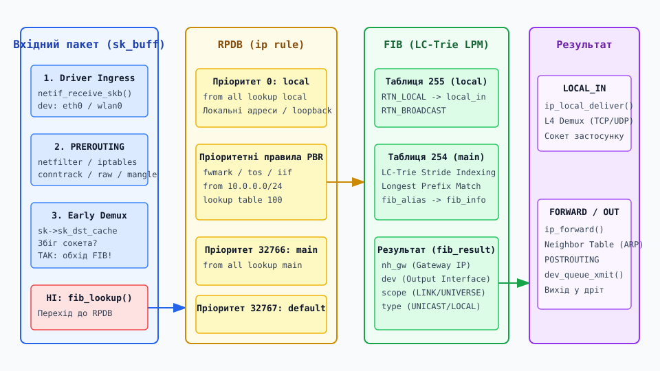
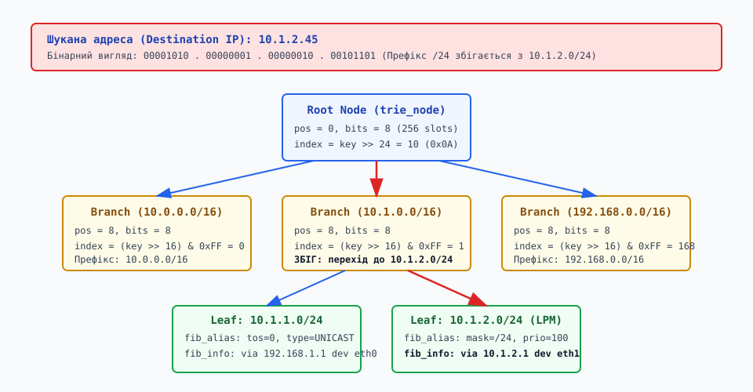

# Таблиця маршрутів і рішення про маршрут: RPDB, LC-Trie та векторний пошук у ядрі Linux

<preknowlist>
- [Мережева архітектура Linux](root:sys-unix/network-stack-architecture) — шлях пакета від мережевої карти до L4 сокетів.
- [Інтерфейси та IP-адреси](root:sys-unix/interfaces-and-addresses) — підсистема `net_device` та адресація в ядрі.
- [Протокол Netlink](root:sys-unix/netlink-protocol) — міжпроцесна взаємодія та управління мережевими об'єктами.
</preknowlist>

Кожен мережевий пакет, який потрапляє до ядра Linux через фізичний або віртуальний інтерфейс чи генерується локальними застосунками, постає перед фундаментальним вибором. Ядро має розв'язати дві задачі: перша — визначити, чи призначено пакет самому хосту, чи його слід перенаправити далі (доля пакета: `LOCAL_IN` або `FORWARD`), і друга — якщо пакет прямує в мережу, обрати правильний вихідний інтерфейс та IP-адресу наступного шлюзу (Next-Hop).

Підсистема прийняття рішення про маршрутизацію (Routing Decision Subsystem) є однією з найбільш високонавантажених частин ядра. На сучасних магістральних маршрутизаторах і серверах вона обробляє десятки мільйонів пакетів на секунду. Будь-яка затримка на цьому етапі одразу конвертується у деградацію пропускної здатності та зростання мережевого RTT (Round Trip Time).

Внутрішня архітектура маршрутизації в Linux забезпечує надійне й швидке визначення шляхів: від відбору таблиць у базі політик RPDB (`ip rule`) до алгоритму пошуку найдовшого префіксу (Longest Prefix Match) у префіксному дереві LC-Trie та механізмів локального кешування маршрутів у сокетах. Такий послідовний підхід дозволяє поєднати гнучку маршрутизацію на основі правил із високою швидкістю вибірки записів у FIB для масового мережевого трафіку.

---

## 1. Фундаментальне завдання маршрутизації у стеку Linux

На найнижчому рівні обробки IP-пакет представлений у ядрі структурою `struct sk_buff`. Коли мережева карта закінчує прийом кадру через DMA і драйвер передає його у функцію `netif_receive_skb()`, ядро витягує з заголовка IPv4 або IPv6 ключові параметри для пошуку шляху:

* **Destination IP (`daddr`):** Адреса призначення. Головний критерій пошуку маршруту.
* **Source IP (`saddr`):** Адреса джерела. Використовується для перевірки зворотного шляху (Reverse Path Filtering, RPF) та в правилах PBR.
* **Input Interface (`iif`):** Мережевий інтерфейс, через який прийшов пакет.
* **Firewall Mark (`fwmark`):** 32-бітна мітка, встановлена підсистемою Netfilter (`iptables` або `nftables`) у ланцюжку `PREROUTING`.
* **Type of Service (`tos`):** Поле пріоритету/DSCP з заголовка IP.
* **UID користувача (`uid`):** Сокетний ідентифікатор системного користувача, який згенерував вихідний пакет.

Чому класична концепція «однієї лінійної таблиці маршрутизації» виявилася непридатною для сучасних систем?

У реальних інфраструктурах один хост Linux може мати десяток мережевих інтерфейсів, бути підключеним до кількох провайдерів одночасно (Multi-Homing), ізолювати трафік різних орендарів через VRF (Virtual Routing and Forwarding) або направляти трафік окремих застосунків через VPN-тунелі. Якби ядро використовувало єдину таблицю, будь-яке складене правило (наприклад: «трафік від 10.0.1.0/24 з міткою mark=5 направити через eth1, а решту — через eth0») вимагало б нездійсненного перекомпонування всього графу мережевих шляхів.

Щоб розв'язати цю проблему, розробники ядра розділили процес прийняття рішення про маршрутизацію на **двохетапний конвеєр**:

```
[ Вхідний пакет sk_buff ] 
          │
          ▼
 [ 1. База політик RPDB (ip rule) ] ──► Визначення ID таблиці (напр. Table 100)
          │
          ▼
 [ 2. Таблиця FIB (LC-Trie LPM) ]   ──► Визначення Next-Hop IP та oif (eth1)
```

Перший етап (RPDB) відповідає на запитання: *«У ЯКІЙ САМЕ таблиці маршрутизації слід шукати шлях для цього пакета?»*. Другий етап (FIB) приймає обрану таблицю і відповідає на запитання: *«ЯКИЙ САМЕ запис у цій таблиці є найбільш специфічним для даної адреси призначення?»*.

---

## 2. Вхідний шлях пакета: ip_route_input_noref() та ip_route_output_key()

Підсистема маршрутизації ядра поділяє обробку пакетів на два виклики залежно від напрямку трафіку:

### Вхідний (транзитний або локальний) трафік

Після проходження базових перевірок цілісності IP-заголовка та ланцюжка `PREROUTING` підсистеми Netfilter, функція `ip_rcv_finish()` викликає головну точку входу підсистеми маршрутизації вхідних пакетів — `ip_route_input_noref()`:

:::tabs
```c
int ip_route_input_noref(struct sk_buff *skb, __be32 daddr, __be32 saddr,
                         u8 tos, struct net_device *dev);
```
```cpp
#include <cstdint>

// Концептуальний еквівалент функції маршрутизації вхідних пакетів у C++
namespace net::kernel_sim {
    struct SkBuff;
    struct NetDevice;

    int ip_route_input_noref(SkBuff* skb, std::uint32_t daddr, std::uint32_t saddr,
                             std::uint8_t tos, const NetDevice* dev) noexcept;
}
```
:::

Функція конструює ключову структуру опису запиту `struct flowi4` (або `struct flowi6` для IPv6), заповнюючи її параметрами `daddr`, `saddr`, `tos`, `mark` та `iif`. 

Далі ядро перевіряє, чи не активовано для даного інтерфейсу механізм Early Demux (локальне кешування сокетів). Якщо пакет не є частиною вже відкритого локального сокета, ядро викликає функцію `fib_lookup()`, передаючи їй сформований вектор `flowi4`.


*Повний шлях вхідного пакета через підсистему прийняття рішень про маршрутизацію (RPDB, FIB та LC-Trie).*

Отримавши результат від `fib_lookup()`, ядро формує або отримує об'єкт `struct rtable` і зв'язує його з пакетом через поле `skb->_skb_refdst`. З цього моменту в пакеті записані два вказівники на функції обробки:
* `skb->dst->input`: Вказує на `ip_local_deliver()`, якщо тип маршруту `RTN_LOCAL` (пакет призначений локальному хосту).
* `skb->dst->output`: Вказує на `ip_forward()`, якщо тип маршруту `RTN_UNICAST` і пакет є транзитним.

### Вихідний (локально згенерований) трафік

Коли локальний застосунок відправляє дані через сокет (викликаючи `connect()`, `sendto()` або `write()`), ядро виконує виклик `ip_route_output_key()`. Ця функція шукає маршрут у зворотному напрямку:
1. Заповнює структуру `flowi4` з урахуванням прив'язки сокета (`sk->sk_bound_dev_if`, `sk->sk_mark`, `sk->sk_uid`).
2. Викликає `fib_lookup()`, отримуючи відповідний вихідний інтерфейс (`oif`) та IP-адресу шлюзу.
3. Виконує автоматичний вибір локальної IP-адреси джерела (`src IP`), якщо її не було вказано через `bind()`. Ядро вибирає адресу з атрибута `RTA_PREFSRC` обраного маршруту або бере першу підходящу IP-адресу з вихідного інтерфейсу з відповідною областю видимості (`RT_SCOPE_LINK` або `RT_SCOPE_UNIVERSE`).

---

## 3. База правил маршрутизації RPDB (Routing Policy Database) та ip rule

База правил маршрутизації (RPDB) реалізує підхід, відомий під назвою **Policy Based Routing (PBR)**. 

RPDB являє собою впорядкований за пріоритетами список правил `struct fib_rule`. Переглянути поточні правила в системі можна за допомогою утиліти `ip rule`:

```bash
$ ip rule show
0:      from all lookup local
100:    from 10.0.1.0/24 fwmark 0x5 lookup 100
200:    iif eth1 tos 0x10 lookup 200
32766:  from all lookup main
32767:  from all lookup default
```

### Алгоритм обходу RPDB (`fib_lookup`)

Коли ядро шукає маршрут, функція `fib_lookup()` вступає у цикл обходу правил RPDB, який описується структурою `struct fib_rules_ops`:

1. **Перевірка селекторів правила:** Ядро порівнює поля ключа `flowi4` із критеріями поточного правила:
   * `from`: Адреса джерела пакета.
   * `to`: Адреса призначення.
   * `iif`: Вхідний мережевий інтерфейс.
   * `oif`: Вихідний мережевий інтерфейс (для локально згенерованих пакетів).
   * `fwmark`: 32-бітна мітка, встановлена за допомогою `iptables -j MARK` або `nftables mark set`.
   * `tos`: Type of Service / DSCP.
   * `uidrange`: Діапазон ідентифікаторів системних користувачів Linux (дозволяє маршрутизувати трафік окремого користувача чи сервісу через окремий VPN).
   * `l3mdev`: Прив'язка до пристрою VRF.
2. **Якщо селектори НЕ збігаються:** Ядро ігнорує дане правило і негайно переходить до наступного за пріоритетом правила в RPDB.
3. **Якщо селектори ЗБІГАЮТЬСЯ:** Ядро бере вказане в правилі ID таблиці (наприклад, `table 100`) і здійснює пошук префіксу в базі FIB цієї конкретної таблиці.
4. **Оцінка результату FIB:**
   * Якщо у вказаній таблиці знайдено відповідний маршрут, пошук у RPDB **припиняється**. Знайдений маршрут вважається остаточним рішенням.
   * Якщо в цій таблиці немає жодного підходящого маршруту (FIB повертає помилку `ESRCH`), ядро **повертається назад до RPDB** і продовжує перевірку наступних за пріоритетом правил!
   * Якщо в таблиці знайдено спеціальний маршрут типу `RTN_THROW`, ядро негайно перериває пошук у поточній таблиці і змушує RPDB перейти до наступного правила.

### Стандартні правила RPDB

У будь-якій системі Linux за замовчуванням завжди присутні три базові правила:

* **Пріоритет 0 (`lookup local`):** Найвищий пріоритет. Направляє пошук у спеціальну таблицю `local` (ID 255). Це гарантує, що будь-який пакет, призначений для власної IP-адреси хоста чи широкомовного інтерфейсу, буде виявлено миттєво, не чекаючи перевірок складних користувацьких правил.
* **Пріоритет 32766 (`lookup main`):** Направляє пошук у головну таблицю маршрутизації `main` (ID 254). Саме в цю таблицю додаються всі стандартні статичні маршрути та маршрути від BGP/OSPF демонів.
* **Пріоритет 32767 (`lookup default`):** Направляє пошук у таблицю `default` (ID 253). Використовується як резервна таблиця для системних служб.

Докладніше про програмні інтерфейси та атрибути правил Netlink дивіться у вставці [📋 Інтерфейс підсистеми маршрутизації та Netlink](root:sys-unix/routing-decision/api-fib-and-rtnetlink.md), а приклад практичної реалізації утиліти моніторингу — у вставці [⚙️ Запит та моніторинг маршрутів через RTNETLINK](root:sys-unix/routing-decision/proj-rtnetlink-route-lookup.md).

---

## 4. Локальні та глобальні таблиці маршрутизації

Таблиця маршрутизації в ядрі Linux — це окремий екземпляр структури `struct fib_table`. Кожна таблиця ізольована від інших і містить власний граф префіксів.

### Локальна таблиця `local` (ID 255)

Таблиця `local` створюється ядром автоматично під час ініціалізації мережевої підсистеми. Кожного разу, коли адміністратор або DHCP-клієнт призначає IP-адресу мережевому інтерфейсу, ядро автоматично додає в таблицю `local` кілька обов'язкових записів:

```bash
$ ip route show table local
local 127.0.0.1 dev lo proto kernel scope host src 127.0.0.1
local 192.168.1.100 dev eth0 proto kernel scope host src 192.168.1.100
broadcast 192.168.1.255 dev eth0 proto kernel scope link src 192.168.1.100
```

Маршрути з типом `local` мають область видимості `scope host`. Коли `fib_lookup()` знаходить цей запис, пакет не виходить на зовнішній мережевий адаптер. Ядро повертає тип `RTN_LOCAL`, передаючи пакет у внутрішній стек обробки `ip_local_deliver()`.

Завдяки правилу RPDB з пріоритетом 0, перевірка таблиці `local` передує будь-яким користувацьким таблицям. Це унеможливлює ситуацію, коли через помилку у файрволі чи PBR-правилах трафік до власної адреси сервера раптом відправляється у зовнішній інтернет-канал.

### Головна таблиця `main` (ID 254)

Таблиця `main` є основною робочою таблицею системи. У ній зберігаються:
1. **Маршрути прямого зв'язку (`scope link`):** Створюються ядром при підйомі інтерфейсу. Вони кажуть, що адреси підмережі (наприклад `192.168.1.0/24`) досяжні безпосередньо через інтерфейс `eth0` без використання шлюзів.
2. **Шлюзи за замовчуванням (`default via ...`):** Маршрути з префіксом `0.0.0.0/0`, які вказують IP-адресу роутера провайдера.
3. **Динамічні маршрути:** Записи, отримані від протоколів BGP, OSPF або IS-IS через сервіси FRRouting або BIRD.

### Користувацькі таблиці та ізоляція VRF

Linux підтримує створення до `2^32 - 1` незалежних таблиць маршрутизації. Це використовується в технології **VRF (Virtual Routing and Forwarding)** через підсистему `l3mdev` (Layer 3 Master Device). 

Створення VRF-інтерфейсу прив'язує фізичні або віртуальні адаптери до окремої таблиці маршрутизації, реалізуючи повну ізоляцію мережевого трафіку різних віртуальних машин або контейнерів на рівні ядра, аналогічно апаратним маршрутизаторам Cisco або Juniper.

---

## 5. Алгоритм пошуку найдовшого префіксу (Longest Prefix Match)

Після того як ядро вибрало конкретну таблицю `fib_table`, воно мусить розв'язати класичну алгоритмічну задачу: **Longest Prefix Match (LPM)**.

Суть принципу LPM полягає у тому, що якщо для шуканої IP-адреси в таблиці існує кілька збігів з різними довжинами масок, ядро **зобов'язане обрати той маршрут, маска якого містить найбільшу кількість біт** (тобто є найбільш специфічною).

Розглянемо приклад. Нехай у таблиці `main` присутні три маршрути:

```text
Маршрут A: 0.0.0.0/0       via 192.168.1.1   (Default Route, mask /0)
Маршрут B: 10.0.0.0/8      via 10.254.0.1    (Corporate WAN, mask /8)
Маршрут C: 10.1.2.0/24     via 10.1.2.1      (Local Subnet,  mask /24)
```

Припустимо, у систему надходить пакет з адресою призначення `10.1.2.45`.
* Порівняння з Маршрутом A: бінарний збіг по 0 бітах. (Збігається).
* Порівняння з Маршрутом B: бінарний збіг по перших 8 бітах (`10.x.x.x`). (Збігається).
* Порівняння з Маршрутом C: бінарний збіг по перших 24 бітах (`10.1.2.x`). (Збігається).

Усі три маршрути підходять під цю адресу. Але ядро обирає **Маршрут C**, оскільки його маска `/24` є довшою за `/8` та `/0`. Маршрут C описує вужчий, більш специфічний сегмент мережі.

### Еволюція структур даних FIB в ядрі Linux

Як реалізувати LPM в оперативній пам'яті з максимальною швидкістю?

* **Ера лінійних масивів (Linux 1.x):** Лінійний перебір масиву маршрутів. Складність `O(N)`. Вимагала величезної кількості порівнянь, придатна лише для десятків маршрутів.
* **Ера хеш-таблиць `fn_hash` (Linux 2.0 – 2.6.12):** Ядро підтримувало 33 окремі хеш-таблиці (по одній для кожної довжини маски від `/32` до `/0`). Пошук починався з хеш-таблиці `/32`. Якщо адреса не знаходилася, ядро викликом хеш-функції перевіряло таблицю `/31`, і так далі до `/0`. Для малих таблиць це працювало швидко, але на таблицях BGP Full View (сотні тисяч маршрутів з різними масками) лінійний обхід десятків хеш-таблиць викликав масовані промахи кешу CPU.
* **Ера префіксних дерев LC-Trie (Linux 2.6.13+ і дотепер):** У 2005 році розробник Роберт Олссон (Robert Olsson) інтегрував у ядро структуру **LC-Trie (Level-Compressed Trie)**. LC-Trie дозволяє знаходити найдовший префікс за сталий, детермінований час, гарантуючи виконання LPM за лічені кроки індексації масиву.

---

## 6. Алгоритм та структура даних LC-Trie

Префіксне дерево (Trie або Radix Tree) — це деревна структура даних, у якій шлях від кореня до вузла визначається бітовим значенням ключа (IP-адреси). У звичайному бінарному дереві кожен рівень аналізує рівно 1 біт IP-адреси. Для IPv4 таке дерево могло б мати глибину до 32 рівнів, що вимагало б до 32 послідовних звернень до пам'яті під час кожного пошуку.

LC-Trie об'єднує два потужні методи стиснення дерев: **Path Compression** (стиснення шляхів) та **Level Compression** (стиснення рівнів).

### 1. Path Compression (Стиснення шляхів)

Якщо в певній гілці дерева є довгий ланцюжок вузлів, кожен з яких має лише одного дочірнього нащадка (відсутність розгалуження), ці проміжні вузли видаляються. У кожному вузлі зберігається поле `pos`, яке вказує номер біта, з якого відновлюється порівняння.

### 2. Level Compression (Стиснення рівнів)

Це головна новація алгоритму. Якщо піддерево на глибині `k` є повністю або майже повністю заповненим (тобто містить `2^k` щільно заповнених нащадків), ці `k` рівнів бінарного дерева «схлопуються» в один великий вузол розгалуження (Branch Node) з масивом із `2^k` вказівників!

Замість того щоб 8 разів побітово спускатися по бінарному дереву, ядро бере одразу 8 біт IP-адреси як індекс і за одну операцію `O(1)` обчислення зсуву вказівника вибирає потрібне піддерево.


*Структура префіксного дерева LC-Trie та покрокове знаходження найдовшого префіксу (LPM) для IP-адреси.*

### Анатомія вузлів LC-Trie у коді ядра

У коді ядра Linux (файл `net/ipv4/fib_trie.c`) вузли дерева кодуються структурою `struct key_vector`:

:::tabs
```c
struct key_vector {
    t_key          key;        /* Префікс адреси */
    unsigned char  pos;        /* Позиція аналізованого біта (0..31) */
    unsigned char  bits;       /* Кількість біт у рівні (stride k) */
    unsigned char  slen;       /* Максимальна довжина суфіксу */
    union {
        struct key_vector *tnode[0]; /* Масив дочірніх вузлів (якщо bits > 0) */
        struct hlist_head leaf;      /* Зв'язаний список fib_alias (якщо bits == 0) */
    };
};
```
```cpp
#include <cstdint>
#include <variant>
#include <vector>

// Структурне представлення вузла LC-Trie мовою C++ з використанням std::variant
namespace net::kernel_sim {
    struct KeyVector {
        std::uint32_t key{0};  /* Префікс адреси */
        std::uint8_t  pos{0};  /* Позиція аналізованого біта (0..31) */
        std::uint8_t  bits{0}; /* Кількість біт у рівні (stride k) */
        std::uint8_t  slen{0}; /* Максимальна довжина суфіксу */

        std::variant<std::vector<KeyVector*>, void*> node_data;
    };
}
```
:::

Покроковий процес пошуку в LC-Trie за функцією `check_leaf()`:

1. **Індексація від кореня:** Ядро бере IP-адресу призначення `key`. На кореневому вузлі воно виконує побітовий зсув `index = (key >> pos) & ((1 << bits) - 1)` і миттєво вибирає потрібну гілку з масиву `tnode`.
2. **Спуск до листка:** Процес повторюється для 2–4 внутрішніх вузлів розгалуження, поки ядро не досягне листка (`bits == 0`).
3. **Перевірка суфікса у листку:** Листок містить список `struct fib_alias`. Ядро перевіряє, чи дійсно маска префіксу збігається з шуканою адресою, і витягує готову структуру `struct fib_info`.

### Динамічна адаптація дерева: Inflate та Halve

Дерево LC-Trie в ядрі Linux не є статичним. При додаванні нових маршрутів (`ip route add`) або їх вилученні ядро динамічно коригує коефіцієнт стиснення рівнів через два алгоритми:

* **`inflate` (Розширення вузла):** Якщо fill-factor (коефіцієнт заповнення) дочірніх вузлів перевищує поріг 50%, ядро подвоює розмір масиву `tnode` (`bits = bits + 1`), зменшуючи глибину дерева на один рівень.
* **`halve` (Звуження вузла):** Якщо через вилучення маршрутів коефіцієнт заповнення падає нижче 25%, ядро зменшує розмір масиву вдвічі (`bits = bits - 1`), вивільняючи оперативну пам'ять.

Оскільки більшість магістральних таблиць глобального Інтернету добре стискаються, середня глибина дерева LC-Trie в Linux становить всього **3–4 рівні**. Це означає, що пошук маршруту серед 800 000 записів вимагає всього 3–4 звернень до кешу L2/L3 процесора, виконуючись за десятки наносекунд.

---

## 7. Перевірка зворотного шляху (Reverse Path Filtering, RPF)

Окрім вибору напрямку руху пакета, підсистема маршрутизації ядра відповідає за захист мережі від фальсифікації IP-адрес джерела (IP Spoofing). Ця функція реалізується через механізм **Reverse Path Filtering (RPF)** у функції `fib_validate_source()`.

Коли вхідний пакет приймається з інтерфейсу `eth0` з IP-адресою джерела `10.0.0.5`, ядро виконує зворотний пошук у FIB: *«А якби ми відправляли пакет до адреси 10.0.0.5, через який інтерфейс виходив би цей маршрут?»*.

Режими роботи RPF регулюються через системний параметр sysctl `net.ipv4.conf.all.rp_filter`:

* **`rp_filter = 0` (Disabled):** Перевірка зворотного шляху вимкнена. Ядро приймає пакети з будь-якими IP-адресами джерела.
* **`rp_filter = 1` (Strict Mode):** Суворий режим. Якщо зворотний пошук у FIB вказує, що найкращий вихідний маршрут до адреси джерела проходить через ІНШИЙ мережевий інтерфейс (наприклад `eth1`, а не `eth0`), ядро вважає пакет підробленим і мовчки скидає його (`IP drop`), збільшуючи лічильник `IPReversePathFilter`.
* **`rp_filter = 2` (Loose Mode):** М'який режим. Ядро перевіряє лише те, чи існує ВЗАГАЛІ хоча б один маршрут до даної IP-адреси джерела у будь-якому інтерфейсі. Якщо адреса досяжна, пакет приймається. Це корисно для асиметричної маршрутизації у Multi-Homing мережах.

---

## 8. Відмінності маршрутизації IPv6 (`fib6_node` та Trie)

Хоча концептуально рішення про маршрутизацію для IPv6 підпорядковується тим самим правилам PBR та LPM, внутрішня реалізація в ядрі Linux має суттєві відмінності:

* **Структура `fib6_node`:** В IPv6 для кожної таблиці маршрутизації використовується окрема реалізація префіксного дерева на базі безадресного Radix Trie (файл `net/ipv6/ip6_fib.c`). Вузол `fib6_node` описує 128-бітний префікс і містить окреме піддерево для аналізу IP-адреси джерела (Source Routing / SADR — Source-Address Dependent Routing).
* **Source-Address Dependent Routing (SADR):** В IPv6 ядро може будувати двовимірне префіксне дерево, у якому пошук здійснюється одночасно за IPv6-адресою призначення та IPv6-адресою джерела. Це дозволяє провайдерам коректно маршрутизувати трафік при наявності кількох префіксів IPv6 без використання важких PBR-правил Netfilter.
* **Відсутність ARP:** Замість ARP для розв'язання адрес IPv6 використовується протокол Neighbor Discovery (NDP), а записи сусідів зберігаються у структурі `struct neighbour` підсистеми `ndisc`.

---

## 9. Криза кешу маршрутів та його видалення у Linux 3.6

Розуміння підсистеми маршрутизації Linux буде неповним без висвітлення однієї з найважливіших архітектурних революцій у історії ядра: **вилучення глобального кешу маршрутів (IPv4 Route Cache)**.

До версії ядра Linux 3.6 (2012 рік) мережевий стек використовував динамічний кеш `rt_hash_table`. Ідея полягала в тому, що для кожного нового мережевого потоку результатом першого пошуку в FIB створювався запис у глобальній хеш-таблиці з ключем `(Source IP, Destination IP, ToS, iif)`. Усі наступні пакети цього потоку обходили пошук у FIB, беручи готовий об'єкт `dst_entry` з хеш-таблиці.

Однак поява масованих DDoS-атак зі підробкою IP-адрес джерела (Random Source IP Floods) перетворила кеш на катастрофу. Кожен новий пакет із випадковою IP-адресою викликав промах кешу, виділення пам'яті для нового запису і переповнення хеш-кошиків. Збирач сміття (Garbage Collector) входив у нескінченний цикл примусового очищення пам'яті, викликаючи шторм спинлоків (`spinlock contention`) та 100% завантаження CPU в режимі ядра. Цей стан отримав назву **Route Cache Thrashing**.

У версії Linux 3.6 Девід Міллер повністю вирізав глобальний кеш маршрутів. Завдяки високій швидкості алгоритму LC-Trie, чистий пошук у FIB виявився настільки швидким, що ядро перейшло на суворо безадресний (stateless) пошук для кожного пакета, зробивши продуктивність системи повністю передбачуваною та стійкою до DDoS-атак.

Докладний історичний аналіз, покроковий механізм аварії кешу та деталі патчсету Девіда Міллера викладено у вставці [📜 Історія кешу маршрутів Linux та його вилучення](root:sys-unix/routing-decision/hist-route-cache-removal.md).

---

## 10. Оптимізація локального трафіку: Socket Route Caching та ECMP

Видалення глобального кешу стосувалося транзитного трафіку. Для локального трафіку (наприклад, для вебсервера Nginx або СУБД PostgreSQL, які генерують мільйони пакетів у межах встановлених TCP-з'єднань) розробники впровадили механізм **Socket Route Caching** та **Early Demux**.

### Socket Route Caching

Коли сокет створює TCP-з'єднання або викликає `connect()`, ядро виконує пошук у FIB **лише один раз**. Отриманий вказівник на структуру `struct dst_entry` зберігається безпосередньо всередині структури сокета у полі `sk->sk_dst_cache`:

:::tabs
```c
struct sock {
    ...
    struct dst_entry __rcu *sk_dst_cache;
    ...
};
```
```cpp
#include <atomic>

// Опис кешу маршруту в сокеті C++ з використанням атомарного вказівника std::atomic
namespace net::kernel_sim {
    struct DstEntry;

    struct Sock {
        // У C++ кешований маршрут зберігається як атомарний або безпечний вказівник
        std::atomic<const DstEntry*> sk_dst_cache{nullptr};
    };
}
```
:::

Коли застосунок викликає `write()` або `sendmsg()`, ядро бере готовий маршрут безпосередньо з структури сокета через функцію `dst_check()`, взагалі не звертаючись до RPDB та LC-Trie! Це дає максимальну продуктивність для локальних серверів без ризику DDoS-вразливостей.

### Багатошляхова маршрутизація ECMP (Equal-Cost Multi-Path)

Якщо для одного префіксу в таблиці вказано кілька шлюзів із однаковою метрикою (атрибут `RTA_MULTIPATH`), ядро виконує балансування навантаження між ними:

```bash
# Додавання маршруту з двома однаковими шлюзами (ECMP)
ip route add 10.0.0.0/8 nexthop via 192.168.1.1 dev eth0 weight 1 \
                        nexthop via 192.168.2.1 dev eth1 weight 1
```

Під час пошуку у функціях `fib_select_path()` ядро обчислює хеш-функцію від 4-кортежу пакета (Source IP, Destination IP, Source Port, Destination Port) — так званий **L4 Hash**. Завдяки цьому всі пакети в межах одного TCP-потоку завжди відправляються через один і той самий шлюз, унеможливлюючи порушення порядку доставки пакетів (Out-of-Order Packets), але рівномірно розподіляючи різні з'єднання між кількома фізичними каналами.

---

## 11. Взаємодія з ICMP та генерація перенаправлень (ICMP Redirects)

Під час маршрутизації транзитного трафіку ядро Linux здійснює суворий контроль за топологічними аномаліями мережі.

Коли вхідний пакет приймається з мережевого інтерфейсу `eth0` і після пошуку в FIB з'ясовується, що вихідним інтерфейсом (`oif`) для цього ж пакета є той самий інтерфейс `eth0`, ядро виявляє неоптимальний маршрут (пакет ввійшов і виходить через той самий фізичний дріт).

У цій ситуації підсистема маршрутизації виконує дві дії:
1. Перенаправляє пакет через `ip_forward()` на відповідний next-hop у тій самій L2-мережі.
2. Згенеровує ICMP-повідомлення `ICMP Redirect` (Type 5, Code 1) і надсилає його назад відправнику. Це повідомлення інформує хост-джерело, що він може надсилати подальші пакети до даного призначення безпосередньо на MAC-адресу шлюзу в тій самій мережі, обходячи даний Linux-маршрутизатор.

Увімкнення чи вимкнення генерації ICMP Redirect регулюється через системні параметри sysctl:
```bash
sysctl -w net.ipv4.conf.all.send_redirects=0
sysctl -w net.ipv4.conf.eth0.accept_redirects=0
```

У сучасних захищених мережах генерацію та прийом ICMP Redirect зазвичай вимикають із міркувань безпеки, оскільки зловмисники можуть використовувати фальшиві ICMP Redirect для атак типу Man-in-the-Middle (MitM).

---

## 12. Потокові прискорювачі: eBPF/XDP та bpf_fib_lookup()

У сучасних високонавантажених мережах 100GbE+ класичний пошук у FIB ядра Linux (навіть з оптимізованим LC-Trie) може ставати вузьким місцем через накладні витрати на виклики обробників переривань та створення структури `sk_buff`.

Для обходу цих обмежень застосовуються технології **eBPF/XDP (eXpress Data Path)**.

XDP-програма завантажується безпосередньо в мережевий драйвер і обробляє пакети в кадрі `struct xdp_buff` до виділення пам'яті під `sk_buff`.

Щоб не дублювати таблицю маршрутизації в eBPF-картах, ядро надає спеціальний BPF-хелпер:

:::tabs
```c
long bpf_fib_lookup(void *ctx, struct bpf_fib_lookup *params, int plen, u32 flags);
```
```cpp
#include <cstdint>

// Оголошення BPF-хелпера в C++ із суворою типізацією та std::uint32_t
namespace ebpf {
    extern "C" std::int64_t bpf_fib_lookup(void* ctx, struct bpf_fib_lookup* params,
                                           std::int32_t plen, std::uint32_t flags) noexcept;
}
```
:::

Схема роботи XDP-маршрутизатора:
1. XDP-програма витягує IP-адреси та індекс вхідного інтерфейсу з `xdp_buff`.
2. Заповнює структуру `struct bpf_fib_lookup` і викликає `bpf_fib_lookup()`.
3. Ядро виконує безпосередній швидкий пошук у префіксному дереві LC-Trie ядра!
4. Якщо пошук успішний (`BPF_FIB_LKUP_RET_SUCCESS`), ядро повертає MAC-адресу шлюзу та вихідний індекс інтерфейсу.
5. XDP-програма перезаписує L2-заголовок кадру та повертає вердикт `XDP_REDIRECT`, відправляючи пакет у вихідний мережевий адаптер без проходження крізь увесь мережевий стек Linux!

Це дозволяє маршрутизувати або скидати пакети зі швидкістю понад 40 мільйонів пакетів на секунду на одне процесорне ядро, зберігаючи при цьому повну сумісність із таблицями `ip route` та правилами `ip rule` операційної системи Linux.

---

## 13. Простеження, діагностика та метрики в продакшені

Для налагодження складних конфігурацій маршрутизації в операційній системі Linux використовуються системні інструменти розслідування.

### 1. Симуляція рішення про маршрутизацію (`ip route get`)

Найпростіший спосіб дізнатися, яке саме рішення прийме ядро для конкретного пакета, — використати команду `ip route get`:

```bash
$ ip route get 8.8.8.8 from 192.168.1.100 iif eth0 mark 5
8.8.8.8 via 192.168.1.1 dev eth0 table 100 src 192.168.1.100 uid 1000
    cache iif eth0 mark 0x5
```

Ця команда змушує ядро виконати реальний симульований пошук у RPDB та FIB, роздруковуючи обрану таблицю, вихідний інтерфейс, шлюз та переважну адресу джерела.

### 2. Аналіз трасувальних точок ядра (Kernel Tracepoints)

Для системних інженерів, які розслідують аномальні затримки в мережі під навантаженням, ядро надає вбудовані точки трасування `tracepoints` підсистеми `fib`:

```bash
# Простеження пошуку в таблицях FIB через perf або bpftrace
sudo bpftrace -e 'tracepoint:fib:fib_table_lookup { printf("Table %d IP %s -> res %d\n", args->tb_id, ntop(args->daddr), args->err); }'
```

Цей інструмент дозволяє бачити кожен виклик пошуку в LC-Trie в режимі реального часу з нульовими накладними витратами, фіксуючи промахи маршрутизації та некоректну роботу PBR-правил.

Глибоке розуміння підсистеми маршрутизації Linux — від бази правил RPDB і префіксного дерева LC-Trie до RCU-синхронізації та механізмів eBPF/XDP — дозволяє інженерам будувати надстійкі, високопродуктивні та прозорі мережеві рішення для сучасних хмарних і телекомунікаційних платформ.
