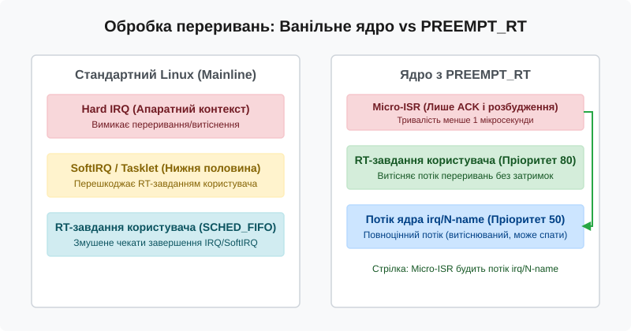
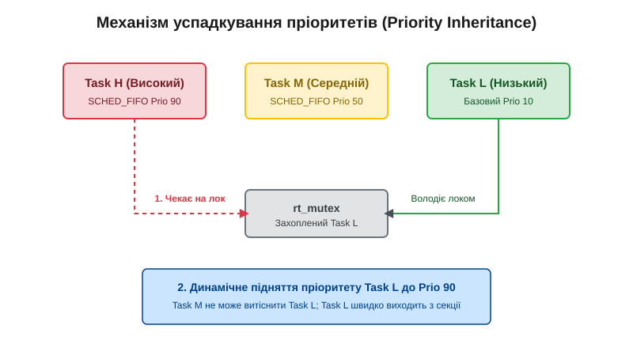

# Real-Time Linux patchset (PREEMPT_RT)

<preknowlist>
- [Класи планування та пріоритети](topic:sys-unix/priority-nice-realtime) — планувальні класи `SCHED_FIFO`, `SCHED_RR`, `SCHED_DEADLINE` та діапазон пріоритетів реального часу у Linux.
- [Витісненість ядра Linux](topic:sys-unix/kernel-preemption) — моделі витіснення `PREEMPT_NONE`, `PREEMPT_VOLUNTARY` та `PREEMPT` у ванільному ядрі.
</preknowlist>

Промисловий контролер керування сервоприводом робота-маніпулятора мусить кожні 250 мікросекунд надсилати нову координату через шину EtherCAT. Якщо системний таймер або потік керування запізниться бодай на 100 мікросекунд, сервопривод увійде у режим аварійного гальмування, а виробнича лінія зупиниться з помилкою розсинхронізації. У стандартному ядрі Linux із конфігурацією `CONFIG_PREEMPT` (чи її динамічним варіантом `CONFIG_PREEMPT_DYNAMIC`) така зупинка неминуча: коли високопріоритетний потік керування прокидається за сигналом таймера, він змушений чекати десятки мілісекунд, якщо на тому самому ядрі процесора в цей момент дообробляється важкий мережевий `SoftIRQ`, а драйвер диска на сусідньому ядрі тримає потрібну структуру під звичайним спінлоком `spinlock_t`. Спінлок вимикає витіснення на локальному процесорі, а переривання виконуються у глобальному апаратному контексті, який має вищий пріоритет за будь-який процес користувача — незалежно від того, чи встановлено йому реальний пріоритет `SCHED_FIFO` 99. Саме для усунення цієї структурної затримки і забезпечення детермінованого часу реакції в межах десятків мікросекунд було створено патчсет PREEMPT_RT.

## 1. Анатомія затримок у ванільному ядрі

Щоб зрозуміти, звідки беруться затримки в операційній системі реального часу, необхідно розкласти загальний час від виникнення фізичної події в апаратурі до початку виконання відповідного коду у програмі користувача (загальну затримку пробудження, або Wakeup Latency) на кілька строго визначених фаз.

Перша фаза — **затримка апаратного переривання** (Hardware Interrupt Latency). Вона вимірює інтервал від моменту, коли периферійний контролер (наприклад, мережева карта або лічильник таймера) виставляє сигнал на лінії IRQ, до моменту, коли процесор припиняє виконання поточного потоку інструкцій і переходить на вектор обробника переривань (ISR). Якщо ядро у цей момент виконує критичну секцію з вимкненими локальними перериваннями через `local_irq_disable()`, сигнал затримується у контролері APIC (Advanced Programmable Interrupt Controller) або ARM GIC до виклику `local_irq_enable()`.

Друга фаза — **затримка витіснення** (Preemption-Disabled Latency). Отримавши апаратне переривання, ядро позначає потік реального часу як готовий до виконання (`TASK_RUNNING`) і додає його до черги `runqueue`. Проте якщо ядро процесора у цей момент перебуває всередині критичної секції, захищеної спінлоком `spinlock_t`, витіснення заборонено лічильником `preempt_count`. Процесор змушений повністю завершити виконання цієї секції і звільнити лок, перш ніж планувальник отримає право змінити контекст.

Третя фаза — **затримка планування та перемикання контексту** (Scheduling and Context Switch Latency). Це час, який витрачає планувальник на вибір найвищого за пріоритетом потоку з черги `runqueue`, збереження регістрів поточного процесу, перемикання таблиць сторінок `CR3` (у разі зміни процесу) та відновлення стану регістрів нового потоку реального часу.

```
Подія в апаратурі (IRQ line)
    │
    ├── [ Interrupt Latency: чекає local_irq_enable() ]
    ▼
Виконання Hard IRQ
    │
    ├── [ Preemption-Off Latency: чекає звільнення spinlock_t / SoftIRQ ]
    ▼
Викликано scheduler (pick_next_task)
    │
    ├── [ Context Switch Latency: збереження CR3 / регістрів ]
    ▼
Виконання коду реального часу користувача
```

У ванільному ядрі Linux головними джерелами недетермінізму є не апаратні обмеження, а сама архітектура обробки ресурсів:
1. **Спінлоки (`spinlock_t`)**: Використовують активне опитування (busy-wait) і автоматично вимикають витіснення ядра на локальному CPU на весь час тримання блокування.
2. **Апаратні переривання (Hard IRQs)**: Виконуються поза контекстом процесів і блокують виконання будь-яких задач користувача, навіть із пріоритетом `SCHED_FIFO` 99.
3. **Програмні переривання (SoftIRQs)**: Обробляють нижні половини (Bottom Halves) мережевого стека, блокових пристроїв та таймерів, запускаючись або одразу після Hard IRQ, або у фонових демонах `ksoftirqd/N` без чіткого керування пріоритетами реального часу.
4. **Затримки поза контролем ядра (SMI)**: Системи керування живленням BIOS/UEFI можуть періодично перехоплювати управління через переривання SMI (System Management Interrupts). Переривання SMI виконуються на рівні прошивки материнської плати (SMM mode), про що ядро Linux навіть не здогадується. Для гарантії жорсткого реального часу використання плат із некоректними SMI є неприпустимим.

Історію того, як спільнота розробників боролася з цими затримками впродовж понад двох десятиліть і як патчсет пройшов шлях до злиття в мейнлайн, висвітлено у [історичному огляді PREEMPT_RT](topic:sys-unix/rt-latency-budget-and-tuning/hist-rt-patchset.md).

## 2. Фундаментальна трансформація: Перетворення spinlock_t у rt_mutex

Наріжним каменем архітектури `PREEMPT_RT` є радикальна зміна поведінки базового примітива синхронізації — `spinlock_t`. У ванільному ядрі на багатопроцесорних (SMP) системах спінлок реалізовано як атомний прапорець. Якщо потік А захопив `spinlock_t`, а потік Б на іншому ядрі намагається його захопити, потік Б потрапляє у цикл активного опитування (spin loop), навантажуючи шину пам'яті й марнуючи процесорний час. Найважливіше те, що захоплення `spinlock_t` викликає `preempt_disable()`, унеможливлюючи витіснення потоку А іншими потоками.

Під прапорцем `CONFIG_PREEMPT_RT` ядро повністю перевизначає структуру `spinlock_t`. Замість класичного активного локу `spinlock_t` стає обгорткою довкола сплячого м'ютекса реального часу — `struct rt_mutex`.

```c
/* Концептуальне визначення spinlock_t під CONFIG_PREEMPT_RT */
typedef struct spinlock {
    struct rt_mutex_base lock;
} spinlock_t;
```

Коли потік намагається захопити зайнятий `spinlock_t` у ядрі `PREEMPT_RT`, відбувається таке:
1. Потік **не крутиться у циклі** і не спалює процесорний час.
2. Ядро додає потік до впорядкованого за пріоритетом списку очікування м'ютекса (`struct rt_mutex_waiter`).
3. Потік переводиться у стан сну `TASK_RTLOCK_WAIT` (спеціальний варіант `TASK_UNINTERRUPTIBLE`), і планувальник миттєво віддає CPU іншому готовому RT-завданню.

Оскільки `spinlock_t` під `PREEMPT_RT` занурює потік у сон при конкуренції, утримувати його з вимкненим витісненням стало неможливо (у Linux потік не може заснути всередині секції `preempt_disable()`). Тому захоплення `spinlock_t` **більше не вимикає витіснення ядра**. Потік, який тримає `spinlock_t` у ядрі `PREEMPT_RT`, може бути у будь-який момент витіснений пріоритетнішим потоком реального часу. Якщо тому потокові цей самий лок не потрібен, він просто працює далі; якщо ж потрібен — він засинає на локу, а володар дістає його пріоритет і швидко доводить критичну секцію до кінця (розділ 4).

Для оптимізації дуже коротких секцій `rt_mutex` застосовує адаптивне очікування (Adaptive Spinning): поки володар локу справді виконується на іншому CPU, потік-претендент крутиться в циклі, сподіваючись на швидке звільнення; щойно володар зійшов із процесора (його витіснили або він заснув), претендент теж засинає, бо чекати вже нема сенсу. Ця умова — «володар зараз на CPU» — і обмежує спін: важке перемикання контексту робиться лише тоді, коли воно неминуче.

Трансформація торкнулася також читацько-письменницьких локів `rwlock_t` та семафорів: під `PREEMPT_RT` `rwlock_t` стає сплячим локом на тій самій основі `rt_mutex` (спільний механізм `rwbase` із `rw_semaphore`), з успадкуванням пріоритетів для письменника.

### Виняток: примітив raw_spinlock_t

Звісно, у ядрі існують критичні секції самого низького рівня, де процес витіснення або перемикання контексту неможливий принципово — наприклад, код самого планувальника (захист черги `runqueue`), обробники апаратних таймерів та драйвери контролерів переривань. Для таких місць `PREEMPT_RT` зберігає оригінальну логіку активного опитування з вимкненням витіснення та переривань за допомогою примітива `raw_spinlock_t`.

Розробники ядра провели колосальну роботу, розділивши тисячі блокувань у коді ядра на дві категорії:
- `raw_spinlock_t`: Справжні спінлоки активного опитування. Вони забороняють спати, вимикають витіснення/переривання і мусять бути мікроскопічними за часом утримання — саме тривалість цих секцій лишається нижньою межею затримки всієї системи, тож кожен новий `raw_spinlock_t` у ядрі проходить окреме обґрунтування.
- `spinlock_t`: Сплячі RT-м'ютекси. Дозволяють витіснення, передають пріоритети і використовуються у переважній більшості коду ядра та драйверів.

| Характеристика | `spinlock_t` (Стандарт) | `spinlock_t` (PREEMPT_RT) | `raw_spinlock_t` | `mutex` |
| :--- | :--- | :--- | :--- | :--- |
| **Поведінка при конкуренції** | Активне опитування (Spin) | Сон у черзі (Sleep) | Активне опитування (Spin) | Сон у черзі (Sleep) |
| **Витіснення (Preemption)** | Вимкнено (`preempt_disable`) | **Увімкнено** | Вимкнено (`preempt_disable`) | Увімкнено |
| **Контекст виконання** | Апаратний / Процесний | Лише процесний | Апаратний / Процесний | Лише процесний |
| **Підтримка Priority Inheritance** | Ні | **Так (через rt_mutex)** | Ні | Ні у ванільному ядрі; під `PREEMPT_RT` — так (`mutex` теж лягає на `rt_mutex`) |
| **Можливість заснути під локом** | Ні (Panic/Bug) | Ні (для коду під локом) | Ні (Panic/Bug) | Так |

## 3. Forced Threaded IRQs (Потокові переривання)

Другим ключовим елементом детермінізму у `PREEMPT_RT` є механізм примусового перенесення обробників переривань у потоки ядра — **Forced Threaded IRQs**.

У ванільному ядрі обробка переривання ділиться на дві половини: Top Half (короткий Hard IRQ, який вимикає локальні переривання) та Bottom Half (SoftIRQ/Tasklets). Проблема полягає у тому, що будь-яке апаратне переривання (наприклад, надходження мережевого пакета на карту 10GbE або рух миші) перериває виконання потоку реального часу користувача, скільки б пріоритету той не мав. Під час шторму переривань (Interrupt Storm) процесор може витрачати 100% часу на обробку мережевих пакетів, заморозивши потік керування роботом.

Патчсет `PREEMPT_RT` перетворює майже всі обробники апаратних переривань на звичайні потоки ядра.



*Рис. 1. Порівняння традиційної обробки переривань та Threaded IRQs у PREEMPT_RT.*

При надходженні апаратного сигналу спрацьовує мікроскопічний обробник Micro-ISR (Hard IRQ). Його робота зводиться до двох дій:
1. Квитувати переривання на периферійному пристрої та замаскувати лінію IRQ на контролері переривань.
2. Розбудити спеціальний потік ядра `irq/N-name` (де `N` — номер IRQ, наприклад `irq/19-eth0`) через `irq_wake_thread()`.

Після цього Hard IRQ негайно завершується, витративши менше 1 мікросекунди. Вся реальна робота драйвера (зчитування буферів, розбір протоколів, виклики підсистем) виконується у контексті потоку `irq/N-name`.

Оскільки `irq/N-name` є звичайним потоком ядра (`task_struct`), він підпорядковується стандартним правилам планувальника `SCHED_FIFO`. За замовчуванням ядра потокам `irq/*` призначається пріоритет `SCHED_FIFO` 50.

Це дає розробникові систем реального часу абсолютний контроль:
- Якщо потік керування сервоприводом має пріоритет `SCHED_FIFO` 80, він **витіснить потік обробки мережевого пакета** `irq/19-eth0` (пріоритет 50) без жодних затримок.
- Обробка мережевого пакета буде відкладена до моменту, коли потік сервоприводу завершить свій цикл і засне.
- Винятком із примусового перенесення у потоки лишаються тільки апаратний системний таймер, переривання міжпроцесорної взаємодії (IPI — Inter-Processor Interrupts) та спеціальні обробники з прапорцем `IRQF_NO_THREAD`.

Можливість керування пріоритетами переривань у просторі користувача розбирається на прикладах у [довіднику з API реального часу](topic:sys-unix/rt-latency-budget-and-tuning/api-rt-scheduling.md).

## 4. Успадкування пріоритетів (Priority Inheritance)

Перетворення `spinlock_t` у сплячі `rt_mutex` розв'язує проблему затримок витіснення, але породжує смертельну загрозу для систем реального часу — **інверсію пріоритетів** (Priority Inversion).

### Проблема інверсії пріоритетів

Уявімо систему з трьома потоками різних пріоритетів:
- `Task_H` (High Priority, `SCHED_FIFO` 90)
- `Task_M` (Medium Priority, `SCHED_FIFO` 50)
- `Task_L` (Low Priority, `SCHED_FIFO` 10)

Ланцюжок подій, що призводить до катастрофи:
1. Потік `Task_L` починає виконання і захоплює сплячий м'ютекс `rt_mutex`, який захищає спільну структуру даних ядра.
2. Прокидається високопріоритетний потік `Task_H`. Він витісняє `Task_L` і намагається захопити той самий `rt_mutex`. Оскільки м'ютекс зайнятий потоком `Task_L`, потік `Task_H` змушений заснути, чекаючи на звільнення локу.
3. У цей момент прокидається потік із середнім пріоритетом `Task_M` (який взагалі не використовує цей м'ютекс і займається фоновими обчисленнями).
4. З погляду планувальника, в системі є два готові до виконання потоки: `Task_M` (пріоритет 50) та `Task_L` (пріоритет 10), тоді як `Task_H` спить. Планувальник обирає `Task_M`.

В результаті `Task_M` виконується невизначено довго, позбавляючи `Task_L` можливості отримати CPU, завершити критичну секцію і звільнити м'ютекс. Потік найвищого пріоритету `Task_H` виявляється заблокованим потоком із середнім пріоритетом `Task_M`. Пріоритети інвертувалися. Саме така інверсія у 1997 році спричинила серію самочинних перезавантажень бортового комп'ютера посадкового модуля NASA Mars Pathfinder уже на поверхні Марса: сторожовий таймер VxWorks щоразу перезапускав систему, поки інженери не увімкнули дистанційно успадкування пріоритетів на м'ютексі інформаційної шини.

### Протокол Priority Inheritance у rt_mutex

Патчсет `PREEMPT_RT` вирішує цю проблему за допомогою протоколу **успадкування пріоритетів** (Priority Inheritance, PI), який вшито безпосередньо у реалізацію `rt_mutex`.



*Рис. 2. Динамічне підняття пріоритету потоку Task L при спробі захоплення локу потоком Task H.*

Коли потік `Task_H` намагається захопити `rt_mutex`, яким володіє `Task_L`, ядро виконує таку процедуру:
1. `rt_mutex` виявляє, що володар м'ютекса (`Task_L`) має нижчий ефективний пріоритет, ніж потік у черзі очікування (`Task_H`).
2. Ядро **тимчасово піднімає ефективний пріоритет** `Task_L` до пріоритету `Task_H` (`sched_priority = 90`).
3. Коли потік `Task_M` (пріоритет 50) прокидається, він більше не може витіснити `Task_L`, оскільки той тимчасово виконується з пріоритетом 90.
4. Потік `Task_L` миттєво отримує CPU, швидко завершує свою критичну секцію і викликає `rt_mutex_unlock()`.
5. При звільненні м'ютекса ядро повертає пріоритет `Task_L` до початкового низького значення (10), передає володіння м'ютексом потоку `Task_H` і будить його. `Task_H` продовжує виконання.

Протокол є транзитивним (Chain Walking): якщо `Task_L` чекає на інший м'ютекс, яким володіє потік `Task_L2`, підняття пріоритету каскадом поширюється по всьому ланцюгу залежностей блокувань. У разі виявлення циклу очікування ядро повертає помилку `EDEADLK`.

## 5. Трансформація SoftIRQ та RCU у PREEMPT_RT

Крім перетворення спінлоків і переривань, `PREEMPT_RT` модифікує підсистеми SoftIRQ та RCU (Read-Copy Update).

У ванільному ядрі існує 10 фіксованих векторів SoftIRQ (зокрема `NET_RX`, `NET_TX`, `BLOCK`, `TIMER`, `SCHED`, `RCU`). Якщо Hard IRQ позначає вектор SoftIRQ як активний, ядро виконує обробку SoftIRQ на виході з переривання. Це означає, що код SoftIRQ виконується на процесорі у напів-апаратному контексті, розмиваючи межі часу виконання процесів.

Під `CONFIG_PREEMPT_RT` концепція SoftIRQ піддається суттєвій трансформації:
- Вектори SoftIRQ більше не виконуються безпосередньо у вихідному контексті апаратних переривань.
- Більшість обробників SoftIRQ виконуються всередині відповідних потоків ядра `irq/N-name` або у спеціальних фонових потоках `ksoftirqd/N`.
- Виклик `local_bh_disable()` у ванільному ядрі, крім заборони обробки SoftIRQ на цьому процесорі, заразом вимикає й витіснення. Під `PREEMPT_RT` він лише захоплює локальний для процесора лок (`local_lock`): обробка SoftIRQ так само відкладається, але витіснення лишається дозволеним, тож RT-потік може перервати критичну секцію Bottom Half.
- Вектори `TIMER` та `HRTIMER` теж утратили апаратний контекст: їх виконує або той потік, що виходить із `local_bh_disable()`, або `ksoftirqd/N`. У жорсткому контексті переривання лишаються тільки таймери, явно заведені з режимом `HRTIMER_MODE_*_HARD` — насамперед таймери самого планувальника й підсистеми watchdog.
- Підсистема RCU перемикається у режим `Tree Preemptible RCU`. У цьому режимі критичні секції читачів RCU (`rcu_read_lock()`) більше не вимикають витіснення ядра. Потік, що читає RCU-структури, може бути витіснений RT-потоком і навіть заблокуватися на `spinlock_t` (який під RT сплячий) — свідомо засинати всередині секції читача, як і раніше, не можна. Додано механізм `RCU_BOOST`, який динамічно піднімає пріоритет потоку-читача RCU, якщо той затримує закінчення періоду грації (Grace Period).

## 6. Практичне програмування реального часу під PREEMPT_RT

Ядро з `PREEMPT_RT` створює фундамент детермінізму, але для отримання низьких затримок програма користувача повинна дотримуватися строгого набору правил та використовувати відповідні системні виклики.

Обов'язковий порядок ініціалізації процесу реального часу:
1. **Блокування пам'яті (`mlockall`)**: Стандартна пам'ять Linux виділяється ліниво (Lazy Allocation). Перше звернення до нової сторінки коштує Page Fault — одиниці мікросекунд на чисте виділення й до десятків мілісекунд, якщо сторінку доведеться піднімати зі swap. Виклик `mlockall(MCL_CURRENT | MCL_FUTURE)` гарантує, що всі сторінки заблоковані у фізичній RAM і ніколи не потраплять у swap.
2. **Прогрівання стека (Stack Prefaulting)**: Виділення пам'яті на стеку у майбутніх викликах функцій також спричиняє автоматичне розширення стека процесу через Page Fault. RT-додаток мусить на старті оголосити локальний масив на кілька десятків кілобайтів (типово 8–64 КБ — із запасом менше за звичну межу стека 8 МБ) і записати по байту в кожну сторінку, змусивши ядро виділити фізичні сторінки стека заздалегідь.
3. **Налаштування пріоритету (`pthread_setschedparam` / `sched_setscheduler`)**: Переведення потоку у клас `SCHED_FIFO` або `SCHED_DEADLINE` з пріоритетом від 1 до 99.
4. **Використання абсолютних таймерів (`clock_nanosleep`)**: Цикл реального часу мусить розраховувати абсолютну позначку часу наступного прокидання і використовувати `clock_nanosleep()` з прапорцем `TIMER_ABSTIME` та годинником `CLOCK_MONOTONIC`. Використання відносних затримок (`usleep`, `select`) призводить до накопичення дрейфу частоти (jitter drift).
5. **Ізоляція ядер CPU (`isolcpus` / `nohz_full`)**: Щоб прибрати міжпроцесорні переривання та системні тики таймера, критичні RT-потоки закріплюються за ядрами CPU, які вилучені з загального планувальника за допомогою аргументів командного рядка ядра `isolcpus=domain,managed_irq,2-3 nohz_full=2-3 rcu_nocbs=2-3`.

Налаштування системних параметрів ядра `sysctl` для RT-оточень:
- `kernel.sched_rt_runtime_us`: Обмежувач, який не дає RT-класам зайняти процесор повністю — саме він рятує машину від зацикленого потоку з пріоритетом 99, лишаючи адміністраторові шанс його вбити. На повністю ізольованих ядрах його вимикають значенням `-1`, свідомо відмовляючись від цієї страхувальної сітки.
- `vm.stat_interval`: Збільшують інтервал збору статистики VM, щоб уникнути викликів фонових таймерів ядра на ізольованих CPU.
- Переривання периферії перенаправляються на не-RT ядра шляхом зміни масок у `/proc/irq/N/smp_affinity` та вимкнення демона `irqbalance`.

Повний приклад практичного вимірювання затримок за цією методикою із вихідним кодом мовами C та C++ наведено у [практичному керівництві з вимірювання затримок](topic:sys-unix/rt-latency-budget-and-tuning/proj-latency-tester.md).

> 🔧 **Навіщо це.**
> `PREEMPT_RT` дає гарантію рівно про одне: ядро більше не затримає потік у себе надовго. Все, що програма затримує сама — чеканням на бібліотечному локі, зверненням до диска, викликом, який усередині виділяє пам'ять, — лишається її власною відповідальністю, і жодна конфігурація ядра цього не виправить. Тому шлях до детермінізму завжди двоскладовий: правильне ядро плюс код, який у критичному циклі не робить нічого з непередбачуваним часом.

## 7. Профіль затримок та інструменти вимірювання (ftrace / cyclictest)

Завдяки синергії сплячих спінлоків, потокових переривань та успадкування пріоритетів, ядро з `PREEMPT_RT` кардинально змінює статистичний профіль затримок системи (Latency Histogram).

У ванільному ядрі Linux середня затримка пробудження під помірним навантаженням може бути відносно низькою (50–100 мікросекунд), проте графік розподілу затримок має так званий «довгий хвіст» (long tail). У найгіршому випадку (Worst-Case Latency), коли збігаються шторм переривань мережевої карти, скидання брудних сторінок диску на носій та утримання локу `console_lock`, затримка прокидання RT-потоку може досягати **десятків мілісекунд** (порядок 20–100 мс) — тобто у сотні разів більше за власну ж середню.

У ядрі з `CONFIG_PREEMPT_RT` довгий хвіст затримок повністю зрізається. Оскільки єдині місця, де ядро забороняє витіснення — це мікроскопічні секції `raw_spinlock_t` та короткі фази Hard IRQ, максимальна затримка в найгіршому випадку (Worst-Case Latency) на сучасному x86_64 або ARM64 обладнанні тримається в межах **десятків мікросекунд** — типово 10–30 мкс на відлагодженій платі й до сотні на платформі з невимкненими C-станами чи агресивними SMI. Головне тут не саме число, а те, що воно перестає залежати від навантаження на систему.

```
Кількість подій (логарифмічна шкала)
  ▲
  │     ┌───┐         ┌───┐        PREEMPT_RT: увесь розподіл у смузі 10–30 мкс
  │     │   │         │   │        Ванільний Linux: пік 50–100 мкс …
  │     │   │         │   │
  │   ──┴───┴─────────┴───┴································► … і хвіст до 20–100 мс
  0    10   20   30   50   100  200  500   1ms  5ms  10ms 50ms   Затримка (Latency)
```

Для вимірювання та діагностики затримок у ядрі використовуються спеціалізовані трасувальники підсистеми `ftrace`:
- `irqsoff`: Вимірює тривалість ділянок коду з вимкненими апаратними перериваннями (`local_irq_disable`).
- `preemptoff`: Вимірює тривалість ділянок із вимкненим витісненням ядра (`preempt_disable`).
- `preemptirqsoff`: Вимірює сумарну тривалість ділянок, де витіснення або переривання вимкнені.
- `wakeup_rt`: Фіксує точну затримку від моменту розбудження найвищого за пріоритетом RT-потоку до його реального входу у процесор.

Приклад виклику трасувальника `wakeup_rt` у системі:

```bash
# Налаштування трасувальника ftrace для пошуку затримок RT
echo wakeup_rt > /sys/kernel/tracing/current_tracer
echo 0 > /sys/kernel/tracing/tracing_max_latency   # скинути попередній максимум
echo 1 > /sys/kernel/tracing/tracing_on

# Запуск навантаження (stress-ng) та вимірювача cyclictest
cyclictest -p 80 -m -n -i 1000 -l 100000

# Перегляд зафіксованого трасування з джерелом максимальної затримки
cat /sys/kernel/tracing/trace
```

У журналі `trace` інженер бачить точний callgraph функцій ядра з позначками часу в наносекундах, що дозволяє миттєво локалізувати драйвер або лок, який спричинив затримку.

Саме ця комбінація — сплячі спінлоки, потокові переривання й успадкування пріоритетів — робить здійсненним сценарій із першого абзацу: цикл EtherCAT на 250 мікросекунд, у якого запізнення лишається в кілька разів меншим за аварійний поріг у 100 мікросекунд. Звідси й типові галузі застосування: промислове керування рухом і робототехніка, обробка сигналів у базових станціях мобільного зв'язку, професійне аудіо з малою затримкою, вимірювальні та випробувальні стенди. Ціна відома й платиться завжди — пропускна здатність: та сама машина під `PREEMPT_RT` пропускає менше мережевих пакетів і менше операцій вводу-виводу за секунду, ніж під звичайним ядром, бо кожен перетворений на м'ютекс спінлок і кожен винесений у потік обробник додають перемикань контексту. `PREEMPT_RT` не робить систему швидшою — він робить її передбачуваною, і вмикати його має сенс лише там, де ця заміна вигідна.
