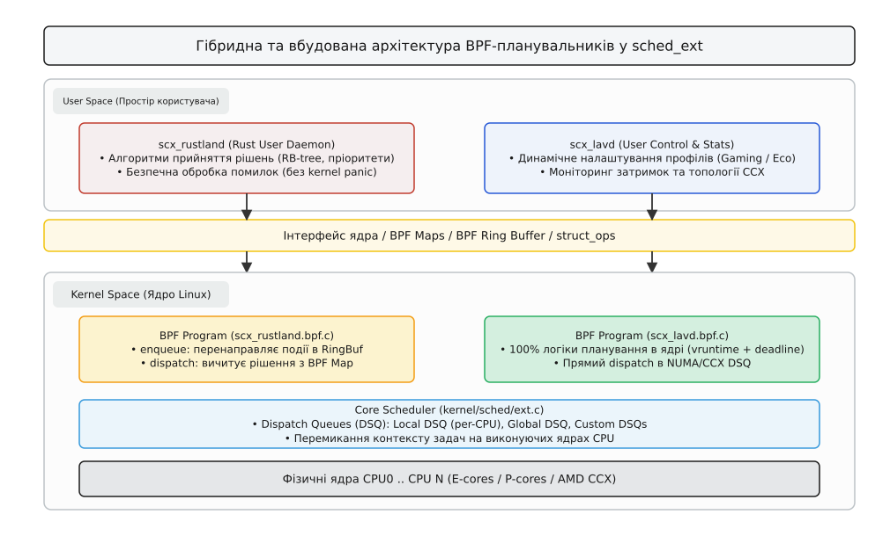
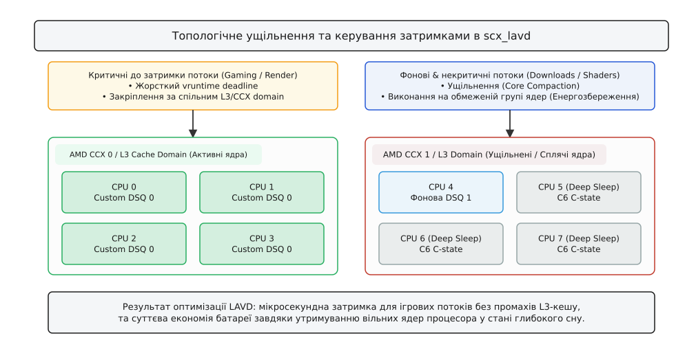

# Практична розробка BPF-планувальників у sched_ext (scx_rustland, scx_lavd)

<preknowlist>
- [Модель планувальника та класи керування CPU](topic:sys-unix/scheduler-model) — розподіл квантів часу, класи SCHED_NORMAL та ієрархія планування в ядрі.
- [Інфраструктура BPF-планувальника sched_ext](topic:sys-unix/sched-ext-ebpf-scheduler) — класи планування SCX, struct_ops та механізм Dispatch Queues (DSQ).
</preknowlist>

Стандартний планувальник ядра Linux (історично CFS, а з версії Linux 6.6 — EEVDF) розроблений як універсальний алгоритм для широкого спектра задач. Він прагне математично справедливо розподілити обчислювальний час процесора між усіма виконуваними потоками. Проте для багатьох спеціалізованих робочих навантажень — таких як ігри на портативних консолях (Steam Deck), сервери баз даних із низькою затримкою або системи високочастотного трейдингу — ця універсальна справедливість стає перешкодою. Ігровий потік втрачає кадри через фонові процеси, а серверні запити відчувають сплески затримок.

Раніше створення власного алгоритму планування вимагало складного написання патчів до ядра, перекомпіляції та ризику викликати паніку ядра (kernel panic). Усе змінилося з появою підсистеми **`sched_ext` (Extensible Scheduler Class)** у Linux 6.12. `sched_ext` дозволяє завантажувати, динамічно налаштовувати та замінювати планувальник процесора прямо під час роботи системи за допомогою програм eBPF.

---

## 1. Архітектурні моделі BPF-планувальників

При розробці BPF-планувальника в `sched_ext` вибирають одну з двох основних моделей:


*Архітектура взаємодії BPF-планувальника з ядром та простором користувача.*

### 1.1. Вбудована модель (In-Kernel eBPF Model)
Вся логіка вибору процесора та черговості виконується усередині BPF-програми у просторі ядра.
- **Особливості**: Забезпечує наносекундну швидкість реакції, але обмежена правилами BPF-верифікатора ядра (заборона складних нескінченних циклів та динамічного виділення пам'яті).
- **Приклад**: Ігровий планувальник `scx_lavd`.

### 1.2. Гібридна модель (Hybrid User-Space Model)
BPF-програма в ядрі слугує лише високошвидкісним мостом подій. При пробудженні задачі BPF відправляє сповіщення через `BPF Ring Buffer` у простір користувача, де демон (написаний на Rust або C++) приймає рішення і записує графік у BPF-карту.
- **Особливості**: Дозволяє використовувати будь-які складні алгоритми та бібліотеки простору користувача, але додає мікросекундну затримку на передачу подій.
- **Приклад**: Планувальник `scx_rustland`.

---

## 2. Базовий механізм робочого циклу та DSQ

Планувальник `sched_ext` чіпляється до ядрових точок через структуру зворотних викликів `struct sched_ext_ops`:

- **`select_cpu`**: Викликається при пробудженні задачі для вибору оптимального процесора.
- **`enqueue`**: Завдання переводиться в стан готовності та розміщується у черзі диспетчеризації `DSQ` (Dispatch Queue).
- **`dispatch`**: Викликається ядром, коли процесор стає вільним і запитує нову задачу для виконання.

### Черги диспетчеризації (Dispatch Queues)
Передача задач між BPF-кодом і ядрами CPU здійснюється через черги DSQ:
1. `SCX_DSQ_LOCAL`: Локальна черга конкретного виконуючого процесора.
2. `SCX_DSQ_GLOBAL`: Спільна черга ядра, з якої може забрати задачу будь-який вільний CPU.
3. `Custom DSQs`: Кастомні черги, створені BPF-програмою для групування задач за L3-кешами чи NUMA-вузлами.

---

## 3. Практичний аналіз: scx_rustland та scx_lavd

### 3.1. Планування у просторі користувача: `scx_rustland`
`scx_rustland` переносить логіку вибору задач у користувацький демон на Rust:
- BPF-програма в ядрі перехоплює події пробудження і відправляє `pid` у кільцевий буфер.
- Демон Rust зберігає задачі у власній черзі, розраховує пріоритети і записує рішення у BPF Map.
- Якщо демон Rust падає, спрацьовує ядровий **watchdog timer**, який автоматично вивантажує BPF-планувальник і повертає систему на стандартний EEVDF без зупинки процесів.

### 3.2. Ігровий планувальник затримок: `scx_lavd`
Планувальник `scx_lavd` розроблений для усунення мікрозатримок в іграх на портативних пристроях (Steam Deck):
- Він обчислює для кожної задачі динамічний віртуальний дедлайн (VD).
- Потоки, які часто блокуються в очікуванні GPU та віддають CPU короткими сплесками, отримують найкоротший дедлайн і витісняють фонові задачі.


*Розподіл ігрових та фонових задач по CCX-доменах і L3-кешу в планувальнику LAVD.*

- **L3-Affinity Packing**: `scx_lavd` групує потоки гри в межах одного CCX-комплексу ядра, зберігаючи L3-кеш гарячим.
- **Core Compaction (Ущільнення ядер)**: Некритичні фонові задачі зганяються на декілька активних ядер, дозволяючи іншим ядрам перейти в стан глибокого сну (`C6`) для збереження батареї.

---

## 4. Гаряча заміна (Hot Swapping) та Безпека

`sched_ext` забезпечує можливість безпечної **гарячої заміни (Hot Swapping)** алгоритму планування на льоту:
1. Запуск нового BPF-планувальника призупиняє надходження нових подій у старий.
2. Невиконані задачі зі старих черг тимчасово повертаються у стандартний EEVDF.
3. Активується нова структура `struct sched_ext_ops`, і процеси продовжують виконання без втрати стану та без перезавантаження системи.

---

## 5. Моніторинг та інспекція в системі

Для перевірки поточного стану та діагностики BPF-планувальників системні адміністратори використовують стандартні системні інструменти:

```bash
# Перевірити активний стан підсистеми sched_ext
cat /sys/kernel/sched_ext/state

# Список завантажених BPF struct_ops програм
bpftool struct_ops list
```

У разі виникнення критичних помилок виконання в BPF-коді (перехоплених верифікатором, викликом `scx_bpf_error()` або спрацюванням watchdog) ядро виводить детальне сповіщення у системний журнал `dmesg`, і підсистема `sched_ext` автоматично повертає процеси під контроль класичного планувальника. Завдяки цьому системний адміністратор може випробовувати експериментальні BPF-планувальники на робочих вузлах без ризику зупинки критичних сервісів чи втрати системних даних.

---

## 6. Підсумки

Підсистема `sched_ext` робить планування процесів у Linux повністю програмованим. Завдяки ізоляції eBPF розробники можуть створювати спеціалізовані планувальники під ігри, веб-сервери чи контейнери без ризику зламати ядро. Це відкриває новий етап в еволюції операційних систем, де алгоритми розподілу часу адаптуються під конкретне навантаження прямо в продакшені.


