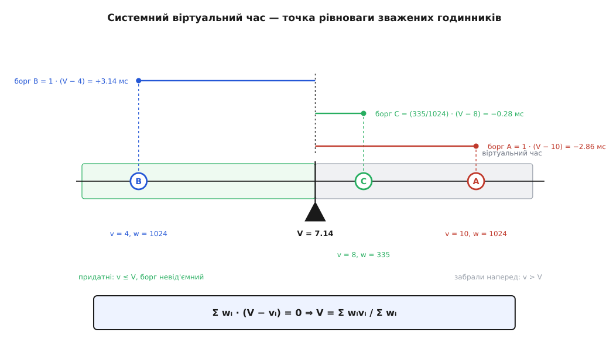
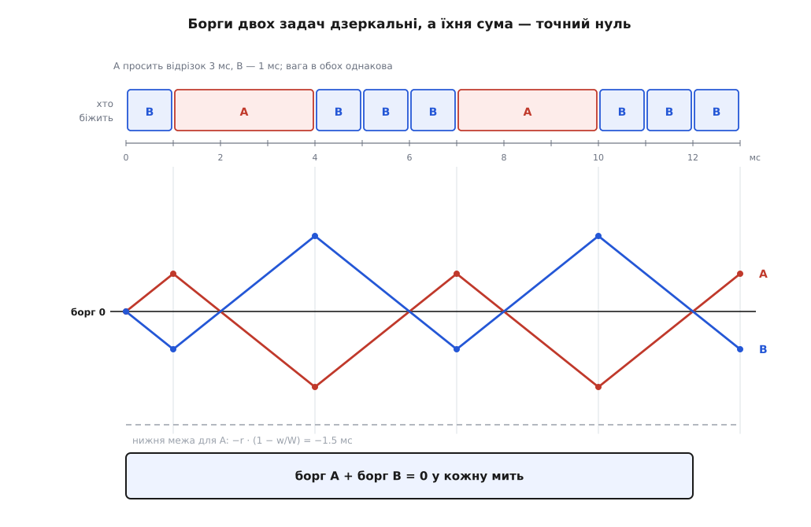

# 🧮 Арифметика віртуального часу: борг, рівновага, придатність

Тут з означень виведено те, на чому тримається облік у чесному класі планувальника Linux: чому рівність віртуальних годинників тотожна нульовому боргу, чому сума боргів усіх задач — точний нуль, звідки береться формула `V = Σwᵢvᵢ / Σwᵢ`, яку ядро обчислює при кожному виборі, і як із самого означення боргу виростають придатність та віртуальний кінцевий строк. Кожен крок перевірено на числах.

## Три величини й одне означення

Домовмося про позначення.

```
R(t)  — множина готових задач у мить t
wᵢ    — вага задачі i
W(t)  = Σ wᵢ по всіх i ∈ R(t)
W₀    = 1024 — вага задачі з nice 0, одиниця масштабу
```

Ідеальна машина видає кожній готовій задачі частку, пропорційну вазі, і робить це безперервно. За нескінченно малий проміжок `dt` задача `i` отримує `(wᵢ/W(t))·dt`. Отже, за проміжок від нуля до `t` їй **належало**:

```
Sᵢ*(t) = ∫₀ᵗ wᵢ / W(τ) dτ
```

Інтеграл тут не прикраса. Частка `wᵢ/W` — не стала: `W` міняється щоразу, коли якась задача прокинулася чи заснула, тобто десятки тисяч разів на секунду. Помножити вагу на час можна лише на ділянці, де склад претендентів незмінний.

Реально спожитий процесорний час позначмо `Sᵢ(t)` — це просто сума тривалостей усіх відрізків, на яких задача займала ядро процесора. Різниця двох величин і є борг:

```
lagᵢ(t) = Sᵢ*(t) − Sᵢ(t)
```

Додатний борг означає «система винна», від'ємний — «задача забрала наперед».

## Годинник, який не доводиться перераховувати

Тримати борг у секундах невигідно: щойно змінилося `W`, доведеться правити `Sᵢ*` усім одразу. Тому ядро зберігає не борг, а особистий годинник `vᵢ`, який іде лише під час виконання й зі швидкістю, оберненою до ваги. За реальний приріст `Δt` він намотує `Δt·W₀/wᵢ`, звідки:

```
vᵢ(t) − vᵢ(0) = Sᵢ(t) · W₀ / wᵢ
Sᵢ(t) = (wᵢ / W₀) · ( vᵢ(t) − vᵢ(0) )
```

Тепер зробімо те саме з «належним». Уведімо системний віртуальний час `V` — годинник черги, який іде так, щоб задача, яка отримує рівно свою частку, крокувала з ним нога в ногу:

```
dV/dt = W₀ / W(t)
```

Підставмо це в інтеграл належного:

```
Sᵢ*(t) = ∫ wᵢ/W(τ) dτ = (wᵢ/W₀) · ∫ W₀/W(τ) dτ = (wᵢ/W₀) · ( V(t) − V(0) )
```

Віднімаємо одне від одного. Якщо задачу поставили в чергу з годинником, зведеним на системний, тобто `vᵢ(0) = V(0)`, обидві константи скорочуються й лишається рядок, на якому стоїть уся конструкція:

```
lagᵢ(t) = (wᵢ / W₀) · ( V(t) − vᵢ(t) )
```

Борг — це відставання власного годинника від системного, помножене на вагу. Саме в такому вигляді означення записане в самому ядрі, у коментарі до обліку боргу в `kernel/sched/fair.c`: `lag_i = S - s_i = w_i*(V - v_i)`.

З цього рядка одразу випливає обіцяне: **рівні годинники означають нульовий борг**. Якщо `vᵢ = V`, права частина нульова, хоч би яка була вага. І навпаки: коли всі годинники йдуть разом, ніхто нікому не винен, а тому `Sᵢ(t) = Sᵢ*(t)`. Поділивши два такі рівняння одне на одне, дістаємо `Sᵢ/Sⱼ = wᵢ/wⱼ`, а просумувавши всі й скориставшись тим, що сума спожитого дорівнює `t`, — частку:

```
Sᵢ(t) / t = wᵢ / W
```

Числова перевірка з таблиці ваг, у якій дві задачі намотали однакові прирости віртуального часу, — окремий випадок цього рівняння.

Друге, що видно з того самого рядка, менш очевидне й важливе для того, як ядро порівнює задачі. **Знак боргу від ваги не залежить**: множник `wᵢ/W₀` завжди додатний, тож `lagᵢ ≥ 0` тоді й лише тоді, коли `vᵢ ≤ V`. А от **величина боргу від ваги залежить**, і порядок задач за боргом не збігається з порядком за годинником. Візьмімо дві задачі при `V = 7.14 мс`: задача з вагою 1024 і годинником 4 мс має борг `1·(7.14 − 4) = 3.14 мс`, а задача з вагою 335 і годинником 3 мс — усього `(335/1024)·(7.14 − 3) = 1.35 мс`. Друга відстала «далі» за віртуальним часом, але винні їй менше.

Тому правило «дати процесор найбільшому кредиторові» й правило «дати тому, чий годинник найменший» — різні правила, і планувальник не користується жодним із них у чистому вигляді. Йому потрібен **лише знак** боргу: задача або має право претендувати, або ні. А знак від ваги вільний — тож у найгарячішому місці ядра не доводиться ані множити на вагу, ані ділити на неї, досить порівняти `vᵢ` з `V`.

## Закон збереження: сума боргів — точний нуль

Просумуймо належне по всіх готових задачах:

```
Σ Sᵢ*(t) = ∫ ( Σ wᵢ ) / W(τ) dτ = ∫ 1 dτ = t
```

Ідеальна машина роздає рівно одну процесоро-секунду за секунду — ні більше, ні менше, бо частки за побудовою складаються в одиницю. Реальна машина роздає стільки ж: поки є хоч одна готова задача, ядро процесора не простоює, а коли готових немає, обидві суми стоять разом. Отже, `Σ Sᵢ(t) = t` теж, і віднімання дає:

```
Σᵢ lagᵢ(t) = 0
```

Борг у планувальнику — гра з нульовою сумою: усе, що одна задача забрала наперед, точно комусь недодали. Найважливіший наслідок звідси стосується придатності. Якби борг усіх задач був від'ємний, сума була б від'ємна — а вона нуль. Тому **множина придатних задач ніколи не буває порожньою**: хоча б одна задача завжди має борг `≥ 0`. Фільтр придатності в EEVDF не може заблокувати всіх — не тому, що так вдало підібрали числа, а тому, що інакше не дозволяє арифметика.

## V — точка рівноваги, а не інтеграл

Підставмо вираз для боргу в закон збереження:

```
Σ (wᵢ/W₀)·(V − vᵢ) = 0
Σ wᵢ·V = Σ wᵢ·vᵢ
V = ( Σ wᵢ·vᵢ ) / ( Σ wᵢ )
```

Системний віртуальний час — **зважене середнє годинників**. Його не треба інтегрувати й не треба вести окремим лічильником: він читається з тих самих чисел, які й так лежать у черзі. Диференційне означення `dV/dt = W₀/W` і ця формула описують ту саму величину, але користуватися зручно другою: вона не має сталої інтегрування, а тому переживає прихід і відхід задач без жодних поправок на історію.

Механічне прочитання формули точне, а не метафоричне. Розкладіть годинники на осі віртуального часу, повісьте в кожній точці масу, рівну вазі задачі, — і `V` буде центром мас цієї системи. Борг задачі — це момент сили: вага, помножена на плече від опори. Рівність `Σ wᵢ(V − vᵢ) = 0` — звичайна умова рівноваги важеля.



*Годинник кожної задачі — точка на осі, її вага — маса в цій точці. Опора стоїть там, де моменти зрівноважені, і це і є V. Ліворуч від опори — задачі з невід'ємним боргом, тобто придатні; праворуч — ті, хто забрав наперед. Легка задача C стоїть майже на цілу мілісекунду правіше за опору — вона забрала наперед; але через малу вагу її перевитрата вдесятеро менша за борг важкої задачі B.*

**Три задачі в одній черзі, годинники в мілісекундах віртуального часу:**

```
задача A: nice 0  → вага 1024,  v = 10
задача B: nice 0  → вага 1024,  v =  4
задача C: nice 5  → вага  335,  v =  8

Σw   = 1024 + 1024 + 335 = 2383
Σwv  = 1024·10 + 1024·4 + 335·8 = 10240 + 4096 + 2680 = 17016
V    = 17016 / 2383 = 7.1406 мс

борг A = (1024/1024)·(7.1406 − 10) = −2.859 мс
борг B = (1024/1024)·(7.1406 −  4) = +3.141 мс
борг C = ( 335/1024)·(7.1406 −  8) = −0.281 мс
сума   = −2.859 + 3.141 − 0.281 = 0.001 ≈ 0  (похибка округлення)
```

Придатна тут лише B; A і C забрали наперед і з розгляду тимчасово випадають.

## Чому ядро рахує це без ділення

Формула зваженого середнього містить ділення, а ділення — найдорожча ціла операція в наборі команд процесора, і виконувати її в кожному виборі під замком черги ніхто не хоче. Ядро тримає дві суми відносно рухомого початку відліку `v₀`, спільної нижньої межі дерева:

```
A = Σ wᵢ·( vᵢ − v₀ )      (у ядрі — avg_vruntime)
L = Σ wᵢ                   (у ядрі — avg_load)
V = v₀ + A / L
```

Обидві суми оновлюються за сталий час: задача стала в чергу — додали `wᵢ(vᵢ − v₀)` і `wᵢ`, вийшла — відняли. Жодного обходу дерева.

Зсув на `v₀` потрібен не для краси. Віртуальний час — беззнаковий 64-бітовий лічильник наносекунд, який лише росте; добутки `wᵢ·vᵢ` виходять за межу знакового 64-бітового накопичувача швидко. Тисяча готових задач вагою 1024 при годинниках порядку 10¹⁴ нс (це трохи більше доби роботи машини) дає суму близько 1.0·10²⁰ проти межі `2⁶³ ≈ 9.2·10¹⁸` — [переповнення](root:sf-lang/overflow-wraparound) неминуче. Різниці ж `vᵢ − v₀` між співіснуючими задачами малі, і сума лишається в діапазоні.

Головна операція — перевірка придатності — після цього обходиться без ділення взагалі:

```
vᵢ ≤ V   ⟺   vᵢ ≤ v₀ + A/L   ⟺   ( vᵢ − v₀ )·L ≤ A
```

Одне множення замість ділення, у найчастішому запиті планувальника. Задачу, яка саме біжить, ядро при цьому додає до обох сум окремо: у дереві її немає, а в рівновазі вона бере участь.

## Що робить із V прихід і відхід задачі

Оскільки `V` — середнє, зміна складу черги його зсуває, і зсув можна порахувати точно. Нехай задача `k` виходить із черги:

```
V' = ( Σwᵢvᵢ − w_k·v_k ) / ( W − w_k )

V' − V = ( W·V − w_k·v_k − V·(W − w_k) ) / ( W − w_k )
       = w_k·( V − v_k ) / ( W − w_k )
```

Знак зсуву — знак боргу задачі, що йде. Хто заснув, недоотримавши, тягне `V` вперед: його непогашений кредит списують, і борги решти від цього зростають. Хто заснув, забравши наперед, тягне `V` назад — його перевитрату перекладають на тих, хто лишився.

Ось чому не можна просто ставити розбуджену задачу на поточне `V`. Задача, яка спалила свій відрізок і одразу заснула, виходить із черги з від'ємним боргом; якщо вертати її з нульовим, кожен цикл «попрацював — заснув» стирає перевитрату за чужий рахунок. Тому ядро запам'ятовує віртуальний борг при виході й відновлює його при поверненні.

Але й відновити його наївно не можна: вставляння самої задачі теж зсуває `V`. Нехай ми хочемо, щоб після вставляння віртуальне відставання дорівнювало `y = V' − vᵢ`. Тоді:

```
V'·( W + wᵢ ) = W·V + wᵢ·vᵢ = W·V + wᵢ·( V' − y )
V'·W = W·V − wᵢ·y
V'   = V − ( wᵢ/W )·y

vᵢ = V' − y = V − y·( W + wᵢ ) / W
```

Ставити треба не на `V − y`, а на `V − y·(W + wᵢ)/W`. Наївне вставляння дає замість `y` лише `y·W/(W + wᵢ)`, тобто **прощає частку `wᵢ/(W + wᵢ)` боргу за кожне пробудження**. Той самий вираз стоїть у коментарі ядра до розміщення задачі: `vl_i = (W + w_i)*vl'_i / W`.

**Скільки саме прощало б:**

```
три задачі з nice 0 у черзі:  W = 3072,  wᵢ = 1024
частка, що зникає за одне пробудження = 1024 / (3072 + 1024) = 25 %

збережене випередження  y = −2.0 мс
правильне місце:  V + 2.0·4096/3072 = V + 2.667 мс
наївне місце:     V + 2.0 мс  →  фактичне випередження 1.5 мс
```

> 🔧 **Навіщо це.** Звідси видно межу того, що дає програмі часте засинання. Поки борг переносять через сон точно, спати вигідно лише тим, що ви справді не витрачаєте процесор: ваш борг росте, поки ви спите, бо `V` іде, а ваш годинник — ні, і після пробудження ви біжите першими. Але «набігати» борг понад свою частку не вийде: він обмежений тим, що ви не спожили. А от помилка в арифметиці переносу коштувала б чесності всієї системи — програма, яка навмисне засинає тисячу разів на секунду, стирала б чверть свого випередження щоразу.

## Строк — це той самий борг, узятий наперед

Задача стає придатною тієї миті, коли `V` наздоганяє її годинник, тобто коли її борг доходить до нуля. Позначмо це значення `e` — воно дорівнює її віртуальному часу в момент придатності. Задача просить відрізок `r` реального часу. Питання: до якого показника ідеального годинника цей відрізок мав би бути виданий?

На ідеальній машині власна порція задачі росте пропорційно ходові `V` з коефіцієнтом `wᵢ/W₀`. Прирівняймо її до запитаного:

```
( wᵢ/W₀ )·( d − e ) = r
d = e + r · W₀ / wᵢ
```

Це і є віртуальний кінцевий строк: **показник системного годинника, до якого ідеальна машина встигла б віддати запитане**. У ядрі рядок виглядає буквально так само: `se->deadline = se->vruntime + calc_delta_fair(se->slice, se)`, де перетворення `calc_delta_fair` множить реальний час на `W₀/w`. Серед придатних обирають найменший `d` — тобто застосовують [EDF-планування](root:sf-os/edf-scheduling) на віртуальній осі.

Тепер переведімо строк у реальний час і подивімося, чим власне керує `r`. Оскільки `dV/dt = W₀/W`, віртуальному проміжку `Δ` відповідає реальний `Δ·W/W₀`:

```
T = ( r·W₀/wᵢ ) · ( W/W₀ ) = r · W / wᵢ = r / sᵢ ,   де sᵢ = wᵢ/W — частка
```

Дві осі розділилися остаточно, і це видно з формул, а не з опису. Частка `sᵢ = wᵢ/W` не містить `r` взагалі. Проміжок між обслуговуваннями `T = r/sᵢ` містить `r` лінійно. Отже, `r` не може вплинути на частку, а зменшення `r` удвічі рівно вдвічі скорочує проміжок і вдвічі збільшує кількість обслуговувань за секунду, яка дорівнює `sᵢ/r`.

**Задача з часткою 10 % при різному запитаному відрізку:**

```
r = 3 мс    → T = 3 / 0.1   = 30 мс між обслуговуваннями
r = 0.3 мс  → T = 0.3 / 0.1 =  3 мс
частка в обох випадках — ті самі 10 %
```

## Один цикл до останньої цифри

Перевірмо все відразу на найпростішому досліді, який ще можна прорахувати рукою. Дві задачі з `nice 0`: вага в обох `1024 = W₀`, тож віртуальний час кожної йде нарівно з реальним, поки вона біжить. Разом `W = 2048`, а `V = (v_A + v_B)/2`. Задача A просить відрізок 3 мс, задача B — 1 мс. Обидві стартують із нульовими годинниками.

```
мить, мс   v_A   v_B    V     борг A   борг B   придатні   строки A/B   біжить
   0        0     0    0.0     0.0      0.0      A, B         3 / 1        B
   1        0     1    0.5    +0.5     −0.5      A            3 / 2        A
   4        3     1    2.0    −1.0     +1.0      B            6 / 2        B
   5        3     2    2.5    −0.5     +0.5      B            6 / 3        B
   6        3     3    3.0     0.0      0.0      A, B         6 / 4        B
   7        3     4    3.5    +0.5     −0.5      A            6 / 5        A
  10        6     4    5.0    −1.0     +1.0      B            9 / 5        B
  13        6     7    6.5    +0.5     −0.5      A            9 / 8        A
```

Стан у мить 13 — точна копія стану в мить 7 зі зсувом на 6 мс реального й 3 мс віртуального часу. Отже, картина періодична з періодом 6 мс, і в кожному періоді: A отримує один відрізок 3 мс, B — три відрізки по 1 мс. Частки — рівно по 50 %, як і обіцяють однакові ваги. Кількість обслуговувань збігається з формулою `sᵢ/r`: у A це `0.5/3` — одне за 6 мс, у B `0.5/1` — три за 6 мс.

Найцікавіший рядок — мить 6. Обидві задачі придатні, борг в обох рівно нуль, ваги однакові — і жодне міркування про частку тут вибору не робить. Вибір робить строк: у B він 4, у A — 6, бо B попросила менше. Це та єдина мить у циклі, коли друга вісь справді працює; в усіх інших рядках вибір визначає придатність.



*Угорі — хто біжить: один довгий відрізок A проти трьох коротких B. Унизу — борги обох, у мілісекундах. Поки задача чекає, її борг росте зі швидкістю w/W = 0.5; поки біжить, спадає зі швидкістю 1 − w/W = 0.5. Ламані дзеркальні, бо сума боргів — нуль, і жодна не виходить за межу, порахована нижче.*

Одну річ у цій таблиці варто прочитати чесно: три відрізки B йдуть підряд, а не чергуються з A. Причина проста — весь проміжок від 4 до 7 мс задача A непридатна, і черга просто не має кому передати процесор. Формула `T = r/sᵢ` обмежує середній проміжок і кількість обслуговувань, а не рівномірність їхнього розсіювання; коли претендентів більше двох, коротковідрізкова задача справді вклинюється між чужими відрізками.

## Наскільки далеко борг може відійти

Лишилося порахувати ширину коридору, у якому арифметика тримає борг. Обидві межі виводяться з того, що вже доведено.

**Знизу.** Задача сідає на процесор лише придатною, тобто з боргом `≥ 0`. Поки вона біжить проміжок `τ`, ідеальна машина додає їй `(wᵢ/W)·τ`, а реальна знімає `τ`:

```
Δlag = ( wᵢ/W )·τ − τ = −τ·( 1 − wᵢ/W )
```

За один відрізок `τ ≤ rᵢ`, а поки задача не біжить, її борг лише росте. Отже, у будь-яку мить:

```
lagᵢ ≥ −rᵢ·( 1 − wᵢ/W )
```

Перевірка на таблиці циклу: для A межа `−3·0.5 = −1.5 мс`, найглибший фактичний борг `−1.0 мс`; для B межа `−1·0.5 = −0.5 мс`, і фактичний мінімум рівно `−0.5 мс` — межа досягається.

**Згори.** Тут працює закон збереження. Борг однієї задачі дорівнює мінус сумі всіх інших, а кожен доданок у тій сумі обмежений знизу щойно виведеною нерівністю:

```
lagᵢ = −Σ_{j≠i} lagⱼ ≤ Σ_{j≠i} rⱼ·( 1 − wⱼ/W )
```

**Сорок однакових задач із відрізком 3 мс на одному ядрі:**

```
частка кожної  w/W = 1/40

нижня межа:  −3·(39/40)      = −2.93 мс
верхня межа:  39·3·(39/40)   = 114.1 мс
```

Нижня межа тісна, верхня — груба: вона припускає, що всі тридцять дев'ять сусідів одночасно перебувають у найгіршому для себе стані, чого статися не може. Точніша оцінка — уже теорема з початкової праці про EEVDF: за неперервних запитів отримане задачею обслуговування ніколи не відхиляється від належного більш ніж на один найбільший квант. Алгоритм описали 1995 року Іон Стойка (румунський, згодом американський інформатик, тоді аспірант) і його науковий керівник Хусейн Абдель-Вахаб у технічному звіті TR-95-22 Університету Олд-Домініон; у ядро Linux він прийшов через двадцять вісім років, у версії 6.6.

Обидві межі кажуть про одне й те саме різними словами. Обіцянка «жодна задача не залишиться без часу» в цій системі не декларація й не наслідок доброї евристики: борг має скінченний коридор, а борг — це рівно те, скільки процесорного часу вам недодали. Ширина коридору не залежить ані від пріоритетів, ані від того, хто саме зараз біжить, — її задає сума чужих відрізків. Тому найгірше очікування росте з кількістю готових задач, а не з їхньою вагою; і саме тому окрема ручка довжини відрізка, яка в цю суму входить, важить для затримки більше, ніж будь-яке значення `nice`.
