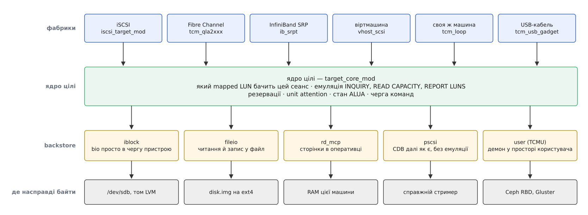
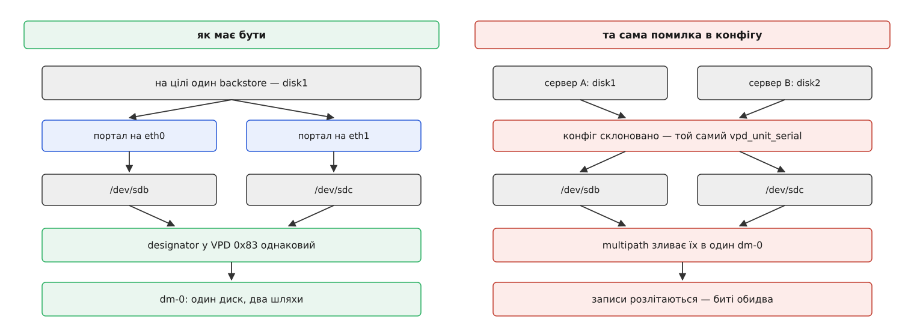
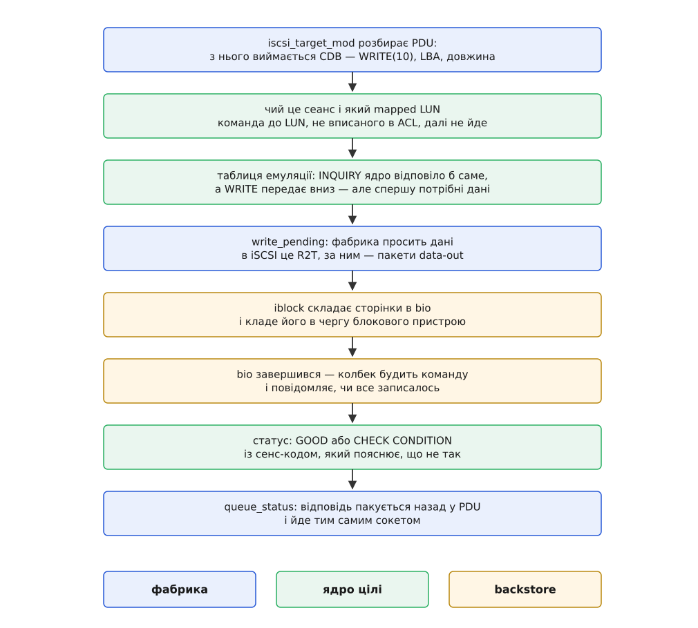

# Ціль SCSI в ядрі (LIO): як машина віддає своє сховище

<preknowlist>
- [Підсистема SCSI: команди, сенс-коди й обробка помилок](topic:sys-unix/scsi-subsystem) — команда їде в дескрипторному блоці CDB, відповідь — це статус плюс сенс-код; хто такий ініціатор і що таке LUN.
- [Блоковий пристрій: сектори, блоки й черга запитів](topic:sys-unix/block-device-model) — `bio` як одиниця вводу-виводу й те, що диск не знає нічого, крім номерів секторів.
- [Файл пристрою: символьний і блоковий](topic:sys-unix/device-file-model) — за вузлом `/dev/sdb` стоїть драйвер, а не безпосередньо залізо.
- [configfs: об'єкти ядра, які створює простір користувача](topic:sys-unix/configfs) — тут `mkdir` не показує наявне, а породжує в ядрі новий об'єкт.
- [Модулі ядра: завантаження, параметри, залежності](topic:sys-unix/kernel-modules) — підсистему довантажують у працююче ядро окремими шматками.
- [Multipath: кілька шляхів до одного сховища](topic:sys-unix/dm-multipath) — як хост доходить висновку, що два вузли `/dev/sd*` ведуть до одного диска.
- [Буферизований і прямий ввід-вивід](topic:sys-unix/buffered-and-direct-io) — коли байти осідають у сторінковому кеші, а коли йдуть повз нього.
</preknowlist>

У стійці двадцять машин, і в жодній немає диска. Вони завантажуються, у кожній `lsblk` чесно показує двохсотгігабайтний `/dev/sda` з файловою системою, туди пишуться логи й бази. Усі двадцять дисків насправді стоять в одній коробці двома юнітами нижче.

Питання тут не в тому, як переслати байти мережею — це вміє будь-який файловий сервер. Питання гостріше: **чому двадцять ядер Linux щиро переконані, що диск у них є?** Драйвер `sd` не має жодного сумніву; він створив вузол, дізнався ємність, віддав чергу файловій системі. Його не обманювали — з ним просто розмовляли так, як розмовляє диск.

## Диском робить не залізо, а відповіді

Придивимось, що взагалі відбувається між драйвером і диском. Драйвер ніколи не торкається пластин чи комірок. Він складає невеликий пакет байтів — дескрипторний блок команди — і віддає його вниз, а назад отримує дані та статус. `INQUIRY` — «хто ти, якого ти типу, чий виробник». `READ CAPACITY` — «скільки в тебе блоків і якого вони розміру». `READ(10)`, `WRITE(10)` — «дай десять блоків від такого номера», «прийми ці».

І це весь контакт із залізом. Диск не має способу довести, що він диск, окрім як відповісти на ці запитання правильно. А отже, симетрично: **будь-що, що відповідає правильно, для драйвера і є диском** — без застережень, без «майже». Тут немає обману, бо немає й іншої істини: сама шина визначає пристрій через його відповіді.

Звідси випливає вся тема. «Віддати своє сховище» означає рівно одне — поставити на своєму боці програму, яка приймає CDB і відповідає на них. Бік, що питає, називають ініціатором (лат. *initiare* — починати); бік, що відповідає, — **ціллю** (англ. *target*). У Linux ціль живе в ядрі й зветься LIO, за іменем проєкту linux-iscsi.org, звідки її код прийшов у ядро в 2011 році, витіснивши двох конкурентів; [ця історія варта окремої розмови](topic:sys-unix/scsi-target-lio/hist-target-in-mainline.md) — бо в ядро потрапила не єдина й не очевидно найкраща реалізація, а та, за якою вистояли супроводжувачі підсистеми SCSI.

Чому в ядрі, а не звичайним демоном? Бо байти, які ціль віддає, уже в ядрі: вони в сторінковому кеші або за чергою блокового пристрою. Демон у просторі користувача мусив би витягти їх до себе, а потім віддати назад ядру для відправки в сокет — дві зайві копії й дві зайві зміни контексту на кожну команду. Ціль у ядрі бере сторінку з кешу й кладе її в сокет, не переносячи нікуди.

## Команди окремо, дріт окремо

Тепер найважливіше конструкційне рішення, і воно не з ядра, а зі стандарту. Архітектурна модель SCSI навмисне розділяє **набір команд** — що означає `WRITE(10)` і які на неї бувають відповіді — і **транспорт**, яким ці байти доїхали. Команда однакова, приїхала вона по мідному шлейфу, по оптиці Fibre Channel, у TCP-пакеті чи через чергу дескрипторів у пам'яті гіпервізора.

Якби ціль була написана як «сервер iSCSI», то Fibre Channel потребував би другої цілі, а віртуальна машина — третьої, і кожна тримала б власну, трохи іншу емуляцію `INQUIRY`. Тому LIO збудована як пісочний годинник. Посередині — ядро цілі, `target_core_mod`: воно знає SCSI й не знає жодного дроту. Згори до нього приєднуються **фабрики** — модулі транспорту. Знизу — **backstore**, тобто те, де насправді лежать байти.



*Транспорт і сховище змінні з обох боків, а логіка SCSI посередині — одна на всіх. Додати нову фабрику означає навчити ядро цілі новому способу доставки, а не написати ще одну ціль.*

Фабрика не розуміє SCSI: вона дістає CDB із того, що приїхало, і віддає ядру. Ядро не бачить дроту: воно просить фабрику «прийми в мене дані» або «віддай статус» через кілька зворотних викликів. Ця межа тонка навмисно — саме тому проста фабрика на кшталт `tcm_loop` уміщується в пару тисяч рядків, а не тягне за собою окремий проєкт.

## Що під низом: звідки беруться байти

Ядро цілі не зберігає нічого. Коли команда справді про дані, вона йде вниз, у backstore, і вибір backstore визначає і швидкість, і — що важливіше — гарантії.

**iblock** віддає команду блоковому пристрою: сторінки складаються в `bio` і йдуть у чергу `/dev/sdb` чи тому LVM. Копій немає, а разом із даними наскрізь проходять і властивості пристрою — скидання кешу, `FUA`, а `UNMAP` перетворюється на справжній `discard`. Це варіант для справжніх дисків.

**fileio** працює через файл: звичайні читання й записи у файл на змонтованій файловій системі. Так одним рядком віддають образ, вирощений `truncate`, — зручно, гнучко, дешево на місце. Ціною є зайвий шар файлової системи й те, що за замовчуванням запис лягає у сторінковий кеш цілі.

**rd_mcp** тримає блоки просто в оперативці — цим міряють, скільки коштує сама емуляція, коли сховище не гальмує. **pscsi** не емулює нічого: CDB їде далі в справжній пристрій, як приїхав. Так віддають стример або зміню́вач касет, де набір команд ширший за дисковий і будь-яка емуляція була б брехнею; це той самий наскрізний шлях, яким локально ходить [SG_IO](topic:sys-unix/scsi-generic-passthrough), тільки команда приходить не від сусідньої програми, а по дроту. Нарешті **user**, він же TCMU: команда виїжджає в демон простору користувача через спільне кільце в пам'яті, і той відповідає, звідки хоче — з Ceph, з Gluster, зі свого формату. Ідея та сама, що й у [блокових пристроїв із простору користувача](topic:sys-unix/userspace-block-devices), тільки межу проведено не на рівні блоків, а на рівні команд SCSI.

Тепер про гарантії, і тут ховається найдорожча помилка. Серед відповідей `MODE SENSE` є біт WCE — «у мене ввімкнений кеш запису». Ініціатор читає його й будує свою поведінку: якщо кеш є, файлова система на його боці при кожному `fsync()` шле `SYNCHRONIZE CACHE` і чекає, поки ціль підтвердить. Якщо ж WCE каже «кешу немає», ініціатор має право вважати, що підтверджений запис уже на носії, — і `SYNCHRONIZE CACHE` не слати взагалі.

Звідси проста й безжальна причинність. Backstore fileio за замовчуванням складає записи у сторінковий кеш цілі. Якщо при цьому оголосити WCE=0, ініціатор перестане просити скидання — а дані лежатимуть у чужій оперативці, і вимкнення живлення забере підтверджені записи разом із журналом файлової системи. Ціль не має права оголошувати кращі гарантії, ніж дає її backstore: або чесно кажемо про кеш і виконуємо скидання, або відкриваємо файл прямим вводом-виводом і тоді маємо право сказати WCE=0. Те саме питання [довговічності записаного](topic:sys-unix/page-cache-durability) виникає на кожній машині, просто тут ціна помилки помножена на кількість ініціаторів.

> 🔧 **Навіщо це.** Дивна повільність цілі найчастіше пояснюється саме цією парою. Ввімкнули WCE — ініціатор шле `SYNCHRONIZE CACHE` на кожен коміт журналу, і кожен такий виклик чесно чекає на реальний диск. Вимкнули — швидкість підскочила, а разом із нею тихо зникла гарантія. Правильна відповідь не в бітах, а в backstore: iblock над пристроєм з батарейним кешем контролера дає і швидкість, і чесність.

## Ким прикидається пристрій

Драйвер `sd` розпитує не лише про ємність. У відповідях на `INQUIRY` є сторінка життєво важливих даних 0x83 — набір ідентифікаторів пристрою, і саме за нею хост вирішує, з чим має справу.

Причина, чому це не формальність, така. Один LUN зазвичай доступний кількома шляхами: два мережеві порти цілі, два контролери, дві незалежні мережі. Кожен шлях народить у хості окремий вузол — `/dev/sdb`, `/dev/sdc`. Щоб зрозуміти, що це один диск, а не два, хост не має інших даних, крім цих ідентифікаторів: збіглися — то один пристрій, і його можна зібрати в один `dm-`пристрій із перемиканням шляхів.

Симетрія цього правила жорстока. Якщо два **різні** LUN випадково віддадуть однаковий ідентифікатор — а це стається, коли конфігурацію цілі скопіювали з машини на машину, — хост так само впевнено зіллє їх в один, і записи почнуть розлітатися між двома різними сховищами.



*Ліворуч ідентифікатори збігаються законно — це справді один LUN. Праворуч вони збіглися через склонований конфіг, і жодна перевірка на боці хоста цього не спіймає: він бачить рівно те, що йому сказали.*

У configfs ідентифікатор — це файл `wwn/vpd_unit_serial` у теці backstore. Ціль генерує його з випадкового UUID при створенні, і змінити його можна лише поки на пристрій не послався жоден LUN — тобто поки лічильник експорту нульовий. Правило звідси одне: конфігурацію цілей не клонують, її створюють наново на кожній машині.

## Конфігурація, якої ще немає

Тепер про те, як цим керують, і чому спосіб керування виглядає незвично.

Звичний шлях налаштувати щось у ядрі — знайти готовий каталог у `/sys` і записати число в атрибут. Але тут нема чого знаходити: ціль, її портал, її LUN, її список дозволених ініціаторів — усього цього в ядрі не існує, поки адміністратор не скаже, що воно має бути. Потрібен не «покажи й дай підправити», а «створи об'єкт, якого нема». Саме для цього зроблено configfs: тут `mkdir` — не запис у файлову систему, а конструктор об'єкта ядра, а `rmdir` — його знищення.

Тому конфігурація цілі буквально є деревом каталогів.

```
modprobe target_core_mod
modprobe iscsi_target_mod
mount -t configfs none /sys/kernel/config
cd /sys/kernel/config/target

# сховище: файл на 1 ГіБ як backstore fileio
mkdir -p core/fileio_0/disk1
echo "fd_dev_name=/srv/disk1.img,fd_dev_size=1073741824" > core/fileio_0/disk1/control
echo 1 > core/fileio_0/disk1/enable

# ціль iSCSI, її група портів і один портал
mkdir -p iscsi/iqn.2026-08.org.example:store/tpgt_1/np/0.0.0.0:3260
cd iscsi/iqn.2026-08.org.example:store/tpgt_1

# LUN 0 — це посилання на backstore
mkdir lun/lun_0
ln -s /sys/kernel/config/target/core/fileio_0/disk1 lun/lun_0/store

# кому саме віддаємо: ACL на конкретного ініціатора
mkdir -p acls/iqn.2026-08.org.example:client/lun_0
ln -s /sys/kernel/config/target/iscsi/iqn.2026-08.org.example:store/tpgt_1/lun/lun_0 \
      acls/iqn.2026-08.org.example:client/lun_0/mapped

echo 1 > enable
```

Ці десять рядків руками ніхто не пише — для цього є `targetcli`, оболонка з деревом і автодоповненням. Але корисно бачити, що вона робить: ніякого прихованого стану немає, увесь конфіг цілі — це каталоги й символьні посилання, а зберегти його означає обійти дерево й записати у файл. [Повне дерево з атрибутами](topic:sys-unix/scsi-target-lio/api-configfs-target.md) велике, проте його логіка вся тут.

Варто зупинитися на двох речах. Посилання `lun/lun_0/store` — це і є прив'язка номера до сховища: один backstore можна виставити під різними номерами в різних цілях, і це буде той самий пристрій. А тека `acls/` вирішує, **хто** взагалі побачить цей LUN: ініціатор називає себе рядком IQN, і якщо для цього рядка немає запису, він отримає порожній `REPORT LUNS`. Захист це слабенький — IQN ініціатор просто оголошує сам, тож ACL захищає від помилки, а не від зловмисника. Від зловмисника рятує CHAP і, головне, ізольована мережа; [iSCSI](topic:sys-unix/iscsi-in-linux) віддає сирі блоки, і той, хто до них дістався, обходить усі права всередині файлової системи.

## Шлях однієї команди

Складімо все докупи й проведімо один запис від сокета до пластини.



*Дані рухаються не одним поштовхом: спершу приїжджає команда, і лише коли ядро цілі готове прийняти байти, фабрика просить їх у ініціатора.*

Найцікавіший тут четвертий крок. Ініціатор не шле дані разом із командою — інакше ціль мусила б приймати їх, ще не знаючи, чи є куди класти. Спершу приїжджає сама команда, ядро перевіряє права й готує буфери, і аж тоді фабрика каже ініціаторові «шли»; в iSCSI це окреме повідомлення R2T (*ready to transfer*). Тому ціль, у якої скінчилася пам'ять під буфери, не втрачає дані — вона просто ще не попросила їх.

**Що робить ядро цілі з номером блоку.** Візьмімо `WRITE(10)` з LBA 0x00012345 і довжиною 8 блоків для backstore fileio з розміром блоку 512 байтів:

```
LBA        = 0x00012345 = 74565
offset     = 74565 · 512 = 38177280 байтів
довжина    = 8 · 512     = 4096 байтів
```

Ті самі байти команди при розмірі блоку 4096 означали б інше місце:

```
offset     = 74565 · 4096 = 305418240 байтів
```

Тому `block_size` виставляють одразу після ввімкнення пристрою — до першого посилання з LUN — і ніколи не міняють під працюючим ініціатором: у CDB немає одиниць виміру, є лише номер, і його значення цілком тримається на тому, про що домовилися при `READ CAPACITY`.

## Чому ціль пам'ятає більше, ніж «прочитати й записати»

Якби ціль лише читала й писала, вона була б тонкою. Складність приходить із того, що один LUN віддають кільком машинам одразу.

Кластер, у якому два вузли бачать спільний диск, мусить уміти сказати «цей вузол більше не пише». Домовитися між собою вони не можуть — саме тому, що зв'язок між ними й міг обірватися. Отже, арбітром має бути той, кого обидва бачать: сам диск. У SCSI для цього є [постійні резервації](topic:sys-unix/scsi-persistent-reservations): вузол реєструє на LUN свій ключ, тримає резервацію, а той, хто вижив, витісняє ключ мовчазного сусіда — і команди від витісненого починають повертати відмову. Так вузол відрізають від даних, навіть якщо він живий і впевнений у своїй правоті.

Ці резервації веде саме ядро цілі, і причина знову в пісочному годиннику. Стан резервації мусить бути єдиним для LUN, а не для транспорту: коли один вузол прийшов по Fibre Channel, а другий по iSCSI, дві незалежні реалізації в двох фабриках дали б двом вузлам по резервації на той самий диск.

З тієї ж потреби ростуть ще дві речі. Unit attention — це спосіб цілі повідомити решті сеансів, що світ змінився: ємність збільшили, резервацію витіснили, пристрій скинули. Наступна команда кожного, хто ще не в курсі, повернеться з відмовою й поясненням, і ініціатор перепитає. А ALUA дозволяє цілі сказати, який шлях зараз кращий, — саме на ці підказки й спирається [multipath](topic:sys-unix/dm-multipath), вибираючи, куди слати наступну команду.

## Ціль без жодного дроту

Наостанок — річ, від якої вся конструкція виглядає інакше. Фабрика зовсім не зобов'язана бути мережею.

`tcm_loop` створює всередині тієї самої машини віртуальний контролер SCSI, і LUN цілі з'являється тут-таки як `/dev/sdX`. Файл, який ви щойно віддали через fileio, повертається до вас повноцінним диском SCSI — не так, як [loop-пристрій](topic:sys-unix/loop-device), що просто перекладає блоки у файл, а з повною емуляцією команд, резервацій і сенс-кодів. Це найдешевший спосіб перевірити емуляцію, і водночас те, чим користуються, коли гіпервізорові треба віддати гостю справжній пристрій SCSI.

`vhost_scsi` іде далі: команди гостя потрапляють у ядро цілі просто [віртчергою](topic:sys-unix/virtio-transport), не проходячи через процес гіпервізора в просторі користувача. А `tcm_usb_gadget` віддає те саме сховище USB-кабелем — [машина в ролі пристрою](topic:sys-unix/usb-gadget) вмикається в ноутбук і виглядає як зовнішній диск.

Тож коло замикається. Питання, з якого все почалося, — чому чуже сховище виглядає як диск — має відповідь без жодної містики: диск є не річчю, а контрактом, і його тримає той, хто відповідає на команди. Із цим контрактом у руках Linux однаково легко стає і по один його бік, і по другий, а дріт між ними перетворюється на змінну деталь. [Зібрати таку ціль руками й побачити свій файл диском](topic:sys-unix/scsi-target-lio/proj-target-by-hand.md) — справа десяти хвилин на будь-якій машині, і жодного заліза для цього не потрібно.
