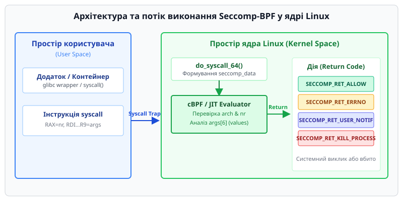

# Фільтрація системних викликів Seccomp-BPF

<preknowlist>
- [Користувачі, групи й ідентичність процесу](topic:sys-unix/uid-gid-identity-model) — як процес несе UID/GID і перевіряється в системі.
- [Права доступу та привілеї POSIX Capabilities](topic:sys-unix/capabilities) — розбиття повноважень root на біти, зокрема `CAP_SYS_ADMIN` та `CAP_SYS_PTRACE`.
- [Простори імен користувачів User Namespaces](topic:sys-unix/user-namespaces-uid-mapping) — механізм ізоляції UID/GID, що дає непривілейованому процесу змогу завантажувати фільтри без прав root.
</preknowlist>

## 1. Механізм ізоляції системних викликів на межі користувача та ядра

Коли мережевий демон, веб-сервер або процес рендерингу веб-браузера компрометується внаслідок уразливості керування пам'яттю (переповнення буфера на купі, use-after-free, out-of-bounds write), зловмисник отримує можливість виконувати довільний машинний код у контексті цього процесу. Навіть якщо традиційній дискреційній моделі прав (DAC) та бітам привілеїв POSIX Capabilities вдалося обмежити доступ до файлової системи, процес усе одно залишається здатен здійснювати будь-які із понад 300 системних викликів ядра Linux. Серед них — виклики створення нових процесів (`execve`), завантаження ядерних модулів (`finit_module`), маніпуляції просторами імен (`unshare`), підключення до мережі (`socket`) або взаємодії з асинхронним I/O (`io_uring_setup`). Таблиця системних викликів є глобальною поверхнею атаки (attack surface) ядра Linux.

Механізм **Seccomp** (Secure Computing Mode) вирішує цю проблему, перетворюючи межу переходу між простором користувача та простором ядра з відчинених дверей на контрольований шлюз. Розташовуючись безпосередньо у точці перехоплення викликів (наприклад, у векторній обробці `do_syscall_64` та `syscall_trace_enter()` для архітектури x86_64), seccomp перевіряє номер системного виклику та його аргументи ще до того, як ядро передасть управління відповідній підсистемі VFS, мережі чи управління пам'яттю.


*Послідовність перевірки системного виклику: від входу в ядро через BPF-акселератор до вибору дії.*

На відміну від модулів обов'язкового контролю доступу LSM (SELinux, AppArmor), які визначають *хто* робить дію над сутністю системного об'єкта (файлу чи сокета), seccomp визначає, *які саме двері вхідних точок ядра* взагалі відкриті для поточного процесу.

> 🔧 **Навіщо це.** Принцип найменших привілеїв (Principle of Least Privilege) вимагає обмежувати не лише права доступу до файлів, але й самі інструменти взаємодії з ядром. Якщо додаток займається виключно розбором зображень або математичними обчисленнями, йому не потрібні системні виклики `fork`, `execve` або `connect`. Заблокувавши їх через seccomp, розробник унеможливлює експлуатацію zero-day вразливостей у цих підсистемах ядра.

## 2. Еволюція від Strict Mode до BPF Filter Mode

Історично seccomp пройшов розвиток від жорсткого механізму з фіксованими правилами до гнучкої системи програмованої фільтрації. Детальніше про передумови створення та ключові фігури цього процесу можна прочитати в [історії розвитку Seccomp](topic:sys-unix/seccomp-profiles-and-tooling/hist-seccomp-evolution.md).

### 2.1 SECCOMP_MODE_STRICT

Початковий режим `SECCOMP_MODE_STRICT` дозволяв процесу здійснювати виключно чотири системні виклики: `read`, `write`, `_exit` та `rt_sigreturn`. Спроба здійснити будь-який інший виклик призводила до негайного знищення процесу ядром за допомогою сигналу `SIGKILL`.

Активація режиму виконувалася за допомогою виклику `prctl`:

:::tabs
```c
#include <stdio.h>
#include <unistd.h>
#include <sys/prctl.h>
#include <linux/seccomp.h>

int main(void) {
    // Вмикаємо строгий режим Seccomp
    if (prctl(PR_SET_SECCOMP, SECCOMP_MODE_STRICT) == -1) {
        perror("prctl(PR_SET_SECCOMP)");
        return 1;
    }

    // Запис у stdout дозволений (fd 1)
    write(STDOUT_FILENO, "Strict Mode активний\n", 29);

    // Спроба викликати getpid() призведе до SIGKILL від ядра
    getpid();

    return 0;
}
```
```cpp
#include <iostream>
#include <unistd.h>
#include <sys/prctl.h>
#include <linux/seccomp.h>
#include <system_error>
#include <string_view>

int main() {
    if (prctl(PR_SET_SECCOMP, SECCOMP_MODE_STRICT) == -1) {
        std::cerr << "Не вдалося увімкнути SECCOMP_MODE_STRICT: "
                  << std::generic_category().message(errno) << '\n';
        return 1;
    }

    constexpr std::string_view msg = "Strict Mode активний\n";
    write(STDOUT_FILENO, msg.data(), msg.size());

    // getpid() призводить до завершення SIGKILL
    ::getpid();

    return 0;
}
```
:::

Хоча strict mode гарантував абсолютну ізоляцію, він виявився непридатним для більшості реальних програм, оскільки навіть банальне виділення пам'яті (`brk`/`mmap`) або створення нових потоків було заблоковано.

### 2.2 SECCOMP_MODE_FILTER та прапорець PR_SET_NO_NEW_PRIVS

Сучасний режим `SECCOMP_MODE_FILTER` дозволяє процесу завантажувати програму Classic BPF (cBPF), яка аналізує кожен виклик і приймає індивідуальне рішення.

Перед завантаженням фільтра непривілейованим процесом ядро вимагає обов'язкового встановлення прапорця `PR_SET_NO_NEW_PRIVS`:

:::tabs
```c
#include <sys/prctl.h>
#include <stdio.h>

// Встановлення прапорця заборони підвищення привілеїв
if (prctl(PR_SET_NO_NEW_PRIVS, 1, 0, 0, 0) == -1) {
    perror("prctl(PR_SET_NO_NEW_PRIVS)");
}
```
```cpp
#include <sys/prctl.h>
#include <system_error>
#include <iostream>

// C++ обгортка перевірки NO_NEW_PRIVS
bool ensure_no_new_privs() noexcept {
    return ::prctl(PR_SET_NO_NEW_PRIVS, 1, 0, 0, 0) == 0;
}
```
:::

Без цього прапорця непривілейований процес міг би завантажити seccomp-фільтр, а потім виконати привілейовану програму із встановленим бітом `setuid` (наприклад, `/usr/bin/sudo` або `/usr/bin/passwd`). Фільтр міг би перехопити та підмінити виклики перевірки автентифікації у `sudo`, змусивши його повернути `0` (успіх), що дозволило б звичайному користувачу отримати права `root`. Прапорець `PR_SET_NO_NEW_PRIVS` гарантує, що жоден подальший виклик `execve` не зможе підвищити привілеї процесу через `setuid`, `setgid` або файлові capabilities.

## 3. Структура `seccomp_data` та обмеження перевірки за значеннями

При здійсненні системного виклику ядро формує в пам'яті структуру `seccomp_data` і передає її як вхідний "пакет" у BPF-програму. Структура визначена в заголовочному файлі `<linux/seccomp.h>`:

```c
struct seccomp_data {
    int   nr;                   /* Номер системного виклику */
    __u32 arch;                 /* Архітектура процесора (AUDIT_ARCH_*) */
    __u64 instruction_pointer;  /* Вказівник на інструкцію в користувацькому просторі */
    __u64 args[6];              /* 64-бітні аргументи системного виклику */
};
```

Детальний функціонал полів:
1. `nr` — номер системного виклику у таблиці ядра. Важливо: номер системного виклику залежить від архітектури. Наприклад, виклик `read` на `x86_64` має номер 0, тоді як на `arm64` — 63.
2. `arch` — константа архітектури з заголовочного файлу `<linux/audit.h>` (наприклад, `AUDIT_ARCH_X86_64` або `AUDIT_ARCH_I386`). Перевірка `arch` є **критичною вимогою безпеки**. Якщо 64-бітна система підтримує виконання 32-бітних бінарників через шар сумісності, зловмисник може зробити 32-бітний системний виклик. Якщо фільтр перевіряє лише `nr`, ті самі номери в 32-бітній таблиці відповідатимуть зовсім іншим викликам, що призведе до повного обходу (bypass) захисту.
3. `instruction_pointer` — адреса пам'яті у просторі користувача, з якої було виконано інструкцію `syscall` або `int 0x80`.
4. `args[6]` — масив із шести 64-бітних аргументів, які передавалися в регістрах процесора (наприклад, `rdi`, `rsi`, `rdx`, `r10`, `r8`, `r9` на x86_64).

### Чому seccomp перевіряє тільки значення (pass-by-value)

Seccomp-BPF здатний аналізувати лише ті аргументи, які передаються безпосередньо у регістрах (числові прапорці, дескриптори файлів, розміри буферів, маски прав). Seccomp **не розіменовує вказівники на пам'ять** у просторі користувача (наприклад, ім'я файлу `const char *filename` у виклику `openat`).

Це обмеження є свідомим архітектурним рішенням для запобігання уразливостям типу **TOCTOU (Time-of-Check to Time-of-Use)**:

```
[Потік 1 (Додаток)]                    [Ядро / Seccomp]
1. Формує шлях "/tmp/safe.txt"
2. Робить syscall openat() ------------> 3. Seccomp розіменовує шлях: "/tmp/safe.txt" (OK)
[Потік 2 (Зловмисник)]                   4. Seccomp повертає ALLOW
5. Змінює пам'ять на "/etc/shadow" ----> 6. Ядро виконує openat() над "/etc/shadow"!
```

Оскільки пам'ять процесу користувача є асинхронно доступною для інших потоків того самого процесу, вміст пам'яті за вказівником може змінитися відразу після того, як BPF-програма його перевірить, але до того, як ядро скопіює його у свій внутрішній буфер. Тому через seccomp неможливо створити правило "дозволити `openat` лише для файлу `/etc/app.conf`".

## 4. Класичний BPF (cBPF) та компіляція в ядрі

Фільтр seccomp конструюється у вигляді масиву інструкцій Classic BPF (`struct sock_filter`). Віртуальна машина cBPF оперує 32-бітним регістром-акумулятором `A`, індексним регістром `X` та масивом пам'яті.

При виконанні у сучасному ядрі байт-код cBPF автоматично транслюється внутрішнім JIT-компілятором ядра (Just-In-Time) у машинні інструкції процесора (x86_64, arm64), що забезпечує виконання перевірки за наносекунди.

:::tabs
```c
#include <linux/filter.h>

// Окремий елемент інструкції BPF має розмір 8 байт
struct sock_filter {
    __u16 code;  /* Код операції (Opcode) */
    __u8  jt;    /* Зміщення переходу при TRUE (Jump True) */
    __u8  jf;    /* Зміщення переходу при FALSE (Jump False) */
    __u32 k;     /* Операнд / Константа / Зміщення в структурі */
};
```
```cpp
#include <linux/filter.h>
#include <cstdint>

namespace sys {

// Представлення BPF інструкції для C++20
struct BpfInstruction {
    uint16_t code;
    uint8_t  jt;
    uint8_t  jf;
    uint32_t k;

    constexpr explicit operator ::sock_filter() const noexcept {
        return ::sock_filter{ code, jt, jf, k };
    }
};

} // namespace sys
```
:::

Для створення програм використовуються макроси `BPF_STMT` (проста інструкція) та `BPF_JUMP` (умовний перехід):

:::tabs
```c
#include <stdio.h>
#include <stdlib.h>
#include <stddef.h>
#include <unistd.h>
#include <sys/prctl.h>
#include <sys/syscall.h>
#include <linux/audit.h>
#include <linux/filter.h>
#include <linux/seccomp.h>

#define syscall_nr (offsetof(struct seccomp_data, nr))
#define arch_nr (offsetof(struct seccomp_data, arch))

int install_minimal_cbpf_filter(void) {
    // 1. Встановлюємо NO_NEW_PRIVS
    if (prctl(PR_SET_NO_NEW_PRIVS, 1, 0, 0, 0) == -1) {
        perror("prctl(PR_SET_NO_NEW_PRIVS)");
        return -1;
    }

    // 2. Формуємо масив BPF інструкцій
    struct sock_filter filter[] = {
        // [0] A = seccomp_data.arch
        BPF_STMT(BPF_LD | BPF_W | BPF_ABS, arch_nr),

        // [1] якщо arch == AUDIT_ARCH_X86_64, перейти до [2] (jt=0), інакше до [8] (jf=6 -> KILL)
        BPF_JUMP(BPF_JMP | BPF_JEQ | BPF_K, AUDIT_ARCH_X86_64, 0, 6),

        // [2] A = seccomp_data.nr
        BPF_STMT(BPF_LD | BPF_W | BPF_ABS, syscall_nr),

        // Перевірка білого списку викликів
        BPF_JUMP(BPF_JMP | BPF_JEQ | BPF_K, __NR_read, 3, 0),
        BPF_JUMP(BPF_JMP | BPF_JEQ | BPF_K, __NR_write, 2, 0),
        BPF_JUMP(BPF_JMP | BPF_JEQ | BPF_K, __NR_exit_group, 1, 0),
        BPF_JUMP(BPF_JMP | BPF_JEQ | BPF_K, __NR_exit, 0, 1),

        // [7] Дозволити системний виклик
        BPF_STMT(BPF_RET | BPF_K, SECCOMP_RET_ALLOW),

        // [8] Заблокувати та вбити процес
        BPF_STMT(BPF_RET | BPF_K, SECCOMP_RET_KILL_PROCESS)
    };

    struct sock_fprog prog = {
        .len = (unsigned short)(sizeof(filter) / sizeof(filter[0])),
        .filter = filter,
    };

    // 3. Завантажуємо фільтр
    if (prctl(PR_SET_SECCOMP, SECCOMP_MODE_FILTER, &prog) == -1) {
        perror("prctl(SECCOMP_MODE_FILTER)");
        return -1;
    }

    return 0;
}
```
```cpp
#include <iostream>
#include <vector>
#include <cstddef>
#include <system_error>
#include <unistd.h>
#include <sys/prctl.h>
#include <sys/syscall.h>
#include <linux/audit.h>
#include <linux/filter.h>
#include <linux/seccomp.h>

#define syscall_nr (offsetof(struct seccomp_data, nr))
#define arch_nr (offsetof(struct seccomp_data, arch))

bool install_minimal_cbpf_filter_cpp() {
    if (prctl(PR_SET_NO_NEW_PRIVS, 1, 0, 0, 0) == -1) {
        std::cerr << "Не вдалося встановити PR_SET_NO_NEW_PRIVS\n";
        return false;
    }

    const std::vector<sock_filter> filter = {
        BPF_STMT(BPF_LD | BPF_W | BPF_ABS, arch_nr),
        BPF_JUMP(BPF_JMP | BPF_JEQ | BPF_K, AUDIT_ARCH_X86_64, 0, 6),

        BPF_STMT(BPF_LD | BPF_W | BPF_ABS, syscall_nr),
        BPF_JUMP(BPF_JMP | BPF_JEQ | BPF_K, __NR_read, 3, 0),
        BPF_JUMP(BPF_JMP | BPF_JEQ | BPF_K, __NR_write, 2, 0),
        BPF_JUMP(BPF_JMP | BPF_JEQ | BPF_K, __NR_exit_group, 1, 0),
        BPF_JUMP(BPF_JMP | BPF_JEQ | BPF_K, __NR_exit, 0, 1),

        BPF_STMT(BPF_RET | BPF_K, SECCOMP_RET_ALLOW),
        BPF_STMT(BPF_RET | BPF_K, SECCOMP_RET_KILL_PROCESS)
    };

    const sock_fprog prog = {
        .len = static_cast<unsigned short>(filter.size()),
        .filter = const_cast<sock_filter*>(filter.data()),
    };

    if (prctl(PR_SET_SECCOMP, SECCOMP_MODE_FILTER, &prog) == -1) {
        std::cerr << "Не вдалося завантажити SECCOMP_MODE_FILTER\n";
        return false;
    }

    return true;
}
```
:::

## 5. Семантика дій повернення (Return Values) та правила пріоритету

Результатом виконання BPF-програми є 32-бітне значення. Найстарші 16 біт (`SECCOMP_RET_ACTION_FULL`) визначають кодову дію ядра, а наймолодші 16 біт (`SECCOMP_RET_DATA`) можуть містити користувацькі дані (наприклад, код помилки `errno`).

Таблиця можливих дій (у порядку спадання суворості):

| Код дії | Версія ядра / дані | Семантика та поведінка ядра |
| :--- | :--- | :--- |
| `SECCOMP_RET_KILL_PROCESS` | Linux 4.14+ | Негайно знищує весь процес та всі його потоки. Процес завершується з сигналом `SIGSYS`. |
| `SECCOMP_RET_KILL_THREAD` | Усі версії | Знищує лише той потік (thread), який виконав недозволений системний виклик. |
| `SECCOMP_RET_TRAP` | Усі версії | Ядро надсилає потоку сигнал `SIGSYS`. Процес може перехопити його обробником сигналів. |
| `SECCOMP_RET_ERRNO` | `SECCOMP_RET_DATA` (errno) | Блокує системний виклик і негайно повертає значення `-1`, встановлюючи `errno` у вказаний код. |
| `SECCOMP_RET_USER_NOTIF` | Linux 5.0+ | Блокує потік та передає сповіщення супервізору у просторі користувача через файловий дескриптор. |
| `SECCOMP_RET_TRACE` | Усі версії | Сповіщає трасувальник `ptrace` (`PTRACE_O_TRACESECCOMP`). Якщо трасувальника немає, повертає `ENOSYS`. |
| `SECCOMP_RET_LOG` | Linux 4.14+ | Дозволяє системний виклик, але примусово записує інформацію про нього в системний audit-лог. |
| `SECCOMP_RET_ALLOW` | Усі версії | Передає системний виклик на стандартне виконання ядра без обмежень. |

### Пріоритет об'єднання декількох фільтрів (Filter Stacking)

Якщо процес або його батьківські процеси викликали `prctl(PR_SET_SECCOMP)` декілька разів, у ядрі формується ланцюжок фільтрів. При кожному системному виклику виконуються **усі** фільтри в ланцюжку. 

Ядро обчислює результат кожного фільтра та застосовує дію з **найвищим пріоритетом суворості**. Наприклад, якщо перший фільтр повертає `SECCOMP_RET_ALLOW`, а другий — `SECCOMP_RET_ERRNO` з кодом `EPERM`, виклик буде заблоковано і він поверне `EPERM`. Додавання нових фільтрів може лише звузити права процесу, але ніколи не може розширити їх.

## 6. Перехоплення у просторі користувача: `SECCOMP_RET_USER_NOTIF`

Дія `SECCOMP_RET_USER_NOTIF` (додана в Linux 5.0) дозволяє реалізувати емуляцію системних викликів у просторі користувача. Це вирішує обмеження seccomp щодо неможливості розіменування вказівників.

Схема роботи:
1. Контейнер (дочірній процес) намагається виконати виклик (наприклад, `mknod` або `mount`).
2. BPF-фільтр повертає `SECCOMP_RET_USER_NOTIF`. Потік контейнера занурюється у сон.
3. Менеджер контейнерів (супервізор) отримує сповіщення через файловий дескриптор `seccomp_unotify` за допомогою `ioctl(SECCOMP_IOCTL_NOTIF_RECV)`.
4. Супервізор читає пам'ять контейнера через файлову систему `/proc/[PID]/mem`, перевіряє аргументи (наприклад, шлях файлу), виконує необхідну дію від свого імені та відправляє відповідь ядру через `ioctl(SECCOMP_IOCTL_NOTIF_SEND)`.
5. Контейнер розблоковується і отримує результат, ніби системний виклик був виконаний ядром.

Для детального ознайомлення із викликом `seccomp(2)` та структурою `seccomp_notif` зверніться до [довідника інтерфейсу seccomp](topic:sys-unix/seccomp-profiles-and-tooling/api-seccomp-syscall.md).

## 7. Бібліотека `libseccomp` та системний виклик `seccomp(2)`

Написання сирих cBPF інструкцій вручну є трудомістким і схильним до помилок процесом. Бібліотека `libseccomp` абстрагує розрахунки інструкцій та архітектурні відмінності.

Приклад використання `libseccomp` для побудови безпечного контексту:

:::tabs
```c
#include <stdio.h>
#include <stdlib.h>
#include <seccomp.h>
#include <unistd.h>

int apply_libseccomp_policy(void) {
    // 1. Створюємо контекст з дією за замовчуванням KILL_PROCESS.
    // Увага: SCMP_ACT_KILL у libseccomp — синонім SCMP_ACT_KILL_THREAD, він убив би лише потік
    scmp_filter_ctx ctx = seccomp_init(SCMP_ACT_KILL_PROCESS);
    if (!ctx) return -1;

    // 2. Додаємо виклики у білий список
    if (seccomp_rule_add(ctx, SCMP_ACT_ALLOW, SCMP_SYS(read), 0) < 0) goto err;
    if (seccomp_rule_add(ctx, SCMP_ACT_ALLOW, SCMP_SYS(write), 0) < 0) goto err;
    if (seccomp_rule_add(ctx, SCMP_ACT_ALLOW, SCMP_SYS(exit_group), 0) < 0) goto err;

    // 3. Завантажуємо фільтр у ядро
    if (seccomp_load(ctx) < 0) goto err;

    seccomp_release(ctx);
    return 0;

err:
    seccomp_release(ctx);
    return -1;
}
```
```cpp
#include <iostream>
#include <memory>
#include <seccomp.h>
#include <unistd.h>

namespace sandbox {

struct SeccompDeleter {
    void operator()(scmp_filter_ctx ctx) const noexcept {
        if (ctx) seccomp_release(ctx);
    }
};

using ScmpContext = std::unique_ptr<void, SeccompDeleter>;

bool apply_libseccomp_policy_cpp() {
    ScmpContext ctx(seccomp_init(SCMP_ACT_KILL_PROCESS));
    if (!ctx) return false;

    const int allowed[] = { SCMP_SYS(read), SCMP_SYS(write), SCMP_SYS(exit_group) };
    for (int sys_nr : allowed) {
        if (seccomp_rule_add(ctx.get(), SCMP_ACT_ALLOW, sys_nr, 0) < 0) {
            return false;
        }
    }

    return seccomp_load(ctx.get()) >= 0;
}

} // namespace sandbox
```
:::

Повний приклад практичного проекту із розгортанням пісочниці та RAII-обгортками наведено у [практичному проекті інкапсуляції Seccomp](topic:sys-unix/seccomp-profiles-and-tooling/proj-custom-seccomp.md).

## 8. Застосування в контейнерних екосистемах (Docker та Kubernetes)

У контейнерних середовищах seccomp слугує першою лінією оборони ядра хост-системи. Оскільки всі контейнери поділяють одне ядро, уразливість у рідко вживаному системному виклику дозволила б процесові в контейнері виконати втечу (container escape).

Стандартний профіль Docker Seccomp блокує близько 44 системних викликів із ~300+, повертаючи `EPERM`:
- `kexec_load`, `reboot` — заборона перезавантаження ядра або завантаження нового ядра.
- `finit_module`, `delete_module` — заборона завантаження ядерних модулів.
- `swapon`, `swapoff` — заборона управління підкачкою пам'яті.
- `acct` — заборона вмикання обліку процесів (process accounting).
- `open_by_handle_at` — заборона діставатися файлів за хендлом в обхід дерева монтування контейнера.

Приклад конфігурації JSON-профілю seccomp у Docker/OCI:

```json
{
  "defaultAction": "SCMP_ACT_ERRNO",
  "architectures": [
    "SCMP_ARCH_X86_64",
    "SCMP_ARCH_AARCH64"
  ],
  "syscalls": [
    {
      "names": [
        "read",
        "write",
        "futex",
        "epoll_wait",
        "exit_group"
      ],
      "action": "SCMP_ACT_ALLOW"
    }
  ]
}
```

Запуск контейнера із застосуванням користувацького профілю:

```bash
docker run --rm -it --security-opt seccomp=/etc/docker/seccomp-strict.json my-app:latest
```

## 9. Продуктивність, оптимізація та аудит

Виконання BPF-фільтра додає накладні витрати (overhead) до кожного системного виклику. Для високонавантажених сервісів з інтенсивним мережевим або файловим I/O це може додавати від 1% до 5% додаткового часу виконання.

Рекомендації з оптимізації BPF-фільтрів:
1. **Розміщення найчастіших викликів на початку**: Перевірка `read`, `write`, `epoll_wait` повинна виконуватися першими інструкціями JIT-коду.
2. **Побудова бінарних дерев пошуку**: Бібліотека `libseccomp` (від версії 2.4) уміє перетворити лінійний список на дерево двійкового пошуку за номером виклику, знижуючи складність перевірки з `O(N)` до `O(log N)`. Це не поведінка за замовчуванням — рівень оптимізації вмикають явно: `seccomp_attr_set(ctx, SCMP_FLTATR_CTL_OPTIMIZE, 2)`.

### Аудит та інспекція стану процесів

Перевірити статус підсистеми Seccomp для будь-якого процесу можна через `/proc`:

```bash
grep Seccomp /proc/1234/status
```

Повертатиме:
- `Seccomp: 0` — вимкнено (disabled).
- `Seccomp: 1` — строгий режим (strict mode).
- `Seccomp: 2` — режим фільтрації BPF (filter mode).

Якщо дія фільтра була встановлена у `SECCOMP_RET_LOG`, події блокування записуються у системний журнал аудиту `/var/log/audit/audit.log`:

```
type=SECCOMP msg=audit(1670000000.123:45): auid=1000 uid=1000 pid=4321 comm="worker" exe="/usr/bin/worker" sig=0 arch=c000003e syscall=59 compat=0 ip=0x7ffff7a00000 code=0x7ffc0000
```
Запис показує, що процес `worker` зробив системний виклик `syscall=59` (`execve`) на архітектурі `arch=c000003e` (`x86_64`). Поле `code=0x7ffc0000` — це `SECCOMP_RET_LOG`: виклик пропущено й лише зафіксовано, а `sig=0` підтверджує, що сигналу не надсилали.
