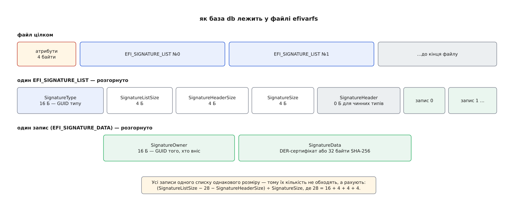

# 📋 Довідник: змінні, формати й команди Secure Boot

Уся поверхня механізму — це десяток іменованих змінних у пам'яті плати, один двійковий формат списку підписів і три родини утиліт. Тут зібрано саме її: що як зветься, з чого складається байт за байтом, якою командою до цього дістатися і що означає кожна відмова.

## Змінні і їхні простори імен

Ім'я змінної унікальне лише в парі з GUID постачальника — це простір імен, а не прикраса. Просторів тут три.

| змінна | простір імен | вміст | атрибути |
|---|---|---|---|
| `SecureBoot` | глобальний `8be4df61-93ca-11d2-aa0d-00e098032b8c` | 1 байт: `1` — перевірка чинна | `0x06`, лише читання |
| `SetupMode` | глобальний | 1 байт: `1` — PK немає, бази приймають без підпису | `0x06`, лише читання |
| `AuditMode`, `DeployedMode` | глобальний | по 1 байту; режими з UEFI 2.5 для випробувань і «замкненої» машини | `0x06` |
| `VendorKeys` | глобальний | 1 байт: `0` — бази вже правив хтось, крім виробника | `0x06` |
| `SignatureSupport` | глобальний | масив GUID типів підпису, які прошивка вміє перевіряти | `0x06` |
| `PK` | глобальний | список підписів рівно з одним сертифікатом X.509 | `0x27` |
| `KEK` | глобальний | список сертифікатів, яким дозволено правити `db` і `dbx` | `0x27` |
| `db`, `dbx` | бази образів `d719b2cb-3d3a-4596-a3bc-dad00e67656f` | дозволені й заборонені сертифікати та хеші | `0x27` |
| `dbt`, `dbr` | бази образів | позначки часу й ключі для відновлення ОС; на масових машинах порожні | `0x27` |
| `MokList`, `MokListX`, `MokListTrusted`, `SbatLevel`, `MokSBState` | shim `605dab50-e046-4300-abb6-3dd810dd8b23` | списки й прапорці, якими завідує shim, а не прошивка | `0x03` |

Перші два рядки варто прочитати уважніше за решту. `SecureBoot` і `SetupMode` доступні **лише на читання**: прошивка виставляє їх сама на початку кожного завантаження й ніякого значення ззовні не приймає. Тому вимкнути перевірку записом у змінну неможливо — скільки б прав не мав той, хто пише. І `SetupMode` показує не окремий вимикач, а наслідок: він стає `1` рівно тоді, коли `PK` порожній.

Простір імен — теж не декорація. `db` у просторі баз образів і гіпотетичний `db` у глобальному просторі були б двома різними змінними, які нічого не знають одна про одну. Тому кожна утиліта подає разом із назвою і GUID, а у файлових іменах він стоїть суфіксом.

## efivarfs: чотири байти атрибутів попереду

Змінні видно як файли в [псевдофайловій системі](topic:sys-unix/pseudo-filesystems) `efivarfs`, змонтованій на `/sys/firmware/efi/efivars`. Ім'я файлу — `<Назва>-<GUID>`, а перші **чотири байти вмісту — це не дані, а атрибути** (UINT32, молодшим байтом уперед).

```sh
$ hexdump -C /sys/firmware/efi/efivars/SecureBoot-8be4df61-93ca-11d2-aa0d-00e098032b8c
00000000  06 00 00 00 01                                    |.....|
#         ^^^^^^^^^^^ ^^ значення: 1 — перевірка чинна
#         атрибути 0x06 = BOOTSERVICE_ACCESS | RUNTIME_ACCESS
```

| біт | назва | що означає |
|---|---|---|
| `0x01` | `NON_VOLATILE` | переживає вимкнення живлення |
| `0x02` | `BOOTSERVICE_ACCESS` | видима до передачі керування ОС |
| `0x04` | `RUNTIME_ACCESS` | видима вже запущеній системі — саме тому змінна взагалі є в `efivarfs` |
| `0x08` | `HARDWARE_ERROR_RECORD` | запис про апаратну помилку |
| `0x10` | `AUTHENTICATED_WRITE_ACCESS` | застаріле: захист лічильником замість часу |
| `0x20` | `TIME_BASED_AUTHENTICATED_WRITE_ACCESS` | запис лише підписаним пакетом із позначкою часу |
| `0x40` | `APPEND_WRITE` | дописати до наявного вмісту, а не замінити його |

Правила запису жорсткі: увесь новий вміст мусить піти **одним** викликом `write()`, атрибути в ньому повторюють чинні, а буфер, що складається лише з чотирьох байтів атрибутів, **видаляє** змінну. Менше чотирьох байтів або невідомий біт — `EINVAL`. До того ж ядро позначає ознакою незмінності все, чого немає в його короткому списку відомих змінних, — а `PK`, `KEK`, `db`, `dbx` у тому списку відсутні, тож прямому запису передує `chattr -i`.

> 🔧 **Навіщо це.** Чотирибайтова шапка — найчастіша причина зіпсованої змінної. Довжина файлу, яку показує `ls`, на чотири байти більша за справжній розмір даних; `cmp` двох баз, знятих різними способами, розійдеться з першого байта; а `cat` збереженого списку підписів назад у файл запише список **як атрибути** і зіпсує змінну. Тому знімати вміст для розбору треба або через `efi-readvar -o`, або відрізаючи шапку явно: `tail -c +5`.

## Формат бази: EFI_SIGNATURE_LIST

Вміст `PK`, `KEK`, `db`, `dbx` і `MokList` — та сама структура: послідовність списків, у кожному однорідні записи однакового розміру.

```c
typedef struct {
    EFI_GUID  SignatureType;        // 16 Б — що саме тут лежить
    UINT32    SignatureListSize;    // увесь список разом із цим заголовком
    UINT32    SignatureHeaderSize;  // 0 для всіх чинних типів
    UINT32    SignatureSize;        // розмір ОДНОГО запису
 // UINT8     SignatureHeader[SignatureHeaderSize];
 // EFI_SIGNATURE_DATA Signatures[];
} EFI_SIGNATURE_LIST;

typedef struct {
    EFI_GUID  SignatureOwner;       // 16 Б — хто вніс цей запис
    UINT8     SignatureData[];      // сертифікат DER або хеш
} EFI_SIGNATURE_DATA;
```



*Оскільки `SignatureSize` однаковий у межах списку, кількість записів рахують діленням, а не проходом по ланцюжку.*

| `SignatureType` | GUID | `SignatureSize` |
|---|---|---|
| `EFI_CERT_X509_GUID` | `a5c059a1-94e4-4aa7-87b5-ab155c2bf072` | 16 + довжина сертифіката в DER |
| `EFI_CERT_SHA256_GUID` | `c1c41626-504c-4092-aca9-41f936934328` | 48 = 16 + 32 |
| `EFI_CERT_X509_SHA256_GUID` | `3bd2a492-96c0-4079-b420-fcf98ef103ed` | 64 = 16 + 32 (хеш тіла сертифіката) + 16 (`EFI_TIME` відкликання) |
| `EFI_CERT_RSA2048_GUID` | `3c5766e8-269c-4e34-aa14-ed776e85b3b6` | 16 + 256 (голий відкритий ключ, майже не вживається) |

**Приклад: офіційне оновлення dbx для x86-64 (`DBXUpdate.bin`, гілка `main` сховища `microsoft/secureboot_objects`).** Корисне навантаження — один список:

```
SignatureType       = c1c41626-…  (SHA-256)
SignatureListSize   = 21292
SignatureHeaderSize = 0
SignatureSize       = 48
записів = (21292 − 28 − 0) ÷ 48 = 443,   де 28 = 16 + 4 + 4 + 4
SignatureOwner усіх записів = 77fa9abd-0359-4d32-bd60-28f4e78f784b
```

Тобто 443 заборонені образи важать 21 кБ — і всі вони позначені одним власником.

`SignatureOwner` варто розуміти правильно: прошивка на нього при перевірці **не дивиться зовсім**. Це поле для людей та інструментів — мітка «хто вніс цей запис», за якою потім вибирають, що видаляти. Звідси й практика ставити власний випадковий GUID на всі свої записи: інакше свій ключ від чужого в базі не відрізниш.

Фіксований `SignatureSize` має ще один наслідок. Список читають не як ланцюжок, а як масив, тож пошук по `dbx` коштує лінійного проходу, а сам `dbx` росте рівно на 48 байтів за кожен заборонений образ — це і є та арифметика, через яку заборона за хешем упирається в розмір пам'яті плати.

## Пакет оновлення: файл .auth

Змінна з атрибутом `0x20` приймає не голий список підписів, а пакет із заголовком розпізнавання:

```
EFI_TIME                    TimeStamp     16 Б; Pad1, Nanosecond, TimeZone,
                                          Daylight, Pad2 мусять бути нулями
WIN_CERTIFICATE_UEFI_GUID   AuthInfo      dwLength · wRevision = 0x0200 ·
                                          wCertificateType = 0x0EF1 ·
                                          CertType = 4aafd29d-… (PKCS#7) ·
                                          підпис PKCS#7 у DER
EFI_SIGNATURE_LIST[]        корисне навантаження
```

Підписують не сам список, а склейку `Назва || GUID постачальника || Атрибути || TimeStamp || Дані`. Через це пакет прив'язаний до однієї конкретної змінної: те, що підписали для `db`, у `dbx` уже не приймуть. Позначка часу мусить бути **строго пізнішою** за збережену, інакше прошивка вважає це повтором старого пакета й відповідає `EFI_SECURITY_VIOLATION`. При `APPEND_WRITE` перевірку часу пропускають — саме тому в офіційних оновленнях `dbx` роками стоїть та сама дата, 6 березня 2010 року. Про сам підпис і ланцюг сертифікатів — [окрема тема](topic:sf-security/public-key-crypto).

## Команди: читати й правити змінні

| команда | що робить |
|---|---|
| `efi-readvar [-v <змінна>] [-s <список>[-<запис>]] [-o <файл>]` | друкує вміст баз, розгортаючи X.509 і хеші; `-o` зберігає сирі списки у файл |
| `efi-updatevar [-a] [-e] [-c <cert>\|-f <файл>\|-b <образ>] [-k <ключ>] [-g <guid>] [-d <список>] <змінна>` | пише через `efivarfs`; `-a` — дописати, `-e` — сирий список без підпису (лише в режимі налаштування), `-b` — внести хеш готового `.efi` |
| `cert-to-efi-sig-list [-g <guid>] <cert.crt> <out.esl>` | обгортає один сертифікат PEM у список підписів |
| `sign-efi-sig-list [-a] [-t <час>] -c <cert> -k <key> <змінна> <in.esl> <out.auth>` | робить із списку підписаний пакет; `<змінна>` входить у підписану склейку, тому назву треба вказувати правильно |

Читання дає готовий розбір, а не сирі байти:

```
$ efi-readvar -v db
Variable db, length 3719
db: List 0, type X509
    Signature 0, size 1533, owner 77fa9abd-0359-4d32-bd60-28f4e78f784b
        Subject:
            C=US, O=Microsoft Corporation, CN=Microsoft Windows Production PCA 2011
db: List 1, type SHA256
    Signature 0, size 48, owner …
        Hash:0c51d7906fc4931…
```

`size` тут — це `SignatureSize`, тобто разом із шістнадцятьма байтами `SignatureOwner`. Для типу `SHA256` він завжди рівно 48; якщо бачите інше число — ви дивитеся не на той тип запису.

```sh
# режим налаштування: свій ключ платформи з нуля
$ openssl req -new -x509 -newkey rsa:2048 -nodes -days 3650 \
      -subj "/CN=my platform key/" -keyout PK.key -out PK.crt
$ cert-to-efi-sig-list -g "$(uuidgen)" PK.crt PK.esl
$ sign-efi-sig-list -c PK.crt -k PK.key PK PK.esl PK.auth
# chattr -i /sys/firmware/efi/efivars/PK-8be4df61-93ca-11d2-aa0d-00e098032b8c
# efi-updatevar -f PK.auth PK        # звідси машина в режимі користувача
```

## Команди: підпис і перевірка PE

| команда | що робить |
|---|---|
| `sbsign --key <key> --cert <cert> [--output <файл>] [--detached] <образ.efi>` | вставляє підпис Authenticode в сам файл; типовий вихід — `<образ>.signed` |
| `sbverify --list <образ.efi>` · `sbverify --cert <cert> <образ.efi>` | показати наявні підписи · звірити з конкретним сертифікатом |
| `sbattach --detach <sig> [--remove] <образ>` · `--attach <sig> <образ>` | зняти або приклеїти таблицю підписів окремо від файлу |
| `pesign -i <in> -o <out> -s -c <нікнейм> [-n <база NSS>]` | те саме через сховище ключів NSS, а не файли PEM; `-S` показує підписи, `-r` знімає, `-h` рахує хеш образу |

Ключова властивість: підписом накривають не весь файл, тож той самий двійковий образ можна підписати кількома ключами по черзі, не перезбираючи.

Вибір між двома родинами утиліт — це вибір, де живе таємний ключ. `sbsign` бере його простим файлом PEM: зручно на своїй машині, де ключ і так лежить поруч. `pesign` натомість звертається до сховища NSS і вміє працювати з ключем, який фізично не покидає апаратного носія, — саме тому ним підписують у дистрибутивах, де ключ ніхто не має права скопіювати. Формат підпису на виході однаковий, тож `sbverify` перевіряє й те, що підписав `pesign`.

## Списки shim: mokutil

Змінні shim читають не з `efivarfs` — shim перекладає їх у таблицю конфігурації, яку ядро показує в `/sys/firmware/efi/mok-variables/`.

| ключ | дія |
|---|---|
| `--sb-state` | `SecureBoot enabled` / `disabled`, окремо `SecureBoot validation is disabled in shim` і `Platform is in Setup Mode` |
| `--import <cert.der>` | подати заявку на внесення ключа; спитає одноразовий пароль, сам ключ внесе MokManager при наступному завантаженні |
| `--delete <cert.der>` · `--revoke-import` | заявка на видалення · скасувати ще не виконану заявку |
| `--list-enrolled` · `--list-new` · `--list-delete` | що вже внесено · що чекає внесення · що чекає видалення |
| `--import-hash <hash>` · `--delete-hash <hash>` | те саме для окремого хеша замість сертифіката |
| `--mokx` | усі дії — над списком заборон `MokListX`, а не над `MokList` |
| `--disable-validation` · `--enable-validation` | вимкнути й повернути перевірку **всередині shim**, не чіпаючи прошивку (`MokSBState`) |
| `--set-sbat-policy latest\|previous\|delete` | керує `SbatPolicy` — чи підтягувати свіжий рубіж поколінь у `SbatLevel` |
| `--trust-mok` · `--untrust-mok` | чи вважати ключі з MOK придатними для перевірки [підписів модулів](topic:sys-unix/kernel-modules) (`MokListTrusted`) |

Кожна змінна shim існує парою: `MokList` — енергонезалежна й доступна лише до старту ОС, `MokListRT` — її копія, віддана вже запущеній системі. Розділення тут не формальне. Права на запис у `MokList` нема ні в кого, крім самого shim, а видима система бачить лише копію, зміна якої нічого не означає, — тож жодна команда з-під root не додає ключ безпосередньо. `mokutil --import` кладе **заявку** в окрему змінну й на цьому зупиняється; ключ вносить MokManager при наступному завантаженні, спитавши одноразовий пароль з фізичної клавіатури.

Окремо стоїть `SbatLevel`: єдина зі змінних тут, яка не є списком підписів, а містить звичайний текст із комами — по рядку на компонент.

```
sbat,1,2021030218
shim,4
grub,3
```

Перший рядок називає сам формат і його дату, решта — рубежі: назва компонента й найменше покоління, яке ще приймають. Порівняння числове, тож `grub,3` відкидає всі збірки GRUB із власним поколінням `1` або `2`, скільки б їх не було й від кого б вони не походили. Свіжий рубіж shim бере з себе, а не з мережі, і застосовує його за правилом зі змінної `SbatPolicy`.

Варто розрізняти два сусідні ключі, які легко переплутати. `--disable-validation` вимикає перевірку **всередині shim** і не чіпає прошивку: `mokutil --sb-state` після цього покаже `SecureBoot enabled` разом із рядком про вимкнену перевірку — машина далі в режимі перевірки, просто shim перестав звіряти наступну ланку. А `--trust-mok` вирішує зовсім інше питання: чи вважати ключі з MOK придатними не для запуску, а для перевірки підписів усередині вже запущеного ядра.

## Типові відмови

Перше питання при відмові — хто відмовив: прошивка, shim, ядро чи `efivarfs`. Кожен із них має власний словник повідомлень, і за словами видно шар.

| що бачите | звідки | причина |
|---|---|---|
| `Access Denied` | прошивка або shim при запуску `.efi` | у `db` (чи в списках shim) немає нічого, чим засвідчено підпис файлу — або підпису немає взагалі |
| `Security Policy Violation` при запуску | shim: так `%r` друкує `EFI_SECURITY_VIOLATION`; прошивка каже те саме своїми словами, у кожного виробника власними | файл або його засвідчувач названо в `dbx` — заборона переважає над дозволом |
| `Security Violation` при записі змінної | прошивка | позначка часу не пізніша за збережену, підпис не тим ключем, що має право на це сховище, або в `EFI_TIME` не занулені службові поля |
| `Operation not permitted` на файлі в `efivars` | ядро | на файлі стоїть ознака незмінності — спершу `chattr -i` |
| `Invalid argument` на файлі в `efivars` | ядро | немає чотирьох байтів атрибутів попереду, виставлено невідомий біт або запис пішов кількома `write()` |
| `Key was rejected by service` від `insmod` | ядро, `-EKEYREJECTED` | модуль не підписаний тим, що лежить у [кільцях ключів ядра](topic:sys-unix/kernel-keyrings); у журналі поруч — `Loading of unsigned module is rejected` |
| `Something has gone seriously wrong: SBAT self-check failed: Security Policy Violation` | shim | покоління самого shim нижче за рубіж, записаний у `SbatLevel` |
| `Invalid MOK detected! Ignoring MOK List.` | MokManager | вміст `MokList` не розбирається як список підписів |
| `This system doesn't support Secure Boot` | mokutil | змінної `SecureBoot` немає: машина стартувала в режимі сумісності з BIOS або `efivarfs` не змонтовано |
