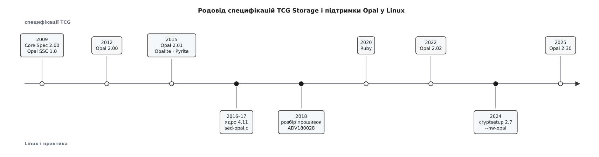

# 📜 Родовід Opal: як писалася специфікація і як замок дійшов до ядра Linux

Opal — не алгоритм і не винахід, а домовленість між сотнями виробників носіїв і жменькою операційних систем; тут — про те, як ця домовленість складалася від 2009 року, чому в неї така дивна рідня з іменами мінералів, і якою дорогою вона дійшла до файла `block/sed-opal.c`.

*Угорі — документи Trusted Computing Group, унизу — те, що з ними зробили Linux і практика; між подіями по десять і більше років, і це не застій, а властивість домовленостей, реалізованих у кремнії.*

## Дві специфікації дев'ятого року

Робоча група зі сховищ (Storage Work Group) у Trusted Computing Group мала задачу, яку поодинці не розв'язує ніхто: диски роблять десятки компаній, а розмовляти з ними має одна операційна система. Тому спершу написали спільну мову — TCG Storage Architecture Core Specification, версія 2.00 ревізії 1.00 датована 20 квітня 2009 року. Вона описує механіку: таблиці, сеанси, виклики методів, кодування токенами. І свідомо не каже, які саме таблиці має мати диск.

Конкретику дає профіль — SSC, Security Subsystem Class. Перший профіль вийшов навіть раніше за ту редакцію ядра специфікації: Opal SSC версії 1.0 ревізії 1.0 датовано 27 січня 2009 року. Того ж місяця з'явився й Enterprise SSC.

Два профілі одразу — бо задачі різні. Ноутбук треба вміти завантажити з носія, який сам себе замкнув, а отже потрібні тіньовий MBR і передзавантажувальна програма. Дискова полиця в серверній нічого такого не робить: її відмикає контролер масиву, зате діапазонів там треба багато. Одна специфікація на обидва випадки була б удвічі важчою для кожного.

## Числа, що зростають повільно

Opal SSC 2.00 ревізії 1.00 вийшла 24 лютого 2012 року — саме її реалізує більшість носіїв, які ви купите сьогодні, і саме її підмножину має ядро Linux. Далі: 2.01 — 5 серпня 2015, 2.02 ревізії 1.00 — 24 січня 2022, 2.30 — 30 січня 2025.

Тринадцять років на три дрібні кроки виглядають як застій, але це радше свідчення природи документа. Специфікацію, реалізовану в кремнії контролерів мільйонними накладами, не можна поправити оновленням: кожна зміна має лишити чинними всі носії, вже продані, і всі інструменти, вже написані.

## Чому в родини імена мінералів

П'ятого серпня 2015 року вийшли одразу три документи: Opal 2.01, Opalite 1.00 і Pyrite 1.00. Це не примха неймінгу, а сегментація за ціною реалізації.

Opal вимагає щонайменше восьми діапазонів замикання, тіньовий MBR, окремі авторитети користувачів. Усе це — місце в прошивці й робота для команди, що її пише. **Opalite** лишає один глобальний діапазон і рівно двох користувачів, User1 та User2, — дешевша реалізація для дешевшого носія.

**Pyrite** ріже те, чого не чекаєш: шифрування. Текст специфікації каже про себе прямо — це підмножина, задумана «без вимоги підтримки шифрування носія». Той самий протокол, ті самі команди, той самий Level 0 Discovery, ті самі діапазони й паролі; замок є, а криптографії під замком може не бути. Носій просто відмовляється віддавати сектори, доки не почує PIN.

Наслідок практичний і жорсткий: на Pyrite [криптостирання](topic:sf-data/secure-erase-and-sanitize) нічого не означає. Знищувати нема чого — ключа, без якого старі біти годі прочитати, може взагалі не існувати. Замок на Pyrite — це обіцянка прошивки не віддавати дані, і рівно стільки; вийняти мікросхеми й прочитати їх повз контролер вона не заважає.

**Ruby** (версія 1.00 ревізії 1.00, 7 січня 2020) з'явилася для центрів обробки даних: шифрування вона вимагає — AES-128 або AES-256 — і вимагає PSID, але не тягне за собою всієї ваги Opal.

Звідси випливає звичка, без якої з цією родиною не працюють: перш ніж покладатися на замок, спитайте носій, ким він себе вважає. Level 0 Discovery — єдина команда, що відповідає на це до всякого сеансу, і саме в її відповіді написано, який профіль перед вами.

## Специфікація, прошивка, ядро — три різні речі

Тут корисно назвати межі вголос, бо їх постійно змішують. Специфікація каже, **які виклики є і що вони мають зробити**. Прошивка контролера каже, **як саме** — і того «як» ззовні не видно нікому. Ядро операційної системи вміє лише **надіслати виклик** і повірити відповіді. Кожен із трьох рівнів може підвести окремо від двох інших, і історія Opal — це, по суті, історія того, як галузь по черзі відкривала для себе кожен із трьох.

## Як замок дійшов до Linux

Наприкінці 2016 року над Opal у Linux працювали двоє інженерів Intel — Скотт Бауер (Scott Bauer) і Рафаель Антоньйоллі (Rafael Antognolli); їхніми іменами й досі підписана шапка файла, з копірайтом 2016 року. Друга редакція серії «block: Add Sed-opal library» пішла в розсилку linux-block 29 листопада 2016 року — тобто вікно злиття для 4.10 вже минуло, і серія ще кілька місяців ходила по списку, збираючи правки. У дерево код влився 3 лютого 2017 року, у вікні 4.11; ядро з такою назвою вийшло 30 квітня 2017-го. Підтримка в тому першому вигляді стосувалася лише контролерів NVMe — диски за драйвером `sd` підключили пізніше.

Далі підмножина доростала повільно й майже завжди під конкретну потребу того, хто писав інструмент у просторі користувача:

- 2019 — запис у тіньовий MBR (Йонас Рабенштайн, Jonas Rabenstein) і узагальнене читання й запис таблиць Opal (Ревант Раджашекар, Revanth Rajashekar); окремим викликом стало й повернення носія до заводського стану з PSID;
- 2023 — читання параметрів діапазону замикання й геометрії носія (Ондржей Козіна, Ondrej Kozina), Level 0 Discovery через `ioctl`, повернення Locking SP і, найважливіше для завантаження, ключ, який ядро бере з [кільця ключів](topic:sys-unix/kernel-keyrings), а не зі структури виклику (Ґреґ Джойс, Greg Joyce);
- 2024 — окремий виклик для зміни пароля SID;
- 2026 — повторна активація Locking SP, задання меж діапазону, стан режиму одного користувача, скидання стека протоколу (Мілан Броз, Milan Broz).

Останнє ім'я варте уваги: Мілан Броз супроводжує cryptsetup. Це не збіг, а закономірність — ядро дописують саме ті, кому бракує викликів для інструмента, який вони пишуть поверх.

## Листопад 2018-го: коли прошивка збрехала

Другий рівень — той, що «як саме» — тримався на довірі рівно до листопада 2018 року. Карло Меєр (Carlo Meijer) і Бернард ван Гастель (Bernard van Gastel) з Університету Радбоуда в Неймегені опублікували роботу «Self-encrypting deception», у якій розібрали прошивки семи носіїв: Crucial MX100, MX200, MX300 і Samsung 840 EVO, 850 EVO, T3, T5.

Знайшли вони дві різні поломки. CVE-2018-12037 (оприлюднено 20 листопада 2018 року) — відсутність криптографічного зв'язку між паролем і ключем шифрування: прошивка **порівнювала** PIN замість того, щоб виводити з нього ключ, а сам ключ лежав так, що діставався й без пароля. CVE-2018-12038 — залишки ключової інформації в блоках, які через [вирівнювання зносу](topic:sf-data/wear-leveling) не перезаписувалися і їх можна було вичитати.

Специфікація не була порушена. Вона просто ніколи й не описувала, як пов'язати PIN із ключем, — це віддали виробникові, і виробник розпорядився свободою на власний розсуд.

Наслідки вийшли за межі семи моделей, бо BitLocker у Windows за замовчуванням довіряв апаратному шифруванню, коли носій його заявляв, і мовчки вимикав власне програмне. Шостого листопада 2018 року Microsoft випустила застереження ADV180028 — «Guidance for configuring BitLocker to enforce software encryption»: груповою політикою примусити програмне шифрування, а щоб зміна подіяла, BitLocker треба вимкнути й увімкнути наново.

## Відповідь Linux: два шари замість вибору

Екосистема Linux дійшла до відповіді пізніше, зате іншої за формою. Cryptsetup 2.7.0 (позначку в репозиторії підписано 24 січня 2024 року) вміє заводити том у двох режимах: `--hw-opal-only` — самий лише апаратний замок, і `--hw-opal` — апаратний замок **і** [dm-crypt](topic:sys-unix/dm-crypt) поверх нього, з ключем, поділеним на дві частини.

Логіка тут не «недовіра до заліза», а різні режими відмови. Прошивка збрехала про шифрування — дані все одно під програмним шаром. Ключ програмного шару витягли з пам'яті — діапазон однаково замкнений. Домовленість, правдивість якої не можна перевірити зсередини системи, лишається домовленістю; тому її кладуть під те, що перевірити можна.
