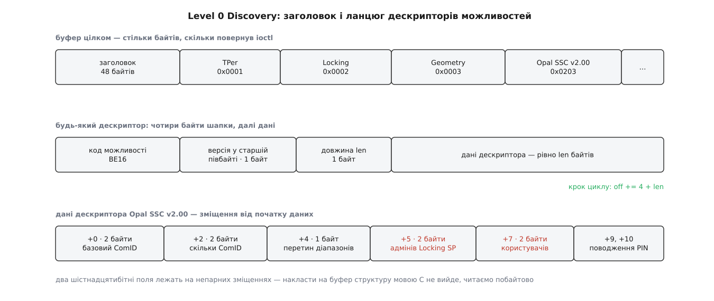

# ⚙️ Опитати носій: програма, що друкує стан Opal

Ця програма на C бере будь-який блоковий пристрій і трьома викликами `ioctl` друкує людський звіт: чи вміє контролер Opal, у якому стані замки просто зараз і що саме носій розповів про себе при знайомстві. Потрібна вона тому, що ні наліпка, ні `lsblk` цього не кажуть, а між «Opal є» і «замикання налаштовано» — прірва: диск із коробки чесно заявляє повну підтримку Opal і при цьому віддає всі свої сектори кожному охочому.

## Три запитання — три виклики

Ядро й носій знають про замки різне, тож і питати їх доводиться нарізно.

`IOC_OPAL_GET_STATUS` віддає готовий висновок — кілька прапорців у полі `flags`. Спокуса вважати це читанням кешу є, але вона хибна: `opal_get_status()` спершу кличе `check_opal_support()`, а та щоразу заново проганяє Level 0 Discovery. Прапорці свіжі — просто дуже стислі.

`IOC_OPAL_DISCOVERY` робить те саме звернення до носія, але віддає відповідь як є, байт у байт. Різниця не у свіжості, а в подробицях: зведення — це жменька бітів, а в сирому буфері лежать і номер базового ComID, і кількість авторитетів Locking SP, і те, які саме версії профілю носій заявляє. Дещо з цього ядро дає й окремим викликом — геометрію віддає `IOC_OPAL_GET_GEOMETRY`, — але більшість оголошених можливостей назовні не потрапляє взагалі.

`IOC_OPAL_GET_LR_STATUS` — інша річ. Він не читає оголошення, а відкриває справжній сеанс до Locking SP і читає рядок таблиці діапазону. Тому він єдиний із трьох вимагає пароля.

> 🔧 **Навіщо це.** Стисле зведення відповідає на питання «чи можна тут узагалі замикати». Сирий буфер відповідає на питання «чому цей диск поводиться не так, як сусідній»: саме там видно, що прошивка заявляє Opal SSC v1.00 замість очікуваної v2.00, або що Geometry вимагає вирівнювати діапазони на гранулу, більшу за сектор.

## Крок 1: короткий висновок

```c
/* opal-report.c — cc -O2 -Wall -o opal-report opal-report.c */
#include <errno.h>
#include <fcntl.h>
#include <inttypes.h>
#include <stdint.h>
#include <stdio.h>
#include <string.h>
#include <unistd.h>
#include <sys/ioctl.h>
#include <linux/sed-opal.h>

static uint16_t be16(const unsigned char *p) { return (uint16_t)(p[0] << 8 | p[1]); }
static uint32_t be32(const unsigned char *p)
{
        return (uint32_t)p[0] << 24 | (uint32_t)p[1] << 16 | (uint32_t)p[2] << 8 | p[3];
}
static uint64_t be64(const unsigned char *p) { return (uint64_t)be32(p) << 32 | be32(p + 4); }

static void report_status(int fd)
{
        static const struct { unsigned bit; const char *name; } fl[] = {
                { OPAL_FL_SUPPORTED,         "Opal підтримується" },
                { OPAL_FL_LOCKING_SUPPORTED, "замикання можливе" },
                { OPAL_FL_LOCKING_ENABLED,   "замикання налаштовано" },
                { OPAL_FL_LOCKED,            "замкнено просто зараз" },
                { OPAL_FL_MBR_ENABLED,       "тіньовий MBR увімкнено" },
                { OPAL_FL_MBR_DONE,          "тіньовий MBR уже пройдено" },
        };
        struct opal_status st = { 0 };

        if (ioctl(fd, IOC_OPAL_GET_STATUS, &st) < 0) {
                printf("GET_STATUS: %s\n", strerror(errno));
                return;
        }
        printf("прапорці ядра: 0x%08x\n", st.flags);
        for (size_t i = 0; i < sizeof fl / sizeof *fl; i++)
                printf("  %s: %s\n", fl[i].name, (st.flags & fl[i].bit) ? "так" : "ні");
}
```

Прапорці не є ступенями однієї шкали, і саме тому їх плутають. `OPAL_FL_SUPPORTED` каже, що носій узагалі відповів на Level 0 Discovery по-опалівськи. `OPAL_FL_LOCKING_SUPPORTED` — що серед його можливостей є замикання. `OPAL_FL_LOCKING_ENABLED` — що хтось уже взяв пристрій у власність і завів діапазони. І лише `OPAL_FL_LOCKED` каже, що просто зараз якийсь діапазон закритий. Новий диск дає «так, так, ні, ні» — і це рівно нуль захисту.

## Крок 2: сирий Level 0 Discovery

Тут з'являється єдина справжня робота — розібрати буфер.

Відповідь має сталу форму: сорокавосьмибайтовий заголовок, а за ним ланцюг дескрипторів можливостей. Кожен дескриптор починається з чотирьох байтів шапки — двобайтовий код можливості, старший півбайт версії, байт довжини — і несе далі `len` байтів даних. Наступний лежить рівно через `4 + len` байтів; лічильника дескрипторів немає, тільки цей крок і загальна довжина із заголовка.



*Останній рядок — дані дескриптора Opal SSC v2.00: два шістнадцятибітні поля стоять на непарних зміщеннях, тож накласти згори структуру мовою C не вийде.*

Два місця, де програма ламається, якщо про них не подумати.

**Довжина приходить не там, де на неї чекають.** `IOC_OPAL_DISCOVERY` оголошено як `_IOW`, тобто ядро працює зі своєю копією аргументу й назад її не віддає: поле `size` у вашій структурі лишиться тим, що ви записали. Справжню довжину повертає сам `ioctl()` — додатним значенням. Причому це довжина того, що мав носій, а не того, що вам скопіювали: якщо ви дали менший буфер, число все одно буде більшим за нього. Ядро відмовляється розбирати відповіді, довші за `IO_BUFFER_LENGTH` мінус заголовок, тож двох кілобайтів вистачає завжди — але звіряти повернуте число з розміром буфера все одно треба, бо саме на цьому будується межа циклу.

**Числа лежать у мережевому порядку, а поля — де завгодно.** Усі багатобайтові величини в дескрипторах — старшим байтом уперед, і на звичайному x86 їх треба перевертати. Гірше інше: в описі Opal SSC v2.00 після однобайтового поля «перетин діапазонів» одразу йдуть два шістнадцятибітні лічильники, тобто на зміщеннях 5 і 7 від початку даних. Структура мовою C такого не опише без явного пакування, а прочитане з непарної адреси `uint16_t` — це вже не про порядок байтів, а про вирівнювання. Обидві пастки знімає одне рішення: читати побайтово, як у `be16()` вище. Це загальне правило розбору бінарних протоколів — [вирівнювання й порядок байтів на дроті](root:com-protocol/wire-format-packing) псують життя однаково скрізь, де структуру приймають ззовні.

```c
static void report_discovery(int fd)
{
        unsigned char buf[2048];
        struct opal_discovery d = { .data = (uint64_t)(uintptr_t)buf, .size = sizeof buf };
        int n = ioctl(fd, IOC_OPAL_DISCOVERY, &d);   /* n > 0 — довжина відповіді */

        if (n < 0) {
                printf("DISCOVERY: %s\n", strerror(errno));
                return;
        }
        size_t have = (size_t)n < sizeof buf ? (size_t)n : sizeof buf;
        if (have < 48) {
                printf("буфер закороткий: %zu байтів\n", have);
                return;
        }
        printf("Level 0 Discovery: тіло %u байтів, версія структури %u\n",
               be32(buf), be32(buf + 4));

        for (size_t off = 48; off + 4 <= have; ) {
                uint16_t code = be16(buf + off);
                unsigned ver  = buf[off + 2] >> 4;
                unsigned len  = buf[off + 3];
                const unsigned char *p = buf + off + 4;   /* дані дескриптора */
                unsigned need = code == 0x0003 ? 28 : code == 0x0203 ? 9 :
                                code == 0x0200 ? 4 : 1;   /* скільки байтів читає switch */

                if (off + 4 + len > have) {
                        printf("  дескриптор 0x%04x обрізано\n", code);
                        break;
                }
                if (len < need) {                         /* прошивка дала коротший дескриптор */
                        printf("  дескриптор 0x%04x: лише %u байтів даних\n", code, len);
                        off += 4u + len;
                        continue;
                }
                switch (code) {
                case 0x0001:
                        printf("  TPer v%u: синхронний=%d асинхронний=%d керування ComID=%d\n",
                               ver, !!(p[0] & 0x01), !!(p[0] & 0x02), !!(p[0] & 0x40));
                        break;
                case 0x0002:
                        printf("  Locking v%u: можливе=%d налаштовано=%d замкнено=%d "
                               "шифрування носія=%d тіньовий MBR=%d пройдено=%d\n", ver,
                               !!(p[0] & 0x01), !!(p[0] & 0x02), !!(p[0] & 0x04),
                               !!(p[0] & 0x08), !!(p[0] & 0x10), !!(p[0] & 0x20));
                        break;
                case 0x0003:
                        printf("  Geometry v%u: логічний блок=%u Б, гранула=%" PRIu64 " блоків, "
                               "перший вирівняний LBA=%" PRIu64 ", вирівнювання обов'язкове=%d\n",
                               ver, be32(p + 8), be64(p + 12), be64(p + 20), p[0] & 1);
                        break;
                case 0x0200:
                        printf("  Opal SSC v1.00: базовий ComID=0x%04x, усього ComID=%u\n",
                               be16(p), be16(p + 2));
                        break;
                case 0x0203:
                        printf("  Opal SSC v2.00: базовий ComID=0x%04x, усього ComID=%u, "
                               "адмінів Locking SP=%u, користувачів=%u\n",
                               be16(p), be16(p + 2), be16(p + 5), be16(p + 7));
                        break;
                default:
                        printf("  можливість 0x%04x v%u, %u байтів даних\n", code, ver, len);
                }
                off += 4u + len;
        }
}
```

Одне уточнення, бо на ньому легко обманутися: кількість діапазонів замикання в цій відповіді не оголошено взагалі. Поля Opal SSC v2.00 рахують **авторитетів** Locking SP — скільки окремих адміністраторів і користувачів підтримує прошивка. Скільки насправді є діапазонів, каже вже таблиця `LockingInfo` всередині сеансу — або, найпростіше, спроба прочитати кожен із них.

## Крок 3: діапазони

```c
static void report_range(int fd, unsigned lr, const char *pw)
{
        static const char *state[8] = { [OPAL_RO] = "лише читання",
                                        [OPAL_RW] = "відкрито",
                                        [OPAL_LK] = "замкнено" };
        struct opal_lr_status s = { 0 };
        size_t pwlen = strlen(pw);

        if (pwlen >= OPAL_KEY_MAX)   /* key_len — один байт, тож не більше 255 */
                return;
        s.session.who = OPAL_ADMIN1;          /* sum = 0 — не режим одного користувача */
        s.session.opal_key.lr = lr;           /* саме тут номер діапазону */
        s.session.opal_key.key_len = (unsigned char)pwlen;
        memcpy(s.session.opal_key.key, pw, pwlen);

        if (ioctl(fd, IOC_OPAL_GET_LR_STATUS, &s) < 0) {
                printf("  діапазон %u: %s\n", lr, strerror(errno));
                return;
        }
        printf("  діапазон %u: LBA %" PRIu64 " + %" PRIu64 ", замикання читання=%u запису=%u, %s\n",
               lr, s.range_start, s.range_length, s.RLE, s.WLE,
               s.l_state < 8 && state[s.l_state] ? state[s.l_state] : "?");
}

int main(int argc, char **argv)
{
        if (argc < 2) {
                fprintf(stderr, "вжиток: %s /dev/nvme0n1 [пароль-адміна]\n", argv[0]);
                return 2;
        }
        int fd = open(argv[1], O_RDONLY | O_CLOEXEC);
        if (fd < 0) {
                perror(argv[1]);
                return 1;
        }
        report_status(fd);
        report_discovery(fd);
        if (argc > 2)
                for (unsigned lr = 0; lr < OPAL_MAX_LRS; lr++)
                        report_range(fd, lr, argv[2]);
        close(fd);
        return 0;
}
```

Номер діапазону тут ховається в несподіваному місці — у полі `lr` структури ключа, а не окремим аргументом; нульовий номер означає глобальний діапазон, решта до `OPAL_MAX_LRS` — окремі. Стан ядро зводить до трьох значень і робить це не механічно: `OPAL_LK` воно ставить, лише коли замкнено і читання, і запис, `OPAL_RO` — коли замкнено самий запис, а комбінацію «читання замкнено, запис ні» відкидає з `EINVAL`, бо описати її наявним переліком нічим.

## Пастки

**Права.** Перше, що робить `sed_ioctl()`, — перевіряє `CAP_SYS_ADMIN`, і лише потім дивиться на пристрій. Без цієї [можливості](root:sys-unix/capabilities) ви отримаєте `EACCES` навіть на диску, який зроду не чув про Opal, і не дізнаєтеся нічого.

**`EOPNOTSUPP` означає дві різні речі.** Або ядро зібрано без `CONFIG_BLK_SED_OPAL` чи транспорт не дав драйверові чим носити службові буфери — тоді об'єкта `opal_dev` не існує зовсім. Або об'єкт є, але носій на Discovery відповів не по-опалівськи. Розрізнити це кодом помилки не вийде — доводиться заглядати в конфігурацію ядра (`zgrep BLK_SED_OPAL /proc/config.gz`).

**Ціна викликів різна на порядки.** `GET_STATUS` і `DISCOVERY` — це один похід до носія кожен. `GET_LR_STATUS` щоразу відкриває сеанс, читає стовпці таблиці й закриває сеанс, тобто кілька обмінів; опитати дев'ять діапазонів — це дев'ять сеансів поспіль. І пам'ятайте, що невдалі спроби входу деякі прошивки рахують: у таблиці `C_PIN` є `TryLimit`, і перебирати паролі цим викликом — поганий спосіб дізнатися правильний.

**Заголовки старіші за ядро.** Константи додавали поступово: `IOC_OPAL_GET_STATUS` — Дуглас Міллер у серпні 2022-го, `IOC_OPAL_GET_LR_STATUS` і `IOC_OPAL_GET_GEOMETRY` — Ондржей Козіна навесні 2023-го (як частина роботи над підтримкою Opal у cryptsetup), `IOC_OPAL_DISCOVERY` — Ґреґ Джойс у липні 2023-го. Тому перевіряти варто не версію ядра, а наявність самого макроса при збірці: пакет заголовків у дистрибутиві нерідко відстає.

## Коли sed-opal вимкнено в ядрі

Level 0 Discovery — єдиний запит, на який носій відповідає без сеансу, тож дістати його можна й повз усю підсистему: це звичайна службова команда набору команд, а не щось особливе. Для NVMe це адміністративна команда Security Receive, і зібрати її треба точнісінько так, як це робить `nvme_sec_submit()` усередині ядра.

```c
#include <linux/nvme_ioctl.h>

/* той самий буфер Discovery, але повз sed-opal */
static int nvme_discovery(int fd, void *buf, size_t len)
{
        struct nvme_admin_cmd c = {
                .opcode   = 0x82,                           /* Security Receive */
                .nsid     = 0,
                .addr     = (uint64_t)(uintptr_t)buf,
                .data_len = (uint32_t)len,
                .cdw10    = (0x01u << 24) | (0x0001u << 8), /* SECP=0x01 (TCG), ComID=0x0001 */
                .cdw11    = (uint32_t)len,                  /* скільки байтів ми готові взяти */
        };
        memset(buf, 0, len);
        return ioctl(fd, NVME_IOCTL_ADMIN_CMD, &c);
}
```

Розкладка `cdw10` тут не вгадана: ядро складає це подвійне слово так само — номер протоколу в старший байт, ComID зі зсувом на вісім бітів, — а драйвер [NVMe](root:sys-unix/nvme-in-linux) переводить його в порядок байтів пристрою вже сам. Тому на дроті виходить байт у байт та сама команда, що й через `sed-opal`, і розбирати відповідь можна тим самим циклом. Працює це і на пристрої простору імен (`/dev/nvme0n1`), і на керуючому (`/dev/nvme0`), і так само потребує `CAP_SYS_ADMIN`.

Для SATA й SAS місце те саме, тільки команда зветься `SECURITY PROTOCOL IN` і подається [наскрізним запитом SG_IO](root:sys-unix/scsi-generic-passthrough): код операції `0xA2`, номер протоколу в другому байті дескриптора, ComID — двома байтами старшим уперед, довжина буфера — чотирма. Відповідь у всіх трьох випадках однакова, бо це вже не набір команд, а вміст труби.
