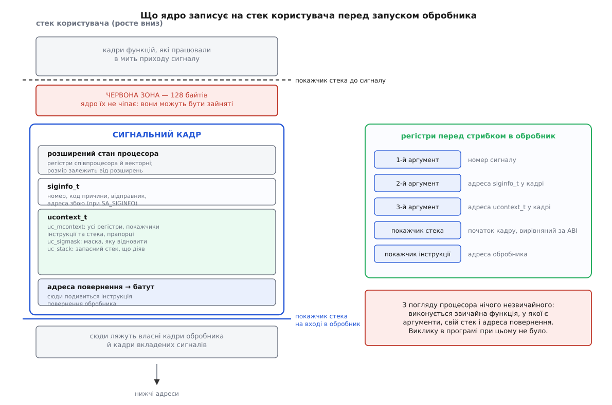
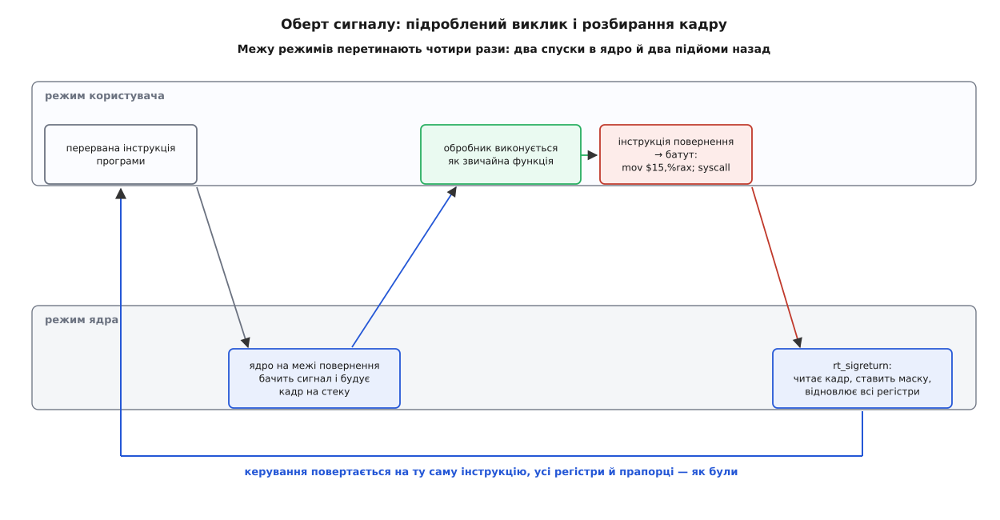
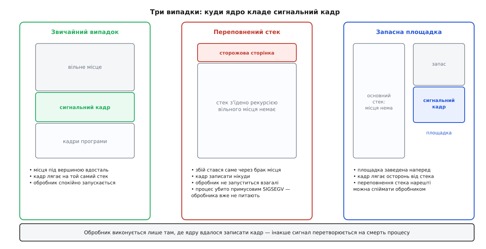

# Сигнальний кадр і повернення з обробника (rt_sigreturn)

<preknowlist>
- [Сигнал: асинхронне сповіщення](root:sys-unix/signal-model) — сигнал як біт у структурі задачі; доправляють його лише на межі повернення в простір користувача.
- [Диспозиція сигналу](root:sys-unix/signal-disposition) — як програма призначає обробник через `sigaction` і що означають прапорці `SA_SIGINFO`, `SA_ONSTACK`, `SA_RESTART`.
- [Механіка системного виклику](root:sys-unix/syscall-mechanics) — як програма переходить у режим ядра, де ядро тримає збережені регістри користувача й як віддає керування назад.
- [Стек викликів](root:sf-lang/stack-lifo) — кадр функції, адреса повернення на вершині стека, покажчик стека, що росте вниз.
- [Угода про виклик і ABI](root:sf-lang/abi-calling-convention) — у яких регістрах передають аргументи, хто які регістри зберігає, що робить інструкція повернення.
- [Віртуальний адресний простір процесу](root:sf-os/virtual-address-space) — стек як звичайна ділянка пам'яті з правами доступу, а не як щось окреме від решти пам'яті.
</preknowlist>

## Функція, яку ніхто не викликав

Ви пишете обробник сигналу — і це найзвичайніша функція:

```c
static void on_term(int sig)
{
    stop_requested = 1;
}
```

Компілятор нічого особливого в ній не бачить. Він складе звичайний пролог, звичайне тіло й звичайний епілог, який закінчиться інструкцією повернення. А ця інструкція робить рівно одне: бере адресу з вершини стека й переходить за нею.

Ось тут і починається загадка. У програмі немає жодного місця, де цю функцію викликають. Ніхто не клав адресу повернення на стек. Отже, або на вершині стека випадкове сміття — і програма розсиплеться, щойно обробник закінчиться, — або хтось ззовні підготував усе так, ніби виклик справді був.

Підготував, звісно, той, хто єдиний має доступ і до регістрів, і до пам'яті процесу, — ядро. Але завдання в нього важче, ніж у звичайного викликача. Звичайна функція повертається туди, звідки її покликали, і про це домовилися ще при компіляції. Обробник же перервав програму **у довільній точці**: посеред арифметики, між двома полями структури, всередині чужої бібліотеки. Після нього мусить відновитися все — кожен регістр загального призначення, прапорці процесора, покажчик стека, покажчик інструкції, регістри співпроцесора — з точністю до біта, бо перервана програма про цей візит нічого не знає й нічого не перевірятиме.

Тобто ядру треба не просто підробити виклик. Треба десь зберегти повний знімок процесора й гарантувати, що після обробника цей знімок повернеться на місце.

## Чому знімок не можна лишити в ядрі

У ту мить, коли ядро вирішує доправити сигнал, повний користувацький контекст у нього вже є: він лежить у стеку ядра, збережений при вході в системний виклик або при перериванні. Здавалося б, найпростіше — лишити його там, а після обробника дістати назад.

Не виходить, і причин дві.

Перша: стек ядра для цієї задачі — тимчасовий. Ядро якраз закінчує роботу й розкручує свій кадр, щоб віддати процесор програмі. Тримати знімок означало б **не завершувати** вхід у ядро, поки не завершиться обробник, — тобто зависнути в системному виклику на невизначений час, керований користувацьким кодом.

Друга важливіша. Обробник сам може бути перерваний сигналом: іншого номера, або того самого, якщо виставлено `SA_NODEFER`. Тоді ядро мусить зберегти другий знімок, не зруйнувавши перший. Потім третій. Скільки їх буде — вирішує не ядро, а програма: своїми масками, своїм набором обробників, своєю логікою. Отже, ядру довелося б тримати **стек знімків необмеженої глибини, керований з простору користувача**, і виділяти під нього пам'ять саме тоді, коли доправляє сигнал, — зокрема й сигнал про те, що пам'яті бракує. Ядро такого собі не дозволяє ніде.

А тим часом структура з потрібними властивостями в процесу вже є. Вона росте, вкладається сама в себе, обмежена лімітом самого процесу й лежить у його адресному просторі. Це його власний стек.

Тому ядро не тримає знімок у себе, а **записує його на стек користувача**. Цей записаний блок і називають **сигнальним кадром** (англ. *signal frame*).

## Що саме ядро кладе на стек

Кадр — це не одна структура, а кілька, покладених поруч у порядку, який знають обидві сторони.

**Адреса повернення** — на самій вершині, туди, куди подивиться інструкція повернення обробника. Про те, куди вона веде, — трохи далі.

**`ucontext_t`** — контекст перерваного виконання. Усередині нього `uc_mcontext` (машинний контекст) з усіма регістрами загального призначення, покажчиком інструкції, покажчиком стека й прапорцями, а поряд — `uc_sigmask` (маска сигналів, яку треба відновити) і `uc_stack` (опис запасного стека, який діяв до сигналу). Оскільки регістри співпроцесора й векторні регістри займають багато місця, вони лежать окремою ділянкою, а в `uc_mcontext` на неї є вказівник.

**`siginfo_t`** — опис події: номер, код причини, відправник, адреса збою. Цей блок кладуть, коли обробник призначено з `SA_SIGINFO`.

**Розширений стан процесора** — область, яку заповнює інструкція збереження стану співпроцесора. Її розмір залежить від того, які розширення процесора програма реально вживає.

Записавши все це, ядро виставляє регістри так, ніби відбувся звичайний виклик за угодою платформи: у регістри аргументів — номер сигналу, вказівник на `siginfo_t`, вказівник на `ucontext_t`; покажчик стека — на початок кадру, з вирівнюванням, якого вимагає ABI; покажчик інструкції — на адресу обробника. І аж тепер повертається в простір користувача. Процесор бачить звичайний код, що виконує звичайну функцію.

Є одна тонкість у тому, **де** саме кадр опиняється. На x86-64 угода про виклик резервує 128 байтів одразу під покажчиком стека — «червону зону»: функція, яка нікого не викликає, має право користуватися ними, не зсуваючи покажчик. Якби ядро писало кадр просто під вершиною, воно затирало б чужі живі дані. Тому воно спершу відступає ці 128 байтів і лише потім кладе кадр.



*Ядро підробляє звичайний виклик: кладе кадр нижче червоної зони й розставляє регістри за угодою платформи.*

Повний перелік полів — які саме регістри доступні в `uc_mcontext`, як до них дістатися за іменем, звідки береться вказівник на розширений стан і як це саме виглядає на різних архітектурах — зібрано окремо: [будова сигнального кадру](root:sys-unix/signal-frame-and-sigreturn/api-signal-frame-layout.md).

## Адреса повернення веде на батут

Тепер про ту адресу на вершині. Вести прямо в ядро вона не може: інструкція повернення виконується в режимі користувача й здатна перейти лише на користувацьку адресу. Вимагати, щоб обробник сам щось викликав наприкінці, теж не можна — це звичайна функція, скомпільована звичайним компілятором, і міняти для неї угоду про виклик означало б зламати кожну програму.

Лишається єдиний вихід: адреса повернення вказує на крихітний шматок коду в самому процесі, чиє все тіло — попросити ядро повернути все на місце. Цей шматок називають **батутом** (англ. *trampoline*), бо єдина його робота — відштовхнути керування назад у ядро. На x86-64 він складається з двох інструкцій:

```
__restore_rt:
    mov  $15, %rax        /* 15 — номер системного виклику rt_sigreturn */
    syscall
```

Спершу цей код клали **прямо на стек**, разом із кадром. Наслідок був неприємний: стек мусив бути виконуваним, а виконуваний стек — це подарунок нападникові. Коли з'явився заборонний біт на виконання ([пам'ять без права виконання](root:sf-security/no-execute-memory)), батут довелося переселити. Тепер він живе або в [бібліотеці від ядра, вбудованій у кожен процес](root:sys-unix/vdso) — під іменем `__kernel_rt_sigreturn`, — або в бібліотеці C. На x86-64 обрали другий шлях: `sigaction` у бібліотеці кладе адресу свого `__restore_rt` у поле `sa_restorer` і виставляє прапорець `SA_RESTORER`. Без цього прапорця ядро на x86-64 кадру просто не побудує й уб'є процес сигналом `SIGSEGV`. Як батут переїжджав зі стека й чому системний виклик має префікс `rt_`, розібрано окремо: [звідки взявся батут і чому він переїхав](root:sys-unix/signal-frame-and-sigreturn/hist-trampoline-on-the-stack.md).

У цього переїзду є побічний наслідок, який рідко хто передбачав. Налагоджувач, розкручуючи стек аварії, мусить упізнати місце, де звичайний ланцюжок кадрів обривається сигнальним. Упізнає він його або за описом розкрутки, доданим до батута, або **за точною послідовністю байтів** цих двох інструкцій. Тому ім'я функції та її машинний код фактично стали частиною [замороженого інтерфейсу до простору користувача](root:sys-unix/userspace-abi-stability): змінити їх — зламати всі налагоджувачі.

## Чому повернення — це системний виклик

Здається дивним: якщо весь знімок лежить у пам'яті процесу, чому програма не відновить його сама? Спробуймо — і побачимо, де це впирається у стіну.

Щоб відновити контекст, треба завантажити з пам'яті всі регістри загального призначення, прапорці, покажчик стека й покажчик інструкції. Але адресу блока, з якого ми читаємо, теж треба десь тримати — у регістрі. Той регістр і буде єдиним, якого відновити нічим: у мить, коли ми покладемо в нього збережене значення, ми втратимо адресу решти. Крім того, покажчик стека й покажчик інструкції мусять змінитися **разом**: між їх записами вигляд процесора суперечливий, і сигнал, який прилетить у цей проміжок, зруйнує все.

Друга стіна — маска сигналів. На час обробника ядро додало до маски сам оброблюваний сигнал і те, що просив `sa_mask`; повернення мусить відновити стару маску. А маска живе в ядрі, і зняти її можна лише системним викликом. Робити це двома кроками — спершу відновити маску, потім стрибнути — означає створити вікно, у якому сигнал уже розблоковано, а керування ще на батуті: новий обробник запуститься поверх недорозібраного кадру.

Обидві стіни зникають, якщо повернення робить ядро — одним неподільним рухом. Саме це й робить системний виклик `rt_sigreturn`.

Він унікальний двома рисами. По-перше, **не бере жодного аргументу**: усе, що йому треба, лежить за фіксованим зсувом від покажчика стека, бо на батут потрапили інструкцією повернення, і покажчик стоїть рівно на початку кадру. По-друге, він **не повертає значення** у звичному сенсі — точніше, у регістр результату лягає те, що було збережено в кадрі. Завдяки цьому перерваний системний виклик, який ядро вирішило переграти, після обробника дійсно грається наново, а той, що встиг щось прочитати, віддає свій результат ([EINTR і перезапуск перерваних викликів](root:sys-unix/eintr-and-restart)).

Отримавши виклик, ядро зчитує кадр, ставить назад маску сигналів, повертає опис запасного стека, відновлює розширений стан процесора, розкладає регістри по місцях — і повертається в простір користувача так, ніби це був звичайний вихід із переривання. Програма продовжує з тієї самої інструкції, на якій її урвали.



*Ядро втручається двічі: перший раз — щоб підробити виклик, другий — щоб його розібрати.*

> 🔧 **Навіщо це.** Коли в `strace` посеред роботи програми з'являється `rt_sigreturn`, це не збій і не щось екзотичне — це просто закінчився обробник сигналу. І навпаки: якщо ви пишете фільтр системних викликів ([seccomp](root:sys-unix/seccomp-filter-mechanism)), заборонити `rt_sigreturn` не можна ніколи, бо тоді жоден обробник не зможе завершитися. Не випадково найсуворіший режим seccomp дозволяє рівно чотири виклики — читання, запис, вихід і повернення з обробника.

## Ядро довіряє кадру рівно настільки, наскільки мусить

Кадр лежить у пам'яті процесу, тож процес може його переписати. Ядро це знає й перевіряє те, що читає: з прапорців процесора воно бере лише ті біти, які код користувача і так має право виставити; рівень привілеїв і сегментні регістри ставить саме; недійсний покажчик інструкції спричинить збій уже при поверненні, і процес отримає `SIGSEGV`. Підняти собі права через підроблений кадр не вийде.

А от **усе, що й так дозволено користувачеві, підробити можна**. І з цього виріс окремий клас атак. Якщо нападник керує вершиною стека й може змусити програму виконати одну-єдину інструкцію системного виклику, він кладе туди вигаданий сигнальний кадр — і отримує повний набір регістрів за одну дію. Не треба збирати ланцюжок із чужих шматків коду ([ROP](root:sf-security/code-reuse-attacks)): розкладка кадру стандартна й однакова на різних дистрибутивах, тож і напад виходить переносним. Техніку назвали sigreturn-oriented programming і описали Ерік Босман і Герберт Бос з Вільного університету Амстердама у праці «Framing Signals — A Return to Portable Shellcode» на симпозіумі IEEE Symposium on Security and Privacy 2014, де вона отримала нагороду за найкращу студентську роботу.

Очевидний захист — покласти в кадр таємне число, яке ядро згенерувало для цього процесу, і при `rt_sigreturn` перевіряти його. Такі латки пропонував 2016 року Скотт Бауер, але в основне ядро Linux вони не ввійшли: перевірка ламала, зокрема, [збереження й відновлення живих процесів](root:sys-unix/checkpoint-restore), яке саме будує сигнальні кадри штучно. Тож практичним захистом лишається не сам `rt_sigreturn`, а те, що заважає нападникові дістатися до вершини стека й до потрібної інструкції: [рандомізація розкладки адресного простору](root:sf-security/aslr), заборона виконання даних і контроль цілісності стека.

## Кадр — це дані, і програма має право їх правити

Та сама відкритість кадру, що дала атаку, дала й корисну можливість. Третій аргумент розширеного обробника — вказівник на `ucontext_t`, і вказує він на **справжній кадр на стеку**, а не на копію. Усе, що обробник там змінить, ядро й поставить назад.

Звідси прийом, на якому тримається чимало серйозних систем: **обробник вирішує, куди програма повернеться**. Він може підправити покажчик інструкції, щоб продовжити виконання в іншому місці замість аварійної інструкції; підставити регістр і повторити операцію; вставити виклик своєї функції в потік керування чужого коду. Так середовище виконання Go, починаючи з версії 1.14, витісняє горутину, що засиділася в тісному циклі: надсилає потокові `SIGURG`, а обробник міняє в кадрі покажчик інструкції так, ніби горутина щойно сама покликала службову функцію переключення. Так само працюють обробники сторінкових збоїв у просторі користувача, відкат оптимізованого коду в компіляторах «на льоту» й діагностичні інструменти, що продовжують роботу після спійманого збою.

Робочий приклад — програма, яка ловить `SIGSEGV`, править контекст і продовжує роботу замість того, щоб померти, разом із пастками, у які на цьому наступають, — розібрано окремо: [пережити збій, переписавши контекст](root:sys-unix/signal-frame-and-sigreturn/proj-context-rewrite.md).

Пастки варто назвати одразу, бо вони не очевидні. Правка контексту перед перерваним системним викликом б'ється з логікою перезапуску: ядро вже відкотило покажчик інструкції на саму інструкцію виклику й поклало в регістр результату особливий код, тож необережна правка або повторить виклик двічі, або з'їсть його. Поля машинного контексту різні на кожній архітектурі — переносного коду тут не буває. І нарешті, розширений стан процесора лежить не в самому `uc_mcontext`, а за вказівником з нього: змінювати треба там.

## Скільки місця це коштує і чому обробник іноді не запускається

Уся конструкція має фізичну ціну: кадр займає місце на стеку, і місця цього мусить вистачити.

Раніше ціна була дрібною й сталою, тому в заголовках жили константи: `MINSIGSTKSZ` = 2048 байтів, `SIGSTKSZ` = 8192. Потім процесори почали обростати регістрами, а розширений стан — рости разом із ними.

**Умова:** процес на машині з матричними розширеннями (AMX) отримує сигнал; рахуємо, скільки байтів займе область розширеного стану в кадрі.

```
базова область FXSAVE            =   512 байтів
заголовок XSAVE                  =    64
AVX (верхні половини YMM)        =   256
AVX-512: маски + ZMM + Hi16_ZMM  =  2112   (64 + 1024 + 1024)
AMX: конфігурація + плитки       =  8256   (64 + 8·1024)
─────────────────────────────────────────
разом розширений стан            = 11200 байтів ≈ 11 КБ
плюс сам кадр (ucontext, siginfo) ≈ 1 КБ
─────────────────────────────────────────
потрібно                          ≈ 12 КБ  >  SIGSTKSZ = 8192
```

Стара константа перестала бути правдою. Виправляли двома кроками. Ядро почало повідомляти справжній мінімум у [допоміжному векторі](root:sys-unix/auxiliary-vector) полем `AT_MINSIGSTKSZ`, а бібліотека GNU з версії 2.34 зробила `MINSIGSTKSZ` і `SIGSTKSZ` не константами, а зверненням до `sysconf` під час виконання. Крім того, найважчі розширення на кшталт AMX увімкнено не одразу: процес мусить явно попросити їх у ядра — саме тому, що інакше сигнальний кадр роздувся б у програм, які про це не просили.

Практичний висновок простий: розмір запасного стека **не можна вписувати числом у код**. Його треба питати в системи під час виконання.

І останнє, найважливіше. Якщо на стеку місця немає, ядро не може записати кадр — а без кадру немає ані контексту для відновлення, ані способу віддати керування обробникові. Тоді воно робить єдине, що лишається: убиває процес примусовим `SIGSEGV` — таким, що вже не питає ні про призначений обробник, ні про маску.

Найчастіший випадок цього — переповнення стека. Програма з'їла стек рекурсією, ядро надсилає `SIGSEGV`, обробник для нього призначено — але виконати його ніде, бо збій стався саме через брак місця на стеку. Тому спіймати переповнення власного стека можна **тільки** на запасній площадці: завести її викликом `sigaltstack` і призначити обробник із прапорцем `SA_ONSTACK`. Тоді ядро покладе кадр не під вершиною зруйнованого стека, а на окрему ділянку — і обробник таки запуститься.



*Обробник запускається лише там, де є куди покласти кадр; при переповненні стека таке місце є тільки на запасній площадці.*

> 🔧 **Навіщо це.** Служба, що має чесно записати передсмертний звіт про аварію, майже завжди ловить `SIGSEGV`. Без `sigaltstack` вона зробить це для всіх аварій, крім однієї — саме тієї, що стається від нескінченної рекурсії, тобто найтиповішої в складному коді ([переповнення стека](root:sf-lang/stack-overflow)). Дві зайві рядки при старті перетворюють мовчазну смерть на записаний звіт.

Уся ця машинерія — кадр на чужому стеку, батут із двох інструкцій, окремий системний виклик для повернення — виглядає надміру складною, доки не побачиш, що вона розв'язує: віддати керування довільному користувацькому кодові посеред роботи програми, дозволити цьому повторюватися вкладено й повернути все на місце, не витративши в ядрі жодного байта на кожен такий візит. Ціну за це платить стек процесу — і платить її саме той, хто замовив обробник.
