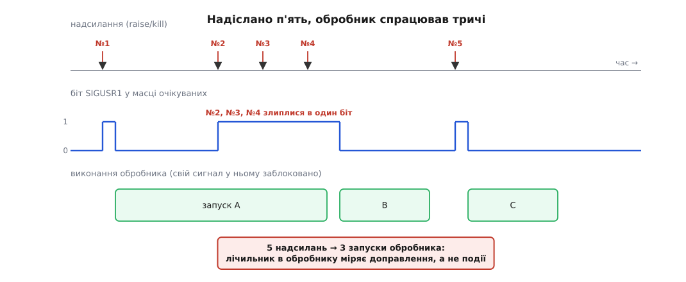

# ⚙️ Скільки сигналів насправді дійшло: дослід зі злипанням

Три короткі програми мовою C, які перетворюють правило «звичайний сигнал — це біт, а реальночасовий — запис у черзі» з твердження на число: перша шле собі тисячу `SIGUSR1` і показує **одне** доправлення, тисячу `SIGRTMIN+1` — і показує **тисячу**, у точному порядку; друга намацує дно черги; третя ловить найпоширенішу помилку демонів, у якій ця різниця коштує таблиці процесів.

Потрібні Linux, `gcc` і звичайний користувач. Кожна програма збирається одним рядком і нічого в системі не псує.

## Дослід 1. Тисяча надсилань, одне доправлення

**Задача.** Не повірити, що сигнали злипаються, а поміряти: надіслати собі N однакових сигналів так, щоб жодне доправлення не могло статися посеред надсилання, потім відкрити ворота й порахувати запуски обробника.

**Ідея.** Уся хитрість — розділити породження й доправлення власними руками, бо інакше вони переплетуться і ми міряли б швидкість програми, а не ємність механізму. Заблокований сигнал ядро **породжує, але не доправляє**: ставить біт (або кладе запис у чергу) і на цьому спиняється. Отже, тисяча надсилань під блокуванням — це чистий знімок того, що система здатна **запам'ятати**. Знявши блокування одним викликом, ми одержуємо все накопичене й рахуємо.

Обидві родини йдуть в одній програмі й в однакових умовах, тож різницю не спишеш на випадковість прогону.

```c
/* coalesce.c — скільки з N надісланих сигналів справді доправлено.
 * gcc -O2 -Wall -o coalesce coalesce.c      запуск: ./coalesce 1000
 */
#define _POSIX_C_SOURCE 199309L
#include <signal.h>
#include <stdio.h>
#include <stdlib.h>
#include <string.h>
#include <unistd.h>
#include <errno.h>

#define OK(call) do { if ((call) != 0) { perror(#call); return 1; } } while (0)
#define MAXLOG 4096

static volatile sig_atomic_t plain_hits = 0;   /* запусків обробника SIGUSR1     */
static volatile sig_atomic_t rt_hits    = 0;   /* запусків обробника SIGRTMIN+1  */
static volatile sig_atomic_t rt_log[MAXLOG];   /* значення в порядку надходження */

static void on_plain(int sig)
{
    (void) sig;
    plain_hits++;                    /* нічого більше: обробник — не місце для printf */
}

static void on_rt(int sig, siginfo_t *si, void *ctx)
{
    (void) sig; (void) ctx;
    int i = rt_hits;                 /* сам себе цей обробник не перериває:       */
    if (i < MAXLOG)                  /* на час його роботи ядро блокує його сигнал */
        rt_log[i] = si->si_value.sival_int;
    rt_hits = i + 1;
}

int main(int argc, char **argv)
{
    int n = (argc > 1) ? atoi(argv[1]) : 1000;
    const int RT = SIGRTMIN + 1;     /* SIGRTMIN — виклик функції, не стала */
    struct sigaction sa;
    sigset_t block, old, pend;

    memset(&sa, 0, sizeof sa);
    sa.sa_handler = on_plain;
    sigemptyset(&sa.sa_mask);
    OK(sigaction(SIGUSR1, &sa, NULL));

    memset(&sa, 0, sizeof sa);
    sa.sa_sigaction = on_rt;
    sa.sa_flags = SA_SIGINFO;        /* без цього обробник не побачить si_value */
    sigemptyset(&sa.sa_mask);
    OK(sigaction(RT, &sa, NULL));

    sigemptyset(&block);
    sigaddset(&block, SIGUSR1);
    sigaddset(&block, RT);
    OK(sigprocmask(SIG_BLOCK, &block, &old));   /* ворота зачинено */

    for (int i = 1; i <= n; i++)
        raise(SIGUSR1);

    int queued = 0;
    for (int i = 1; i <= n; i++) {
        union sigval v = { .sival_int = i };    /* вантаж: порядковий номер */
        if (sigqueue(getpid(), RT, v) == 0) { queued++; continue; }
        if (errno == EAGAIN) {
            printf("черга сповнилася на %d-му записі (EAGAIN)\n", i);
            break;
        }
        perror("sigqueue");
        return 1;
    }

    OK(sigpending(&pend));                      /* що ядро тримає просто зараз */
    printf("до розблокування: біт SIGUSR1=%d, біт SIGRTMIN+1=%d\n",
           sigismember(&pend, SIGUSR1), sigismember(&pend, RT));

    OK(sigprocmask(SIG_SETMASK, &old, NULL));   /* тут усе й доправиться */

    printf("SIGUSR1:     надіслано %d, доправлено %d\n", n, (int) plain_hits);
    printf("SIGRTMIN+1:  у черзі %d, доправлено %d\n", queued, (int) rt_hits);

    int ordered = 1;
    for (int i = 0; i < (int) rt_hits && i < MAXLOG; i++)
        if (rt_log[i] != i + 1) { ordered = 0; break; }
    printf("порядок значень: %s\n", ordered ? "рівно 1,2,3,…" : "порушено");
    return 0;
}
```

Прогін дає таке:

```
до розблокування: біт SIGUSR1=1, біт SIGRTMIN+1=1
SIGUSR1:     надіслано 1000, доправлено 1
SIGRTMIN+1:  у черзі 1000, доправлено 1000
порядок значень: рівно 1,2,3,…
```

Три речі варті окремого погляду.

**Дев'ятсот дев'яносто дев'ять `SIGUSR1` не загубилися в дорозі — їх ніколи не існувало як окремих сутностей.** Друге надсилання побачило вже піднятий біт і не мало куди додати одиницю.

**`sigpending()` показує ту саму одиницю в обох випадках.** Маска очікуваних — це маска; вона не вміє сказати «тут один запис, а тут тисяча». Глибини черги вона не показує саме тому, що глибина живе не в ній.

**Порядок реальночасових доправлень визначено, а не випадковий**: копії одного номера йдуть у тій послідовності, у якій їх надіслали, а різні номери — від меншого до більшого. Тому перевірка на `1,2,3,…` не є щасливим збігом: якби вона впала, це означало б справжню ваду.

І ще одне, менш очевидне: `SIGUSR1` доправляється **першим** — і не через те, що його надіслали раніше. Порядок між родинами POSIX залишає невизначеним, а Linux, як і більшість систем, віддає перевагу звичайним сигналам: біт пішов би першим і тоді, якби його поставили вже після тисячі записів у черзі.

Ту саму картину варто побачити ззовні, бо там вона повніша. Допишіть `sleep(30)` перед зняттям блокування, запустіть у тлі й загляньте в [файл стану процесу](topic:sys-unix/proc-reading-process-and-kernel-state):

```
$ grep -E 'Sig(Pnd|Blk|Q)' /proc/$(pgrep -n coalesce)/status
SigQ:   1000/63512
SigPnd: 0000000000000200     ← біт 9  = сигнал 10 = SIGUSR1
ShdPnd: 0000000400000000     ← біт 34 = сигнал 35 = SIGRTMIN+1
SigBlk: 0000000400000200     ← заблоковані обидва
```

Маски безмовні: у них стоїть рівно по одному бітові на номер, і за ними не видно ані тисячі, ані одиниці. Кількість живе окремо — у рядку `SigQ`, де перше число рахує **записи черги на реального власника процесу**, а друге показує його стелю. Система розділяє ці дві облікові сутності точно так, як їх розділяє сам механізм: маска відповідає «чи є», лічильник черги — «скільки».

Заразом видно й дрібницю, за якою ховається окреме правило: `SIGUSR1` опинився у **власній** масці потоку, а `SIGRTMIN+1` — у **спільній** масці процесу. Так і має бути, бо `raise()` у GNU-бібліотеці цілиться в поточний потік, а `sigqueue(getpid(), …)` — у процес як ціле.

## Дослід 2. У черги є дно

Черга записів — це виділена пам'ять, а виділення можна вичерпати. Стелю ставить `RLIMIT_SIGPENDING`, і коли вона досягнута, `sigqueue()` чесно каже `EAGAIN` замість того, щоб мовчки загубити подію ([обмеження ресурсів процесу](topic:sys-unix/resource-limits)). Чекати на природне вичерпання не треба: м'який ліміт процес вільно міняє собі сам у межах жорсткого, тож дно можна підняти під самі ноги.

```c
/* floor.c — намацати дно черги. gcc -O2 -Wall -o floor floor.c */
#define _GNU_SOURCE                  /* RLIMIT_SIGPENDING — розширення Linux */
#include <signal.h>
#include <stdio.h>
#include <string.h>
#include <errno.h>
#include <unistd.h>
#include <sys/resource.h>

int main(void)
{
    struct rlimit rl;
    getrlimit(RLIMIT_SIGPENDING, &rl);
    printf("успадкований м'який ліміт: %ld\n", (long) rl.rlim_cur);
    rl.rlim_cur = 16;                          /* жорсткий не чіпаємо */
    if (setrlimit(RLIMIT_SIGPENDING, &rl) != 0) { perror("setrlimit"); return 1; }

    sigset_t all;
    sigfillset(&all);
    sigprocmask(SIG_BLOCK, &all, NULL);        /* нічого не доправляється — черга росте */

    for (int i = 1; ; i++) {
        union sigval v = { .sival_int = i };
        if (sigqueue(getpid(), SIGRTMIN + 1, v) == 0) continue;
        printf("EAGAIN на %d-му записі: %s\n", i, strerror(errno));
        break;
    }
    printf("а kill(SIGUSR1) при повній черзі: %d\n", kill(getpid(), SIGUSR1));
    return 0;
}
```

Останній рядок і є мораллю. `kill()` повертає нуль навіть тоді, коли `sigqueue()` уже відмовляє: ліміт стереже саме чергу, а звичайному сигналу черга не потрібна — його один біт уже виділено в структурі процесу назавжди. Тому запис у чергу може не вміститися, а біт не може не вміститися ніколи.

Звідси видно справжню ціну обміну. Реальночасовий сигнал купує точний облік подій за право відмовити відправникові; звичайний ніколи не відмовляє, бо йому нема чого втрачати понад уже втрачене. Обидва по-своєму ненадійні — просто в різних місцях, і код мусить готуватися до різного: там перевіряти `errno`, тут не вірити лічильникам.

## Дослід 3. Сорок нащадків і зомбі, яких не мало бути

**Задача.** Показати ту саму втрату там, де вона справді болить: у прибиранні нащадків. Породити сорок процесів, що вмирають майже одночасно, і порівняти два обробники `SIGCHLD` — з одним `waitpid()` і з циклом.

**Ідея.** «Майже одночасно» треба влаштувати навмисне, бо інакше нащадки помиратимуть урозсип і злипання не станеться. Найпростіші ворота — канал: усі нащадки застигають у читанні, батько закриває свій кінець, читання в усіх воднораз повертає кінець даних, і сорок процесів виходять у ту саму мить.

```c
/* zombies.c — один waitpid проти циклу.
 * gcc -O2 -Wall -o zombies zombies.c     запуск: ./zombies 40 one   або   ./zombies 40 loop
 */
#define _POSIX_C_SOURCE 200809L
#include <signal.h>
#include <stdio.h>
#include <stdlib.h>
#include <string.h>
#include <unistd.h>
#include <errno.h>
#include <sys/wait.h>

static volatile sig_atomic_t deliveries = 0;   /* запусків обробника */
static volatile sig_atomic_t reaped     = 0;   /* прибраних нащадків */

static void chld_one(int sig)                  /* ✗ одне доправлення — один wait */
{
    int saved = errno;
    deliveries++;
    if (waitpid(-1, NULL, WNOHANG) > 0) reaped++;
    errno = saved;
}

static void chld_loop(int sig)                 /* ✓ прийшло «подивись» — вигрібай геть усе */
{
    int saved = errno;
    deliveries++;
    while (waitpid(-1, NULL, WNOHANG) > 0) reaped++;
    errno = saved;
}

int main(int argc, char **argv)
{
    int n    = (argc > 1) ? atoi(argv[1]) : 40;
    int loop = (argc > 2 && strcmp(argv[2], "loop") == 0);
    int gate[2];
    struct sigaction sa;
    sigset_t chld;

    memset(&sa, 0, sizeof sa);
    sa.sa_handler = loop ? chld_loop : chld_one;
    sigemptyset(&sa.sa_mask);
    sa.sa_flags = SA_RESTART;
    sigaction(SIGCHLD, &sa, NULL);

    if (pipe(gate) != 0) { perror("pipe"); return 1; }

    for (int i = 0; i < n; i++) {
        pid_t p = fork();
        if (p < 0) { perror("fork"); return 1; }
        if (p == 0) {
            char c;
            close(gate[1]);
            while (read(gate[0], &c, 1) < 0 && errno == EINTR)
                ;
            _exit(0);
        }
    }
    close(gate[0]);
    close(gate[1]);                    /* ворота відчинено для всіх воднораз */

    for (unsigned rest = 1; (rest = sleep(rest)) > 0; )
        ;                              /* кожен SIGCHLD уриває sleep — досипаємо решту */

    sigemptyset(&chld);
    sigaddset(&chld, SIGCHLD);
    sigprocmask(SIG_BLOCK, &chld, NULL);   /* спиняємо обробник, щоб порахувати чесно */

    int left = 0;
    while (waitpid(-1, NULL, WNOHANG) > 0) left++;

    printf("%s: нащадків %d, доправлень SIGCHLD %d, прибрано обробником %d, лишалося %d\n",
           loop ? "цикл  " : "один  ", n, (int) deliveries, (int) reaped, left);
    return 0;
}
```

Числа гуляють від прогону до прогону (це й є суть явища), але картина стала:

```
один  : нащадків 40, доправлень SIGCHLD 6, прибрано обробником 6, лишалося 34
цикл  : нащадків 40, доправлень SIGCHLD 5, прибрано обробником 40, лишалося 0
```

Доправлень і там, і там жменя: біт `SIGCHLD` злипається так само, як `SIGUSR1`. Різниця лише в тому, що робить обробник, коли його все-таки запустили. Один `waitpid()` прибирає рівно стільки, скільки разів його покликали, — і тридцять чотири [зомбі](topic:sys-unix/exit-wait-zombies) лишаються в таблиці процесів чекати на батька, який по них уже не прийде. Цикл із `WNOHANG` не питає, скільки було подій: він гребе, доки система не скаже, що більше нікого.

У бою ця помилка підступна саме тим, що не виявляється. Поки нащадки помирають по одному на секунду, злипатися нема чому — і код із одним `waitpid()` роками виглядає правильним. Він ламається на сплеску, тобто рівно тоді, коли службі найгірше.

## Пастки, на які натикаються всі



*Поки обробник працює, його власний сигнал заблоковано — і всі копії, що надійшли за цей час, лишають один-єдиний біт.*

**Лічильник в обробнику міряє доправлення, а не події.** Це видно навіть у режимі `loop`, де прибрано всі сорок: доправлень п'ять. Причина на малюнку — ядро блокує сигнал на час його ж обробника (щоб той не переривав сам себе), і все, що приходить у цей проміжок, збирається в одну одиницю. Тому будь-яке міркування виду «обробник спрацював k разів, отже сталося k подій» хибне за побудовою. Питати треба систему: `waitpid`, поточний розмір вікна, вміст файла налаштувань.

**`errno` — спільна змінна, і обробник її топче.** `waitpid()` наприкінці циклу неодмінно поверне `ECHILD`, а виконується він посеред чужого коду, який щойно одержав `EINTR` і саме збирався його перевірити. Збереження й відновлення `errno` двома рядками — не педантизм, а єдине, що стоїть між вами й помилкою, яка з'являється раз на тисячу запусків ([EINTR і перезапуск перерваних викликів](topic:sys-unix/eintr-and-restart)).

**`volatile sig_atomic_t` — і чому кожне слово потрібне.** `volatile` забороняє оптимізатору тримати змінну в регістрі: без нього цикл `while (!want_stop)` цілком законно перетворюється на вічний, бо в межах цієї функції ніхто прапорця не міняє. `sig_atomic_t` гарантує, що читання й запис неподільні — обробник не влізе посеред половинки значення. Але **інкремент цією гарантією не покритий**: `hits++` — це читання, додавання й запис. У наших дослідах він безпечний лише тому, що обробник не перериває сам себе, а головний код читає лічильник уже після всього. Щойно та сама змінна знадобиться кільком потокам — потрібен `_Atomic`, бо `volatile` про порядок звертань між ядрами не каже нічого.

**В обробнику не можна майже нічого.** Жодна з трьох програм навмисне не друкує з обробника: `printf` бере внутрішній замок, і якщо сигнал прилетів посеред іншого `printf`, програма застигне на власному замку назавжди. Тому обробник тут лише збільшує число й складає значення в масив, а весь друк робить головний код ([що взагалі можна робити в обробнику сигналу](topic:sys-unix/async-signal-safety)).

**`sleep` уривається сигналами.** Рядок `for (unsigned rest = 1; (rest = sleep(rest)) > 0; )` виглядає химерно, доки не згадати, що `SA_RESTART` на `sleep` не поширюється: кожне доправлення повертає керування з залишком часу. Написали б просто `sleep(1)` — програма прокинулася б після першого ж мертвого нащадка й порахувала б випадкову частину сплеску.

Найкоротший підсумок усього досліду такий: якщо вам потрібно знати **скільки**, звичайний сигнал вам цього не скаже — або питайте систему в циклі, або беріть реальночасовий і будьте готові до `EAGAIN`, або взагалі заберіть асинхронність, перетворивши сигнали на дескриптор ([маскування сигналів і signalfd](topic:sys-unix/signal-mask-signalfd)).
