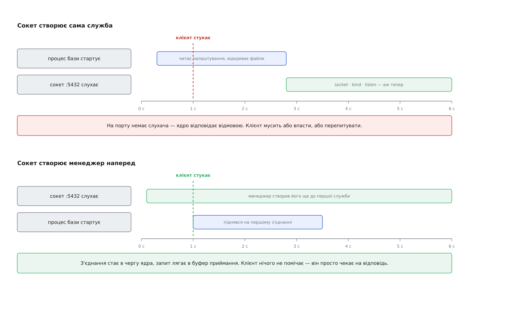
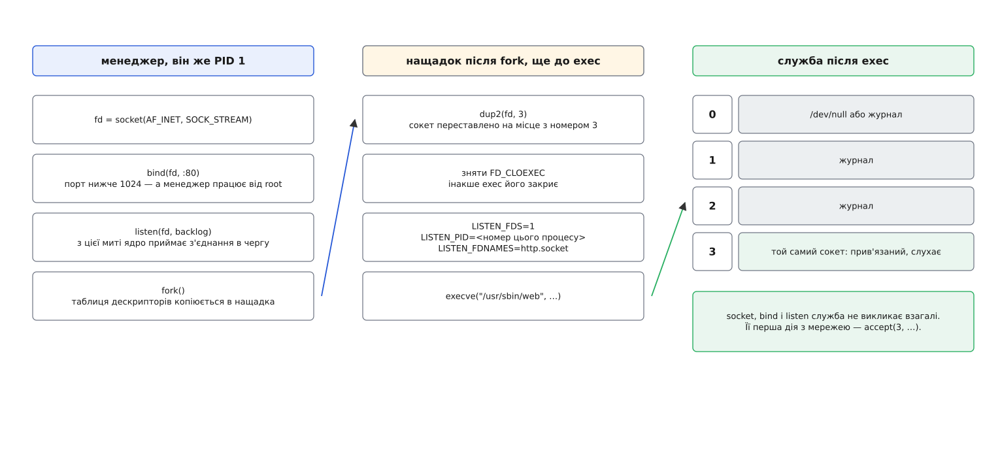
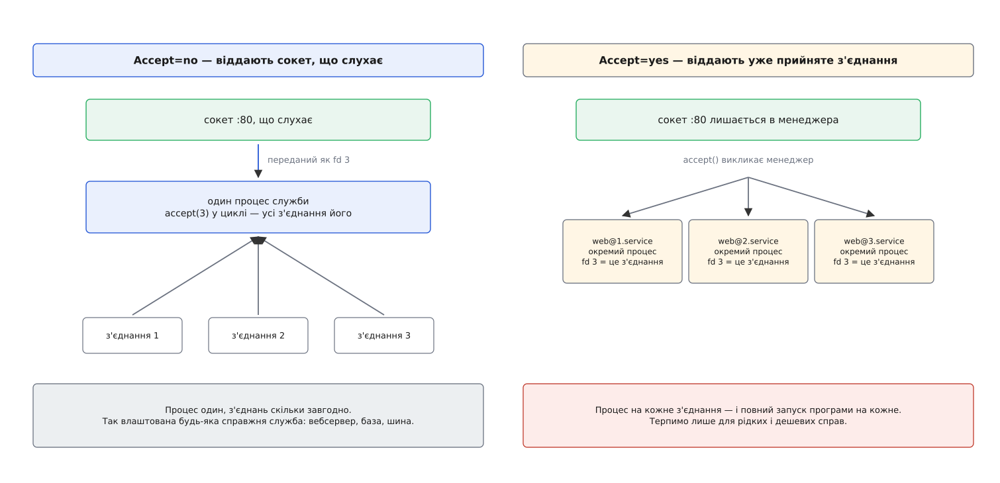

# Активація за сокетом

<preknowlist>
- [Файловий дескриптор](root:sys-unix/file-descriptor) — процес називає відкритий ресурс невеликим числом, і таблиця цих чисел належить самому процесові.
- [Сокет як дескриптор](root:sys-unix/socket-as-descriptor) — точка зв'язку теж є дескриптором; сокет, що слухає, і сокет окремого з'єднання — різні об'єкти.
- [exec: заміна образу](root:sys-unix/exec-semantics) — виклик підміняє код усередині вже наявного процесу; частина ресурсів заміну переживає, частина — ні.
- [Аргументи й змінні оточення](root:sys-unix/argv-and-environment) — набір рядків, який програма дістає під час запуску й передає далі своїм нащадкам.
- [systemd: юніти, залежності, цілі](root:sys-unix/systemd-model) — служби описані файлами-юнітами, а між юнітами оголошують залежності й порядок.
- [Роль init і особливість PID 1](root:sys-unix/init-and-pid1) — перший процес системи запускає решту й лишається їхнім предком до самого вимкнення.
</preknowlist>

Службу перезапустили — і за ту півсекунду, поки вона піднімалася, кілька клієнтів дістали відмову. У їхніх журналах «з'єднання відкинуто», хоча нічого не зламалося: програма просто ще не дійшла до того місця, де вона відкриває свій порт.

Питання тут не «як прискорити старт», а «чому взагалі відмова, а не очікування». Ядро не притримує прибульця до появи адресата, бо адресата в його розумінні не існує зовсім. Порт 5432 — не властивість машини й не запис у якомусь реєстрі, а об'єкт, який хтось мусив створити й попросити ядро приймати на нього з'єднання. Немає об'єкта — немає й черги, куди покласти того, хто прийшов; чесна відповідь одна — відмова.

Отже, все впирається в те, хто цей об'єкт створює. Зазвичай — сама служба, першими своїми діями: просить у ядра сокет, прив'язує його до адреси, каже слухати. Звідси тягнуться геть усі неприємності, які ми звикли вважати законом природи. Раз сокет робить служба — сокет живе рівно стільки, скільки живий її процес. Перезапуск процесу означає зникнення точки зустрічі. Порядок старту служб означає порядок появи точок зустрічі, і той, хто прокинувся раніше за свою залежність, натикається на порожнє місце.

Але в цьому зв'язку немає ніякої необхідності. Створення сокета — три звичайні виклики, доступні будь-якому процесові з відповідними правами, і ядро ніде не записує, хто саме потім викличе `accept()`. Дескриптор, що вийшов із `listen()`, — така сама річ, як відкритий файл: його можна успадкувати, продублювати, передати іншому процесові. Той, хто створив сокет, і той, хто з нього працює, не зобов'язані бути одним процесом.

Розчепімо їх. Хай сокети створює не служба, а той, хто ніколи не перезапускається, — менеджер служб, він же перший процес системи. Тоді точка зустрічі існує від початку роботи системи й до вимкнення, незалежно від того, чи живий зараз процес, що її обслуговує. Це і є **активація за сокетом**.



*Обидві смуги показують ту саму базу, що піднімається дві з половиною секунди. Різниця лише в тому, хто створив сокет — і цього досить, щоб відмова перетворилася на очікування.*

## Чому клієнт нічого не помічає

Твердження «клієнт просто почекає» виглядає надто зручним, тож розберімо, чим воно тримається.

Коли на сокеті викликано `listen()`, ядро заводить під нього чергу. Установлення з'єднання воно доводить до кінця **саме**, без участі програми: обмінюється пакетами з клієнтом і кладе готове з'єднання в цю чергу. Виклик `connect()` у клієнта повертає успіх у цю мить — не тоді, коли сервер зробить `accept()`, а тоді, коли ядро сервера завершило рукостискання. Клієнт, упевнений, що з'єднався, надсилає запит; запит лягає в буфер приймання того ж таки з'єднання. Усе це відбувається, поки процесу служби може не існувати взагалі.

Пізніше служба стартує, викликає `accept()` — і дістає з'єднання, яке чекало на неї, разом із уже надісланим запитом. З погляду клієнта не сталося нічого особливого: відповідь прийшла трохи пізніше, ніж могла б. Механіку черг і те, чим відрізняється черга напівустановлених з'єднань від черги готових, розкладено в [окремій темі про сокети в Linux](root:sys-unix/socket-api-linux).

Тут же лежить і чесна межа цієї вигоди. Затримка не зникла — вона змінила вигляд. Була миттєва відмова, стало очікування, а очікування впирається у дві скінченні величини. Перша — глибина черги: коли вона повна, ядро починає відкидати нових, і відмова повертається. Друга — терпіння клієнта: якщо служба піднімається тридцять секунд, а клієнт чекає на відповідь п'ять, він однаково зазнає невдачі, тільки помилка буде інша — не «відкинуто», а «час вичерпано». Активація за сокетом прибирає відмови на **коротких** проміжках безслужбовості, і саме тому вона добре працює на перезапусках і на старті системи, а не як спосіб не думати про час запуску.

> 🔧 **Навіщо це.** Коли після оновлення пакета в журналі клієнта видно сплеск «connection refused», перший корисний крок — подивитися, хто володіє сокетом. Якщо сокет створює сама служба, вікно відмови дорівнює часу її старту, і жодне налаштування клієнта цього не прибере. Якщо сокетом володіє менеджер, вікно відмови нульове, а бачите ви натомість короткий стрибок затримки — і це вже зовсім інша розмова з тим, хто скаржиться.

## Як дескриптор переходить із рук у руки

Лишилося найцікавіше: менеджер тримає дескриптор у **своїй** таблиці, а працювати з ним має інший процес. Числа в таблицях дескрипторів у різних процесів незалежні, тож просто сказати «візьми сімнадцятий» не вийде.

Механізм тут не новий і не спеціальний. Коли процес розмножується, нащадок дістає копію таблиці дескрипторів — ті самі числа, що вказують на ті самі об'єкти ядра. Заміна образу програми цю таблицю не чистить: дескриптор переживає `exec`, якщо на ньому не стоїть позначка «закрити під час заміни образу». Отже, шлях уже є, треба лише домовитися про дві речі: **за яким числом** служба знайде сокет і **звідки дізнається**, що він там є.

Про число домовилися найпростіше з можливого. Числа 0, 1 і 2 за давньою угодою зайняті стандартними потоками, тож перший переданий сокет кладуть під номером 3, другий — 4, і далі поспіль. Менеджер після розмноження, ще до заміни образу, переставляє потрібні дескриптори на ці місця й знімає з них позначку «закрити під час заміни».

Про сам факт передавання домовилися через оточення. Командний рядок належить самій програмі — його пише автор юніта, і менеджер не має права дописувати туди своє. Оточення ж — окремий канал, який теж переживає заміну образу. Менеджер ставить у нього кількість переданих дескрипторів, а разом із нею — номер процесу, якому вони призначені.



*Ліворуч і посередині — один і той самий процес до й після розмноження; праворуч — він же після заміни образу. Нового сокета ніде не з'являється: усі три колонки говорять про той самий об'єкт ядра.*

Навіщо номер процесу — з'ясовується, щойно спитати, що станеться далі. Оточення успадковується всім піддеревом: служба запустить помічника, той запустить свого — і кожен побачить у себе змінну «тобі передано один сокет», хоча передали її предкові. Тому перевірка обов'язкова: змінна з номером процесу мусить збігтися з власним номером, інакше передавання стосується не тебе. З тієї самої причини бібліотечна функція, прочитавши дескриптори, прибирає ці змінні з оточення й ставить на самі дескриптори позначку «закрити під час заміни образу» — щоб далі вниз нічого не поїхало.

Точні імена змінних, їхній формат, іменування дескрипторів і повний перелік того, що менеджер обіцяє службі, зібрано в [описі самого протоколу передавання](root:sys-unix/socket-activation/api-listen-fds.md) — це коротка й повністю формальна домовленість, яку варто мати перед очима, коли пишете службу.

Ось як виглядає підхоплення в коді. Бібліотека менеджера тут не потрібна — весь протокол зводиться до двох змінних оточення:

:::tabs
```c
#include <stdlib.h>
#include <string.h>
#include <unistd.h>
#include <stdio.h>

#define LISTEN_FDS_START 3

/* Звичайний код служби, до протоколу передавання не причетний. */
int  open_and_listen(int port);
void serve_forever(int fd);

/* Повертає кількість переданих сокетів; 0 — нам нічого не передавали. */
static int inherited_sockets(void)
{
    const char *pid = getenv("LISTEN_PID");
    const char *cnt = getenv("LISTEN_FDS");
    char self[32];

    if (!pid || !cnt)
        return 0;

    snprintf(self, sizeof self, "%ld", (long) getpid());
    if (strcmp(pid, self) != 0)   /* змінна дісталася нам у спадок від предка */
        return 0;

    return atoi(cnt);
}

int main(void)
{
    int n = inherited_sockets();
    int fd;

    if (n == 1) {
        fd = LISTEN_FDS_START;          /* сокет уже прив'язаний і слухає */
    } else {
        fd = open_and_listen(8080);     /* запустили руками — робимо сокет самі */
    }

    serve_forever(fd);
}
```
```go
package main

import (
	"net"
	"os"
	"strconv"
)

const listenFDsStart = 3

// Повертає слухача, переданого менеджером, або nil, якщо не передавали.
func inheritedListener() net.Listener {
	if os.Getenv("LISTEN_PID") != strconv.Itoa(os.Getpid()) {
		return nil // змінна дісталася нам у спадок від предка
	}
	if n, err := strconv.Atoi(os.Getenv("LISTEN_FDS")); err != nil || n != 1 {
		return nil
	}

	f := os.NewFile(listenFDsStart, "listen-fd") // сокет уже прив'язаний і слухає
	l, err := net.FileListener(f)
	if err != nil {
		return nil
	}
	return l
}

func main() {
	l := inheritedListener()
	if l == nil {
		l, _ = net.Listen("tcp", ":8080") // запустили руками — робимо сокет самі
	}
	serveForever(l)
}
```
:::

Друга гілка в обох варіантах — не ввічливість, а вимога. Служба, яка вміє лише підхоплювати готовий сокет, стає непридатною ніде, крім свого менеджера: ні запустити з-під налагоджувача, ні покласти в контейнер із іншим наглядачем. Ціна цієї гілки — десять рядків, ціна її відсутності — прив'язка до одного середовища назавжди. Повністю робочу службу з парою юнітів, які її запускають, розібрано в [окремій збірці](root:sys-unix/socket-activation/proj-activated-service.md).

## Що з цього виростає

Одна перестановка — сокет належить менеджерові, а не службі — дає чотири різні наслідки, і кожен випливає зі своєї причини.

**Порядок старту перестає бути питанням.** Менеджер створює всі оголошені сокети наперед, однією порцією, і лише потім береться запускати служби. З цієї миті будь-яка служба може звертатися до будь-якої, не питаючи, чи та вже піднялася: точка зустрічі є в усіх. Взаємні залежності, які раніше треба було вишиковувати в ланцюжок і які іноді утворювали цикл, зводяться до паралельного старту, де кожен чекає рівно тоді, коли справді впирається в чужу неготовність.

**З'являється лінива служба.** Раз сокет живе без процесу, процес можна не запускати доти, доки на сокет ніхто не прийшов. Менеджер стежить за сокетом сам і піднімає службу на першому ж з'єднанні. Рідко вживані речі — служба друку, сховище ключів, налагоджувальний інтерфейс — перестають займати пам'ять у машині, де ними користуються двічі на місяць. Симетрична половина: така служба може завершитися після простою, і сокет від цього нікуди не подінеться, тож наступний клієнт підніме її знову.

**Перезапуск перестає рвати з'єднання.** Стару службу зупинили, нову ще не запустили — сокет слухає весь цей час, бо він взагалі не її. Клієнти, що приходять у проміжку, стають у чергу й дочікуються. Але межу треба назвати чітко: рятуються **нові** з'єднання, а ті, що служба вже прийняла й тримала в собі, гинуть разом із процесом. Це прибирання відмов, а не безшовна заміна: користувач із відкритим запитом побачить обрив.

**Прив'язку до привілейованої адреси робить не служба.** Порти, менші за 1024, ядро не дає прив'язувати кому завгодно, а сокет у системному каталозі не покласти без прав на цей каталог. Коли прив'язує менеджер, ці права потрібні йому — а він і так їх має. Служба ж дістає готовий дескриптор і може працювати від непривілейованого користувача, без жодної [спеціальної можливості](root:sys-unix/capabilities), і навіть від [облікового запису, створеного рівно на час її роботи](root:sys-unix/dynamic-service-users). Одна з небагатьох ситуацій, де зручність і безпека тягнуть в один бік.

## Дві моделі роздачі

Менеджер може віддати службі дві різні речі, і плутати їх не можна.



*Ліва схема віддає можливість приймати, права — уже прийняте з'єднання. Ліва — це те, як влаштована звичайна служба; права — сумісність зі старим способом.*

Перша модель — передати **сокет, що слухає**. Служба запускається один раз, дістає дескриптор і сама крутить цикл приймання, як робила б і без менеджера. Це поведінка за замовчуванням і єдина розумна для всього, що обслуговує багато з'єднань: вебсервер, база, шина повідомлень. Усередині така служба зазвичай і не приймає в лоб, а чекає готовності відразу на багатьох дескрипторах — механізм цього чекання описано [окремо](root:sys-unix/select-poll-epoll).

Друга модель — приймати з'єднання менеджером і передавати службі **вже прийняте з'єднання**, запускаючи на кожне окремий примірник. Тоді програма взагалі не знає слова «сокет»: вона читає з дескриптора запит і пише відповідь, а після відповіді завершується. Виглядає марнотратно — і є марнотратно: на кожне з'єднання припадає повний запуск програми. Але саме так працювала перша реалізація цієї ідеї, і завдяки цій моделі старі програми, написані під неї, запускаються сьогодні без жодної правки. Звідки вона взялася і як від однієї програми на з'єднання дійшли до сокетів, створених наперед, — [окрема розповідь](root:sys-unix/socket-activation/hist-from-inetd.md).

Розділ між моделями простий: якщо запуск програми дорожчий за обробку одного запиту — потрібна перша.

## Де це ламається

Механізм невеликий, і всі його пастки ростуть із того самого кореня: сокет і служба тепер мають різні життєві цикли.

**Служба, яка все одно робить свій сокет.** Найчастіша помилка: програма підхопила дескриптор, а потім за старою звичкою викликала прив'язку до адреси — і дістала помилку «адреса вже зайнята», бо адресу зайняв менеджер тим самим сокетом. Переданий дескриптор приходить уже прив'язаним і в стані слухання; єдине, що з ним роблять, — приймають з'єднання.

**Служба, яка демонізується.** Класичне подвійне розмноження з відходом у тло розриває зв'язок із менеджером і ламає перевірку за номером процесу: сокет опиняється в процесі, номер якого не збігається зі змінною оточення. Служба під менеджером не йде у тло взагалі; чому демонізація виникла історично і чому вона більше не потрібна — [окрема тема](root:sys-unix/daemonize).

**Отруйний запит.** Служба падає на певному запиті — а цей запит лежить у черзі сокета, і його дістане наступний примірник, і наступний. Виходить цикл перезапусків, який зовні виглядає як «служба не стартує», хоча стартує вона чудово. Обмеження на частоту перезапусків, які описано в [політиці перезапуску](root:sys-unix/service-lifecycle), тут не лікують причину, а лише зупиняють карусель.

**Зупинили службу, а порт відповідає.** Юніт сокета й юніт служби — два різні об'єкти. Зупинка служби лишає сокет слухати, тож наступне з'єднання підніме її знову; щоб машина справді перестала відповідати на порту, зупиняти треба сокет. Це не примха реалізації, а пряме продовження головної думки: сокет тепер не належить службі.

**Черга скінченна.** Її глибину задають при створенні сокета, а зверху її мовчки обрізає загальносистемне обмеження ядра — одне з тих [налаштувань](root:sys-unix/sysctl-tunables), про які згадують, лише коли впираються. Служба, що піднімається довго під навантаженням, переповнить чергу, і відмови повернуться.

Окремо варто знати, що для дейтаграмних сокетів усе те саме, тільки без з'єднань: з'єднуватися нема з чим, і активацію спричиняє перший пакет, який до того просто лежить у буфері приймання. Служба, яку підняли, мусить його звідти вичитати — інакше менеджер вважатиме, що робота лишилася, і підніматиме її знову й знову.

## Та сама думка, доведена до кінця

Якщо володіти станом має той, хто не перезапускається, то чому лише сокетом?

Служба може передати менеджерові на зберігання **будь-які** свої дескриптори — з'єднання, файли, дескриптор таймера — і забрати їх назад після власного перезапуску. Той самий канал, той самий спосіб доставки: під час нового запуску вони приїдуть звичайними числами разом із рештою, тільки цього разу їхнє походження — не сокет, оголошений в юніті, а сховок, куди служба поклала їх сама.

Це помітно міняє те, що взагалі означає «перезапустити службу». Уже прийняті з'єднання переставали бути приреченими: служба, яка перед виходом віддає їх на зберігання, після оновлення продовжує роботу з тими самими клієнтами. Межа тут інша, ніж у сокетів, і про неї варто пам'ятати: дескриптор зберігся, а от стан **усередині** протоколу — на якому кроці розмови ви були, що вже надіслали — не зберігає ніхто. Тримати цей стан у формі, придатній для передавання самому собі в майбутнє, — робота служби, і саме вона визначає, наскільки далеко можна зайти цією дорогою.

Спільний висновок з усього виходить один. Точкою зустрічі в системі є не процес, а іменований об'єкт ядра, і зв'язок між ними — питання домовленості, а не природи. Щойно ми дозволяємо цим двом мати різну тривалість життя, як більшість запитань про порядок старту, про відмови під час оновлення й про права на привілейовані адреси перестають бути запитаннями про служби й стають запитаннями про те, хто чим володіє.
