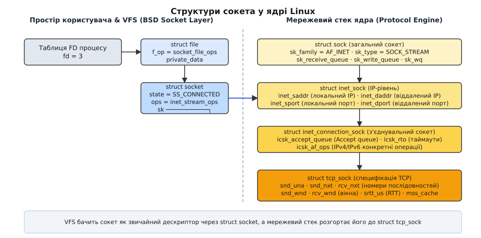
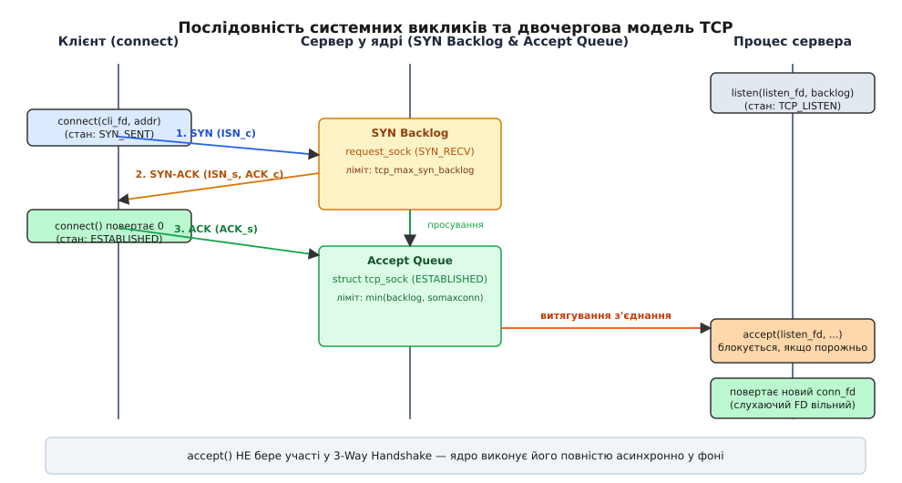
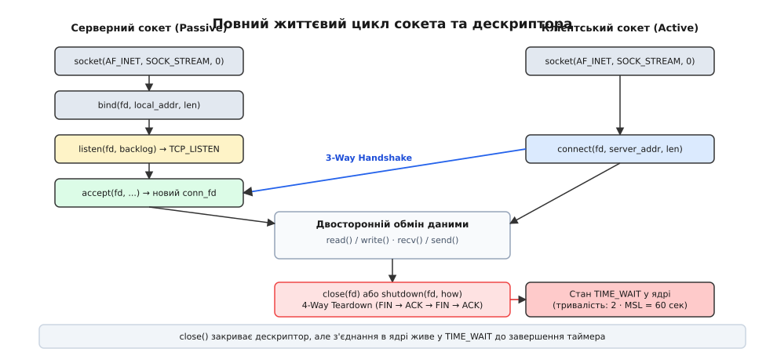

# Сокети в Linux: від дескриптора до з'єднання

<preknowlist>
- [Сокет як дескриптор](root:sys-unix/socket-as-descriptor) — як VFS загортає мережеву кінцеву точку у файловий дескриптор, та чому сокети мають власну таблицю операцій `socket_file_ops`.
- [Системний виклик](root:sys-unix/syscall-mechanics) — механізм переходу у простір ядра, передача аргументів та повернення помилок через `errno`.
- [TCP проти UDP](root:com-transport/tcp-vs-udp) — різниця між гарантованим потоком байтів зі станом та беззв'язними датаграмами.
- [Внутрішньоядерний VFS](root:sys-unix/vfs-layer) — концепції `struct file`, `inode` та таблиць файлових операцій у ядрі Linux.
</preknowlist>

Коли процес відкриває звичайний файл на диску за допомогою системного виклику `open()`, шлях у файловій системі вказує на вже наявний об'єкт. Файл має постійний розмір, вміст, що лежить на блоковому пристрої, та єдину позицію зсуву (`f_pos`). Мережеве з'єднання позбавлене цих властивостей. Доки процес не попросив створити кінцеву точку, жодного мережевого об'єкта не існує, у дереві каталогів немає шляху, який позначав би розмову з віддаленим хостом, а сама розмова вимагає узгодження двох сторін, динамічного відстеження станів та двосторонніх буферів.

Щоб вписати цей динамічний мережевий зв'язок у класичну Unix-концепцію «усе є файлом», ядро Linux впроваджує двошарову об'єктну абстракцію між таблицею файлових дескрипторів процесу та мережевим стеком. Верхній шар — `struct socket` — відповідає перед VFS і живе у псевдофайловій системі `sockfs`; нижній — `struct sock` — тримає стан протоколу, черги пакетів і таймери повторної відправки.

---

## 1. Подвійна природа сокета у ядрі: `struct socket` проти `struct sock`

Головний архітектурний виклик мережевого введення-виведення полягає в тому, що один і той самий сокет мусить задовольняти дві абсолютно різні системи вимог. З одного боку, для VFS (Virtual File System) сокет повинен виглядати як звичайний файловий дескриптор — з підтримкою системних викликів `read()`, `write()`, `close()`, `poll()` та таблиці файлових дескрипторів процесу `struct files_struct`. З іншого боку, для мережевого стеку той самий сокет є складним автоматом станів протоколу TCP/UDP із чергами пакетів, таймерами повторної відправки, вікнами перевантаження та адресною прив'язкою.

Спроба об'єднати ці два завдання в одній C-структурі призвела б до порушення принципу єдиної відповідальності та роздуття пам'яті. Якби кожен мережевий сокет у ядрі утримував повну інформацію про VFS-файли, VFS-дерево, права доступу та супутні об'єкти `inode`, то при масштабуванні до сотень тисяч паралельних підключень ядро вичерпало б пам'ять на службові заголовки. Тому ядро Linux розділяє сокет на дві чітко розмежовані структури даних:

1. **`struct socket` (BSD Socket Layer)**: Верхній VFS-шар, орієнтований на простір користувача. Він містить інформацію про стан VFS-дескриптора (`state`, прапорці `flags`), чергу очікування процесів `socket_wq` та вказівник на таблицю високорівневих операцій `proto_ops` (наприклад, `inet_stream_ops`). Усі системні виклики API сокетів насамперед працюють із цим шаром. Пам'ять під `struct socket` виділяється у спеціалізованій псевдофайловій системі `sockfs`.
2. **`struct sock` (Protocol Engine)**: Нижній мережевий шар ядра. Він не знає нічого про файлові дескриптори чи VFS. Ця структура відповідає за обробку конкретного мережевого протоколу, утримує черги мережевих буферів (`sk_receive_queue`, `sk_write_queue`), таймери TCP, зворотні виклики сповіщення (`sk_data_ready`, `sk_write_space`) та лічильники помилок. Виділення пам'яті здійснюється з окремого SLAB-кешу ядра, який `proto_register()` створює за іменем протоколу — для TCP цей кеш видно у `/proc/slabinfo` як `TCP`.


*Мережевий шар ядра відокремлює VFS-представлення сокета (struct socket) від протокольного автомата станів (struct tcp_sock).*

Для конкретного протоколу TCP базовий об'єкт `struct sock` розширюється через механізм вкладених C-структур за принципом спадкування: `struct sock` → `struct inet_sock` → `struct inet_connection_sock` → `struct tcp_sock`. Кожен наступний шар додає поля, необхідні для відповідного рівня абстракції: `inet_sock` додає IP-адреси та порти, `inet_connection_sock` додає черги `LISTEN` та таймаути повтору, а `tcp_sock` містить послідовності порядкових номерів (Sequence Numbers `snd_nxt`, `rcv_nxt`), оцінки RTT та параметри алгоритму керування перевантаженням (CUBIC або BBR).

Історичний процес формування цього розділення від версії 4.2BSD до сучасних версій ядра детально розкрито у матеріалі [📜 Від BSD Sockets 4.2BSD до мережевого стеку Linux](root:sys-unix/socket-api-linux/hist-bsd-sockets-to-linux.md).

```c
/* Концептуальна схема зв'язку об'єктів сокета у ядрі */
struct file {
    const struct file_operations *f_op; /* Вказує на socket_file_ops */
    void *private_data;                  /* Вказує на struct socket */
};

struct socket {
    socket_state state;                 /* SS_UNCONNECTED, SS_CONNECTED */
    struct file *file;                  /* Зворотний вказівник на struct file */
    struct sock *sk;                    /* Вказівник на мережевий struct sock */
    const struct proto_ops *ops;        /* inet_stream_ops / inet_dgram_ops */
};

struct sock {
    struct sock_common __sk_common;     /* Адреси, порти, протокол */
    struct socket *sk_socket;           /* Зворотний вказівник на struct socket */
    struct sk_buff_head sk_receive_queue;/* Черга вхідних кадрів */
    struct sk_buff_head sk_write_queue;  /* Черга вихідних кадрів */
};
```

Зв'язок між цими об'єктами двосторонній: `file->private_data` вказує на `struct socket`, `socket->sk` вказує на `struct sock`, а `sock->sk_socket` вказує назад на `struct socket`. Коли мережеве переривання приносить новий пакет від мережевої карти, підсистема NAPI та softirq обробляє його на рівні `struct sock` і через зворотний виклик `sk_data_ready` будить процеси, що очікують на черзі `socket->wq`.

---

## 2. Створення сокета: внутрішня механіка `socket()`

Створення кінцевої точки комунікації починається із системного виклику `socket(domain, type, protocol)`.

```c
int fd = socket(AF_INET, SOCK_STREAM, 0);
```

Коли програма користувача виконує цей виклик, відбуваються наступні кроки в ядрі (через точку входу `sys_socket()` або `__sys_socket()`):

1. **Виділення незайнятого дескриптора**: Викликається функція `get_unused_fd_flags(flags)`, яка шукає найменший вільний індекс у таблиці дескрипторів поточного процесу (`current->files`).
2. **Виділення `struct socket`**: Викликається `sock_alloc()`, яка виділяє з ядра нову структуру `struct socket` та супутній VFS-вузол pseudo-FS `sockfs`.
3. **Пошук сімейства протоколів**: За аргументом `domain` (`AF_INET` = 2) ядро звертається до глобального масиву `net_families[]`. Для IPv4 викликається зареєстрований конструктор `inet_create()`.
4. **Пошук сокетної операції**: `inet_create()` шукає у внутрішній таблиці `inetsw` відповідність для пари `(type, protocol)`. Для `SOCK_STREAM` та протоколу `0` (або `IPPROTO_TCP`) обирається відповідний запис `struct inet_protosw` з масиву `inetsw_array`, який призначає для `struct socket` таблицю викликів `inet_stream_ops`, а для протоколу — `tcp_prot`.
5. **Створення `struct sock`**: Викликається `sk_alloc()`, яка виділяє з SLAB-кешу `tcp_sock` пам'ять під специфічний для TCP об'єкт `struct tcp_sock`, ініціалізує буфери прийому та передачі на основі системних параметрів `net.ipv4.tcp_rmem` та `net.ipv4.tcp_wmem`, а також призначає початковий стан TCP: `TCP_CLOSED`.
6. **Зв'язування з VFS**: Створюється екземпляр `struct file` через `sock_alloc_file()`. Його полю `f_op` присвоюється таблиця операцій `socket_file_ops` (яка спрямовує виклики `read`/`write` на мережеві функції `sock_read_iter`/`sock_write_iter`), а полю `private_data` — вказівник на створений `struct socket`.
7. **Реєстрація дескриптора**: Отриманий `struct file` записується у таблицю дескрипторів процесу за раніше виділеним індексом `fd`, і це число повертається користувачу.

> 🔧 **Навіщо це.** Прапорці `SOCK_CLOEXEC` та `SOCK_NONBLOCK`, додані в Linux 2.6.27 безпосередньо в параметр `type` виклику `socket()`, вирішують критичну проблему стану гонитви (race condition) у багатопотокових програмах. Якщо створювати сокет звичайним `socket()`, а потім окремо викликати `fcntl(fd, F_SETFD, FD_CLOEXEC)`, то між цими двома викликами інший потік може викликати `fork()` та `exec()`. В результаті новий процес успадкує відкритий сокет. Атомарне створення сокета через `socket(AF_INET, SOCK_STREAM | SOCK_CLOEXEC, 0)` повністю усуває цю вразливість.

---

## 3. Локальна прив'язка адреси: виклик `bind()` та хеш-таблиці байндингу

Після створення сокет існує у ядрі, але він позбавлений мережевої ідентичності: у нього немає ані локальної IP-адреси, ані порту. Для серверних застосунків критично важливо зайняти відомий порт, щоб клієнти могли знайти службу. Цю задачу виконує системний виклик `bind()`.

```c
struct sockaddr_in addr;
memset(&addr, 0, sizeof(addr));
addr.sin_family = AF_INET;
addr.sin_addr.s_addr = htonl(INADDR_ANY); /* 0.0.0.0 */
addr.sin_port = htons(8080);

bind(sockfd, (struct sockaddr *)&addr, sizeof(addr));
```

Виклик `bind()` транслюється у ядрі у функцію `inet_bind()`, яка виконує серію перевірок та реєструє сокет у внутрішніх хеш-таблицях ядра:

- **Перевірка прав привілейованих портів**: Якщо вказаний порт менший за 1024 (так звані well-known ports), ядро перевіряє наявність можливості `CAP_NET_BIND_SERVICE` у структурі облікових даних процесу `struct cred`. Без цього права виклик повертає помилку `EACCES`.
- **Перевірка локальної адреси**: Ядро перевіряє, чи належить вказана IP-адреса хоча б одному з мережевих інтерфейсів системи (або дорівнює `INADDR_ANY` / `0.0.0.0`, що означає слухання на всіх інтерфейсах).
- **Хеш-таблиця `inet_hashinfo`**: Для швидкого пошуку сокетів при надходженні пакетів ядро Linux використовує систему хеш-таблиць `inet_hashinfo`. Вона включає хеш-таблицю байндингу `bhash` (bind hash table) та хеш-таблицю активних з'єднань `ehash` (established hash table).

### Таблиця конфліктів та прапорці `SO_REUSEADDR` / `SO_REUSEPORT`

Кожен порт у хеш-таблиці `bhash` представлений структурою `struct inet_bind_bucket`. Коли декілька сокетів намагаються прив'язатися до того самого порту, ядро аналізує прапорці сокета:

1. **Без прапорців (за замовчуванням)**: Якщо порт вже зайнятий іншим сокетом у будь-якому стані, `bind()` негайно завершується з помилкою `EADDRINUSE`.
2. **`SO_REUSEADDR`**: Дозволяє прив'язатися до порту, який знаходиться у стані `TIME_WAIT` (після закриття попереднього сервера). Це усуває паузу тривалістю у 60 секунд при перезапуску сервера. Крім того, `SO_REUSEADDR` дозволяє прив'язати декілька сокетів до одного порту, якщо вони прив'язуються до *різних* конкретних IP-адрес (наприклад, `192.168.1.1:8080` та `10.0.0.1:8080`).
3. **`SO_REUSEPORT`**: Дозволяє кільком незалежним процесам або потокам прив'язуватися до *абсолютно однакової* комбінації IP та порту (наприклад, п'ять процесів Nginx слухають `0.0.0.0:8080`). Ядро тримає окремі сокети й при надходженні нового SYN-пакета саме балансує навантаження: обчислює хеш від 4-tuple пакета і направляє з'єднання в один із сокетів. Це повністю усуває проблему «громового стада» (thundering herd problem) при викликах `accept()`.

---

## 4. Перехід у пасивний режим: виклик `listen()` та двочергова архітектура

Виклик `bind()` лише призначає адресу, але сокет залишається активним — він ще не готовий приймати підключення. Перехід у статус пасивного сервера виконує системний виклик `listen()`.

```c
listen(sockfd, backlog);
```

У ядрі функція `inet_listen()` змінює внутрішній стан сокета `sk->sk_state` з `TCP_CLOSED` на `TCP_LISTEN`. Однак головна робота `listen()` полягає в ініціалізації **двочергової архітектури з'єднань**.

На відміну від багатьох класичних операційних систем, у Linux для сокета у стані `LISTEN` функціонують дві окремі черги:

```
                  [ Вхідний SYN пакет ]
                            │
                            ▼
          ┌───────────────────────────────────┐
          │            SYN Backlog            │
          │  (з'єднання у стані SYN_RECV)     │
          │   зберігає request_sock об'єкти   │
          └───────────────────────────────────┘
                            │
              [ Отримано фінальний ACK ]
                            │
                            ▼
          ┌───────────────────────────────────┐
          │           Accept Queue            │
          │  (з'єднання у стані ESTABLISHED)  │
          │    повноцінні struct tcp_sock     │
          └───────────────────────────────────┘
                            │
               [ Виклик accept() процесів ]
                            │
                            ▼
             [ Повертається новий client_fd ]
```

### 1. SYN Backlog (Черга неповних з'єднань)
Коли від віддаленого клієнта надходить перший пакет SYN, ядро ще не створює повноцінний `struct tcp_sock` (який займає понад 2 КіБ оперативної пам'яті). Замість цього ядро виділяє мінімальну структуру `struct request_sock` (розміром близько 224 байтів), записує її в SYN Backlog та надсилає у відповідь пакет SYN-ACK. З'єднання перебуває у стані `TCP_SYN_RECV`.

Максимальний розмір цієї черги обмежується системним параметром sysctl `net.ipv4.tcp_max_syn_backlog`.

### 2. Accept Queue (Черга готових з'єднань)
Коли клієнт відповідає фінальним пакетом ACK, рукостискання вважається завершеним. Ядро вилучає `request_sock` із SYN Backlog, викликає функцію `tcp_v4_syn_recv_sock()`, яка створює повноцінний `struct tcp_sock`, переводить стан у `TCP_ESTABLISHED` і поміщає готовий сокет у чергу `icsk_accept_queue` (Accept Queue).

Максимальний розмір Accept Queue визначається формулою:

```
AcceptQueueLimit = min(backlog, net.core.somaxconn)   [обчислення максимального розміру черги готових з'єднань]
```

де `backlog` — це аргумент, переданий у системний виклик `listen(fd, backlog)`, а `somaxconn` — системний ліміт ядра (значення за замовчуванням у сучасних дистрибутивах — 4096).

### Захист від SYN Flood та механізм SYN Cookies

При DDoS-атаках типу SYN Flood нападник генерує мільйони SYN-пакетів із підробленими IP-адресами. SYN Backlog швидко заповнюється, позбавляючи легітимних користувачів можливості підключитися.

Для нейтралізації цієї загрози ядро Linux підтримує механізм **SYN Cookies** (`net.ipv4.tcp_syncookies = 1`). Коли SYN Backlog повністю заповнюється, ядро припиняє виділяти пам'ять під `request_sock`. Замість цього воно пакує мінімальний стан з'єднання у 32 біти власного початкового номера послідовності пакета SYN-ACK: кілька старших бітів займає лічильник часу, ще три — індекс узгодженого MSS у таблиці типових значень, а решту — криптографічний хеш від пари IP-адрес, пари портів, лічильника часу й таємного ключа ядра.

Коли легітимний клієнт повертає ACK, ядро перевіряє хеш і створює повноцінний сокет «на льоту» без зберігання стану між кроками.

### Що відбувається при переповненні Accept Queue?

Якщо програма не встигає викликати `accept()`, і черга Accept Queue повністю заповнюється, поведінка ядра регулюється параметром sysctl `net.ipv4.tcp_abort_on_overflow`:

- **`tcp_abort_on_overflow = 0` (за замовчуванням)**: Ядро **ігнорує** фінальний ACK від клієнта. З точки зору клієнта з'єднання вже `ESTABLISHED`, але сервер не додає його до Accept Queue. Клієнт намагатиметься надсилати дані, сервер їх ігноруватиме, що змусить клієнта повторювати спроби. Це дає серверному застосунку час розгребти чергу `accept()`.
- **`tcp_abort_on_overflow = 1`**: Сервер негайно надсилає клієнту пакет `TCP RST`, жорстко розриваючи з'єднання: клієнт, який уже вважав його встановленим, дістає `ECONNRESET`.

Повний перелік параметрів `sysctl` та сигнатур викликів зібрано у довіднику [📋 Повний довідник системних викликів Socket API, ядерних структур та sysctl](root:sys-unix/socket-api-linux/api-socket-syscalls-and-structures.md).

---

## 5. Триетапне рукостискання, `connect()` та `accept()`

Процес встановлення з'єднання реалізує класичний алгоритм 3-Way Handshake, розділений між клієнтським викликом `connect()`, асинхронним обробником переривань ядра на сервері та серверним викликом `accept()`.


*Послідовність 3-Way Handshake та переміщення з'єднань між SYN Backlog та Accept Queue у ядрі Linux.*

### Етап 1: Ініціація клієнтом (`connect()`)

Клієнт створює сокет і викликає `connect(cli_fd, &server_addr, len)`:

1. **Автоматична прив'язка (Autobind)**: Якщо сокет ще не прив'язаний до портів викликом `bind()`, ядро автоматично викликає `inet_autobind()`, обираючи вільний ефемерний порт із діапазону `net.ipv4.ip_local_port_range` (за замовчуванням 32768–60999).
2. **Генерація ISN**: Ядро генерує початковий номер послідовності (Initial Sequence Number, ISN) для клієнта за допомогою криптографічного генератора на основі SipHash від 4-tuple та локального секретного ключа ядра. Це унеможливлює передбачення ISN зловмисниками.
3. **Узгодження TCP Options**: У пакеті SYN клієнт передає свої параметри TCP Options: MSS (Maximum Segment Size), Window Scale (масштабування вікна), SACK Permitted (вибіркове підтвердження) та Timestamps.
4. **Надсилання SYN**: Клієнт створює пакет із прапорцем SYN, переводить стан `tcp_sock` у `TCP_SYN_SENT` і додає таймер повторної відправки.
5. **Блокування**: За замовчуванням `connect()` блокує потік користувача, доки не надійде відповідь або не закінчиться таймаут. У неблокувальному режимі `connect()` негайно повертає `-1`, а `errno` встановлюється в `EINPROGRESS`.

### Етап 2: Прийом SYN на сервері та відповідь SYN-ACK

Мережева карта сервера отримує пакет SYN і генерує переривання. Нижній шар ядра (NAPI / softirq) обробляє пакет:

1. **Пошук сокета**: Ядро шукає слухаючий сокет у хеш-таблиці за портом призначення.
2. **Перевірка SYN Backlog**: Якщо SYN Backlog не переповнений, ядро створює `struct request_sock`, записує туди параметри клієнта (ISN клієнта, MSS, Window Scale), поміщає його в SYN Backlog та змінює стан з'єднання на `TCP_SYN_RECV`.
3. **Надсилання SYN-ACK**: Сервер надсилає клієнту пакет із прапорцями SYN+ACK.

### Етап 3: Фінальний ACK та просування з'єднання

1. Клієнт отримує SYN-ACK, надсилає у відповідь фінальний пакет ACK, переводить свій сокет у стан `TCP_ESTABLISHED` і розбуджує виклик `connect()`, який повертає `0`.
2. Сервер отримує ACK. Ядро шукає відповідний `request_sock` у SYN Backlog (або відновлює стан із хешу SYN Cookie).
3. Якщо перевірка успішна, ядро створює повноцінний `struct tcp_sock`, копіює туди параметри, переводить стан у `TCP_ESTABLISHED`, переміщує об'єкт у **Accept Queue** і сповіщає чергу очікування `sk_data_ready`.

### Етап 4: Витяг з'єднання сервером (`accept()` / `accept4()`)

Слід чітко розуміти: **системний виклик `accept()` не бере жодної участі у триетапному рукостисканні TCP!** До моменту, коли процес викликає `accept()`, з'єднання вже повністю сформоване ядром у фоновому режимі переривань.

```c
int client_fd = accept4(listen_fd, (struct sockaddr *)&cli_addr, &len, SOCK_CLOEXEC);
```

Механіка `accept()` полягає у наступному:

1. Якщо Accept Queue порожня, `accept()` блокується (або повертає помилку `EAGAIN` / `EWOULDBLOCK`, якщо слухаючий сокет у неблокувальному режимі).
2. Якщо в Accept Queue є хоча б один готовий `struct sock`, ядро витягує його з черги.
3. Ядро створює новий `struct socket` та виділяє новий файловий дескриптор `client_fd`.
4. Новий дескриптор прив'язується до витягнутого `struct sock`, і саме він повертається користувачеві для подальшого обміну даними (`read`/`write`).
5. Оригінальний слухаючий дескриптор `listen_fd` залишається у стані `TCP_LISTEN` і продовжує накопичувати нові з'єднання в Accept Queue.

---

## 6. Завершення з'єднання: `close()` проти `shutdown()`

Мережеве з'єднання має два незалежні канали передачі даних: від клієнта до сервера (TX клієнта / RX сервера) та від сервера до клієнта (RX клієнта / TX сервера). Закриття з'єднання може бути як симетричним, так і одностороннім.


*Життєвий цикл сокета від створення до виходу із 2-MSL стану TIME_WAIT.*

### Різниця між `close()` та `shutdown()`

Часта помилка розробників — вважати `close()` та `shutdown()` синонімами. Вони працюють на різних рівнях операційної системи:

- **`close(fd)`**: Працює на рівні **VFS та лічильника посилань**. Виклик `close()` зменшує лічильник посилань `f_count` структури `struct file`. Якщо дескриптор був продубльований через `dup()`, `fork()` або переданий через Unix Domain Socket, реальне закриття сокета **не відбувається**, доки останній дублікат не буде закрито. Лише коли `f_count` досягає `0`, VFS викликає `sock_close()`, який ініціює 4-way TCP teardown.
- **`shutdown(fd, how)`**: Працює на рівні **протоколу TCP**, ігноруючи лічильник посилань VFS. Якщо процес викликає `shutdown(fd, SHUT_WR)`, ядро негайно формує та надсилає пакет `TCP FIN` віддаленій стороні, навіть якщо на цей дескриптор посилаються ще десять процесів після `fork()`.

### Режими `shutdown()`:
- `SHUT_RD`: Припиняє читання із сокета. Будь-які нові дані, що надходять від віддаленої сторони, мовчки скидаються ядром.
- `SHUT_WR`: Переводить з'єднання у напівзакритий стан (half-closed connection). Сервер надсилає `FIN`, повідомляючи клієнту: «я закінчив писати свої дані, але я все ще готовий читати твою відповідь».
- `SHUT_RDWR`: Припиняє і прийом, і передачу (надсилає `FIN` і закриває читання).

### 4-Way Teardown та стан `TIME_WAIT`

При повній зупинці з'єднання TCP виконує чотириетапний процес завершення:

1. Сторона A надсилає `FIN` (стан `FIN_WAIT_1`).
2. Сторона B отримує `FIN`, надсилає `ACK` (стан Сторони A змінюється на `FIN_WAIT_2`, Сторона B переходить у `CLOSE_WAIT`).
3. Сторона B завершує відправку останніх даних і надсилає свій `FIN` (стан Сторони B змінюється на `LAST_ACK`).
4. Сторона A отримує `FIN`, надсилає підтвердження `ACK` і переходить у стан **`TIME_WAIT`**.

> 🔧 **Навіщо потрібен стан `TIME_WAIT`.** Стан `TIME_WAIT` триває у ядрі Linux рівно 2 MSL (Maximum Segment Lifetime), що фіксовано дорівнює **60 секундам** (параметр `TCP_TIMEWAIT_LEN`). Він вирішує дві важливі задачі:
> 1. **Гарантія доставки фінального ACK**: Якщо останній пакет `ACK` від Сторони A втратиться в мережі, Сторона B повторно надішле `FIN`. Перебуваючи у стані `TIME_WAIT`, Сторона A може повторно надіслати `ACK`. Якби сокет знищувався негайно, Сторона A відповіла б пакетом `RST`, що призвело б до помилки на Стороні B.
> 2. **Захист від блукаючих пакетів**: Захищає нові з'єднання, які можуть випадково використати ту саму пару IP та портів, від отримання старих дубльованих пакетів, які затрималися у мережевих маршрутизаторах.

---

## 7. Простеження та діагностика сокетів у Linux

Для спостереження за станом сокетного API у ядрі Linux передбачено кілька системних інтерфейсів.

### 1. Псевдофайлова система `/proc/net/tcp`
Історичний текстовий інтерфейс, який виводить список усіх активних TCP-сокетів у системі:

```bash
cat /proc/net/tcp
```

Формат виводу містить шістнадцяткові значення локальних та віддалених адрес, стан сокета (`01` = `ESTABLISHED`, `0A` = `LISTEN`), розміри черг `tx_queue` / `rx_queue` та inode сокета.

### 2. Інтерфейс Netlink `sock_diag` та утиліта `ss`
Сучасна високоефективна альтернатива `/proc/net/tcp`. Утиліта `ss` (Socket Statistics) спілкується з ядром через двійковий Netlink-сокет `AF_NETLINK` (родини `NETLINK_INET_DIAG`), витягуючи точну внутрішню структуру `struct tcp_sock` без розбору текстових рядків.

Корисні команди діагностики:

```bash
# Слухаючі сокети з іменами процесів: у рядку LISTEN Recv-Q — скільки з'єднань уже стоїть
# в Accept Queue, Send-Q — межа цієї черги, тобто min(backlog, somaxconn)
ss -tulpn

# Детальна внутрішня інформація про TCP (RTT, вікна, конгестія, втрати)
ss -i -t state established
```

### 3. eBPF та трасувальні точки (Tracepoints)
Для глибокого аналізу поведінки сокетів без модифікації коду ядра використовуються трасувальні точки eBPF. Ключові точки входу:

- `tracepoint:sock:inet_sock_set_state`: Фіксує кожну зміну стану TCP-сокета (наприклад, перехід з `SYN_RECV` у `ESTABLISHED`).
- `tracepoint:syscalls:sys_enter_accept4`: Фіксує системні виклики прийняття з'єднань.

Приклад однорядкового bpftrace для моніторингу зміни станів сокетів у реальному часі:

```bash
bpftrace -e 'tracepoint:sock:inet_sock_set_state { printf("PID %d: sk %p state %d -> %d\n", pid, args->skaddr, args->oldstate, args->newstate); }'
```

---

## 8. Продуктивність та масштабування сокетного API

При масштабуванні мережевих серверів до рівня сотень тисяч одночасних підключень (проблема C10K та C1000K) класична модель синхронних системних викликів `accept()` та `read()` наражається на обмеження продуктивності.

### Ціна системних викликів та контекстних перемикань

Кожен системний виклик `read()` або `write()` вимагає переходу у режим ядра через інструкції `syscall` / `sysret`, збереження регістрів процесора та перевірку прав доступу VFS. Якщо програма обслуговує 100 000 сокетів і виконує системний виклик на кожне з'єднання, більша частина ресурсів CPU витрачається на накладні витрати самих викликів, а не на корисну обробку даних.

### Еволюція мультиплексування: від `select()` до `epoll` та `io_uring`

Мультиплексування введення-виведення дозволяє одному потоку виконання ефективно відстежувати стан готовності багатьох сокетів одночасно, уникаючи створення окремого потоку на кожне з'єднання або неефективного опитування блокуючих операцій. Оскільки зі зростанням кількості підключень критичною стає здатність ядра сповіщати процес про наявність даних із мінімальними накладними витратами CPU та пам'яті, системне API Linux пройшло тривалу еволюцію — від повного сканування масиву дескрипторів до подійних структур та асинхронних ring-буферів у спільній пам'яті:

- **`select()` / `poll()`**: Застарілі системні виклики із часовою складністю `O(N)`. При кожному виклику програма передає ядру масив усіх `N` дескрипторів, а ядро лінійно сканує їх. При `N = 10000` це створює катастрофічне навантаження на процесор.
- **`epoll`**: Впроваджений у Linux 2.5.44 механізм із часовою складністю `O(1)`. Ядро створює червоно-чорне дерево відкритих сокетів та список готових подій. При надходженні даних обробник переривань сокета додає його до списку готовності, і `epoll_wait()` повертає лише ті сокети, де дійсно є дані.
- **`io_uring`**: Сучасний асинхронний інтерфейс (Linux 5.1+), який дозволяє виконувати мережеве введення-виведення без системних викликів на кожен пакет за допомогою двох кільцевих буферів у спільній пам'яті (Submission Queue / Completion Queue).

---

## 9. Практичний приклад: TCP Echo-сервер та клієнт

Для закріплення розуміння розглянутих викликів (`socket`, `bind`, `listen`, `accept4`, `connect`) повноцінну реалізацію сервера та клієнта мовами C та C++ з вичерпною обробкою помилок та RAII-обгортками дескрипторів наведено у практичному матеріалі [⚙️ Практикум: повноцінний TCP-сервер та клієнт мовами C та C++](root:sys-unix/socket-api-linux/proj-tcp-echo-server-client.md).
