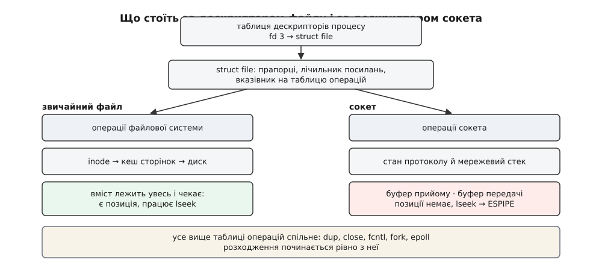
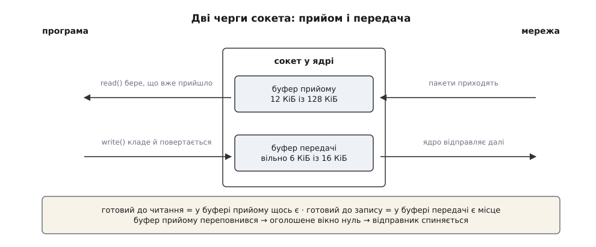
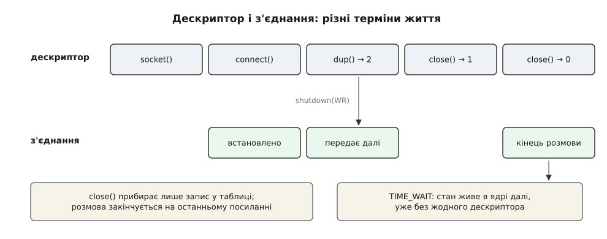

# Сокет як дескриптор

<preknowlist>
- [Файловий дескриптор](topic:sys-unix/file-descriptor) — невелике число, яким процес називає ядру вже відкритий об'єкт; перелік цих чисел ядро веде окремо для кожного процесу.
- [«Усе є файлом»](topic:sys-unix/everything-is-a-file) — один невеликий набір дієслів обслуговує диск, термінал, канал і мережу однаково.
- [Опис відкритого файлу](topic:sys-unix/open-file-description) — структура в ядрі за дескриптором: прапорці, позиція, лічильник посилань і вказівник на реалізацію.
- [Системний виклик](topic:sys-unix/syscall-mechanics) — як програма переходить межу в ядро й дістає назад результат або код помилки в `errno`.
- [TCP проти UDP](topic:com-transport/tcp-vs-udp) — потік байтів із встановленим з'єднанням проти окремих датаграм; звідки взагалі береться поняття «з'єднання».
</preknowlist>

Щоб прочитати файл, програма спершу називає його на ім'я — `/etc/hostname` — і дістає назад число, яким далі й користується. Мережеве з'єднання назвати нічим. У дереві каталогів немає шляху, що означав би «розмова з машиною 10.0.0.5 на порті 443», і бути не може: доки програма не попросила, цієї розмови не існує, а щойно вона скінчиться — не існуватиме знову. Ім'я вказує на те, що вже лежить; з'єднання доводиться створювати.

І все ж, коли воно створене, програма читає з нього тим самим `read`, пише тим самим `write`, закриває тим самим `close`. Число вона таки дістає — просто не через ім'я.

Звідси два питання, і вся тема між ними. Перше: як узагалі видати дескриптор на річ, у якої імені немає. Друге, важливіше: наскільки далеко тягнеться схожість на файл — де сокет поводиться точно як файл, де починає інакше, і чому саме так.

## Дескриптор без імені

Виклик `open` робить дві роботи за раз. Спершу знаходить об'єкт: іде шляхом покомпонентно, перевіряє права на кожному каталозі, добирається до потрібного. Потім заводить у ядрі стан цього конкретного відкриття — позицію, прапорці, посилання на реалізацію — і віддає програмі число.

Для з'єднання перша половина роботи порожня: шукати нема чого. Лишається друга. Тому її й виділили в окремий виклик:

```c
int fd = socket(AF_INET, SOCK_STREAM, 0);
```

Тут немає ні адреси, ні напрямку — лише сімейство адрес, вид передавання й протокол. Ядро заводить стан, повертає дескриптор, з'єднання ще не існує. Куди говорити, програма скаже потім: `connect` — якщо дзвонить вона, `bind` + `listen` + `accept` — якщо чекає дзвінка. Повний перелік цих викликів і порядок їх застосування розібрано окремо ([сокети в Linux](topic:sys-unix/socket-api-linux) — від створення дескриптора до встановленого з'єднання: адреси, прив'язка, черга очікування з'єднань, прийом).

Наслідок такого розщеплення важить більше за саму зручність. Дескриптор файлу від народження до смерті означає одне й те саме — цей відкритий файл. Дескриптор сокета проходить крізь стани, яких у файлу не буває: щойно створений і ні до чого не прив'язаний; прив'язаний до адреси, але без співрозмовника; слухаючий — з якого не читають, а породжують інші дескриптори; з'єднаний; напівзакритий. Той самий `read` на тому самому числі означатиме різне або не означатиме нічого — залежно від стану, у якому сокет зараз. Файловий дескриптор описує **об'єкт**, сокетний — **стадію розмови**.

Тут напрошується заперечення. А сокети домену Unix? У них ім'я у файловій системі є, шлях на кшталт `/run/docker.sock` видно звичайним `ls`. Виходить, назвати можна?

Перевірмо буквально:

```sh
$ cat /run/docker.sock
cat: /run/docker.sock: No such device or address
```

Помилка `ENXIO` — «немає такого пристрою». Файл є, права є, а `open` не працює. Бо шлях тут називає не з'єднання, а **місце зустрічі**: позначку, за якою клієнт знайде, до кого стукати. Саме з'єднання клієнт усе одно створює через `socket` і `connect`, а ім'я лише підказує адресу ([сокети домену Unix](topic:sys-unix/unix-domain-sockets) — той самий інтерфейс сокетів для розмови в межах однієї машини, з іменем у файловій системі замість IP-адреси й порту).

Те саме видно з протилежного боку — у `/proc`:

```sh
$ ls -l /proc/self/fd/
lrwx------ 1 user user 64 ... 3 -> 'socket:[2248868]'
```

Це не шлях, а мітка з номером інодного запису. Прочитати посилання можна, піти за ним — ні: `open("/proc/1234/fd/3")` для сокета дає той самий `ENXIO`. Причина глибша за примху: щоб відкрити щось наново, ядру треба вміти **побудувати** об'єкт із опису. Для файлу опис самодостатній — от каталог, от запис, от дані на диску. Для з'єднання самого опису мало: за ним стоїть жива розмова з живими лічильниками послідовності на обох кінцях, і відтворити її з рядка тексту неможливо. Дескриптор сокета не має «звідки взятися вдруге», тому передати його можна лише як сам дескриптор — копіюванням у межах процесу або пересиланням іншому процесові через сокет домену Unix.

Що ця розв'язка з іменами не була неминучою, добре видно з історії: у Bell Labs той самий мережевий доступ спробували зробити саме через файлове дерево, і ця розвилка визначила вигляд усіх мережевих програм на сорок років уперед ([чому мережу не зробили файлом](topic:sys-unix/socket-as-descriptor/hist-socket-or-file.md) — вибір Берклі 1983 року проти шляху Bell Labs і Plan 9, де з'єднання відкривали як файл у каталозі `/net`).

## Що стоїть за числом

Тепер про схожість. Число веде до запису в таблиці дескрипторів процесу, звідти — до `struct file`, і на цьому рівні між файлом і сокетом немає жодної різниці. `struct file` тримає прапорці, лічильник посилань і **вказівник на таблицю операцій** — набір функцій, які ця реалізація підставляє під загальні дієслова.

У цій таблиці й ховається вся механіка «все є файлом». Сокет не є файлом і ніколи ним не був; спільне в них — не природа, а **точка виклику**. Коли програма викликає `read(fd, buf, n)`, ядро бере `struct file` за номером і смикає ту функцію читання, яку записала туди реалізація. Для файлу на ext4 це читання з кеша сторінок, для сокета — вибирання байтів із буфера прийому. Той самий системний виклик, різні функції на іншому кінці вказівника.



*Вище таблиці операцій усе спільне — тому `dup`, `close`, `fcntl`, успадкування через `fork` і реєстрація в `epoll` працюють із сокетом без жодних застережень.*

Звідси одразу випливає, що саме працює однаково, і це не дрібниця. `dup` і `dup2` роблять другий дескриптор на той самий сокет. `fcntl(fd, F_SETFL, O_NONBLOCK)` перемикає режим точно так само, як для каналу чи файлу. `fork` віддає дитині ту саму таблицю з тими самими номерами, і обидва процеси говорять в одне з'єднання. `close` зменшує лічильник. Сокет реєструється в `epoll` поруч із дескриптором таймера й дескриптором сигналів — і саме тому цикл подій може чекати на різнорідні джерела одним викликом ([select, poll, epoll](topic:sys-unix/select-poll-epoll) — способи спитати ядро «котрий із цих дескрипторів уже готовий» замість очікування на кожному окремо).

А що не працює — те не працює не з примхи, і зрозуміти чому важливіше, ніж запам'ятати перелік. `lseek` на сокеті повертає `ESPIPE`. `mmap` на звичайному сокеті теж ні до чого: більшість родин ставлять у таблицю заглушку з відмовою, а нечисленні винятки — кільцевий буфер `AF_PACKET` і доданий у ядрі 4.18 прийом TCP без копіювання — відображають не вміст, а спільні з ядром сторінки під пакети. Обидва промахи мають одну причину, і вона — головна відмінність цієї теми.

## Позиції немає — є дві черги

Позиція має сенс лише там, де вміст **лежить увесь**. Файл на диску нікуди не дінеться: можна прочитати кінець, повернутись на початок, прочитати те саме вдруге. Позиція — це закладка в чомусь нерухомому.

Байти з'єднання нерухомими не бувають. Вони приходять у часі й існують рівно один раз: прочитаний байт нікуди «повернути» не можна, бо його вже немає — його місце в пам'яті ядра звільнено під наступні. Закладка у **потоці** не має до чого чіплятися. Тому замість однієї позиції сокет тримає **дві черги**: буфер прийому, куди мережевий стек кладе те, що прийшло, і буфер передачі, куди програма кладе те, що має піти.

Уся поведінка сокета при читанні й записі — це поведінка цих двох черг.

`read` віддає те, що **вже** лежить у буфері прийому, і не більше, ніж просили. Просили 4096 байтів, прийшло поки що 300 — отримаєте 300. Це не помилка й не половинчасте читання: у потоці немає поняття «повне повідомлення», і не існує способу дізнатися, чи буде продовження, крім як прочитати ще раз. Звідси залізне правило роботи з потоковим сокетом: `read` завжди в циклі, а межі повідомлень програма розставляє сама — довжиною наперед, роздільником або форматом.

`write` кладе байти в буфер передачі й повертається — не тоді, коли дані дійшли, а коли їх **скопійовано в ядро**. У блокуючому режимі виклик чекає, доки влізе все; у неблокуючому — бере скільки влізло й повертає це число. Успішний `write` не означає доставки взагалі нічого: він означає лише, що ядро взяло на себе відповідальність відправляти.



*Порожній буфер прийому означає «не готовий до читання», повний буфер передачі — «не готовий до запису»; саме про це питає `epoll`.*

Тепер два поняття, які без цих черг звучать як магія, робляться очевидними.

**Готовність.** «Дескриптор готовий до читання» означає буквально «у буфері прийому щось є»; «готовий до запису» — «у буфері передачі є вільне місце». Ядро не вигадує окремої сутності готовності: воно перевіряє довжину черги. Через це один і той самий `epoll` однаково обслуговує сокет, канал і термінал — у кожного є своя черга, і питання до всіх однакове.

**Спинення відправника.** Якщо програма читає повільніше, ніж приходить, буфер прийому наповнюється. Місця більше немає — і TCP оголошує іншому кінцю менше вікно, аж до нуля; відправник спиняється й чекає. Виходить, недочитаний буфер у нашому процесі гальмує програму на іншому боці планети — і це не збій, а задум ([керування потоком](topic:com-transport/flow-control) — механізм, яким приймач стримує швидкість передавача, щоб той не залив його даними; у TCP роль сигналу грає оголошене вікно). Той самий принцип під іншим кутом — [протитиск](topic:sf-tasks/backpressure): черга, що не встигає, мусить уміти сказати «повільніше» вгору за течією, інакше вона просто переповниться.

> 🔧 **Навіщо це.** Найчастіша причина «сервер підвисає під навантаженням» — не процесор і не мережа, а зайнятий потік, який не встигає вичерпувати буфери прийому. Ознака в `ss -tn`: ненульова колонка `Recv-Q` на багатьох з'єднаннях. Це не проблема мережі — це наша програма не забирає дані, а вікно, звужене до нуля, вже переказало проблему клієнтам. Дивитися треба на те, що робить обробник між двома `read`, а не на налаштування стека.

## Скільки коштує одне з'єднання

Тепер найпрактичніше. Черги живуть у пам'яті ядра, і кожне з'єднання має власну пару — от де насправді впирається кількість з'єднань, які програма здатна тримати.

Розміри буферів у Linux задаються трійками «мінімум — початковий — максимум»:

```
net.ipv4.tcp_rmem = 4096   131072   6291456     буфер прийому
net.ipv4.tcp_wmem = 4096    16384   4194304     буфер передачі
```

Середнє число — те, з чого починає нове з'єднання (початкові 128 КіБ для прийому діють від ядра 4.20; раніше було 87380 байтів, і саме це число ще стоїть у сторінках `tcp(7)`). Крайні — межі, у яких ядро **само** підбирає розмір під швидкість і затримку каналу.

Ключове тут те, що це **ліміти, а не резервування**. Пам'ять під чергу виділяється тоді, коли є що в неї класти. З'єднання, яке мовчить, не тримає ні 128 кілобайтів, ні 16 — воно тримає лише власний облік: структури стану TCP, запис у таблиці дескрипторів, місце в геш-таблиці з'єднань. Порядок цієї сталої частини — кілька кілобайтів на з'єднання.

Друга неочевидна деталь: ліміт буфера рахує не корисні байти, а **зайняту пам'ять** — цілі пакетні буфери разом із заголовками й службовими полями. Дрібний пакет на сорок байтів корисних даних легко забирає в кілька разів більше місця з ліміту, тож повний буфер прийому далеко не завжди означає повний буфер даних.

**Приклад: сервер на 50 000 з'єднань, з яких активна десята частина.**

```
сталий облік на з'єднання      ≈ 4 КіБ
50 000 · 4 КіБ                 ≈ 195 МіБ        платимо завжди
активних з'єднань              = 5 000
дані в чергах, у середньому    ≈ 64 КіБ на активне
5 000 · 64 КіБ                 ≈ 313 МіБ        платимо за трафік
разом пам'яті ядра             ≈ 508 МіБ
```

Порахуємо ту саму систему без розділення на активні й тихі — «по максимуму на кожного»: 50 000 · (6 МіБ + 4 МіБ) — це 488 ГіБ, число заздалегідь безглузде. Різниця між 0.5 ГіБ і 488 ГіБ і є вся суть автопідбору: стеля існує на випадок швидкого каналу з великою затримкою, а не як плата за факт існування з'єднання.

Друга стеля — самі номери. Кожне прийняте з'єднання — це окремий дескриптор, який повертає `accept`, і слухаючий сокет тут один на весь сервер. Тобто **кількість одночасних з'єднань дорівнює кількості дескрипторів**, а їх обмежує `RLIMIT_NOFILE`: типовий м'який ліміт — 1024, жорсткий у сучасних дистрибутивах — сотні тисяч, і підняти м'який до жорсткого програма може сама ([ліміти ресурсів](topic:sys-unix/resource-limits) — обмеження на процес: `rlimit` у системних викликах, `ulimit` у оболонці; кожен має м'яке й жорстке значення).

Про цю стелю варто знати наперед, бо впирається в неї програма особливо бридко. Коли дескриптори вичерпано, `accept` повертає `EMFILE`, а з'єднання **лишається в черзі** ядра — і слухаючий сокет далі вважається готовим до читання. Цикл подій негайно прокидається знову, знову кличе `accept`, знову дістає `EMFILE` — і крутиться на повному процесорі, не обслуговуючи нікого. Обхід відомий: тримати про запас один заздалегідь відкритий дескриптор, аби в такий момент було чим прийняти з'єднання і одразу його закрити ([бюджет з'єднань наживо](topic:sys-unix/socket-as-descriptor/proj-connection-budget.md) — програма, що відкриває тисячі з'єднань, міряє пам'ять ядра й дескриптори на кожне, доводить систему до `EMFILE` і показує прийом із резервним дескриптором).

> 🔧 **Навіщо це.** Плануючи сервер, рахуйте дві величини окремо: скільки з'єднань дозволяє ліміт дескрипторів і скільки пам'яті ядра заберуть їхні черги під очікуваним трафіком. Обидві впираються раніше, ніж процесор. І пам'ятайте про третю межу: старий `select` уміє працювати лише з номерами, меншими за `FD_SETSIZE` (1024), тож у програмі на `select` дескриптор із більшим номером стає непридатним ще до всіх лімітів.

## Дескриптор і з'єднання живуть різні життя

Лишилося зняти останню — і найпоширенішу — плутанину: `close` не закриває з'єднання.

`close` прибирає **запис у таблиці дескрипторів** і зменшує лічильник посилань на `struct file`. Якщо перед тим був `dup` або `fork`, посилань кілька, і після одного `close` розмова триває далі — просто через інший номер. Це та сама механіка, що й для файлів: закривається не об'єкт, а ім'я, яким процес до нього звертався.

А коли закрити треба саме розмову — і лише в один бік, — є окремий виклик, якого у файлів немає:

```c
shutdown(fd, SHUT_WR);   /* більше не пишу; читати далі можу */
```

`shutdown` діє на з'єднання, а не на дескриптор: він відправляє FIN, дескриптор при цьому лишається цілком робочим і придатним для читання відповіді. Це і є напівзакриття, на якому тримаються всі протоколи виду «надішли запит цілком, потім читай відповідь до кінця».



*З'єднання народжується пізніше за дескриптор і переживає його; `shutdown` — єдиний виклик, що дістає до нижньої смуги, не чіпаючи верхньої.*

З іншого боку напівзакриття виглядає як `read`, що повернув нуль. У файлі нуль означає «дійшли до кінця вмісту»; у сокеті — «співрозмовник більше нічого не надішле». Стан різний, сигнал той самий, і плутанина тут коштує дорого: нуль на сокеті не тимчасовий і не мине з часом, чекати ще одного читання марно.

Є й третій вихід, якого файли не знають зовсім. З'єднання може зламатися: інший кінець перезавантажили, посередник викинув запис із таблиці NAT. Тоді `read` поверне `ECONNRESET`, і дескриптор при цьому лишається абсолютно **дійсним** — номер є, `close` на нього потрібен, просто передавати ним уже нічого не можна.

Звідси випливає властивість, до якої годі звикнути з файлів: **помилки в сокеті приходять із запізненням**. Оскільки `write` повертається одразу після копіювання в буфер, справжня доля даних з'ясується згодом, і повідомити про неї можна лише на **наступному** виклику — або, для неблокуючого `connect`, окремим запитом `getsockopt(fd, SOL_SOCKET, SO_ERROR, …)`. Тому виклик, який щойно нічого поганого не робив, може повернути помилку від дій, зроблених мілісекунди тому. Логіка та сама, що з відкладеним записом на диск, де про збій дізнаються аж на `fsync` ([кеш сторінок і довговічність запису](topic:sys-unix/page-cache-durability) — чому успішний `write` ще не означає, що дані на диску, і хто відповідає за момент, коли вони туди справді потраплять): усюди, де ядро бере роботу на себе й відпускає програму, звіт приходить пізніше за виклик.

І навіть останній `close` не є кінцем. Ядро ще тримає стан з'єднання деякий час після того, як зник останній дескриптор, — щоб упізнати запізнілі пакети старої розмови й не сплутати їх із новою на тій самій парі адрес. Ці записи не належать жодному процесові, у жодній таблиці дескрипторів їх немає, але місце в пам'яті вони займають — на завантаженому сервері їх бувають десятки тисяч ([життєвий цикл TCP-з'єднання](topic:com-transport/tcp-connection-lifecycle) — встановлення, обмін, напівзакриття й стан `TIME_WAIT`, через який завершене з'єднання ще певний час живе в ядрі).

Так і виходить остаточний розподіл ролей. Дескриптор — це право процесу говорити: його можна скопіювати, успадкувати, передати іншому процесові й викинути. З'єднання — це стан у ядрі й на іншому кінці дроту: воно народжується пізніше за дескриптор і вмирає пізніше за нього. Однаковими їх робить лише вузький місток `struct file` з таблицею операцій — рівно настільки, щоб `read` і `write` не довелося вигадувати вдруге. Усе, що нижче цього містка, — дві черги, стан розмови й лічильники — і є те, чим міряють, скільки з'єднань потягне програма.
