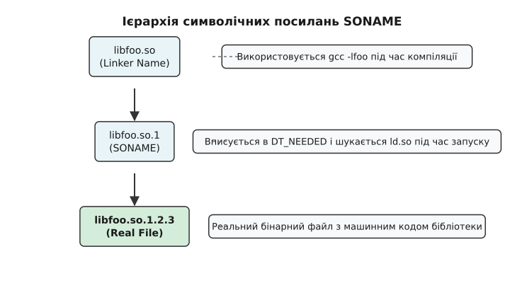
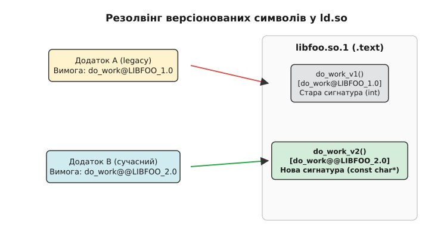

# SONAME і версіонування спільних бібліотек

<preknowlist>
- [Формат об'єктних файлів ELF](root:sys-unix/elf-structure) — заголовки програмованих та динамічних секцій бінарних файлів.
- [Динамічний завантажувач ld.so](root:sys-unix/dynamic-loader) — механізм пошуку, відображення та резолвінгу символів під час запуску.
- [Сумісність ABI бібліотек](root:sys-unix/library-abi-compat) — правила збереження бінарної структури даних і типів повернення.
</preknowlist>

Коли операційна система Linux виконує програму, вона майже ніколи не завантажує її як повністю автономний моноліт. Переважна більшість системних утиліт та прикладних додатків залежать від системних спільних бібліотек (shared libraries) — таких як `libc`, `libm`, `libssl` чи `libpthread`. Спільні бібліотеки дозволяють сотням процесів використовувати єдину копію коду в оперативній пам'яті через кєш сторінок ядра (page cache, завантажуючи сегмент `.text` у фізичну пам'ять лише один раз), а також дозволяють розробникам оновлювати системні компоненти та усувати вразливості безпеки без перекомпіляції кожної програми в системі.

Протім централізоване розмежовуване виконання створює фундаментальну проблему: вихідний код бібліотек неперервно еволюціонує. У нових релізах додаються нові функції, змінюються внутрішні алгоритми, виправляються помилки, а іноді модифікуються публічні структури даних та сигнатури функцій. Якщо оновлена бібліотека змінює свій бінарний інтерфейс (Application Binary Interface, ABI), раніше скомпільований бінарний файл під час запуску передасть у функцію невірно вирівняні аргументи, прочитає зміщені поля структури або звернеться за неіснуючою адресою у пам'яті. Це миттєво призведе до аварійного завершення процесу (`SIGSEGV`, `SIGBUS`) або до непомітного, але катастрофічного пошкодження даних у пам'яті.

Спроба розв'язати цю проблему через жорстку прив'язку програми до конкретного імені файлу бібліотеки (наприклад, `libfoo.so.1.2.3`) робить систему надзвичайно крихкою: найменше оновлення з виправленням безпеки (`libfoo.so.1.2.4`) паралізує запуск усіх залежних програм, оскільки динамічний завантажувач шукатиме відсутнє точне ім'я `1.2.3`. З іншого боку, використання абсолютно абстрактного імені `libfoo.so` призводить до фатальних збоїв при випуску нової мажорної версії з несумісним макетом структур пам'яті. Для розв'язання цього фундаментального протиріччя в системі Unix/Linux створено тришарову систему версіонування, яка поєднує поля `DT_SONAME` у заголовках ELF, файлові символічні посилання та гранулярну систему версіонування символів GNU (GNU Symbol Versioning).

## 1. Конфлікт між еволюцією коду та бінарною стабільністю ABI

Щоб глибоко зрозуміти необхідність механізму `SONAME`, слід фундаментально розмежувати поняття API (Application Programming Interface) та ABI (Application Binary Interface). 

API виражається у вихідному коді мовою C або C++: це назви функцій, типи аргументів, структури даних, макроси препроцесора та заголовні файли `.h`. Якщо розробник бібліотеки додає новий параметр у функцію, він змінює API. Для адаптації додатка розробнику достатньо змінити вихідний код і перекомпілювати його.

ABI — це низькорівнева реалізація API у вигляді скомпільованого машинного коду, типів даних та макета пам'яті. ABI визначається специфікацією апаратної платформи (наприклад, System V AMD64 ABI) і включає:
1. **Розміри та вирівнювання типів даних:** точні розміри структур у байтах, зміщення (offsets) полів усередині структур та правила вирівнювання за межами слів (alignment).
2. **Угоди про виклики (Calling Conventions):** порядок передачі аргументів через регістри процесора (наприклад, `rdi`, `rsi`, `rdx`, `rcx`, `r8`, `r9` для цілих чисел і `xmm0`–`xmm7` для чисел з плаваючою крапкою у x86-64) та правила очищення стека.
3. **Назви експортованих символів:** точні ідентифікатори функцій та глобальних змінних у динамічній таблиці символів `.dynsym`.
4. **Розмір і макет таблиць віртуальних функцій (vtable):** у об'єктно-орієнтованому коді C++.

Якщо в новій версії бібліотеки розробник додає нове поле у середину структури `struct UserSession`, зміщення усіх наступних полів у цій структурі зміщуються. Якщо програма була скомпільована зі старою версією бібліотеки, її машинний код буде звертатися за застарілим зміщенням (наприклад, за зміщенням `+16` замість нового `+24`). Програма виділить на стеку 64 байти під `UserSession`, тоді як оновлена функція бібліотеки спробує записати за цим покажчиком 80 байтів, що призведе до перезапису чужого стекового кадру, викривлення покажчика повернення та падіння процесу.

У софтверній інженерії зміни у бібліотеках класифікують за семантичним версіонуванням (`major.minor.patch`):
- **Patch (1.0.1 → 1.0.2):** виправлення внутрішніх помилок реалізації. ABI та API повністю незмінні.
- **Minor (1.0.0 → 1.1.0):** додавання нових функцій, розширення API зі збереженням повної зворотної сумісності ABI. Старі програми працюють без жодних модифікацій.
- **Major (1.0.0 → 2.0.0):** вилучення функцій, зміна сигнатур, модифікація макета структур даних. Злам зворотної сумісності ABI.

Якщо динамічний завантажувач операційної системи не має інструментів для автоматичної перевірки сумісності мажорних версій, система потрапляє у стан «пекла залежностей» (Dependency Hell), коли оновлення одного системного компонента ламає роботу десятків інших.

## 2. Механізм DT_SONAME у секції .dynamic

Ключовим елементом розв'язання проблеми мажорних версій у форматі ELF є поле `DT_SONAME` (Shared Object Name). Це спеціальний текстовий запис, який вбудовується у метадані самої спільній бібліотеки під час її компіляції.

Скрізь у бінарному форматі ELF інструкції про динамічне зв'язування зберігаються у спеціальній секції `.dynamic`, яка складається з масиву структур `Elf64_Dyn`. Кожен елемент має тег `d_tag` та значення `d_un` (адреса або зміщення у строковій таблиці `.dynstr`).

Тег `DT_SONAME` (значення `0x0e`) містить логічне ім'я бібліотеки, яке включає назву та **тільки мажорну версію** ABI. Наприклад, для реального файлу бібліотеки `libfoo.so.1.2.3` значення `DT_SONAME` буде встановлено як `libfoo.so.1`.

Компіляція та зв'язування бібліотеки із визначенням `DT_SONAME` виконується передачею спеціального прапорця компонувальнику `ld`:

:::tabs
```c
// Створення об'єктного файлу та лінкування бібліотеки у C
// gcc -fPIC -c foo.c -o foo.o
// gcc -shared -Wl,-soname,libfoo.so.1 -o libfoo.so.1.2.3 foo.o
```
```cpp
// Створення об'єктного файлу та лінкування бібліотеки у C++
// g++ -fPIC -c foo.cpp -o foo.o
// g++ -shared -Wl,-soname,libfoo.so.1 -o libfoo.so.1.2.3 foo.o
```
:::

Прапорець `-Wl,-soname,libfoo.so.1` вказує компілятору `gcc`/`g++` передати компонувальнику `ld` опцію `-soname libfoo.so.1`. Компонувальник записує рядок `libfoo.so.1` у динамічну строкову таблицю `.dynstr` і додає відповідну структуру `Elf64_Dyn` із тегом `DT_SONAME` у секцію `.dynamic`.

### Магія стадії компонування додатків

Коли розробник збирає свій додаток `myapp` і вказує прапорець зв'язування з бібліотекою `-lfoo`:

```bash
gcc main.c -o myapp -L. -lfoo
```

Статичний компонувальник `ld` знаходить файл `libfoo.so` на диску, відкриває його заголовки ELF і шукає секцію `.dynamic`. Знайшовши запис `DT_SONAME` зі значенням `libfoo.so.1`, компонувальник записує **саме це значення** у підсумковий виконуваний файл `myapp` у вигляді тегу `DT_NEEDED` (значення `0x01` — необхідна спільна бібліотека).

Якщо перевірити вміст секції `.dynamic` скомпільованого бінарника `myapp` за допомогою утиліти `readelf`, можна побачити точну залежність:

```bash
$ readelf -d myapp | grep -E "NEEDED|SONAME"
 0x0000000000000001 (NEEDED)             Shared library: [libfoo.so.1]
 0x0000000000000001 (NEEDED)             Shared library: [libc.so.6]
```

Виконуваний файл `myapp` **взагалі нічого не знає** про мінорну версію або патч-версію бібліотеки `1.2.3`, з якою він був скомпільований. Він закарбовує у своєму заголовку контракт: «Для моєї роботи потрібна будь-яка бібліотека, яка надає ABI серії `libfoo.so.1`».

Завдяки цьому оновлення бібліотеки на диску до версії `libfoo.so.1.2.4` або `libfoo.so.1.9.0` не вимагає перекомпіляції `myapp`. Динамічний завантажувач `ld.so` під час запуску `myapp` прочитає тег `NEEDED` (`libfoo.so.1`), знайде на диску найновішу сумісну версію і завантажить її у віртуальну пам'яті процесу.

## 3. Тришарова система імен та ієрархія символічних посилань

Для практичного функціонування механізму `DT_SONAME` у файловій системі Linux використовується чітка конвенція з трьох типів імен для кожного файлу спільної бібліотеки:


*Ієрархія символічних посилань SONAME та зв'язок між Linker Name, SONAME та реальними файлами бібліотеки.*

Розглянемо призначення кожного з трьох рівнів:

1. **Реальне ім'я (Real Name):** `libfoo.so.1.2.3`
   Це фактичний бінарний файл у форматі ELF, який лежить на диску у каталозі бібліотек (наприклад, `/usr/lib64` або `/lib/x86_64-linux-gnu`). Він містить повністю скомпільований машинний код секції `.text`, дані `.data`, `.rodata` та динамічні таблиці.
2. **Ім'я SONAME (SONAME Link):** `libfoo.so.1`
   Це символічне посилання (symlink), яке вказує на реальний файл найновішої патч-версії даної мажорної серії (наприклад, `libfoo.so.1 -> libfoo.so.1.2.3`). Саме це ім'я вказане в тегу `DT_NEEDED` виконуваних файлів. Його використовує **динамічний завантажувач `ld.so` під час запуску програм**.
3. **Ім'я компонувальника (Linker Name):** `libfoo.so`
   Це символічне посилання без номерів версій, яке вказує на SONAME-лінк (`libfoo.so -> libfoo.so.1`). Це ім'я використовується **компілятором та статичним компонувальником `ld` під час збирання додатків** при передачі прапорця `-lfoo`.

### Автоматизація через ldconfig

Підтримка мільйонів символічних посилань у системі вручну була б джерелом хаосу. У Linux цю функцію бере на себе системна утиліта `ldconfig`.

Коли пакетний менеджер дистрибутиву (APT, DNF, Pacman) встановлює або оновлює бібліотеку (наприклад, копіює новий файл `libfoo.so.1.2.4`), він викликає утиліти `ldconfig`.

Утиліта `ldconfig` виконує наступні кроки:
1. Сканує стандартні системні каталоги (`/lib`, `/usr/lib`, `/usr/lib64`) та додаткові каталоги, вказані у файлі конфігурації `/etc/ld.so.conf` і теці `/etc/ld.so.conf.d/`.
2. Відкриває кожен файл `.so` і зчитує з його динамічної секції запис `DT_SONAME`.
3. Автоматично створює або оновлює символічне посилання SONAME у тому ж каталозі. Якщо у каталозі є `libfoo.so.1.2.3` та новий `libfoo.so.1.2.4`, `ldconfig` атомарно спрямує лінк `libfoo.so.1` на `libfoo.so.1.2.4`.
4. Генерує та оновлює бінарний індексний файл `/etc/ld.so.cache`.

Під час запуску будь-якої програми динамічний завантажувач `ld.so` не сканує дискові каталоги лінійно, що було б занадто повільно. Він миттєво зчитує бінарний кеш `/etc/ld.so.cache`, де за ключем `libfoo.so.1` за O(1) знаходить точний абсолютний шлях до файлу на диску.

*Важливе розмежування пакунків:* У дистрибутивах Linux бінарні пакети розділяють на рантайм-пакети та пакети розробки. Рантайм-пакет (наприклад, `libfoo1`) містить реальний файл `libfoo.so.1.2.3` та SONAME-симлінк `libfoo.so.1`, необхідні для запуску вже зібраних програм. Пакет розробки (наприклад, `libfoo-dev` або `libfoo-devel`) містить заголовочні файли `.h` та символічне посилання Linker Name `libfoo.so`. Без встановлення `-dev` пакета ви не зможете скомпілювати програму з прапорцем `-lfoo`, але вже зібрані бінарники будуть працювати чудово.

## 4. Обмеження SONAME та поява GNU Symbol Versioning

Механізм `DT_SONAME` бездоганно вирішує задачу розмежування мажорних версій. Проте він має суттєве обмеження: він діє за принципом «все або нічого» на рівні цілої бібліотеки.

Уявіть велику системну бібліотеку, таку як `glibc` або `openssl`, яка експортує понад 3000 функцій. Якщо розробники бібліотеки вирішують змінити сигнатуру лише **однієї** застарілої функції (наприклад, змінити параметр `int` на `long`), вони змушені змінити мажорну версію `DT_SONAME` з `libfoo.so.1` на `libfoo.so.2`.

Зміна SONAME означає, що **усі** додатки в операційній системі, які залежать від `libfoo.so.1`, більше не зможуть запуститися, поки їх не перекомпільовують під `libfoo.so.2`. Це створює величезну хвилю перекомпіляції дистрибутиву (Mass Rebuild).

У 1990-х роках розробники `glibc` та binutils запропонували більш точковий механізм — **GNU Symbol Versioning** (версіонування символів). Детальніше про історію протистояння та переходу від формату a.out до ELF можна прочитати у висунутому матеріалі про [історію версіонування ELF](root:sys-unix/soname-versioning/hist-elf-versioning.md).

Ідея Symbol Versioning полягає у тому, що версійний штамп додається не до файлу бібліотеки, а **до кожного окремого символу (функції чи змінної)** всередині динамічної таблиці символів. Більше того, один і той самий файл бібліотеки може містити **декілька різних реалізацій однієї і тієї ж функції** для різних версій ABI!

## 5. Внутрішня будова секцій версіонування у форматі ELF

Для підтримки версіонування символів у формат ELF додано три спеціальні секції:

1. **`.gnu.version` (Symbol Version Table):**
   Масив 16-бітних цілих чисел (`Elf64_Half`), кількість яких точно відповідає кількості записів у динамічній таблиці символів `.dynsym`. Кожне число є індексом версії для відповідного символу.
2. **`.gnu.version_d` (Version Definition Section):**
   Містить список версій, які **надає дана бібліотека**. Секція складається із зв'язаного списку структур `Elf64_Verdef` та допоміжних структур `Elf64_Verdaux`, які містять текстові назви версій (наприклад, `GLIBC_2.2.5`, `GLIBC_2.34`, `LIBFOO_1.0`).
3. **`.gnu.version_r` (Version Needs Section):**
   Містить список версій символів, які **вимагає виконуваний файл** від зовнішніх бібліотек. Складається із структур `Elf64_Verneed` та `Elf64_Vernaux`.

### Дефолтні та застарілі версії символів

У таблиці `.dynsym` версіонований символ може записуватися з суфіксами двох типів:
- **`symbol@VERSION` (один собачка):** застаріла або прихована версія символу. Якщо програма вже була скомпільована у минулому з прив'язкою до `VERSION`, `ld.so` підключить її до цієї реалізації. Але новий додаток під час компіляції **не зможе** злінкуватися з цією версією.
- **`symbol@@VERSION` (два собачки):** версія символу за замовчуванням (Default Version). Будь-яка нова компіляція програми через `gcc`/`g++` буде автоматично зв'язуватися саме з цією реалізацією.


*Маршрутизація викликів функцій динамічним завантажувачем за допомогою версійних міток ELF.*

Як видно на діаграмі, старий Додаток A, скомпільований проти `LIBFOO_1.0`, просить у завантажувача функцію `do_work@LIBFOO_1.0`. Завантажувач знаходить стару реалізацію `do_work_v1()`. Сучасний Додаток B, збираючись сьогодні, зв'язується з дефолтним символом `do_work@@LIBFOO_2.0` і потрапляє на нову реалізацію `do_work_v2()`. Обидва додатки одночасно виконуються у системі й викликають код з одного й того самого файлу `libfoo.so.1` без жодних конфліктів.

## 6. Синтаксис скриптів версій, .symver та практична підтримка ABI

Для створення бібліотеки з версіонованими символами розробники використовують два інструменти: скрипти версій компонувальника (Version Scripts) та асемблерну директиву `.symver`.

Скрипт версій (наприклад, `libfoo.map`) перераховує групи символів та будує граф успадкування версій:

```text
LIBFOO_1.0 {
    global:
        foo_init;
        foo_process;
    local:
        *;  /* Приховує всі інші символи, не вказані у блоці global */
};

LIBFOO_2.0 {
    global:
        foo_process;       /* Нова версія відомої функції */
        foo_calculate;     /* Нова функція */
} LIBFOO_1.0;              /* Успадковує версію 1.0 */
```

У вихідному коді C або C++ розробник пов'язує конкретні C-функції з відповідними версіями у таблиці ELF за допомогою директиви `.symver`:

:::tabs
```c
// foo.c — реалізація двох версій однієї функції у C
#include <stdio.h>

// Стара реалізація для сумісності зі старими бінарниками
int foo_process_v1(int x) {
    return x * 10;
}
__asm__(".symver foo_process_v1, foo_process@LIBFOO_1.0");

// Нова реалізація за замовчуванням (@@) для нових збірок
int foo_process_v2(int x, int flags) {
    return x * 10 + flags;
}
__asm__(".symver foo_process_v2, foo_process@@LIBFOO_2.0");
```
```cpp
// foo.cpp — реалізація двох версій однієї функції у C++
#include <iostream>

extern "C" {

// Стара реалізація для сумісності зі старими бінарниками
int foo_process_v1(int x) {
    return x * 10;
}
__asm__(".symver foo_process_v1, foo_process@LIBFOO_1.0");

// Нова реалізація за замовчуванням (@@) для нових збірок
int foo_process_v2(int x, int flags) {
    return x * 10 + flags;
}
__asm__(".symver foo_process_v2, foo_process@@LIBFOO_2.0");

}
```
:::

Для детального ознайомлення з усіма ключами інспектування бінарних файлів та синтаксисом скриптів зверніться до матеріалу [довідник синтаксису версійних скриптів та CLI-утиліт](root:sys-unix/soname-versioning/api-symbol-versioning.md). А наочний покроковий приклад створення бібліотеки з підтримкою сумісності доступний у матеріалі [практична реалізація зворотної сумісності ABI](root:sys-unix/soname-versioning/proj-abi-compatibility-wrapper.md).

## 7. Алгоритм роботи динамічного завантажувача ld.so при резолвінгу версійованих символів

Під час запуску програми динамічний завантажувач `ld.so` виконує резолвінг символів за чітко визначеним алгоритмом. 

Розглянемо послідовність кроків `ld.so`:

1. **Читання залежностей:** Завантажувач відкриває виконуваний файл, читає секцію `.dynamic` і знаходить усі записи `DT_NEEDED`.
2. **Завантаження сегментів:** За допомогою системного виклику `mmap()` завантажувач мапить кожну бібліотеку в пам'ять процесу.
3. **Парсинг версійних вимог:** Завантажувач читає секцію `.gnu.version_r` виконуваного файла. Для кожного імпортованого символу з таблиці `.dynsym` завантажувач знаходить 16-бітний індекс у `.gnu.version` і дістає ім'я необхідної версії (наприклад, `malloc` вимагає `GLIBC_2.2.5`).
4. **Пошук у таблиці хешів:** Для кожного символу завантажувач обчислює хеш імені (використовуючи `.gnu.hash` або `.hash`) і шукає символ у завантажених бібліотеках.
5. **Зіставлення версій:** Знайшовши символ з відповідним ім'ям у таблиці `.dynsym` бібліотеки, завантажувач перевіряє його індекс у секції `.gnu.version_d` цієї бібліотеки. 
   - Якщо назва версії у бібліотеці збігається з вимогами бінарника — резолвінг успішний.
   - Якщо версія не збігається, завантажувач продовжує пошук в інших завантажених бібліотеках.
   - Якщо символ знайдено, але необхідна версія відсутня у бібліотеці, `ld.so` зупиняє виконання процесу з помилкою.

### Явний динамічний резолвінг через dlsym та dlvsym

Якщо програма завантажує бібліотеку під час виконання за допомогою плагінної архітектури `dlopen()`, стандартна функція `dlsym()` повертає символ із дефолтною версією `@@`. 

Якщо програма бажає явно попросити конкретну версію символу (наприклад, стару версію для сумісності), використовується функція `dlvsym()`:

:::tabs
```c
#define _GNU_SOURCE
#include <stdio.h>
#include <dlfcn.h>

void execute_plugin(void) {
    void* handle = dlopen("libfoo.so.1", RTLD_LAZY);
    if (!handle) return;

    // Отримання конкретної версії символу через dlvsym
    typedef int (*func_v1_t)(int);
    func_v1_t func = (func_v1_t)dlvsym(handle, "foo_process", "LIBFOO_1.0");
    if (func) {
        int res = func(42);
        printf("Результат виклику v1: %d\n", res);
    }

    dlclose(handle);
}
```
```cpp
#define _GNU_SOURCE
#include <iostream>
#include <string_view>
#include <dlfcn.h>

class PluginLoader {
    void* handle_{nullptr};
public:
    explicit PluginLoader(std::string_view path) 
        : handle_(dlopen(path.data(), RTLD_LAZY)) {}

    ~PluginLoader() {
        if (handle_) dlclose(handle_);
    }

    template<typename FuncPtr>
    FuncPtr get_symbol(std::string_view name, std::string_view version) const {
        return reinterpret_cast<FuncPtr>(dlvsym(handle_, name.data(), version.data()));
    }
};

void execute_plugin() {
    PluginLoader plugin("libfoo.so.1");
    using func_v1_t = int(*)(int);
    
    if (auto func = plugin.get_symbol<func_v1_t>("foo_process", "LIBFOO_1.0")) {
        std::cout << "Результат виклику v1: " << func(42) << "\n";
    }
}
```
:::

## 8. Діагностика, типові помилки та ціна версіонування

У практичній експлуатації Linux-систем системні адміністратори та розробники найчастіше зіштовхуються з двома типовими помилками динамічного завантажувача.

### Помилка 1: Відсутність SONAME бібліотеки
```text
./myapp: error while loading shared libraries: libfoo.so.1: cannot open shared object file: No such file or directory
```
**Причина:** Завантажувач `ld.so` прочитав тег `DT_NEEDED` у бінарнику `myapp` і шукає файл або symlink `libfoo.so.1` у каталогах `/lib`, `/usr/lib`, `LD_LIBRARY_PATH` та кеші `/etc/ld.so.cache`.
**Вирішення:** Перевірити наявність файлу та запустити `sudo ldconfig` для оновлення символічних посилань та кешу.

### Помилка 2: Відсутність необхідної версії символу
```text
./myapp: /lib/x86_64-linux-gnu/libc.so.6: version 'GLIBC_2.34' not found (required by ./myapp)
```
**Причина:** Програма `myapp` була скомпільована на сучаснішій системі (з `glibc 2.34`), де вона злінкувалася з функцією, яка має версію `GLIBC_2.34`. На поточній системі встановлено старішу `glibc` (наприклад, 2.31), у якій секція `.gnu.version_d` не містить версії `GLIBC_2.34`.
**Вирішення:** Перекомпілювати додаток у середовищі з потрібною мінімальною версією бібліотеки або оновити системну `glibc`.

### Ціна версіонування

Хоча версіонування символів забезпечує чудову бінарну стабільність екосистеми Linux, воно має свою ціну:
1. **Збільшення розміру метаданих ELF:** Секції `.gnu.version`, `.gnu.version_d` та `.gnu.version_r` додають додаткові кілобайти до розміру бінарних файлів та системних бібліотек.
2. **Накладні витрати на запуску (Startup Latency):** Під час запуску процесу завантажувач `ld.so` повинен виконати додаткові перевірки у таблицях версій для кожного з тисяч імпортованих символів. Для оптимізації цього процесу в сучасних системах використовується хешування `.gnu.hash`.
3. **Ускладнення збірки:** Розробники бібліотек мусять старанно підтримувати скрипти версій та не допускати випадкового видалення застарілих символів, що вимагає використання автоматизованих інструментів перевірки ABI (наприклад, `abi-compliance-checker` або `abipkgdiff`).

Поєднання `DT_SONAME` для великомасштабного розмежування мажорних версій та GNU Symbol Versioning для точкової підтримки сумісності окремих функцій робить операційну систему Linux однією з найстабільніших платформ для тривалого виконання бінарного програмного забезпечення.
