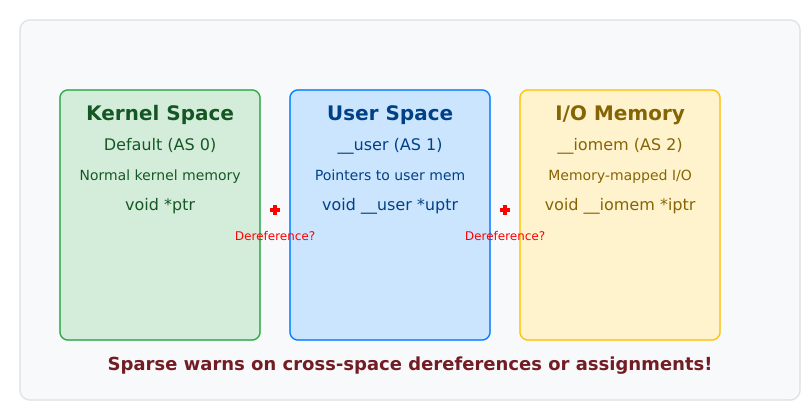

# sparse: статичний перевіряч ядра й анотації на кшталт __iomem

<preknowlist>
- Базове розуміння мови програмування C: вказівники, типи даних, приведення типів.
- [Ядро й простір користувача](root:sys-unix/kernel-and-userspace) — межа між двома половинами системи й чому адреса з одного боку не має сенсу з іншого.
- [Регістри пристрою в пам'яті](root:sys-unix/mmio-and-ioremap) — `ioremap()` і доступ через `readl()`/`writel()`: третій різновид адрес, крім пам'яті ядра й пам'яті процесу.
- [Статична й динамічна типізація](root:sf-lang/static-vs-dynamic-typing) — коли саме виявляється помилка: на етапі перевірки коду чи вже під час виконання.
</preknowlist>

У ядрі Linux програміст постійно жонглює вказівниками, які фізично вказують на різні адресні простори. Вказівник `void *` може адресувати звичайну оперативну пам'ять ядра, буфер у просторі користувача, або ж регістри апаратного пристрою (I/O memory). Проблема в тому, що для стандартного компілятора C (наприклад, GCC) усі ці вказівники виглядають абсолютно однаково. Якщо ви випадково розіменуєте вказівник на пам'ять користувача безпосередньо в ядрі або спробуєте записати дані у вказівник I/O без спеціальних макросів на кшталт `writel()`, компілятор не скаже ні слова. Але під час виконання це призведе до фатальних наслідків: від непередбачуваної поведінки пристрою до аварійного завершення потоку в ядрі (Oops), а в найгіршому разі — до паніки ядра чи критичної вразливості безпеки, якщо зловмисник підсуне невалідну адресу.

Звичайні синтаксичні перевірячі C та вбудовані попередження компіляторів виявилися сліпими до семантики адресних просторів ядра. GCC бачить типи, але не розуміє контексту. Розробникам Linux був потрібен інструмент, який би міг відстежувати *походження* і *призначення* кожного вказівника на етапі компіляції, не обтяжуючи код перевірками під час виконання (runtime). 

Саме для вирішення цієї проблеми у 2003 році Лінус Торвальдс почав писати **Sparse** — спеціалізований статичний аналізатор, який розуміє специфічні анотації ядра. Назва — не абревіатура: `README` проєкту відкривається пародійною словниковою статтею про англійське слово *sparse* («розріджений, скупий», від латинського *sparsus*), до трьох справжніх значень якої дописано жартівливе четверте — «semantic parse». Поширена «розшифровка» *Semantic Parser for C* насправді взята з рядка NAME у man-сторінці `sparse(1)` того ж проєкту, тобто це однорядковий опис інструмента, а не розкриття акроніма. Як і чому інструмент з'явився саме тоді — [окрема розповідь](root:sys-unix/sparse-checker/hist-birth.md): криза якості драйверів початку 2000-х, безсилля GCC перед нею й дальша доля проєкту, який Торвальдс невдовзі передав спільноті.

## Як Sparse бачить те, чого не бачить GCC

Суть роботи Sparse полягає в розширенні системи типів C. За допомогою спеціальних макросів-анотацій, розробники ядра позначають вказівники та змінні. Sparse аналізує ці анотації під час збирання ядра і попереджає про невідповідності типів, які GCC пропустив би.



### Механізм адресних просторів (Address Spaces)

Фундаментальною концепцією Sparse є поділ пам'яті на **адресні простори**. За замовчуванням усі змінні в C належать до адресного простору 0 (простір ядра). За допомогою атрибуту `__attribute__((noderef, address_space(N)))` розробники створюють нові «віртуальні» простори.

```c
// include/linux/compiler_types.h, форма з номерами просторів (ядра до 5.4 включно)
#ifdef __CHECKER__
# define __user     __attribute__((noderef, address_space(1)))
# define __iomem    __attribute__((noderef, address_space(2)))
# define __rcu      __attribute__((noderef, address_space(4)))
#else
# define __user
# define __iomem
# define __rcu
#endif
```

Зверніть увагу на макрос `__CHECKER__`. Він визначається лише тоді, коли ядро збирається за допомогою Sparse (наприклад, командою `make C=1`). Під час звичайної компіляції GCC ці макроси перетворюються на порожнє місце, не впливаючи на фінальний бінарний код і не уповільнюючи виконання. Самі номери просторів — деталь реалізації: до ядра 5.4 включно їх писали числами, як вище, а з 5.5 — іменами (`address_space(__user)`, `address_space(__iomem)`). Для коду драйвера це не міняє нічого: він бачить лише макрос.

### Розіменування та атрибут noderef

Атрибут `noderef` (no dereference) є ключовим. Він прямо забороняє розіменування вказівника. Якщо ви спробуєте зробити `*ptr` для вказівника з анотацією `__user` або `__iomem`, Sparse негайно видасть попередження.

Як же тоді працювати з цими вказівниками? Для простору користувача використовуються спеціальні функції копіювання `copy_from_user()` та `copy_to_user()`. Вони всередині себе виконують необхідні перевірки доступу та апаратно залежні маніпуляції (наприклад, обробку page faults), а для Sparse вони виступають як безпечний «міст» між просторами. 

Для I/O пам'яті використовуються функції сімейства `readb()`, `writel()`, `ioread32()` тощо. Вони гарантують правильний доступ до регістрів пристроїв, відключають кешування, якщо треба, і вставляють бар'єри пам'яті (memory barriers).

:::tabs
== Небезпечний код (помилка Sparse)
```c
int read_sensor_data(void __iomem *hw_regs, void __user *user_buf) {
    // ПОМИЛКА: Пряме розіменування __iomem
    // Sparse скаже: dereference of noderef expression
    int val = *(int __iomem *)hw_regs; 
    
    // ПОМИЛКА: Пряме розіменування __user
    // Sparse скаже: dereference of noderef expression
    ((int __user *)user_buf)[0] = val; 
    return 0;
}
```
== Безпечний код (Sparse задоволений)
```c
int read_sensor_data(void __iomem *hw_regs, void __user *user_buf) {
    // БЕЗПЕЧНО: використання спеціальної функції доступу
    int val = readl(hw_regs); 
    
    // БЕЗПЕЧНО: копіювання через "міст"
    if (copy_to_user(user_buf, &val, sizeof(val))) {
        return -EFAULT;
    }
    return 0;
}
```
:::

## Інші анотації Sparse

Окрім адресних просторів, Sparse підтримує ряд інших анотацій, які допомагають ловити тонкі помилки. Повний перелік уживаних анотацій разом із тим, у що кожна розгортається в `include/linux/compiler_types.h`, зібрано таблицею окремо: [довідник анотацій Sparse](root:sys-unix/sparse-checker/api-annotations.md).

### __bitwise

В ядрі часто використовуються числа з певним порядком байтів (endianness), наприклад, `__le32` (little-endian 32-bit) або `__be16` (big-endian 16-bit). Для компілятора це просто беззнакові цілі числа. Але змішування little-endian і big-endian змінних — це гарантований шлях до багів на архітектурах з іншим порядком байтів.

Анотація `__bitwise` створює строгий тип, який не можна неявно змішувати з іншими цілими типами. Sparse перевіряє, щоб ви не присвоїли значення типу `__le32` змінній типу `u32` без явного виклику функції перетворення на кшталт `le32_to_cpu()`.

### Контексти та блокування (__acquires, __releases)

Sparse вміє відстежувати стан блокувань (spinlocks, mutexes). За допомогою анотацій `__acquires(lock)` та `__releases(lock)` на оголошеннях функцій, Sparse перевіряє баланс захоплення та звільнення замків. Якщо функція захоплює блокування і повертає керування, не звільнивши його, але не має анотації `__acquires`, Sparse заб'є на сполох. Це запобігає класичним deadlock-ам (взаємним блокуванням).

### __force

Іноді розробнику дійсно потрібно порушити правила і, наприклад, звести `__user` вказівник до звичайного. Для цього використовується примусове перетворення типів з анотацією `__force`. Це сигнал для Sparse: «Я знаю, що роблю, припини скаржитися на цей конкретний каст». 

## Використання в реальному житті (make C=1)

Sparse інтегрований у систему збирання (build system) Kbuild ядра Linux. Його запуск контролюється змінною make `C`, яку передають у командному рядку.

- `make C=1` — запускає Sparse на всіх C-файлах, які перекомпілюються під час поточної збірки (ті, що змінилися). Це стандартний робочий процес для розробників драйверів.
- `make C=2` — запускає Sparse на всіх вказаних файлах, незалежно від того, чи потребують вони перекомпіляції. Це корисно для тотальної перевірки всього дерева.

Попередження Sparse виглядають подібно до помилок компілятора:

```
drivers/net/ethernet/my_eth.c:123:25: warning: incorrect type in assignment (different address spaces)
drivers/net/ethernet/my_eth.c:123:25:    expected void *buf
drivers/net/ethernet/my_eth.c:123:25:    got void [noderef] __user *user_buf
```

> ⚙️ Найкорисніша навичка тут — читати такий вивід назад, від попередження до його справжньої причини. Розібраний випадок із загубленою анотацією на полі структури драйвера — від двох попереджень Sparse до однорядкового виправлення — у вставці [«Приклад виправлення помилки в драйвері»](root:sys-unix/sparse-checker/proj-check-driver.md).

Такий рівень статичного аналізу дозволяє відловлювати фундаментальні архітектурні помилки до того, як код потрапить на виконання. Sparse не замінює динамічного тестування чи рев'ю коду, але він є невіддільною лінією оборони якості коду Linux.
