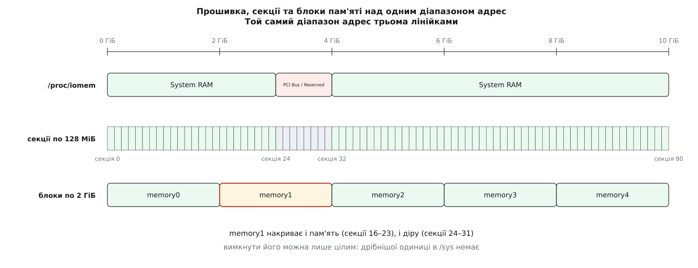

# ⚙️ Модуль, що показує масив описувачів цієї машини

Півтори сотні рядків мовою C — і про модель пам'яті розповідає не книжка, а сама машина: де починається масив `struct page`, які секції адрес заповнені, а які порожні, за якою адресою лежить описувач будь-якого кадру; далі сам модуль, його вивід і ті місця, де такий код падає найшвидше.

## Завдання

Про модель фізичної пам'яті легко читати й важко повірити: числа в поясненнях узяті з чужої машини. Тому зробімо так, щоб їх назвала ваша: розмір секції, базу вікна описувачів, карту наявних секцій і повний розбір одного номера кадру. Усе — з ядра, без здогадок.

Мова тут не обирається: `pfn_valid()`, `pfn_to_page()` і макроси секцій існують лише всередині ядра. Отже — [модуль](topic:sys-unix/kernel-modules) і C.

## Ідея

Модуль тримається на трьох спостереженнях.

**Базу вікна можна вивести, не називаючи жодного архітектурного символу.** Перетворення `pfn_to_page(pfn)` розгортається в `vmemmap + pfn`, тож для будь-якого дійсного кадру `pfn_to_page(pfn) − pfn` дає ту саму базу. Знаходимо перший кадр, для якого `pfn_valid()` каже «так», віднімаємо його номер — і маємо початок масиву. Побічна вигода: код збереться й без vmemmap, тільки база тоді буде правдива лише для першої секції — а це якраз те, що варто побачити на власні очі.

**Верхню межу обходу доводиться задавати руками.** Змінна `max_pfn` модулям не експортована: [патч 2020 року, що це пропонував, не прийняли](https://lkml.iu.edu/hypermail/linux/kernel/2006.0/03737.html), автор обійшовся `totalram_pages()`. Тому межа — параметр модуля, і брати її треба з `/proc/iomem`.

**Секцію видно за кількістю дійсних кадрів у ній.** Перебираємо всі номери секції й рахуємо, скільком з них `pfn_valid()` сказала «так»: усім — секція повна, жодному — порожня, частині — заповнена підсекціями.

## Код

```c
// vmemwalk.c — де живуть описувачі кадрів на цій машині
#define pr_fmt(fmt) "vmemwalk: " fmt

#include <linux/module.h>
#include <linux/mm.h>
#include <linux/mmzone.h>
#include <linux/memory_hotplug.h>
#include <linux/sched.h>

#if !defined(CONFIG_SPARSEMEM)
#error "модуль про SPARSEMEM; на FLATMEM секцій немає й показувати нема чого"
#endif

static unsigned long target_pfn = 0x100000;      /* кадр за адресою 4 ГіБ */
static unsigned long top_pfn = 4UL << 20;        /* межа обходу: 4М кадрів = 16 ГіБ */

module_param(top_pfn, ulong, 0444);
MODULE_PARM_DESC(top_pfn, "верхня межа обходу в кадрах (max_pfn модулям не видно)");

/* повний розбір одного номера кадру */
static void report_pfn(unsigned long pfn)
{
	struct page *page;

	if (!pfn_valid(pfn)) {                   /* СПЕРШУ спитати, потім рахувати */
		pr_info("pfn %#lx: описувача немає (секція %lu порожня)\n",
			pfn, pfn_to_section_nr(pfn));
		return;
	}

	page = pfn_to_page(pfn);
	pr_info("pfn %#lx = секція %lu + зсув %lu\n",
		pfn, pfn_to_section_nr(pfn), pfn & ~PAGE_SECTION_MASK);
	pr_info("  описувач  %px\n", page);      /* %px — без хешування, свідомо */
	pr_info("  назад     page_to_pfn() = %#lx\n", page_to_pfn(page));
	pr_info("  flags     %#lx  вузол %d, зона %u, посилань %d\n",
		page->flags, page_to_nid(page),
		(unsigned)page_zonenum(page), page_ref_count(page));
	pr_info("  онлайн    %s\n", pfn_to_online_page(pfn) ? "так" : "ні");
}

/* запис у /sys/module/vmemwalk/parameters/pfn дає новий звіт */
static int pfn_set(const char *val, const struct kernel_param *kp)
{
	int err = param_set_ulong(val, kp);      /* приймає й 0x…, і десяткове */

	if (err)
		return err;
	report_pfn(target_pfn);
	return 0;
}
static const struct kernel_param_ops pfn_ops = {
	.set = pfn_set,
	.get = param_get_ulong,
};
module_param_cb(pfn, &pfn_ops, &target_pfn, 0644);

/* база масиву за першим дійсним кадром: page − pfn */
static struct page *derive_base(unsigned long *first)
{
	unsigned long pfn;

	for (pfn = 0; pfn < top_pfn; pfn++)
		if (pfn_valid(pfn)) {
			*first = pfn;
			return pfn_to_page(pfn) - pfn;
		}
	return NULL;
}

static void draw_map(void)
{
	unsigned long sec, last = pfn_to_section_nr(top_pfn - 1);
	unsigned long row_first = 0;
	char row[65];
	int col = 0;

	for (sec = 0; sec <= last; sec++) {
		unsigned long base = section_nr_to_pfn(sec), pfn, n = 0;

		for (pfn = base; pfn < base + PAGES_PER_SECTION; pfn++)
			if (pfn_valid(pfn))
				n++;

		if (col == 0)
			row_first = sec;
		row[col] = (n == PAGES_PER_SECTION) ? '#' : n ? '+' : '.';

		if (++col == 64) {
			row[64] = '\0';
			pr_info("  %5lu..%5lu  %s\n", row_first, sec, row);
			col = 0;
		}
		cond_resched();                  /* мільйони перевірок — не тримати процесор */
	}
	if (col) {
		row[col] = '\0';
		pr_info("  %5lu..%5lu  %s\n", row_first, last, row);
	}
}

static int __init vw_init(void)
{
	unsigned long first = 0, pfn, live = 0, bad = 0;
	struct page *base = derive_base(&first);

	pr_info("sizeof(struct page)     %zu Б\n", sizeof(struct page));
	pr_info("SECTION_SIZE_BITS       %d → секція %lu МіБ\n",
		SECTION_SIZE_BITS, 1UL << (SECTION_SIZE_BITS - 20));
	pr_info("PFN_SECTION_SHIFT       %d → кадрів у секції %lu\n",
		PFN_SECTION_SHIFT, PAGES_PER_SECTION);
	pr_info("масив однієї секції     %lu КіБ\n",
		(PAGES_PER_SECTION * sizeof(struct page)) >> 10);
	pr_info("NR_MEM_SECTIONS         %lu (MAX_PHYSMEM_BITS = %d)\n",
		NR_MEM_SECTIONS, MAX_PHYSMEM_BITS);
	pr_info("модель                  %s\n",
		IS_ENABLED(CONFIG_SPARSEMEM_VMEMMAP) ? "SPARSEMEM_VMEMMAP"
						    : "SPARSEMEM без vmemmap");
	if (!base) {
		pr_warn("до кадру %#lx жодного дійсного — підніміть top_pfn\n", top_pfn);
		return -ENODEV;
	}
	pr_info("база масиву             %px (перший дійсний кадр %#lx)\n", base, first);

	/* чи справді описувач = база + номер, для КОЖНОГО дійсного кадру */
	for (pfn = 0; pfn < top_pfn; pfn++) {
		if (!pfn_valid(pfn))
			continue;
		live++;
		if (pfn_to_page(pfn) != base + pfn && ++bad <= 3)
			pr_warn("  розбіг на %#lx: %px замість %px\n",
				pfn, pfn_to_page(pfn), base + pfn);
	}
	pr_info("описано кадрів          %lu (%lu МіБ), розбігів %lu\n",
		live, (live << PAGE_SHIFT) >> 20, bad);

	draw_map();
	report_pfn(target_pfn);
	return 0;
}

static void __exit vw_exit(void) { }

module_init(vw_init);
module_exit(vw_exit);

MODULE_DESCRIPTION("Walk the SPARSEMEM section map and the page descriptor array");
MODULE_LICENSE("GPL");
```

`MODULE_LICENSE("GPL")` тут не формальність: `pfn_to_online_page()` експортовано через `EXPORT_SYMBOL_GPL`, і без цього рядка збірка не знайде символу.

Makefile — звичайний, поза деревом ядра:

```make
obj-m := vmemwalk.o
KDIR ?= /lib/modules/$(shell uname -r)/build

all:
	$(MAKE) -C $(KDIR) M=$(CURDIR) modules
clean:
	$(MAKE) -C $(KDIR) M=$(CURDIR) clean
```

## Що воно друкує

Машина на вісім гігабайтів пам'яті, ядро завантажене з `nokaslr` — щоб база вийшла та сама, що в документації:

```
$ make && sudo insmod vmemwalk.ko && dmesg | tail -20
vmemwalk: sizeof(struct page)     64 Б
vmemwalk: SECTION_SIZE_BITS       27 → секція 128 МіБ
vmemwalk: PFN_SECTION_SHIFT       15 → кадрів у секції 32768
vmemwalk: масив однієї секції     2048 КіБ
vmemwalk: NR_MEM_SECTIONS         524288 (MAX_PHYSMEM_BITS = 46)
vmemwalk: модель                  SPARSEMEM_VMEMMAP
vmemwalk: база масиву             ffffea0000000000 (перший дійсний кадр 0x0)
vmemwalk: описано кадрів          2097152 (8192 МіБ), розбігів 0
vmemwalk:     0..   63  ########################........################################
vmemwalk:    64..  127  ########........................................................
vmemwalk: pfn 0x100000 = секція 32 + зсув 0
vmemwalk:   описувач  ffffea0004000000
vmemwalk:   назад     page_to_pfn() = 0x100000
vmemwalk:   flags     0x17ffffc0000000  вузол 0, зона 2, посилань 0
vmemwalk:   онлайн    так
```

Кожен рядок можна перевірити на папері. Секція — 2²⁷ байтів; кадрів у ній стільки ж, поділених на розмір кадру; масив під них — по 64 байти на кадр:

```
секція        = 2²⁷ Б = 134217728 Б = 128 МіБ
кадрів у ній  = 2²⁷ ÷ 2¹² = 2¹⁵ = 32768
масив секції  = 32768 × 64 Б = 2097152 Б = 2 МіБ
```

Адреса описувача теж рахується без ядра. Кадр `0x100000` — це фізична адреса `0x100000000`, тобто рівно 4 ГіБ:

```
номер секції  = 0x100000 >> 15 = 32
зсув у секції = 0x100000 & (32768 − 1) = 0
описувач      = 0xffffea0000000000 + 0x100000 × 64
              = 0xffffea0000000000 + 0x4000000
              = 0xffffea0004000000
```

Найцікавіше в цьому виводі — рядок з прапорцями, і цікавий він тим, чого в ньому немає. Слово `flags` — не набір бітів-ознак, а кілька полів, укладених від молодших бітів до старших:

```
0x17ffffc0000000
  власне прапорці (заблокована, брудна, у списку…)   усі нулі
  номер останнього процесора                         0x1fffff — не записаний
  номер зони                                         2, тобто ZONE_NORMAL
  номер вузла NUMA                                   0
  номер секції                                       такого поля немає
```

`page_to_nid()` і `page_zonenum()` не звертаються до жодної окремої структури — вони просто зсувають і маскують це слово. Ширини полів визначаються при збірці: скільки біт під вузол, вирішує `CONFIG_NODES_SHIFT`, тому те саме число на іншому ядрі розкладеться інакше. А поля з номером секції немає зовсім: під vmemmap він не потрібен, бо номер кадру виходить відніманням спільної бази. Саме ці біти й звільнилися при переході від нарізаних масивів до суцільного вікна.

Нуль у лічильнику `розбігів` при двох мільйонах перевірених кадрів — не тавтологія, хоч і виглядає нею. Модуль порівнював те, що повернуло ядро, з тим, що дає чисте додавання, і жодного разу не розійшовся; на моделі без vmemmap той самий код дає інший результат.

Ще один кадр можна спитати, не перезавантажуючи модуль:

```
$ echo 0xe0000 | sudo tee /sys/module/vmemwalk/parameters/pfn
$ dmesg | tail -1
vmemwalk: pfn 0xe0000: описувача немає (секція 28 порожня)
```

Кадр `0xe0000` — це адреса `0xe0000000`, три з половиною гігабайти: діра під вікна пристроїв. Секція 28 у карті стоїть крапкою, і `pfn_valid()` це підтвердила.

## Звірка з тим, що видно без модуля

Карта секцій — не окрема правда ядра. Ті самі межі видно двома способами, доступними будь-якому користувачеві.

Перший — таблиця, яку ядро успадкувало від прошивки, у [`/proc`](topic:sys-unix/proc-reading-process-and-kernel-state):

```
$ sudo grep "System RAM" /proc/iomem
00001000-0009fbff : System RAM
00100000-bffd9fff : System RAM
100000000-23fffffff : System RAM
```

Верхня межа нижньої пам'яті `0xbffd9fff` — це кадр `0xbffd9`, тобто секція 23. Наступний шматок починається з `0x100000000` — кадр `0x100000`, секція 32. Кінець `0x23fffffff` — кадр `0x23ffff`, секція 71. Три числа лягли рівно на межі `#` і `.` у карті модуля.

Другий — блоки [гарячого додавання пам'яті](topic:sys-unix/memory-hotplug):

```
$ cat /sys/devices/system/memory/block_size_bytes
8000000
$ ls /sys/devices/system/memory | grep -c '^memory[0-9]'
64
```

Розмір блока `0x8000000` — ті самі 128 МіБ, тобто одна секція; блоків рівно 64 — стільки ж, скільки решіток у карті. На залізній машині з пам'яттю понад 64 ГіБ ядро бере блок у 2 ГіБ, тобто шістнадцять секцій одразу, і тоді лінійки розходяться:



*Три різні одиниці над однією віссю адрес: області прошивки, секції по 128 МіБ і блоки, якими пам'ять вимикають.*

> 🔧 **Навіщо це.** Коли драйвер отримує ззовні фізичну адресу — з таблиці прошивки, з дескриптора пристрою, з опису буфера — цей модуль відповідає на єдине питання, від якого залежить, упаде ядро чи ні: чи є в цієї адреси описувач. Один запис у `parameters/pfn` дешевший за годину читання коду й за перезавантаження після падіння.

## Де це ламається

**`pfn_valid()` перед кожним `pfn_to_page()`.** Без перевірки код отримає адресу всередині вікна, для якої немає запису в таблицях сторінок, — і читання дасть не сміття, а сторінковий збій у ядрі з негайною панікою. Це головна причина, чому в модулі є `return` посеред `report_pfn()`.

**«Дійсний» не означає «оперативна пам'ять».** Для завантажувальної пам'яті масив описувачів виділяють цілою секцією, і `pfn_valid()` каже «так» усім 32768 кадрам, навіть тим, що припадають на дірки всередині секції: описувач у них є, просто позначений як зарезервований. Саме тому модуль нарахував 8192 МіБ — трохи більше за `MemTotal`. Знак `+` у карті з'явиться лише там, де вікно заповнене підсекціями по 2 МіБ: під пам'яттю пристрою або доданим на ходу шматком. Щоб питати не «чи є описувач», а «чи цю пам'ять узагалі можна чіпати», є `pfn_to_online_page()`; а щоб сторінка не зникла з-під рук, потрібне [посилання на неї](topic:sys-unix/page-pinning-gup) — описувач сам собою нічого не тримає.

**Без `CONFIG_SPARSEMEM_VMEMMAP` арифметика інша.** Модуль зібрано так, що він працює й тоді: база виводиться з першого дійсного кадру. Але масиви секцій лежать за не пов'язаними адресами, тож на першому ж кадрі другої секції рівність `page == база + pfn` розсипається, і в лічильнику `розбігів` виявиться не нуль, а сотні тисяч. Це і є найкоротший спосіб побачити різницю між двома [конфігураціями ядра](topic:sys-unix/kernel-config-and-build) на живому виводі.

**База гуляє від завантаження до завантаження.** З `CONFIG_RANDOMIZE_MEMORY`, яка ввімкнена в усіх поширених збірках, ядро зсуває початок вікна описувачів разом з іншими своїми областями. Документована адреса `0xffffea0000000000` — те, що буде без випадковості; тому модуль базу друкує, а не звіряє з константою.

**`%p` збрехав би навмисне.** З ядра 4.15 звичайний `%p` друкує не адресу, а її хеш: у ядрі знайшлося близько чотирнадцяти тисяч місць, де адреса потрапляла в журнал, і замість правити кожне окремо їх усі закрили одним хешем, а для тих, кому потрібне справжнє число, завели `%px`. Саме він тут і стоїть; у виробничому коді цей формат недоречний рівно з тієї причини, з якої з'явився хеш.

**Прапорці — миттєвий знімок.** `page->flags` читаються без жодного замка й без посилання на сторінку: поки рядок дійде до журналу, кадр може бути вже звільнений і виданий іншому. Для розглядання це годиться, для рішень — ні.

**Обхід коштує часу.** Складність лінійна за кількістю кадрів: у карті — один прохід, у перевірці бази — другий. На шістнадцяти гігабайтах це чотири мільйони перевірок на прохід, десятки мілісекунд. На машині з терабайтом пам'яті буде двісті шістдесят вісім мільйонів, і без `cond_resched()` модуль повісив би своє ядро процесора на кілька секунд. Дешевша карта можлива: для завантажувальної секції результат однаковий для всіх її кадрів, тож досить перевірити один — але тоді зникнуть саме ті `+`, заради яких карту й малюють.
