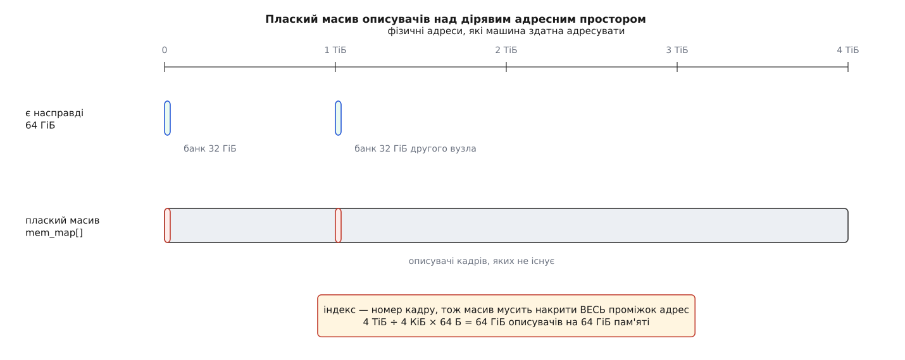
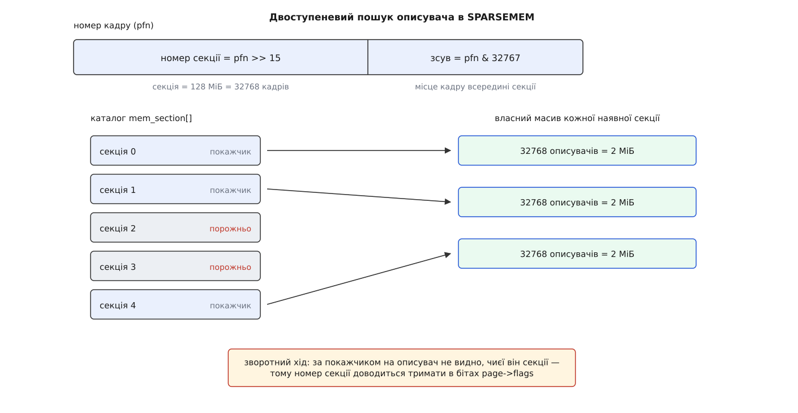
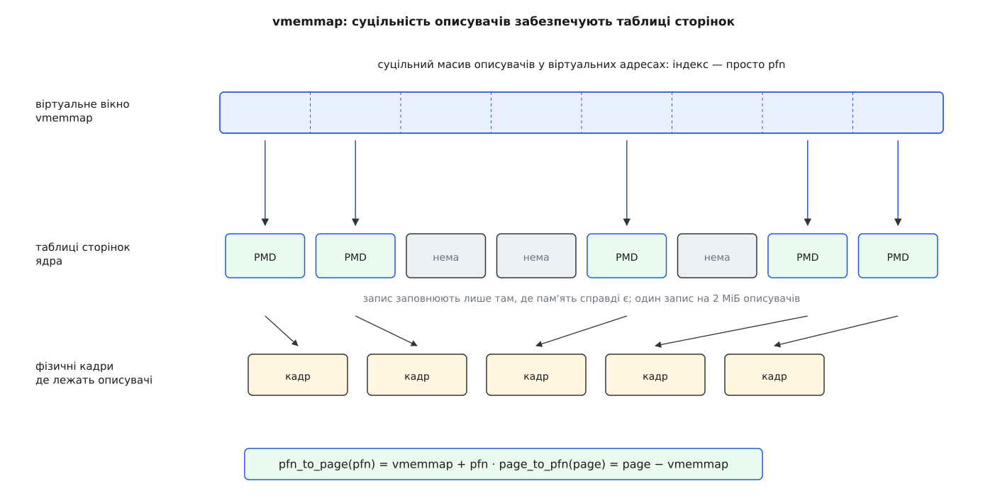
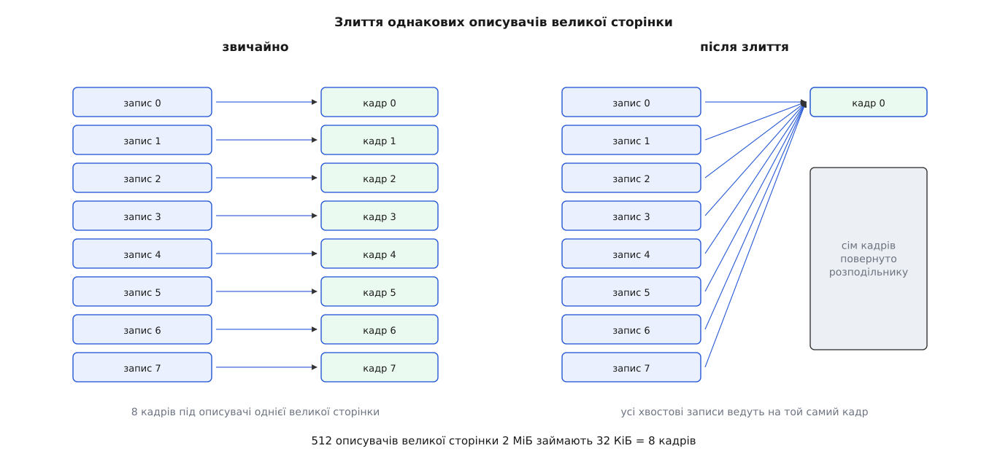

# Модель фізичної пам'яті: SPARSEMEM, vmemmap і масив описувачів кадрів

<preknowlist>
- [Сторінки, таблиці сторінок і MMU](root:sf-os/paging-and-mmu) — фізична пам'ять нарізана на кадри однакового розміру, звично по 4 КіБ; віртуальну адресу перетворюють таблиці сторінок, які обходить апаратура.
- [Фізичні сторінки в ядрі](root:sys-unix/physical-page-allocator) — на кожен кадр ядро тримає описувач `struct page`: лічильник посилань, прапорці стану, місце в списках вільного.
- [Віртуальний адресний простір](root:sf-os/virtual-address-space) — адреса сама собою нічого не важить: існує лише те, для чого є запис у таблицях.
- [Великі сторінки](root:sys-unix/huge-pages-tlb-reach) — один запис таблиці може відображати 2 МіБ суцільним шматком, замість п'ятисот дванадцяти окремих.
- [Нерівномірний доступ до пам'яті](root:hw-arch/numa) — банки пам'яті належать різним вузлам і рознесені по адресному простору.
</preknowlist>

Пам'ять машини ядро роздає не байтами, а однаковими шматками, і про кожен такий шматок мусить щось пам'ятати: скільки на нього посилань, чи його змінили від останнього запису на диск, у якому списку він лежить, кому належить. Це «щось» — маленька структура, по одній на кадр. У Linux вона зветься `struct page` і важить близько 64 байтів.

Тепер найважливіше. Майже кожна дія ядра з пам'яттю починається з числа: сторінковий збій приносить фізичну адресу, драйвер повертає адресу буфера, витіснення обходить кадри за номерами. А закінчується дія роботою з описувачем. Отже, посередині мусить бути перетворення «номер кадру → адреса його структури», і виконується воно мільйони разів на секунду, у найгарячіших місцях ядра. Як саме це перетворення влаштоване — не дрібниця реалізації. Від нього залежить, скільки пам'яті ядро змарнує на власний облік і чи зможе машина взагалі отримати ще один модуль пам'яті на ходу.

## Найдешевше перетворення, яке взагалі буває

Номер кадру — це фізична адреса, поділена на розмір кадру: суцільний ряд чисел від нуля. Ряд чисел просить масиву. Покладімо всі описувачі поспіль, за зростанням номера, і перетворення в обидва боки стане арифметикою:

```
описувач за номером   :  page = mem_map + pfn
номер за описувачем   :  pfn  = page − mem_map
```

Жодного пошуку, жодного звертання до пам'яті по дорозі — одне множення на розмір структури й одне додавання, і те й те компілятор часто згортає в одну інструкцію. Дешевше не буває фізично. Ця модель у ядрі зветься FLATMEM (від англ. *flat* — плаский): один глобальний масив на всю пам'ять.

Ціна обліку тут теж проста й неминуча:

```
описувач              = 64 Б
кадр                  = 4096 Б
частка на облік       = 64 ÷ 4096 = 1/64 ≈ 1.6 %
на 64 ГіБ пам'яті     = 64 ГіБ ÷ 64 = 1 ГіБ описувачів
```

Півтора відсотка пам'яті, віддані за те, щоб ядро знало про пам'ять хоч щось, — плата, з якою всі згодні. Проблема не в ній.

## Чому один масив не тримається

Індекс масиву прив'язаний до номера кадру, а номер — до адреси. Тому масив мусить накрити не наявну пам'ять, а **весь проміжок адрес**, у якому вона розкидана. І ось тут з'ясовується, що фізичний адресний простір ніколи не буває щільним.

Під чотиригігабайтною межею вирізані вікна пристроїв на шині та ділянки прошивки — це кілька дірок ще на найпростішій машині. На багатовузловій машині кожен вузол дістає свій діапазон адрес, і бази вузлів рознесені далеко, з великим запасом між ними. А прошивка сервера, розрахованого на додавання пам'яті на ходу, оголошує адресне вікно на майбутнє: планка ще не вставлена, а адреси під неї вже зарезервовані.

Порахуймо машину, у якій стоїть 64 ГіБ, а адреси тягнуться до 4 ТіБ:

```
проміжок адрес        = 4 ТіБ
кадрів у проміжку     = 4 ТіБ ÷ 4 КіБ = 2³⁰ = 1073741824
масив описувачів      = 2³⁰ × 64 Б = 64 ГіБ
корисних описувачів   = 64 ГіБ ÷ 64 = 1 ГіБ
```

Шістдесят чотири гігабайти масиву заради гігабайта справжніх записів — весь обсяг встановленої пам'яті пішов би на опис самої себе. Друга біда підпирає першу: масив мусить лежати суцільним шматком фізичної пам'яті й з'явитися дуже рано, ще коли пам'ять роздає [memblock](root:sys-unix/memblock-early-memory). Суцільних шістдесяти чотирьох гігабайтів у машині з шістдесятьма чотирма гігабайтами просто немає.



*Дві планки по 32 ГіБ, рознесені по адресах на терабайт, коштують плаского масиву на всі чотири терабайти.*

Обидві біди — з одного кореня: масив суцільний, а адреси роздано розріджено. Отже, масив треба різати.

## Спроба різати по вузлах

Перша відповідь напрошується сама: пам'ять розподілена по вузлах, у кожного вузла свій діапазон адрес — хай у кожного буде й свій масив описувачів. Так працювала модель DISCONTIGMEM (від англ. *discontiguous* — несуміжний): масив на вузол, у структурі вузла покажчик `node_mem_map` і номер першого кадру.

Перетворення при цьому дорожчає різко. Щоб знайти описувач за номером кадру, треба спершу з'ясувати, якому вузлові цей кадр належить, — а це або пошук по вузлах, або окрема таблиця відповідності, і те й те на гарячому шляху.

Але глибша вада не в швидкості. Межі вузла — властивість топології машини, а не властивість того, де в адресах діри. Діра **всередині** вузла нічого не заощаджує: масив вузла все одно накриває її цілком. А пам'ять, додана на ходу, приходить за адресою, яку топологія не передбачала, і не вміщається в жоден готовий масив — його доводиться перевиділяти й переносити разом з усіма посиланнями. Модель, побудована на вузлах, розв'язує задачу про NUMA і не розв'язує задачу про діри й гаряче додавання, хоч болять саме вони.

Тому DISCONTIGMEM поступово вимерла: останні архітектури перевели на інші моделі в ядрі 5.11, а сам код Майк Рапопорт вилучив улітку 2021 року. [Як мінялися моделі пам'яті](root:sys-unix/sparsemem-and-vmemmap/hist-memory-models.md) — окрема історія з іменами й датами.

## Різати по однакових секціях

Висновок з невдачі точний: одиниця нарізки має бути властивістю **адреси**, а не топології. Тобто — шматок сталого розміру, той самий скрізь, незалежно від того, скільки в машині вузлів і де стоять планки.

Так з'явилася модель SPARSEMEM (від англ. *sparse* — розріджений). Увесь можливий адресний простір ділять на секції однакового розміру — на x86-64 і на arm64 зі сторінками 4 КіБ це 2²⁷ байтів, тобто 128 МіБ (на arm64 зі сторінками 64 КіБ — 512 МіБ). Заводять каталог `mem_section[]`, індексований номером секції. Запис каталогу для секції, у якій пам'ять є, тримає покажчик на масив описувачів **цієї** секції; запис для секції без пам'яті лишається порожнім і не коштує нічого, крім самого запису.

Перетворення стає двоступеневим:

```
SECTION_SIZE_BITS = 27              секція = 128 МіБ
PFN_SECTION_SHIFT = 27 − 12 = 15    кадрів у секції = 32768
масив однієї секції = 32768 × 64 Б = 2 МіБ

номер секції = pfn >> 15
описувач     = mem_section[pfn >> 15].section_mem_map + pfn
```

Другий рядок виглядає дивно: чому до масиву секції додають повний номер кадру, а не зсув усередині секції? Бо в полі `section_mem_map` лежить не початок масиву, а початок, **зменшений** на номер першого кадру секції. Віднімання зроблено один раз при заведенні секції, щоб на гарячому шляху лишилося чисте додавання.

Каталог теж не безкоштовний. Його довжина — це весь адресний простір, поділений на секцію: на x86-64 з чотирирівневими таблицями адресується 46 бітів, отже 2⁴⁶⁻²⁷ = 2¹⁹ = 524288 записів. Статичний масив такої довжини важить кілька мегабайтів і лежав би в ядрі завжди, навіть на машині з гігабайтом пам'яті. Тому каталог роблять дворівневим (конфігурація `SPARSEMEM_EXTREME`): угорі масив покажчиків, а кожен листок — рівно сторінка записів, і листок виділяють лише тоді, коли в його діапазоні знайшлася пам'ять.



*Порожні секції коштують одного запису каталогу; наявні — власного масиву на 2 МіБ.*

Розріджену пам'ять це прибрало, але лишило два податки. Перший — два залежні звертання до пам'яті: адресу масиву не дізнатися, поки не прочитано запис каталогу, тож процесор не може почати друге читання раніше за перше.

Другий податок дошкульніший, і він у зворотному напрямку. За покажчиком на описувач більше не видно, чиєї він секції: масиви секцій лежать за не пов'язаними між собою адресами, і відняти одну спільну базу нема від чого. Отже, номер секції доводиться зберігати **в самому описувачі** — у бітах слова `flags`. А це слово вже переповнене: там номер зони, номер вузла NUMA, мітка для перевірок доступу, поле для обліку останнього процесора. Біти скінченні, і на великій машині конфігурації доводиться чимось жертвувати заради номера секції.

## Хай суцільність робить апаратура

Обидва податки походять з однієї обставини: масив розрізано не лише у фізичній пам'яті, а й у **віртуальних адресах**. Кожен шматок лежить сам собою, тому потрібен покажчик, а покажчик треба десь узяти.

Але ядро вже володіє машинерією, яка робить рівно те, чого тут бракує: показує розкидані фізичні шматки як один суцільний діапазон. Це таблиці сторінок. Саме на них тримається [vmalloc](root:sys-unix/vmalloc-kernel-mappings), і те саме можна зробити з масивом описувачів.

Хід такий. Ядро відрізає собі віртуальне вікно, достатнє для описувачів усього можливого фізичного простору, і поводиться з ним як із пласким масивом. Таблиці сторінок заповнюють лише в тих частинах вікна, які відповідають наявній пам'яті. Решта вікна лишається порожньою — і не коштує ані байта, бо віртуальні адреси не є пам'яттю.

Перетворення повертається до вигляду з пласкої моделі:

```
описувач за номером   :  page = vmemmap + pfn
номер за описувачем   :  pfn  = page − vmemmap
```

Одна арифметична дія в обидва боки. Ніяких бітів у `flags` більше не треба: база спільна для всіх описувачів, тож віднімання знову має сенс. Непряме звертання нікуди не зникло — воно переїхало в таблиці сторінок, де його виконує апаратура, а результат осідає в TLB і на наступних зверненнях не коштує нічого. Ця модель зветься SPARSEMEM_VMEMMAP, і на всіх сучасних 64-бітових архітектурах вона типова.

Вікно на x86-64 з чотирирівневими таблицями починається з адреси `0xffffea0000000000` і має довжину 1 ТіБ. Перевірмо, що цього досить:

```
вікно                 = 1 ТіБ = 2⁴⁰ Б
описувачів у вікні    = 2⁴⁰ ÷ 64 = 2³⁴
пам'яті під ними      = 2³⁴ × 4 КіБ = 2⁴⁶ Б = 64 ТіБ
```

Рівно стільки фізичної пам'яті й адресує ядро при чотирьох рівнях таблиць. Тобто вікно розміряне не під наявну пам'ять, а під межу архітектури — із запасом, якого жодна реальна машина не вибирає: терабайт віртуальних адрес віддано без роздумів, бо це найдешевший ресурс, який у ядра є.

А от таблиці під це вікно — вже справжня пам'ять, і їх заповнюють великими сторінками, де апаратура дозволяє. Один запис рівня PMD відображає 2 МіБ описувачів, тобто 32768 структур, тобто 128 МіБ пам'яті — рівно одну секцію. Збіг не випадковий: розмір секції й підібрали так, щоб секція лягала в один запис таблиці.

```
на 1 ТіБ пам'яті:
  описувачів          = 1 ТіБ ÷ 64 = 16 ГіБ
  записів PMD         = 16 ГіБ ÷ 2 МіБ = 8192
  таблиці під vmemmap = 8192 × 8 Б = 64 КіБ
```

Шістдесят чотири кілобайти службових таблиць на шістнадцять гігабайтів описувачів — податок, який не видно навіть у мікроскоп. Заразом великі сторінки означають, що весь масив описувачів терабайтної машини накривається кількома тисячами записів TLB, а не мільйонами.

> 🔧 **Навіщо це.** Коли на 64-бітовій машині збираєте ядро й бачите в конфігурації `CONFIG_SPARSEMEM_VMEMMAP=y`, вмикати натомість «простішу» пласку модель нема сенсу — вона не швидша. Швидкість перетворення там однакова, а пласка модель просто не дає ані гарячого додавання пам'яті, ані економії на дірах. На 32-бітових машинах усе навпаки: віддати терабайт віртуальних адрес нема з чого, тому там і досі живе FLATMEM. Тому вибір моделі — питання архітектури, а не смаку.



*Суцільність масиву описувачів забезпечує MMU; фізичні кадри під описувачі розкидані як завгодно.*

Переконатися в цій арифметиці можна руками: [маленький модуль ядра](root:sys-unix/sparsemem-and-vmemmap/proj-vmemmap-walk.md) друкує базу вікна, обчислює адресу описувача для заданого номера кадру й показує, які секції на цій машині заповнені.

## Що з цієї моделі стирчить назовні

Модель фізичної пам'яті виглядає внутрішньою справою ядра, але наслідки з неї виходять на поверхню — і зокрема в те, як пишуть драйвери.

**Не всякий номер кадру має описувача.** У пласкій моделі звертання за номером із діри дало б сміття. У моделі з вікном воно дає адресу всередині вікна, для якої **немає запису в таблицях**, — тобто не хибну відповідь, а падіння ядра на недоступній адресі. Саме тому перед будь-яким перетворенням код зобов'язаний спитати `pfn_valid()`, яка перевіряє, чи заповнено відповідну секцію. Правило б'є там, де фізична адреса приходить іззовні: з таблиці прошивки, від пристрою, з опису буфера для DMA.

**Секція — одиниця появи пам'яті.** Додати пам'ять на ходу означає виділити масив описувачів, заповнити частину вікна vmemmap і позначити секцію наявною; менш ніж секцією це зробити не можна. Тому [гаряче додавання пам'яті](root:sys-unix/memory-hotplug) працює блоками, які видно в `/sys/devices/system/memory`, і розмір блока — ціле число секцій. Зворотний бік болючіший: щоб вилучити блок, у ньому не має лишитися жодного нерухомого виділення ядра. Один довгоживучий об'єкт десь усередині ста двадцяти восьми мегабайтів тримає весь блок, і саме тому вилучення пам'яті так часто не вдається.

Звідси ж походить окремий режим `memmap_on_memory`: описувачі щойно доданого діапазону кладуть у нього самого. Інакше додавання терабайта вимагає спершу знайти шістнадцять гігабайтів у вже наявній пам'яті — і на вузлі, де їх немає, додавання просто не відбудеться.

**Пристроям буває потрібна дрібніша нарізка.** [Постійна пам'ять](root:sys-unix/persistent-memory-devices) описується просторами імен, розміри яких ніхто не рівняв на 128 МіБ. Тому для таких діапазонів вікно заповнюють підсекціями по 2 МіБ — найменшим кроком, спільним для архітектур.

**Описувачі можна винести з пам'яті взагалі.** Півтора відсотка — прийнятна плата, поки мова про гігабайти. Для постійної пам'яті це інший розмір:

```
пристрій 6 ТіБ        → описувачів 6 ТіБ ÷ 64 = 96 ГіБ
```

Дев'яносто шість гігабайтів оперативної пам'яті на облік чужого пристрою ніхто не віддасть. Тому таблиці вікна для цього діапазону вказують на кадри **самого пристрою**: описувачі живуть там, де й дані, які вони описують. Механізм зветься `vmem_altmap`, і можливий він рівно тому, що масив описувачів — звичайне відображення, а куди ведуть його записи, вирішує ядро.

**Однакові описувачі можна злити в один.** Найяскравіший наслідок — на великих сторінках. Велика сторінка на 2 МіБ складається з 512 кадрів, і всі описувачі, крім кількох перших, тримають те саме: мітку хвостової сторінки й посилання на голову. Байт у байт однакові структури, які займають реальну пам'ять:

```
велика сторінка 2 МіБ:
  описувачів          = 512
  байтів під них      = 512 × 64 = 32 КіБ = 8 кадрів
  лишається           = 1 кадр
  повертається        = 7 кадрів = 28 КіБ

велика сторінка 1 ГіБ:
  кадрів під описувачі = 4096
  повертається         = 4095 ≈ 16 МіБ на кожен гігабайт
```

Ядро переписує записи таблиць так, щоб усі хвостові кадри вікна вели на один і той самий фізичний кадр (і забороняє в нього писати), а звільнені кадри віддає розподільникові. На машині, де терабайт відданий під великі сторінки, це повертає близько шістнадцяти гігабайтів.



*Записи таблиці ведуть на той самий кадр; сім кадрів повертаються розподільникові.*

Варто побачити, чим це тримається. Злити однакові записи в масиві неможливо: у масиві адреса елемента задана його індексом, і два індекси не можуть указувати на ту саму пам'ять. У відображенні — можуть, бо адреса задана записом таблиці, а записів на один кадр буває скільки завгодно.

Тобто перехід від масиву до вікна дав не лише швидкість. Масив описувачів перестав бути масивом і став звичайним відображенням — і разом з цим отримав усе, що вміють відображення: рости частинами, вести в пам'ять пристрою, ділити один кадр між багатьма адресами. [Перемикачі й імена](root:sys-unix/sparsemem-and-vmemmap/api-sparsemem-controls.md), якими це вмикають і спостерігають, зібрані окремо.
