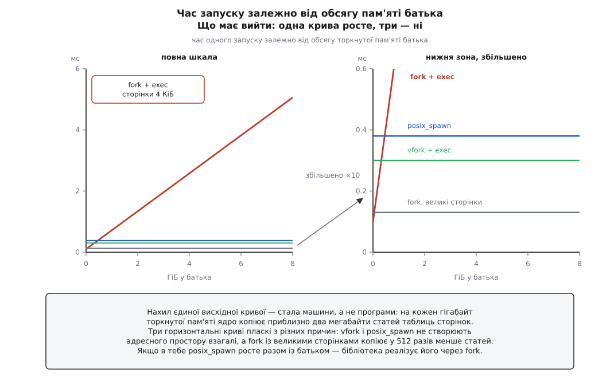

# ⚙️ Скільки коштує народження: три способи на одних терезах

Твердження «`posix_spawn` дешевший за `fork` + `exec`» перевіряється однією програмою на дві сотні рядків — і перша ж спроба зазвичай дає протилежне число, бо годинник поставлено не туди. Нижче — програма, яка міряє три способи народити процес трьома мірками одночасно, передбачення, які треба записати **до** запуску, і контрольний дослід, що доводить: платимо ми саме за таблиці сторінок, а не за щось інше.

Усе це — Linux: `/proc/self/status`, керування великими сторінками через `madvise` і `vfork` у такому вигляді є саме тут. Самі виміри (`clock_gettime`, `getrusage`) — POSIX і працюють будь-де.

## Чому одного числа мало

Найпростіший вимір — засікти час перед викликом і після того, як він повернувся. Для трьох наших способів це число означає **різні речі**, і в цьому вся пастка.

`fork` повертається одразу після того, як ядро скопіювало таблиці сторінок. Далі дитина робить [заміну образу](topic:sys-unix/exec-semantics) вже паралельно з батьком — у це число вона не входить.

`vfork` і `posix_spawn` спиняють батька до миті, коли дитина зробить `exec`. Отже те саме число тут включає **чужу роботу**: запуск програми дитини, роботу [динамічного завантажувача](topic:sys-unix/dynamic-loader), перший вхід у її `main`. На маленькому батькові ця чужа робота більша за копію таблиць — і секундомір чесно покаже, що `fork` «швидший». Висновок буде хибний, а число правильне.

Тому мірок треба три, і кожна відповідає на своє питання.

**У виклику** — скільки мілісекунд потік батька застряг у самому виклику. Це те, що відчує служба, якій є чим зайнятися далі.

**Sys батька** — скільки процесорного часу в режимі ядра батько спалив на один запуск, за `getrusage(RUSAGE_SELF)`. Це справжня робота, а не очікування: спинений батько часу не витрачає, тому саме цей стовпець відділяє «я працював» від «я стояв». Що таке `user` і `sys` окремо — у статті про [облік процесорного часу](topic:sys-unix/cpu-time-accounting).

**Усього** — від початку виклику до того, як дитина завершилася й батько її забрав. Єдина мірка, яку можна порівнювати між способами напряму, бо в неї входить однакова робота.

## Три передбачення

Записати їх треба заздалегідь, інакше буде спокуса пояснити заднім числом будь-яке число, яке вийшло.

**Перше: лінія `fork` має рости, і нахил рахується наперед.** Копію адресного простору [копіювання при записі](topic:sf-os/copy-on-write) робить лінивою, але таблиці сторінок ядро копіює одразу. На x86-64 зі сторінками 4 КіБ одна стаття нижнього рівня займає 8 байтів і описує одну сторінку:

```
статей на 1 ГіБ    =  1 ГіБ / 4 КіБ   =  262144
байтів таблиць     =  262144 · 8 Б    =  2 МіБ        (1/512 обсягу)
```

Отже обсяг роботи прямо пропорційний **торкнутій** пам'яті батька, а коефіцієнт — властивість машини й [її сторінок](topic:sf-os/paging-and-mmu), не програми. Пам'ять, яку лише виділили, але жодного разу не записали, статей не має — і не коштує нічого.

**Друге: дві інші лінії мають бути пласкі.** Ні `vfork`, ні `posix_spawn` у glibc не створюють дитині адресного простору взагалі, тож копіювати нічого. Їхній `sys` не повинен реагувати на обсяг батька — від нуля до десятків гігабайтів.

**Третє, контрольне: великі сторінки мають обвалити першу лінію.** Якщо ділянку віддати під [великі сторінки](topic:sys-unix/huge-pages-tlb-reach), одна стаття другого рівня накриває 2 МіБ замість 4 КіБ:

```
статей на 1 ГіБ    =  1 ГіБ / 2 МіБ   =  512
байтів таблиць     =  512 · 8 Б       =  4 КіБ       (у 512 разів менше)
```

Це і є дослід, який замикає доведення. Якщо ціна `fork` — це справді таблиці сторінок, то той самий гігабайт під великими сторінками мусить коштувати в сотні разів дешевше, при незмінному `VmRSS`. Якщо ж лінія не обвалиться, платимо ми за щось інше, і всю теорію треба переписувати.



*Результат виміру — не одне число, а форма: одна крива має нахил, три не мають.*

## Помічник

Дитина має бути якнайдешевшою, інакше її власний запуск заллє всю різницю. Тому помічник — програма з порожнім `main`, зібрана [статично](topic:sys-unix/static-and-dynamic-linking): динамічно зібраний `/bin/true` на кожен запуск тягне завантажувач, пошук бібліотек і розв'язання символів — це сотні мікросекунд сталої домішки, яка не заважає побачити нахил, але з'їдає всю нижню зону.

```sh
printf 'int main(void){return 0;}\n' > noop.c
cc -O2 -static -o noop noop.c
cc -O2 -Wall -Wextra -o spawncost spawncost.c
```

## Програма

Один файл, ніяких прав, ніяких залежностей.

:::tabs
```c
/* spawncost.c — три способи народити процес на одних терезах. */
#define _GNU_SOURCE
#include <errno.h>
#include <fcntl.h>
#include <spawn.h>
#include <stdio.h>
#include <stdlib.h>
#include <string.h>
#include <sys/mman.h>
#include <sys/resource.h>
#include <sys/wait.h>
#include <time.h>
#include <unistd.h>

extern char **environ;

/* HELPER — масив, а не покажчик: тоді його ім'я є сталим адресним виразом
   і ним можна ініціалізувати статичний ARGV. А ARGV має бути готовий ДО
   виклику vfork: у дитині вже нічого не можна побудувати. */
static char  HELPER[] = "./noop";
static char *ARGV[]   = { HELPER, NULL };

static struct timespec now(void)
{
    struct timespec t;
    clock_gettime(CLOCK_MONOTONIC, &t);
    return t;
}

/* Різниця двох моментів у мілісекундах. Віднімаємо ЦІЛІ поля й лише потім
   переводимо в double: секунди від старту системи, помножені на 10⁹, з'їли б
   усю точність мантиси, і наносекунди в ній потонули б. */
static double ms_between(struct timespec a, struct timespec b)
{
    return (double)(b.tv_sec - a.tv_sec) * 1e3
         + (double)(b.tv_nsec - a.tv_nsec) / 1e6;
}

/* Одне поле з файлу /proc, у кілобайтах; −1, якщо поля немає. */
static long field_kb(const char *path, const char *key)   /* key — «VmPTE:» */
{
    static char buf[8192];
    char pat[64];

    int fd = open(path, O_RDONLY);
    if (fd < 0)
        return -1;
    buf[0] = '\n';                       /* щоб шукати саме початок РЯДКА */
    ssize_t n = read(fd, buf + 1, sizeof(buf) - 2);
    close(fd);
    if (n <= 0)
        return -1;
    buf[n + 1] = '\0';

    snprintf(pat, sizeof(pat), "\n%s", key);
    char *s = strstr(buf, pat);
    return s ? strtol(s + strlen(pat), NULL, 10) : -1;
}

/* Пам'ять батька: рівно стільки ТОРКНУТИХ сторінок, скільки просили. */
static void grow_parent(size_t bytes, int huge)
{
    if (bytes == 0)
        return;
    char *p = mmap(NULL, bytes, PROT_READ | PROT_WRITE,
                   MAP_PRIVATE | MAP_ANONYMOUS, -1, 0);
    if (p == MAP_FAILED) {
        perror("mmap");
        exit(1);
    }
    /* Кажемо явно в ОБИДВА боки: інакше результат залежатиме від того, як
       великі сторінки налаштовані в цій системі, і два запуски на різних
       машинах виявляться незіставними. */
    madvise(p, bytes, huge ? MADV_HUGEPAGE : MADV_NOHUGEPAGE);

    size_t page = (size_t)sysconf(_SC_PAGESIZE);
    for (size_t off = 0; off < bytes; off += page)
        p[off] = 1;                      /* без дотику статей таблиць не буде */
}

static pid_t spawn_fork(void)
{
    pid_t pid = fork();
    if (pid < 0) {
        perror("fork");
        exit(1);
    }
    if (pid == 0) {
        execv(HELPER, ARGV);
        _exit(127);
    }
    return pid;
}

/* vfork: дитина живе в пам'яті батька, тож їй дозволено рівно два кроки —
   exec або _exit. Ні printf (це буфери батька), ні exit (це його обробники
   atexit), ні виходу з цієї функції (це рамка стека, у яку батько
   повернеться). Навіть повідомлення про помилку — тільки write(2), і рядок
   до нього лежить у сталих даних, а не на стеку. */
static pid_t spawn_vfork(void)
{
    static const char msg[] = "execv failed\n";
    pid_t pid = vfork();
    if (pid < 0) {
        perror("vfork");
        exit(1);
    }
    if (pid == 0) {
        execv(HELPER, ARGV);
        (void)!write(STDERR_FILENO, msg, sizeof msg - 1);
        _exit(127);
    }
    return pid;
}

/* posix_spawn повертає код помилки ЗНАЧЕННЯМ і не чіпає errno — тому тут
   strerror(rc), а не perror(). */
static pid_t spawn_posix(void)
{
    pid_t pid;
    int rc = posix_spawn(&pid, HELPER, NULL, NULL, ARGV, environ);
    if (rc != 0) {
        fprintf(stderr, "posix_spawn: %s\n", strerror(rc));
        exit(1);
    }
    return pid;
}

static int cmp_double(const void *a, const void *b)
{
    double x = *(const double *)a, y = *(const double *)b;
    return (x > y) - (x < y);
}

static void reap(pid_t pid)
{
    int st;
    while (waitpid(pid, &st, 0) < 0 && errno == EINTR)
        ;
}

static void run(const char *name, pid_t (*spawn)(void), int iters, double *v)
{
    struct rusage r0, r1;

    reap(spawn());                       /* прогрів: помічник у кеші сторінок */

    getrusage(RUSAGE_SELF, &r0);
    struct timespec t0 = now();
    for (int i = 0; i < iters; i++) {
        struct timespec c0 = now();
        pid_t pid = spawn();
        struct timespec c1 = now();
        v[i] = ms_between(c0, c1);
        reap(pid);
    }
    struct timespec t1 = now();
    getrusage(RUSAGE_SELF, &r1);

    double whole = ms_between(t0, t1) / iters;
    double sys   = ((double)(r1.ru_stime.tv_sec  - r0.ru_stime.tv_sec) * 1e3
                  + (double)(r1.ru_stime.tv_usec - r0.ru_stime.tv_usec) / 1e3)
                 / iters;

    /* Медіана, а не середнє: один запуск, якому не пощастило з планувальником
       чи з частотою ядра, здатен зіпсувати середнє на десятки відсотків. */
    qsort(v, (size_t)iters, sizeof v[0], cmp_double);
    printf("%-12s %9.3f %11.3f %10.3f\n", name, v[iters / 2], sys, whole);
}

int main(int argc, char **argv)
{
    size_t mib   = (argc > 1) ? strtoul(argv[1], NULL, 10) : 1024;
    int    iters = (argc > 2) ? atoi(argv[2]) : 200;
    int    huge  = (argc > 3 && strcmp(argv[3], "--huge") == 0);

    if (iters < 3)
        iters = 3;
    grow_parent(mib << 20, huge);

    printf("батько: %zu МіБ торкнутих · VmRSS %ld КіБ · VmPTE %ld КіБ"
           " · великі сторінки %ld КіБ\n",
           mib,
           field_kb("/proc/self/status", "VmRSS:"),
           field_kb("/proc/self/status", "VmPTE:"),
           field_kb("/proc/self/smaps_rollup", "AnonHugePages:"));
    puts("спосіб       у виклику  sys батька     усього");

    double *v = malloc(sizeof *v * (size_t)iters);
    if (!v)
        return 1;
    run("fork+exec",   spawn_fork,  iters, v);
    run("vfork+exec",  spawn_vfork, iters, v);
    run("posix_spawn", spawn_posix, iters, v);
    free(v);
    return 0;
}
```
```cpp
#define _GNU_SOURCE
#include <errno.h>
#include <fcntl.h>
#include <spawn.h>
#include <sys/mman.h>
#include <sys/resource.h>
#include <sys/wait.h>
#include <time.h>
#include <unistd.h>
#include <algorithm>
#include <chrono>
#include <cstring>
#include <fstream>
#include <iomanip>
#include <iostream>
#include <memory>
#include <string>
#include <string_view>
#include <vector>

extern char **environ;

static char HELPER[] = "./noop";
static char *ARGV[] = { HELPER, nullptr };

static double ms_between(struct timespec a, struct timespec b) {
    return static_cast<double>(b.tv_sec - a.tv_sec) * 1e3
         + static_cast<double>(b.tv_nsec - a.tv_nsec) / 1e6;
}

static struct timespec now() {
    struct timespec t{};
    clock_gettime(CLOCK_MONOTONIC, &t);
    return t;
}

static long field_kb(const char *path, const char *key) {
    std::ifstream file(path);
    if (!file.is_open()) return -1;
    std::string line;
    while (std::getline(file, line)) {
        if (line.rfind(key, 0) == 0) {
            size_t pos = line.find_first_of("0123456789");
            if (pos != std::string::npos) {
                return std::stol(line.substr(pos));
            }
        }
    }
    return -1;
}

static void grow_parent(size_t bytes, bool huge) {
    if (bytes == 0) return;
    char *p = static_cast<char*>(mmap(nullptr, bytes, PROT_READ | PROT_WRITE,
                                      MAP_PRIVATE | MAP_ANONYMOUS, -1, 0));
    if (p == MAP_FAILED) {
        std::perror("mmap");
        std::exit(1);
    }
    madvise(p, bytes, huge ? MADV_HUGEPAGE : MADV_NOHUGEPAGE);

    size_t page = static_cast<size_t>(sysconf(_SC_PAGESIZE));
    for (size_t off = 0; off < bytes; off += page) {
        p[off] = 1;
    }
}

static pid_t spawn_fork() {
    pid_t pid = ::fork();
    if (pid < 0) { std::perror("fork"); std::exit(1); }
    if (pid == 0) {
        ::execv(HELPER, ARGV);
        ::_exit(127);
    }
    return pid;
}

static pid_t spawn_vfork() {
    static const char msg[] = "execv failed\n";
    pid_t pid = ::vfork();
    if (pid < 0) { std::perror("vfork"); std::exit(1); }
    if (pid == 0) {
        ::execv(HELPER, ARGV);
        (void)!::write(STDERR_FILENO, msg, sizeof(msg) - 1);
        ::_exit(127);
    }
    return pid;
}

static pid_t spawn_posix() {
    pid_t pid = 0;
    int rc = ::posix_spawn(&pid, HELPER, nullptr, nullptr, ARGV, environ);
    if (rc != 0) {
        std::cerr << "posix_spawn: " << std::strerror(rc) << '\n';
        std::exit(1);
    }
    return pid;
}

static void reap(pid_t pid) {
    int st = 0;
    while (::waitpid(pid, &st, 0) < 0 && errno == EINTR) {}
}

template <typename Func>
static void run(std::string_view name, Func spawn_fn, int iters, std::vector<double>& v) {
    struct rusage r0{}, r1{};

    reap(spawn_fn());

    getrusage(RUSAGE_SELF, &r0);
    struct timespec t0 = now();
    for (int i = 0; i < iters; ++i) {
        struct timespec c0 = now();
        pid_t pid = spawn_fn();
        struct timespec c1 = now();
        v[i] = ms_between(c0, c1);
        reap(pid);
    }
    struct timespec t1 = now();
    getrusage(RUSAGE_SELF, &r1);

    double whole = ms_between(t0, t1) / iters;
    double sys = ((static_cast<double>(r1.ru_stime.tv_sec - r0.ru_stime.tv_sec) * 1e3)
                + (static_cast<double>(r1.ru_stime.tv_usec - r0.ru_stime.tv_usec) / 1e3))
               / iters;

    std::sort(v.begin(), v.end());
    std::cout << std::left << std::setw(12) << name << ' '
              << std::right << std::setw(9) << std::fixed << std::setprecision(3) << v[iters / 2] << ' '
              << std::setw(11) << sys << ' '
              << std::setw(10) << whole << '\n';
}

int main(int argc, char **argv) {
    size_t mib = (argc > 1) ? std::stoul(argv[1]) : 1024;
    int iters = (argc > 2) ? std::stoi(argv[2]) : 200;
    bool huge = (argc > 3 && std::string_view(argv[3]) == "--huge");

    if (iters < 3) iters = 3;
    grow_parent(mib << 20, huge);

    std::cout << "батько: " << mib << " МіБ торкнутих · VmRSS "
              << field_kb("/proc/self/status", "VmRSS:") << " КіБ · VmPTE "
              << field_kb("/proc/self/status", "VmPTE:") << " КіБ · великі сторінки "
              << field_kb("/proc/self/smaps_rollup", "AnonHugePages:") << " КіБ\n"
              << "спосіб       у виклику  sys батька     усього\n";

    std::vector<double> v(iters);
    run("fork+exec",   spawn_fork,  iters, v);
    run("vfork+exec",  spawn_vfork, iters, v);
    run("posix_spawn", spawn_posix, iters, v);
    return 0;
}
```
:::

## Підтвердження інструментами трасування ядра

Аби остаточно переконатися, що затримка при `fork` спричинена саме дублюванням сторінок на рівні ядра, можна використати лічильники системних подій `perf stat` або трасування `ftrace`:

```sh
perf stat -e page-faults,minor-faults,major-faults,context-switches ./spawncost 4096 50
```

Читати цей вивід треба уважно, бо найочевидніший стовпець тут якраз ні про що не свідчить. Дрібних сторінкових збоїв буде багато — але майже всі їх дає цикл дотиків у `grow_parent`, який відпрацював один раз до вимірювання й однаковий для всіх трьох рядків. Сам `fork` збоїв не породжує зовсім: він не звертається до сторінок, а копіює **записи** таблиць функцією ядра `copy_page_range()`, і батько в нашому циклі після розгалуження нічого не пише, тож копіювань при записі теж немає. Зростає від обсягу батька саме час у ядрі — той самий, що вже стоїть у стовпці `sys`. Для `vfork` і `posix_spawn` не зростає й він: ядро лише збільшує лічильник посилань на `mm_struct` і не обходить ані областей пам'яті, ані таблиць сторінок.


Поле `VmPTE` — «Page table entries size», є в `/proc/<pid>/status` із ядра 2.6.10; окремий рядок `VmPMD` для другого рівня існував лише в ядрах 4.0–4.14, і його прибрали. Це і є ті самі байти, які `fork` мусить продублювати, — їх видно **до** виміру, тож передбачення можна перевірити ще до першого запуску. Що таке `VmRSS` і чому він не дорівнює спожитій пам'яті — у статті про [облік пам'яті процесу](topic:sys-unix/memory-accounting); тут він потрібен лише як свідок того, що пам'ять справді торкнута.

## Як читати те, що вийшло

Числа нижче — з однієї машини й на твоїй будуть інші. Важать не вони, а співвідношення між стовпцями й між рядками.

```
$ ./spawncost 4096 300
батько: 4096 МіБ торкнутих · VmRSS 4196892 КіБ · VmPTE 8280 КіБ · великі сторінки 0 КіБ
спосіб       у виклику  sys батька     усього
fork+exec        2.612       2.487      3.041
vfork+exec       0.301       0.098      0.424
posix_spawn      0.358       0.121      0.479
```

Перше, що треба звірити, — не швидкість, а **арифметика**. `VmPTE` показує 8280 КіБ на 4 ГіБ торкнутої пам'яті: рівно передбачені 1/512 плюс дрібниця на решту процесу. Ці вісім мегабайтів ядро виділяє й заповнює всередині кожного `fork` — і 2.5 мс системного часу на них цілком схожі на правду для звичайної пропускної здатності пам'яті.

Друге — **`у виклику` проти `sys`**. У рядку `fork` вони майже збігаються: батько не стояв, він працював, копіюючи таблиці. У двох інших рядках `у виклику` втричі більше за `sys` — і ця різниця не робота, а сон: батько спинений, поки дитина доходить до `exec`. Плутати ці дві величини — і є та помилка, з якої народжуються висновки навпаки.

Третє — **`усього`**. Тут різниця чесна: 3.0 мс проти 0.42 і 0.48. Сім разів на батькові в чотири гігабайти; за тим самим нахилом на батькові в сорок буде близько шістдесяти.

Тепер контрольний дослід:

```
$ ./spawncost 4096 300 --huge
батько: 4096 МіБ торкнутих · VmRSS 4196892 КіБ · VmPTE 84 КіБ · великі сторінки 4192256 КіБ
спосіб       у виклику  sys батька     усього
fork+exec        0.134       0.052      0.462
vfork+exec       0.297       0.095      0.421
posix_spawn      0.354       0.118      0.476
```

`VmRSS` не змінився — пам'яті стільки ж. `VmPTE` впав із 8280 КіБ до 84 — майже в сто разів, — і за ним обвалилася ціна `fork`: системний час на запуск із 2.49 мс став 0.05, тобто впав у сорок вісім разів, а рядок став схожий на два інші. Двократна розбіжність між цими двома множниками — це стала частина роботи `fork`, яка від таблиць не залежить (сама задача, її дескриптори, облік); вона й не мусила зникати. Це вже не кореляція, а важіль: ми потягнули за одну величину й дістали передбачений рух другої. Ціна `fork` — це таблиці сторінок, і більше нічого.

## Де вимір бреше

Кожна з цих причин дає правдоподібне число, у якому немає жодного сенсу.

**Пам'яті торкнулися не всієї.** Свіжий `mmap` не має жодної статті таблиці, поки в сторінку не записали, — це [лінива поведінка](topic:sf-os/page-fault) всієї підсистеми. Виділити 8 ГіБ і зміряти `fork` без циклу дотиків означає зміряти `fork` на порожньому процесі. Свідок — `VmRSS` у шапці: якщо він набагато менший за замовлений обсяг, вимір не відбувся.

**Великі сторінки ввімкнулися самі.** Найпоширеніша причина, чому в когось «різниці немає»: система налаштована роздавати великі сторінки будь-якому анонімному відображенню, і замір без явного `MADV_NOHUGEPAGE` показує пласку лінію там, де мала бути похила. Тому в програмі є явний виклик `madvise` в обидва боки, а в шапці — рядок `AnonHugePages`.

**Батько не вліз у пам'ять.** Замовити більше, ніж є вільної оперативної пам'яті, — і машина піде свопити просто під час виміру. Числа стануть величезними й нестабільними, а причина не матиме нічого спільного з народженням процесів. Тут же живе й друга небезпека: якщо процес запущено в [контрольній групі](topic:sys-unix/cgroups-resource-model) з обмеженням пам'яті або система налаштована на суворий облік [обіцяної пам'яті](topic:sys-unix/overcommit-and-oom), замість виміру буде вбитий процес.

**Помічник динамічний.** Стала домішка на завантажувач додається до всіх трьох рядків однаково, тож нахил вона не спотворює — але нижню зону, де живуть `vfork` і `posix_spawn`, робить нечитабельною: 0.3 і 0.36 мс перетворюються на 0.9 і 0.96, і різниця між ними тоне.

**Шум планувальника.** Тому в програмі медіана, а не середнє, і прогрівний запуск перед циклом. Якщо розкид усе одно великий, машину треба заспокоїти ззовні — три потрібні для цього налаштування зібрано нижче; без них перші десятки запусків міряють не `fork`, а розгін ядра процесора.

**Батько багатопотоковий.** Наша програма однопотокова, і це важлива обмовка: `vfork` спиняє **лише той потік**, що його покликав, тоді як решта потоків біжать далі в тому самому адресному просторі, який зараз ділить дитина. Числа з однопотокового стенда на багатопотоковий сервер переносяться як оцінка ціни, але не як оцінка безпеки.

**`errno` після `vfork` не твій.** Дитина ділить із батьком той самий блок даних, локальних до потоку, тож невдалий `execv` у ній запише код помилки в `errno` **батька**. У циклі виміру це б'є по одному конкретному місці: перевірка `errno == EINTR` після `waitpid` може спрацювати на чужому значенні. Тому в програмі `errno` читають тільки тоді, коли виклик уже повернув −1.

**Половина ціни `fork` тут не зміряна взагалі.** Після розгалуження всі сторінки батька позначено лише для читання, і кожен його наступний запис у власні дані коштує окремого сторінкового винятку з копіюванням. У нашому циклі батько після `fork` нічого не пише, тож цієї статті витрат у таблиці немає — а в справжній службі вона є, і на великому робочому наборі вона більша за саму копію таблиць. Зміряти її окремо можна сусідньою програмою: [скільки коштує fork на цій машині](topic:sys-unix/fork-semantics/proj-cow-observed.md). Що важливо, у `vfork` і `posix_spawn` цієї другої статті немає **зовсім**: сторінки батька ніхто не позначав лише для читання, бо ніхто їх і не роздвоював.

І окремо — про великі сторінки, які щойно так гарно обвалили лінію. Вони роблять дешевшим `fork`, але дорожчим кожен післярозгалужувальний запис: копіювати доводиться цілі 2 МіБ замість 4 КіБ. Виграш у першому стовпці може обернутися програшем у тому, якого в таблиці немає.

## Що з цим робити

Число з третього стовпця перетворюється на рішення однією дією — множенням на частоту запусків.

**Служба з батьком у 8 ГіБ, яка запускає 100 підпроцесів за секунду:**

```
нахил (з виміру)   ≈  0.62 мс на ГіБ
на один запуск     =  8 · 0.62        =  5.0 мс
за секунду         =  100 · 5.0 мс    =  500 мс   ≈  пів ядра
```

Пів ядра, спалених на копіювання таблиць, які дитина викидає наступним рядком. Перехід на `posix_spawn` знімає цю статтю цілком — і саме тому його варто міряти на своєму батькові, а не вірити загальним словам.

Зворотний бік теж видно з таблиці. На батькові в кілька мегабайтів усі три рядки практично збігаються, і переписувати робочий код заради них немає сенсу: там ціна запуску — це майже цілком запуск самої дитини, і жоден спосіб народження цього не змінить. Виграш живе рівно там, де великий батько зустрічається з частими запусками; поза цим перетином три способи відрізняються не швидкістю, а тим, що в них можна зробити між народженням і `exec`.

## Вплив на TLB та кеші процесора

Окрім прямого копіювання байтів у `copy_page_range()`, виклик `fork` створює невидиме навантаження на підсистему пам'яті процесора, якого `getrusage` не показує зовсім:

1. **Скидання й промахи буфера перекладу адрес (TLB).** Щоб копіювання при записі спрацювало, ядро мусить позначити сторінки батька лише для читання — а це зміна вже закешованих перекладів, тож старі записи доводиться прибирати з TLB усіх ядер, які виконують цей адресний простір (те саме «збивання TLB», *shootdown*). Кожне наступне звертання батька до пам'яті платить промахом і повторним переходом по таблицях.
2. **Вимивання кешів L1–L3.** Чверть мільйона статей на кожен гігабайт — це прохід по двох мебібайтах пам'яті, яких у робочому наборі щойно не було (на батькові з нашого прикладу, у чотири гігабайти, — по восьми); вони витісняють із кешу дані самого застосунку. Після виклику батько витрачає ще кілька мікросекунд на те, щоб набрати свій робочий набір назад.

Перевірити це можна апаратними лічильниками процесора:

```sh
perf stat -e dTLB-load-misses,iTLB-load-misses,L1-dcache-load-misses ./spawncost 4096 50
```

Шукати тут треба не абсолютні числа — вони машинозалежні, — а розрив між рядками: у `vfork` і `posix_spawn` `dTLB-load-misses` лишається на тому самому фоні, що й без запусків, а `fork` додає до нього цілий порядок, бо батько після розгалуження набирає свої переклади адрес наново. Це ще один аргумент на користь того, що закритий список дій у `posix_spawn` щадить не лише процесорний час ядра, а й стан кешів.

## Налаштування середовища для точних вимірів

Щоб усунути коливання результатів на багатоядерних і багатопроцесорних системах (NUMA), стенд для вимірювання готують за трьома правилами:

1. **Фіксація процесорного ядра (`taskset`).** Виконувати вимірювальну програму варто на одному виділеному ядрі, аби запобігти міграції потоку між ядрами під час створення дитини:
   ```sh
   taskset -c 2 ./spawncost 4096 200
   ```
2. **Режим максимальної продуктивності процесора (`cpufreq`).** Регулятор частоти (`powersave` чи `schedutil`) підлаштовує частоту під навантаження із запізненням у мілісекунди — саме в цю затримку й потрапляють перші запуски. Перемикання в режим `performance` усуває це викривлення:
   ```sh
   echo performance | sudo tee /sys/devices/system/cpu/cpu*/cpufreq/scaling_governor
   ```
3. **Локалізація пам'яті на NUMA-вузлі (`numactl`).** На багатосокетних серверах виділення пам'яті на віддаленому вузлі додає затримки міжпроцесорної шини (UPI/Infinity Fabric). Фіксація пам'яті й процесора на одному вузлі гарантує відтворюваність:
   ```sh
   numactl --physcpubind=2 --membind=0 ./spawncost 4096 200
   ```

Ці три кроки роблять вимір лабораторним: у ньому лишається сама ціна копіювання таблиць сторінок, без домішки від міграцій між ядрами, розгону частоти й далекої пам'яті.

## Глибоке простеження через ftrace

Для детального аналізу системних викликів усередині самого ядра можна увімкнути динамічне трасування через інтерфейс `tracefs` (або `debugfs`):

```sh
# Налаштування ftrace для відстеження системних сторінкових збоїв
sudo sysctl kernel.ftrace_enabled=1
echo 1 | sudo tee /sys/kernel/tracing/events/exceptions/page_fault_user/enable   # подія x86
echo 1 | sudo tee /sys/kernel/tracing/events/syscalls/sys_enter_clone/enable
echo 1 | sudo tee /sys/kernel/tracing/events/syscalls/sys_exit_clone/enable
echo 1 | sudo tee /sys/kernel/tracing/events/syscalls/sys_enter_clone3/enable
echo 1 | sudo tee /sys/kernel/tracing/events/syscalls/sys_exit_clone3/enable
```

Обидві пари подій увімкнено не про запас: `fork` і `vfork` glibc робить старим `clone`, а `posix_spawn` — уже `clone3`, але лише від версії 2.38, де в нього додали `CLONE_CLEAR_SIGHAND` (на старішій бібліотеці всі три рядки видно в подіях `clone`). Після виконання запуску у файлі `/sys/kernel/tracing/trace` видно кожен вхід у виклик і вихід із нього з мітками часу. Різниця `sys_exit_clone` мінус `sys_enter_clone` для `fork` росте разом з обсягом батька — і росте вона без жодної події `page_fault_user` між цими двома мітками: усередині розгалуження ядро не звертається до сторінок, воно переписує записи таблиць. Рядок `page_fault_user` тут корисний іншим — він показує, що збої припадають на цикл дотиків до вимірювання, а не на самі запуски.

Проміжок навколо самого `posix_spawn` читається інакше: він теж не порожній, але його довжина не залежить від обсягу батька. Там немає копіювання таблиць — там `CLONE_VFORK`, тобто сон батька до `exec` дитини, і саме через це стовпці `у виклику` та `sys` у цього рядка так розходяться.

Трасування підтверджує той самий висновок, що й секундомір: головна стаття витрат класичного `fork` — не створення описувача задачі `task_struct`, а лінійний обхід і копіювання записів таблиць сторінок. Розмір цих таблиць видно наперед у `/proc/self/status` та `/proc/self/smaps_rollup`, тож передбачення можна перевірити ще до першого запуску. `posix_spawn` знімає цю статтю цілком — але лише її, і лише там, де великий батько зустрічається з частими запусками; на маленькому батькові знімати нічого, і виміряні числа скажуть це раніше за будь-яку загальну пораду.
