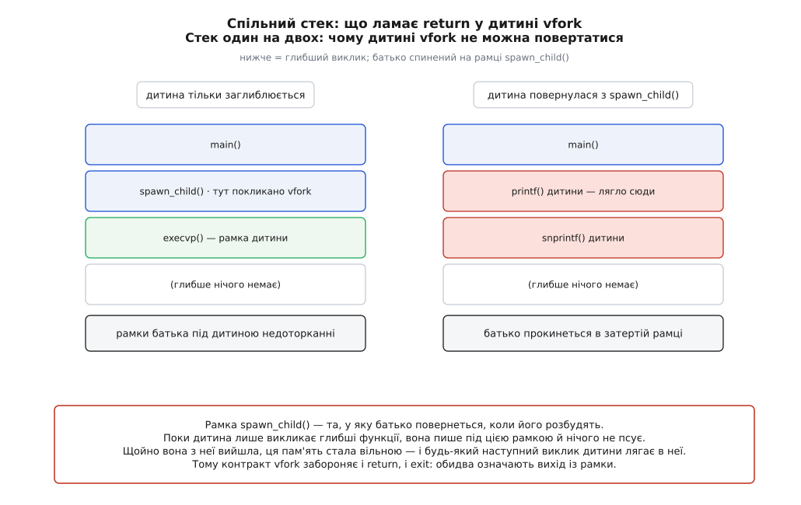
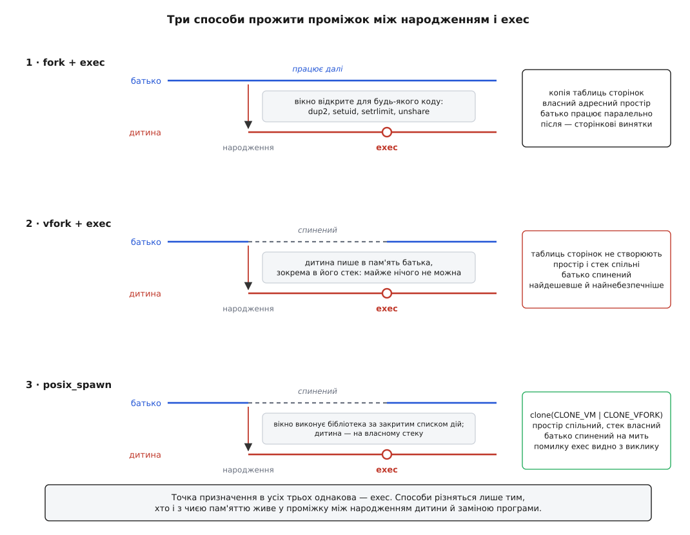
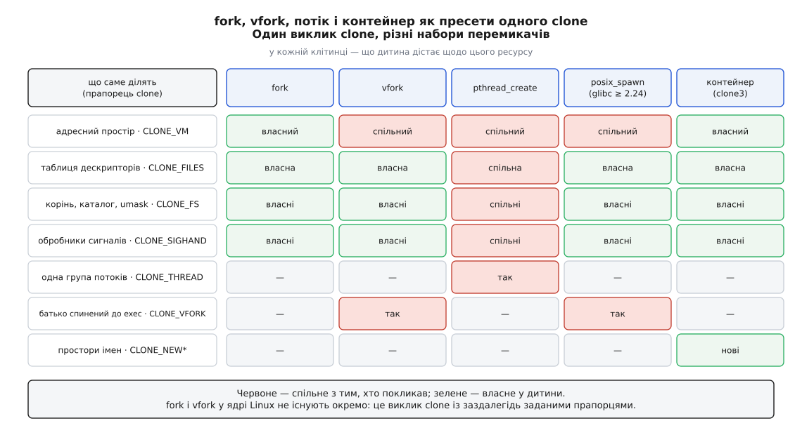

# vfork, posix_spawn і clone: чим ще народжують процес

<preknowlist>
- [Копіювання при записі](topic:sf-os/copy-on-write) — ядро копіює не сторінки, а таблиці сторінок; справжня копія кадру з'являється лише при першому записі.
- [Дескриптор файлу](topic:sys-unix/file-descriptor) — мале ціле число, індекс у таблиці процесу; саме через нього налаштовують ввід-вивід майбутньої дитини.
- [Системний виклик](topic:sys-unix/syscall-mechanics) — як програма передає керування ядру й чим це відрізняється від звичайного виклику функції.
- [Сигнал: асинхронне сповіщення](topic:sys-unix/signal-model) — маска й диспозиції сигналів належать процесові й переходять до дитини.
</preknowlist>

Пара `fork` + `exec` має дивну властивість: найцінніше в ній відбувається не в жодному з двох викликів, а в проміжку між ними. `fork` створює копію, `exec` цю копію викидає й ставить на її місце іншу програму. А от між ними дитина — уже окремий, повноправний процес, який може звичайними викликами переставити дескриптори, скинути обробники сигналів, змінити робочий каталог, віддати привілеї, накласти на себе ліміти. Саме цей проміжок і є інтерфейсом запуску програми в Unix: замість списку параметрів — вікно, у якому працює вся система.

За вікно платять, і рахунок складається з трьох різних статей.

Перша — час. Копію адресного простору [копіювання при записі](topic:sf-os/copy-on-write) робить лінивою, але таблиці сторінок ядро копіює одразу й повністю: на кожен гігабайт уже торкнутої пам'яті — приблизно два мегабайти записів, які треба виділити й перебрати всередині `fork`. Процес на десятки гігабайтів платить за розгалуження мілісекунди — і платить щоразу, навіть коли дитина наступним рядком усе це викидає.

Друга — небезпека самого вікна. У ньому виконується код бібліотек у щойно роздвоєному процесі, де від багатопотокового батька лишився один потік, а чужі замки застигли в довільному стані. Тому дитині між `fork` і `exec` дозволено лише виклики, [безпечні щодо асинхронних сигналів](topic:sys-unix/async-signal-safety) — а це список, у якому немає ні `malloc`, ні `printf`.

Третя — успадкування за замовчуванням. Дитина дістає **все**: відкриті дескриптори, привілеї, відображення пам'яті. Те, що не має до неї потрапити, треба явно віднімати — і забути відняти легше, ніж забути додати.

Три способи народити процес, які існують поруч із `fork`, б'ють по різних статтях цього рахунку. `vfork` прибирає першу ціною різкого загострення другої. `posix_spawn` прибирає другу, віддавши вікно бібліотеці. `clone` не прибирає нічого — він переозначує саме питання, роблячи «що дитині спільне з батьком» параметром виклику. Розібратися варто саме в такому порядку, бо кожен наступний виріс із того, чого бракувало попередньому.

## vfork: позичити простір замість копіювати

Виклик `vfork` з'явився у 3BSD — першому Unix із віртуальною пам'яттю, портованому на VAX наприкінці 1970-х. Обставини були гострі: апарат віртуальної пам'яті вже був, а копіювання при записі — ще ні. Отже `fork` там означав чесне копіювання всього образу процесу, часто через ділянку свопінгу, і ця ціна на кожен запуск команди була добре відчутна. Копіювання при записі з'явилося в BSD значно пізніше; `vfork` був тією латкою, яка кілька років тримала оболонку швидкою.

Латка ґрунтується на простому спостереженні. Дитині, яка за мить зробить `exec`, копія адресного простору не потрібна взагалі — потрібна лише **можливість трохи попрацювати** перед заміною програми. То нехай вона працює в просторі батька: не копія, а позика.

Тому `vfork` створює дитині власний обліковий запис задачі, власний номер, власну таблицю дескрипторів — але **не створює їй адресного простору**. Дитина дістає покажчик на той самий простір, що й у батька. Жодної таблиці сторінок не копіюють, і ціна виклику перестає залежати від обсягу пам'яті батька.

Далі виникає питання, відповідь на яке й визначає весь характер `vfork`. Два процеси в одному адресному просторі — це вже не дві копії, а **два виконавці над одними даними**. І найгірше не спільна купа, а спільний **стек**: дитина продовжується з тієї самої точки, з тим самим значенням покажчика стека. Якби вона й батько бігли одночасно, вони клали б свої рамки викликів в ту саму пам'ять і затирали одне одного за мікросекунди.

Тому ядро **спиняє батька** — від виклику `vfork` до миті, коли дитина зробить `exec` (і дістане нарешті власний простір) або `_exit`. Це не ввічливість і не оптимізація, а єдиний спосіб зробити спільний стек безпечним: у кожен момент по ньому ходить рівно один.

У ядрі Linux сон батька зроблено на звичайній структурі завершення: побачивши в масці прапорець `CLONE_VFORK`, функція створення задачі кладе таку структуру собі на стек, лишає покажчик на неї в полі `vfork_done` дитини й лягає на ній чекати. Розбудити батька може лише сама дитина, і рівно у двох місцях: коли `execve()` відчіплює від неї старий адресний простір і коли задача остаточно завершується. Обидва шляхи сходяться в одну функцію ядра — `mm_release()` (у сучасних ядрах до неї ведуть дві обгортки, `exec_mm_release()` і `exit_mm_release()`), яка обнуляє `vfork_done` і сповіщає структуру завершення. Лише тоді батько повертається з системного виклику.

## Контракт, який майже неможливо виконати

Спільний стек породжує контракт, суворіший за все інше в POSIX. Дитині `vfork` не можна:

- **змінювати дані** — крім єдиної змінної типу `pid_t`, куди кладуть результат самого `vfork`;
- **повертатися з функції**, яка покликала `vfork`;
- **кликати `exit()`** — дозволено лише `_exit()` або одну з функцій сімейства `exec`.

Кожна заборона має механічну причину, і найважливіша з них — друга.



*Рамка функції, яка покликала `vfork`, — це та рамка, у яку батько повернеться після пробудження; вийти з неї означає віддати її під наступний виклик дитини.*

Поки дитина тільки заглиблюється — викликає `execvp`, а всередині нього ще щось, — її рамки лягають **під** рамкою батька, у пам'ять, яка й так була вільною. Батько прокинеться й нічого не помітить. Але щойно дитина з цієї функції **вийшла**, пам'ять рамки стала вільною за правилами стека, і найближчий же виклик дитини її перепише. Батько прокинеться в рамці, де змінні й адреса повернення вже не його.

Заборона `exit()` має ту саму природу, тільки шкода йде не по стеку, а по решті пам'яті. `exit()` виконує обробники, зареєстровані через `atexit`, і спорожнює буфери [стандартного вводу-виводу](topic:sys-unix/stdio-buffering) — а всі вони лежать у пам'яті батька. Дитина, що кличе `exit()`, фактично виконує **процедуру завершення батька** всередині його ж пам'яті: віддає в файл його недописані буфери й позначає їх порожніми, закриває те, що мали закрити його обробники. `_exit()` не робить нічого з переліченого — тому дозволений тільки він.

Є ще дві пастки, яких у формальному переліку немає, бо вони випливають із того самого спільного простору.

`errno` у сучасних бібліотеках — не глобальна змінна, а комірка в блоці даних, локальних до потоку. Дитина `vfork` виконується з тим самим блоком, що й потік батька, який її створив. Отже невдалий `exec` у дитині запише код помилки **в `errno` батька** — і той прокинеться з чужою помилкою в руках.

Обробники сигналів — так само. Якщо в дитині, поки вона живе в позиченому просторі, спрацює обробник, усе, що він змінить у пам'яті, лишиться батькові. А в багатопотоковій програмі спиняють **лише той потік**, що покликав `vfork`; решта потоків батька біжать далі в тому самому просторі, який зараз ділить дитина. Якщо один із них у цю мить змінить облікові дані процесу, дитина зробить `exec` уже не з тими привілеями, на які розраховував той, хто її запускав.

POSIX зробив із цього очевидний висновок: у редакції 2001 року `vfork` позначено застарілим, а з редакції 2008-го його прибрано зі стандарту зовсім. Довідник FreeBSD формулює ще прямолінійніше: користуватися ним з прикладних програм правильно важко, тож беріть `posix_spawn` або `fork`.

> 🔧 **Навіщо це.** Практичний висновок не «ніколи не використовуй `vfork`», а «ніколи не пиши його руками». Сам механізм нікуди не подівся й лишився найдешевшим способом народити процес — його просто сховали під інтерфейси, де контракт виконує не ти, а автор бібліотеки. Python, наприклад, у своєму модулі запуску підпроцесів кличе на Linux саме `vfork`, коли обставини дозволяють це зробити безпечно, — і має в коді довгий перелік умов, за яких переходить назад на `fork`. Твоя роль тут — знати, чому цей перелік існує.

## posix_spawn: список дій замість вікна

Другий шлях виріс не з бажання пришвидшити оболонку, а з двох незалежних тисків, які зійшлися в одній точці.

Перший — машини, на яких `fork` неможливий у принципі. Малі вбудовані системи без апарата перетворення адрес не мають чим зробити другий адресний простір за тими самими адресами: у них [адреси фізичні](topic:sf-os/paging-and-mmu), і копія програми, покладена в інше місце пам'яті, просто не працюватиме без переміщення всіх посилань. Реальночасові застосунки на такому залізі теж потребують запускати програми — а `fork` їм не запропонуєш.

Другий — небезпека вікна там, де апарат є. Проміжок, у якому дитина виконує довільний код, — джерело помилок навіть у великих і уважних програмах.

Обидва тиски дали одну відповідь: **інвертувати інтерфейс**. Замість «зроби копію — а тоді роби що завгодно — а тоді заміни програму» сказати наперед: *запусти ось цю програму з ось такими аргументами, а перед стартом виконай ось цей список дій із дескрипторами й встанови ось такі властивості*. Так з'явився `posix_spawn`: спершу в реальночасовому доповненні IEEE 1003.1d-1999, а звідти — у зведеній редакції POSIX 2001 року. Мету записали в сам стандарт прямо: ці примітиви має бути можливо реалізувати без перетворення адрес і решти послуг апарата пам'яті.

Опис розпадається на дві частини. **Дії з файлами** — упорядкований список: відкрити файл на такому дескрипторі, закрити дескриптор, продублювати один в інший. Пізніше до нього додали зміну робочого каталогу (у glibc з версії 2.29, у стандарті — з редакції 2024 року) і закриття всіх дескрипторів від заданого номера вгору (розширення glibc 2.34, саме воно закрило давню прогалину для тих, хто хоче гарантовано не пустити в дитину зайвого). **Атрибути** — набір перемикачів: маска сигналів, скидання диспозицій до типових, група процесів, новий сеанс, скидання дієвих ідентифікаторів, політика й параметри планування.

:::tabs
```c
#include <spawn.h>
#include <fcntl.h>
#include <stdio.h>
#include <string.h>
#include <sys/wait.h>

extern char **environ;

int main(void) {
    posix_spawn_file_actions_t acts;
    posix_spawn_file_actions_init(&acts);
    posix_spawn_file_actions_addopen(&acts, STDOUT_FILENO, "out.txt",
                                     O_WRONLY | O_CREAT | O_TRUNC, 0644);
    posix_spawn_file_actions_adddup2(&acts, STDOUT_FILENO, STDERR_FILENO);

    posix_spawnattr_t attr;
    posix_spawnattr_init(&attr);
    sigset_t none;
    sigemptyset(&none);
    posix_spawnattr_setsigmask(&attr, &none);
    posix_spawnattr_setflags(&attr, POSIX_SPAWN_SETSIGMASK);

    char *argv[] = { "ls", "-l", NULL };
    pid_t pid;
    int rc = posix_spawnp(&pid, "ls", &acts, &attr, argv, environ);

    posix_spawn_file_actions_destroy(&acts);
    posix_spawnattr_destroy(&attr);

    if (rc != 0) {
        fprintf(stderr, "запустити не вдалося: %s\n", strerror(rc));
        return 1;
    }
    int status;
    waitpid(pid, &status, 0);
    return 0;
}
```
```cpp
#include <spawn.h>
#include <fcntl.h>
#include <unistd.h>
#include <sys/wait.h>
#include <iostream>
#include <system_error>
#include <vector>

extern char **environ;

class PosixSpawnFileActions {
    posix_spawn_file_actions_t actions_{};
public:
    PosixSpawnFileActions() {
        if (int err = posix_spawn_file_actions_init(&actions_)) {
            throw std::system_error(err, std::generic_category(), "init file actions");
        }
    }
    ~PosixSpawnFileActions() noexcept {
        posix_spawn_file_actions_destroy(&actions_);
    }
    PosixSpawnFileActions(const PosixSpawnFileActions&) = delete;
    PosixSpawnFileActions& operator=(const PosixSpawnFileActions&) = delete;

    void add_open(int fd, const char* path, int oflag, mode_t mode) {
        if (int err = posix_spawn_file_actions_addopen(&actions_, fd, path, oflag, mode)) {
            throw std::system_error(err, std::generic_category(), "addopen");
        }
    }
    void add_dup2(int fd, int newfd) {
        if (int err = posix_spawn_file_actions_adddup2(&actions_, fd, newfd)) {
            throw std::system_error(err, std::generic_category(), "adddup2");
        }
    }
    const posix_spawn_file_actions_t* get() const noexcept { return &actions_; }
};

class PosixSpawnAttr {
    posix_spawnattr_t attr_{};
public:
    PosixSpawnAttr() {
        if (int err = posix_spawnattr_init(&attr_)) {
            throw std::system_error(err, std::generic_category(), "init attr");
        }
    }
    ~PosixSpawnAttr() noexcept {
        posix_spawnattr_destroy(&attr_);
    }
    PosixSpawnAttr(const PosixSpawnAttr&) = delete;
    PosixSpawnAttr& operator=(const PosixSpawnAttr&) = delete;

    void set_sigmask(const sigset_t& mask) {
        if (int err = posix_spawnattr_setsigmask(&attr_, &mask)) {
            throw std::system_error(err, std::generic_category(), "setsigmask");
        }
    }
    void set_flags(short flags) {
        if (int err = posix_spawnattr_setflags(&attr_, flags)) {
            throw std::system_error(err, std::generic_category(), "setflags");
        }
    }
    const posix_spawnattr_t* get() const noexcept { return &attr_; }
};

int main() {
    try {
        PosixSpawnFileActions actions;
        actions.add_open(STDOUT_FILENO, "out.txt", O_WRONLY | O_CREAT | O_TRUNC, 0644);
        actions.add_dup2(STDOUT_FILENO, STDERR_FILENO);

        PosixSpawnAttr attr;
        sigset_t none;
        sigemptyset(&none);
        attr.set_sigmask(none);
        attr.set_flags(POSIX_SPAWN_SETSIGMASK);

        std::vector<const char*> argv = { "ls", "-l", nullptr };
        pid_t pid = 0;
        int rc = posix_spawnp(&pid, "ls", actions.get(), attr.get(),
                               const_cast<char* const*>(argv.data()), environ);

        if (rc != 0) {
            throw std::system_error(rc, std::generic_category(), "posix_spawnp");
        }

        int status = 0;
        ::waitpid(pid, &status, 0);
    } catch (const std::exception& e) {
        std::cerr << "запустити не вдалося: " << e.what() << '\n';
        return 1;
    }
    return 0;
}
```
:::

Той самий результат, що й у пари `fork` + `dup2` + `exec`, але вікна тут немає: між викликом і стартом програми не виконується жодного рядка нашого коду. Повний перелік дій, атрибутів і кодів помилок, разом із тим, які з них у якій версії з'явилися, винесено окремо: [контракт posix_spawn](topic:sys-unix/spawn-alternatives/api-posix-spawn.md).

## Чому цей список закритий — і де його стеля

Головна вигода `posix_spawn` не в тому, що він коротший за `fork` + `exec`. Вона в тому, що **список закритий**, а отже бібліотека наперед знає всю роботу, яку доведеться зробити у вікні, — і може вибрати для неї найдешевший спосіб, який дозволяє система.

У glibc, починаючи з версії 2.24 (2016), цей спосіб такий: `clone` із прапорцями `CLONE_VM | CLONE_VFORK` і **окремо виділеним стеком для дитини**. Тобто це `vfork` за швидкістю — адресного простору не створюють, батька спиняють до `exec` — але з двома виправленнями, які знімають більшість його пасток. Дитина не ходить по стеку батька, бо їй дали власний. І код, що виконується у вікні, написали автори бібліотеки: він навмисно не кличе нічого, що бере замки чи розподіляє пам'ять, і не запускає обробників, зареєстрованих через `pthread_atfork`.

Спільна пам'ять із батьком тут перетворилася з проблеми на канал зв'язку. Якщо `exec` не вдався, дитина кладе код помилки у структуру, яку батько прочитає одразу після пробудження, — тому `posix_spawn` у glibc повертає **саме цю помилку**, а не мовчазний успіх. Порівняй із `fork` + `exec`: там про невдалий `exec` батько дізнається лише окремим каналом — зазвичай через канал зв'язку з прапорцем `FD_CLOEXEC`, який закривається сам, коли `exec` таки відбувся. Стандарт, до речі, допускає й іншу поведінку — дитина завершується з кодом 127, — тож переносний код мусить перевіряти обидва шляхи.



*Точка призначення в усіх трьох однакова; різниця — у тому, хто живе в проміжку й чиєю пам'яттю користується.*

А тепер про стелю, бо вона принципова. Словник дій закритий не випадково — саме закритість дає швидкість і безпеку. Але вона ж означає, що чого в словнику немає, того зробити не можна. Скинути привілеї викликом `setuid`, накласти [ліміти ресурсів](topic:sys-unix/resource-limits), увійти в [простори імен](topic:sys-unix/namespaces), поставити фільтр [seccomp](topic:sys-unix/seccomp-filter-mechanism), виконати будь-який власний код — усього цього в списку немає, і кожен новий пункт коштує правки стандарту.

Це рівно та хвороба, від якої Unix колись утік розділенням на `fork` і `exec`: параметри запуску знову зібрано в структуру, і структура знову має скінченний розмір. Різниця в тому, що тепер це не єдиний спосіб, а швидкий шлях поруч із загальним. Тому мови й бібліотеки будують запуск процесу з двох доріг: `posix_spawn`, поки задачу видно в його словнику, і `fork` + `exec`, щойно вона з нього виходить. У стандартній бібліотеці Rust це прямо так і влаштовано: швидкий шлях через `posix_spawn` і повільний через `fork` — і будь-яке замикання, яке програміст просить виконати перед `exec`, автоматично вимикає швидкий.

> 🔧 **Навіщо це.** Звідси береться правило, яке легко перевірити на власному коді: якщо служба часто запускає підпроцеси й тримає багато пам'яті, перехід із `fork` + `exec` на `posix_spawn` знімає з кожного запуску копію таблиць сторінок — і на процесі в десятки гігабайтів це різниця в порядки, а не у відсотки. Той самий перехід зробили всередині себе й самі бібліотеки: `system()` і `popen()` у glibc тепер теж побудовані на `posix_spawn`, а не на `fork` з `execl`. Зміряти всі три способи на своїй машині — час запуску й спожиту пам'ять залежно від обсягу батька — можна невеликою програмою: [скільки коштує народження](topic:sys-unix/spawn-alternatives/proj-spawn-cost.md).

## clone: спільність як параметр

Обидва попередні шляхи приймають як даність, що варіантів рівно два: або дитина дістає копію всього, або ділить із батьком усе. Але це хибна дихотомія — і побачити її помилковість можна, просто перелічивши, що саме дитина від батька отримує.

Адресний простір. Таблиця відкритих дескрипторів. Коренева тека, робоча тека й `umask`. Таблиця обробників сигналів. Належність до групи потоків. Набір просторів імен. Контрольна група.

Це **різні, незалежні речі**. Немає жодної причини, чому спільна пам'ять мусила б тягнути за собою спільну таблицю дескрипторів, а окрема таблиця дескрипторів — окремий погляд на мережу. Щойно це видно, природний інтерфейс перестає бути набором окремих викликів і стає **одним викликом із бітовою маскою**: перелічи, що спільне, а решту скопіюй.

Саме це Linux і зробив, додавши власний виклик `clone` — усі класичні прапорці спільності є в ньому щонайменше з ядра 2.0. Полярність прапорців варто запам'ятати одразу: прапорець означає **спільне**, його відсутність — власне.



*Стовпці читаються як пресети: одна й та сама машина, різні набори перемикачів.*

Наслідок цієї конструкції сильніший, ніж «з'явився ще один спосіб». Усі інші способи стали **окремими випадками одного**:

```
fork()            =  clone(SIGCHLD)
vfork()           =  clone(CLONE_VM | CLONE_VFORK | SIGCHLD)
posix_spawn()     ≈  clone(CLONE_VM | CLONE_VFORK | SIGCHLD) + власний стек
pthread_create()  ≈  clone(CLONE_VM | CLONE_FS | CLONE_FILES | CLONE_SIGHAND
                           | CLONE_THREAD | CLONE_SETTLS | CLONE_PARENT_SETTID
                           | CLONE_CHILD_CLEARTID)
```

І це не метафора, а те, як воно влаштовано в ядрі: `fork`, `vfork`, `clone` і `clone3` — чотири входи, які сходяться в одну внутрішню функцію створення задачі. Вона перебирає ресурси один за одним і для кожного дивиться на прапорець: копіювати структуру чи просто збільшити лічильник посилань на батькову. Тому в Linux немає окремого механізму «створити процес» і окремого «створити потік» — [одиниця планування тут одна](topic:sys-unix/threads-as-tasks), а процес і потік різняться лише тим, скільки прапорців було виставлено.

Прапорці незалежні не всюди, і кожна залежність має причину, а не є примхою. `CLONE_SIGHAND` вимагає `CLONE_VM`: таблиця обробників зберігає адреси функцій, і спільна таблиця має сенс лише тоді, коли ці адреси в обох означають те саме. `CLONE_THREAD` вимагає `CLONE_SIGHAND`: потоки однієї групи мусять реагувати на сигнал як одне ціле, а це неможливо, коли кожен має власну таблицю диспозицій.

Окремої уваги вартий аргумент, якого в `fork` немає, — **стек**. Із `CLONE_VM` обидві задачі опиняються в одному адресному просторі, тож дитині треба вказати, де їй класти свої рамки. Звідси й дивна на позір форма обгортки в glibc: вона приймає покажчик на функцію та стек і в дитині **викликає цю функцію**, а не повертається двічі, як сирий системний виклик. Повернутися двічі в один спільний стек неможливо в принципі — тому обгортка й не пробує.

У 2019 році (ядро 5.3) додали `clone3`. Причина суто інженерна: тридцять два біти прапорців вичерпалися, а порядок аргументів у старого виклику різний на різних архітектурах, тож розширювати його далі не було куди. Новий бере одну версійовану структуру з полем розміру — і в неї одразу дописали те, що раніше не мало де поміститися: народити дитину з уже готовим дескриптором на неї (`CLONE_PIDFD`, ядро 5.2 — [посилання на процес, яке не плутається з повторним використанням номерів](topic:sys-unix/pid-and-hierarchy)), задати номер дитини в просторі імен (ядро 5.5, потрібне для відновлення контейнера з контрольної точки) і народити її **одразу в потрібній контрольній групі** (`CLONE_INTO_CGROUP`, ядро 5.7).

Останній прапорець прибирає ще один проміжок, менш помітний за головний. До нього дитина неминуче народжувалася в [контрольній групі](topic:sys-unix/cgroups-resource-model) батька, і між її появою та перенесенням у власну групу лишався час, коли вона вже виконувалася, а обмежень на неї ще не наклали — і саме в цей час вона могла з'їсти пам'ять, від якої її мали захистити. `CLONE_INTO_CGROUP` цей проміжок закриває.

> 🔧 **Навіщо це.** На цьому виклику стоїть увесь контейнерний світ. Запустити ізольований контейнер — це один `clone3` з набором прапорців просторів імен: новий погляд на дерево монтувань, на номери процесів, на мережу, на список користувачів. Жодного окремого «механізму контейнерів» у ядрі немає — є параметризоване народження задачі. Тому й межа ізоляції визначається не якимось конфігом, а рівно тим, які прапорці виставила середа виконання. Повний перелік прапорців, поля структури `clone_args` і різницю між обгорткою glibc та сирим викликом зібрано окремо: [контракт clone і clone3](topic:sys-unix/spawn-alternatives/api-clone-flags.md).

## Що з цього обирати

Правило вибору коротке, якщо питати не «який спосіб швидший», а «скільки з батька дитині насправді потрібно».

**Запустити програму з перенаправленнями, оточенням і своєю групою процесів** — `posix_spawn`. Він покриває переважну більшість запусків, працює швидко незалежно від обсягу пам'яті батька й чесно повертає помилку `exec`.

**Потрібне те, чого в його словнику немає** — скинути привілеї, накласти ліміти, увійти в простори імен, поставити фільтр системних викликів — `fork` + `exec`. У однопотоковому батькові це безпечно; у багатопотоковому між ними дозволено лише переставляння дескрипторів і скидання сигналів.

**Потрібна копія стану, а не інша програма** — тільки `fork`. Ані `posix_spawn`, ані `vfork` цього не вміють у принципі: перший одразу запускає чужу програму, другий не має власної пам'яті. Передрозгалужені сервери, знімок бази в фоні, прогріта віртуальна машина, з якої брунькуються застосунки, — усе це живе саме на здатності `fork` роздвоїти наявний стан.

**Потрібен потік** — `pthread_create`, і ніколи `clone` руками: бібліотека потоків тримає власні структури, які сирий виклик не заповнить.

**Потрібна ізоляція** — `clone3` із прапорцями просторів імен, або `unshare` вже після народження, якщо ізолювати треба не з першої миті.

**`vfork` руками** — практично ніколи. Його місце — усередині бібліотек, під контрактом, який ти не пишеш.

Історія великих середовищ виконання рухалася рівно в цьому напрямку. Java на Linux довго народжувала підпроцеси через `vfork` за замовчуванням, з JDK 13 перейшла на `posix_spawn`, а сам варіант із `vfork` згодом позначили застарілим і прибрали. Python бере `posix_spawn` там, де може, і `vfork` там, де перевірив, що це безпечно. Rust тримає обидві дороги й перемикається між ними за складністю запиту. Ніхто з них не пропонує програмістові вибирати спосіб народження — усі перетворили його на внутрішню деталь, і це і є правильна практика.

Три альтернативи `fork` — не три способи сказати те саме. Кожна по-своєму відповідає на питання, що робити з вікном між народженням і `exec`. `vfork` лишає вікно, але забирає пам'ять, у якій його можна прожити. `posix_spawn` лишає пам'ять, але заміняє вікно каталогом дозволених дій. `clone` не чіпає ні того, ні того — він змінює саме поняття копії, дозволяючи сказати, що копіювати, а що ділити. І напрямок, у якому додають нові прапорці, читається однозначно: `CLONE_PIDFD` прибирає проміжок, у якому дитина вже є, а надійного посилання на неї ще немає; `CLONE_INTO_CGROUP` прибирає проміжок, у якому вона вже працює, а обмежень на неї ще не накладено. Система поволі переходить від «народи, а тоді доналаштуй» до «народи одразу таким, як треба» — і кожен закритий проміжок означає на одну гонитву менше.
