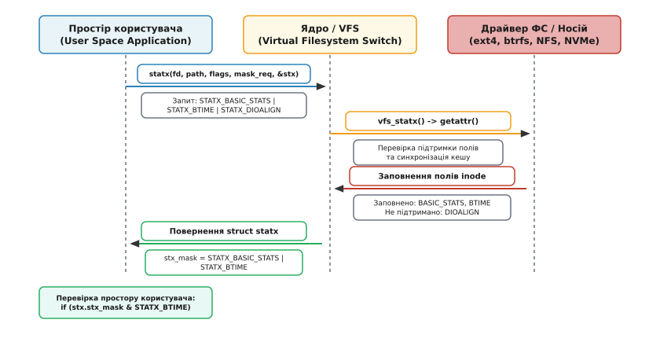
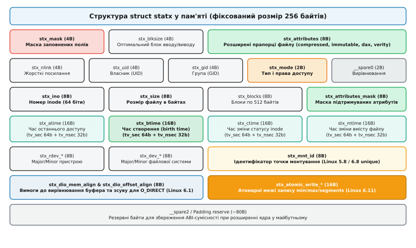

# Розширений системний виклик statx та маски атрибутів

<preknowlist>
- [Файлові дескриптори та сімейство системних викликів *at](topic:sys-unix/at-family-syscalls) — принципи використання dirfd та відносних шляхів.
- [Модель inode та структура атрибутів файлової системи](topic:sys-unix/inode-model) — роль struct stat, права доступу, ідентифікатори та класичні часові позначки.
- [Проблема 2038 року та збереження часу в ядрі Linux](topic:sys-unix/time-representation-y2038) — межі 32-бітних time_t та перехід ядра на 64-бітну часову сітку.
- [Прапорці inode, chattr та атрибути файлів](topic:sys-unix/inode-flags-chattr) — розширені внутрішні прапорці файлових систем (immutable, append-only).
</preknowlist>

Коли програма запитує атрибути файлу в системі Unix, вона звертається до ядра з фундаментальним питанням: що це за об'єкт, який його розмір, хто ним володіє та коли його востаннє змінювали. Протягом майже чотирьох десятиліть відповіддю на це питання був класичний системний виклик `stat(2)` та його варіації `fstat` і `lstat`. Проте швидкий розвиток мережевих файлових систем, поява носіїв енергонезалежної пам'яті (PMEM), систем контролю цілісності та вимог до високої продуктивності оголили глибокі архітектурні обмеження POSIX-інтерфейсу `stat`. Класична структура була жорстко зафіксована в розрядності полів, не мала засобів маскування запитуваних атрибутів і змушувала ядро збирати абсолютно всі метадані файлу, навіть якщо програмі потрібен був лише розмір.

Системний виклик `statx(2)`, доданий до ядра Linux 4.11 у 2017 році після майже семи років обговорень у ядерній спільноті, кардинально змінив цю модель. Замість монолітної структури фіксованої ширини `statx` запровадив двосторонній контракт маскового узгодження: програма явним чином перелічує біти тих полів, які її цікавлять, а ядро повертає атрибути разом із зворотною маскою тих полів, які конкретна файлова система насправді змогла заповнити. Це дозволило позбутися зайвих мережевих RPC-запитів у розподілених файлових системах, гарантувало повну захищеність від проблеми 2038 року завдяки 64-бітним секундам та відкрило шлях для розширення атрибутів без порушення бінарної сумісності ABI.

## Чому класичного stat(2) стало недостатньо

Класична структура `struct stat` проєктувалася у часи перших випусків системи Research Unix у 1970-х роках. У ті часи файлова система жила на одному локальному магнітному диску з секторами по 512 байтів, а атрибути файлу обмежувалися правами доступу, трьома часовими позначками (atime, mtime, ctime), номером inode та лічильником блоків. У цій моделі виклики `stat()` мали статичну семантику: ядра систем Unix завжди повертали повністю заповнену структуру. Кожен виклик був жорстко прив'язаний до статичного представлення метаданих у C-структурі.

При переході від 16-бітних та 32-бітних систем до 64-бітних архітектур розробники стандартів POSIX та ядра Linux неодноразово стикалися з проблемою вичерпання розрядності полів `struct stat`. Спроби адаптації призвели до появи цілої серії сурогатних системних викликів: `stat64`, `lstat64`, `fstat64`, а пізніше `fstatat64`. Проте кожна з цих адаптацій лише змінювала розмір окремих полів, залишаючи загальну архітектурну концепцію незмінною.

З появою мережевих та розподілених файлових систем, таких як NFS (Network File System), SMB/CIFS, CephFS чи GlusterFS, статична семантика `stat()` перетворилася на джерело значних затримок у роботі програмного забезпечення:

1. **Мережева затримка (RPC Round-Trips):** Якщо утиліті обходу каталогів `ls` або файловому менеджеру потрібно прочитати лише типи файлів та їхні розміри, виклик `stat()` усе одно змушував клієнтський драйвер NFS виконувати серію синхронних мережевих RPC-викликів `GETATTR` до сервера для обчислення кількості виділених блоків чи оновлення часу останнього доступу. Затримка обміну (RTT) на кожен файл у каталозі з тисячами елементів сповільнювала роботу утиліт у рази.
2. **Проблема 2038 року (Y2038):** Класичні поля `st_atime`, `st_mtime` та `st_ctime` на 32-бітних архітектурах зберігали секунди у 32-бітному підписаному типі `time_t`. У січні 2038 року цей лічильник переповниться, перетворюючись на від'ємні числа, що призведе до збоїв у розрахунках часу по всьому світу.
3. **Відсутність часу створення (btime):** Сучасні файлові системи (ext4, Btrfs, XFS, ZFS) зберігають у своїх inode дату створення файлу (birth time або btime). Проте у POSIX-структурі `stat` просто не було відповідного поля, і додавання його розривало бінарну сумісність існуючих компільованих програм.
4. **Ідентифікатори носіїв та точок монтування:** Поля `st_dev` та `st_rdev` пакували старший (major) та молодший (minor) номери пристроїв у єдине 64-бітне або 32-бітне число, що вимагало використання макросів `major()` і `minor()`, які відрізнялися між різними C-бібліотеками.
5. **Спеціалізовані прапорці файлових систем:** Прапорці стиснення, шифрування, захисту від зміни (`immutable`), режимів `DAX` (Direct Access) та контролю цілісності `fs-verity` існували в ядрі, але прочитати їх можна було лише через окремі повільні виклики `ioctl(FS_IOC_GETFLAGS)`.

Спроби розширити сімейство викликів за допомогою `fstatat(2)` вирішили лише проблему відносного адресування через файлові дескриптори каталогів (`dirfd`), але залишили саму структуру метаданих незмінною. Стало зрозуміло: системі потрібен новий виклик із розширюваною структурою та можливістю запиту лише необхідної підмножини даних.

## Контракт маскового рукостискання у statx

Головною інновацією `statx` став механізм двостороннього маскового узгодження між простором користувача, віртуальною файловою системою ядра (VFS) та конкретним драйвером файлової системи.

Сигнатура системного виклику приймає маску запитуваних полів `mask`:

:::tabs
```c
int statx(int dirfd, const char *restrict path, int flags,
          unsigned int mask, struct statx *restrict stx);
```
```cpp
int statx(int dirfd, const char *path, int flags,
          unsigned int mask, struct statx *stx) noexcept;
```
:::

Програма виклику чітко вказує у параметрі `mask`, які саме дані їй потрібні. Наприклад, якщо програмі потрібні лише тип файлу, права доступу та розмір, вона передає маску `STATX_MODE | STATX_SIZE`. Якщо ж додаток аналізує нові медіафайли, він може додатково запросити час створення `STATX_BTIME` та параметри вирівнювання для прямого вводу/виводу `STATX_DIOALIGN`.

Ядро отримує цей запит і транслює його у внутрішній метод VFS `getattr()`. Драйвер конкретної файлової системи перевіряє свої можливості та заповнює структуру `struct statx`. Після повернення з ядра програма перевіряє вихідне поле `stx.stx_mask`.


*Схема маскового узгодження між простором користувача, VFS та конкретною файловою системою в системному виклику statx.*

Принципова відмінність полягає в тому, що ядро має право **не заповнювати** ті поля, які не були запитані користувачем, або ті, які конкретна файлова система не здатна надати. Наприклад, якщо прикладний код запитує `STATX_BTIME` для файлу на файловій системі FAT32 або NFSv3 (які не підтримують дату створення), ядро успішно виконає виклик `statx`, поверне `0`, але у полі `stx_mask` відповідний біт `STATX_BTIME` буде скинуто у `0`.

Це правило формує фундаментальний принцип безпечного системного програмування з `statx`: **ніколи не читати необов'язкове поле `struct statx` без попередньої перевірки наявності відповідного біта в `stx.stx_mask`**.

:::tabs
```c
struct statx stx;
if (statx(AT_FDCWD, path, AT_SYMLINK_NOFOLLOW, STATX_BASIC_STATS | STATX_BTIME, &stx) == 0) {
    if (stx.stx_mask & STATX_BTIME) {
        /* Поле stx_btime гарантовано містить чесний час створення */
        process_btime(&stx.stx_btime);
    } else {
        /* Файлова система не підтримує btime — використовуємо фолбек на mtime або ctime */
        fallback_time(&stx.stx_mtime);
    }
}
```
```cpp
struct statx stx{};
if (::statx(AT_FDCWD, path.data(), AT_SYMLINK_NOFOLLOW, STATX_BASIC_STATS | STATX_BTIME, &stx) == 0) {
    if (stx.stx_mask & STATX_BTIME) {
        // Поле stx_btime гарантовано містить чесний час створення
        process_btime(stx.stx_btime);
    } else {
        // Файлова система не підтримує btime — використовуємо фолбек на mtime
        fallback_time(stx.stx_mtime);
    }
}
```
:::

Завдяки цьому узгодженню драйвер NFS або SMB може взагалі не робити мережевих запитів щодо блоків чи часових позначок, якщо їх не було у вхідній масці, обмежуючись даними з локального кешу.

## Анатомія та вирівнювання struct statx

На відміну від `struct stat`, розмір і вирівнювання якої різнилися між архітектурами (x86_64, i386, ARM, RISC-V), структура `struct statx` має строго фіксований розмір **256 байтів** і однакове розташування полів на всіх 32-бітних і 64-бітних платформах. Це усунуло давній біль сумісності системних викликів між 32-бітними програмами та 64-бітним ядром (compat layer).

Кожне поле структури розміщено по природних межах вирівнювання у 4 або 8 байтів, а сама структура завершується резервним масивом заповнення `__spare2`, який гарантує можливість додавання нових полів у майбутніх версіях ядра Linux без зміни загального розміру 256 байтів.


*Розподіл полів у 256-байтному буфері struct statx із чітким вирівнюванням по межах 8 та 16 байтів.*

Розглянемо ключові групи полів у структурі `struct statx`:

### 1. 64-бітні часові позначки (struct statx_timestamp)

Усі чотири часові позначки — `stx_atime` (час доступу), `stx_mtime` (час модифікації), `stx_ctime` (час зміни статусу inode) та `stx_btime` (час народження/створення) — представлені уніфікованою внутрішньою структурою `struct statx_timestamp`:

:::tabs
```c
struct statx_timestamp {
    int64_t  tv_sec;    /* Секунди з початку епохи Unix (Signed 64-bit) */
    uint32_t tv_nsec;   /* Наносекунди (0..999 999 999) */
    int32_t  __reserved;/* Резерв для вирівнювання по межі 16 байтів */
};
```
```cpp
struct statx_timestamp {
    std::int64_t  tv_sec;    // Секунди з початку епохи Unix (Signed 64-bit)
    std::uint32_t tv_nsec;   // Наносекунди (0..999 999 999)
    std::int32_t  __reserved;// Резерв для вирівнювання по межі 16 байтів
};
```
:::

Використання підписаного 64-бітного цілого `int64_t` для поля `tv_sec` остаточно вирішує проблему 2038 року: воно здатне описувати моменти часу на 292 мільярди років у минуле та майбутнє. Поле `tv_nsec` дає наносекундну точність, а резервне поле `__reserved` вирівнює кожну позначку до 16 байтів.

### 2. Розділені ідентифікатори пристроїв (Major / Minor)

У класичному `stat` номери пристроїв пакувалися у значення типу `dev_t`. У `statx` номери пристрою файлової системи (`stx_dev_*`) та пристрою спеціального файлу (`stx_rdev_*`) явно розділені на окремі 32-бітні поля:

- `stx_dev_major` та `stx_dev_minor`: старший і молодший номери пристрою, на якому розташована файлова система.
- `stx_rdev_major` та `stx_rdev_minor`: старший і молодший номери пристрою для спеціальних файлів символьних або блокових пристроїв (у разі `S_IFCHR` або `S_IFBLK`).

Такий підхід позбавляє системного програміста необхідності використовувати нестандартні макроси побітового зсуву та усуває ризики викривлення номерів пристроїв при передачі між 32-бітними та 64-бітними середовищами. Крім того, при виконанні 32-бітних програм у 64-бітному ядрі (підсистема compat) більше не потрібна складна конверсія номерів пристроїв, оскільки розкладка полів повністю збігається.

## Керування когерентністю кешу в мережевих файлових системах

Однією з найпотужніших можливостей `statx` є контроль над синхронізацією кешу атрибутів у мережевих та розподілених файлових системах (NFS, CephFS, CIFS/SMB). 

У класичному `stat()` ядро Linux використовувало внутрішню заздалегідь визначену логіку: якщо локальний кеш метаданих VFS вважався застарілим (наприклад, пройшов таймаут `acregmin`/`acregmax` у NFS), драйвер робив примусовий мережевий виклик до сервера. Якщо ж мережа була повільною або тимчасово недоступною, звичайний виклик `stat()` міг заблокувати потік виконання на тривалий час.

У системному виклику `statx` параметр `flags` дозволяє розробникові явним чином задавати політику синхронізації за допомогою групи прапорців `AT_STATX_*_SYNC`:

1. **`AT_STATX_SYNC_AS_STAT` (0x0000):** Замовчувана поведінка. Ядро діє точно так само, як і в класичному виклику `stat`: бере атрибути з кешу, а якщо їхній термін придатності вичерпався, виконує мережевий запит до сервера.
2. **`AT_STATX_FORCE_SYNC` (0x2000):** Примусова синхронізація. Ядро інвалідує локальний кеш VFS і вимагає від драйвера файлової системи зв'язатися з мережевим сервером або зчитувати носій, щоб отримати гарантовано свіжі атрибути. Це необхідно, наприклад, при здійсненні транзакційних операцій у СУБД або міжпроцесній синхронізації через мережеву ФС.
3. **`AT_STATX_DONT_SYNC` (0x4000):** Асинхронне читання "що є в кеші". Ядро негайно повертає ті атрибути, які вже зберігаються в локальній пам'яті VFS, навіть якщо вони вважаються застарілими. Жодного мережевого пакета не буде відправлено в мережу.

Застосування `AT_STATX_DONT_SYNC` дозволяє будувати надшвидкісні фонові індексатори файлових систем та утиліти пошуку, які пробігають по мільйонах файлів на мережевих сховищах без генерації мільйонів RPC-запитів і без ризику зависання при тимчасовому обриві мережевого зв'язку.

> ⚠️ **Застереження:** Прапорці `AT_STATX_FORCE_SYNC` та `AT_STATX_DONT_SYNC` є взаємовиключними. Передача обох прапорців одночасно поверне помилку `EINVAL`.

## Розширені атрибути файлу (stx_attributes)

Сучасні файлові системи мають багатий набір внутрішніх атрибутів inode, які раніше неможливо було дістати через `stat()`. Для їх читання доводилося відкривати дескриптор файлу через `open()` і викликати специфічний `ioctl(fd, FS_IOC_GETFLAGS, &flags)`. Це вимагало наявності прав читання файлу і створювало додаткові системні виклики.

У `statx` ця проблема вирішена введенням дуету 64-бітних полів:
- `stx_attributes`: містить поточний стан бітових прапорців атрибутів файлу.
- `stx_attributes_mask`: містить маску тих прапорців, які поточна файлова система взагалі вміє відслідковувати та повертати.

Це розділення має критичне значення. Наприклад, якщо біт `STATX_ATTR_COMPRESSED` у полі `stx_attributes` дорівнює `0`, це може означати дві абсолютно різні речі: файл дійсно не стиснутий, або файлова система взагалі не підтримує стиснення і нічого про це не знає. Перевірка `stx_attributes_mask` дає однозначну відповідь:

:::tabs
```c
uint64_t supported = stx.stx_attributes_mask;
uint64_t flags = stx.stx_attributes;

if (supported & STATX_ATTR_IMMUTABLE) {
    bool is_immutable = (flags & STATX_ATTR_IMMUTABLE) != 0;
    printf("Файл захищено від змін (+i): %s\n", is_immutable ? "ТАК" : "НІ");
} else {
    printf("Файлова система не підтримує перевірку атрибута immutable.\n");
}
```
```cpp
const std::uint64_t supported = stx.stx_attributes_mask;
const std::uint64_t flags = stx.stx_attributes;

if (supported & STATX_ATTR_IMMUTABLE) {
    const bool is_immutable = (flags & STATX_ATTR_IMMUTABLE) != 0;
    std::cout << "Файл захищено від змін (+i): " << (is_immutable ? "ТАК" : "НІ") << "\n";
} else {
    std::cout << "Файлова система не підтримує перевірку атрибута immutable.\n";
}
```
:::

Серед ключових атрибутів, які повертає `statx`:
- `STATX_ATTR_COMPRESSED`: файл стиснутий на рівні драйвера ФС (Btrfs, ZFS, NTFS).
- `STATX_ATTR_IMMUTABLE`: файл захищений від будь-якого редагування, вилучення чи перейменування (аналог `chattr +i`).
- `STATX_ATTR_APPEND`: у файл дозволено лише дописувати в кінець (аналог `chattr +a`).
- `STATX_ATTR_NODUMP`: файл пропускається утилітами резервного копіювання `dump`.
- `STATX_ATTR_ENCRYPTED`: вміст файлу прозоро зашифровано самою ФС (fscrypt).
- `STATX_ATTR_AUTOMOUNT`: каталог є точкою автоматичного монтування.
- `STATX_ATTR_VERITY`: для файлу ввімкнено деревну перевірку цілісності fs-verity.
- `STATX_ATTR_DAX`: файл перебуває у режимі прямого доступу до енергонезалежної пам'яті (Direct Access), минаючи сторінковий кеш ядра.

Детальний систематизований опис усіх масок, констант та версійних обмежень зібрано в окремому довіднику [Повний довідник масок, прапорців та атрибутів statx](topic:sys-unix/statx-fields-and-kernel-extensions/api-statx-masks-and-flags.md).

## Еволюція ядра: Direct I/O, Mount ID та атомарні записи

Гнучка архітектура `statx` дозволила розробникам ядра Linux додавати нові можливості у виклик без порушення сумісності з існуючими програмами. Протягом 2019–2024 років `statx` збагатився важливими розширеннями для високопродуктивного системного програмування:

### 1. Вирівнювання для прямого вводу/виводу (STATX_DIOALIGN)

Починаючи з ядра Linux 6.1, у `statx` додано прапорець `STATX_DIOALIGN`. Він вирішує давню проблему при використанні прапорців `O_DIRECT`.

При відкритті файлу з прапорцем `O_DIRECT` операції читання та запису виконуються безпосередньо між буфером у просторі користувача та накопичувачем. Проте `O_DIRECT` вимагає суворого вирівнювання: адреса буфера в оперативній пам'яті, зсув у файлі та довжина передачі мусять бути кратними логічному блокові пристрою. Раніше програми припускали, що 512 байтів завжди достатньо, але на сучасних носіях NVMe та дисках 4Kn (з сектором 4096 байтів) спроба виконати `O_DIRECT` викликом `pread()` зі зсувом 512 байтів повертала помилку `EINVAL`.

Маска `STATX_DIOALIGN` повертає два нових поля у `struct statx`:
- `stx_dio_mem_align`: необхідне вирівнювання адреси буфера в пам'яті (у байтах).
- `stx_dio_offset_align`: необхідне вирівнювання зсуву у файлі та розміру блоку вводу/виводу.

:::tabs
```c
if (stx.stx_mask & STATX_DIOALIGN) {
    printf("Мінімальне вирівнювання буфера пам'яті: %u байтів\n", stx.stx_dio_mem_align);
    printf("Мінімальне вирівнювання зсуву файлу : %u байтів\n", stx.stx_dio_offset_align);
}
```
```cpp
if (stx.stx_mask & STATX_DIOALIGN) {
    std::cout << "Мінімальне вирівнювання буфера пам'яті: " << stx.stx_dio_mem_align << " байтів\n";
    std::cout << "Мінімальне вирівнювання зсуву файлу : " << stx.stx_dio_offset_align << " байтів\n";
}
```
:::

У високопродуктивних СУБД (на кшталт RocksDB або PostgreSQL) це дозволяє динамічно запитувати вимоги конкретного файлу і виділяти пам'ять через `posix_memalign()` з точним вирівнюванням під носій.

### 2. Ідентифікатори точок монтування (STATX_MNT_ID)

У ядрі Linux 5.8 у `statx` додано біт `STATX_MNT_ID`, який повертає 64-бітне число `stx_mnt_id` — ідентифікатор моунта, на якому лежить файл. Це поле співпадає з першим числом у рядках файлу `/proc/self/mountinfo`.

У ядрі Linux 6.8 це розширено прапорцем `STATX_MNT_ID_UNIQUE`, який повертає гарантовано унікальний 64-бітний ID монтування, що не перевикористовується ядром навіть після відмонтування та повторного монтування файлових систем під час роботи системи.

### 3. Атомарні записи на рівні блоків (STATX_WRITE_ATOMIC)

У ядрі Linux 6.11 додано прапорець `STATX_WRITE_ATOMIC`, який повідомляє про спроможність блокового носія та файлової системи виконувати атомарні записи без використання журналювання або Copy-on-Write. Поля `stx_atomic_write_unit_min`, `stx_atomic_write_unit_max` та `stx_atomic_write_segments_max` описують мінімальний та максимальний розмір блоку, який апаратний контролер гарантовано запише однією неподільною операцією. Цей механізм дозволяє базам даних відмовитися від Doublewrite Buffer у InnoDB або журналювання Write-Ahead Logging (WAL) для малих блоків.

## Асинхронний statx у io_uring

З появою асинхронної підсистеми вводу/виводу `io_uring` системний виклик `statx` отримав асинхронне втілення у вигляді операції `IORING_OP_STATX`. У цій архітектурі процес користувача формує елемент черги відправки (SQE), передаючи параметр маски та вказівник на `struct statx`.

Асинхронний виклик `statx` вирішує проблему блокування потоків виконання подій (event loops у Node.js, NGINX або Seastar), коли зчитування метаданих з мережевої файлової системи або повільного магнітного диска призводило до затримки обробки тисяч мережевих сокетів. Завдяки `io_uring` отримання метаданих виконується повністю асинхронно ядерними потоками воркерів без блокування головного циклу обробки подій.

Продуктивність асинхронних викликів `statx` через `io_uring` додатково зростає при використанні зареєстрованих файлових дескрипторів (registered fds), що позбавляє ядро необхідності виконувати повну табличну перевірку файлового дескриптора на кожну операцію.

## Повна безпека розширення без розриву ABI

Ключовим досягненням `statx` стала повна захищеність бінарного інтерфейсу розробки (ABI). Усі попередні спроби розширити `struct stat` стикалися з тим, що додавання хоча б одного поля змінювало розмір структури, змушуючи розробників C-бібліотек додавати нові версії версіонованих символів (`GLIBC_2.2`, `GLIBC_2.33`).

Структура `struct statx` від початку створена як фіксований 256-байтний буфер. Якщо майбутні версії ядра Linux (наприклад, Linux 7.0) додадуть нові розширені атрибути, вони займуть зарезервовані байти з кінцевого масиву `__spare2`, встановивши нові маскові біти. Старі програми, скомпільовані п'ять років тому, продовжать успішно передавати 256-байтний буфер і перевіряти відомі їм біти у `stx_mask`, мовчки ігноруючи нові прапорці ядра.

Крім того, вирівнювання полів по 8-байтових межах виключає неявне доповнення (implicit padding), що спрощує передачу структури між різними мовами програмування (Rust, Go, Python, C#) без необхідності складного FFI-пакувальника (`#[repr(C)]`).

> 🔧 **Навіщо це.**
> Застосування `statx` замість класичного `stat` дає відчутний виграш у трьох практичних сценаріях:
> 1. **Високонавантажені сервери та веб-сервіси:** Утиліти обходу файлових дерев (на кшталт `find`, `rg`, `fd` або середовищ збирання проєктів) запитують маску `STATX_TYPE | STATX_MODE`, минаючи читання важких часових позначок і блоків. На мережевих файлових системах це прискорює сканування у 5–20 разів.
> 2. **Бази даних та високопродуктивний ввід/вивід:** Запит `STATX_DIOALIGN` дозволяє моторам СУБД (SQLite, RocksDB, InnoDB) точно дізнатися вимоги вирівнювання для `O_DIRECT` без опитування системних файлів у `/sys/block/`, виключаючи випадкові помилки `EINVAL` на дисках з сектором 4096 байтів.
> 3. **Безпека та контроль цілісності:** Перевірка прапорців `STATX_ATTR_VERITY` та `STATX_ATTR_IMMUTABLE` дозволяє перевірити цілісність бінарного файлу або захист пакунка ще до його відкриття на читання.

Повний приклад компільованої програми мовами C та C++, яка інспектує всі розширені поля `statx` та обробляє відсутність системного виклику на старих ядрах, наведено у практикумі [Практикум: інспектування атрибутів файлу через statx у C та C++](topic:sys-unix/statx-fields-and-kernel-extensions/proj-statx-inspect.md).

## Інтеграція у glibc та зворотна сумісність

Офіційна обгортка для системного виклику `statx` з'явилася у системній бібліотеці `glibc 2.28` (серпень 2018 року). До цього розробникам доводилося викликати системний виклик напряму через функцію `syscall(SYS_statx, ...)`.

У сучасних дистрибутивах Linux обгортка `glibc` надає додатковий рівень прозорості:
1. Якщо ядро системи підтримує `statx` (Linux 4.11+), `glibc` транслює виклик безпосередньо у ядерний syscall.
2. На найновіших архітектурах (наприклад, RISC-V 32-bit чи нові порти LoongArch), де застарілі виклики `stat` або `fstatat` взагалі виключені із ядерного ABI, `glibc` використовує `statx` як єдиний базовий механізм для емуляції всіх POSIX-функцій `stat()`, `lstat()` та `fstatat()`.

Якщо ж програма запускається на старому ядрі (нижче 4.11) або в ізольованому контейнері Docker зі строгим профілем `seccomp`, який блокує нові системні виклики, виклик `statx` повертає `-1`, а змінна `errno` встановлюється у `ENOSYS` (Function not implemented) або `EPERM` / `EACCES`. Стійке системне ПЗ повинно обробляти цей випадок і виконувати прозорий фолбек на виклики `fstatat()`, заповнюючи доступні поля класичної структури `struct stat`.
