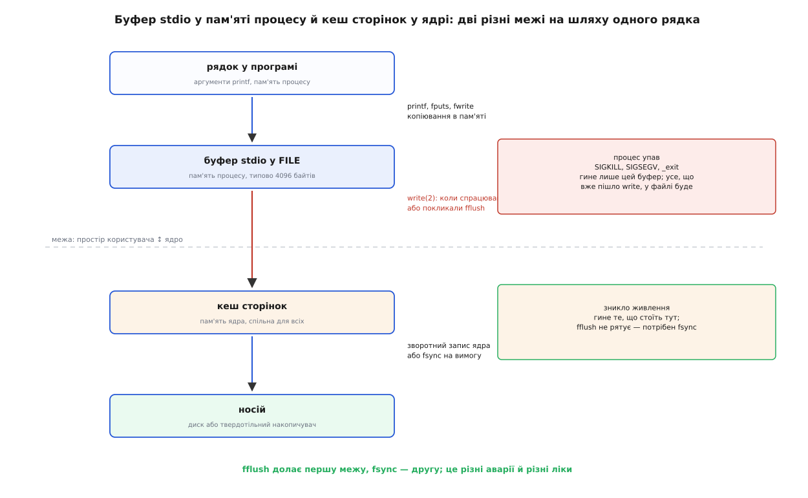
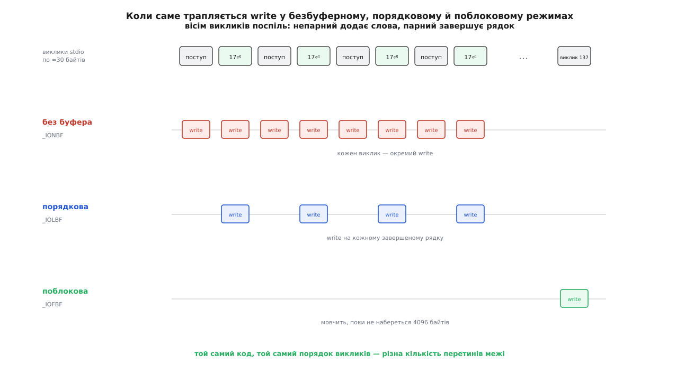
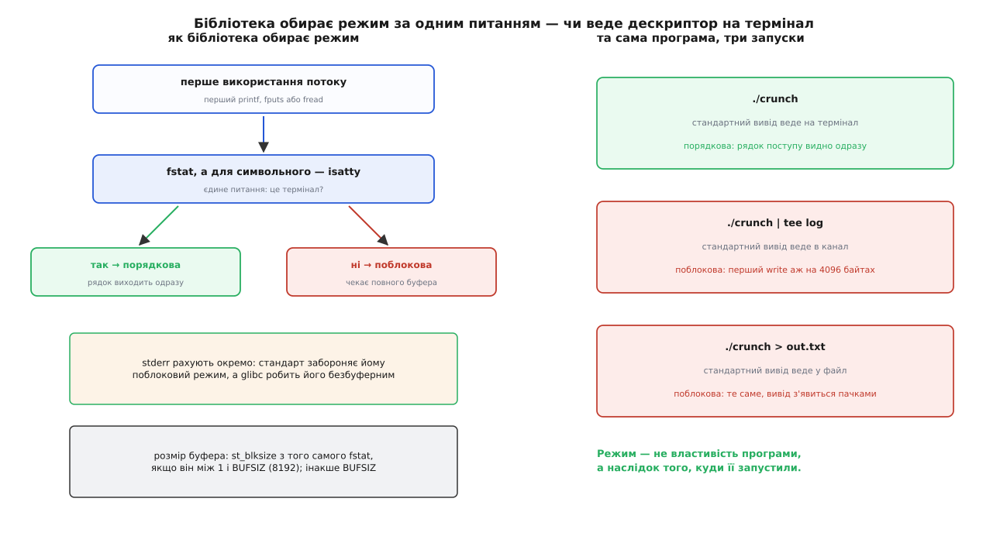

# Буферизація stdio: порядкова, поблокова, без буфера

<preknowlist>
- [Системний виклик](root:sys-unix/syscall-mechanics) — звертання до ядра коштує помітно дорожче за виклик звичайної функції; на цій ціні тримається все інше.
- [libc як шлюз до ядра](root:sys-unix/libc-as-gateway) — `printf` не є системним викликом, це функція бібліотеки, яка колись покличе `write`.
- [Файловий дескриптор](root:sys-unix/file-descriptor) — маленьке число, за яким ядро знаходить відкритий файл, канал чи термінал.
- [Три потоки: stdin, stdout, stderr](root:sys-unix/standard-streams) — дескриптори 0, 1 і 2 програма дістає готовими й наперед не знає, куди вони ведуть.
- [Канали й іменовані канали](root:sys-unix/pipe-and-fifo) — коли програми з'єднані вертикальною рискою, між ними стоїть канал, а не термінал.
- [TTY і послідовний порт: модель termios](root:sys-unix/tty-and-termios) — термінал це окремий вид пристрою, зі своїм драйвером і власною обробкою рядків.
- [fork: розмноження процесу](root:sys-unix/fork-semantics) — дитина дістає копію всієї пам'яті батька, разом з усім, що там на той момент лежало.
- [Кеш сторінок, fsync і довговічність запису](root:sys-unix/page-cache-durability) — `write` повертає успіх задовго до того, як носій щось отримав.
</preknowlist>

Програма рахує щось довге й раз на секунду друкує рядок про поступ. У терміналі все як домовлялися: рядки з'являються по одному, видно, що робота йде. Ту саму програму запускають так: `./crunch | tee crunch.log` — і екран мовчить. Хвилину, дві, п'ять. Потім разом вивалюється купа рядків. Код не міняли, `printf` стоїть на тому самому місці й викликається так само часто. Змінилося тільки те, куди веде стандартний вивід.

Отже, між `printf` і появою байтів на іншому кінці стоїть хтось, хто ухвалює рішення — і в цих двох запусках ухвалив його по-різному. Варто спершу зрозуміти, навіщо він там узагалі.

## Ціна перетину межі

`printf` — не системний виклик, а звичайна функція бібліотеки C. Байти, які вона склала з формату й аргументів, колись мусять піти в ядро викликом `write` на дескриптор 1. Питання лише в тому, коли і якими порціями.

Найпростіша відповідь — «одразу, кожен виклик окремим `write`» — коштує дорожче, ніж здається. Перехід у ядро це не стрибок за адресою: процесор міняє режим, ядро перевіряє аргументи, а від часів вразливостей Meltdown і Spectre до цього додалося перемикання таблиць сторінок і чищення передбачувачів. Порядок величини — півмікросекунди на виклик, і ця ціна не залежить від того, скільки байтів ви передали: один байт чи чотири кілобайти коштують майже однаково.

**Скільки коштує вивести мегабайт по одному байту.**

```
один write() на x86-64            ≈ 0.5 мкс   (перехід у ядро й назад,
                                               з увімкненими пом'якшеннями Spectre)

1 МіБ по одному байту             = 1 048 576 викликів
                                  = 1 048 576 · 0.5 мкс ≈ 0.52 с

через буфер на 4096 байтів        = 1 048 576 / 4096 = 256 викликів
                                  = 256 · 0.5 мкс     ≈ 0.13 мс
плюс копіювання 1 МіБ у буфер     ≈ 0.10 мс   (memcpy ≈ 10 ГБ/с)
                                  ------------------------------
разом                             ≈ 0.23 мс
```

Понад дві тисячі разів. Причому виграш нікуди не дінеться, навіть якщо писати в `/dev/null`: ми економимо не роботу пристрою, а перетини межі між програмою і ядром. Ядро й собі тримає вміст файлів у пам'яті ([кеш сторінок](root:sys-unix/buffered-and-direct-io) — `write` кладе байти в сторінку кеша й повертається, а на носій вони поїдуть згодом і без участі програми), але цей другий рівень починається вже **після** виклику й від його ціни не рятує.

Звідси й береться буфер: шматок пам'яті самої програми, куди `printf`, `fputs` і `fwrite` складають байти, поки їх не набереться на пристойну порцію. Тримає його структура `FILE` — саме вона й є «потоком» у сенсі stdio: дескриптор, буфер, позиція в буфері, режим і прапорці. Оскільки буфер — спільний змінний стан, кожен виклик stdio ще й бере на `FILE` замок, щоб два потоки виконання не поклали свої байти в одне місце; звідси родина функцій `putc_unlocked` і `flockfile` для тих, кому цей замок дорогий.



*Два різні буфери на шляху одного рядка: буфер stdio живе в пам'яті процесу й гине разом із ним, кеш сторінок живе в ядрі й переживає смерть програми.*

> 🔧 **Навіщо це.** Розрізняти ці дві межі доводиться щоразу, коли щось «не записалося». Програма впала — загинуло те, що стояло в буфері stdio; кеш сторінок цілий, і все, що вже пішло `write`, у файлі буде. Зникло живлення — загинуло те, що стояло в кеші сторінок; тут `fflush` не поміг би нічим, бо він доводить байти рівно до ядра. Хто плутає ці випадки, ставить `fsync` там, де вистачило б `fflush`, і навпаки.

## Три режими, три приводи спорожнити буфер

Буфер має спорожнюватися — інакше вивід ніколи не з'явиться. Питання «коли саме» і має рівно три відповіді, названі в стандарті C трьома сталими.

**Поблокова буферизація (`_IOFBF`, fully buffered).** Байти накопичуються, і `write` трапляється тоді, коли буфер повний. Більше нічого не є приводом: ні перехід рядка, ні пауза, ні те, що на іншому кінці хтось чекає. Це найдешевший режим і найгірший для того, хто дивиться на вивід у реальному часі.

**Порядкова буферизація (`_IOLBF`, line buffered).** Приводів два: буфер повний **або** в потоці з'явився символ переходу рядка. Один рядок — один `write`, і саме тому в терміналі поступ видно одразу. Зверніть увагу на друге слово «або»: рядок довший за буфер поїде частинами, не чекаючи свого `\n`.

**Без буфера (`_IONBF`, unbuffered).** Кожен виклик stdio одразу перетворюється на `write`. Буфера як накопичувача немає; проміжна копія в бібліотеці ще може виникати всередині одного `fprintf`, але назовні порція виходить негайно.



*Три режими на спільній осі викликів: поблоковий чекає, поки набереться буфер, порядковий відпускає кожен завершений рядок, безбуферний не чекає нічого.*

## Хто обирає режим і коли

Ось тут і ховається відповідь на початкову загадку. Режим обирає не програма й не той, хто її запустив, а бібліотека C — самостійно, у момент, коли потоком користуються вперше і треба виділити буфер.

Рішення ухвалюється за одним питанням: **чи веде цей дескриптор на термінал**. glibc робить `fstat`, дивиться, чи це символьний пристрій, і для символьного перепитує `isatty`. Веде на термінал — потік стає порядковим. Не веде (звичайний файл, канал, сокет) — поблоковим. Стандарт C формулює те саме через поняття інтерактивного пристрою й окремо вимагає, щоб `stderr` **не був** поблоковим; на практиці в glibc він безбуферний із самого початку.

Розмір буфера теж береться з того самого `fstat`: glibc бере `st_blksize` файлової системи, якщо той більший за нуль і менший за `BUFSIZ` (у glibc це 8192), інакше лишає `BUFSIZ`. На типовій ext4 виходить 4096 байтів — і саме такими порціями `strace` показує запис:

```
$ strace -e trace=write ./crunch > /dev/null
write(1, "progress 1\nprogress 2\nprogress 3"..., 4096) = 4096
write(1, "gress 129\nprogress 130\nprogress "..., 4096) = 4096
```

Тепер загадка розібрана до кінця. У терміналі `stdout` веде на tty, тож він порядковий, і кожен рядок поступу летить одразу. У конвеєрі `stdout` веде в канал — не термінал, отже поблоковий режим, отже перший `write` станеться аж тоді, коли назбирається 4096 байтів. При рядку в 30 байтів це сто тридцять сьомий рядок поступу. Програма не «зависла»: вона працює й «друкує», просто друкує в пам'ять.



*Режим не властивість програми, а наслідок того, куди її запустили: той самий виконуваний файл поводиться по-різному в трьох різних запусках.*

## Наслідки, які не схожі на буферизацію

Правило коротке, а слідів по собі лишає багато — і майже жоден із них не виглядає як проблема буферизації.

**Вивід зникає при аварії.** Буфер stdio — це пам'ять процесу. Нормальний вихід — `return` з `main` або `exit` — серед іншого зливає й закриває всі відкриті потоки. `_exit`, `abort`, `SIGKILL`, `SIGSEGV` не зливають нічого: пам'ять просто зникає разом із процесом. Класична пастка налагодження друком — програма падає, останні кілька екранів `printf` не з'явилися, і здається, що вона впала раніше, ніж насправді. Насправді вона дійшла далі, але свідчення лишилися в буфері.

**`stderr` перестрибує `stdout`.** Обидва потоки перенаправлено в один файл: `./prog > log 2>&1`. `stderr` безбуферний і пише одразу, `stdout` поблоковий і чекає. У файлі повідомлення про помилку опиняється перед рядками, які програма надрукувала до нього. Порядок у файлі — це порядок викликів `write`, а не порядок викликів `printf`.

**`fork` подвоює вивід.** Дитина дістає копію пам'яті батька — разом із непорожнім буфером stdio.

```c
#include <stdio.h>
#include <unistd.h>
#include <sys/wait.h>

int main(void)
{
    printf("рахунок: %d\n", 42);
    if (fork() == 0)
        return 0;            /* дитина завершується звичайно — і зливає СВОЮ копію буфера */
    wait(NULL);
    return 0;                /* батько зливає свою */
}
```

У терміналі це один рядок: режим порядковий, `\n` вигнав рядок ще до `fork`, обидва буфери порожні. Те саме з перенаправленням у файл — два однакові рядки: режим поблоковий, рядок лишився в буфері, обидва процеси мають його копію й обидва при виході її злили. Ліки прості: `fflush(stdout)` перед `fork`, а в дитині, яка йде аварійно (наприклад, коли `exec` не вдався), — саме `_exit`, а не `exit`, щоб не злити чужого недописаного.

Успішний `exec` дає дзеркальну втрату. Він замінює всю пам'ять процесу образом нової програми — разом із буфером stdio й усім, що там лежало недописаним. Дескриптори при цьому лишаються відкритими, тож новий образ спокійно пише в той самий файл, а рядки старого просто зникають без сліду. Тому `fflush(NULL)` перед `fork` і `exec` — не забобон, а єдиний спосіб не втратити те, що вже «надруковано».

**Змішування stdio й прямих `write` плутає порядок.** `printf` кладе в буфер, `write(1, …)` іде повз буфер просто в ядро. Байти з'являються у файлі в порядку `write`-ів, тобто прямий запис випереджає все, що ще стоїть у черзі stdio. Якщо в програмі є обидва шляхи (типово: бібліотека друкує `printf`, а власний швидкий вивід іде `write`), єдиний спосіб зберегти порядок — `fflush` перед кожним прямим записом.

**Конвеєр із діалогом заходить у глухий кут.** Програма друкує запрошення без переходу рядка й чекає на відповідь у `stdin`. Керує нею скрипт через пару каналів. Запрошення лягає в поблоковий буфер і нікуди не йде; скрипт чекає на запрошення, програма чекає на відповідь. Ніхто нікого не діждеться. У терміналі те саме не ламається з двох причин: режим порядковий, а крім того, glibc перед читанням із порядково буферизованого чи безбуферного потоку окремо зливає `stdout` — саме заради запрошень без `\n`. Стандарт цього не вимагає, це традиція Unix, збережена в реалізації.

**Читання буферизоване так само.** `fgetc` не робить системного виклику на кожен символ: перший же виклик читає з ядра цілий блок, а далі роздає з нього. Тому не можна змішувати `fgetc`/`fgets` із прямим `read` на тому самому дескрипторі: у буфері бібліотеки вже лежить те, що ви вважаєте непрочитаним, і зміщення файлу пішло далеко вперед. І тут варто розділити дві речі, які легко злипаються: те, що термінал віддає введення рядками й дозволяє правити його клавішею вилучення, — робота драйвера tty (канонічний режим), а не stdio. Буферизація бібліотеки й обробка рядків у драйвері — різні механізми на різних боках межі, просто вони обидва спрацьовують на переході рядка.

## Важелі

Головний важіль — `setvbuf`: він задає потокові режим і буфер. Обмеження одне, зате жорстке: викликати його можна лише після відкриття потоку й **до першої операції над ним**. Причина видна з попереднього: буфер виділяється при першому використанні, разом із ним фіксується режим, і в уже початому потоці міняти основу під ногами нема як.

```c
#include <stdio.h>
#include <unistd.h>

int main(void)
{
    /* Хочемо бачити поступ навіть у конвеєрі — до будь-якого друку. */
    if (!isatty(STDOUT_FILENO))
        setvbuf(stdout, NULL, _IOLBF, BUFSIZ);
    /* далі звичайна робота з printf */
}
```

`setlinebuf(stdout)` — коротший запис того самого, `setbuf(stream, NULL)` вимикає буферизацію зовсім. Другий аргумент `setvbuf` дозволяє підсунути власну пам'ять замість тієї, яку виділить бібліотека; тоді ця пам'ять мусить жити щонайменше стільки, скільки сам потік. Масив на стеку функції, яка налаштувала потік і повернулася, — готова аварія: бібліотека далі складає байти за адресою, яка вже належить чиємусь кадру виклику. Точні сигнатури, значення аргументів і те, що з них вимагає стандарт, а що додає glibc, зібрано окремо: [контракт керування буферизацією](root:sys-unix/stdio-buffering/api-stdio-buffer-controls.md) — прототипи `setvbuf`, `setbuf`, `setbuffer`, `setlinebuf`, семантика `fflush` і `fflush(NULL)`, родина `_unlocked`, змінні середовища `stdbuf`.

`fflush(stream)` виштовхує буфер негайно, `fflush(NULL)` — усі потоки виводу відразу. Ще раз: `fflush` доводить байти **до ядра**, не до носія. Обіцянка «дані переживуть зникнення живлення» — це вже `fsync` або `fdatasync` ([кеш сторінок, fsync і довговічність запису](root:sys-unix/page-cache-durability) — між успішним `write` і фізичним записом лежить кеш ядра й невизначений час до зворотного запису).

А що робити з чужою програмою, до якої нема джерел? Для цього є `stdbuf(1)` з coreutils: `stdbuf -oL ./crunch | tee crunch.log`. Працює він не магією, а підстановкою: ставить змінні `_STDBUF_O`, `_STDBUF_I`, `_STDBUF_E`, додає в `LD_PRELOAD` бібліотеку `libstdbuf.so` і робить `exec`; та бібліотека при завантаженні викликає `setvbuf` за цими змінними — тобто до `main`, коли потоки ще не займані. Звідси й обидві його межі, чесно записані в довідці: якщо програма сама викличе `setvbuf` (так робить, наприклад, `tee`), вона перезапише зроблене; а якщо вона взагалі не користується stdio й пише прямими `write` (`dd`, `cat`), то міняти в ній нема чого. У цих випадках лишається інший спосіб — підсунути програмі псевдотермінал (`script`, `unbuffer` з пакета expect): тоді `isatty` каже «так», і бібліотека сама обирає порядковий режим.

> 🔧 **Навіщо це.** Служба пише журнал у `stdout`, а systemd підбирає його з каналу — тобто режим поблоковий. Поки не станеться 4096 байтів журналу, у `journalctl` не буде нічого, і найцікавіші рядки — ті, що передували падінню, — не з'являться ніколи. Тому в службах, які журналюють у стандартний вивід, `setvbuf(stdout, NULL, _IOLBF, 0)` на початку `main` — не мікрооптимізація навпаки, а умова того, що журнал взагалі буде.

Історія цього поділу пояснює, чому рішення ухвалює бібліотека, а не програма: [як народився stdio](root:sys-unix/stdio-buffering/hist-lesk-and-ritchie.md) — переносний пакет вводу-виводу Майка Леска, який ходив по машинах, дуже несхожих на PDP-11, і переробка Денніса Рітчі для сьомої редакції, де буферизацію сховали за `FILE` й прив'язали до виду пристрою. Побачити все описане на власній машині — за півгодини: [лабораторія буферизації](root:sys-unix/stdio-buffering/proj-buffering-lab.md) — виміряти ціну посимвольного `write`, зловити зміну режиму під `strace`, відтворити подвоєння виводу через `fork` і полагодити його, перевірити межі `stdbuf`.

## Рішення, яке краще ухвалити самому

Типовий режим підібрано розумно: інтерактивному користувачеві потрібна швидка відповідь, конвеєрові — пропускна здатність, і бібліотека вгадує це з єдиної доступної їй ознаки. Але ознака ця — не про наміри програми, а про оточення запуску. Виходить, що програма, яка не сказала про буферизацію нічого, віддала рішення тому, хто набирає команду: додав `| tee` — і поведінка виводу змінилася, хоч ніхто цього не просив.

Тому вибір простий і робиться один раз, на початку `main`. Вивід, який хтось читає в реальному часі — поступ, журнал, діагностика, — має бути порядковим незалежно від того, куди він веде. Вивід, який є даними для наступної програми в конвеєрі, має лишатися поблоковим.

Ціна цього вибору теж рахується просто, і рахувати її варто саме тут, а не гадати. Порядковий режим означає один системний виклик на рядок; при півмікросекунди за виклик служба, що видає 50 тисяч рядків журналу за секунду, віддає на самі переходи в ядро 25 мілісекунд процесорного часу щосекунди — два з половиною відсотки одного ядра. За миттєво видимий журнал це дешево. Та сама арифметика на потоці даних у мільйон рядків за секунду дає вже півсекунди процесорного часу на кожну секунду роботи, тобто половину ядра, — і там поблоковий режим уже не примха, а необхідність.

А `stderr` варто залишити безбуферним, як його й зробили: повідомлення про катастрофу мусить встигнути вийти до самої катастрофи.
