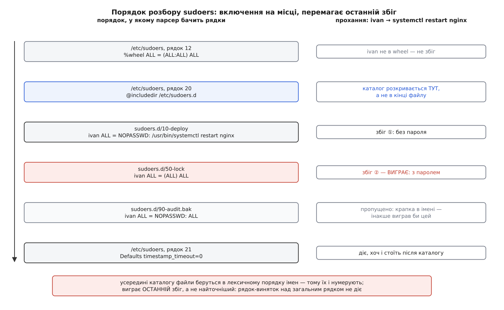

# 📋 Синтаксис sudoers і команди навколо нього

Це довідка на файл політики: граматика правила, псевдоніми, порядок розбору, директиви `Defaults`, позначки й контрольні суми — плюс ті команди, якими файл правлять, перевіряють і читають. Окремої довідки синтаксис вартий з простої причини: помилка в ньому майже ніколи не виглядає помилкою. Неправильно записане правило не викликає скарги — воно означає не те, що думав автор, і з'ясовується це в найгірший момент.

Усе нижче — по sudo 1.9.x; де окрема можливість прийшла в конкретній версії, її позначено на місці.

### Граматика правила

Рядок дозволу зветься **специфікацією користувача**:

```
User_Spec      ::= User_List Host_List '=' Cmnd_Spec_List
                   (':' Host_List '=' Cmnd_Spec_List)*
Cmnd_Spec_List ::= Cmnd_Spec (',' Cmnd_Spec)*
Cmnd_Spec      ::= Runas_Spec? Option_Spec* (Tag_Spec ':')* Cmnd
Runas_Spec     ::= '(' Runas_List? (':' Runas_List)? ')'
Cmnd           ::= Digest_List? '!'? ( '/абсолютний/шлях' аргументи?
                                     | '/каталог/'
                                     | 'sudoedit' шляхи
                                     | Cmnd_Alias | 'ALL' )
```

| Список | З чого складається | Приклад |
|---|---|---|
| `User_List` | `ім'я`, `#uid`, `%група`, `%#gid`, `%:група` (з окремого джерела груп), `+мережева-група`, `User_Alias`, `ALL` | `ivan, %dba, +ops` |
| `Host_List` | коротке ім'я вузла, повне доменне ім'я, адреса, `мережа/маска`, `Host_Alias`, `ALL` | `web1, db-*.local, 10.0.3.0/24` |
| `Runas_List` | те саме, що `User_List`; до двокрапки — користувач, після неї — група | `(postgres:dba)` |
| `Cmnd_List` | абсолютний шлях, шлях із шаблонами, каталог зі скісною, `sudoedit`, `Cmnd_Alias`, `ALL` | `/usr/bin/pg_dump, /usr/sbin/` |

Імена й членство в групах `sudo` не тлумачить сам — він питає [звичайну базу облікових записів](topic:sys-unix/user-database-nss), той самий ланцюг джерел, яким користуються всі програми. Тому `%dba` в мережевому каталозі означає різних людей на різних машинах, і це навмисно.

Два наслідки граматики варто прочитати окремо, бо з прикладів їх не видно.

**Позначка й `Runas_Spec` тягнуться далі по списку** — до кінця `Cmnd_Spec_List` або до протилежної позначки. Тому

```
ivan ALL = (root) NOPASSWD: /usr/bin/systemctl restart nginx, /usr/bin/journalctl
```

дає без пароля **обидві** команди, а не тільки першу.

**Двокрапка після повного списку команд** починає новий шматок для **того самого переліку користувачів**, але з іншим переліком машин: `ivan PROD = (root) SVC : DEV = (ALL) ALL`.

Крім позначок, `Cmnd_Spec` приймає ще й **опції правила** — вони пишуться з `=` і, на відміну від позначок, значення мають:

| Опція | Що робить |
|---|---|
| `TIMEOUT=15m` | убити команду, якщо вона не скінчилася вчасно |
| `NOTBEFORE=`, `NOTAFTER=` | вікно, поза яким правило не діє (час у форматі `20260101000000Z`) |
| `CWD=/шлях` | у якому каталозі стартувати (`*` — дозволити прохачеві вибрати через `-D`) |
| `CHROOT=/шлях` | корінь для команди |

`CWD` і `CHROOT` з'явилися в **sudo 1.9.3** і з того часу є зарезервованими словами — псевдонім із такою назвою більше не заводиться.

### Псевдоніми

Псевдонім — це просто іменований перелік; окремого сенсу він не додає, зате дає одне місце для правки.

```
User_Alias  ADMINS = ivan, %dba, +ops
Runas_Alias DB     = postgres, oracle
Host_Alias  PROD   = web1, web2, db-*.local, 10.0.3.0/24
Cmnd_Alias  SVC    = /usr/bin/systemctl restart nginx, \
                     /usr/bin/systemctl status nginx

ADMINS PROD = (DB) SVC
```

Ім'я мусить починатися з великої літери й далі містити лише великі літери, цифри та підкреслення: `[A-Z][A-Z0-9_]*`. Кілька визначень одного типу пишуться через `:` в одному рядку. Будь-який елемент можна заперечити знаком `!` — з тим самим застереженням, що й усюди в sudoers: заперечення не є межею, бо межу задає лише перелік дозволеного.

### Порядок розбору: що за чим і хто виграє

Файл читається згори вниз, а директиви включення розкриваються **на своєму місці в тексті**, а не наприкінці:

| Директива | Що робить |
|---|---|
| `@includedir /etc/sudoers.d` | підставляє сюди вміст усіх придатних файлів каталогу |
| `@include /etc/sudoers.local` | підставляє сюди один файл; у назві можна вжити `%h` — ім'я машини |
| `#includedir`, `#include` | те саме написання до sudo 1.9.1; приймається досі |

Форми з `@` додали в **sudo 1.9.1** саме тому, що `#` у цьому файлі водночас починає коментар, і рядок `#includedir` роками читали як вимкнений.

Усередині каталогу файли беруться в лексичному порядку імен, а **пропускаються ті, у чиїй назві є крапка або чиє ім'я закінчується на `~`**. Правило зручне — редактор лишив `10-deploy~`, і той не діє, — але воно ж мовчки викидає файл на ім'я `nginx.conf`.



*Правило-виняток, поставлене над загальним правилом, не діє: перемагає останній збіг, а не найточніший.*

Коли підходить кілька правил, **виграє останній збіг**, і це стосується всього одразу — і дозволу, і цілі, і позначок. Практичний висновок один: винятки пишуться **нижче** за загальні рядки, а нумерація файлів у `sudoers.d/` — не косметика, а частина політики.

### Позначки

| Пара | Що робить перша форма |
|---|---|
| `NOPASSWD` / `PASSWD` | зняти вимогу доказу присутності |
| `NOEXEC` / `EXEC` | заборонити дозволеній програмі запускати інші |
| `SETENV` / `NOSETENV` | дозволити прохачеві передати змінні (`sudo VAR=x cmd`, ключ `-E`) |
| `LOG_INPUT` / `NOLOG_INPUT` | записувати введення сеансу |
| `LOG_OUTPUT` / `NOLOG_OUTPUT` | записувати вивід сеансу |
| `MAIL` / `NOMAIL` | слати листа про спробу |
| `FOLLOW` / `NOFOLLOW` | чи йде `sudoedit` за символьним посиланням |
| `INTERCEPT` / `NOINTERCEPT` | звіряти з політикою **кожну** дочірню команду (1.9.8) |

`NOEXEC` і `INTERCEPT` розв'язують ту саму біду різними способами й плутати їх не варто. `NOEXEC` **забороняє** запуск дочірніх програм: `sudo` підкладає команді власну бібліотеку через [механізм попереднього завантаження](topic:sys-unix/library-search-order) — тобто діє лише на динамічно злінковані програми. Від sudo 1.8.18p1 ця бібліотека на Linux не просто підміняє функції libc, а ставить [фільтр системних викликів](topic:sys-unix/seccomp-filter-mechanism), тож обійти її прямим `execve` більше не виходить. `INTERCEPT` натомість дочірні команди **дозволяє**, але проганяє кожну через ту саму політику, ніби її подали через `sudo` окремо.

### Defaults: що і до чого прив'язано

| Форма | Коли діє |
|---|---|
| `Defaults опції` | завжди |
| `Defaults@Host_List` | лише на цих машинах |
| `Defaults:User_List` | лише для цих прохачів |
| `Defaults>Runas_List` | лише коли ціль — саме ці користувачі |
| `Defaults!Cmnd_List` | лише для цих команд |

Пробілу між словом `Defaults` і знаком `@ : > !` бути не може — з пробілом це вже глобальна директива з чужим першим словом.

Далі йде саме значення: `Defaults прапорець` вмикає, `Defaults !прапорець` вимикає, `Defaults змінна=значення` присвоює, а `+=` і `-=` додають елемент до списку й віднімають від нього. Для списків на кшталт `env_keep` майже завжди потрібне саме `+=`: присвоєння через `=` затирає те, що поклав дистрибутив.

### Прапорці, які помітно змінюють поведінку

| Прапорець | Типово | Що робить |
|---|---|---|
| `env_reset` | увімкнено | викидає [оточення прохача](topic:sys-unix/argv-and-environment), лишаючи короткий білий список |
| `env_keep` | список | що саме зберегти попри `env_reset` |
| `env_check` | список | зберегти, лише якщо значення не містить `%` або `/` |
| `secure_path` | у самому sudo не задано, у дистрибутивах задано майже завжди | стала `PATH` для команди замість вашої |
| `timestamp_timeout` | `5` (хвилин) | строк квитка; `0` — питати щоразу, від'ємне — до перезавантаження |
| `timestamp_type` | `tty` | межа квитка: `tty`, `ppid` або `global`; давній `tty_tickets` означає те саме |
| `use_pty` | увімкнено від **1.9.14** | віддати команді свіжий [псевдотермінал](topic:sys-unix/pseudo-terminal) замість вашого |
| `log_input`, `log_output` | вимкнено | писати введення й вивід у `/var/log/sudo-io` |
| `iolog_dir` | `/var/log/sudo-io` | куди саме писати ці сеанси |
| `requiretty` | вимкнено | вимагати справжній термінал — тобто зламати виклик зі скриптів і `cron` |
| `passwd_tries` | `3` | скільки спроб пароля дається |
| `passwd_timeout` | `5` (хвилин) | скільки чекати на введення |
| `targetpw`, `rootpw` | вимкнено | питати пароль **цілі** чи root замість вашого |
| `lecture` | `once` | коротка настанова при першому запуску |
| `mail_badpass` | вимкнено (дистрибутиви часто вмикають) | слати листа про невдалу спробу пароля |

`requiretty` варто знати навіть тим, хто його не вмикає: в збірках Red Hat він роками стояв увімкненим, і саме він давав класичне `sorry, you must have a tty to run sudo` в задачах `cron`.

### Команда, аргументи й шаблони

| Що записано | Що це означає |
|---|---|
| `/usr/bin/pg_dump` | будь-які аргументи, зокрема жодного |
| `/usr/bin/pg_dump ""` | **лише** без аргументів |
| `/usr/bin/pg_dump -Fc *` | перший аргумент рівно такий, далі будь-що |
| `/usr/sbin/` | будь-який файл прямо в каталозі — **без** вкладених |
| `/usr/bin/*ctl` | шаблон у шляху: `*` **не** переходить через `/` |
| `sudoedit /etc/nginx/*.conf` | `sudoedit` — вбудована команда, її пишуть **без** шляху |

Найважливіша асиметрія тут така: у шляху `*` через скісну не переходить, а **в аргументах — переходить**, і шляхи в аргументах ніхто не зводить до канонічного вигляду. Тому дозвіл `/bin/cat /var/log/*` збігається й з `../../etc/shadow`: [розбір шляху](topic:sys-unix/path-resolution) робить ядро вже після того, як текстове звіряння сказало «так». До того ж усі аргументи приходять уже [розкладеними оболонкою](topic:sys-unix/expansion-and-quoting) — правило бачить наслідок підстановки, а не те, що набрала людина.

### Контрольні суми файлів

Дозвіл можна прив'язати не до імені файлу, а до його вмісту:

```
Cmnd_Alias LS = sha256:EYGH2oNk1JC0p9679IMATo8+BT7JVDCd4sQaJQXHb0Y= /usr/bin/ls
```

Приймаються `sha224`, `sha256`, `sha384` і `sha512`, значення — шістнадцяткове або base64. Порахувати:

```
sha256sum /usr/bin/ls
openssl dgst -sha256 -binary /usr/bin/ls | openssl base64
```

Сума звіряється в мить збігу: щойно файл підмінили або оновили пакунком, правило перестає збігатися — і людина дістає відмову, а не тихо запускає інший двійковий файл. Від sudo 1.9.0 суму можна ставити навіть перед `ALL`.

### Команди навколо файлу

| Команда | Що робить |
|---|---|
| `visudo` | замикає файл від одночасної правки, а на виході розбирає його й **не кладе на місце**, якщо є помилка |
| `visudo -c` | лише перевірити (код виходу `0` або `1`) — те, що ставлять у складання |
| `visudo -f ФАЙЛ` | те саме над окремим файлом із `sudoers.d/` |
| `visudo -s` | вважати невизначені й циклічні псевдоніми помилкою, а не попередженням |
| `visudo -O`, `-P` | доправити власника й режим файлу |
| `sudo -l` | що дозволено **вам** тут — після всіх включень і накладань |
| `sudo -l -U ivan` | те саме про іншу людину; доступно root або тому, хто й так може все |
| `sudo -l КОМАНДА` | код виходу `0`, якщо саме ця команда дозволена |
| `sudo -v` | подовжити квиток, нічого не запускаючи |
| `sudo -k` | скинути квиток цього сеансу; з командою — вимагати пароль саме зараз |
| `sudo -K` | стерти всі квитки людини, з усіх терміналів |
| `sudo -u ЦІЛЬ`, `-g ГРУПА` | від чийого імені й з якою основною групою |
| `sudo -n` | не питати нічого: або йде без пароля, або відмова (для скриптів) |
| `sudo -e ФАЙЛ` | те саме, що `sudoedit` |
| `sudoreplay -l`, `sudoreplay TSID` | знайти й програти записаний сеанс; `TSID` шість символів, він є в журналі |
| `cvtsudoers` | перевести політику між форматами `sudoers`, LDIF, JSON і CSV, злити кілька файлів або відфільтрувати частину |

`cvtsudoers` з'явився в **sudo 1.8.23** і замінив собою і давній скрипт `sudoers2ldif`, і ключ `visudo -x` — тому шукати вивід у інші формати у `visudo` більше немає сенсу. Формат LDIF потрібен, коли політика переїжджає в [каталог служб](topic:sys-unix/ldap-directory), а JSON — коли її перевіряє чужа програма:

```
cvtsudoers -f json -o policy.json /etc/sudoers
cvtsudoers -m user=ivan,host=web1 -f sudoers /etc/sudoers
```

Друга форма особливо корисна: вона показує політику, зведену до одного прохача на одній машині, — тобто рівно те, що переглядати очима.

### Мінімальний робочий файл

```
# /etc/sudoers.d/10-deploy   власник root:root, режим 0440
Cmnd_Alias NGINX = /usr/bin/systemctl restart nginx, \
                   /usr/bin/systemctl reload nginx

Defaults:deploy  timestamp_timeout=1
Defaults!NGINX   log_output

deploy ALL = (root) NOPASSWD: NOEXEC: NGINX
```

Укладати його треба через перевірку, а не копіюванням:

```
visudo -c -f ./10-deploy && install -o root -g root -m 0440 \
    ./10-deploy /etc/sudoers.d/10-deploy
sudo -l -U deploy
```

Останній рядок і є справжньою перевіркою. Файл із правильним синтаксисом ще нічого не гарантує: збіг вирішують усі інші файли каталогу разом із ним, а `sudo -l -U` дає ту саму відповідь, яку `sudo` дасть у мить запуску.
