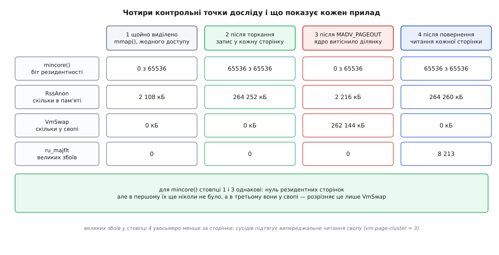

# 🔬 Дослід: витіснити власну сторінку й піймати її повернення

Цей дослід дає в руки те, чого не покаже жоден монітор: власну ділянку пам'яті, яку ви самі відправили у своп, і виміряну в мікросекундах ціну кожної сторінки, що прилетіла назад. Далі — робоча програма на C, розбір її виводу і перелік місць, де вимір легко зіпсувати так, що числа лишаться правдоподібними.

## Чому не годиться звичайний шлях

Найочевидніший спосіб побачити свопінг — довести машину до нестачі пам'яті: запустити ненажеру, дочекатися, доки лічильники заворушаться, і дивитися. Спосіб працює, але для вимірювання не годиться з трьох окремих причин.

По-перше, він руйнівний: під тиск потрапляє вся машина, а не ваша програма, і разом з нею — робочий стіл, служби й та сама оболонка, з якої ви дивитеся на результат. По-друге, він невідтворюваний: жертву обирає ядро за своїми чергами, тож двічі поспіль витісниться різне. По-третє, і це головне, він міряє не те: ви бачите поведінку **системи** під тиском, а хотіли ціну повернення **конкретної сторінки**.

Потрібен скальпель замість пресу — спосіб сказати ядру «витісни ось цю ділянку, і тільки її», не створюючи жодного тиску. Такий скальпель є з Linux 5.4: порада `MADV_PAGEOUT` у виклику `madvise`. Довідник `madvise(2)` описує її прямо: «If a page is anonymous, it will be swapped out», а `MADV_COLD` поруч робить м'якшу річ — лише знижує сторінки, роблячи їх імовірнішою жертвою.

## План досліду

Дослід має чотири контрольні точки, і сенс кожної — не в тому, що показує один прилад, а в тому, чим показання **різняться** між точками.

1. Ділянку виділено через `mmap`, але жодного разу не торкано. Фізичних сторінок ще нема — [сторінкового збою](topic:sf-os/page-fault) ще не було.
2. У кожну сторінку зроблено запис. Тепер ділянка вся в пам'яті.
3. Ядро попрошено витіснити саме цю ділянку. Сторінки мають зникнути з пам'яті й з'явитися у свопі.
4. Ділянку прочитано наскрізь. Сторінки повернулися; ми знаємо, скільки часу це коштувало й скільки великих збоїв дало.

Приладів теж чотири, і кожен відповідає на своє питання. `mincore()` каже, які сторінки ділянки просто зараз відображені в наші таблиці сторінок. `RssAnon` і `VmSwap` із `/proc/self/status` — скільки анонімної пам'яті в нас у пам'яті й скільки відкладено у своп. `getrusage()` дає `ru_majflt` — кількість збоїв, які, за словами `getrusage(2)`, «required I/O activity». А `clock_gettime(CLOCK_MONOTONIC)` дає час, на який годинник не стрибне через підправлення системного часу.



*Цікаве в цій таблиці — не рядки, а те, що два стовпці збігаються: `mincore()` однаково каже «нуль» і про сторінки, яких ще не було, і про ті, що пішли у своп.*

## Що прибрати з-під ніг перед виміром

Три речі здатні тихо зіпсувати числа, і жодна з них не дасть про себе знати помилкою.

**Прозорі великі сторінки.** Якщо ділянка ляже на [великі сторінки](topic:sys-unix/huge-pages-tlb-reach), одиницею роботи стануть 2 МіБ замість 4 КіБ: один збій приведе назад п'ятсот дванадцять сторінок відразу, і «ціна на сторінку» перестане означати те, що ви думаєте. Лікується порадою `MADV_NOHUGEPAGE` одразу після `mmap`.

**Оптимізатор.** Цикл, який читає пам'ять і нічого не робить із прочитаним, компілятор має повне право викинути цілком — а разом із ним і всі збої, які мали статися. Вказівник мусить бути `volatile`.

**Відсутність свопу.** Анонімну сторінку не можна забрати, доки їй немає куди подітися. На машині без жодної області свопу `MADV_PAGEOUT` відпрацює вхолосту й поверне нуль — успіх, за яким нічого не сталося. Тому програма перевіряє `/proc/swaps` першою дією й каже про це вголос.

І ще одне, не про вимір, а про правильність: розмір сторінки не константа. Він береться з `sysconf(_SC_PAGESIZE)`, бо на тому ж AArch64 він буває і 4, і 16, і 64 КіБ.

## Програма

Домен тут прибитий цвяхами до системних викликів: `mmap`, `madvise`, `mincore`, `getrusage` — це [інтерфейс ядра](topic:sys-unix/syscall-mechanics), і будь-яка обгортка іншою мовою лише додасть шар між виміром і тим, що вимірюють. Нижче наведено ідентичний дослід двома мовами — C та C++.

:::tabs
```c
/* swapprobe.c — витіснити власну ділянку й виміряти ціну її повернення
 * збірка: cc -O2 -Wall -Wextra -o swapprobe swapprobe.c
 * запуск: ./swapprobe [МіБ] [r|w]   — типово 256 МіБ, повернення читанням */
#define _GNU_SOURCE
#include <stdio.h>
#include <stdlib.h>
#include <string.h>
#include <errno.h>
#include <unistd.h>
#include <time.h>
#include <sys/mman.h>
#include <sys/resource.h>

#ifndef MADV_COLD
#define MADV_COLD     20
#endif
#ifndef MADV_PAGEOUT
#define MADV_PAGEOUT  21
#endif

static long PAGE;

static long long now_ns(void)
{
    struct timespec ts;
    clock_gettime(CLOCK_MONOTONIC, &ts);
    return (long long)ts.tv_sec * 1000000000LL + ts.tv_nsec;
}

/* скільки сторінок ділянки просто зараз відображені в наші таблиці сторінок */
static size_t resident_pages(void *a, size_t len)
{
    size_t n = len / (size_t)PAGE, i, live = 0;
    unsigned char *vec = malloc(n);
    if (!vec) { perror("malloc"); exit(1); }
    if (mincore(a, len, vec) != 0) { perror("mincore"); exit(1); }
    for (i = 0; i < n; i++)
        if (vec[i] & 1u) live++;
    free(vec);
    return live;
}

/* одне поле з /proc/self/status, у кілобайтах; −1, якщо поля немає */
static long status_kb(const char *key)
{
    char line[256];
    long val = -1;
    size_t klen = strlen(key);
    FILE *f = fopen("/proc/self/status", "r");
    if (!f) { perror("/proc/self/status"); exit(1); }
    while (fgets(line, sizeof line, f))
        if (strncmp(line, key, klen) == 0 && line[klen] == ':') {
            sscanf(line + klen + 1, "%ld", &val);
            break;
        }
    fclose(f);
    return val;
}

static long major_faults(void)
{
    struct rusage ru;
    getrusage(RUSAGE_SELF, &ru);
    return ru.ru_majflt;
}

/* по одному доступу на сторінку; volatile — щоб компілятор не викинув цикл */
static void touch(void *a, size_t len, int write)
{
    volatile unsigned char *p = a;
    unsigned sink = 0;
    size_t i;
    for (i = 0; i < len; i += (size_t)PAGE) {
        if (write) p[i] = 1;
        else       sink += p[i];
    }
    (void)sink;
}

static void snapshot(const char *label, void *a, size_t len)
{
    printf("%s\n"
           "   резидентних %6zu з %zu   RssAnon %8ld кБ"
           "   VmSwap %8ld кБ   majflt %ld\n",
           label, resident_pages(a, len), len / (size_t)PAGE,
           status_kb("RssAnon"), status_kb("VmSwap"), major_faults());
}

/* MADV_PAGEOUT лише запускає роботу: хвіст сторінок ще під записом у своп.
   Чекаємо, доки резидентність перестане падати, але не довше за ms. */
static size_t settle(void *a, size_t len, int ms)
{
    struct timespec nap = { 0, 20 * 1000 * 1000 };
    long long deadline = now_ns() + (long long)ms * 1000000LL;
    size_t prev = resident_pages(a, len), cur;
    for (;;) {
        nanosleep(&nap, NULL);
        cur = resident_pages(a, len);
        if (cur == 0 || cur == prev || now_ns() > deadline) return cur;
        prev = cur;
    }
}

static int have_swap(void)
{
    char line[256];
    int rows = 0;
    FILE *f = fopen("/proc/swaps", "r");
    if (!f) return 0;
    while (fgets(line, sizeof line, f)) rows++;
    fclose(f);
    return rows > 1;                      /* перший рядок — заголовок */
}

int main(int argc, char **argv)
{
    size_t mib   = (argc > 1) ? (size_t)strtoul(argv[1], NULL, 10) : 256;
    int    wmode = (argc > 2 && argv[2][0] == 'w');
    size_t len, pages, left;
    void  *a;
    long long t0, t1;
    long mf0, mf1;
    double us;

    PAGE = sysconf(_SC_PAGESIZE);
    if (mib == 0) { fprintf(stderr, "розмір має бути більший за нуль\n"); return 2; }
    len   = mib * 1024 * 1024;
    pages = len / (size_t)PAGE;

    if (!have_swap())
        fprintf(stderr, "УВАГА: жодної області свопу — анонімним сторінкам "
                        "нікуди йти, витіснення не станеться\n");

    a = mmap(NULL, len, PROT_READ | PROT_WRITE,
             MAP_PRIVATE | MAP_ANONYMOUS, -1, 0);
    if (a == MAP_FAILED) { perror("mmap"); return 1; }

    /* без цього одиницею роботи стануть 2 МіБ замість сторінки */
    if (madvise(a, len, MADV_NOHUGEPAGE) != 0)
        fprintf(stderr, "MADV_NOHUGEPAGE: %s — числа будуть грубіші\n",
                strerror(errno));

    snapshot("1 щойно виділено", a, len);

    touch(a, len, 1);
    snapshot("2 після торкання", a, len);

    if (madvise(a, len, MADV_PAGEOUT) != 0) {
        fprintf(stderr, "MADV_PAGEOUT: %s (потрібен Linux 5.4+)\n",
                strerror(errno));
        return 1;
    }
    left = settle(a, len, 5000);
    if (left)
        fprintf(stderr, "лишилося резидентними %zu сторінок: "
                        "MADV_PAGEOUT — підказка, а не наказ\n", left);
    snapshot("3 після MADV_PAGEOUT", a, len);

    mf0 = major_faults();
    t0  = now_ns();
    touch(a, len, wmode);
    t1  = now_ns();
    mf1 = major_faults();

    snapshot("4 після повернення", a, len);

    us = (double)(t1 - t0) / 1000.0;
    printf("\nповернення %zu сторінок (%zu МіБ) %s\n",
           pages, mib, wmode ? "записом" : "читанням");
    printf("  великих збоїв   %ld  (%.1f %% сторінок)\n",
           mf1 - mf0, 100.0 * (double)(mf1 - mf0) / (double)pages);
    printf("  час             %.1f мс\n", us / 1000.0);
    printf("  на сторінку     %.1f мкс\n", us / (double)pages);
    if (mf1 > mf0)
        printf("  на великий збій %.1f мкс\n", us / (double)(mf1 - mf0));

    munmap(a, len);
    return 0;
}
```
```cpp
// swapprobe.cpp — витіснити власну ділянку й виміряти ціну її повернення в C++20
// збірка: g++ -O2 -std=c++20 -Wall -Wextra -o swapprobe_cpp swapprobe.cpp
// запуск: ./swapprobe_cpp [МіБ] [r|w]
#define _GNU_SOURCE
#include <iostream>
#include <iomanip>
#include <fstream>
#include <vector>
#include <string>
#include <chrono>
#include <cstdio>
#include <cstdlib>
#include <cstring>
#include <cerrno>
#include <ctime>
#include <unistd.h>
#include <sys/mman.h>
#include <sys/resource.h>

#ifndef MADV_COLD
#define MADV_COLD     20
#endif
#ifndef MADV_PAGEOUT
#define MADV_PAGEOUT  21
#endif

namespace {

long page_size() {
    static const long ps = sysconf(_SC_PAGESIZE);
    return ps;
}

size_t count_resident_pages(void* addr, size_t len) {
    const size_t pages = len / static_cast<size_t>(page_size());
    std::vector<unsigned char> vec(pages);
    if (mincore(addr, len, vec.data()) != 0) {
        std::perror("mincore");
        std::exit(1);
    }
    size_t live = 0;
    for (auto b : vec) {
        if (b & 1u) ++live;
    }
    return live;
}

long read_status_kb(const std::string& key) {
    std::ifstream file("/proc/self/status");
    if (!file) return -1;
    std::string line;
    while (std::getline(file, line)) {
        if (line.rfind(key + ":", 0) == 0) {
            size_t pos = line.find_first_of("0123456789");
            if (pos != std::string::npos) {
                return std::stol(line.substr(pos));
            }
        }
    }
    return -1;
}

long get_major_faults() {
    struct rusage ru{};
    getrusage(RUSAGE_SELF, &ru);
    return ru.ru_majflt;
}

void touch_memory(void* addr, size_t len, bool write_mode) {
    volatile auto* p = static_cast<volatile unsigned char*>(addr);
    const size_t ps = static_cast<size_t>(page_size());
    unsigned sink = 0;
    for (size_t i = 0; i < len; i += ps) {
        if (write_mode) {
            p[i] = 1;
        } else {
            sink += p[i];
        }
    }
    (void)sink;
}

void print_snapshot(const char* label, void* addr, size_t len) {
    std::cout << label << "\n"
              << "   резидентних " << count_resident_pages(addr, len)
              << " з " << (len / static_cast<size_t>(page_size()))
              << "   RssAnon " << read_status_kb("RssAnon") << " кБ"
              << "   VmSwap " << read_status_kb("VmSwap") << " кБ"
              << "   majflt " << get_major_faults() << "\n";
}

size_t settle_reclaim(void* addr, size_t len, int max_ms) {
    using namespace std::chrono;
    auto deadline = steady_clock::now() + milliseconds(max_ms);
    size_t prev = count_resident_pages(addr, len);
    while (steady_clock::now() < deadline) {
        struct timespec ts{0, 20 * 1000 * 1000};
        nanosleep(&ts, nullptr);
        size_t cur = count_resident_pages(addr, len);
        if (cur == 0 || cur == prev) return cur;
        prev = cur;
    }
    return count_resident_pages(addr, len);
}

bool has_swap() {
    std::ifstream file("/proc/swaps");
    if (!file) return false;
    std::string line;
    size_t lines = 0;
    while (std::getline(file, line)) ++lines;
    return lines > 1;
}

} // namespace

int main(int argc, char** argv) {
    size_t mib = (argc > 1) ? std::stoul(argv[1]) : 256;
    bool wmode = (argc > 2 && argv[2][0] == 'w');
    if (mib == 0) {
        std::cerr << "розмір має бути більший за нуль\n";
        return 2;
    }
    size_t len = mib * 1024 * 1024;
    size_t pages = len / static_cast<size_t>(page_size());

    if (!has_swap()) {
        std::cerr << "УВАГА: жодної області свопу — анонімним сторінкам "
                     "нікуди йти, витіснення не станеться\n";
    }

    void* a = mmap(nullptr, len, PROT_READ | PROT_WRITE,
                   MAP_PRIVATE | MAP_ANONYMOUS, -1, 0);
    if (a == MAP_FAILED) {
        std::perror("mmap");
        return 1;
    }

    if (madvise(a, len, MADV_NOHUGEPAGE) != 0) {
        std::cerr << "MADV_NOHUGEPAGE: " << std::strerror(errno)
                  << " — числа будуть грубіші\n";
    }

    print_snapshot("1 щойно виділено", a, len);

    touch_memory(a, len, true);
    print_snapshot("2 після торкання", a, len);

    if (madvise(a, len, MADV_PAGEOUT) != 0) {
        std::cerr << "MADV_PAGEOUT: " << std::strerror(errno)
                  << " (потрібен Linux 5.4+)\n";
        munmap(a, len);
        return 1;
    }
    size_t left = settle_reclaim(a, len, 5000);
    if (left > 0) {
        std::cerr << "лишилося резидентними " << left << " сторінок: "
                     "MADV_PAGEOUT — підказка, а не наказ\n";
    }
    print_snapshot("3 після MADV_PAGEOUT", a, len);

    long mf0 = get_major_faults();
    auto t0 = std::chrono::steady_clock::now();
    touch_memory(a, len, wmode);
    auto t1 = std::chrono::steady_clock::now();
    long mf1 = get_major_faults();

    print_snapshot("4 після повернення", a, len);

    double us = std::chrono::duration<double, std::micro>(t1 - t0).count();
    std::cout << std::fixed << std::setprecision(1);
    std::cout << "\nповернення " << pages << " сторінок (" << mib << " МіБ) "
              << (wmode ? "записом" : "читанням") << "\n"
              << "  великих збоїв   " << (mf1 - mf0) << " ("
              << (100.0 * static_cast<double>(mf1 - mf0) / static_cast<double>(pages)) << " % сторінок)\n"
              << "  час             " << (us / 1000.0) << " мс\n"
              << "  на сторінку     " << (us / static_cast<double>(pages)) << " мкс\n";
    if (mf1 > mf0) {
        std::cout << "  на великий збій " << (us / static_cast<double>(mf1 - mf0)) << " мкс\n";
    }

    munmap(a, len);
    return 0;
}
```
:::

## Що з цього виходить

Ось як виглядає вивід на машині з 16 ГіБ пам'яті, ядром 6.8, областю свопу на розділі NVMe, `vm.swappiness = 60` і типовим `vm.page-cluster = 3`. Абсолютні величини тут — властивість саме такої машини й такого носія; переносити варто не їх, а співвідношення між ними та спосіб їх читати. На своєму залізі числа треба зняти самому — заради цього програма й написана.

```
$ ./swapprobe 256
1 щойно виділено
   резидентних      0 з 65536   RssAnon     2108 кБ   VmSwap        0 кБ   majflt 0
2 після торкання
   резидентних  65536 з 65536   RssAnon   264252 кБ   VmSwap        0 кБ   majflt 0
3 після MADV_PAGEOUT
   резидентних      0 з 65536   RssAnon     2216 кБ   VmSwap   262144 кБ   majflt 0
4 після повернення
   резидентних  65536 з 65536   RssAnon   264260 кБ   VmSwap        0 кБ   majflt 8213

повернення 65536 сторінок (256 МіБ) читанням
  великих збоїв   8213  (12.5 % сторінок)
  час             812.4 мс
  на сторінку     12.4 мкс
  на великий збій 98.9 мкс
```

Тут варті уваги три речі, і жодна з них не очевидна наперед.

**У третій точці великих збоїв усе ще нуль.** Витіснення — це запис у своп, а не збій: сторінки пішли з пам'яті, ніхто нікого не чекав. Великий збій — подія протилежного напрямку, він трапляється лише тоді, коли по сторінку повертаються.

**Великих збоїв увосьмеро менше, ніж сторінок.** Це не похибка лічильника. Читаючи слот свопу, ядро підтягує разом із ним пачку сусідніх — стільки, скільки каже `vm.page-cluster` (типово 3, тобто 2³ = 8 слотів). Перша сторінка пачки платить повну ціну походу на диск і рахується великим збоєм; сім наступних знаходять свою сторінку вже в кеші свопу й дають дешевий малий збій. Звідси й точні 12.5 %.

**Ціна на сторінку й ціна на великий збій — різні числа, і фізичний сенс має друге.** 12.4 мкс — це середнє по ділянці, число про доступ до цієї конкретної пам'яті. А 98.9 мкс — затримка самого пристрою: рівно стільки коштує похід по дані, яких у пам'яті немає. Перше залежить від того, як щільно ви ходите по сторінках; друге не залежить ні від чого, крім носія.

Останнє видно одразу, якщо перенести дослід на `zram` — стиснений своп у самій пам'яті:

```
$ ./swapprobe 256
...
повернення 65536 сторінок (256 МіБ) читанням
  великих збоїв   65536  (100.0 % сторінок)
  час             214.7 мс
  на сторінку     3.3 мкс
  на великий збій 3.3 мкс
```

Тут великих збоїв рівно стільки, скільки сторінок: під `zram` дистрибутиви ставлять `vm.page-cluster = 0`, бо тягнути сусідів немає сенсу — розпакувати одну сторінку однаково швидко, а зайві сусіди лише марнують такти. І сама ціна впала в тридцять разів, бо замість походу на пристрій сторінка проходить через розпакувальник у процесорі.

> 🔧 **Навіщо це.** Фраза «своп повільний» не має числа й тому ні на що не спирається. Цей дослід перетворює її на величину, яку можна покласти в бюджет: на цій машині сторінка, якої немає в пам'яті, коштує 99 мкс — стільки ж часу, скільки з'їдають приблизно тисяча двісті звичайних звернень до пам'яті по 80 нс. Коли ви знаєте цю цифру, поріг сигналізації ставиться не на око, а рахунком: припустимі 50 мс затримки на запит — це щонайбільше п'ятсот великих збоїв (50000 мкс ÷ 99 мкс ≈ 505).

## Другий спосіб: загнати процес у групу з межею

`MADV_PAGEOUT` — інструмент точковий, і в цьому його межа: він працює лише з тією пам'яттю, на яку ви маєте вказівник. Стеки потоків, сегменти бібліотек, купа, яку роздав алокатор всередині чужого коду, — усе це лишається поза досяжністю. А головне, він обходить справжній шлях витіснення: ядро не обирає жертву за чергами, ви самі ткнули пальцем.

Другий підхід відтворює справжній шлях, лише на маленькій сцені. Процес зачиняють у [контрольній групі](topic:sys-unix/cgroups-resource-model) з жорсткою межею пам'яті, і всередині цієї групи вмикається рівно та сама механіка відбору, що й на машині під тиском:

```bash
# cgroup v2 типово змонтовано в /sys/fs/cgroup
sudo mkdir -p /sys/fs/cgroup/probe
echo '+memory' | sudo tee /sys/fs/cgroup/cgroup.subtree_control

# межа вдвічі менша за ділянку, яку проситиме програма
echo 128M | sudo tee /sys/fs/cgroup/probe/memory.max
echo max  | sudo tee /sys/fs/cgroup/probe/memory.swap.max

# загнати поточну оболонку — програма успадкує групу
echo $$ | sudo tee /sys/fs/cgroup/probe/cgroup.procs
./swapprobe 256
```

Тепер програма проситиме 256 МіБ там, де дозволено 128, — і половина ділянки поїде у своп сама, без жодної поради. Витіснення відбудеться в прямому відборі всередині групи: сторінку витісняє той самий потік, що просить пам'ять.

Є й третя, найакуратніша форма — попросити групу вивільнити пам'ять **без** будь-якого тиску. Файл `memory.reclaim` з'явився в Linux 5.19 (у документації 5.18 його ще немає) і робить саме це:

```bash
# попросити ядро вивільнити з групи 200 МіБ
echo 200M | sudo tee /sys/fs/cgroup/probe/memory.reclaim

# у свіжих ядрах можна задати ще й нахил у бік анонімних сторінок
echo "200M swappiness=max" | sudo tee /sys/fs/cgroup/probe/memory.reclaim

# скільки в групі відкладено
cat /sys/fs/cgroup/probe/memory.swap.current
grep -E '^(anon|file) ' /sys/fs/cgroup/probe/memory.stat
```

Документація ядра тут чесно попереджає, що вивільнити можуть і більше, і менше замовленого, а якщо менше — запис поверне `EAGAIN`. Вкладений ключ `swappiness=` додали пізніше за сам файл — у документації 6.12 він уже описаний, але лише як «те саме, що `vm.swappiness`, застосоване до відбору в групі». Окреме слово `max`, яке забирає **лише** анонімні сторінки, дописали ще пізніше: у документації 6.15 його немає, у сучасній діапазон записано як `[0-200, max]`.

Порівняння двох підходів коротке. `madvise` точний, не потребує жодних прав і б'є в ділянку, яку ви назвали, — але тільки у власну пам'ять і тільки як побажання. Група з межею накриває процес цілком і проходить справжнім шляхом відбору — але потребує root і забирає те, що обере ядро, а не те, куди ви показали.

## Пастки

**`MADV_PAGEOUT` — підказка, а не наказ.** Виклик повертає нуль і тоді, коли не витіснив нічого. Помилку ви побачите лише на явно неприйнятній ділянці: для прибитої `mlock`, для сторінок HugeTLB і для `VM_PFNMAP` буде `EINVAL`, і `EINVAL` же буде на ядрі, старішому за 5.4, яке про таку пораду не знає. А от тихо не спрацювати виклик може з кількох причин: сторінку не вдалося вихопити з черги саме зараз, вона закріплена пристроєм, своп заповнений — або хвіст сторінок ще під записом і на мить лишається в пам'яті. Єдина чесна перевірка — подивитися `mincore()` **після** виклику, а не довіряти коду повернення. Саме тому в програмі є `settle()`, і саме тому він може повернути ненульове число.

**Без свопу анонімним сторінкам нікуди подітися.** Це не обмеження порадам, а закон: вміст анонімної сторінки не існує більше ніде, тож забрати фрейм означає знищити дані. На машині без свопу дослід тихо перетвориться на вимірювання нічого: `MADV_PAGEOUT` відпрацює, сторінки лишаться на місці, повернення коштуватиме нуль великих збоїв. Для файлової ділянки, до речі, порада працює й без свопу — там підкладка є завжди.

**Прозорі великі сторінки псують арифметику, не викликаючи помилок.** Без `MADV_NOHUGEPAGE` ділянка на 256 МіБ ляже сотнею з чимось великих сторінок, і кожен збій приведе назад 2 МіБ. Кількість збоїв упаде в сотні разів, час лишиться схожим — а «ціна на сторінку» стане величиною без сенсу, бо сторінки більше не є одиницею роботи.

**`mincore()` каже про резидентність, а не про своп.** Це найкоштовніша плутанина в усьому досліді, і саме вона видна на фігурі: нуль у першій точці й нуль у третій — це геть різні стани. У першій сторінок не існувало ніколи, у третій вони у свопі. Розрізняє їх тільки `VmSwap`, і саме тому в знімку є обидва числа. Додатковий нюанс: із Linux 5.0 `mincore()` звітує про сторінки, відображені **в наші** таблиці, а не про все, що лежить у кеші сторінок — зміну внесли, щоб закрити канал витоку через кеш (CVE-2019-5489). Для приватної анонімної ділянки це рівно те, що нам треба, але для файлових відображень стара інтуїція вже не працює. І довідник нагадує, що вектор — це «only a snapshot»: між викликом і вашим рішенням стан устигає змінитися.

**`MADV_COLD` нічого не витісняє.** Спокуса підмінити ним `MADV_PAGEOUT` виникає щоразу, коли другий не спрацював. Не допоможе: `MADV_COLD` лише переставляє сторінки в неактивну чергу, роблячи їх імовірнішою жертвою **колись потім**, коли тиск настане. Без тиску нічого не станеться, і вимір покаже нуль великих збоїв.

**Торкання читанням і записом — це різні досліди.** Повернення читанням лишає сторінку доступною тільки на читання: запис у неї дасть ще один збій, уже малий. І, що важливіше, сторінка, повернута читанням, лишається чистою, а її слот у свопі — чинним; наступного разу її можна викинути **без запису**. Сторінка, повернута записом, брудна, слот звільнено — наступне витіснення знову коштуватиме походу на диск. Тому другий прогін тієї самої програми з `r` і з `w` дає різну ціну не першого повернення, а другого витіснення.

**Час треба брати з монотонного годинника.** `CLOCK_REALTIME` може стрибнути назад посеред виміру через підправлення від NTP, і на сотнях мілісекунд це цілком реальний ризик; `CLOCK_MONOTONIC` такого не робить — про різницю між джерелами часу є окрема розмова в [часі в ядрі](topic:sys-unix/kernel-timekeeping).

**`RssAnon`, а не `VmRSS`.** Загальний резидентний розмір містить ще й файлові та спільні сторінки, тож на його тлі ваші 256 МіБ будуть однією зі складових суми. Про те, чим `VSZ`, `RSS` і `PSS` різняться й котре з них про що, — [як міряти пам'ять процесу](topic:sys-unix/memory-accounting).

**Витіснити чужу пам'ять цим способом не вийде.** `madvise` працює тільки з власним адресним простором. Для чужого є `process_madvise()` — з Linux 5.10, і не задарма: від Linux 5.12 потрібен доступ рівня `PTRACE_MODE_READ_FSCREDS` **і** можливість `CAP_SYS_NICE`. Обмеження свідоме: змусити чужий процес піти на диск — це зброя, а не діагностика.

## Куди дослід можна продовжити

Той самий каркас відповідає на сусідні питання майже без переробки. Замініть анонімне відображення на файлове через `mmap` — і побачите інший бік [відображення файлів](topic:sys-unix/mmap-model): чиста файлова сторінка піде з пам'яті без жодного запису, а `VmSwap` не зрушить, бо своп тут ні до чого. Зробіть `fork` перед витісненням — і той самий слот свопу опиниться спільним для двох процесів, а перше ж торкання в одному з них покаже, як [копіювання при записі](topic:sf-os/copy-on-write) розводить їх назад по своїх фреймах. Поставте `MAP_LOCKED` — і `MADV_PAGEOUT` навіть не спробує: ділянка з прапорцем `VM_LOCKED` відсіюється перед роботою й дає `EINVAL`, підтвердивши, що незабирані сторінки справді незабирані.

А найдешевша варіація взагалі не потребує змін у коді: запустіть програму двічі поспіль на тій самій ділянці й порівняйте два повернення. Якщо між ними ви лише читали — друге витіснення станеться майже миттєво, бо писати нічого. Якщо писали — заплатите повну ціну вдруге. Ця різниця в один біт стану сторінки й є всім, що відділяє дешеве прибирання від дорогого.
