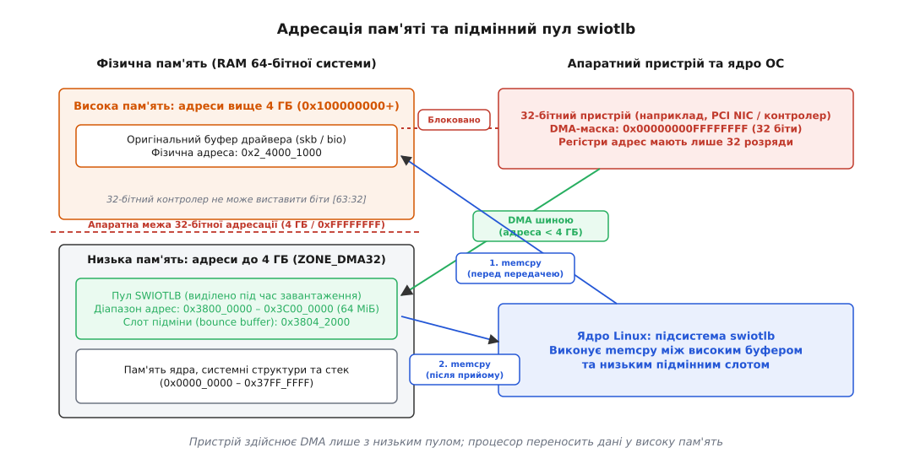
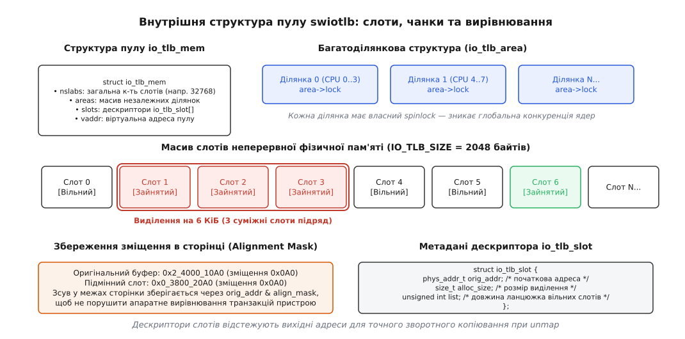
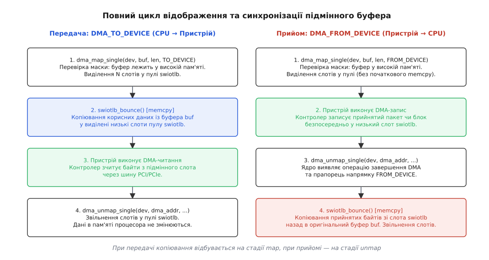
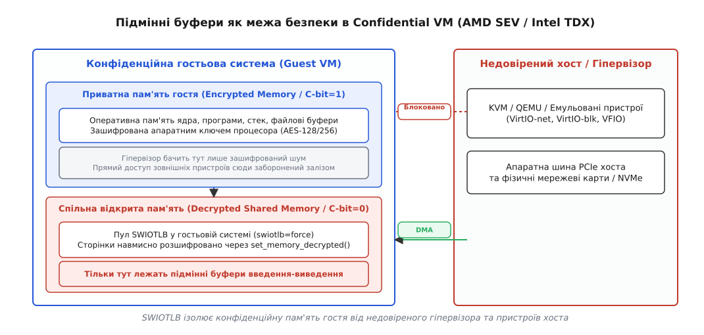

# swiotlb: підмінні буфери, коли пристрій не дотягується

<preknowlist>
- [DMA і відображення буферів у ядрі](topic:sys-unix/dma-and-buffers) — прямий доступ пристроїв до пам'яті, поняття dma_addr_t та життєвий цикл відображення.
- [Сторінкова пам'ять і MMU](topic:sf-os/paging-and-mmu) — віртуальна та фізична адресація, трансляція адрес і зони оперативної пам'яті.
- [IOMMU](topic:hw-arch/iommu) — апаратний блок перекладу адрес для пристроїв введення-виведення на системній шині.
- [Кеш процесора](topic:hw-arch/cache) — ієрархія кеш-пам'яті, рядки кеша та узгодженість при операціях із пам'яттю.
- [Конфіденційні обчислення SEV та TDX](topic:sys-unix/confidential-computing-sev-tdx) — апаратне шифрування оперативної пам'яті гостьових віртуальних машин.
</preknowlist>

Сервер має 64 ГБ оперативної пам'яті, де сторінки для мережевих пакетів, дискового кеша та файлових дескрипторів виділяються операційною системою по всьому фізичному простору — наприклад, за адресою `0x2_4000_1000` (вище 9 ГБ). У системі встановлено 32-бітний мережевий адаптер або контролер збору даних, апаратні регістри якого мають ширину рівно 32 біти. Якщо драйвер спробує безпосередньо передати такому контролеру фізичну адресу буфера, апаратний шинний майстер відкине старші 32 розряди адреси й здійснить запис за числом `0x4000_1000` — безповоротно затерши системні таблиці ядра чи пам'ять іншого процесу.

Коли між шиною та пам'яттю є повноцінний апаратний IOMMU, цю проблему розв'язує залізо: контролер виставляє віртуальну адресу шини (IOVA) з молодшого діапазону, а блок IOMMU на льоту підміняє її справжньою фізичною адресою в DRAM. Але на багатьох системах-на-кристалі, платах без блоків віртуалізації введення-виведення або за вимкненого IOMMU ядро Linux мусить розв'язувати цю задачу самостійно.

Механізмом, який рятує пам'ять від руйнування за відсутності апаратного перекладача, є підсистема Software I/O Translation Lookaside Buffer (swiotlb). Вона створює програмний міст між обмеженими пристроями та великим обсягом оперативної пам'яті за допомогою підмінних буферів (bounce buffers).

## Апаратне обмеження DMA-маски та природа конфлікту

Кожен пристрій на системній шині має апаратну межу кількості адресних ліній, які його контролер прямого доступу до пам'яті здатний виставити під час транзакції. У ядрі Linux ця здатність описується бітовою маскою `dma_mask` у структурі `struct device`:

- 64-бітні пристрої встановлюють маску `DMA_BIT_MASK(64)` (`0xFFFFFFFFFFFFFFFF`), що дозволяє звертатися до будь-якої ділянки фізичного адресного простору.
- 32-бітні контролери мають маску `DMA_BIT_MASK(32)` (`0x00000000FFFFFFFF`), що обмежує їх діапазоном рівно у 4 ГБ.
- Спеціалізовані чи застарілі периферійні мікросхеми (наприклад, звукові кодеки чи контролери шини ISA) можуть мати маску `DMA_BIT_MASK(24)` (16 МБ) чи `DMA_BIT_MASK(28)` (256 МБ).

### Потокове та узгоджене відображення: дві різні маски

Під час ініціалізації драйвер пристрою зазвичай налаштовує дві окремі маски через функції ядра:

```c
/* Встановлення маски для потокових відображень (dma_map_single / dma_map_sg) */
int dma_set_mask(struct device *dev, u64 mask);

/* Встановлення маски для узгоджених буферів (dma_alloc_coherent) */
int dma_set_coherent_mask(struct device *dev, u64 mask);

/* Одночасне налаштування обох масок */
int dma_set_mask_and_coherent(struct device *dev, u64 mask);
```

Різниця між цими масками принципова:

1. `coherent_dma_mask` регулює виділення довгоживучих дескрипторних кілець та керуючих структур через `dma_alloc_coherent()`. Якщо пристрій підтримує лише 32 біти, розподільник сторінок ядра намагається задовольнити запит безпосередньо з зони `ZONE_DMA32` або виділити пам'ять із пулу swiotlb, якщо встановлено прапорець `mem->for_alloc`.
2. `dma_mask` регулює потокові пакети даних (`streaming DMA`), які надходять від користувацьких програм, мережевого стека чи файлової підсистеми.

У 64-бітній операційній системі оперативна пам'ять розбивається на зони. Зона `ZONE_DMA` охоплює перші 16 МБ (для 24-бітних пристроїв), зона `ZONE_DMA32` охоплює простір від 16 МБ до 4 ГБ, а вся решта пам'яті належить зоні `ZONE_NORMAL`.

Коли програма або мережевий стек виділяє пам'ять під буфер передачі, розподільник сторінок ядра (`buddy allocator`) бере вільні сторінки з верхніх зон, оскільки вони складають понад 90% загального обсягу RAM. Буфер отримує фізичну адресу далеко за межею 4 ГБ.

```
+───────────────────────────────────────────────────────────────+
| 0x0000_0000             0xFFFF_FFFF             0x8_0000_0000 |
| [ ZONE_DMA32: 0..4 ГБ ]      |   [ ZONE_NORMAL: 4..32+ ГБ ]   |
| Доступно 32-бітному пристрою |  НЕ досяжно для 32-бітних шин  |
|                              |  (Оригінальний буфер тут)      |
+──────────────────────────────┴────────────────────────────────+
```

Якщо ядро передасть фізичну адресу з зони `ZONE_NORMAL` контролеру, що підтримує лише 32 біти, шинний протокол PCI/PCIe не зможе передати старші біти `[63:32]`. Контролер виставить на шину лише молодші 32 біти, що спричинить доступ до чужої пам'яті в зоні `ZONE_DMA32`.

Змусити всі програми та драйвери виділяти пам'ять виключно з `ZONE_DMA32` неможливо: це миттєво призведе до вичерпання низької пам'яті та паралічу операційної системи. Тому ядро відокремлює фізичне розташування даних від адреси, з якою працює пристрій. Детальний історичний контекст появи цієї проблеми під час переходу з 32-бітних систем на 64-бітні описано в нарисі [історія створення swiotlb на архітектурі AMD64](topic:sys-unix/swiotlb-bounce-buffers/hist-amd64-and-gart.md).

## Концепція підмінного пулу (Software I/O TLB)

Ідея підсистеми swiotlb полягає в попередньому резервуванні неперервної ділянки фізичної пам'яті у низькому адресному просторі (нижче 4 ГБ) під час старту ядра. Ця ділянка називається пулом swiotlb.

Коли драйвер виконує DMA-відображення буфера, ядро перевіряє, чи вкладається його фізична адреса в маску `dev->dma_mask`. Якщо буфер недосяжний:

1. Ядро тимчасово резервує слот відповідного розміру всередині пулу swiotlb у низькій пам'яті.
2. Якщо операція передбачає передачу даних від процесора до пристрою (`DMA_TO_DEVICE`), ядро копіює дані з оригінального високого буфера у виділений низький слот через `memcpy`.
3. Драйвер отримує фізичну адресу низького слота як значення типу `dma_addr_t` і записує її в регістри пристрою.
4. Пристрій виконує прямий доступ до низького слота через шину, не підозрюючи про існування високої пам'яті.
5. Після завершення операції, якщо дані приймалися від пристрою (`DMA_FROM_DEVICE`), ядро копіює отримані байти з низького слота назад в оригінальний високий буфер і звільняє слот.

Цей процес називається підміною буферів (bounce buffering), а проміжний слот — підмінним буфером (bounce buffer).



*Пристрій здійснює DMA лише з низьким пулом; процесор переносить дані у високу пам'ять.*

### Виділення пулу під час завантаження ядра

Пул swiotlb повинен бути абсолютно суцільним у фізичному просторі. Виділити суцільний неперервний блок розміром у десятки мегабайтів після завантаження операційної системи практично неможливо через фрагментацію пам'яті. Тому підсистема swiotlb резервує пам'ять на ранній стадії ініціалізації ядра за допомогою низькорівневого розподільника `memblock` у функції `swiotlb_init()`.

За замовчуванням на більшості 64-бітних систем ядро резервує під swiotlb пул обсягом 64 МіБ. Його розмір можна змінити за допомогою параметра командного рядка ядра:

```text
swiotlb=131072
```

Параметр вказує кількість слотів (slabs). Оскільки базовий розмір одного слота становить 2048 байтів (2 КіБ), значення `131072` виділяє `131072 · 2048 = 268435456` байтів (256 МіБ).

Якщо параметр не задано, ядро обчислює розмір автоматично, виділяючи від 64 МіБ до 512 МіБ залежно від загального обсягу RAM та наявності апаратного IOMMU. Якщо системі бракує низької пам'яті для виділення статичного пулу через `memblock`, ядро пробує виконати пізню ініціалізацію `swiotlb_init_late()` через сторінковий розподільник `alloc_pages_exact()`, але таке виділення може завершитися невдачею через фрагментацію.

## Анатомія пулу: слоти, ділянки та збереження вирівнювання

Внутрішня організація пам'яті swiotlb розроблена так, щоб мінімізувати фрагментацію та забезпечити швидкий пошук вільних блоків безпосередньо в обробниках переривань і softirq.

### Квантування на слоти (IO_TLB_SIZE)

Увесь пул пам'яті розбивається на фіксовані слоти розміром `IO_TLB_SIZE = 2048` байтів (2 КіБ, або `1 << IO_TLB_SHIFT`, де `IO_TLB_SHIFT = 11`). Будь-яке відображення округлюється вгору до цілого числа слотів:

- Запит на відображення 1500 байтів (стандартний Ethernet-кадр) займає 1 слот (2048 байтів).
- Запит на відображення 4096 байтів займає 2 слоти підряд (4096 байтів).
- Запит на 65536 байтів (блоковий ввід-вивід) займає 32 суміжних слоти підряд.

Максимальний розмір неперервного виділення обмежений константою `IO_TLB_SEGSIZE = 128` слотів, що становить `128 · 2048 = 256` КіБ. Запити більшого розміру підсистема swiotlb обслужити не здатна — драйвер повинен розбивати такі передачі за допомогою списків розсіювання-збирання (`scatterlist`).

### Метадані слотів: структура io_tlb_slot

Кожен слот у пулі має відповідний дескриптор `struct io_tlb_slot` у паралельному масиві метаданих:

```c
struct io_tlb_slot {
    phys_addr_t orig_addr;
    size_t alloc_size;
    unsigned int list;
};
```

Поле `orig_addr` зберігає справжню фізичну адресу оригінального буфера у високій пам'яті. Коли пізніше викликається функція завершення `dma_unmap_single()`, ядро бере покажчик на підмінний слот, за його зміщенням у пулі знаходить дескриптор `io_tlb_slot` і дізнається, куди саме слід скопіювати отримані пристроєм байти.

Поле `list` оптимізує пошук вільних блоків: воно містить довжину неперервного ланцюжка вільних слотів попереду. Це дозволяє алгоритму розподілу не перевіряти кожен слот по черзі, а стрибати через зайняті та вільні ділянки за константний час.



*Дескриптори слотів відстежують вихідні адреси для точного зворотного копіювання при unmap.*

### Багатоділянкова архітектура (io_tlb_area)

В історичних версіях ядра Linux увесь пул swiotlb захищався одним глобальним блокуванням спин-блокування (`swiotlb_lock`). На серверах із 64 або 128 процесорними ядрами за інтенсивного мережевого трафіку це блокування ставало вузьким місцем: ядра витрачали до 40% процесорного часу в очікуванні звільнення спин-блокування.

У сучасному ядрі пул розбито на незалежні ділянки (`struct io_tlb_area`), кількість яких зазвичай дорівнює кількості активних процесорів у системі:

```c
struct io_tlb_area {
    spinlock_t lock;
    unsigned long index;
    unsigned int used;
};
```

Коли процесор виконує відображення буфера, він звертається до власної локальної ділянки `areas[smp_processor_id()]` і захоплює лише її локальне блокування `area->lock`. Якщо в локальній ділянці закінчилися вільні слоти, алгоритм перевіряє сусідні ділянки за круговим принципом. Це повністю усунуло конкуренцію процесорних ядер за пам'ять пулу.

### Алгоритм пошуку слотів (swiotlb_area_find_slots)

Коли ділянка виділяє пам'ять, функція `swiotlb_area_find_slots()` реалізує швидкий круговий алгоритм:

1. Пошук починається з індексу `area->index`, що запам'ятовує місце останнього успішного виділення. Це гарантує рівномірне зношування пулу та зменшує локальну фрагментацію.
2. Алгоритм перевіряє значення `slots[i].list`. Якщо значення ненульове, вільний блок пропускається як кандидат, якщо його довжина менша за `nslots`.
3. Коли знайдено послідовність достатньої довжини, індекси слотів позначаються як зайняті (`list = 0`), а `area->index` зсувається на кінець виділеного діапазону.
4. При звільненні слотів у `swiotlb_tbl_unmap_single()` алгоритм перевіряє сусідні слоти ліворуч і праворуч: якщо вони вільні, окремі інтервали зливаються в один довший ланцюжок `list`, запобігаючи деградації пулу на дрібні ізольовані фрагменти.

### Збереження вирівнювання та маска dma_min_align_mask

Багато апаратних контролерів вимагають суворого вирівнювання адрес для транзакцій DMA. Наприклад, NVMe-контролер або мережевий адаптер із підтримкою черг дескрипторів може вимагати, щоб початкова адреса буфера була вирівняна за межею 64 байтів або щоб молодші біти адреси (зміщення всередині 4-кілобайтної сторінки) залишалися незмінними.

Якщо вихідний буфер починався за адресою `0x2_4000_10A0` (зсув `0x0A0` всередині сторінки), виділений підмінний слот не може починатися за адресою `0x0_3800_2000` із нульовим зсувом: пристрій виявить порушення протоколу або прочитає дані з неправильним зміщенням.

Підсистема swiotlb вирішує це через врахування маски вирівнювання:

```c
unsigned long align_mask = dev->dma_min_align_mask | (1 << IO_TLB_SHIFT) - 1;
```

Алгоритм виділення знаходить слот, молодші біти фізичної адреси якого точно збігаються з `orig_addr & align_mask`. Корисні дані копіюються в слот із тим самим зміщенням, що гарантує збереження всіх апаратних вимог пристрою до вирівнювання.

## Життєвий цикл підмінного буфера: від map до unmap

Розгляньмо покроковий шлях, який проходять дані та покажчики під час виконання операції DMA з використанням підмінного пулу.

Драйвер пристрою взаємодіє зі стандартним DMA API ядра й не знає, чи задіяна підсистема swiotlb:

```c
dma_addr_t da = dma_map_single(dev, buf, len, DMA_TO_DEVICE);
if (dma_mapping_error(dev, da))
    return -EIO;
```



*При передачі копіювання відбувається на стадії map, при прийомі — на стадії unmap.*

### Крок 1: Перевірка адреси та виклик swiotlb_tbl_map_single

Виклик `dma_map_single()` передає запит рівню прямого відображення `dma-direct`. Ядро обчислює фізичну адресу буфера `paddr = virt_to_phys(buf)` і викликає предикат перевірки:

```c
if (!dma_capable(dev, paddr, len)) {
    /* Буфер лежить вище адресної маски пристрою — потрібна підміна */
    paddr = swiotlb_tbl_map_single(dev, paddr, len, alloc_size,
                                   align_mask, dir, attrs);
}
```

Функція `swiotlb_tbl_map_single()` виконує такі дії:

1. Обчислює необхідну кількість слотів: `nslots = DIV_ROUND_UP(alloc_size, IO_TLB_SIZE)`.
2. Захоплює блокування локальної ділянки `spin_lock_irqsave(&area->lock, flags)`.
3. Знаходить суміжний діапазон слотів із правильним бітовим вирівнюванням.
4. Записує в дескриптор `io_tlb_slot` адресу `orig_addr = paddr` та довжину `alloc_size`.
5. Збільшує системні лічильники зайнятих слотів (`area->used`, `io_tlb_used`).
6. Звільняє блокування ділянки.

### Крок 2: Початкове копіювання (DMA_TO_DEVICE)

Якщо напрямок передачі визначено як `DMA_TO_DEVICE` або `DMA_BIDIRECTIONAL`, ядро негайно викликає функцію `swiotlb_bounce()`:

```c
static void swiotlb_bounce(struct device *dev, phys_addr_t orig_addr,
                           phys_addr_t tlb_addr, size_t size,
                           enum dma_data_direction dir)
{
    void *vorg = phys_to_virt(orig_addr);
    void *vtlb = phys_to_virt(tlb_addr);

    if (dir == DMA_TO_DEVICE || dir == DMA_BIDIRECTIONAL)
        memcpy(vtlb, vorg, size);
    else
        memcpy(vorg, vtlb, size);
}
```

Процесор копіює корисні байти з пам'яті програми у виділений низький слот. Після цього фізична адреса слота повертається драйверу як `dma_addr_t`.

Якщо ж напрямок передачі — `DMA_FROM_DEVICE` (прийом даних від пристрою), початкове копіювання пропускається, оскільки слот поки що не містить корисних даних: пристрій заповнить його сам.

### Крок 3: Виконання передачі апаратним пристроєм

Драйвер записує отримане значення `dma_addr_t` у дескрипторне кільце пристрою й дає команду на старт.

Апаратний контролер ініціює транзакції на шині PCI/PCIe. Оскільки адреса належить пулу swiotlb (нижче 4 ГБ), 32-розрядних адресних ліній контролера вистачає для доступу. Дані зчитуються зі слота або записуються безпосередньо в слот.

### Крок 4: Проміжна синхронізація без розбирання відображення

Якщо драйвер використовує один і той самий буфер багатократно в кільці дескрипторів, йому потрібно читати нові порції даних або оновлювати заголовок без повного розбирання DMA-відображення. Для цього слугують функції синхронізації:

```c
dma_sync_single_for_cpu(dev, da, len, DMA_FROM_DEVICE);
/* Драйвер читає отримані дані */
dma_sync_single_for_device(dev, da, len, DMA_FROM_DEVICE);
```

У разі прямого DMA ці виклики лише знецінюють чи скидають кеші процесора. Проте для підмінного буфера swiotlb синхронізація означає виклик функції `swiotlb_tbl_sync_single()`:

- `dma_sync_single_for_cpu()` виконує `memcpy(vorg, vtlb, size)` — переносить свіжі байти, щойно записані пристроєм у слот, назад в оригінальний буфер драйвера.
- `dma_sync_single_for_device()` виконує `memcpy(vtlb, vorg, size)` — якщо драйвер змінив буфер, зміни копіюються в підмінний слот перед тим, як пристрій прочитає їх знову.

### Особливості некогерентних архітектур (ARM / RISC-V)

На апаратних платформах без автоматичного відстеження когерентності кеша шиною (багато процесорів ARM64 та RISC-V) порядок дій під час синхронізації стає ще суворішим. Ядро мусить не лише скопіювати дані, а й виконати скидання або знецінення ліній кеша у правильній послідовності:

1. При передачі `DMA_TO_DEVICE`: спочатку виконується `memcpy` з вихідного буфера в підмінний слот swiotlb, а потім кеш-лінії підмінного слота примусово скидаються в DRAM операцією `dma_cache_clean()`.
2. При прийомі `DMA_FROM_DEVICE`: спочатку ядро знецінює кеш-лінії підмінного слота операцією `dma_cache_invalidate()`, щоб процесор не прочитав сміття з L1/L2, і лише після цього виконує `memcpy` зі слота в оригінальний буфер.

Порушення цієї послідовності призводить до мовчазного пошкодження даних, коли кеш скидає старі дані поверх щойно скопійованих.

### Крок 5: Завершення передачі та звільнення слотів (dma_unmap_single)

Коли передачу завершено, обробник переривання викликає деструктор відображення:

```c
dma_unmap_single(dev, da, len, DMA_FROM_DEVICE);
```

Ядро перевіряє адресу за допомогою предиката `is_swiotlb_buffer(dev, paddr)`. Якщо адреса належить пулу swiotlb:

1. За фізичною адресою слота знаходиться дескриптор `struct io_tlb_slot`.
2. Якщо операція була `DMA_FROM_DEVICE` або `DMA_BIDIRECTIONAL`, виконується фінальне копіювання: `memcpy(orig_addr, tlb_addr, size)`. Тепер програма чи мережевий стек бачать свіжі дані у своєму оригінальному буфері.
3. Захоплюється блокування `area->lock`, слоти повертаються у список вільних, відновлюються ланцюжки `list` і зменшується лічильник `io_tlb_used`.

## Часткова підміна у списках розсіювання-збирання (dma_map_sg)

У реальних підсистемах вводу-виводу (блоковий стек, передача великих мережевих пакетів із підтримкою jumbo frames) драйвери рідко оперують одиничними неперервними буферами. Натомість використовується структура `struct scatterlist`, яка описує масив розрізнених сторінок пам'яті.

Коли драйвер викликає функцію відображення списку:

```c
int count = dma_map_sg(dev, sg, nents, DMA_FROM_DEVICE);
```

Ядро обходить кожен елемент списку індивідуально. Тут проявляється важлива властивість swiotlb — **селективна підміна**:

- Якщо елемент списку `sg[i]` фізично розташований у зоні `ZONE_DMA32` (нижче 4 ГБ), ядро призначає йому пряме відображення без виділення слотів swiotlb і без копіювання `memcpy`.
- Якщо сусідній елемент `sg[i+1]` виділено з зони `ZONE_NORMAL` (вище 4 ГБ), підсистема swiotlb виділяє підмінний буфер лише для цього конкретного сегмента.

Це дозволяє уникнути тотального падіння продуктивності: копіюються лише ті частини складеного буфера, які пристрій фізично не здатен адресувати через апаратні обмеження шини.

## Ціна підміни: накладні витрати пам'яті, кешу та процесора

Хоча підсистема swiotlb забезпечує прозору роботу 32-бітних пристроїв на 64-бітних платформах, вона створює суттєві накладні витрати на швидкодію всієї системи.

### Прямий DMA проти підмінного буфера

У прямому DMA передача даних між периферійним пристроєм і оперативною пам'яттю виконується контролером шини повністю асинхронно та без участі процесора. Процесор витрачає лише кілька десятків тактів на налаштування дескриптора.

Коли задіюється swiotlb, операція DMA перетворюється на гібридний процес:

1. Апаратна передача через шину контролером DMA.
2. Програмне синхронне переписування пам'яті функцією `memcpy` на ядрах центрального процесора.

Порахуймо накладні витрати для мережевого адаптера 10 Гбіт/с, що працює з повною швидкістю інтерфейсу (line rate):

```text
розмір пакета                   = 1514 байтів
інтенсивність трафіку           = 812 743 пакетів/с (10 Гбіт/с)
обсяг копіювання memcpy         = 812 743 · 1514 байтів ≈ 1.23 ГБ/с
швидкість memcpy одного ядра    ≈ 6.0 ГБ/с
навантаження на CPU             = 1.23 / 6.0 ≈ 20.5% одного процесорного ядра
```

Двадцять відсотків процесорного ядра витрачається виключно на дублювання байтів у пам'яті. Крім того, операція `memcpy` інтенсивно завантажує кеші процесора L1/L2/L3, витісняючи з них робочі дані застосунків.

Для дискових NVMe-накопичувачів або RAID-контролерів зі швидкістю понад 5 ГБ/с навантаження на шину пам'яті зростає пропорційно, що призводить до падіння загальної пропускної здатності системи та зростання затримок (I/O latency).

### Переповнення пулу та помилка DMA_MAPPING_ERROR

Пул swiotlb має фіксований розмір (за замовчуванням 64 МіБ). Якщо велика кількість потоків або високошвидкісні черги дисків генерують сотні тисяч одночасних запитів, пул може вичерпатися.

Коли вільних слотів немає, функція `swiotlb_tbl_map_single()` повертає спеціальне значення `DMA_MAPPING_ERROR` (`~0ULL`).

Драйвер зобов'язаний перевіряти результат через макрос `dma_mapping_error()`:

```c
if (dma_mapping_error(dev, da)) {
    /* Пул переповнено: відхилити пакет або повернути запит у чергу */
    dev_kfree_skb(skb);
    dev->stats.tx_dropped++;
    return NETDEV_TX_BUSY;
}
```

Якщо ядро зібрано без прапорця `DMA_ATTR_NO_WARN`, у системний журнал `dmesg` виводиться тривожне повідомлення:

```text
dma_direct_map_page: swiotlb buffer is full (sz: 65536 bytes, total: 32768, used: 32768)
```

Переповнення пулу призводить до втрати мережевих пакетів, таймаутів дискових команд `SCSI/NVMe command timeout` та аварійного переведення файлових систем у режим «тільки для читання».

## Безпека та конфіденційні обчислення (AMD SEV / Intel TDX)

У 2020-х роках підсистема swiotlb отримала друге дихання в контексті апаратних технологій конфіденційних обчислень (Confidential Computing) — AMD SEV (Secure Encrypted Virtualization), AMD SEV-SNP, Intel TDX (Trust Domain Extensions) та ARM CCA (Confidential Compute Architecture).

### Проблема недовіреного гіпервізора та ізоляція пам'яті

У моделі конфіденційної віртуалізації гостьова операційна система (Guest VM) не довіряє гіпервізору хоста (KVM, QEMU). Вся оперативна пам'ять гостьової системи шифрується апаратним криптографічним рушієм у контролері пам'яті процесора за допомогою ключів, недоступних хосту (біт шифрування C-bit в таблицях сторінок AMD SEV або KeyID в Intel TDX).

Якщо гіпервізор або емульований пристрій хоста (наприклад, віртуальний мережевий адаптер VirtIO-net чи блоковий пристрій VirtIO-blk) спробує виконати DMA-читання зашифрованої сторінки гостя, він прочитає лише випадковий зашифрований шум. Якщо ж гіпервізор запише байти у зашифровану сторінку, апаратний контроль цілісності SEV-SNP/TDX зафіксує збій апаратної перевірки автентичності та аварійно зупинить гостьову систему.



*SWIOTLB ізолює конфіденційну пам'ять гостя від недовіреного гіпервізора та пристроїв хоста.*

### Розв'язання: примусовий swiotlb у спільній незашифрованій пам'яті

Щоб гостьова система могла взаємодіяти з віртуальними пристроями хоста, частина сторінок пам'яті повинна бути явно відкрита (shared/decrypted).

Ядро Linux у конфіденційній гостьовій системі реалізує цей захист за допомогою swiotlb:

1. Під час завантаження гостьове ядро виявляє режим SEV/TDX і автоматично активує прапорець примусової підміни: `swiotlb=force`.
2. Пам'ять пулу swiotlb виділяється гостем і явно позначається як розшифрована/спільна за допомогою системного виклику гіпервізора та очищення C-bit у сторінкових таблицях: `set_memory_decrypted()`.
3. Усі внутрішні буфери програм, стек, ядро та кеші файлової системи залишаються в зашифрованій приватній пам'яті (Private Encrypted Memory).
4. Будь-який DMA-обмін із пристроями VirtIO примусово проходить через розшифрований пул swiotlb. Гостьове ядро самостійно копіює корисні дані між зашифрованою пам'яттю та відкритими слотами swiotlb.

У цій архітектурі swiotlb стає апаратним шлюзом безпеки: навіть скомпрометований гіпервізор хоста має доступ виключно до відкритого пулу підмінних буферів і не здатний прочитати жодного байта з приватної пам'яті гостя.

### Динамічний swiotlb (Dynamic SWIOTLB у Linux 6.6+)

У конфіденційних віртуальних машинах через режим `swiotlb=force` підміні підлягають 100% усіх операцій введення-виведення (а не лише звернення застарілих 32-бітних контролерів). Це призводило до швидкого вичерпання стандартного 64-мегабайтного пулу під навантаженням.

Починаючи з версії Linux 6.6, ядро підтримує механізм динамічного розширення пулу (`CONFIG_SWIOTLB_DYNAMIC=y`). Якщо утилізація слотів перевищує критичний поріг, фоновий обробник ядра динамічно виділяє додаткові пули пам'яті через сторінковий розподільник, переводить їх у розшифрований стан і підключає до списку активних областей `mem->pools`. Після спаду навантаження надлишкові динамічні пули автоматично повертаються до загальної пам'яті гостя.

## Діагностика, спостережуваність і налаштування

Для моніторингу працездатності та оптимізації розміру пулу swiotlb ядро Linux надає набір інтерфейсів у файловій системі `debugfs` та підсистемі трасування `ftrace`.

### Діагностичні метрики в /sys/kernel/debug/swiotlb/

Якщо файлову систему debugfs змонтовано, стан пулу доступний у каталозі `/sys/kernel/debug/swiotlb/`:

```bash
# Перегляд загальної кількості слотів
cat /sys/kernel/debug/swiotlb/io_tlb_nslabs

# Перегляд кількості зайнятих слотів прямо зараз
cat /sys/kernel/debug/swiotlb/io_tlb_used

# Перегляд пікового значення використання
cat /sys/kernel/debug/swiotlb/io_tlb_used_highwater

# Перевірка кількості переповнень пулу
cat /sys/kernel/debug/swiotlb/io_tlb_overflow
```

Аналіз цих метрик дозволяє точно розрахувати необхідний розмір пулу:

- Якщо `io_tlb_overflow > 0`, розмір пулу недостатній, і система втрачає дані. Необхідно збільшити параметр `swiotlb=N`.
- Якщо `io_tlb_used_highwater` становить менше 10% від `io_tlb_nslabs`, пул надмірно великий і марно займає пам'ять низької зони.
- Запис числа `0` у файл `io_tlb_used_highwater` скидає пікове значення, що дозволяє виміряти навантаження під час конкретного тесту.

Детальний приклад створення програм моніторингу та фонового демона журналювання мовами C та C++ наведено у практичному матеріалі [моніторинг активності swiotlb та діагностика переповнення пулу](topic:sys-unix/swiotlb-bounce-buffers/proj-detect-and-monitor.md).

### Точки трасування ядра (swiotlb:swiotlb_bounced)

Для виявлення конкретних пристроїв, які створюють навантаження на підсистему копіювання, використовується подія ftrace `swiotlb_bounced`:

```bash
echo 1 > /sys/kernel/tracing/events/swiotlb/swiotlb_bounced/enable
cat /sys/kernel/tracing/trace_pipe
```

Вивід фіксує ідентифікатор пристрою на шині PCI (`dev_name`), фізичну адресу виділеного слота (`dev_addr`), корисний розмір (`size`) та фактично виділений обсяг із урахуванням вирівнювання (`alloc_size`).

Повний опис усіх внутрішніх функцій ядра, прапорців конфігурації та параметрів командного рядка зібрано в документі [внутрішній інтерфейс ядра swiotlb та параметри завантаження](topic:sys-unix/swiotlb-bounce-buffers/api-swiotlb-internals.md).

## Висновки та правила проектування

Підсистема Software I/O TLB є життєво необхідним компромісом між універсальністю апаратного забезпечення та продуктивністю. Робота з нею підпорядковується чітким правилам проектування систем:

1. **Пріоритет апаратного IOMMU.** На звичайних серверах та робочих станціях апаратний IOMMU (Intel VT-d, AMD-Vi) завжди має бути увімкнений у BIOS/UEFI. Апаратний переклад адрес усуває необхідність у копіюванні пам'яті через swiotlb і повертає системі повну пропускну здатність шини.
2. **Обов'язкова перевірка dma_mapping_error.** Розробник драйвера ніколи не повинен припускати, що виклик `dma_map_single()` або `dma_map_sg()` гарантовано завершиться успішно. Обробка помилки відображення — єдиний спосіб уникнути паніки ядра за переповнення пулу.
3. **Моніторинг у конфіденційних середовищах.** У захищених віртуальних машинах AMD SEV / Intel TDX підсистема swiotlb працює в режимі 100% навантаження. Розмір пулу слід калібрувати з урахуванням пікового мережевого та дискового трафіку або використовувати ядра з підтримкою динамічного пулу `CONFIG_SWIOTLB_DYNAMIC`.
