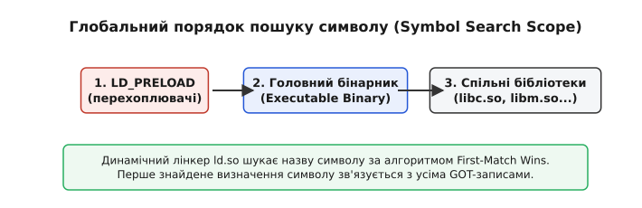
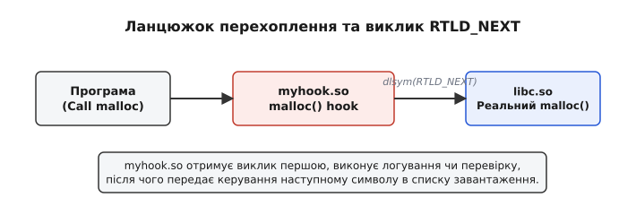

# Розв'язання символів і перекриття (interposition)

<preknowlist>
- [Статичне та динамічне компонування](root:sys-unix/static-and-dynamic-linking) — відмінності між зв'язуванням під час збірки та під час виконання.
- [Структура ELF-файлу](root:sys-unix/elf-structure) — розділення коду, даних та секцій `.symtab` і `.dynsym`.
- [Таблиці PLT та GOT](root:sys-unix/plt-and-got) — механізм опосередкованих викликів для позиційно-незалежного коду.
</preknowlist>

Коли транслятор компілює вихідний файл у машинний код, він перетворює виклики зовнішніх функцій на порожні адреси-заповнювачі у зміщеннях команд `call` або `jmp`. Якщо згенерувати об'єктні файли для великого проєкту й спробувати завантажити їх прямо в пам'яті процесора, виконання миттєво аварійно зупиниться за помилкою `SIGSEGV` на першій же інструкції з нульовим адресом. Щоб зв'язати ці ізольовані символьні текстові назви з реальною пам'яттю, компонувальник формує єдиний простір імен та обчислює фактичні віртуальні адреси кожного виклику.

Цей процес перетворення текстових імен функцій і змінних у фізичні чи віртуальні адреси пам'яті називається **розв'язанням символів** (англ. *symbol resolution*). В операційних системах Unix та Linux розв'язання відбувається на двох принципово різних етапах: під час статичної збірки бінарного файлу компонувальником `ld` та під час завантаження й виконання програми динамічним лінкером `ld.so`.

Розуміння того, як саме працюють правила розв'язання символів, дозволяє розробникам системного програмного забезпечення будувати модульні архітектури, розробляти плагіни, оптимізовувати час завантаження shared-бібліотек, а також перехоплювати будь-які системні виклики через механізм Symbol Interposition.

## 1. Таблиці символів у форматі ELF

У стандарті ELF (англ. *Executable and Linkable Format*, від грецького *єпи* — поверховий зв'язок та латинського *formatum* — утворений) простір символів відокремлений від безпосереднього машинного коду. Компілятор записує метадані про всі доступні та запитувані функції у спеціальні структури даних.

Кожен символ у ELF-файлі описується фіксованою структурою `Elf64_Sym` (або `Elf32_Sym` для 32-бітних архітектур). Ця структура містить індекс імені у текстовій таблиці рядків `.strtab`, віртуальну адресу в пам'яті, розмір об'єкта, а також бітові поля типу, зв'язування (binding) та видимості (visibility).

:::tabs
```c
typedef struct {
    Elf64_Word    st_name;      /* Зміщення імені в секції .strtab */
    unsigned char st_info;      /* Тип символу та його зв'язування (STB_*) */
    unsigned char st_other;     /* Видимість символу (STV_*) */
    Elf64_Section st_shndx;     /* Індекс секції, де визначено символ */
    Elf64_Addr    st_value;     /* Віртуальна адреса або зміщення */
    Elf64_Xword   st_size;      /* Розмір об'єкта в байтах */
} Elf64_Sym;
```
```cpp
// Опис структури Elf64_Sym у системному заголовку <elf.h>
struct Elf64_Sym {
    Elf64_Word    st_name;      // Зміщення імені в секції .strtab
    unsigned char st_info;      // Тип символу та його зв'язування (STB_*)
    unsigned char st_other;     // Видимість символу (STV_*)
    Elf64_Section st_shndx;     // Індекс секції, де визначено символ
    Elf64_Addr    st_value;     // Віртуальна адреса або зміщення
    Elf64_Xword   st_size;      // Розмір об'єкта в байтах
};
```
:::

В ELF-об'єктах існують дві окремі таблиці символів, кожна з яких виконує свою роль у життєвому циклі програми:
- **Секція `.symtab`:** Повна таблиця символів. Вона містить геть усі оголошення, включно з локальними змінними, функціями `static`, назвами вихідних файлів та службовими мітками компілятора. Вона необхідна для статичного лінкування та відлагодження (gdb), але не завантажується в оперативну пам'ять під час виконання програми. Команди `strip` видаляють саме цю секцію для зменшення розміру бінарника на диску.
- **Секція `.dynsym`:** Динамічна таблиця символів. Вона містить виключно ті символи, які перетинають межу даного ELF-модуля (імпортовані та експортовані функції й змінні). Секція `.dynsym` позначається прапорцем `SHF_ALLOC`, завантажується у віртуальну пам'ять процесу і залишається доступною динамічному лінкеру `ld.so` упродовж всього життєвого циклу програми.

Для аналізу вмісту динамічної та повної таблиць символів у командному рядку використовуються системні утиліти `readelf -s` або `nm -D`. Поле `st_info` розбивається макросами `ELF64_ST_BIND(st_info)` для отримання типу зв'язування та `ELF64_ST_TYPE(st_info)` для отримання типу об'єкта (функція `STT_FUNC`, об'єкт даних `STT_OBJECT` або секція `STT_SECTION`).

## 2. Типи зв'язування та видимість символів

Кожен символ володіє двома ключовими характеристиками у форматі ELF: тип зв'язування (symbol binding) та рівень видимості (symbol visibility).

### 2.1 Зв'язування символів (Symbol Binding)
Тип зв'язування кодується у верхньому ніблі поля `st_info` і визначає пріоритетність та рівень доступності символу при об'єднанні модулів:

1. **Локальні символи (`STB_LOCAL`):** Обмежені межами поточного об'єктного `.o` файлу. Зазвичай виникають при використанні ключового слова `static` у C/C++. Вони не потрапляють до динамічної таблиці `.dynsym`, а компонувальник приховує їх від інших модулів. Двоє різних `.o` файлів можуть мати локальні символи з однаковими іменами без виникнення колізій чи помилок збірки.
2. **Глобальні символи (`STB_GLOBAL`):** Видимі для всіх об'єктних файлів та спільних бібліотек. Якщо у двох різних модулях визначено сильний глобальний символ з однаковим іменем, статичний компонувальник перериває роботу з помилкою *multiple definition*.
3. **Слабкі символи (`STB_WEAK`):** Спеціальний тип глобальних символів з нижчим пріоритетом. Створюються компілятором для неініціалізованих глобальних даних або за допомогою атрибута `__attribute__((weak))`. Слабкий символ може бути мовчки перекритий сильним символом з таким самим ім'ям без видачі помилок компонування.

### 2.2 Видимість символів (Symbol Visibility)
Поле `st_other` визначає, як символ поводиться при динамічному компонуванні під час запуску програми:

- `STV_DEFAULT`: За замовчуванням. Символ експортується у `.dynsym`, видимий для зовнішніх модулів і може бути перекритий (interposed) за допомогою `LD_PRELOAD`.
- `STV_HIDDEN`: Символ не експортується у `.dynsym`. Зсередини DSO виклики до нього компілюються через пряму відносну адресацію інструкцій (PC-relative), оминаючи таблиці GOT/PLT. Це значно прискорює виклики, зменшує кількість релокацій та знижує навантаження на динамічний лінкер.
- `STV_PROTECTED`: Символ експортується у `.dynsym` і видимий для інших модулів, але виклики зсередини самого модуля **завжди** прив'язуються до локального визначення, ігноруючи зовнішнє перекриття через `LD_PRELOAD`.

## 3. Статичне розв'язання символів компонувальником (Link-time Resolution)

Під час статичної збірки виконуваного файлу компонувальник `ld` отримує на вхід набір об'єктних файлів (`.o`) та статичних архівних бібліотек (`.a`). Його головне завдання — переконатися, що для кожного виклику функції або звернення до змінної існує рівно один правильний адрес визначення.

Для розв'язання усіх посилань `ld` підтримує три внутрішні множини протягом процесу збірки:
- **Множина `E` (Executables/Objects):** Множина об'єктних файлів, які будуть об'єднані у підсумковий виконуваний бінарник.
- **Множина `U` (Undefined):** Множина неконкретизованих символів, які були використані в коді (наприклад, у викликах `call`), але їхні визначення ще не знайдені в оброблених файлах.
- **Множина `D` (Defined):** Множина символів, визначених у вже оброблених файлах із множини `E`.

На початку роботи компонувальника всі три множини порожні. Потім `ld` послідовно читає файли, передані у командному рядку.

### Правила вирішення колізій імен (Symbol Resolution Rules)
Коли `ld` зустрічає нове визначення глобального символу, який вже присутній у множині `D`, застосовуються три суворі правила resolution:

1. **Правило 1 (Сильний проти сильного):** Двоє сильних символів (`STB_GLOBAL`) з однаковим ім'ям викликають критичну помилку лінкування:
   `error: redefinition of 'foo'`.
2. **Правило 2 (Сильний проти слабкого):** Якщо один символ сильний, а інші слабкі (`STB_WEAK`), компонувальник мовчки обирає сильне визначення. Усі неконкретизовані виклики спрямовуються на сильний символ, а слабкі визначення відкидаються.
3. **Правило 3 (Слабкий проти слабкого):** Якщо присутні лише слабкі символи, компонувальник обирає будь-яке перше згенероване визначення (або об'єднує їхній простір пам'яті, якщо це `COMMON`-блоки неініціалізованих змінних).

> 🔧 **Навіщо це.** Механізм слабких символів є основою для побудови плагінних архітектур та системних бібліотек. Наприклад, C-бібліотека може визначити слабку функцію-заглушку `pthread_mutex_lock`, яка нічого не робить у однопотоковій програмі. Коли програма лінкується з `-lpthread`, сильне визначення з бібліотеки POSIX threads автоматично підміняє заглушку без потреби перекомпілювати базовий код.

### Порядок аргументів у командному рядку та робота з архівами .a
Важливою практичною особливістю статичного компонувальника є його лінійний однопрохідний алгоритм обробки архівних бібліотек (`.a`).

Статична бібліотека `.a` є простим архивом (ar-файлом), у якому упаковано безліч окремих `.o` файлів. Коли `ld` зустрічає файл `.a`, він переглядає лише ті об'єктні файли всередині архіву, які містять визначення символів, що **наразі перебувають у множині `U`**. Решта об'єктних файлів з архіву просто ігнорується і не потрапляє у підсумковий бінарник.

Якщо утиліта `main.o` викликає функцію `helper()`, яка лежить у `libhelper.a`, то порядок передачі файлів комбілятору GCC має вирішальне значення:

```bash
# Правильно: спочатку споживач, потім постачальник
gcc main.o libhelper.a -o app

# Помилка: undefined reference to 'helper'
gcc libhelper.a main.o -o app
```

У другому випадку, коли `ld` читає `libhelper.a`, множина неконкретизованих символів `U` ще порожня, оскільки `main.o` ще не оброблено. Компоновальник відкидає всі об'єкти з архіву як непотрібні. Наступним завантажується `main.o`, який додає `helper` до `U`, але обробка архіву `libhelper.a` вже завершилася. Лінкер завершує роботу з помилкою незв'язаного символу.

Для вирішення зациклених залежностей між архівами використовують прапорці групування `-Wl,--start-group` та `-Wl,--end-group`, які примушують `ld` циклічно повторювати пошук у вказаних архівах до повного вичерпання множини `U`.

Детальний аналіз еволюції лінкерів від форматів 1970-х років до сучасних алгоритмів ELF наведено у матеріалі [📜 Історія розв'язання символів та виникнення ELF interposition](root:sys-unix/symbol-resolution/hist-symbol-interposition.md).

## 4. Динамічне розв'язання під час виконання (Run-time Resolution)

У разі динамічного компонування розв'язання символів відкладається до моменту запуску програми через виклик `execve`. Ядро завантажує бінарний файл, зчитує секцію `.interp`, де вказано шлях до динамічного завантажувача (наприклад, `/lib64/ld-linux-x86-64.so.2`), та передає йому керування.


*Порядок перевірки таблиць символів динамічним завантажувачем ld.so при використанні LD_PRELOAD.*

Динамічний лінкер будує в пам'яті лінійний список пошуку символів (англ. *global search scope*). Порядок обходу таблиць `.dynsym` усіх завантажених об'єктів строго визначений:

1. **Завантажені прелоад-бібліотеки:** Усі `.so` файли, передані через змінну середовища `LD_PRELOAD` або вказані у системному конфігу `/etc/ld.so.preload`.
2. **Головний виконуваний бінарник:** Символи самого ELF-виконуваного файлу (якщо вони винесені у `.dynsym` через прапорець `-rdynamic`).
3. **Спільні бібліотеки у порядку залежностей:** Обхід у ширину (BFS, Breadth-First Search) для всіх `.so` згідно із секціями `DT_NEEDED`.

### Алгоритм First-Match Wins
Під час вирішення адреси імпортованого символу (наприклад, `malloc`) `ld.so` послідовно сканує `.dynsym` секції кожного об'єкта зі списку search scope. **Перше знайдене визначення вважається остаточним**, а всі інші однойменні символи у пізніших бібліотеках ігноруються.

Цей принцип лежить в основі механізму **Symbol Interposition** (перекриття символів).

### Ліниве зв'язування (Lazy Binding) та таблиці PLT/GOT
Для прискорення запуску великих програм динамічний лінкер за замовчуванням не розв'язує адреси усіх функцій одразу під час старту. Замість цього використовується ліниве зв'язування (Lazy Binding):

1. При першому виклику функції (наприклад, `printf`) виконання передається на відповідну комірку таблиці PLT (Procedure Linkage Table).
2. Трамплін PLT звертається до відповідного елемента у таблиці GOT (Global Offset Table), який спочатку вказує назад у код PLT.
3. Виконується код вирішувача динамічного лінкера `_dl_runtime_resolve`.
4. Дінкер шукає символ у global search scope, знаходить його реальну віртуальну адресу та записує її прямо у відповідне осереддя GOT.
5. Усі наступні виклики `printf` через PLT передають керування на реальну адресу функції за один перехід через GOT без участі лінкера.

Якщо встановити змінну середовища `LD_BIND_NOW=1`, динамічний лінкер розв'яже абсолютно всі символи в момент завантаження програми, вимикаючи ліниве зв'язування.

## 5. Механізми перекриття символів (Symbol Interposition)

Перекриття символів дозволяє розробникові або системному адміністратору підмінити реалізацію будь-якої динамічної функції на власну без перекомпіляції програми.

Існують три основні способи реалізації interposition:

### 5.1 Load-time Interposition (LD_PRELOAD)
Змінна середовища `LD_PRELOAD` змушує динамічний лінкер ставити зазначену бібліотеку на самий початок global search scope.

Якщо створити власну бібліотеку `myhook.so`, яка експортує функцію `write(int fd, const void *buf, size_t count)`, `ld.so` спрямує всі виклики системної функції `write` з усіх бібліотек процесу до вашого коду.

### 5.2 Link-time Interposition (--wrap)
Прапорець GNU-лінкера `--wrap=symbol` дозволяє підмінити виклики на етапі збірки.

Якщо передати `gcc -Wl,--wrap,malloc`:
- Усі неконкретизовані виклики `malloc` перейменовуються лінкером у виклики `__wrap_malloc`.
- Усі виклики `__real_malloc` у коді перенаправляються на оригінальний `malloc` з `libc.so`.

:::tabs
```c
#include <stdio.h>
#include <stdlib.h>

void *__real_malloc(size_t size);

/* Перехоплювач на етапі компонування */
void *__wrap_malloc(size_t size) {
    printf("[link-time wrap] malloc(%zu)\n", size);
    return __real_malloc(size);
}
```
```cpp
#include <iostream>
#include <cstdlib>

extern "C" {
    void* __real_malloc(std::size_t size);
    
    /* Перехоплювач на етапі компонування у C++ */
    void* __wrap_malloc(std::size_t size) noexcept {
        std::cerr << "[link-time wrap] malloc(" << size << ")\n";
        return __real_malloc(size);
    }
}
```
:::

### 5.3 Run-time Hooking (dlsym та RTLD_NEXT)
При використанні `LD_PRELOAD` перехоплювач часто повинен виконати власну перевірку або логування, а потім передати керування оригінальній системній функції.

Прямий виклик `malloc()` з власного перехоплювача призведе до нескінченної рекурсії. Для знаходження оригінальної адреси використовується функція `dlsym` із псевдо-дескриптором `RTLD_NEXT`.


*Ланцюжок викликів при перекритті функції malloc користувацькою бібліотекою.*

Макрос `RTLD_NEXT` вказує лінкеру шукати символ `malloc`, починаючи з об'єкта, що лежить у списку завантаження **після** поточного DSO:

:::tabs
```c
#define _GNU_SOURCE
#include <stdio.h>
#include <dlfcn.h>

void *malloc(size_t size) {
    static void *(*real_malloc)(size_t) = NULL;
    if (!real_malloc) {
        real_malloc = dlsym(RTLD_NEXT, "malloc");
    }
    /* Виклик оригінальної функції з libc */
    return real_malloc(size);
}
```
```cpp
#define _GNU_SOURCE
#include <iostream>
#include <dlfcn.h>
#include <cstddef>

extern "C" void* malloc(std::size_t size) noexcept {
    using MallocFn = void* (*)(std::size_t);
    static MallocFn real_malloc = reinterpret_cast<MallocFn>(dlsym(RTLD_NEXT, "malloc"));
    
    /* Виклик оригінальної функції з libc */
    return real_malloc(size);
}
```
:::

Повний довідник з прапорів компонувальника, констант `RTLD_*` та атрибутів видимості міститься у матеріалі [📋 Довідник прапорів та атрибутів динамічного лінкера](root:sys-unix/symbol-resolution/api-dynamic-linker-flags.md).

Практична реалізація промислового перехоплювача пам'яті з розв'язанням проблеми рекурсії bootstrap розібрана у матеріалі [⚙️ Практикум: перехоплення malloc/free та захист від рекурсії](root:sys-unix/symbol-resolution/proj-ld-preload-hook.md).

## 6. Безпека, крайні випадки та обмеження Interposition

Перекриття символів є потужною технікою системного програмування, однак її неналежне використання може спричинити уразливості безпеки та важковловимі збої багатопотокових програм.

### 6.1 Захист програм із піднятими привілеями (setuid/setgid)
Якби `LD_PRELOAD` працював для всіх процесів без винятку, звичайний користувач міг би підмінити `fopen` чи `system` у бінарнику `/usr/bin/sudo` і миттєво отримати привілеї користувача `root`.

Для запобігання цій атаці динамічний лінкер Linux перевіряє прапорець **secure execution** (`AT_SECURE` у векторі допоміжних даних Auxiliary Vector `auxv`). 

Якщо бінарник має встановлені біти `setuid` чи `setgid`, або володіє File Capabilities (POSIX capabilities):
1. Динамічний лінкер **повністю ігнорує** змінні середовища `LD_PRELOAD` та `LD_LIBRARY_PATH`.
2. Завантажуються лише перехоплювачі, явно прописані у системному файлі `/etc/ld.so.preload`, який належить `root`.
3. Бібліотеки шукаються виключно у довірених системних каталогах (`/lib64`, `/usr/lib64`).

### 6.2 Пригнічення перекриття через -Bsymbolic та STV_PROTECTED
Розробники shared-бібліотек можуть свідомо захистити свої внутрішні виклики від зовнішнього перекриття.

- **Прапорець `-Wl,-Bsymbolic`:** Змушує компонувальник прив'язувати всі виклики у створюваному `.so` до власних визначень на етапі збірки. Якщо програма використовує `LD_PRELOAD`, її хуки будуть перехоплювати лише виклики з головного бінарника, але не з самого `.so`.
- **Атрибут `visibility("protected")`:** Дозволяє захистити конкретну критичну функцію, залишивши інші відкритими для interposition.

### 6.3 Багатопотоковість та deadlocks
Під час написання hooks необхідно враховувати thread-safety. Якщо функція `dlsym(RTLD_NEXT)` звертається до внутрішніх м'ютексів динамічного лінкера `dl_load_lock`, а ваш перехоплювач виконується у контексті обробника сигналів або прийому `pthread_cancel`, програма може потрапити у стан взаємного блокування (deadlock).

Усі глобальні дані перехоплювачів повинні бути захищені безалокаційними примітивами синхронізації або атомарними операціями (`std::atomic`).

## 7. Практична діагностика таблиць символів та розв'язання колізій

У системному програмуванні для пошуку джерел незв'язаних символів або колізій імен у великих проєктах використовується набір стандартних системних утиліт Linux.

### Інспектування за допомогою readelf та nm
Для перевірки того, які саме символи імпортує або експортує динамічний об'єкт, використовують команду `readelf`:

```bash
# Перегляд динамічної таблиці символів .dynsym
readelf -W --dyn-syms libtarget.so

# Перегляд нерозв'язаних (undefined) символів у виконуваному файлі
nm -D --undefined-only app
```

Вивід `readelf` показує тип кожної секції, значення віртуальної адреси `st_value`, розмір об'єкта та його видимість (`DEFAULT`, `HIDDEN`, `PROTECTED`). Якщо у колонці Ndx вказано `UND` (undefined), це означає, що даний символ очікує розв'язання під час завантаження динамічним лінкером `ld.so`.

### Трасування роботи динамічного лінкера через LD_DEBUG
Найпотужнішим інструментом діагностики процесу розв'язання символів під час виконання є змінна середовища `LD_DEBUG`.

```bash
# Трасування зв'язування символів у момент їх розв'язання
LD_DEBUG=bindings ./app
```

При запуску з `LD_DEBUG=bindings` динамічний лінкер виводить докладнау інформацію про кожну спробу розв'язання символу: з якої бібліотеки запитується символ, у яких завантажених `.so` проводиться пошук, та яка саме віртуальна адреса була записана в таблицю GOT. Це дозволяє миттєво локалізувати помилки перекриття символів та конфлікти однаково іменованих функцій у різних бібліотеках.
