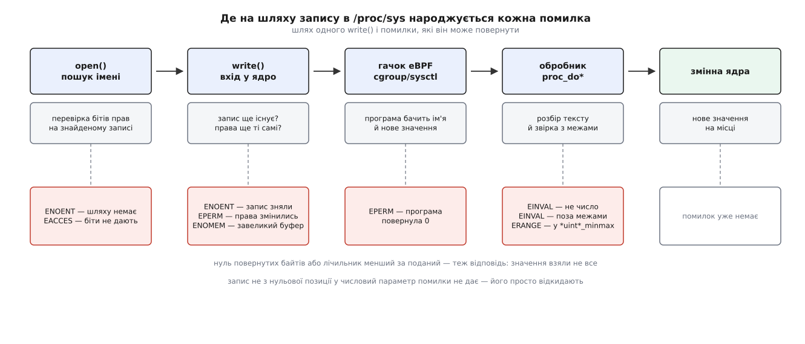

# 📋 Контракт sysctl: опис параметра, обробники, помилки, конфігурація

Це довідка про те, що саме ядро обіцяє тому, хто читає й пише файли в `/proc/sys`: із яких полів складається опис параметра, як поводиться кожен стандартний обробник, які помилки й від якого етапу приходять, і за яким синтаксисом читаються файли `sysctl.d`. Потрібна вона тоді, коли треба не «покрутити ручку», а точно знати, що станеться з вашим текстом і чи можна вважати запис успішним.

Усі поля, підписи й межі нижче звірено з деревом джерел Linux 6.12 (`include/linux/sysctl.h`, `kernel/sysctl.c`, `fs/proc/proc_sysctl.c`) і з чинними сторінками довідника `sysctl(8)`, `sysctl.conf(5)`, `sysctl.d(5)`.

## Опис параметра: поля `ctl_table`

Кожному імені в `/proc/sys` відповідає один запис такої структури. Підсистема заповнює його при реєстрації, і більше нічого ядро про параметр не знає.

```c
struct ctl_table {
	const char *procname;   /* ім'я вузла в /proc/sys */
	void *data;             /* адреса справжньої змінної */
	int maxlen;             /* розмір змінної в БАЙТАХ */
	umode_t mode;           /* біти прав на «файл» */
	proc_handler *proc_handler;
	struct ctl_table_poll *poll;
	void *extra1, *extra2;  /* зазвичай межі значення */
};
```

| поле | що воно означає для того, хто пише у файл |
|---|---|
| `procname` | останній сегмент шляху. Ім'я — єдиний ідентифікатор параметра; жодного числового коду в нього немає |
| `data` | куди обробник покладе розібране значення. `NULL` — і читання, і запис повертають нуль байтів, тобто «файл» поводиться як порожній |
| `maxlen` | розмір у **байтах**, а не кількість елементів. Скільки чисел приймає вектор — обчислює обробник: `maxlen ÷ sizeof(елемент)`. Для рядків це повна довжина буфера разом із завершальним нулем |
| `mode` | звичайні [біти прав](root:sys-unix/permission-bits), з яких ядро складає режим «файлу». `0644` — читають усі, пише власник; `0444` — тільки читання; `0600` — навіть читати може лише власник |
| `proc_handler` | функція, що виконується при кожному читанні й кожному записі. Її немає — `read`/`write` дають `EINVAL` |
| `poll` | необов'язковий вузол сповіщення. Його мають рівно два параметри — `kernel.hostname` і `kernel.domainname`; на всіх інших `poll()` марний, бо дескриптор просто завжди «готовий» |
| `extra1`, `extra2` | **вказівники**, не числа. Що саме за ними лежить, вирішує обробник: `int *`, `unsigned int *` чи `unsigned long *`. Ядро тримає набір спільних сталих на найчастіші межі — `SYSCTL_ZERO`, `SYSCTL_ONE`, `SYSCTL_NEG_ONE`, `SYSCTL_ONE_HUNDRED`, `SYSCTL_INT_MAX`, `SYSCTL_LONG_MAX` та кілька сусідніх |

Підпис самого обробника — один на всі випадки:

```c
typedef int proc_handler(const struct ctl_table *ctl, int write,
                         void *buffer, size_t *lenp, loff_t *ppos);
```

`write` розрізняє напрямок; `buffer` — текст (від версії 5.8, коли Крістоф Гельвіг переніс копіювання з простору користувача в спільний код, це вже пам'ять ядра, а не пам'ять програми); `*lenp` на вході — скільки байтів подано або скільки можна віддати, на виході — скільки байтів обробник **насправді взяв або віддав**; `*ppos` — позиція у «файлі». Повернене число — нуль або від'ємний код помилки.

## Стандартні обробники

Свій обробник пишуть рідко; майже всі параметри користуються цим набором.

| обробник | тип у пам'яті | що приймає з тексту | `extra1`/`extra2` | вектор |
|---|---|---|---|---|
| `proc_dostring` | `char[]` | рядок до першого `\n` або нуля; довше за `maxlen−1` — обрізає мовчки | не вживає | ні |
| `proc_dobool` | `bool` | ціле; нуль — хиба, решта — істина. `maxlen ≠ sizeof(bool)` → `EINVAL` | не вживає | ні |
| `proc_dointvec` | `int[]` | цілі зі знаком, без будь-якої перевірки | не вживає | **так** |
| `proc_douintvec` | `unsigned int[]` | цілі без знаку; від'ємне або більше за `UINT_MAX` → `EINVAL` | не вживає | ні (лише один елемент) |
| `proc_dointvec_minmax` | `int[]` | цілі в межах `[*extra1, *extra2]`; поза межами → **`EINVAL`** | `int *` | **так** |
| `proc_douintvec_minmax` | `unsigned int[]` | цілі без знаку в межах; поза межами → **`ERANGE`** | `unsigned int *` | ні |
| `proc_dou8vec_minmax` | `u8` | те саме, але значення й межі мусять уміститися в 0…255 | `unsigned int *` | ні |
| `proc_doulongvec_minmax` | `unsigned long[]` | великі цілі без знаку в межах; поза межами → `EINVAL` | `unsigned long *` | **так** |
| `proc_dointvec_jiffies` | `int[]` (усередині — [тики](root:sys-unix/kernel-timekeeping)) | **секунди**, множить на `HZ` | не вживає | **так** |
| `proc_dointvec_ms_jiffies` | `int[]` (тики) | **мілісекунди** | не вживає | **так** |
| `proc_dointvec_userhz_jiffies` | `int[]` (тики) | одиниці `1/USER_HZ` секунди — те, чим міряють час лічильники в `/proc` | не вживає | **так** |
| `proc_doulongvec_ms_jiffies_minmax` | `unsigned long[]` (тики) | мілісекунди в межах | `unsigned long *` | **так** |
| `proc_do_large_bitmap` | вказівник на бітову мапу | перелік і діапазони через кому: `1,3-4,10-10` | не вживає | сама мапа й є вектором |
| `proc_do_static_key` | статичний ключ у коді | `0`/`1`; вмикає або вимикає гілку в уже скомпільованому коді | `SYSCTL_ZERO`/`SYSCTL_ONE` | ні |

Дві дрібниці з цієї таблиці коштують найдорожче на практиці.

Перша — **різні коди на ту саму по суті помилку**. Вийшовши за межі, `proc_dointvec_minmax` дає `EINVAL`, а `proc_douintvec_minmax` — `ERANGE`. Скрипт, який ловить лише `EINVAL`, на параметрі без знаку помилку прогавить.

Друга — **сімейство `*_jiffies` перетворює одиниці в обидва боки**. Записуєте секунди — у змінній опиняються тики; читаєте — тики діляться назад. Ділення ціле, тож усе, що менше за один тик, ляже нулем, а прочитане назад значення округлене до кроку `1/HZ`. При `HZ = 250` це 4 мс:

```
запис  0.9 с → жодного дробу не буде: розбирається лише ціле
запис  3 с   → 3 · 250 = 750 тиків
читання      → 750 ÷ 250 = 3 с
запис  1 мс у proc_dointvec_ms_jiffies при HZ = 250
             → msecs_to_jiffies(1) = 1 тик = 4 мс
читання      → 4, а не 1
```

`proc_do_large_bitmap` вибивається з ряду ще й будовою: у `data` лежить **вказівник на вказівник** на мапу, а `maxlen` міряє довжину в **бітах**, а не в байтах. Саме звідси беруться такі рядки, як `net.ipv4.ip_local_reserved_ports = 8080,9148,30000-30010`.

## Що обробник робить із вектором

Одне ім'я на кілька чисел — не виняток, а звичайний випадок (`net.ipv4.tcp_rmem`, `kernel.printk`, `vm.lowmem_reserve_ratio`). Кількість елементів обробник обчислює сам:

```
елементів = maxlen ÷ sizeof(елемент)

tcp_rmem: maxlen = 12, sizeof(int) = 4 → 3 елементи
```

**Читання** віддає елементи через символ табуляції й додає `\n` у кінці. Це важливо для розбору: `awk` зі стандартним роздільником спрацює, а `cut -d' '` — ні.

**Запис** іде в циклі «поки є вхідний текст і поки є вільні елементи». З цього випливають дві несиметричні поведінки, і жодна з них не є помилкою.

**Приклад: вектор із трьох елементів і невідповідна кількість чисел.**

```
початковий стан: net.ipv4.tcp_rmem = 4096  131072  6291456

записуємо "8192"          (4 байти)
  цикл: узяв 8192 → перший елемент
        текст скінчився → вихід
  результат: 8192  131072  6291456
  write() повертає 4 — усе взято, помилки немає

записуємо "8192 1 2 3"    (10 байтів)
  цикл: узяв 8192, 1, 2 → елементи скінчилися
        у буфері лишилося " 3", пробіл пропущено
  результат: 8192  1  2
  write() повертає 9 із 10 — короткий запис, помилки немає
```

Тобто **недодані числа лишають старі значення, а зайві мовчки відкидаються**; єдиний слід другого випадку — лічильник, повернений `write()`, менший за поданий. Помилку ви отримаєте лише в одному разі: якщо з тексту не розібралося **жодного** значення — тоді `EINVAL`.

> 🔧 **Навіщо це.** Ознака успіху для `write()` у `/proc/sys` — не «повернулося невід'ємне число», а «повернулося рівно стільки, скільки подано». Оболонка цієї різниці не показує: `echo` про короткий запис не скаржиться. Тому перевіряти доводиться або лічильником у власній програмі, або читанням назад — третього надійного способу немає.

## Файлова семантика

Записи `/proc/sys` виглядають як файли, але з їхніх файлових властивостей справжня лише одна — біти прав.

**Розмір завжди нуль.** `stat()` дає `st_size = 0`, бо тексту до звертання не існує. Програма, що читає файл «за розміром», прочитає нуль байтів.

**Читання — за один раз.** Обробник віддає стільки, скільки вміщає ваш буфер, і на цьому все: наступне читання з ненульової позиції одразу повертає нуль байтів, тобто кінець файлу. Малий буфер не дочитує решту — він **мовчки обрізає** значення. Одне читання буфером на кілька сотень байтів — правильний спосіб; читання по чотири байти в циклі дасть чотири байти й порожнечу.

**Один `write()` — одне повне значення.** Обробник розбирає рівно те, що прийшло одним викликом. Числовий текст, розрізаний на два записи, не склеїться. Понад те, для числових обробників вхід обрізається до `PAGE_SIZE − 1` — це та сама межа, що згадана в довіднику як «до 4096 символів на значення».

**Позиція має значення, і поводиться вона по-різному для чисел і для рядків.** Керує цим параметр `kernel.sysctl_writes_strict`, який з'явився у версії 3.16 і став суворим за замовчуванням у 4.5, коли Кес Кук переконався, що на давній поведінці ніхто не тримається.

| значення | числовий параметр | рядковий параметр |
|---|---|---|
| `1` (за замовчуванням) | запис із позиції ≠ 0 **відкидається без помилки**: `write()` звітує про нуль узятих байтів, змінна лишається старою | запис лягає **саме з позиції**, тобто дописується в буфер; усе поза `maxlen−1` втрачається |
| `0` | позиція не враховується, кожен запис переписує значення цілком; у журнал ядра один раз іде попередження про програму, яка так робить | те саме |
| `-1` | те саме, що `0`, але мовчки | те саме |

Мовчазне відкидання в суворому режимі — найпідступніша частина контракту: скрипт, який відкрив дескриптор, щось записав, а потім записав ще раз у той самий дескриптор, вважає, що вдалося обидва рази. Насправді другого запису не сталося. Оболонковий `>` цього не зачіпає — він щоразу відкриває файл заново, з позицією нуль.

**Права ядро віддає, але не дає ними керувати.** `chmod` і `chown` на `/proc/sys` повертають `EPERM`: режим береться з поля `mode`, і змінити його ззовні неможливо. Перевірка прав теж своя: ядро порівнює чинний ідентифікатор із **глобальним** нулем, тож «root» усередині власного простору імен користувачів звичайних бітів власника не отримує.

Виняток — мережеве піддерево. Корінь мережевих таблиць має власну перевірку: процес, який має [повноваження](root:sys-unix/capabilities) `CAP_NET_ADMIN` у просторі імен користувачів, до якого прив'язаний [мережевий простір імен](root:sys-unix/network-namespaces), дістає права власника на його параметри — навіть не бувши всесильним адміністратором машини. Власника ж самих «файлів» ядро при цьому призначає з ідентифікаторів того простору імен.

## Помилки

| код | звідки приходить | причина |
|---|---|---|
| `ENOENT` | `open()` | шляху в дереві немає: параметра немає в цьому ядрі або [модуль](root:sys-unix/kernel-modules) із ним не завантажено |
| `ENOENT` | `read()`/`write()` | запис зняли з реєстрації, поки дескриптор був відкритий (модуль вивантажили) |
| `EACCES` | `open()` | біти `mode` не дають потрібного доступу; спроба записати в каталог дерева; спроба виконати «файл» як програму |
| `EPERM` | `read()`/`write()` | повторна перевірка прав у мить самої дії не пройшла — права встигли змінитися після відкриття |
| `EPERM` | `write()`, `read()` | [програма eBPF](root:sys-unix/ebpf-programming-model-and-toolchain) на гачку `cgroup/sysctl` повернула `0` |
| `EINVAL` | `write()` | у тексті не знайшлося жодного значення, яке вдалося б розібрати |
| `EINVAL` | `write()` | значення поза `[extra1, extra2]` у `proc_dointvec_minmax` або `proc_doulongvec_minmax` |
| `EINVAL` | `write()` | від'ємне число в беззнаковому обробнику; `proc_dobool` з невідповідним `maxlen` |
| `EINVAL` | `read()`/`write()` | в описі параметра взагалі немає обробника |
| `ERANGE` | `write()` | значення поза межами в `proc_douintvec_minmax` і `proc_dou8vec_minmax` |
| `ENOMEM` | `read()`/`write()` | обсяг одного виклику завеликий, щоб ядро виділило під нього буфер |
| `EFAULT` | `read()`/`write()` | буфер програми недоступний для копіювання |



*Права перевіряються двічі — при відкритті й у мить самої дії, тому «дозволено» й «заборонено» приходять різними кодами; межі значення перевіряє вже обробник.*

Гачок eBPF з'явився у версії 5.2: програма типу `BPF_PROG_TYPE_CGROUP_SYSCTL`, почеплена на [групу керування](root:sys-unix/cgroups-resource-model), викликається перед обробником і повертає `1` (пропустити) або `0` (заборонити з `EPERM`). Через помічники `bpf_sysctl_get_name`, `bpf_sysctl_get_current_value`, `bpf_sysctl_get_new_value` і `bpf_sysctl_set_new_value` вона бачить ім'я параметра, поточне й нове значення — і може не лише відмовити, а й підмінити те, що дійде до обробника.

## Формат файлів `sysctl.conf` і `sysctl.d/*.conf`

Синтаксис простий до банальності, і вся змістовність — у дрібницях.

```conf
# коментар
; теж коментар

net.ipv4.ip_forward = 1
kernel.domainname=example.com
net.ipv4.ip_local_reserved_ports = 8080,9148,30000-30010

-net.bridge.bridge-nf-call-iptables = 0
net/ipv4/conf/eth0.100/rp_filter = 1

net.ipv4.conf.*.accept_redirects = 0
-net.ipv4.conf.lo.accept_redirects
```

| елемент | правило |
|---|---|
| рядок | `ключ = значення`. Пробіли навколо `=` відкидаються, значення береться до кінця рядка як є — лапки не потрібні й самі стануть частиною значення |
| коментар | рядок, що починається з `#` або `;`; порожні рядки пропускаються |
| `-` перед ключем **зі** значенням | невдала спроба записати не вважається помилкою: рядок для параметра, якого в цьому ядрі може не бути |
| `-` перед ключем **без** значення | вилучити цей ключ зі збігів за шаблоном (systemd-sysctl і новіші версії `procps`) |
| шаблон `*` у ключі | застосувати до всіх наявних імен, що збігаються; ключ із явним рядком у збіги не потрапляє |
| роздільник | `.` і `/` рівноправні. Утиліта дивиться на **перший** роздільник у ключі й далі вважає роздільником саме його, а другий символ лишає частиною імені. Тому інтерфейс із крапкою в назві адресують через слеші: `net/ipv4/conf/eth0.100/rp_filter` |
| довжина значення | до 4096 символів — стеля одного запису для числових обробників |

Файли беруть із чотирьох (у `procps` — п'яти) каталогів, і два правила порядку працюють незалежно одне від одного:

```
де шукають (за спаданням старшинства):
  /etc/sysctl.d/            ← адміністратор
  /run/sysctl.d/            ← те, що згенерували на цей запуск
  /usr/local/lib/sysctl.d/
  /usr/lib/sysctl.d/        ← пакунки
  (procps додає /lib/sysctl.d/)

1) однакове ІМ'Я файлу: перемагає файл зі старшого каталогу,
   решта однойменних просто не читаються
2) різні імена: усі зібрані файли впорядковують за іменем
   ЛЕКСИКОГРАФІЧНО, незалежно від каталогу, і програють по черзі
```

Наслідок другого правила варто проговорити: старшинство каталогу вирішує лише суперечку однойменних файлів. Якщо пакунок поклав `/usr/lib/sysctl.d/99-tuning.conf`, а ви — `/etc/sysctl.d/10-mine.conf`, ваш файл програє, бо `10-` йде раніше за `99-`, а останній запис на те саме ім'я перемагає. Звідси й домовленість про двоцифровий префікс: `10`–`40` для файлів пакунків, `60`–`90` для `/etc` і `/run`. Щоб вимкнути чужий файл цілком, у `/etc/sysctl.d/` кладуть символьне посилання з тим самим іменем на `/dev/null`.

`/etc/sysctl.conf` — окремий випадок: його читають **після** всіх каталогів, тож він перекриває будь-що. Це спадщина, і нове туди краще не класти.

Ще одна межа цього формату: він не описує стану, тільки перелік записів, які [служба початкового налаштування](root:sys-unix/systemd-model) виконує на старті. Тому «переможець» визначається не тут, а на самому параметрі — хто б не записав у нього пізніше, останній запис і лишиться.

## Ключі утиліти `sysctl(8)`

| ключ | дія |
|---|---|
| `-w`, `--write` | вважати всі аргументи присвоєннями `ключ=значення` й лаятися на ті, що так не читаються |
| `-p[ФАЙЛ]`, `--load[=ФАЙЛ]` | програти файл; без аргументу — `/etc/sysctl.conf`, з `-` — стандартний ввід |
| `--system` | програти всі системні каталоги за описаним вище порядком |
| `-a`, `--all` | показати всі доступні значення (без застарілих; `-A` і `-X` — те саме) |
| `--deprecated` | додати до переліку `-a` й застарілі імена |
| `-N`, `--names` | вивести лише імена, без значень |
| `-n`, `--values` | вивести лише значення, без імен |
| `-b`, `--binary` | значення без завершального переведення рядка |
| `-e`, `--ignore` | не вважати помилкою невідомий ключ |
| `-q`, `--quiet` | не друкувати значення, які виставляємо |
| `-r`, `--pattern` | застосувати або показати лише те, що збігається з розширеним регулярним виразом |

Найкоротший робочий набір:

```sh
sysctl net.ipv4.ip_forward          # прочитати
sysctl -w net.ipv4.ip_forward=1     # записати негайно
sysctl -a --pattern 'tcp_.*mem'     # знайти за зразком
sysctl --system                     # програти всі файли налаштувань
sysctl -p -  <<< 'vm.swappiness = 10'   # програти рядки зі вводу
```

Утиліта не має ніякої влади понад ту, що дає файлова система: `sysctl -w` — це той самий `open` і `write` у `/proc/sys`, з тими самими кодами помилок. Різниця лише в тому, що вона перекладає крапки на слеші, вміє обходити дерево й дає `-e`, щоб конвеєр не спинявся на іменах, яких у цьому ядрі немає.
