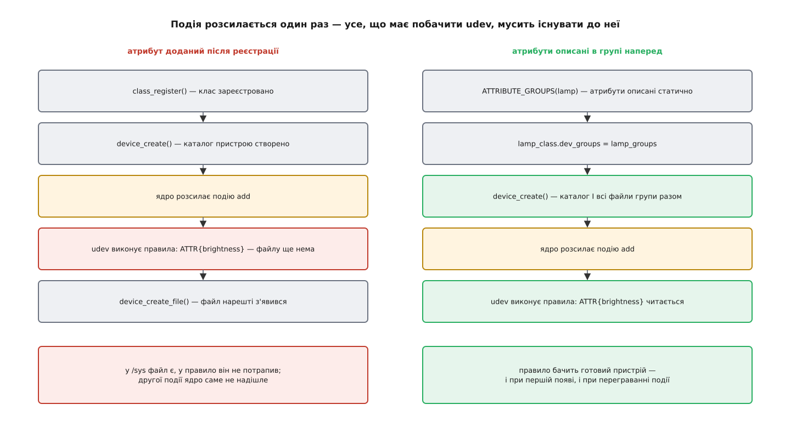

# ⚙️ Модуль ядра, що заводить власний атрибут

Сотня рядків мовою C — і в системі з'являється каталог `/sys/class/lamp/lamp0/` з файлом, який читається через `cat` і міняється через `echo`; далі сам модуль, його збірка поза деревом ядра й ті кілька місць, де такий код ламається найчастіше.

## Завдання

Уявімо залізо, якого нема: лампа з яскравістю в межах від 0 до 100. Треба, щоб будь-який скрипт міг спитати поточне значення й поставити нове — не маючи ні бібліотеки, ні заголовкових файлів, ні прав на щось більше за запис у файл. Файлу в `/dev` заводити не будемо: потік байтів тут нікуди не тече, керуючих величин рівно дві, і кожна з них — окреме число.

## Ідея

Щоб число стало файлом у `/sys/class/`, ядру треба сказати три речі.

Перше — **клас**: іменована група пристроїв, які обіцяють однаковий набір файлів. Саме клас дає каталог `/sys/class/lamp/`, за яким програма знаходить усі лампи, не знаючи, куди вони під'єднані.

Друге — **атрибут**: пара функцій, `show` для читання й `store` для запису. Ядро тримає не значення, а ці дві функції; значення виникає в момент звертання й одразу зникає.

Третє — **пристрій** у цьому класі: конкретний екземпляр, каталог якого й наповнять файли.

Тонкість, з якої випливає весь порядок дій, така: атрибути треба **описати наперед**, а не додавати до вже зареєстрованого пристрою. Реєстрація закінчується розсилкою події, і всі, хто на неї відгукується, застають пристрій таким, яким він був на ту мить. Тому опис атрибутів кладуть у клас — і ядро створює каталог разом з усіма файлами одним рухом, ще до події.

## Код

Модуль цілком. Він розрахований на ядро 6.4 і новіші — нижче пояснено, чому цю межу доводиться називати.

```c
// lamp.c — пристрій з одним керованим значенням
#include <linux/module.h>
#include <linux/device.h>
#include <linux/err.h>
#include <linux/sysfs.h>
#include <linux/kstrtox.h>

#define LAMP_MAX 100

static unsigned int lamp_level = 50;        /* стан «заліза» */

/* читання: значення форматується просто в буфер, який дало ядро */
static ssize_t brightness_show(struct device *dev,
			       struct device_attribute *attr, char *buf)
{
	return sysfs_emit(buf, "%u\n", READ_ONCE(lamp_level));
}

/* запис: розібрати текст, перевірити межі, спожити весь буфер */
static ssize_t brightness_store(struct device *dev,
				struct device_attribute *attr,
				const char *buf, size_t count)
{
	unsigned int val;
	int err;

	err = kstrtouint(buf, 10, &val);    /* кінцевий '\n' від echo пробачається */
	if (err)
		return err;                 /* -EINVAL дійде до write() як errno */
	if (val > LAMP_MAX)
		return -ERANGE;

	WRITE_ONCE(lamp_level, val);
	dev_info(dev, "brightness set to %u\n", val);
	return count;                       /* спожито все */
}
static DEVICE_ATTR_RW(brightness);          /* → dev_attr_brightness, права 0644 */

static ssize_t max_brightness_show(struct device *dev,
				   struct device_attribute *attr, char *buf)
{
	return sysfs_emit(buf, "%u\n", LAMP_MAX);
}
static DEVICE_ATTR_RO(max_brightness);      /* → права 0444 */

static struct attribute *lamp_attrs[] = {
	&dev_attr_brightness.attr,
	&dev_attr_max_brightness.attr,
	NULL,
};
ATTRIBUTE_GROUPS(lamp);                     /* → lamp_group, lamp_groups */

static const struct class lamp_class = {
	.name = "lamp",
	.dev_groups = lamp_groups,          /* файли описані ДО реєстрації */
};

static struct device *lamp_dev;

static int __init lamp_init(void)
{
	int err;

	err = class_register(&lamp_class);
	if (err)
		return err;

	/* MKDEV(0,0) — пристрій без номерів, отже без файлу в /dev */
	lamp_dev = device_create(&lamp_class, NULL, MKDEV(0, 0), NULL, "lamp0");
	if (IS_ERR(lamp_dev)) {
		class_unregister(&lamp_class);
		return PTR_ERR(lamp_dev);
	}

	dev_info(lamp_dev, "ready at /sys/class/lamp/lamp0/\n");
	return 0;
}

static void __exit lamp_exit(void)
{
	device_unregister(lamp_dev);        /* спершу пристрій */
	class_unregister(&lamp_class);      /* потім клас, у якому він жив */
}

module_init(lamp_init);
module_exit(lamp_exit);

MODULE_DESCRIPTION("One-attribute example device for /sys/class");
MODULE_LICENSE("GPL");
```

Кілька місць варті окремого погляду.

`DEVICE_ATTR_RW(brightness)` — це домовленість про імена, а не оголошення: макрос розгортається в структуру `dev_attr_brightness` і **сам шукає** функції `brightness_show` і `brightness_store`. Перейменуйте одну з них — і компілятор поскаржиться на невідомий символ, а не на неправильний атрибут. `DEVICE_ATTR_RO` вимагає лише `show` і ставить права так, що писати не можна нікому.

`ATTRIBUTE_GROUPS(lamp)` збирає масив `lamp_attrs` у групу `lamp_group` і загортає її в масив `lamp_groups`, який чекає поле `dev_groups`. Цей ланцюжок здається зайвим для двох файлів, але саме він дозволяє віддати ядру весь набір одразу — а групі, до того ж, можна дати ім'я, і тоді її файли осядуть у власному підкаталозі.

`MKDEV(0, 0)` означає «номерів нема»: ядро не створить ні файлу `dev` у каталозі пристрою, ні вузла в `/dev`. Живий приклад такого пристрою — підсвітка ноутбука: керується атрибутами, а відкривати в ній нема чого. Якби номери були потрібні, їх довелося б спершу взяти в ядра, і тоді [пара старший–молодший](topic:sys-unix/major-minor-numbers) поїхала б у події та в `devtmpfs`.

`MODULE_LICENSE("GPL")` тут не формальність: і `class_register`, і `device_create` експортовані лише для модулів під GPL — без цього рядка збірка не знайде символів.

> 🔧 **Навіщо це.** Порівняйте вартість двох способів дати назовні ті самі 0–100. Через атрибут: дві функції в модулі — і керувати лампою вміють `cat`, `echo`, скрипт на будь-чому, правило udev, збирач метрик, вебінтерфейс через звичайне читання файлу. Через власний керуючий виклик: двійкова структура, номер команди, заголовковий файл, який треба розповсюдити, і окрема програма-посередник для кожної мови. Клієнтського коду в першому випадку нема взагалі — і саме тому підсвітка, вентилятори, світлодіоди й батарея давно живуть у `/sys`.

## Збірка

Правила збірки модулів живуть у дереві ядра, а не у вашому каталозі. Тому Makefile поза деревом складається з двох речей: список того, що зібрати, і виклик `make` у ядерному дереві з поверненням до себе.

```make
obj-m := lamp.o

KDIR ?= /lib/modules/$(shell uname -r)/build

all:
	$(MAKE) -C $(KDIR) M=$(CURDIR) modules

clean:
	$(MAKE) -C $(KDIR) M=$(CURDIR) clean
```

`obj-m := lamp.o` — це вже не мова `make`, а kbuild: «зібрати `lamp.o` як окремий модуль». `-C $(KDIR)` переходить у дерево ядра, `M=$(CURDIR)` каже йому повернутися по джерела сюди. Каталог `/lib/modules/$(uname -r)/build` — посилання на заголовки й конфігурацію [саме того ядра, що зараз працює](topic:sys-unix/kernel-config-and-build), яке ставиться пакетом `linux-headers-…` чи `kernel-devel`. Зібрати проти чужої конфігурації можна, завантажити результат — ні.

## Перевірка

```
$ make
make -C /lib/modules/6.8.0-45-generic/build M=/home/u/lamp modules
  CC [M]  /home/u/lamp/lamp.o
  MODPOST /home/u/lamp/Module.symvers
  LD [M]  /home/u/lamp/lamp.ko

$ sudo insmod lamp.ko
$ ls /sys/class/lamp/lamp0/
brightness  max_brightness  power  subsystem  uevent

$ cat /sys/class/lamp/lamp0/brightness
50
$ echo 70 | sudo tee /sys/class/lamp/lamp0/brightness
70
$ cat /sys/class/lamp/lamp0/brightness
70

$ echo 700 | sudo tee /sys/class/lamp/lamp0/brightness
tee: /sys/class/lamp/lamp0/brightness: Numerical result out of range
$ echo сімдесят | sudo tee /sys/class/lamp/lamp0/brightness
tee: /sys/class/lamp/lamp0/brightness: Invalid argument

$ readlink -f /sys/class/lamp/lamp0
/sys/devices/virtual/lamp/lamp0

$ dmesg | tail -2
[ 4210.117364] lamp lamp0: ready at /sys/class/lamp/lamp0/
[ 4232.884901] lamp lamp0: brightness set to 70

$ sudo rmmod lamp
```

Помилки з `store` дійшли до `tee` як звичайні `errno` — жодного окремого каналу для повідомлень про хиби тут нема й не треба. Префікс `lamp lamp0:` у журналі поставив `dev_info` сам: коли драйвера в пристрою нема, він підписується іменем класу. А `readlink` показує, де насправді лежить вузол: `/sys/class/lamp/` — це каталог посилань, канонічний шлях веде у гілку `virtual`, бо батька в нашого пристрою нема, і фізично він не під'єднаний ні до чого.

Три файли в каталозі з'явилися без нашої участі: `uevent` — той самий, запис у який змушує ядро розіслати подію ще раз, `subsystem` — посилання назад на клас, `power/` — підкаталог керування живленням, який дістає кожен зареєстрований пристрій. Це і є та частка, яку модель роздає задарма всім, хто в ній зареєструвався.

Про `insmod`, `rmmod` і те, чому модуль не вивантажується, поки хтось тримає його зайнятим, — [окремо про модулі ядра](topic:sys-unix/kernel-modules).

## Пастка порядку: подія випереджає файл

Найспокусливіший спосіб додати атрибут — створити пристрій, а потім покликати `device_create_file()`. Компілюється, працює, файл на місці. І все ж так робити не варто.



*Ядро розсилає подію в кінці реєстрації пристрою; правило, що читає атрибут, застає рівно те, що існувало на ту мить.*

Реєстрація пристрою закінчується широкомовним повідомленням `add`. [Правила udev](topic:sys-unix/udev-rules) відгукуються на нього одразу й нерідко читають атрибути — умовою (`ATTR{brightness}=="50"`) чи щоб підставити значення в ім'я. Файл, створений на мить пізніше, для цього правила не існує: другої події ядро само не надішле, а перечитувати каталог удруге udev не буде.

Саме тому набір файлів описують групою й віддають ядру **до** реєстрації — через `dev_groups` класу або `groups` самого пристрою. Тоді каталог і всі його файли з'являються одним рухом, а подія летить уже над готовим пристроєм. Перевірити правило на вже завантаженому модулі допомагає перегравання події (`echo add > …/uevent`), але це інструмент налагодження, а не спосіб урятувати неправильний порядок: при справжній появі пристрою ніхто цього за вас не зробить.

## Де такий код ламається

**Буфер `show` — рівно одна сторінка** (4 КБ на x86), і це не порада, а межа. `sysfs_emit()` про неї знає й обрізає вивід чесно; `sprintf` не знає нічого й перепише чужу пам'ять. Звідси й правило «одне значення на файл»: перелік, який сьогодні влазить, завтра виросте, а обрізати його посеред рядка нема куди.

**`store` повертає кількість спожитих байтів.** Повернути менше за `count` — і програма-писар вважатиме, що решту треба дописати наступним викликом; ваш розбір побачить хвіст рядка й відповість помилкою. Повернути 0 — і `write()` віддасть нуль, а сумлінна програма закрутиться в нескінченному циклі. Правильна відповідь на вдалий запис одна: `count`.

**Перевіряти введення обов'язково.** `store` — це керуючий канал просто в залізо, відкритий кожному, хто має право писати у файл. `kstrtouint()` тут робить дві роботи: відкидає все, що не число (разом із порожнім рядком), і прощає кінцеве переведення рядка, яке додає `echo`. Межі — уже ваша справа: ядро не знає, що більше за 100 у вашій лампі не буває.

**Одночасність ядро не бере на себе.** Два паралельні `echo` дадуть два виклики `store` на різних ядрах процесора, і `show` може крутитися між ними. Для одного слова досить `READ_ONCE`/`WRITE_ONCE`; щойно з'явиться читання-зміна-запис або зв'язок між двома атрибутами — потрібен власний замок — і тут доречний саме м'ютекс: `show` і `store` викликаються в контексті, де спати дозволено.

**Атрибут не може видалити сам себе.** Звичайне видалення файлу чекає, поки завершаться всі виклики, що вже в дорозі, — а якщо видалення кличе сам `store`, він чекатиме на себе. Для патерну «запис у файл `delete` знімає пристрій» у ядра є окремий `device_remove_file_self()`, який цю петлю розриває.

**Внутрішній API ядра не сталий.** У 6.4 `class_create()` втратив перший аргумент `THIS_MODULE` (він ніколи нічого не робив), а `struct class` став придатний для статичного незмінного опису — саме тому наведений код такий короткий і саме тому він не збереться проти 6.1. Модуль поза деревом ядра платить за це перезбіркою при кожному оновленні. Це не недогляд: [обіцянка не ламати сумісність дана простору користувача, а не модулям](topic:sys-unix/kernel-abi-stability), і ціна цієї свободи всередині — ваш `#if LINUX_VERSION_CODE`.

**Доданий файл стає інтерфейсом назавжди.** За `/sys/class/lamp/lamp0/brightness` завтра вчепиться чужий скрипт, стільниця, служба живлення — і жодного способу дізнатися про них у вас не буде. Ядро тому й описує свої атрибути окремо, у каталозі `Documentation/ABI`, поділеному на `stable` (сумісність обіцяно щонайменше на два роки), `testing`, `obsolete` і `removed`. П'ять рядків, якими атрибут додається, і роки, за які його прибирають, — дві сторони однієї легкості.
