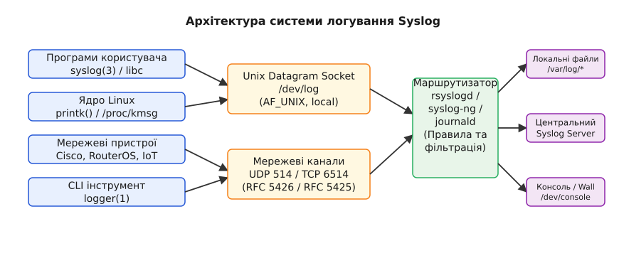
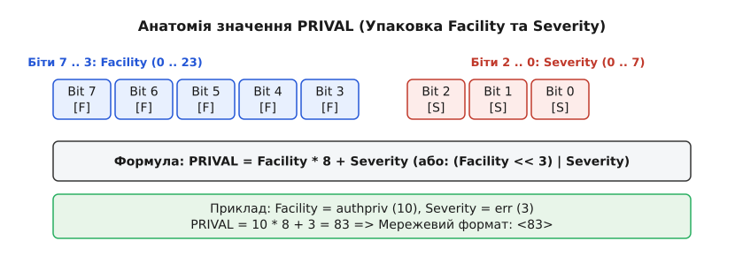
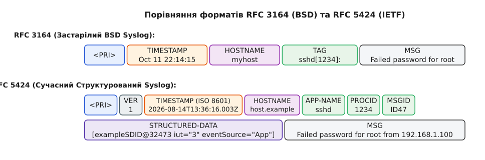

# Syslog: пріоритет, засоби (facility) і формат повідомлення

<preknowlist>
- [Файлові сокети Unix (AF_UNIX)](root:sys-unix/unix-domain-sockets) — міжпроцесна взаємодія через файлову систему.
- [Мережеві сокети в Linux](root:sys-unix/socket-api-linux) — створення сокетів UDP/TCP та передача мережевих даних.
- [Логування у systemd](root:sys-unix/journalctl-and-journald-conf-operation) — підсистема journald та обробка логів у Linux.
</preknowlist>

О третій години ночі високонавантажений веб-сервер раптово припиняє відповідати на запити користувачів. Системний інженер відкриває консоль сервера і постає перед складною задачею: який саме з десятків паралельних процесів дав збій і яка конкретно подія стала першопричиною аварії? Якщо кожен компонент системи буде самостійно відкривати власний файл на диску, формат записаних даних визначатиметься довільним фантазуванням автора програми, а при краху ядра вивід на екран просто зникне при перезавантаженні — моніторинг та аналіз операційної системи перетворяться на суцільний хаос.

Розв'язанням цієї проблеми стало фундаментальне інженерне рішення — підсистема **Syslog**. В її основі лежить принципове відокремлення джерела повідомлення (програми чи ядра) від механізму обробки, зберігання та маршрутизації логів. Програма не вирішує, у який файл і під яким ім'ям записати рядок. Вона лише характеризує подію двома числовими позначками: **від кого вона надійшла** (Facility) і **наскільки вона термінова** (Severity). Усі подальші рішення — записати рядок на диск, надіслати адміністратору в поштовий ящик, відфільтрувати чи передати через мережу на центральний сервер — ухвалює централізований фоновий демон.


*Загальна архітектура розділення джерел подій, транспорту, демона-маршрутизатора та кінцевих приймачів логів.*

Повна історія створення підсистеми у берклійському дистрибутиві 4.3BSD та її подальший шлях розкриті в [історичному огляді виникнення та еволюції syslog](root:sys-unix/syslog-protocol/hist-syslog-evolution.md).

---

## Архітектурний трикутник: Генератори, Транспорт і Демон

Модель Syslog будується на трьох чітко розмежованих шарах:

1. **Генератори повідомлень (Clients):** Це будь-який процесуальний код — від ядра ОС Linux, системних демонів (`sshd`, `cron`, `systemd`) і баз даних до непривілейованих користувацьких скриптів чи мережевих маршрутизаторів. Генератор форматує рядок і передає його далі, не чекаючи відповіді (підхід «fire-and-forget»).
2. **Транспортний шар (Transport):** Засіб доставки повідомлення від генератора до колектора. Локальні програми використовують датаграмний Unix Domain Socket (зазвичай `/dev/log`). Мережеві пристрої передають пакет через протоколи UDP (порт 514) або шифрований TCP з TLS (порт 6514).
3. **Маршрутизатор та колектор (Syslog Daemon):** Системна служба (`rsyslogd`, `syslog-ng` або `systemd-journald`), яка слухає транспортні канали. Вона парсить вхідні метадані, зіставляє їх зі своїм файлом конфігурації та спрямовує рядок до одного або кількох приймачів (Sinks) — файлів у `/var/log/`, консолі чи мережевих серверів.

Такий підхід забезпечує абсолютну відсутність зв'язаності (decoupling) між кодом додатка та конфігурацією операційної системи. Програма може переноситися між різними дистрибутивами та серверами без будь-яких змін у коді логування. Розробники програмного забезпечення звільняються від необхідності конфігурувати параметри файлового виводу у своїх застосунках, перекладаючи це завдання на системних адміністраторів та інженерів з експлуатації.

---

## Анатомія пріоритету: Facility, Severity та PRIVAL

Серцевиною структури даних Syslog є метаінформація про подібність та критичність події. Вона виражається двома класифікаторами: **Facility** (засіб/категорія) та **Severity** (важливість/серйозність).

### 1. Категорії (Facility)

Facility описує підсистему операційної системи, яка згенерувала повідомлення. Специфікація стандартизує 24 категорії, пронумеровані від 0 до 23:

- `kern` (0): Повідомлення від ядра ОС (створюються через `printk`). Програми простору користувача не мають права використовувати цей код.
- `user` (1): Загальні користувацькі програми (дефолтна категорія для звичайних застосунків).
- `mail` (2): Поштова підсистема (Sendmail, Postfix, Dovecot).
- `daemon` (3): Системні фонові служби, які не мають власної окремої категорії.
- `auth` (4): Служби автентифікації та контролю доступу (`login`, `su`).
- `syslog` (5): Внутрішні повідомлення самого демона логування.
- `lpr` (6): Підсистема друку.
- `news` (7): Служби мережевих новин USENET.
- `uucp` (8): Застаріла підсистема UUCP.
- `cron` (9): Системні планувальники завдань (`cron`, `at`).
- `authpriv` (10): Захищені повідомлення автентифікації (містять чутливу інформацію, доступ до них зазвичай обмежено доступом root).
- `ftp` (11): Демон протоколу передачі файлів FTP.
- `ntp` (12): Служба синхронізації часу NTP.
- `security` / `audit` (13): Підсистема аудиту безпеки та контролю доступу.
- `console` (14): Повідомлення попереджень консолі.
- `solaris-cron` (15): Резервні системні планирувальники.
- `local0` – `local7` (16–23): Зарезервовані для локального використання адміністраторами та розробниками. Часто призначаються для мережевого обладнання, веб-серверів (Nginx) чи власних корпоративних застосунків.

Використання виділених категорій `local0`–`local7` є рекомендованим способом розділення виводу власних програм. Це дозволяє налаштувати розкладання логів окремих сервісів у власні каталоги без втручання в системні журнали операційної системи.

### 2. Рівні важливості (Severity)

Severity показує рівень критичності події. Зафіксовано 8 рівнів, де 0 відповідає абсолютній катастрофі, а 7 — рутинним відлагоджувальним деталям:

- `emerg` / `panic` (0): Система непрацездатна. Аварійний стан (Kernel Panic). Повідомлення розсилається на консолі всіх активних користувачів.
- `alert` (1): Необхідне негайне втручання людини (наприклад, пошкодження головної бази даних або відмова RAID-масиву).
- `crit` (2): Критичний стан (наприклад, відмова дискової підсистеми або вичерпання всієї пам'яті).
- `err` (3): Помилка роботи програми. Щось зламалося, але система продовжує функціонувати.
- `warning` (4): Попередження. Подія не є помилкою, але може призвести до неї у майбутньому (наприклад, заповнення диска на 90%).
- `notice` (5): Важлива нормальна подія. Програма працює у штатному режимі, але подія заслуговує на увагу (наприклад, перезапуск служби).
- `info` (6): Інформаційне повідомлення (статистика, запуск транзакції).
- `debug` (7): Налагоджувальна інформація. Детальний потік подій для розробників. У продакшн-середовищах зазвичай відфільтровується.

### 3. Побітова упаковка: Формула PRIVAL

Для передачі двох цих параметрів у компактному вигляді їх упаковують в один єдиний байт — значення **Priority (PRIVAL)**.

Оскільки рівнів важливості рівно 8, для їх кодування потрібно рівно 3 біти (так як `2³ = 8`). Решта старших бітів відводиться під код Facility.


*Побітова структура байта PRIVAL: 5 старших бітів визначають категорію, а 3 молодших — рівень важливості.*

Математична формула об'єднання:

```
PRIVAL = Facility · 8 + Severity
```

У побітових операціях це еквівалентно суву на 3 розряди вліво та бітовому «АБО»:

```
PRIVAL = (Facility << 3) | Severity
```

Зворотне декодування на боці демона логування виконується двома операціями:

```
Facility = PRIVAL ÷ 8      [цілочисельне ділення: PRIVAL >> 3]
Severity = PRIVAL % 8      [остача від ділення: PRIVAL & 7]
```

**Крок за кроком обчислення PRIVAL:**

```
Вхідні дані:
Facility = authpriv (код 10)
Severity = err (код 3)

Обчислення:
PRIVAL = 10 · 8 + 3
       = 80 + 3
       = 83

У двійковій системі:
Facility (10)  = 01010₂
Severity (3)   = 011₂
Упаковано      = 01010011₂ = 83₁₀
```

У текстовому мережевому повідомленні значення PRIVAL записується на самому початку в кутових дужках: `<83>`. Максимально можливе значення PRIVAL відповідає категорії `local7` (23) та важливості `debug` (7): `23 · 8 + 7 = 191` (`<191>`).

Детальний розбір системних викликів C бібліотеки `openlog()`, `syslog()`, `closelog()` та `setlogmask()` викладено в [довіднику C/C++ API для Syslog](root:sys-unix/syslog-protocol/api-syslog-c-library.md).

---

## Формати повідомлень: RFC 3164 проти RFC 5424

Протягом еволюції Syslog сформувалося два основних формати представлення текстових даних у каналі зв'язку.


*Структурна різниця між застарілим виводом RFC 3164 та сучасним стандартом RFC 5424 зі структурованими даними.*

### 1. Застарілий формат BSD Syslog (RFC 3164)

Формат RFC 3164 був опублікований у 2001 році як документація фактичної поведінки демонів BSD. Структура рядка виглядає так:

```
<PRIVAL>TIMESTAMP HOSTNAME TAG: MSG
```

Приклад рядка RFC 3164:
```text
<34>Oct 11 22:14:15 server01 sshd[1234]: Failed password for root from 192.168.1.50 port 54321 ssh2
```

Критичні недоліки формату RFC 3164:
1. **Відсутність року та часового поясу:** Поле `TIMESTAMP` має вигляд `Oct 11 22:14:15`. При обробці логів за минулі періоди демон змушений вгадувати рік. При передачі через мережу між різними часовими поясами хронологія подій порушується.
2. **Відсутність мікросекунд:** Усі події прив'язуються до цілої секунди.
3. **Неоднозначність поля `TAG`:** Рядок `TAG` (у прикладі `sshd[1234]:`) не має чіткої специфікації. Програми могли писати PID у дужках, відмовлятися від дужок або не вказувати двокрапку, що робило автоматичний розбір парсерами вкрай нестабільним.
4. **Обмеження довжини:** Стандарт зафіксував максимальний розмір пакета в 1024 байти.

### 2. Сучасний структурований формат IETF (RFC 5424)

Прийнятий у 2009 році стандарт RFC 5424 докорінно виправив вади свого попередника. Синтаксис описується наступною БНФ-структурою:

```
<PRIVAL>VERSION TIMESTAMP HOSTNAME APP-NAME PROCID MSGID STRUCTURED-DATA MSG
```

Розбір полів RFC 5424:
- `PRIVAL`: Значення пріоритету в кутових дужках (напр. `<165>`).
- `VERSION`: Версія протоколу (наразі завжди `1`).
- `TIMESTAMP`: Повна мітка часу в форматі ISO 8601 / RFC 3339 з роком, дробовою секундою та часовим поясом (напр. `2026-08-14T13:36:16.003+03:00`). Якщо час невідомий, ставиться дефіс `-`.
- `HOSTNAME`: FQDN або IP-адреса джерела (або `-`).
- `APP-NAME`: Назва додатка або підсистеми (напр. `sshd`).
- `PROCID`: Ідентифікатор процесу або PID (напр. `1234`).
- `MSGID`: Ідентифікатор типу події (напр. `ID47` або `-`).
- `STRUCTURED-DATA`: Блок структурованих ключ-значення даних у квадратних дужках.
- `MSG`: Вільне текстове повідомлення в кодуванні UTF-8.

**Структуровані дані (Structured Data):**

Головним нововведенням RFC 5424 стала можливість передавати структуровані параметри без потреби парсити вільний текст `MSG`. Блок складається з квадратних дужок, ідентифікатора параграфа `SD-ID` та наборів атрибутів `PARAM-NAME="PARAM-VALUE"`:

```text
[exampleSDID@32473 iut="3" eventSource="Application" eventID="1011"]
```

Стандарт регламентує як зарезервовані IANA ідентифікатори (наприклад, `timeQuality`, `origin`, `meta`), так і корпоративні розширення з вказівкою приватного Private Enterprise Number (PEN), сформовані у форматі `name@pen`.

Правила екранування у структурованих даних за специфікацією RFC 5424:
- Символ зворотного слешу `\` екранується як `\\`.
- Подвійні лапки `"` усередині значення параметра екрануються як `\"`.
- Закриваюча квадратна дужка `]` усередині значення екранується як `\]`.

Приклад повного мережевого пакета RFC 5424:
```text
<83>1 2026-08-14T13:36:16.003Z server01.corp sshd 4512 ID47 [exampleSDID@32473 ip="192.168.1.50"] Failed password for root
```

Якщо структуровані дані відсутні, на їхньому місці ставиться один дефіс `-`.

---

## Шлях повідомлень ядра: від printk до /dev/kmsg та sysctl

Окремим важливим джерелом логів в операційній системі є ядро Linux. Модулі ядра та системні драйвери не мають доступу до C-бібліотеки `libc` та міжпроцесних сокетів. Замість цього ядро використовує внутрішню функцію `printk()`.

При виклику `printk(KERN_ERR "Disk write failure\n")` ядро додає на початок рядка спеціальний префікс пріоритету (наприклад, `"<3>"` для `KERN_ERR` або `"<0>"` для `KERN_EMERG`). Повідомлення потрапляє в кільцевий буфер пам'яті ядра (`log_buf`).

Для передачі ядерних повідомлень у простір користувача використовуються два псевдофайли:
1. `/proc/kmsg`: Блокуючий символьний інтерфейс читання. Зчитування запису з `/proc/kmsg` вилучає його з кільцевого буфера.
2. `/dev/kmsg`: Сучасніший багаторазовий структурований інтерфейс, який підтримує читання кількома спостерігачами одночасно і передає мікросекундні мітки часу та порядкові номери подій.

Фоновий демон логування (`journald` або застарілий `klogd`) відкриває `/dev/kmsg`, зчитує вивід ядра, присвоює йому категорію `LOG_KERN` (0) та об'єднує з загальним потоком системних логів.

### Керування рівнями виводу ядра через sysctl

Рівні фільтрації повідомлень ядра на системну консоль керуються через інтерфейс `sysctl` у псевдофайлі `/proc/sys/kernel/printk`. Файл містить чотири цілих числа:

```bash
cat /proc/sys/kernel/printk
# Вивід: 4 4 1 7
```

Значення полів `/proc/sys/kernel/printk`:
1. `console_loglevel` (4): На консоль друкуються лише повідомлення з важливістю, строго меншою за це число (тобто 0..3: `emerg`, `alert`, `crit`, `err`).
2. `default_message_loglevel` (4): Важливість за замовчуванням для викликів `printk()` без явного префікса.
3. `minimum_console_loglevel` (1): Мінімальне значення, до якого непривілейований процес може знизити `console_loglevel`.
4. `default_console_loglevel` (7): Дефолтне значення `console_loglevel` під час завантаження системи.

Зміна рівня виводу ядра на ходу здійснюється командою sysctl або записами в `/proc/sys/kernel/printk`:

```bash
sysctl -w kernel.printk="7 4 1 7"
```

---

## Транспортні канали: /dev/log, UDP 514 та TCP/TLS 6514

Спосіб доставки повідомлень залежить від того, де знаходяться генератор та колектор логів.

### 1. Локальний сокет `/dev/log`

У межах однієї системи Linux основними дверима для прийому логів є Unix Domain Socket `/dev/log` типу `AF_UNIX` / `SOCK_DGRAM`. 

Коли програма викликає `syslog()`, C-бібліотека створює датаграму Unix і записує її в сокет `/dev/log`. Фонові демони (`rsyslogd` або `journald`) слухають цей сокет. 

Перевага Unix-сокета полягає в тому, що ядро Linux дозволяє демону безпечно зчитати облікові дані процесів-відправників за допомогою опції сокета `SO_PEERCRED`. Демон точно знає дійсний UID, PID та шлях до виконуваного файлу процесу, що унеможливлює підробку імені відправника у локальній системі.

### 2. Мережевий транспорт UDP (порт 514)

Для передачі логів між різними хостами RFC 5426 визначає використання мережевого протоколу UDP на порту 514.

Особливості UDP транспорту:
- **Ненадійність:** UDP не гарантує доставку. При виникненні мережевих заторів або високого навантаження на лог-сервер датаграми мовчки відкидаються.
- **Обмеження MTU:** Якщо розмір пакета перевищує MTU мережі (зазвичай 1500 байтів), пакет фрагментується на рівні IP. Втрата одного фрагмента призводить до втрати всього повідомлення.
- **Відсутність безпеки:** Повідомлення передаються у відкритому вигляді без аутентифікації відправника. Будь-хто в мережі може згенерувати фіктивний UDP-пакет і підробити логи.

### 3. Надійний мережевий транспорт TCP та TLS (порт 6514)

Для усунення вад UDP RFC 5425 впроваджує передачу Syslog через TCP з шифруванням TLS на порту 6514.

Оскільки TCP є потоковим протоколом (а не датаграмним), виникає проблема визначення меж окремих повідомлень у суцільному потоці байтів. RFC 5425 вирішує це за допомогою **Octet Counting (підрахунку октетів)**: перед кожним повідомленням передається його довжина у байтах та пробіл:

```text
16 <34>1 2026-08-14...MSG1
19 <83>1 2026-08-14...MSG2
```

Приймач зчитує число, відраховує вказану кількість байтів і точно знає, де закінчується поточний запис і починається наступний. Захист TLS забезпечує взаємну автентифікацію вузлів за допомогою X.509-сертифікатів та шифрування каналу передачі даних.

---

## Безпека та гарантії цілісності системних логів

Логи автентифікації та системних подій є першочерговою ціллю зловмисників при компрометації сервера. Нападники прагнуть видалити або модифікувати записи у `/var/log/auth.log`, щоб приховати сліди несанкціонованого доступу.

Захист цілісності Syslog реалізується за трьома напрямками:
1. **Негайне віддалене дублювання:** Конфігурація `rsyslogd` налаштовується так, щоб критичні логи категорії `authpriv.*` дублювалися на віддалений виділений лог-сервер по протоколу TCP/TLS у реальному часі. Навіть якщо зловмисник отримає права root і видалить локальний файл, запис уже буде зафіксований на віддаленому сервері, доступ до якого обмежено.
2. **Приватність файлових прав:** Файли автентифікації на кшталт `/var/log/auth.log` створюються з обмеженими правами доступу `0640` або `0600`, належать групі `adm` та користувачу `root`, що унеможливлює читання чутливих даних непривілейованими користувачами.
3. **Криптографічні підписи (FSS):** Сучасна підсистема `systemd-journald` впроваджує криптографічне скріплення журналів Forward Secure Sealing (FSS), де кожен запис хешується з використанням ключа, який періодично змінюється. Це робить непомітне підроблення історії логів заднім числом математично неможливим.

---

## Взаємодія з systemd-journald та rsyslog

У сучасних дистрибутивах Linux (RHEL, Ubuntu, Debian, Arch) співіснують дві системи логування: `systemd-journald` та традиційні класичні демони (`rsyslogd`).

Схема їхньої взаємодії побудована наступним чином:

1. `systemd-journald` перебирає на себе володіння сокетом `/dev/log` (через символьне посилання на `/run/systemd/journal/dev-log`).
2. Усі виклики `syslog()` потрапляють у `journald`. Демон збирає з ядра додаткові атрибути (cgroup, unit name, SELinux label, цілісність FSS) і записує структуровану подію у двійковий журнал `/var/log/journal/`.
3. Якщо в конфігурації `/etc/systemd/journald.conf` увімкнено параметр `ForwardToSyslog=yes`, `journald` ретранслює копію повідомлення у сокет `/run/systemd/journal/syslog`.
4. Класичний демон `rsyslogd` слухає цей сокет, розбирає текстові рядки та розкладає їх у класичні текстові файли `/var/log/auth.log`, `/var/log/syslog` або надсилає на віддалені сервери.

### Конфігурація селекторів rsyslog (`/etc/rsyslog.conf`)

Традиційний синтаксис селекторів rsyslog використовує форму засіб.важливість:

```text
# Записати всі повідомлення автентифікації у файл auth.log
auth,authpriv.*               /var/log/auth.log

# Записати помилки ядра та критичні події на системну консоль
kern.crit;*.emerg             /dev/console

# Переслати всі повідомлення local0 на віддалений сервер по UDP
local0.*                      @192.168.1.50:514

# Переслати всі повідомлення local0 по надійному TCP (дві собачки @@)
local0.*                      @@192.168.1.50:6514
```

### Взаємодія із службою ротації логів logrotate(8)

Текстові файли логів у каталозі `/var/log/` швидко збільшуються у розмірах. Для їх періодичного стиснення та очищення використовується системна служба `logrotate(8)`.

Коли `logrotate` перейменовує файл (наприклад, `syslog` -> `syslog.1`), фоновий демон `rsyslogd` продовжує утримувати відкритий файловий дескриптор відкритого раніше файла. Щоб демон вивільнив старий інод на диску та створив новий порожній файл логу, `logrotate` надсилає демону сигнал `SIGHUP`:

```text
/var/log/syslog {
    rotate 7
    daily
    compress
    postrotate
        /usr/lib/rsyslog/rsyslog-rotate
    endscript
}
```

Отримавши сигнал `SIGHUP`, `rsyslogd` закриває всі файлові дескриптори, перечитує конфігурацію `/etc/rsyslog.conf` та заново відкриває цільові файли в `/var/log/`.

### Двофазна обробка черг у rsyslog (Disk-Assisted Queues)

Сучасний демон `rsyslogd` використовує багатопотокову архітектуру з підтримкою буферизованих черг для запобігання втратам логів при збоях мережі. Якщо віддалений лог-сервер стає недоступним, `rsyslogd` перемикає чергу з оперативної пам'яті у режим **Disk-Assisted (DA)**, накопичуючи пакети на диску в каталозі `/var/spool/rsyslog/`. Після відновлення мережевого з'єднання накопичені логи автоматично відправляються на сервер у фоновому режимі.

### Практична відправка через інструмент logger(1)

Для перевірки маршрутизації Syslog із командного рядка або shell-скриптів використовується утиліта `logger(1)`:

```bash
# Відправка повідомлення з категорією local0 та важливістю notice
logger -p local0.notice -t my_script "Процес синхронізації завершено успішно."

# Відправка строгого RFC 5424 повідомлення із PID
logger --rfc5424 -p auth.info -t backup_job "Резервне копіювання виконано."
```

Повний вихідний код C та C++ клієнта, який форматує RFC 5424 пакети та парсить їх у пам'яті, наведено в [практичній реалізації сокетного клієнта та парсера RFC 5424](root:sys-unix/syslog-protocol/proj-syslog-socket-parser.md).

---

## Межі застосування та інженерні компроміси

Незважаючи на універсальність, протокол Syslog має чітко окреслені межі ефективності:

1. **Продуктивність синхронного запису:** Класичний `syslogd` виконував виклик `fsync()` після кожного рядка, щоб гарантувати збереження даних при раптовим вимкненні живлення. На високонавантажених серверах це призводило до катастрофічного падіння швидкості I/O. Сучасні демони вирішують це асинхронним буферизуванням у пам'яті з можливістю втрати останніх секунд логів при аваріях.
2. **Втрата даних у UDP:** При сплесках трафіку системні буфери сокетів переповнюються, і UDP-пакети відкидаються ядром без сповіщення відправника.
3. **Обмеження на розмір рядків:** Текстовий формат не призначений для передачі великих двійкових дампів пам'яті (Core Dumps) чи стектрейсів на сотні кілобайт.

Syslog залишається невід'ємною частиною системного адміністрування та розробки під Unix/Linux. Розуміння побітової структури PRIVAL, категорій Facility та форматів RFC 3164/5424 дозволяє будувати надійні та масштабовані системи спостережуваності будь-якої складності.
