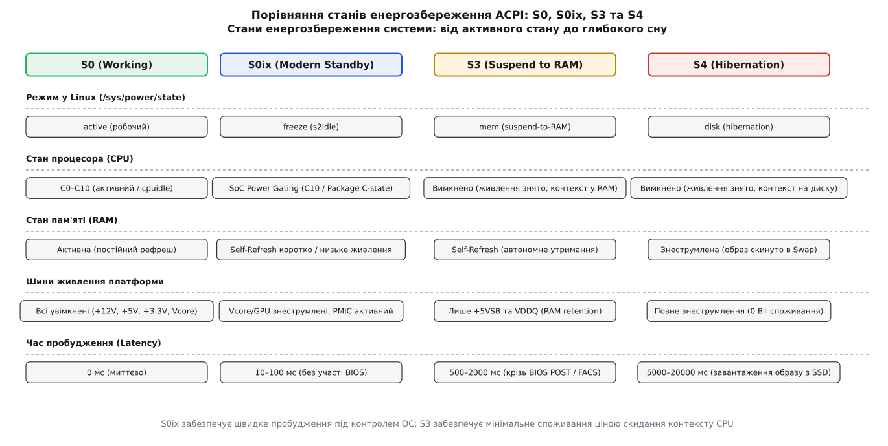
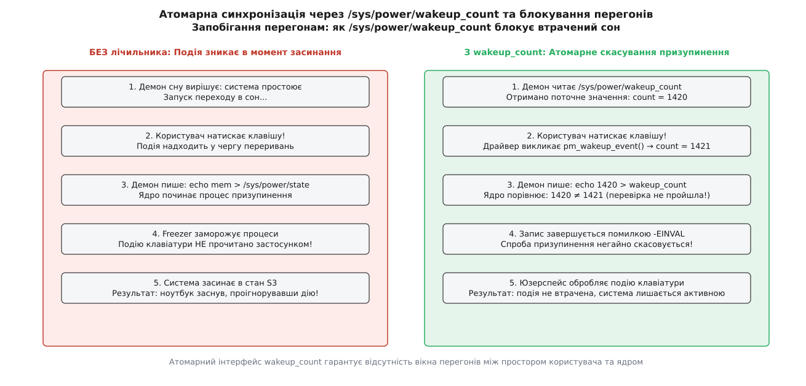
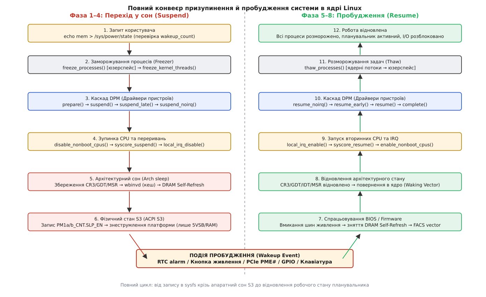
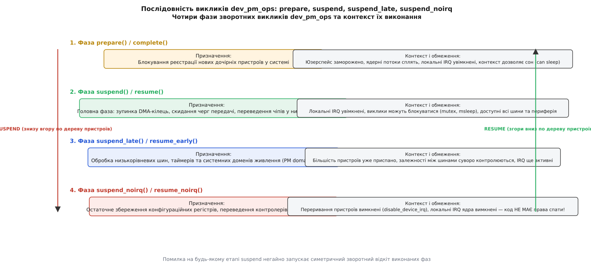

# Призупинення й пробудження системи: suspend to RAM у ядрі

<preknowlist>
- [Модель пристроїв у sysfs](root:sys-unix/sysfs-device-model) — ієрархічне дерево пристроїв ядра, де батьківські вузли забезпечують ресурси живлення для дочірніх.
- [Присипляння пристрою на ходу: runtime PM](root:sys-unix/runtime-power-management) — автоматичне знеструмлення окремих неактивних вузлів системи без зупинки решти машини.
- [Переривання, softirq і робочі черги](root:sys-unix/interrupts-bottom-halves) — як ядро обробляє апаратні сигнали від контролерів та чому обробники не мають права спати.
- [Простій ядра процесора: C-стани й cpuidle](root:sys-unix/cpuidle-and-cstates) — рівні енергозбереження процесорних ядер у моменти відсутності обчислювальних задач.
- [Зв'язки між пристроями: device links](root:sys-unix/device-links) — оголошення функційних залежностей між постачальниками й споживачами живлення поза межами прямого дерева.
- [Ланцюжки сповіщень у ядрі: notifier chains](root:sys-unix/kernel-notifier-chains) — механізм розсилки повідомлень про зміну стану системи між підсистемами ядра.
</preknowlist>

## Від закритої кришки до стану сну: чому не можна просто зняти напругу

Сучасний ноутбук або сервер у робочому стані бездіяльності споживає від 8 до 25 Вт потужності. Якщо просто закрити кришку ноутбука і залишити його з працюючою операційною системою, акумуляторна батарея ємністю 50 Вт·год розрядиться за дві-три години. Водночас у вимкненому стані комп'ютер споживає менше 0,1 Вт, але повне вимкнення знищує стан запущених програм, вимагаючи повторного завантаження ядра, монтування дисків та запуску сесії.

Системне призупинення (*suspend*, від лат. *suspendere* — підвішувати, тимчасово припиняти) та пробудження (*resume*, від лат. *resumere* — відновлювати, брати знову) покликані розв'язати цю дилему: знизити споживання енергії платформи до 0,2–0,5 Вт, зберігши при цьому всі відкриті файли, активні процеси та пам'ять у стані миттєвої готовності.

Здавалося б, найпростіший спосіб заснути — миттєво знеструмити процесор і материнську плату, залишивши живлення лише на планках оперативної пам'яті. Проте спроба зробити це без синхронізованої підготовки гарантовано призводить до краху системи:
1. **Пошкодження файлових систем.** Якщо знеструмити контролер накопичувача в момент, коли процес записує дані у буферний кеш ядра або журнальна структура файлової системи (JBD2 у ext4) наполовину оновила метадані, дискова структура буде незворотно пошкоджена.
2. **Хаос на шинах зв'язку.** Контролери прямого доступу до пам'яті (DMA) продовжуватимуть читати або писати в оперативну пам'ять, коли процесор уже спить, руйнуючи адресний простір ядра.
3. **Втрата апаратного контексту.** Після зняття напруги внутрішні регістри відеокарти, мережевого адаптера та USB-контролера скидаються до початкових значень; після повернення живлення вони не знатимуть своїх попередніх адрес, буферних кілець і дескрипторів.

Саме тому перехід у сон у ядрі Linux — це не апаратне вимкнення, а строгий, багаторівневий програмно-апаратний протокол.

## Стани системного сну: S0, S0ix, S3 та S4

Специфікація ACPI (*Advanced Configuration and Power Interface*) та підсистема керування живленням ядра визначають кілька рівнів системного спокою, що різняться глибиною знеструмлення, енергоспоживанням та часом повернення до роботи.



*Чотири режими енергозбереження системи: від повністю активного стану S0 до знеструмленого стану S4 з переносом образу RAM на диск.*

Головними робочими режимами є:
- **S0 (Working / Active)** — повністю активний стан, у якому система виконує код. Окремі невикористовувані пристрої можуть засинати на ходу через [runtime PM](root:sys-unix/runtime-power-management), а процесори — входити в стани [cpuidle](root:sys-unix/cpuidle-and-cstates).
- **S0ix (Low Power S0 Idle / Modern Standby)** — сучасний стандарт мобільного сну, у якому система формально залишається в стані S0, але всі вузли системи на кристалі (SoC) переведені в найглибші стани апаратного енергозбереження під контролем самої ОС. У ядрі Linux цей режим має назву `s2idle` (*suspend-to-idle*).
- **S3 (Suspend to RAM / STR)** — класичний глибокий сон. Усі процесори, графічні адаптери та системні шини повністю знеструмлюються. Живлення зберігається лише на лініях оперативної пам'яті, яка переводиться в режим автономного самовідновлення заряду (*Self-Refresh*). Споживання системи знижується до часток вата.
- **S4 (Hibernation / Suspend to Disk)** — повне заморожування зі збереженням образу пам'яті у розділ підкачки (swap) або файл на диску, після чого живлення вимикається повністю (0 Вт).

Історичні передумови появи кожного з цих станів, проблеми взаємодії з BIOS та причини переходу індустрії від S3 до S0ix детально розглянуто в нарисі про [еволюцію станів сну від APM до S0ix](root:sys-unix/system-suspend-resume/hist-acpi-sleep-states.md).

## Ініціація з простору користувача та захист від перегонів

Увесь ланцюг системного призупинення починається з простору користувача. Системний демон керування живленням (`systemd-logind` або `upowerd`) фіксує подію (закриття кришки ноутбука, натискання клавіші сну або таймаут бездіяльності) і звертається до файлового інтерфейсу ядра в каталозі `/sys/power/`.

Конфігурація методу сну задається у файлі `/sys/power/mem_sleep`, який підтримує значення `s2idle`, `shallow` (ACPI S1) та `deep` (ACPI S3). Коли у файл `/sys/power/state` записується рядок `mem`, ядро розпочинає синхронний перехід у вибраний режим:

```bash
# Перевірка доступних режимів пам'яті та вибір глибокого сну S3
cat /sys/power/mem_sleep
# [s2idle] deep
sudo sh -c "echo deep > /sys/power/mem_sleep"

# Запуск призупинення системи
sudo sh -c "echo mem > /sys/power/state"
```

Проте наївний запис у `/sys/power/state` містить фундаментальне вікно перегонів (*race condition*).

Уявіть ситуацію: демон вирішив, що система простоює, і збирається записати `mem`. У цей самий момент користувач натискає клавішу на клавіатурі або надходить важливий вхідний пакет по мережі. Контролер клавіатури фіксує переривання і кладе скан-код у буфер черги. Але демон про це ще не знає і відправляє команду сну в ядро. Ядро починає фазу заморожування процесів — користувацький застосунок не встигає прочитати подію, і комп'ютер засинає прямо в руках користувача, «проковтнувши» натискання.



*Ліворуч: перегони без верифікації призводять до втрати події вводу; праворуч: атомарна перевірка лічильника скасовує сон при виявленні події.*

Щоб унеможливити цю ситуацію, ядро надає механізм джерел пробудження (*wakeup sources*) та атомарний лічильник `/sys/power/wakeup_count`. 

Коли драйвер пристрою фіксує вхідну подію, він викликає функцію `pm_stay_awake(dev)` або `pm_wakeup_event(dev, msec)`. Це збільшує системний монотонний лічильник зареєстрованих подій і піднімає внутрішнє блокування.

Коректний протокол простору користувача виконується у три кроки:
1. Демон зчитує поточне число з `/sys/power/wakeup_count` (наприклад, `1420`). Якщо в цей момент активне хоча б одне блокування пробудження, виклик `read()` блокується, поки обробка події не завершиться.
2. Демон записує зчитане число назад: `echo 1420 > /sys/power/wakeup_count`.
3. Ядро атомарно порівнює збережене значення зі своїм поточним лічильником. Якщо між читанням і записом прийшла хоч одна нова подія (лічильник став `1421`), запис повертає помилку `-EINVAL`. Демон фіксує збій перевірки і **скасовує перехід у сон**, повертаючись до обробки користувацького вводу.

Лише якщо запис пройшов успішно, демон виконує фінальний запис `mem` у `/sys/power/state`.

## Повний конвеєр фаз призупинення та пробудження

Перехід системи в стан сну та її повернення до активного стану проходять крізь строго синхронізовану послідовність етапів усередині ядра.



*Послідовність виконання кроків призупинення системи (ліва колонка, зверху вниз) та пробудження (права колонка, знизу вгору).*

Кожен етап конвеєра виконує строго визначену функцію:
1. **Заморожування процесів (Freezer)** — припинення виконання користувацьких задач та ядерних потоків.
2. **Каскад DPM (Device Power Management)** — виклик методів підготовки та призупинення драйверів пристроїв.
3. **Зупинка процесорів та переривань** — виведення з ладу вторинних ядер (CPU Hotplug), зупинка системних таймерів та локальних ліній IRQ.
4. **Архітектурний перехід у сон** — збереження контексту регістрів процесора, скидання кешів у пам'ять та переведення оперативної пам'яті в режим самовідновлення.
5. **Апаратний сон платформи** — взаємодія з контролером живлення ACPI/PMIC та вимкнення силових ліній.
6. **Симетричний зворотний хід (Resume)** — виконання дзеркальних фаз відновлення у зворотному порядку після отримання сигналу пробудження.

Розглянемо кожен із цих механізмів до самого дна.

## Фаза 1: Заморожування процесів (Freezer)

Першою дією ядра після отримання команди на призупинення є виклик підсистеми заморожування задач (*process freezer*).

Процеси не можна залишати активними під час сну драйверів: якщо процес продовжить виконувати системні виклики, виділяти пам'ять або відправляти мережеві сокети, коли пристрої вже знеструмлюються, це призведе до зависань блокуючих м'ютексів та пошкодження структур пам'яті.

Заморожування відбувається у два строго розмежованих етапи:
1. **Заморожування простору користувача (`freeze_processes()`):** Ядро проходить по списку всіх задач `for_each_process()` і встановлює для кожної нитки прапорець заморожування `TIF_FREEZE` (або переводить задачу в стан `TASK_FROZEN`). Якщо процес перебуває у користувацькому просторі або спить перериваним сном (`TASK_INTERRUPTIBLE`), ядро надсилає йому фіктивний сигнал `fake_signal_wake_up()`. Це змушує процес негайно вийти в точку повернення із системного виклику або в цикл обробки сигналів, де макрос `try_to_freeze()` переводить його в неактивний стан спокою, блокуючи на черзі `refrigerator()`.
2. **Заморожування ядерних потоків (`freeze_kernel_threads()`):** Ядерні потоки (такі як робочі черги `kworker`, потік скидання сторінок пам'яті `kswapd`, потік транзакцій журналу `jbd2`) навмисно **не заморожуються на першому етапі**. Вони повинні залишатися працездатними, щоб завершити незавершені операції введення-виведення, скинути «брудні» сторінки буферного кешу на диск та зафіксувати транзакції файлових систем, які створили користувацькі процеси перед своїм заморожуванням. Лише після повної зупинки простору користувача та виконання операції синхронізації файлових систем `ksys_sync()` ядро заморожує фонові ядерні потоки.

Окрему категорію становлять потоки, позначені спеціальним системним прапорцем `PF_NOFREEZE`. До них належать критичні системні компоненти, які забезпечують виконання самої процедури призупинення: черга керування живленням `pm_wq`, сторожовий таймер watchdog та процеси обробки апаратних переривань.

Якщо хоча б один процес завис у стані неперервного сну `TASK_UNINTERRUPTIBLE` (наприклад, чекаючи на відповідь від мертвого сервера NFS або несправного накопичувача) і не відповідає на запит заморожування протягом 20 секунд (таймаут freezer), процедура призупинення аварійно скасовується, а всі вже заморожені задачі негайно розморожуються назад.

## Фаза 2: Чотириетапний каскад драйверів `dev_pm_ops`

Після повної зупинки програмного середовища ядро переходить до присипляння фізичного обладнання. Керування цим процесом здійснює підсистема DPM (*Device Power Management*), обходячи глобальний двозв'язний список пристроїв `dpm_list`.

Порядок обходу пристроїв критично важливий: присипляння завжди відбувається **знизу вгору по дереву пристроїв** — від кінцевих нащадків до кореневих контролерів шин, та від споживачів до постачальників живлення згідно з графом [device links](root:sys-unix/device-links). Наприклад, ядро спочатку присипляє USB-мишу, потім кореневий хаб USB, потім контролер xHCI, і лише наприкінці — міст шини PCI Express.



*Чотири рівні зворотних викликів структури dev_pm_ops: перехід від високорівневої підготовки до низькорівневого атомарного збереження регістрів.*

Кожен драйвер пристрою взаємодіє з підсистемою через чотири послідовні фази зворотних викликів структури `dev_pm_ops`:

### 1. Фаза `prepare(dev)`
Виконується у звичайному процесному контексті з увімкненими перериваннями. Мета виклику — виділити пам'ять під структури збереження стану та заблокувати реєстрацію будь-яких нових дочірніх пристроїв у дереві підсистеми.

### 2. Фаза `suspend(dev)`
Головна фаза знеструмлення пристрою. Драйвер:
- Зупиняє активні операції передачі даних та черги DMA;
- Очікує завершення апаратних транзакцій на шині;
- Скидає невикористані буфери;
- Переводить мікросхему в режим спокою.
У цій фазі локальні переривання процесора ще увімкнені, драйвер має право спати (`might_sleep()`), захоплювати м'ютекси та використовувати системні таймери.

### 3. Фаза `suspend_late(dev)`
Викликається після того, як стандартну фазу `suspend` успішно завершили **всі** зареєстровані пристрої в системі. На цьому етапі обробляються низькорівневі вузли платформи, загальні домени живлення [genpd](root:sys-unix/power-domains-genpd) та шинні комутатори, коли всі кінцеві споживачі вже гарантовано мовчать.

### 4. Фаза `suspend_noirq(dev)`
Критична низькорівнева фаза. Безпосередньо перед її початком ядро викликає функцію `suspend_device_irqs()`, яка програмно вимикає обробку ліній переривань для всіх звичайних пристроїв (`disable_irq_nosync()`).

У фазі `suspend_noirq`:
- Код виконується в атомарному контексті з вимкненими локальними перериваннями ядра (`local_irq_disable()`);
- Драйверу **категорично заборонено спати**, захоплювати блокування, що можуть призвести до перемикання контексту, або чекати таймерів;
- Драйвер зберігає значення останніх апаратних конфігураційних регістрів у системну пам'ять і переводить контролер у фінальний низькоспоживаючий стан шини `D3hot` або `D3cold`.

Повний опис полів структури `dev_pm_ops`, сигнатури функцій та допоміжні макроси визначення наведено в довіднику з [інтерфейсів керування dev_pm_ops та sysfs](root:sys-unix/system-suspend-resume/api-dev-pm-ops.md).

## Асинхронне присипляння пристроїв (`async_suspend`)

Якщо в системі підключено сотні вузлів PCIe, USB та дискових масивів NVMe, послідовний виклик методів `suspend` може зайняти 5–10 секунд.

Для прискорення процесу ядро Linux реалізує механізм паралельного асинхронного сну (`CONFIG_PM_ASYNC`). Коли атрибут `/sys/power/pm_async` увімкнено (значення `1`), ядро викликає зворотні виклики `suspend` для незалежних гілок дерева пристроїв паралельно в асинхронних доменах `async_domain`.

Правильність порядку гарантується бар'єрами завершення (*completion fences*): перш ніж викликати `suspend` для батьківського вузла (наприклад, PCIe Root Port), асинхронний потік ядра очікує через `device_pm_wait_for_dev()`, доки всі його дочірні вузли (відеокарта, NVMe, мережева карта) повністю завершать свої індивідуальні зворотні виклики.

## Фаза 3: Зупинка вторинних CPU, системних переривань та збереження архітектурного стану

Коли всі драйвери пристроїв завершили фазу `suspend_noirq`, у системі лишається активним лише програмне ядро на центральних процесорах. Але перевести комп'ютер у глибокий сон S3 за наявності кількох активних ядер неможливо через проблеми когерентності кешів та апаратну будову материнських плат (шина скиду та прошивка BIOS розраховані на взаємодію виключно з одним завантажувальним ядром — Boot CPU).

Тому ядро виконує процедуру зупинки платформи:

### 1. Відключення вторинних ядер (CPU Hotplug)
Ядро викликає функцію `disable_nonboot_cpus()`. Одне за одним усі ядра процесора з номерами `1 .. N-1` виводяться з експлуатації:
- Планувальник завдань мігрує всі прив'язані нитки та системні таймери на нульове процесорне ядро (CPU 0);
- Ядро надсилає міжпроцесорне переривання IPI (*Inter-Processor Interrupt*);
- Вторинні ядра скидають свої локальні кеші, виконують архітектурну інструкцію зупинки (наприклад, `wfi` на ARM або виклик переходу в стан мертвого циклу `mwait` на x86) і повністю знеструмлюються.

### 2. Зупинка обліку часу та системного ядра (`syscore_suspend`)
На нульовому ядрі вимикається системний годинник `timekeeping_suspend()`, фіксуючи поточний монотонний час і різницю відліку відносно апаратного годинника реального часу RTC.

Після цього викликається `syscore_suspend()` — низькорівневий список операцій системного ядра, який вимикає локальний контролер переривань процесора (Local APIC / IO-APIC на x86 або GIC на ARM) та таймери високої точності (TSC, HPET).

### 3. Збереження архітектурного контексту CPU
Центральний процесор готується до повної втрати живлення. Код ядра на мові асемблера зберігає фундаментальні системні регістри в спеціально виділену структуру в оперативній пам'яті:
- Керуючі регістри процесора: `CR0`, `CR3` (базова адреса кореневої таблиці сторінок віртуальної пам'яті), `CR4`, `CR8`;
- Базові адреси дескрипторних таблиць: регістр глобальної таблиці дескрипторів `GDTR` та таблиці переривань `IDTR`;
- Сегментні регістри (`CS`, `DS`, `ES`, `SS`, `FS`, `GS`), покажчик верхівки стека ядра `RSP` та регістр інструкцій `RIP`;
- Моделезалежні регістри (MSR), включаючи `EFER` (Extended Feature Enable Register) та базу `FS_BASE`/`GS_BASE`.

## Фаза 4: Вхід у стан S3 та утримання пам'яті в Self-Refresh

Тепер система готова до фізичного відключення живлення.

Першим критичним кроком є повне скидання процесорних кешів. Оскільки живлення з процесора буде повністю знято, будь-які «брудні» рядки даних, які залишилися в кеш-пам'яті L1, L2 або L3 і ще не записалися в оперативну пам'ять, будуть незворотно втрачені.

Для цього ядро виконує апаратну інструкцію скидання кешів:
- На архітектурі x86 виконується інструкція `wbinvd` (*Write-Back and Invalidate Caches*), яка примусово скидає всі модифіковані лінії всіх рівнів кешу в DRAM і оголошує кеші недійсними;
- На архітектурі ARM64 викликаються спеціальні інструкції очищення кешу за лініями (`dc civac`).

### Переведення пам'яті в режим Self-Refresh
Контролер оперативної пам'яті (Integrated Memory Controller — IMC) переводить мікросхеми DDR4/DDR5 або LPDDR у режим автономного самовідновлення заряду (*Self-Refresh*).

Мікросхеми динамічної пам'яті DRAM зберігають біти інформації у вигляді електричного заряду на крихітних конденсаторах ємністю кілька десятків фемтофарад. Через струми витоку цей заряд зникає кожні 32–64 мілісекунди. У звичайному робочому режимі контролер пам'яті постійно генерує цикли читання-перезапису (рефреш).

У режимі **Self-Refresh**:
- Контролер пам'яті відключає зовнішній тактовий сигнал шини (шинний клок `CK`/`CK#` зупиняється);
- Кожна мікросхема DRAM активує свій внутрішній наднизькоспоживаючий генератор та лічильник рядків;
- Мікросхеми самостійно освіжають заряд у своїх комірках, споживаючи лише мікроампери струму від чергової лінії живлення пам'яті (VDDQ / VTT retention voltage).

### Запис регістрів ACPI та знеструмлення
Наостанок ядро формує керуюче слово для блоку керування живленням чипсета ACPI:
- У регістр `PM1a_CNT` (та `PM1b_CNT`, якщо присутній) записується бітова маска типу сну `SLP_TYP` (значення для S3, отримане з таблиці DSDT прошивки) разом зі встановленим бітом дозволу переходу `SLP_EN` (Sleep Enable).

```text
       ACPI PM1_CNT Register
┌─────────┬──────────────┬────────┬────────┐
│ 15      │ 12        10 │ 9    2 │ 1    0 │
│ SLP_EN  │   SLP_TYP    │  RES   │ SCI_EN │
│  (1)    │ (S3 encoding)│        │        │
└─────────┴──────────────┴────────┴────────┘
```

Щойно біт `SLP_EN` записано, контролер керування живленням материнської плати (PCH або PMIC) перемикає силові ключі регуляторів напруги:
- Знеструмлюються основні лінії живлення материнської плати: `+12V`, `+5V`, `+3.3V`;
- Знімається напруга живлення з процесорних ядер (`Vcore`) та графічного процесора;
- Активними залишаються виключно чергова лінія `+5VSB` (*Standby*), живлення мікроконтролера вбудованого керування (Embedded Controller — EC) та лінія утримання пам'яті `VDDQ`.

Комп'ютер поринає в стан глибокого апаратного сну S3.

## Фаза 5: Сигнал пробудження та зворотний хід (Resume Flow)

Комп'ютер перебуває в стані сну доти, доки зовнішня апаратна подія не викличе сигнал пробудження.

Джерелами пробудження можуть бути:
- Натискання апаратної кнопки живлення або відкриття кришки ноутбука (сигнал від Embedded Controller);
- Спрацьовування будильника таймера реального часу RTC;
- Повідомлення PME# (*Power Management Event*) від контролера PCI Express (наприклад, надходження магічного пакета Wake-on-LAN на мережеву карту);
- Сигнал відкритого колектора від шини USB при ворушінні мишею або натисканні клавіші;
- Сигнал зміни рівня на спеціальному контакті GPIO на вбудованих платформах ARM.

Сигнал надходить на контролер керування живленням платформи (PCH/PMIC), який негайно запускає силові перетворювачі напруги материнської плати.

### 1. Робота прошивки BIOS/UEFI (Waking Vector)
Після стабілізації напруг живлення процесор апаратно скидається і починає виконання інструкцій у реальному режимі за адресою скиду `0xFFFF_FFF0` всередині прошивки BIOS/UEFI.

Прошивка:
- Визначає за статусом регістрів ACPI (`WAK_STS`), що відбувся вихід зі стану S3, а не «холодний» старт;
- Ініціалізує контролер оперативної пам'яті та виводить DRAM із режиму Self-Refresh;
- Знаходить у таблиці ACPI FACS (*Firmware ACPI Control Structure*) заздалегідь збережену ядром фізичну адресу вектора пробудження `Firmware_Waking_Vector`;
- Здійснює прямий безумовний перехід за цією адресою, повертаючи керування коду Linux.

### 2. Відновлення архітектурного стану Linux
Низькорівневий код відновлення ядра Linux (точка входу `wakeup_start` у файлі `arch/x86/kernel/acpi/wakeup_64.S`):
- Перемикає процесор із 16-бітного реального режиму в 32-бітний захищений, а потім — у 64-бітний довгий режим (*Long Mode*);
- Відновлює значення регістра `CR3`, повертаючи оригінальні таблиці сторінок віртуальної пам'яті ядра;
- Відновлює таблиці дескрипторів `GDTR`, `IDTR`, покажчик стека `RSP` та регістри загального призначення;
- Відновлює збережені значення MSR і повертає керування у функцію мови C `acpi_suspend_enter()`.

### 3. Симетричний каскад зворотного відновлення
Починається розгортання системи у зворотному порядку відносно фаз сну:

1. **`syscore_resume()`:** Відновлюється робота локального контролера переривань Local APIC, таймерів ядра TSC/HPET та підсистеми відліку часу `timekeeping_resume()`, яка обчислює тривалість сну за показами годинника RTC і коригує системний час `CLOCK_BOOTTIME`.
2. **`local_irq_enable()`:** Вмикаються локальні переривання нульового процесорного ядра.
3. **`enable_nonboot_cpus()`:** Через підсистему CPU Hotplug по черзі запускаються вторинні процесорні ядра `1 .. N-1`. Кожне ядро отримує сигнал запуску SIPI (*Startup IPI*), ініціалізує свої локальні таблиці сторінок, підключається до планувальника завдань і починає виконувати фоновий потік простою `idle`.
4. **Каскад DPM (згори вниз по дереву пристроїв):**
   - Викликається `resume_noirq()`: драйвери відновлюють базові конфігураційні регістри мікросхем до того, як будуть дозволені переривання;
   - Викликається `resume_device_irqs()`: вмикаються апаратні переривання пристроїв;
   - Викликається `resume_early()`: піднімаються системні домени живлення та шинні контролери;
   - Викликається `resume()`: драйвери ініціалізують буфери DMA, за потреби завантажують мікрокод прошивки (firmware), скидають лічильники помилок та активують черги передачі;
   - Викликається `complete()`: знімаються блокування реєстрації пристроїв.
5. **Розморожування процесів (`thaw_processes()`):** Підсистема freezer спочатку будить фонові ядерні потоки, а потім — усі користувацькі процеси. Черга `refrigerator()` розблоковується, процеси виходять із системних викликів і повертаються до нормального виконання свого коду.

Система повністю повернулася до активного робочого стану S0.

## Діагностика зависань, трасування та пошук вузьких місць

Через велику кількість ланок у конвеєрі призупинення збої під час сну трапляються нерідко. Основними причинами є помилки в логіці драйверів периферії, конфлікти в таблицях ACPI прошивки BIOS та зависання дискового вводу-виводу при заморожуванні процесів.

Для систематичної локалізації проблеми застосовують чотири основні інструменти ядра:

### 1. Покроковий ізолятор `/sys/power/pm_test`
Дозволяє виконати окремі фази конвеєра з автоматичним поверненням назад через 5 секунд без фізичного знеструмлення материнської плати:
- `echo freezer > /sys/power/pm_test` — перевіряє виключно підсистему заморожування задач;
- `echo devices > /sys/power/pm_test` — тестує проходження методів `suspend` та `resume` усіх драйверів;
- `echo processors > /sys/power/pm_test` — перевіряє вимкнення та повторний запуск процесорних ядер `disable_nonboot_cpus()`;
- `echo core > /sys/power/pm_test` — доходить до фази `syscore_suspend()`.

### 2. Діагностичні прапорці завантаження ядра
Додавання параметрів `no_console_suspend initcall_debug ignore_loglevel` у завантажувач дозволяє:
- Заборонити вимкнення відеокарти або послідовної консолі, зберігши видимість аварійних повідомлень ядра (`kernel panic`) аж до повної зупинки процесора;
- Зафіксувати точний час виконання (у мілісекундах) кожного зворотного виклику `dev_pm_ops`, виявивши пристрої, які затримують перехід у сон або блокують чергу.

### 3. Апаратний трекер збоїв RTC (`CONFIG_PM_TRACE_RTC`)
Якщо машина зависає наглухо на етапі роботи прошивки BIOS або у фазі `resume_noirq` до ініціалізації будь-яких засобів виводу, вмикають `echo 1 > /sys/power/pm_trace`.

Ядро кодує назву поточного виконуваного драйвера та номер рядка в один байт і записує його в пам'ять CMOS годинника RTC. Після примусового апаратного перезавантаження за допомогою кнопки Reset ядро зчитує магічне число з пам'яті RTC і вказує у файлі `/sys/power/pm_trace_dev_match` точне ім'я драйвера, на якому сталося зависання.

### 4. Візуальне трасування через SleepGraph
Утиліта `sleepgraph` на базі `ftrace` автоматизує збір часових міток під час сну та генерує наочний інтерактивний HTML-звіт із повною хронологією роботи кожного пристрою та процесора.

Покрокові сценарії використання цих інструментів, команди аналізу логів та робочі приклади безпечної ініціації сну зібрано в окремому [практикумі діагностики та трасування suspend/resume](root:sys-unix/system-suspend-resume/proj-suspend-debug-trace.md).

## Синтез: баланс між апаратним сном S3 та керованим ОС S0ix

Аналіз внутрішньої будови механізму системного призупинення виявляє фундаментальний інженерний компроміс між двома парадигмами системного сну:

1. **Класичний стан ACPI S3** забезпечує мінімальне можливе енергоспоживання платформи (знеструмлюється все, крім пам'яті), проте платить за це високою ціною: тривалим пробудженням (2–5 секунд), ризиком збоїв у закритому коді прошивки BIOS під час виконання Waking Vector та повною втратою зв'язку з мережею на час сну.
2. **Сучасний стан S0ix (`s2idle`)** не знеструмлює силові лінії платформи повністю, залишаючи керування живленням у руках самої операційної системи. Координуючи переведення блоків процесора у глибокі C-стани, а пристроїв — у низькоспоживаючі режими через [runtime PM](root:sys-unix/runtime-power-management), система досягає практично порівнянного енергоспоживання, забезпечуючи пробудження за лічені десятки мілісекунд, повну прозорість діагностики та підтримку фонових мережевих сповіщень.

Розуміння конвеєра призупинення — від блокування перегонів через `wakeup_count` та заморожування процесів до атомарних викликів `dev_pm_ops` та інструкцій скидання кешів `wbinvd` — дає системному розробнику повний контроль над енергетичною поведінкою Linux-системи на будь-якому апаратному забезпеченні.
