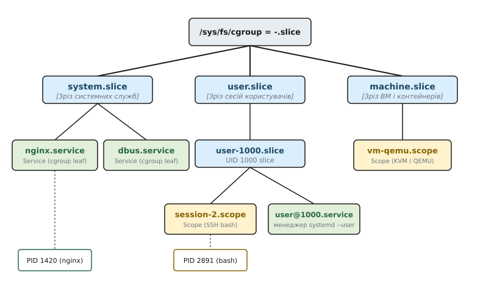
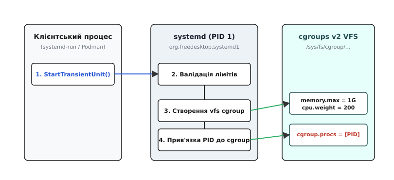
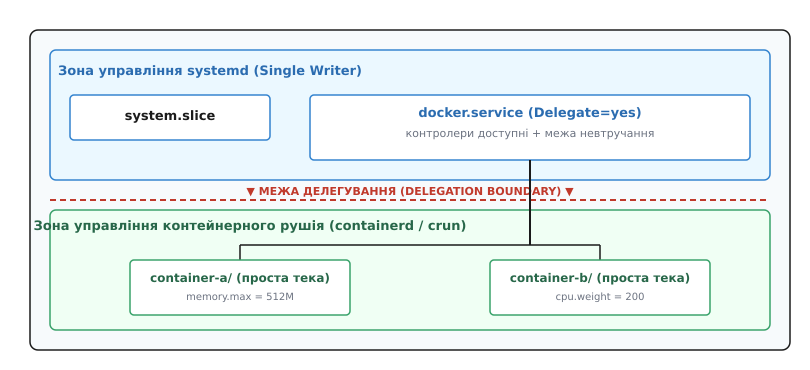

# Архітектура systemd та cgroups: єдина ієрархія

<preknowlist>
- [Cgroups v2: єдина ієрархія](root:sys-unix/cgroups-v2-unified-hierarchy) — як ядро Linux групує процеси та керує ресурсами в єдиному дереві.
- [Модель процесів Linux](root:sys-unix/process-model) — ієрархія PID, створення процесів через fork/exec та обробка сигналів.
</preknowlist>

Коли ядро Linux у версії 2.6.24 запровадило механізм контрольних груп (Control Groups, cgroups), воно створило потужний інструмент для ізоляції, обліку та обмеження використання обчислювальних ресурсів. Проте керувати цим інструментом ядро запропонувало єдиним способом — теками й текстовими файлами віртуальної файлової системи cgroupfs (місце її монтування ядро не диктує; звичку монтувати її в `/sys/fs/cgroup/` дистрибутиви усталили вже згодом) — і не визначило, який саме процес у просторі користувача має бути головним розпорядником та архітектором цієї ієрархії.

У першій версії контрольних груп (cgroups v1) це спричинило системний хаос: десятки незалежних демонів, контейнерних рушіїв та адміністративних скриптів одночасно створювали власні теки у різних файлових системах контролерів. Відсутність єдиної координації призводила до змагань за PID процесів, втрати контролю над дочірніми потоками та неможливості між-контролерного обліку пам'яті й блокового вводу-виводу.

З переходом ядра на cgroups v2 (Unified Hierarchy) та прийняттям фундаментального правила єдиного письменника (*Single Writer Rule*) роль монопольного розпорядника дерева контрольних груп перебрав на себе `systemd` (системний менеджер з `PID 1`). `systemd` об'єднав концепції життєвого циклу служб із ресурсною топологією ядра, перетворивши cgroups із набору низькорівневих ручок у структуровану й передбачувану систему.

## 1. Історичні передумови: від SysV init до правила Single Writer

У класичній системі `SysV init` процес `PID 1` знав про фонову службу рівно одне число — той PID, який демон сам записував у файл `/var/run/service.pid` після подвійного розгалуження (`fork()` → `setsid()` → `fork()`). Це число нічого не гарантувало. Демон міг упасти, не прибравши файл, — і скрипт `/etc/init.d/service stop`, зчитавши застарілий PID, надсилав `SIGTERM` сторонньому процесу, який тим часом дістав той самий номер. А робітники, породжені службою, у файлі не згадувалися взагалі: після загибелі головного процесу вони лишалися в системі, споживали ресурси й були повністю невидимі для менеджера. Як галузь ішла від цієї ниточки до нинішнього стану, де належність процесу службі знає саме ядро, — [історія від SysVinit до cgroup single writer](root:sys-unix/systemd-architecture-and-cgroups/hist-sysvinit-to-cgroup-single-writer.md).

Cgroups v1 (код прийнято в дерево 2007 року, випуск ядра 2.6.24 — січень 2008) дали ядру групи процесів, але не дали відповіді, хто ці групи створює. Кожен контролер (`cpu`, `memory`, `blkio`, `pids`, `freezer`) монтувався окремою віртуальною файловою системою за шляхом `/sys/fs/cgroup/<controller>/`, і теки в цих незалежних деревах паралельно творили `libcgroup`, `libvirt`, ранні версії `Docker` та скрипти адміністраторів — так виникла проблема багатьох письменників (*Multi-Writer Problem*). Найдорожче некоординованість коштувала на межі контролерів: брудні сторінки, які процес із групи `GroupA` лишив у кеші, писали на диск пізніше фонові потоки ядра `kworker` — а вони діяли поза `GroupA`, тож контролер `blkio` зараховував увесь цей запис кореневій групі й лишався безпорадним перед фоновим вивантаженням кешу (*Page Cache Writeback Problem*).

### Ера гібридного режиму та перехід до Unified Hierarchy
На переході від cgroups v1 до v2 дистрибутиви Linux тривалий час використовували так званий гібридний режим (*Hybrid Mode*). У цьому режимі `systemd` створював власне іменоване дерево cgroup v1 без контролерів за шляхом `/sys/fs/cgroup/systemd/` виключно для надійного трекінгу PID та життєвого циклу процесів, тоді як ресурси обмежувалися через окремі контролери v1 (`cpu`, `memory`). Лише параметр ядра `systemd.unified_cgroup_hierarchy=1` дозволяв повністю увімкнути чисту ієрархію cgroups v2.

Для остаточної ліквідації системного хаосу розробники ядра Linux разом із командою `systemd` довели cgroups v2 із єдиною ієрархією (*Unified Hierarchy*) до стабільного стану в ядрі 4.5 (березень 2016 року) та закріпили правило єдиного письменника (*Single Writer Rule*).

Згідно з цим правилом:
1. Файлова система cgroups v2 має єдиний корінь `/sys/fs/cgroup/` для всіх ресурсних контролерів.
2. Лише один процес у системі має право здійснювати прямий запис у віртуальну файлову систему cgroups — системний менеджер `systemd` (`PID 1`).
3. Усі інші програми (контейнерні рушії, віртуальні машини, користувацькі скрипти) зобов'язані звертатися до `systemd` через IPC-інтерфейс DBus для створення своїх груп або отримання делегованих піддерев.

## 2. Топологія дерева cgroups: Slice, Scope, Service

Отримавши монопольний контроль над `/sys/fs/cgroup/`, `systemd` мапує свої внутрішні концепції життєвого циклу процесів безпосередньо на структуру каталогів віртуальної файлової системи ядра. Усі процеси в системі розподіляються між трьома основними типами юнітів.


*Ієрархічне дерево cgroups v2 під управлінням systemd: мапінг зрізів (slice), служб (service) та областей (scope) на файлову систему /sys/fs/cgroup.*

### Зріз (Slice)
Зріз являє собою логічний вузол-контейнер у дереві cgroups. Зрізи не містять процесів безпосередньо у своєму каталозі; вони призначені для ієрархічного групування інших зрізів, служб або областей та визначення для них спільних бюджетів ресурсів.

Корінь дерева systemd теж називає зрізом — `-.slice`; безпосередньо під ним типово стоять три зрізи верхнього рівня:
1. `system.slice` — містить усі системні служби та демони, які запускаються при старті операційної системи (наприклад, `systemd-journald.service`, `systemd-resolved.service`, `sshd.service`, `nginx.service`).
2. `user.slice` — контейнер для інтерактивних та фонових сесій користувачів. Усередині нього `systemd` динамічно створює персональні підзрізи для кожного ідентифікатора UID (наприклад, `user-1000.slice` для користувача з UID 1000). Усередині персонального зрізу розміщуються сервіси користувача (`user@1000.service`) та сесії командної оболонки.
3. `machine.slice` — призначений для ізоляції віртуальних машин (під управлінням KVM/QEMU через `libvirt`) та системних контейнерів (наприклад, `systemd-nspawn` або LXC).

### Служба (Service)
Служба являє собою юніт, чий життєвий цикл повністю контролюється `systemd` на основі декларативного файлу конфігурації `.service`. `systemd` сам викликає `fork()` та `execve()` для запуску головного процесу служби, створює для нього відповідну теку cgroup (наприклад, `/sys/fs/cgroup/system.slice/nginx.service/`) та поміщає туди PID стартового процесу. 

Завдяки тому, що ядро Linux гарантує збереження приналежності до cgroup при системних викликах `fork()`, усі дочірні процеси, які створює служба під час роботи (наприклад, робітники Nginx або пули потоків), атомарно опиняються всередині цієї ж cgroup. Навіть якщо головний процес виконає подвійне розгалуження і завершиться, `systemd` бачитиме всі дочірні PID у файлі `cgroup.procs` і зможе повністю очистити службу надсиланням сигналу `SIGKILL`.

### Область (Scope)
Область призначена для управління ресурсами процесів, які були запущені ззовні менеджера `systemd` (без використання конфігураційного файлу `.service`), але мають бути взяті під нагляд ресурсної системи. Наприклад, коли користувач підключається через SSH, PAM-модуль `pam_systemd` реєструє сесію в демоні `systemd-logind`, а вже той просить менеджер створити юніт `session-2.scope` та перемістити туди PID командної оболонки `bash`. Області також створюються утилітою `systemd-run` для разового виконання команд із примусовим обмеженням ресурсів.

### Заморожування юнітів через cgroup.freeze
У cgroups v2 заморожування перестало бути окремим контролером, який треба вмикати: файл `cgroup.freeze` є в кожному вузлі як частина базового інтерфейсу, і `systemd` користується саме ним. Замість надсилання сигналу `SIGSTOP` кожному процесу окремо (що могло спричинити перехоплення сигналу або змагання при створенні нових потоків), `systemd` записує значення `1` у файл `cgroup.freeze` відповідного юніта. Ядро атомарно призупиняє виконання всіх процесів та потоків у cgroup на рівні планувальника. Це використовується під час створення знімків стану, діагностики або тимчасового призупинення служб командою `systemctl freeze`.

### Правило No Internal Processes у cgroups v2
При побудові ресурсної топології `systemd` суворо дотримується фундаментального правила ядра cgroups v2: «жодних внутрішніх процесів» (*no internal processes*). 

Згідно з цим правилом, якщо вузол cgroup має активні контролери ресурсів у файлі `cgroup.subtree_control` (наприклад, `cpu` або `memory`), він **не може містити PID процесів безпосередньо у своєму файлі `cgroup.procs`** — і навпаки, у вузол із процесами ядро не дасть увімкнути контролери для нащадків. Процеси дозволено розміщувати виключно в листкових вузлах (*leaf nodes*) дерева; виняток — кореневий вузол, який тримає ще й потоки ядра.

Якщо адміністратор або програма намагається додати PID безпосередньо у проміжний зріз `system.slice`, ядро повертає помилку `-EBUSY`. `systemd` не обходить це обмеження, а будує дерево так, щоб воно взагалі не порушувалося: зрізи не містять процесів, процеси живуть лише у службах та областях, а сам `PID 1` винесено в окремий листок `init.scope`. Коли служба з `Delegate=` неминуче стає внутрішнім вузлом, менеджер запускає її допоміжні команди (`ExecStartPost=`, `ExecReload=`, `ExecStop=`, `ExecStopPost=`) у підгрупі `.control/`, а від версії 254 може одразу покласти головний процес у підгрупу, названу директивою `DelegateSubgroup=`. Це гарантує, що ресурси розділяються між дочірніми групами математично коректно, без спотворень, викликаних процесами проміжного рівня.

## 3. Декларативне керування ресурсами: мапінг директив на атрибути VFS

Одна з головних переваг архітектури `systemd` полягає у створенні стабільного шару абстракції між конфігурацією користувача та внутрішніми атрибутами віртуальної файлової системи ядра. Адміністратору або розробнику більше не потрібно знати конкретні шляхи в `/sys/fs/cgroup/` або специфіку конкретної версії ядра: обмеження задаються декларативно в Unit-файлі, а `systemd` транслює їх у відповідні контролери.

```ini
[Unit]
Description=High Load Processing Service

[Service]
ExecStart=/usr/bin/data-processor
Restart=always

# Обмеження CPU (пропорційна вага та жорстка квота)
CPUWeight=500
CPUQuota=200%

# Оптимізація та захист оперативної пам'яті
MemoryMin=512M
MemoryLow=1G
MemoryHigh=3G
MemoryMax=4G
MemoryZSwapMax=512M

# Обмеження дискового вводу-виводу та кількості процесів
IOWeight=200
TasksMax=512
```

У таблиці нижче наведено мапінг найуживаніших декларативних директив `systemd` на атрибути файлової системи cgroups v2:

| Директива systemd | Файл cgroups v2 | Діапазон / Формат | Детальний механізм дії ядра |
| :--- | :--- | :--- | :--- |
| `CPUWeight=` | `cpu.weight` | `1` … `10000` (типово `100`) | Пропорційний розподіл процесорного часу між сусідніми вузлами за наявності конкуренції (CFS/EEVDF scheduler). |
| `CPUQuota=` | `cpu.max` | `quota period` у мікросекундах (наприклад `200000 100000`) | Жорстка квота CPU. Значення `200%` означає 200 000 мкс (200 мс) процесорного часу за кожний період у 100 000 мкс (100 мс) — еквівалент 2 ядер. |
| `MemoryMin=` | `memory.min` | Байти (`M`, `G`) | Жорстка гарантія пам'яті. Ядро ніколи не відбирає цю пам'ять при reclaim, навіть якщо система відчуває гострий дефіцит. |
| `MemoryLow=` | `memory.low` | Байти (`M`, `G`) | М'який захист пам'яті. Вивантажується на диск лише тоді, коли вичерпано весь незахищений кеш інших груп. |
| `MemoryHigh=` | `memory.high` | Байти (`M`, `G`) | Поріг дроселювання (*throttling*). При перевищенні ядро змушує процеси групи виконувати синхронне вивантаження сторінок, сповільнюючи їх роботу. |
| `MemoryMax=` | `memory.max` | Байти (`M`, `G`) | Абсолютна межа оперативної пам'яті. Перевищення активує OOM Killer ядра або `systemd-oomd`. |
| `MemorySwapMax=` | `memory.swap.max` | Байти (`M`, `G`) | Максимально дозволений обсяг сторінок пам'яті цієї cgroup, вивантажених у розділ підкачки (swap). |
| `MemoryZSwapMax=` | `memory.zswap.max` | Байти (`M`, `G`) | Обмеження на максимальний обсяг стиснутої пам'яті у пулі zswap для цієї cgroup. |
| `IOWeight=` | `io.weight` | `1` … `10000` (типово `100`) | Пропорційна вага дискового часу; діє лише там, де ваги хтось розподіляє — планувальник BFQ або контролер `io.cost`. |
| `IOReadBandwidthMax=` | `io.max` | `MAJ:MIN bytes_per_sec` | Жорстке обмеження швидкості зчитування з конкретного блокового пристрою (Major:Minor ID). |
| `TasksMax=` | `pids.max` | Число або `infinity` | Максимальна сумарна кількість процесів та потоків у cgroup. Захищає систему від форк-бомб. |

### Деталізація механіки контролерів

#### Процесорний контролер (`cpu`)
Директива `CPUWeight=` задає пропорційну вагу від 1 до 10000. Якщо у зрізі функціонують дві служби з вагами 100 та 300, то при 100% завантаженні CPU перша служба отримає 25% обчислювальної потужності, а друга — 75%. Якщо конкуренція відсутня, одна служба може споживати 100% CPU незалежно від ваги.

Директива `CPUQuota=` задає жорстку абсолютну межу через файл `cpu.max`. Формат файлу містить два числа: квоту та період у мікросекундах. Період типово дорівнює 100 000 мкс, тобто 100 мс (його змінює директива `CPUQuotaPeriodSec=`). Наприклад, `CPUQuota=150%` записує значення `150000 100000` у файл `cpu.max`: процеси групи можуть сумарно виконуватися 150 мс процесорного часу протягом кожного 100-мілісекундного періоду — півтора ядра. При вичерпанні квоти ядро переводить процеси групи у стан сну до початку наступного періоду (індикатор `nr_throttled` у `cpu.stat`).

#### Контролер пам'яті (`memory` та `zswap`)
У cgroups v2 ієрархія захисту пам'яті будується за каскадним принципом:
1. `memory.min` (hard protection) — фундаментальний резерв. Навіть якщо загальна система входить у стан OOM, сторінки пам'яті з цієї групи не підлягають вилученню.
2. `memory.low` (soft protection) — у разі дефіциту пам'яті ядро спочатку відбирає сторінки у груп, які не мають захисту `memory.low` або перевищили його. Лише коли незахищена пам'ять вичерпана, ядро почне пропорційно вивантажувати сторінки з груп із захистом `memory.low`.
3. `memory.high` (throttling threshold) — поріг м'якого обмеження. Коли обсяг пам'яті переходить `memory.high`, ядро не викликає OOM Killer: воно змушує сам процес вивантажувати власні сторінки прямо в шляху обліку нової сторінки (*direct reclaim*), а якщо група тримається над порогом — додає їй штрафний сон на виході в простір користувача. Виділення не відмовляє, воно просто дорожчає.
4. `memory.max` (hard limit) — при досягненні цього значення ядро робить останню спробу синхронно вивільнити пам'ять у межах самої групи. Якщо вільну пам'ять знайти не вдається, викликається OOM Killer.
5. `memory.zswap.max` — регулює максимальний обсяг оперативно стисненої пам'яті у пулі zswap. Це запобігає ситуації, коли один процес із витоком пам'яті заповнює всю підсистему zswap, позбавляючи інші сервіси стиснутої кеш-пам'яті.

Також ядро надає файл `memory.events`, через який `systemd` за допомогою виклику `epoll()` отримує сповіщення про події `low`, `high`, `max`, `oom` та `oom_kill` — тобто дізнається про дроселювання чи OOM у юніті одразу, а не постійним перечитуванням файлів.

## 4. Програмний IPC-інтерфейс: шина DBus та org.freedesktop.systemd1

Оскільки ядро у режимі cgroups v2 забороняє довільним процесам простору користувача писати в `/sys/fs/cgroup/`, будь-яке динамічне створення контрольних груп або зміна лімітів під час виконання має здійснюватися через програмний інтерфейс `systemd`.

Зв'язок із менеджером `systemd` виконується через системну шину повідомлень DBus (System Bus). Сам сокет `/run/dbus/system_bus_socket` слухає не менеджер, а брокер шини `dbus-daemon` (або `dbus-broker`): клієнт і `systemd` обидва під'єднуються до нього як рівні учасники, а брокер маршрутизує виклики за іменем призначення. `systemd` реєструє на шині ім'я `org.freedesktop.systemd1` і приймає виклики до об'єкта `/org/freedesktop/systemd1` під інтерфейсом `org.freedesktop.systemd1.Manager`. Власний сокет менеджер теж має — `/run/systemd/private`; через нього говорить `systemctl`, коли брокер ще не піднято (рання стадія завантаження, режим порятунку).


*Послідовність створення тимчасового юніта та налаштування лімітів cgroups через DBus-інтерфейс org.freedesktop.systemd1.*

Центральним методом для створення нових ізольованих середовищ є `StartTransientUnit`. Цей метод дозволяє атомарно створити тимчасовий юніт (Transient Service або Transient Scope), застосувати обмеження cgroups та запустити його в системі без запису конфігураційних файлів на диск. Для області в тому ж виклику передають перелік PID уже наявних процесів, які треба туди перемістити; службі PID не передають — її процес менеджер породжує сам.

Повний опис контрактів, методів та кодів помилок цього інтерфейсу наведено у матеріалі [специфікація DBus-інтерфейсу org.freedesktop.systemd1](root:sys-unix/systemd-architecture-and-cgroups/api-dbus-systemd1.md).

При формуванні DBus-повідомлення параметри ресурсів передаються у вигляді масиву `a(sv)` (масив структур із двох елементів: текстової назви властивості та варіанта з її значенням).

Основні методи інтерфейсу `org.freedesktop.systemd1.Manager`:
- `StartTransientUnit(s name, s mode, a(sv) properties, a(sa(sv)) aux)` — створює та запускає тимчасовий юніт із вказаними лімітами.
- `SetUnitProperties(s name, b runtime, a(sv) properties)` — динамічно змінює ліміти ресурсів cgroups для вже працюючого юніта. Якщо `runtime = 1`, зміни діють до перезавантаження; якщо `runtime = 0`, `systemd` записує конфігураційний файл у каталог `/etc/systemd/system.control/`.
- `StopUnit(s name, s mode)` — зупиняє юніт та надсилає сигнал `SIGTERM`/`SIGKILL` усім процесам його cgroup.
- `ResetFailedUnit(s name)` — скидає прапор аварійного стану (`failed`), дозволяючи повторний запуск юніта.

### Розмежування системної та користувацької шини (System vs User Bus)
Окрім системного екземпляра `systemd` (`PID 1`), кожен активний користувач має власний екземпляр `systemd --user`, який керує сервісами користувача всередині `user-1000.slice/user@1000.service/`. Непривілейовані програми можуть звертатися до користувацької шини DBus (через сокет `/run/user/1000/bus`) і викликати `StartTransientUnit` без права суперкористувача `root`. Екземпляр `systemd --user` створює тимчасовий юніт у межах делегованого йому піддерева cgroup.

Для низькорівневої роботи з цим API з мов C та C++ використовується офіційна бібліотека `libsystemd` (компонент `sd-bus`). Повний практичний приклад створення та налаштування `Scope` через `sd-bus` з обробкою помилок наведено у матеріалі [практичний виклик transient units з C та C++](root:sys-unix/systemd-architecture-and-cgroups/proj-transient-unit-dbus.md).

## 5. Делегування cgroups: Delegate=yes та межа відповідальності

Прийняття правила єдиного письменника створило потенційний архітектурний конфлікт із контейнерними рушіями (`Docker`, `Podman`, `containerd`, `cri-o`, `crun`). Контейнерні рушії за своєю природою мають створювати власні піддерева cgroups для ізоляції окремих контейнерів всередині спільної системи. Якщо `systemd` вважає всю файлову систему `/sys/fs/cgroup/` власною територією, він сприйматиме підгрупи, створені `Docker`, як несанкціоноване «сміття» і видалятиме їх під час прибирання неактивних юнітів.

Для розв'язання цього конфлікту `systemd` реалізував механізм **делегування** (*Delegation*).


*Розмежування відповідальності між systemd та контейнерним рушієм при увімкненому розширенні Delegate=yes.*

Коли у конфігурації служби (наприклад, `docker.service` або `containerd.service`) вказано директиву `Delegate=yes`, `systemd` змінює свою поведінку щодо cgroup цієї служби:

1. **Передача прав власності (`chown`)**: якщо служба працює під непривілейованим користувачем (`User=`), `systemd` змінює власника каталогу cgroup та ключових файлів управління (`cgroup.procs`, `cgroup.subtree_control`) на цього користувача — інакше рушій просто не зміг би створювати теки нижче.
2. **Доступність контролерів**: `systemd` вмикає запитані контролери на батьківському рівні, тож у вузлі служби з'являються файли `cpu.max`, `memory.max` і решта. Увімкнути їх для власних піддерев рушій має вже сам — записом на кшталт `+memory` у свій `cgroup.subtree_control`; менеджер цього за нього не робить.
3. **Межа невтручання**: `systemd` припиняє рекурсивний моніторинг та сканування файлової системи під цим вузлом. Контейнерний рушій отримує повну свободу створювати піддерева cgroups будь-якої глибини (наприклад, `/sys/fs/cgroup/system.slice/docker.service/buildkit/container-123/`).

Директива `Delegate=` приймає не лише `yes`/`no`: замість булевого значення їй можна дати перелік контролерів і точно обмежити, які саме ресурси дозволено розподіляти делегованому менеджерові. Наприклад, `Delegate=cpu memory` дозволить контейнерному рушію ділити процесор та оперативну пам'ять між контейнерами, але залишить контроль над блоковим вводом-виводом (`io`) за головним менеджером системи. (На шині DBus цей самий перелік має власне ім'я властивості — `DelegateControllers` типу `as`.)

### Безпривілейовані (Rootless) контейнери
Делегування у cgroups v2 відіграє вирішальну роль у функціонуванні безпривілейованих контейнерів (Rootless Docker / Podman). Оскільки семантика ядра v2 дозволяє передавати право володіння теками cgroup звичайним користувачам, `systemd` при вході користувача створює делегований зріз усередині `user-1000.slice`. Звичайний користувач може запускати Podman і створювати власні підгрупи cgroups для контейнерів без використання прав `root`, що було фундаментально неможливим у cgroups v1.

## 6. Інтеграція з OOM Killer та systemd-oomd

Суттєвим досягненням архітектури `systemd` та cgroups v2 стала якісно нова інтеграція з механізмом ліквідації дефіциту оперативної пам'яті ядра (Out-Of-Memory Killer).

У cgroups v1 ядро реалізовувало точкове знищення процесів. Коли група вичерпувала ліміт пам'яті, ядро вибирало один конкретний процес із найвищим показником `oom_score` всередині цієї групи і надсилало йому `SIGKILL`. Це часто призводило до «зомбі-стану» системних служб: якщо служба складалася з головного процесу та десятка робочих процесів, вбивство одного робітника не вирішувало проблему витоку пам'яті, але залишало службу у зламаному, непрацездатному стані.

У cgroups v2 з'явився атрибут `memory.oom.group`. Якщо у файл `memory.oom.group` записати значення `1`, ядро змінює семантику OOM: при вичерпанні пам'яті ядро ліквідує **всі процеси у цій cgroup одночасно**.

`systemd` експонує цю функціональність через директиву `OOMPolicy=`:
- `OOMPolicy=stop` (типово) — при виникненні OOM у cgroup `systemd` зупиняє службу через стандартний механізм `StopUnit`.
- `OOMPolicy=kill` — якщо хоча б один процес юніта викликає OOM, ядро негайно вбиває весь юніт цілком (`SIGKILL`), після чого `systemd` очищає ресурси та виконує автоматичний перезапуск служби (якщо налаштовано `Restart=on-failure`).
- `OOMPolicy=continue` — передає управління стандартному механізму ядра для вбивства окремих PID.

### Демон користувацького простору systemd-oomd та ManagedOOMPreference
Окрім ядерного OOM Killer, сучасний `systemd` має у своєму складі фоновий демон `systemd-oomd`. Він працює у просторі користувача та використовує атрибути Pressure Stall Information (PSI), доступні у файлі `memory.pressure`.

PSI дає змогу виміряти відсоток часу, який процеси витрачають в очікуванні звільнення сторінок пам'яті. Файл `memory.pressure` містить ряди показників `some` та `full` для інтервалів 10, 60 та 300 секунд:
- `some` — відсоток часу, протягом якого хоча б один процес у cgroup заблокований на очікуванні пам'яті.
- `full` — відсоток часу, протягом якого **усі процеси, що мають роботу** (non-idle), у cgroup заблоковані на очікуванні пам'яті: група стоїть повністю.

Нагляд `systemd-oomd` не всеосяжний: юніт бере в ньому участь лише тоді, коли сам про це просить директивами `ManagedOOMMemoryPressure=kill` або `ManagedOOMSwap=kill` (у типових дистрибутивах їх виставлено на зрізах користувача). Далі демон стежить за двома різними речами й на кожну реагує своїм правилом вибору жертви:

- **Тиск пам'яті.** Якщо у зрізі під наглядом (наприклад, `user.slice`) показник `memory.pressure` тримається вище порога довше за задану тривалість (типово 60% протягом 30 секунд — параметри `DefaultMemoryPressureLimit=` та `DefaultMemoryPressureDurationSec=` у `oomd.conf`), демон убиває ту з дочірніх груп, яка **найінтенсивніше сканувала сторінки при вивільненні** — тобто має найбільший приріст лічильника `pgscan`. Це не те саме, що «найбільша за обсягом»: жертвою стає група, яка створює тиск, а не просто велика й спокійна.
- **Вичерпання підкачки.** Якщо swap заповнено понад `SwapUsedLimit=` (типово 90%), демон убиває дочірню групу з **найбільшим використанням swap**.

В обох випадках рішення ухвалюється **до того**, як система увійде в каскадний swap-шторм і перестане відповідати на команди. Кандидатами є лише нащадки зрізу, на якому ввімкнено нагляд (сам він недоторканний), і серед них — тільки листкові групи або групи з `memory.oom.group=1`: демон завжди прибирає юніт цілком, а не окремий процес усередині нього.

Вибір жертви додатково регулюється директивою `ManagedOOMPreference=`:
- `ManagedOOMPreference=none` (типово) — cgroup бере участь у виборі на загальних підставах.
- `ManagedOOMPreference=avoid` — просити `systemd-oomd` уникати ліквідації цієї cgroup, доки є інші можливі кандидати.
- `ManagedOOMPreference=omit` — повністю виключити юніт із розрахунків `systemd-oomd` (використовується для критичних компонентів, як-от бази даних чи DNS-сервери).

## 7. Практичний інструментарій інспекції, мережевого контролю та eBPF

Для діагностики та налаштування ресурсної топології cgroups в операційних системах під управлінням `systemd` розроблено цілий комплекс утиліт простору користувача.

```bash
# 1. Перегляд рекурсивного дерева cgroups та прикріплених процесів
systemd-cgls

# 2. Моніторинг використання CPU, Memory та IO у реальному часі (аналог top)
systemd-cgtop

# 3. Динамічне встановлення ліміту пам'яті для запущеної служби на льоту
systemctl set-property nginx.service MemoryMax=2G CPUWeight=300

# 4. Перевірка приналежності конкретного PID до cgroup у vfs
cat /proc/1420/cgroup

# 5. Інспекція згенерованих файлів обмежень cgroups v2 у /sys/fs
cat /sys/fs/cgroup/system.slice/nginx.service/memory.max
cat /sys/fs/cgroup/system.slice/nginx.service/cpu.weight
```

Утиліта `systemd-cgls` формує наочне дерево усіх зрізів, служб та областей, показуючи точний мапінг PID на файлову систему cgroups. Це дозволяє миттєво знайти процеси, які відв'язалися від головного подвійним розгалуженням: у дереві вони все одно лежать у теці своєї служби.

Команда `systemctl set-property` дозволяє змінювати параметри ресурсів без зупинки служби. При цьому `systemd` створює конфігураційний файл-доповнення (*drop-in file*): тимчасовий — `/run/systemd/system.control/nginx.service.d/50-MemoryMax.conf`, або постійний — у каталозі `/etc/systemd/system.control/`.

### Налаштування лімітів через динамічні зрізи (Transient Slices)
За допомогою утиліти `systemd-run` адміністратор або автоматизовані скрипти можуть створювати нові проміжні зрізи прямо під час виконання:
```bash
# Створення динамічного зрізу з обмеженням пам'яті та запуск у ньому команди
systemd-run --slice=custom-build.slice --unit=heavy-compile -p MemoryMax=4G make -j8
```
Тут варто знати правило іменування зрізів: дефіс у назві — це роздільник рівнів дерева, а не звичайний символ. Зріз `custom-build.slice` автоматично стає дитиною зрізу `custom.slice`, і `systemd` створює обидва: шлях виходить `/sys/fs/cgroup/custom.slice/custom-build.slice/`. Уже всередині нього постає служба `heavy-compile.service`, і значення `memory.max` записується саме у cgroup служби: параметр `-p` завжди належить тому юнітові, який створює команда, а не зрізу. Щоб обмежити цілий зріз, ліміт задають окремо — `systemctl set-property custom-build.slice MemoryMax=4G`. Агрегація обліку ресурсів у cgroups v2 гарантує, що показник `memory.current` батьківського зрізу автоматично відображає сумарне споживання пам'яті всіх його дочірніх юнітів.

### Інтеграція cgroups з eBPF для мережевої ізоляції
Сучасний `systemd` розширює функціональність cgroups v2 шляхом підключення програм eBPF безпосередньо до вузлів ієрархії cgroups (`BPF_PROG_TYPE_CGROUP_SKB` та `BPF_PROG_TYPE_CGROUP_DEVICE`).

Коли в Unit-файлі вказуються директиви:
- `IPAddressAllow=192.168.1.0/24`
- `IPAddressDeny=any`
- `DeviceAllow=/dev/null r`

`systemd` компілює ці правила у байткод eBPF та завантажує їх у ядро, прив'язуючи до cgroup відповідного юніта. Ядро перевіряє кожен сокетний пакет або спробу доступу до пристрою на рівні cgroup. Це перетворює cgroup на периметр безпеки, вбудований у ядро, — його неможливо обійти навіть при використанні системних викликів `unshare()` чи маніпуляціях з сокетами.

Для інспекції DBus-з'єднань використовується утиліта `busctl`:
```bash
# Перегляд усіх об'єктів юнітів systemd у шині DBus
busctl tree org.freedesktop.systemd1

# Інспекція конкретних властивостей юніта через DBus
busctl introspect org.freedesktop.systemd1 /org/freedesktop/systemd1/unit/nginx_2eservice

# Моніторинг подій та сигналів systemd у реальному часі
busctl monitor org.freedesktop.systemd1
```

## 8. Практичні приклади конфігурації та програмного виклику

Нижче наведено практичні приклади створення та управління cgroup-ізоляцією у `systemd` за допомогою конфігураційних файлів unit, інструменту командного рядка `systemd-run` та програмного API мовами C та C++.

:::tabs
```ini
# /etc/systemd/system/analytics-worker.service
[Unit]
Description=Analytics Processing Worker Service
After=network.target

[Service]
Type=simple
ExecStart=/usr/local/bin/analytics-processor --threads 8
Restart=on-failure

# Параметри ресурсного контролю cgroups v2
CPUWeight=400
CPUQuota=150%
MemoryHigh=1500M
MemoryMax=2000M
MemoryZSwapMax=512M
OOMPolicy=kill
TasksMax=256
```
```bash
# Динамічний запуск командного процесу у тимчасовому Scope з обмеженнями
systemd-run --scope \
  -p MemoryMax=1G \
  -p CPUWeight=200 \
  -p Description="Isolated Heavy Build Task" \
  make -j4
```
```c
// Створення тимчасового Scope через C API (libsystemd sd-bus)
#include <systemd/sd-bus.h>
#include <stdio.h>
#include <stdlib.h>
#include <unistd.h>
#include <stdint.h>

int create_scoped_cgroup(const char *scope_name, uint64_t mem_bytes) {
    sd_bus *bus = NULL;
    sd_bus_message *m = NULL;
    sd_bus_error error = SD_BUS_ERROR_NULL;
    int r;

    r = sd_bus_open_system(&bus);
    if (r < 0) return r;

    r = sd_bus_message_new_method_call(bus, &m,
        "org.freedesktop.systemd1",
        "/org/freedesktop/systemd1",
        "org.freedesktop.systemd1.Manager",
        "StartTransientUnit");
    if (r < 0) goto cleanup;

    r = sd_bus_message_append(m, "ss", scope_name, "fail");
    if (r < 0) goto cleanup;

    // Відкриваємо масив properties a(sv)
    r = sd_bus_message_open_container(m, 'a', "(sv)");
    if (r < 0) goto cleanup;

    // PIDs
    sd_bus_message_open_container(m, 'r', "sv");
    sd_bus_message_append(m, "s", "PIDs");
    sd_bus_message_open_container(m, 'v', "au");
    uint32_t pid = (uint32_t)getpid();
    sd_bus_message_append_array(m, 'u', &pid, sizeof(pid));
    sd_bus_message_close_container(m);
    sd_bus_message_close_container(m);

    // MemoryMax
    sd_bus_message_open_container(m, 'r', "sv");
    sd_bus_message_append(m, "s", "MemoryMax");
    sd_bus_message_open_container(m, 'v', "t");
    sd_bus_message_append(m, "t", mem_bytes);
    sd_bus_message_close_container(m);
    sd_bus_message_close_container(m);

    sd_bus_message_close_container(m); // close a(sv)

    r = sd_bus_message_append(m, "a(sa(sv))", 0); // aux units
    if (r < 0) goto cleanup;

    r = sd_bus_call(bus, m, 0, &error, NULL);

cleanup:
    sd_bus_error_free(&error);
    sd_bus_message_unref(m);
    sd_bus_unref(bus);
    return r;
}
```
```cpp
// Ідіоматична C++ RAII реалізація створення transient scope
#include <systemd/sd-bus.h>
#include <memory>
#include <system_error>
#include <string>
#include <string_view>
#include <unistd.h>
#include <cstdint>

struct BusDeleter { void operator()(sd_bus* b) const { if (b) sd_bus_unref(b); } };
struct MsgDeleter { void operator()(sd_bus_message* m) const { if (m) sd_bus_message_unref(m); } };

class CgroupScopeBuilder {
public:
    static void launch_in_scope(std::string_view name, uint64_t memory_limit_bytes) {
        sd_bus* raw_bus = nullptr;
        if (int r = sd_bus_open_system(&raw_bus); r < 0) {
            throw std::system_error(-r, std::generic_category(), "DBus connect failed");
        }
        std::unique_ptr<sd_bus, BusDeleter> bus(raw_bus);

        sd_bus_message* raw_msg = nullptr;
        if (int r = sd_bus_message_new_method_call(bus.get(), &raw_msg,
                "org.freedesktop.systemd1", "/org/freedesktop/systemd1",
                "org.freedesktop.systemd1.Manager", "StartTransientUnit"); r < 0) {
            throw std::system_error(-r, std::generic_category(), "Message init failed");
        }
        std::unique_ptr<sd_bus_message, MsgDeleter> msg(raw_msg);

        // string_view не гарантує нульового байта в кінці, а sd-bus чекає рядок C
        const std::string name_z{name};
        sd_bus_message_append(msg.get(), "ss", name_z.c_str(), "fail");
        sd_bus_message_open_container(msg.get(), 'a', "(sv)");

        // Append PIDs property
        sd_bus_message_open_container(msg.get(), 'r', "sv");
        sd_bus_message_append(msg.get(), "s", "PIDs");
        sd_bus_message_open_container(msg.get(), 'v', "au");
        uint32_t current_pid = static_cast<uint32_t>(getpid());
        sd_bus_message_append_array(msg.get(), 'u', &current_pid, sizeof(current_pid));
        sd_bus_message_close_container(msg.get());
        sd_bus_message_close_container(msg.get());

        // Append MemoryMax property
        sd_bus_message_open_container(msg.get(), 'r', "sv");
        sd_bus_message_append(msg.get(), "s", "MemoryMax");
        sd_bus_message_open_container(msg.get(), 'v', "t");
        sd_bus_message_append(msg.get(), "t", memory_limit_bytes);
        sd_bus_message_close_container(msg.get());
        sd_bus_message_close_container(msg.get());

        sd_bus_message_close_container(msg.get());
        sd_bus_message_append(msg.get(), "a(sa(sv))", 0);

        sd_bus_error error = SD_BUS_ERROR_NULL;
        if (int r = sd_bus_call(bus.get(), msg.get(), 0, &error, nullptr); r < 0) {
            std::string msg_str = error.message ? error.message : "DBus call failed";
            sd_bus_error_free(&error);
            throw std::runtime_error(msg_str);
        }
    }
};
```
:::

## 9. Порівняльний синтез підходів та підсумок

Впровадження єдиної ієрархії cgroups v2 та централізація управління ресурсами в `systemd` кардинально змінили ландшафт системного адміністрування та розробки програмного забезпечення для Linux.

Нижче наведено порівняльний аналіз архітектурних рішень до та після впровадження цієї парадигми:

| Характеристика | Класична модель (SysV init + cgroups v1) | Сучасна архітектура (systemd + cgroups v2) |
| :--- | :--- | :--- |
| **Відстеження процесів** | PID-файли у `/var/run/` (легко обходилися через double-fork). | Атомарний мапінг на cgroups (жоден процес не може втекти). |
| **Структура контролерів** | Багато незалежних дерев (`/sys/fs/cgroup/cpu/`, `/memory/`). | Єдина ієрархія (`Unified Hierarchy`) з єдиним коренем. |
| **Права запису в VFS** | Багато письменників (Multi-Writer: Docker, LXC, scripts). | Єдиний письменник (Single Writer: монопольно `systemd`). |
| **Між-контролерний облік** | Відсутній (проблема Page Cache Writeback). | Повна інтеграція (брудні сторінки кешу прив'язані до cgroup). |
| **Реакція на OOM** | Точкове вбивство одного процесу — того, що має найвищий `oom_score`. | Атомарне вбивство всієї cgroup (`memory.oom.group`) + PSI. |
| **Інтерфейс управління** | Ручний запис у cgroupfs або різнорідні бібліотеки. | Декларативні Unit-файли та стандартизований DBus API. |
| **Підтримка контейнерів** | Конфлікти між контейнерними рушіями та init. | Чітке розмежування через делегування (`Delegate=yes`). |

### Продуктивність та накладні витрати
Єдина ієрархія знизила накладні витрати ядра на обслуговування структур cgroups. Замість того щоб при кожному `fork()` чи завершенні процесу обходити з десяток незалежних дерев — по одному на завантажений контролер, — ядро виконує операції в межах єдиної структури. Звільнення знищеної групи відкладене: посилання на неї гасне не миттєво, і сама структура вивільняється через RCU (*Read-Copy Update*), тож теки, які вже видалено, ще якийсь час живуть у пам'яті. Побачити це можна у файлі `cgroup.stat`: лічильник `nr_descendants` показує живих нащадків, а `nr_dying_descendants` — саме ці недоприбрані.

Завдяки цій архітектурі операційна система Linux отримала сувору причинно-наслідкову передбачуваність: кожен процес від моменту виклику `fork()` перебуває під наглядом певної контрольної групи, чиї ресурси обмежені декларативно або програмно, а випадкові збої чи витоки пам'яті не призводять до деградації всього сервера.
