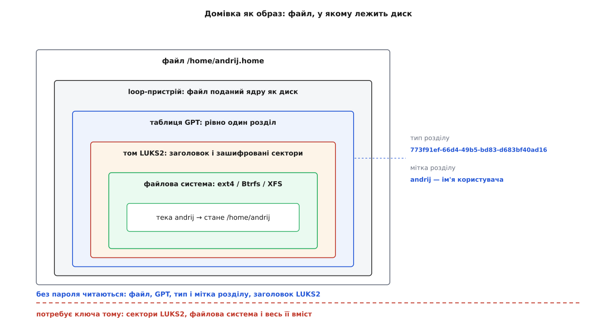
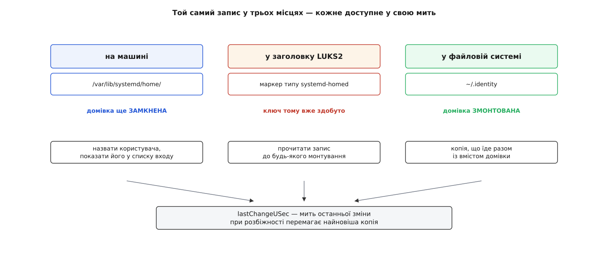
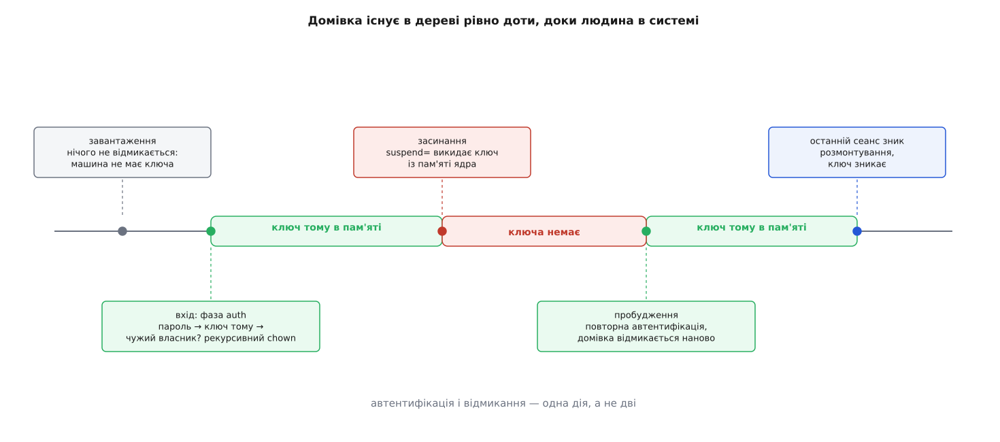

# systemd-homed: домівка як переносний підписаний образ

<preknowlist>
- [Користувачі, групи й ідентичність процесу](topic:sys-unix/uid-gid-identity-model) — ядро тримає ідентичність числами UID і GID і звіряється лише з ними; власник файла — це число в метаданих.
- [userdb: облікові записи як записи JSON через Varlink](topic:sys-unix/userdb-varlink) — обліковий запис як об'єкт JSON із названими секціями; переносна частина підписана, а номер UID лежить у місцевій секції `binding`.
- [dm-crypt: прозоре шифрування блокового пристрою](topic:sys-unix/dm-crypt) — шар, що шифрує сектори на льоту; заголовок LUKS, ключ тому й слоти, з яких його дістають паролем.
- [Loop-пристрій: файл у вигляді блокового пристрою](topic:sys-unix/loop-device) — як звичайний файл подається ядру як диск.
- [Розділи диска](topic:sys-unix/disk-partitions) — таблиця GPT, тип розділу як UUID і мітка розділу.
- [Монтування й дерево монтувань](topic:sys-unix/mount-model) — як файлова система з'являється в дереві за конкретним шляхом.
- [PAM: стек модулів автентифікації](topic:sys-unix/pam-stack) — вхід проходить крізь ланцюжок модулів, фази auth, account, session, password.
- [systemd-logind: сеанси, місця (seats) і хто зараз за комп'ютером](topic:sys-unix/logind-sessions-seats) — облік відкритих сеансів користувача.
- [Хеш і цифровий підпис](topic:sf-security/hash-and-digital-signature) — що означає «підписано ключем» і чому підпис перевіряють, не маючи секрету.
</preknowlist>

## Половина речі

Вийміть диск із ноутбука, під'єднайте до іншої машини й відкрийте `/home/andrij`. Файли на місці, до останнього байта. Але власника в них немає: у метаданих стоїть число 1000, а на цій машині 1000 — то або хтось інший, або взагалі ніхто. Того, що робило це число іменем, на диску не було ніколи: воно лишилося рядком у `/etc/passwd` тієї, першої машини.

Тобто домівка — не річ, а **місце**. Тека в чужому дереві, помічена числом, сенс якому дає файл, що лежить деінде. Перенести можна вміст; сам обліковий запис перенести нема як, бо він не тут.

Друга скарга тієї ж природи. Хай диск зашифровано цілком. Тоді пароль питають раз, на завантаженні, — і від тієї миті все відчинено: для служб, для `root`, для будь-кого, хто дістанеться до працюючої машини. Закрили кришку в кав'ярні — ноутбук заснув, а ключ тому лишився в оперативній пам'яті, звідки його дістають. Одиниця шифрування — це диск; одиниця власності — це людина; вони не збігаються, і саме тому «зашифрований диск» не означає «моє закрите від інших».

Обидві скарги — про одне. Домівка не є **об'єктом**: у неї немає ні власного опису, ні власного замка. Питання, з якого починається `systemd-homed`, звучить просто: що мусить лежати всередині, щоб домівка стала річчю, яку носять?

## Три речі, які мусять їхати разом

Відповідь випливає з самих скарг. Разом із даними мусить їхати **опис власника** — інакше на новому місці нема чого прочитати. І мусить їхати **замок**, ключ до якого не зберігається ніде, а виводиться з того, що знає (або має при собі) сама людина — інакше машина зможе відчинити домівку без неї, а отже, зможе й без її відома.

Друга вимога і диктує форму. Замок, який стоїть **зачиненим доти, доки не прийшов власник**, не поставиш на теку в спільному дереві: тека вже існує, її вміст уже видно тому, хто має права на батьківську теку. Потрібен окремий блоковий пристрій зі своїм ключем — а такий пристрій, щоб лишитися переносним, має бути звичайним файлом. Так домівка стає **образом**.

## Файл, усередині якого лежить диск

Образ — це файл `/home/andrij.home`. Ядро подає його як блоковий пристрій через loop-пристрій, і далі все відбувається так, ніби це справжній диск.

Усередині — таблиця розділів GPT рівно з одним розділом. Тип розділу — UUID `773f91ef-66d4-49b5-bd83-d683bf40ad16`, а **міткою розділу є ім'я користувача**. Далі в розділі — том LUKS2, а вже в ньому — звичайна файлова система (ext4, Btrfs або XFS) з однією текою, названою так само; саме вона стане `/home/andrij` після відмикання.

Таблиця розділів усередині файла спершу виглядає зайвим шаром: LUKS можна було покласти прямо у файл. Але ця конструкція описує не лише файл. Ту саму домівку можна тримати на флешці — розділом на справжньому носії. Тоді таблиця розділів уже не вигадана, вона там і так є, і тип розділу — єдине, з чого машина довідується, що цей розділ узагалі чиясь домівка. Один формат, щоб два випадки не розповзлися на дві реалізації: вставили носій — система впізнала розділ за типом, прочитала мітку й знає ім'я, ще нічого не відмикаючи й не заглядаючи в жодну свою базу.

*До ключа тому видно лише зовнішні шари — що це домівка й чия; усе, що далі, без пароля не читається.*

## Запис, який лежить у трьох місцях

Дані всередині є. Тепер туди ж треба покласти опис власника — той самий обліковий запис JSON, що його вживає `userdb`. Питання в тому, **де саме** всередині образу.

Очевидне місце — файл усередині файлової системи. Він там і є: `~/.identity`, у корені домівки. Але сам по собі він не годиться, бо читається аж після монтування, а монтування вимагає ключа. Виходить коло: щоб дізнатися, чий це образ і як його відмикати, треба його спершу відімкнути.

Тому є друге місце. Заголовок LUKS2 має **слоти маркерів** (англ. *token*) — вільні поля JSON, залишені для інструментів, що надбудовуються над шифруванням. `systemd-homed` кладе туди маркер свого типу з двома полями: `record` — обліковий запис, закодований у base64, і `iv` — вектор ініціалізації. Запис зашифровано **тим самим ключем тому**, що й дані, але з власним вектором. Наслідок точний: без пароля з заголовка не видобути нічого, крім самого факту, що це домівка `homed`; а щойно ключ тому здобуто — запис уже читається, ще до того, як хоч один сектор файлової системи буде змонтовано.

Третя копія лежить на машині, у `/var/lib/systemd/home/`. Вона потрібна для протилежного випадку: коли домівка **замкнена**, а система все одно мусить назвати такого користувача — показати його в списку входу, віддати відповідь на `getent passwd`, знати, що таке ім'я зайняте.

Три копії того самого запису — це три способи розійтися. Тому в записі є поле `lastChangeUSec` — мить останньої зміни в мікросекундах; при розбіжності перемагає найновіша копія, і решту підтягують до неї.

> 🔧 **Навіщо це.** Правило, ширше за `homed`: якщо ту саму сутність доводиться тримати в кількох місцях (бо кожне доступне в свою мить), у ній мусить бути **поле, що дає копіям повний порядок**. Без нього злиття перетворюється на гадання «чия версія свіжіша», і рано чи пізно виграє не та.

*Кожна копія доступна в свою мить: перша — коли домівка замкнена, друга — щойно здобуто ключ тому, третя — після монтування.*

## Число лишається вдома

У переносній частині запису номера немає. UID сидить у секції `binding`, яку пише **машина**, під ключем свого машинного ідентифікатора; для домівок `homed` радять діапазон 60001…60513. Причина — не в `homed`: два різні записи не можуть дістати те саме число, бо ядро звіряється тільки з числом, і цей номер на новій машині цілком може бути вже чиїмось.

Звідси випливає незручність, якої не сховати. Файли всередині образу позначені **старим** числом. Ядро не знає жодних імен — воно порівнює числа, і після переїзду власник усього вмісту домівки з погляду ядра просто інша людина. Тому при відмиканні `homed` перевіряє власника й, коли той не збігається з призначеним тут номером, **рекурсивно міняє власника всього дерева**. Ціна чесна й помітна: час, пропорційний кількості файлів, один раз на кожен переїзд.

## Пароль, який і є ключем

Тепер найважливіше зчеплення в усій конструкції. Те, чим людина доводить, що вона це вона, і те, з чого виводиться ключ тому LUKS2, — **одне й те саме**. Не «пароль до входу, а окремо пароль до шифру»: автентифікація і є відмиканням.

З цього випливає все подальше, і випливає невідворотно.

Насамперед — на завантаженні не відмикається нічого. Відмикати нема чим: машина не тримає ключа, вона тримає лише зашифрований том. Домівка з'являється в дереві **у мить входу** й ніяк не раніше.

Сам вхід іде крізь стек PAM. У фазі `auth` модуль `pam_systemd_home` бере введений пароль і передає його службі; служба відмикає том, за потреби міняє власника й монтує домівку. У фазі `session` модуль рахує сеанси — і коли зникає **останній**, домівка розмонтовується, а ключ тому зникає з пам'яті ядра. У фазі `password` зміна пароля означає одночасно зміну ключового слота LUKS2: інакше запис і том розійшлися б.

І окремо — сон. Параметр `suspend=` того самого модуля вмикає викидання ключового матеріалу з пам'яті **перед** засинанням; після пробудження домівку треба відімкнути наново, тобто автентифікуватися вдруге. Саме тут закривається друга скарга з початку: заснулий ноутбук більше не носить у пам'яті ключ до ваших файлів. Типово цей параметр вимкнено, і причина названа в документації прямо: повторна автентифікація після пробудження — поняття графічного середовища з екраном блокування, а текстовий сеанс на консолі просто не має де її провести.

*Ключ тому існує лише в проміжку між автентифікацією і зникненням останнього сеансу — і зникає ще й на час сну.*

> 🔧 **Навіщо це.** Шифрування диска й шифрування домівки відповідають на **різні** питання. Перше боронить від того, хто забрав вимкнену машину. Друге — від того, хто дістався до працюючої або заснулої, а також від решти користувачів тієї самої машини. Ні одне не заміняє іншого, і плутанина між ними — найчастіша причина хибного відчуття захищеності.

## Чию домівку машина погоджується прийняти

Переносність — це не те, що файл копіюється: файл копіювався завжди. Переносність настає тоді, коли в машини, яка цей файл дістала, є **правило, за яким вирішувати**.

Правилом обрано підпис. Кожна машина при першому запуску служби заводить собі пару ключів Ed25519: `/var/lib/systemd/home/local.private` і `local.public`, обидва у форматі PEM. Записи, створені тут, підписуються приватним ключем. І далі діє вимога, коротша за будь-яке пояснення: **щоб увійти локально, машина мусить мати встановлений відкритий ключ, який відповідає підписові запису**. Відкриті ключі лежать поруч, у тій самій теці, файлами `*.public`.

Тому перенесення домівки з ноутбука на робочу станцію — це дві дії, а не одна. Скопіювати образ і скопіювати з ноутбука `local.public`, назвавши його на новому місці, скажімо, `laptop.public`. Без другого кроку служба відмовиться: запис підписано ключем, якого вона не знає, і це не помилка, а рішення.

Але прийнятий чужий запис лишається **чужим**. Машина має відкритий ключ — отже, може перевірити підпис; приватного вона не має — отже, не може підписати змінений запис, а значить, і змінити його. Домівка працює, а керує нею й далі та машина, що її створила. Щоб забрати запис собі, з нього зривають чужий підпис і підписують місцевим ключем; у `homectl` це вмикає перемикач `--seize=`. Після цього запис стає місцевим — і водночас перестає бути тим самим записом на попередній машині.

Ось де переміщується межа, і це найглибше зі зміщень. Раніше питання звучало «чи є такий рядок у моєму файлі». Тепер — «чиїм ключем це підписано». Домівка перестала бути тим, що машина **має**, і стала тим, що машина **приймає або не приймає**.

Як `homed` дійшов до цієї конструкції — від доповіді 2019 року про те, що обліковий запис у Linux розсипаний по півдесятку файлів, до злиття коду й випуску v245 навесні 2020-го — [окрема історія](topic:sys-unix/systemd-homed/hist-homed-birth.md).

## Коли образу не треба

Описане вище — найповніша форма, і `homectl` кличе її `--storage=luks`. Решта варіантів корисно читати як **сходинки вниз**: на кожній зникає одна властивість об'єкта.

`fscrypt` шифрує теку засобами самої файлової системи, без образу й без блокового пристрою: домівка лежить у `/home/*.homedir`. Дані закриті, але переносити нема чого — переносився саме образ; і замикати на час сну теж нема чого, бо ця дія визначена лише для тому LUKS2.

`subvolume` (підтом Btrfs) і `directory` (звичайна тека) шифрування не дають зовсім. Від усієї конструкції лишається керування записом: `homed` веде обліковий запис, тримає в домівці `~/.identity`, а підтом додає ще й дешевий облік квот. Це запасний варіант, придатний скрізь.

`cifs` виносить домівку на мережевий ресурс, до якого служба входить тим самим паролем.

## Де служба стоїть у системі

`systemd-homed` — системна служба, що працює з правами `root` і має три обличчя назовні.

Для адміністратора це шина D-Bus, ім'я `org.freedesktop.home1`, і команда `homectl` поверх неї; операції над **чужою** домівкою пропускає через себе [polkit](topic:sys-unix/polkit).

Для решти системи це звичайна служба [userdb](topic:sys-unix/userdb-varlink): сокет `io.systemd.Home` у теці `/run/systemd/userdb/`. Через нього — і через модуль `nss-systemd` — користувачів `homed` бачать `id`, `getent` і `ls -l`, нічого про `homed` не знаючи.

Для входу це модуль `pam_systemd_home` у стеку PAM.

Повний перелік дій `homectl`, розкладка маркера LUKS2, поля запису й файли ключів зібрані [окремо](topic:sys-unix/systemd-homed/api-homectl-and-record.md). А що саме видно в готовому образі до пароля й що з'являється після — [показано на живому файлі](topic:sys-unix/systemd-homed/proj-inspect-home-image.md), крок за кроком, звичайними інструментами.

## Що це ламає

Список обмежень виглядає як перелік окремих вад, але вада тут одна, названа вище: **ключ виводиться з облікових даних людини, і без людини домівки не відчинити**. Далі — просто наслідки.

Вхід по SSH відкритим ключем не працює так, як звик адміністратор. Файл `authorized_keys` лежить усередині замкненої домівки, і `sshd` не може його прочитати, поки домівку не відімкнено, — а щоб її відімкнути, потрібен пароль. Часткова розв'язка є: ключі кладуть у секцію `privileged` самого запису, а `sshd` дістає їх командою `AuthorizedKeysCommand /usr/bin/userdbctl ssh-authorized-keys %u`. Разом із `AuthenticationMethods publickey,password` це дає робочий вхід — але пароль питати все одно доведеться, бо він і є ключем.

Нічого від імені користувача не працює, поки він не увійшов: завданню за розкладом, яке щоночі читає файл із домівки, читати нема звідки. `root` теж не може перейти в такого користувача через `su` — паролем він не володіє. І спільна `/home` по мережі з образами LUKS не поєднується: том відмикає та машина, на якій сидить людина.

## Що з цього виходить

Класична домівка — це **місце, яке система виділила** числу, що його сама ж і вигадала. Ім'я, обмеження, спосіб зберігання жили в машині; на диску лишалися самі байти, і поза машиною вони не значили нічого.

Домівка `homed` — це **об'єкт, що приходить зі своїм описом і своїм замком**. Опис їде втричі продубльований, щоб бути читаним у кожну з трьох різних митей. Замок відчиняється тільки людиною й замикається знову, щойно зникає останній її сеанс. Номер лишається вдома, бо номер — місцева справа.

І тому в системі з'явилися дві відповіді, яких раніше не було чим висловити: «ця домівка не звідси» — і «я не знаю ключа, яким її підписано».
