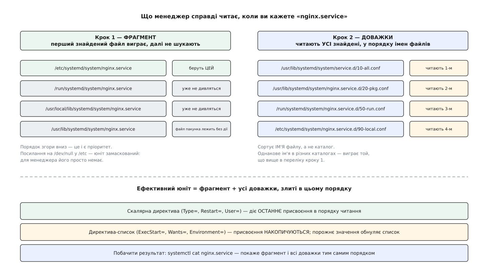

# 📋 Файл юніта: секції, директиви, шляхи

Це формальний бік того, що людина пише руками: з яких секцій складається файл юніта, що саме означає кожна директива залежности, у якому порядку менеджер шукає сам файл і доважки до нього та як з однієї заготовки роблять багато юнітів. Довідка потрібна тому, що майже кожна помилка тут мовчазна: невдало вибране ребро не дає ані попередження при завантаженні, ані рядка в журналі — служба просто поводиться не так, як ви думали, і виявляється це аж тоді, коли щось уже впало.

Усе нижче звірено з чинними сторінками довідника systemd: `systemd.unit(5)`, `systemd.service(5)`, `systemd.socket(5)`, `systemd.timer(5)`, `systemd.mount(5)`, `systemd.target(5)`.

---

## 1. Розкладка файлу

Файл юніта — звичайний текст із рядків `ключ=значення`, розбитий на секції в квадратних дужках. Сортів секцій рівно три: спільна `[Unit]`, спільна `[Install]` і одна за сортом самого юніта.

| Секція | У яких юнітах | Що там живе |
| --- | --- | --- |
| `[Unit]` | у всіх | опис, документація, ребра потреби й черги, умови запуску (`Condition*=`) |
| `[Install]` | у всіх, що вмикаються | лише те, що робить `systemctl enable`; **під час роботи не читається взагалі** |
| `[Service]` | `.service` | чим запускати, як тримати, коли перезапускати |
| `[Socket]` | `.socket` | що слухати й кого будити на з'єднання |
| `[Timer]` | `.timer` | коли спрацьовувати й кого запускати |
| `[Mount]` · `[Automount]` · `[Swap]` | відповідні | що, куди і з якими опціями приєднувати |
| `[Path]` | `.path` | за чим у файловій системі стежити |
| `[Slice]` · `[Scope]` | відповідні | самі лише обмеження ресурсів |
| *немає власної секції* | `.target`, `.device` | файл цілі — це `[Unit]` і, як правило, `[Install]` |

Одна пастка тут структурна. Директиви середовища виконання (`User=`, `Environment=`, `PrivateTmp=`), убивства (`KillMode=`) та обмеження ресурсів (`MemoryMax=`, `CPUQuota=`) описані в окремих сторінках довідника — `systemd.exec(5)`, `systemd.kill(5)`, `systemd.resource-control(5)`, — але **власних секцій не мають**: їх пишуть усередині `[Service]`, `[Socket]`, `[Mount]` чи `[Swap]`. Секції `[Exec]` не існує. Обмеження ресурсів спираються на [контрольні групи ядра](root:sys-unix/cgroups-resource-model) — іменоване дерево, у якому ядро рахує спожите й ставить межі на цілу групу процесів.

---

## 2. `[Unit]`: ребра потреби

Сім директив, і кожна відповідає на два питання разом: **чи тягнути** названий юніт у роботу й **що робити, коли з ним щось станеться**. Жодна з них не впорядковує: черга задається окремо (§3).

| Директива | Коли запускають ЦЕЙ юніт | Коли з названим юнітом щось діється | Зворотна форма |
| --- | --- | --- | --- |
| `Wants=` | тягне названий у транзакцію | нічого: не піднявся — працюємо далі | `WantedBy=` в `[Install]` |
| `Requires=` | тягне | разом із `After=`: названий не піднявся — наш не стартує. Названий **явно** зупинили чи перезапустили — те саме зроблять із нашим | `RequiredBy=` в `[Install]` |
| `Requisite=` | **не тягне** — лише перевіряє | не активний уже зараз — негайна відмова нашого запуску | — |
| `BindsTo=` | тягне | усе, що `Requires=`, **плюс** реакція на **раптову** смерть названого (процес вийшов сам, пристрій зник) | `BoundBy` — утворюється сама |
| `PartOf=` | не тягне | названий зупиняють або перезапускають — те саме роблять із нашим; назад **не** поширюється | `ConsistsOf` — утворюється сама |
| `Upholds=` | тягне | названий став неактивним чи впав — його запускають знову, і так доки живий наш | `UpheldBy=` в `[Install]` |
| `Conflicts=` | наш запуск **зупиняє** названий | запуск названого зупиняє наш | `ConflictedBy` — утворюється сама |

Чотири зауваги до таблиці.

**Зворотні форми не є директивами.** `WantedBy=`, `RequiredBy=` й `UpheldBy=` живуть у `[Install]` і працюють лише через `enable`; `BoundBy`, `ConsistsOf` і `ConflictedBy` менеджер заводить сам і руками їх не пишуть — їх видно лише в `systemctl show`.

**`Requisite=` й `Conflicts=` без черги — перегони.** Обидві директиви питають про **поточний** стан іншого юніта, а без `After=`/`Before=` мить запитання невизначена. Тому їх майже завжди пишуть у парі з ребром черги.

**`Upholds=` (з systemd 249, 2021 рік) — це сторож ззовні.** `Restart=always` тримає службу зсередини її власного опису; `Upholds=` дає той самий ефект із чужого юніта — і тому підопічний піднімається знову навіть після того, як його зупинили командою вручну.

**Поруч є речі, які на залежності схожі, але ними не є.** `OnFailure=` й `OnSuccess=` називають юніти, які запускають, коли наш перейшов у стан «збій» чи «неактивний», — це тригер, а не потреба. `StopPropagatedFrom=` і `PropagatesStopTo=` точково передають саму лише зупинку, не тягнучи нічого при запуску.

---

## 3. Черга: `Before=` і `After=`

`A: After=B` означає рівно одне: якщо в цій транзакції є робота і над A, і над B, то роботу над A починають, коли робота над B завершилася. Якщо роботи над B нема, ребро мовчить і нічого не спричиняє. `Before=` — та сама річ, записана з іншого боку; кожна з двох директив сама дописує собі зворотну на іншому юніті, тож те саме впорядкування можна оголосити з будь-якого кінця.

Дві властивості, які легко не помітити. По-перше, ребро черги нічого не **тягне**: `After=` на юніт, якого ніхто не замовив, не запускає його. По-друге, при зупинці той самий граф читають у зворотний бік — хто стартував після B, той зупиняється до B, — тому пропущене `After=` дається взнаки двічі, і на вимкненні болючіше, ніж на старті.

---

## 4. `DefaultDependencies=`

Порожній `[Unit]` не означає «жодних ребер». Кожен юніт, поки не сказано протилежного, дістає набір типових залежностей за своїм сортом.

| Сорт | Що дописується при `DefaultDependencies=yes` (типово) |
| --- | --- |
| `.service` | `Requires=` і `After=` на `sysinit.target`; `After=` на `basic.target`; `Conflicts=` і `Before=` на `shutdown.target` |
| `.socket` | `Requires=` і `After=` на `sysinit.target`; `Before=` на `sockets.target`; `Conflicts=` і `Before=` на `shutdown.target` |
| `.timer` | `Requires=` і `After=` на `sysinit.target`; `Before=` на `timers.target`; `Conflicts=` і `Before=` на `shutdown.target` |
| `.mount`, локальний | `After=` на `local-fs-pre.target`, `Before=` на `local-fs.target`; `Conflicts=` і `Before=` на `umount.target` |
| `.mount`, мережевий | те саме через `remote-fs-pre.target` / `remote-fs.target`; ознака — опція `_netdev` |
| `.target` | до **кожного власного** `Wants=`/`Requires=` дописується `After=` на той самий юніт; `Conflicts=` і `Before=` на `shutdown.target` |

Останній рядок пояснює те, що інакше виглядає магією. Ціль сама дописує собі чергу на все, чого хоче, — саме тому `multi-user.target` вважають досягнутою лише після того, як піднялося все, на що в її каталозі `.wants/` стоять посилання. Правило одностороннє: `Wants=some.target` у файлі служби ніякого `After=` службі не дає. І воно має виняток: якщо в названому юніті стоїть `DefaultDependencies=no`, ціль черги на нього не дописує.

`DefaultDependencies=no` знімає саме цей типовий набір і **не** знімає залежностей, які випливають із сорту юніта: `Type=dbus` однаково дістане `Requires=`/`After=` на `dbus.socket`, а точка монтування — на юніт пристрою й на монтування батьківського каталогу. Вимикати його є сенс лише тим одиницям, що працюють до `sysinit.target` або вже після початку вимкнення машини; в усіх інших випадках наслідком буде зупинка в невизначеному порядку, а часом і зависання при вимкненні.

---

## 5. `[Install]`: що саме робить `enable`

Ця секція не читається під час роботи взагалі — її розбирають лише команди `enable` й `disable`. Наслідок буденний: юніт без `[Install]` чудово запускається командою `systemctl start`, але на `enable` відповідає «no installation config».

| Директива | Що створює `systemctl enable` |
| --- | --- |
| `WantedBy=X` | символьне посилання на наш файл у каталозі `X.wants/` — тобто одне ребро `Wants=` від X до нас |
| `RequiredBy=X` | те саме в `X.requires/` — ребро `Requires=` |
| `UpheldBy=X` | те саме в `X.upholds/` — ребро `Upholds=` |
| `Alias=ім'я` | посилання під іншим іменем; суфікс сорту мусить збігатися |
| `Also=Y` | ту саму дію застосовує ще й до юніта Y — так вмикають пару «сокет плюс служба» одним рухом |
| `DefaultInstance=N` | лише для шаблонів: який екземпляр беруть, коли ім'я названо без частини після `@` |

Три сусідні дії варто тримати поруч у голові. `disable` прибирає ті самі посилання. `mask` кладе в `/etc/systemd/system` посилання на `/dev/null` — після цього юніт не запускається взагалі нічим, ані вручну, ані як чиясь залежність. `preset` застосовує до купи юнітів рішення дистрибутива про те, що з них має бути ввімкнене типово.

---

## 6. `Type=`: чим доводять, що служба піднялася

Значення `Type=` — це різні **докази готовности**, і кожен визначає точну мить, від якої `After=` на цю службу щось означає.

| `Type=` | Юніт вважають піднятим… | Що ще треба вказати |
| --- | --- | --- |
| `simple` | одразу після відгалуження процесу — **до** підміни коду | — |
| `exec` | після успішної підміни коду (`execve`) | — |
| `forking` | коли початковий процес завершився, лишивши по собі нащадка | бажано `PIDFile=` |
| `oneshot` | коли процес завершився | часто в парі з `RemainAfterExit=yes` |
| `dbus` | коли служба зайняла своє ім'я на шині | `BusName=` — обов'язково |
| `notify` | коли служба надіслала менеджерові `READY=1` | `NotifyAccess=` (типово `main`) |
| `notify-reload` | те саме; додатково перевантаження йде через `SIGHUP`, а служба відповідає `RELOADING=1`, далі знову `READY=1` | те саме |
| `idle` | як `simple`, але сам запуск відкладають, доки не роздано всі активні роботи (не довше ніж 5 с) | лише щоб не псувати вивід на консоль |

Типового значення не пишуть — його виводять із решти файлу: коли є `ExecStart=`, але немає ні `Type=`, ні `BusName=`, діє `simple`; коли немає й `ExecStart=` — `oneshot`.

Межа проходить посередині таблиці. У перших трьох випадках менеджер судить про готовність ззовні й майже завжди помиляється в бік «занадто рано»; у трьох останніх сигнал подає сама служба. Є й спосіб зняти питання цілком — [активація за сокетом](root:sys-unix/socket-activation): якщо сокет відкриває сам менеджер ще до запуску служби, з'єднання чекає в черзі сокета, і питання «чи готова вона приймати» просто не виникає. Ім'я на шині, якого чекає `Type=dbus`, — це [D-Bus](root:sys-unix/dbus), спільна шина повідомлень простору користувача, де програми звертаються одна до одної за іменем, а не за номером процесу. Що менеджер робить із службою після підняття — рахує спроби, вирішує, чи перезапускати, — описано в [життєвому циклі служби](root:sys-unix/service-lifecycle).

---

## 7. Секція за сортом: що там мусить бути

**`[Service]` — кістяк:**

| Директива | Роль |
| --- | --- |
| `ExecStart=` | команда запуску; повний шлях обов'язковий. Для всіх типів, крім `oneshot`, дозволена рівно одна |
| `ExecStartPre=` · `ExecStartPost=` | команди до й після; невдача `Pre` зриває запуск |
| `ExecReload=` · `ExecStop=` | що виконати на `reload` і `stop` |
| `Restart=` | `no`, `on-success`, `on-failure`, `on-abnormal`, `on-watchdog`, `on-abort`, `always` |
| `RestartSec=` · `TimeoutStartSec=` · `TimeoutStopSec=` | паузи й терпіння менеджера |
| `RemainAfterExit=` | вважати службу активною після виходу всіх процесів |
| `User=` · `Group=` · `WorkingDirectory=` · `Environment=` · `EnvironmentFile=` | середовище виконання |

**`[Socket]`:**

| Директива | Роль |
| --- | --- |
| `ListenStream=` · `ListenDatagram=` · `ListenSequentialPacket=` | порт, адреса або шлях сокета відповідного сорту |
| `ListenFIFO=` · `ListenSpecial=` · `ListenNetlink=` | іменована труба, спецфайл, сокет netlink |
| `Service=` | кого будити; типово — юніт із тим самим іменем і суфіксом `.service` |
| `Accept=` | `no` (типово) — усі слухачі передають одній службі; `yes` — на кожне з'єднання породжують окремий екземпляр `foo@N.service` |
| `SocketUser=` · `SocketGroup=` · `SocketMode=` | власник і права вузла в файловій системі; типово `0666` |

**`[Timer]`:**

| Директива | Роль |
| --- | --- |
| `OnCalendar=` | календарний вираз реального часу: `daily`, `Mon *-*-* 03:00:00` |
| `OnBootSec=` · `OnStartupSec=` | відлік від завантаження машини й від старту менеджера |
| `OnActiveSec=` · `OnUnitActiveSec=` · `OnUnitInactiveSec=` | відлік від активації самого таймера чи від попереднього запуску підопічного |
| `AccuracySec=` | дозволений розкид; типово **1 хвилина** — таймери навмисно збивають у пачки, щоб рідше будити процесор |
| `RandomizedDelaySec=` | випадкова затримка, типово `0`; ліки від того, що тисяча машин прокидається в ту саму секунду |
| `Persistent=` | типово `false`; `true` — пропущений через вимкнену машину запуск виконують одразу після старту |
| `Unit=` | кого запускати; типово — юніт із тим самим іменем і суфіксом `.service` |

**`[Mount]`** (докладніше про саме приєднання — [дерево монтувань](root:sys-unix/mount-model)): `What=` — пристрій або джерело, `Where=` — точка приєднання, `Type=` — файлова система, `Options=` — рядок опцій, `TimeoutSec=` — скільки чекати. Ім'я файлу тут не довільне: воно мусить бути екранованим шляхом точки приєднання, тож `/var/log` описує рівно `var-log.mount` (§11).

---

## 8. Де менеджер шукає файл

Каталогів багато, і порядок між ними — це і є пріоритет: перший знайдений файл із потрібним іменем виграє, решту однойменних не читають зовсім.

| # | Каталог (системний менеджер) | Хто туди пише |
| --- | --- | --- |
| 1 | `/etc/systemd/system.control/` | `systemctl set-property` — постійні правки через шину |
| 2 | `/run/systemd/system.control/` | те саме, але до перезавантаження |
| 3 | `/run/systemd/transient/` | юніти, створені на льоту (`systemd-run`) |
| 4 | `/run/systemd/generator.early/` | генератори, ранній прохід |
| 5 | **`/etc/systemd/system/`** | **адміністратор машини** |
| 6 | `/etc/systemd/system.attached/` | приєднані образи-розширення |
| 7 | `/run/systemd/system/` | ефемерне, зникає з перезавантаженням |
| 8 | `/run/systemd/system.attached/` | те саме для образів |
| 9 | `/run/systemd/generator/` | генератори, звичайний прохід |
| 10 | `/usr/local/lib/systemd/system/` | те, що поставили повз пакунковий менеджер |
| 11 | **`/usr/lib/systemd/system/`** | **пакунки дистрибутива** |
| 12 | `/run/systemd/generator.late/` | генератори, пізній прохід — останній шанс |

Три яруси видно з таблиці неозброєним оком, і вони точно повторюють загальний поділ [розкладки файлової системи](root:sys-unix/fhs-layout): `/usr` — незмінне надбання постачальника, `/etc` — рішення власника машини, `/run` — те, що живе лише до перезавантаження. Адміністратор завжди перекриває пакунок, а ефемерне — обидва.

Рядки з генераторами варто читати уважно: це маленькі програми, які менеджер запускає перед складанням графа, і вони **народжують юніти з чужих описів**. Саме так рядок у `/etc/fstab` стає юнітом `.mount`, а `resume=` в командному рядку ядра — юнітом розділу довантаження. Тому в системі повно юнітів, яких у жодному каталозі не написано руками.

Менеджер користувача шукає у своєму наборі каталогів із тією самою логікою: `~/.config/systemd/user/`, `/etc/systemd/user/`, `/run/systemd/user/`, `/usr/lib/systemd/user/`.

---

## 9. Доважки: як правити чужий юніт, не чіпаючи його

Копіювати файл із `/usr` до `/etc`, щоб змінити один рядок, — поганий вихід: копія перестане отримувати виправлення з оновленнями пакунка. Тому є **доважки** (англ. drop-in): каталог з ім'ям юніта й суфіксом `.d`, а в ньому файли `*.conf`, які менеджер читає **після** основного файлу.



*Основний файл беруть рівно один, доважки — усі знайдені; це різні правила, і плутати їх дорого.*

| Форма каталогу | Кого зачіпає |
| --- | --- |
| `nginx.service.d/` | лише цей юніт |
| `service.d/` у корені шляху пошуку | **усі** юніти цього сорту в системі |
| `foo@.service.d/` | шаблон — а отже, всі його екземпляри |
| `foo@bar.service.d/` | лише цей екземпляр; при однакових іменах файлів виграє над шаблонним |
| `foo-bar-.service.d/`, `foo-.service.d/` | усі юніти, чиє ім'я починається з цього префікса до дефіса — головний спосіб вішати обмеження на цілу гілку зрізів |

Правило злиття складається з двох половин, і саме на їх розрізненні все тримається. Файли з **різними** іменами читають **усі**, у лексикографічному порядку самих імен — незалежно від того, у якому каталозі кожен лежить; звідси й звичка нумерувати їх спереду (`10-`, `50-`, `90-`). Файли з **однаковим** іменем змагаються між собою, і виграє той, чий каталог специфічніший або вищий за пріоритетом: `/etc` над `/usr`, екземпляр над шаблоном, довший префікс над коротшим.

Далі діє звичайна арифметика директив. Скалярна директива (`Type=`, `Restart=`, `User=`) бере **останнє** присвоєння в порядку читання. Директива-список (`ExecStart=`, `Wants=`, `Environment=`) присвоєння **накопичує**, і скинути список можна лише порожнім значенням — рядок `ExecStart=` без нічого обнуляє попереднє, після чого пишуть своє. Це єдиний спосіб замінити команду запуску в доважці, і найчастіша причина скарги «я вказав `ExecStart=`, а служба запускає обидві команди».

Готують доважку командою `systemctl edit ім'я` — вона сама створить каталог і покличе редактор.

---

## 10. Специфікатори

Специфікатор — це `%` і одна літера; менеджер підставляє значення в мить завантаження юніта. Регістр значущий, і там, де є пара про ім'я юніта (`%i`/`%I`, `%p`/`%P`, `%j`/`%J`), мала літера дає рядок таким, як він записаний в імені, а велика — зі знятим екрануванням (§11). В інших парах спільного між великою й малою немає взагалі: `%h` — домашній каталог, `%H` — ім'я вузла.

| Літера | Значення | Літера | Значення |
| --- | --- | --- | --- |
| `%n` | повне ім'я юніта | `%N` | те саме без суфікса сорту |
| `%p` | префікс — те, що перед `@` | `%P` | те саме зі знятим екрануванням |
| `%i` | ім'я екземпляра — між `@` і суфіксом | `%I` | те саме зі знятим екрануванням |
| `%j` | остання частина префікса після дефіса | `%J` | те саме зі знятим екрануванням |
| `%f` | `%I` (або `%P`) зі скісною рискою спереду — готовий шлях | `%%` | сам знак відсотка |
| `%H` | ім'я вузла | `%l` | воно ж, обрізане на першій крапці |
| `%m` | ідентифікатор машини | `%b` | ідентифікатор цього завантаження |
| `%v` | випуск ядра, як у `uname -r` | `%a` | архітектура |
| `%u` · `%U` | ім'я й номер користувача менеджера | `%g` · `%G` | його група й її номер |
| `%h` | домашній каталог | `%s` | оболонка |
| `%t` | корінь тимчасового стану: `/run` | `%S` | корінь сталого стану: `/var/lib` |
| `%C` | кеш: `/var/cache` | `%L` | журнали: `/var/log` |
| `%E` | конфігурація: `/etc` | `%d` | каталог переданих службі секретів |
| `%T` · `%V` | `/tmp` і `/var/tmp` | `%y` · `%Y` | шлях до основного файлу юніта й до його каталогу |
| `%o` · `%w` · `%B` | `ID`, `VERSION_ID` і `BUILD_ID` з `/etc/os-release` | `%q` | гарне ім'я машини |

У менеджері користувача корені `%t`, `%S`, `%C`, `%L`, `%E` беруться з відповідних змінних `XDG_*`, тож той самий юніт дає різні шляхи для системи й для людини — це і є задум.

---

## 11. Шаблони, екземпляри й екранування

Ім'я з `@` перед суфіксом робить файл **заготовкою**: `tunnel@.service` сам не запускається, з нього роблять `tunnel@vpn1.service`, і рядок між `@` та крапкою стає значенням `%i`. Один файл — скільки завгодно однакових служб із різними параметрами.

Параметром часто буває шлях або довільний рядок, а в іменах юнітів багато знаків заборонено. Тому діє екранування: скісну риску замінює дефіс, решту неалфавітних знаків (крім `:`, `_`, `.`) — запис `\x2d`, крапка на початку стає `\x2e`. Шлях `/foo/bar/baz` перетворюється на `foo-bar-baz`, а сам корінь `/` — на одинокий дефіс. Робить це команда `systemd-escape` (з ключем `--path` для шляхів, `-u` — назад, `--template` — одразу зібрати повне ім'я екземпляра). Із цього самого правила випливає й ім'я юніта монтування: `/var/log` описує `var-log.mount`, і жодне інше ім'я цю точку не опише.

Робочий приклад — служба-заготовка, параметром якої є адреса вузла:

```ini
# /etc/systemd/system/tunnel@.service
[Unit]
Description=Тунель до %I
Documentation=man:tunneld(8)
Wants=network-online.target
After=network-online.target

[Service]
Type=notify
ExecStart=/usr/local/bin/tunneld --peer=%I --state=%S/%p/%i
Restart=on-failure
RestartSec=5s
StateDirectory=%p/%i

[Install]
WantedBy=multi-user.target
DefaultInstance=main
```

```
systemctl enable --now tunnel@vpn1.service

%p → tunnel          %i → vpn1
%I → vpn1            %S → /var/lib
StateDirectory=tunnel/vpn1  →  каталог /var/lib/tunnel/vpn1,
                                створений із власником служби
```

`Type=notify` тут не прикраса: програма мусить справді надіслати `READY=1`, інакше менеджер вважатиме запуск незавершеним до кінця `TimeoutStartSec=` і оголосить збій. Пара `Wants=` плюс `After=` на `network-online.target` — саме той випадок, коли потрібні обидві осі: перша вмикає очікування мережі, друга ставить службу після нього. `DefaultInstance=main` тут відповідає лише за один випадок — коли ім'я екземпляра в команді не назвали взагалі.

Перевіряють написане чотирма командами, і кожна відповідає на своє питання:

| Команда | Питання, на яке вона відповідає |
| --- | --- |
| `systemctl cat tunnel@vpn1.service` | який файл узяли й які доважки на нього лягли, у порядку читання |
| `systemctl show tunnel@vpn1.service` | які значення директив вийшли після злиття, разом із типовими |
| `systemd-analyze verify tunnel@vpn1.service` | чи файл узагалі розбирається й чи всі названі юніти існують — без запуску |
| `systemctl list-dependencies --after tunnel@vpn1.service` | на кого юніт чекає — окремо від того, кого він тягне |

Після будь-якої правки файлу потрібен `systemctl daemon-reload`: менеджер тримає розібраний граф у пам'яті й сам за диском не стежить. А `systemd-delta` покаже всі місця, де `/etc` перекриває `/usr`, — корисно на машині, що прожила кілька оновлень.

> 🔧 **Навіщо це.** Коли директива «не подіяла», порядок перевірки випливає прямо з таблиць вище. Спершу `systemctl cat` — чи менеджер узагалі взяв той файл, що ви правили, і чи не лежить вище за пріоритетом інший. Далі `systemctl show` — чи ваше значення вижило після злиття доважок: для списку його могло не замінити, а додати. Далі `daemon-reload` — можливо, граф у пам'яті просто старший за диск. І лише тоді журнал: якщо ваш рядок дійшов, а поводиться служба інакше — питання вже не до файлу.
