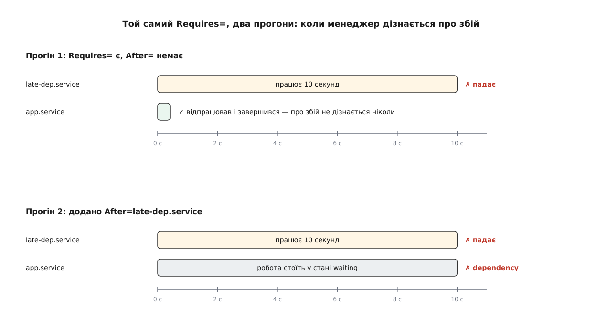

# ⚙️ Побачити транзакцію на власній машині

Граф залежностей незручний для вивчення тим, що працює мовчки: коли все піднялося — дивитися нема на що, а коли не піднялося — на екрані одна фраза без причин. Тож задача тут така: зібрати найменший можливий граф із двох юнітів, навмисно зробити в ньому найпоширенішу помилку, побачити, що менеджер її **не помічає**, полагодити одним рядком — а потім тими самими інструментами роздивитися справжній граф машини й насамкінець зламати його циклом.

## Полігон, де нічого не зіпсуєш

Усе нижче робиться в **менеджері користувача** — окремому примірнику systemd, який запускається на кожен вхід людини й керує її власними юнітами. Він розуміє ті самі файли й ті самі команди з ключем `--user`, але живе у своєму дереві юнітів: зіпсований експеримент не зачепить ані завантаження машини, ані чужих [сеансів](topic:sys-unix/logind-sessions-seats), і прав адміністратора не потребує. Файли лежать у `~/.config/systemd/user/`.

Перший юніт — залежність, яка довго думає і зрештою падає:

```ini
# ~/.config/systemd/user/late-dep.service
[Unit]
Description=Залежність, що працює 10 секунд і завершується збоєм

[Service]
Type=oneshot
ExecStart=/bin/sh -c 'sleep 10; exit 1'
```

Другий — той, кому вона потрібна:

```ini
# ~/.config/systemd/user/app.service
[Unit]
Description=Служба, якій потрібна late-dep
Requires=late-dep.service

[Service]
Type=oneshot
ExecStart=/bin/sh -c 'echo "app: працюю"'
```

Ребро потреби оголошено, ребра черги немає — це і є та сама помилка. Лишається перечитати опис:

```sh
$ systemctl --user daemon-reload
```

Ця команда тут не формальність: менеджер тримає граф у пам'яті й звіряється з файлами лише за нею.

## Помилка, якої не чути

```sh
$ systemctl --user start app.service
$
```

Команда повернулася миттєво й без слова скарги. Через десять секунд у журналі:

```
$ journalctl --user -u app.service -u late-dep.service -o short-precise -n 3
16:41:03.118  app: працюю
16:41:13.402  late-dep.service: Main process exited, code=exited, status=1/FAILURE
16:41:13.402  late-dep.service: Failed with result 'exit-code'.
```

`app` відпрацював о 16:41:03 — за десять секунд **до** того, як потрібний йому юніт упав. І з погляду менеджера все відбулося правильно: у документації сказано прямо, що коли перелічений у `Requires=` юніт не стартував, а ребра черги на нього немає, це не впливає на дійсність транзакції загалом і юніт усе одно буде запущено.



*Одна відсутня директива — і збій приходить на десять секунд пізніше за рішення, яке на нього спиралося.*

Це найгірший сорт помилки: вона не падає, вона мовчить. У житті на місці `late-dep` буває монтування розділу з даними, а на місці `app` — служба, яка встигає створити свій каталог просто на порожній точці монтування.

## Одне ребро — і збій стає чутним

Додаємо в `app.service` під `Requires=` рівно один рядок — `After=late-dep.service` — і перезапускаємо:

```sh
$ systemctl --user daemon-reload
$ systemctl --user start app.service
A dependency job for app.service failed. See 'journalctl -xe' for details.
```

Тепер команда думає ті самі десять секунд і повертає відмову. А поки вона думає, у другому вікні видно транзакцію живцем:

```sh
$ systemctl --user list-jobs
JOB UNIT              TYPE  STATE
 74 app.service       start waiting
 75 late-dep.service  start running
2 jobs listed.
```

Дві роботи одного запиту. `running` — робота, що виконується просто зараз; `waiting` — робота, яка вже в транзакції, але притримана ребром черги. Ключі `--after` і `--before` дописують до кожного рядка, на які саме роботи ця чекає і які чекають на неї. Варто затямити, що вікно спостереження тут вузьке: щойно транзакція завершилася, дивитися вже нема на що — `list-jobs` показує лише те, що триває.

## Два обходи — дві команди

Розділення осей має пряме відображення в інструментах: одні й ті самі вузли обходять двома різними командами, бо питання різні.

```sh
$ systemctl --user list-dependencies app.service
app.service
● └─late-dep.service
```

Так виглядає **замикання за потребою**. За замовчуванням команда йде лише ребрами `Requires=`, `Requisite=`, `Wants=`, `ConsistsOf=`, `BindsTo=` й `Upholds=` — тобто відповідає на питання «кого затягне в транзакцію». Ключ `--after` перемикає її на граф черги — «на кого цей юніт чекає», `--before` дає дзеркальну відповідь. Там, крім `late-dep`, знайдуться й вузли, яких ви не писали: менеджер дописує кожній службі типові ребра сам.

Дві застороги. Перша: команда бачить лише юніти, **завантажені в пам'ять** менеджера просто зараз, — те, чого ніхто ще не згадував, у виводі не з'явиться, тож повного списку зворотних залежностей вона не дає. Друга: без `--all` рекурсивно розкриваються тільки цілі, решта вузлів лишається листками дерева.

Коли ж потрібне не дерево, а точний перелік ребер одного вузла, властивості питають прямо:

```sh
$ systemctl --user show -p Requires -p After -p Before app.service
Requires=late-dep.service
After=late-dep.service basic.target
Before=shutdown.target
```

Це вже не обхід графа, а вміст самого вузла після того, як менеджер звів докупи основний файл, доважки й типові ребра. Різниця помітна відразу: в `After=` стоїть `basic.target`, якого ви не писали, а в `Before=` — `shutdown.target`, те саме ребро, що при вимкненні читається у зворотний бік і зупиняє вашу службу раніше за систему. Набір дописаного залежить від версії й від того, системний це менеджер чи менеджер користувача, тож заучувати його марно — його дивляться. І коли дерево показує щось несподіване, звіряти треба саме тут: дерево показує наслідок, властивості — причину.

## Скільки це коштувало часу

Далі дивимося вже на системний менеджер — усі ці команди лише читають.

```sh
$ systemd-analyze blame | head -5
   6.412s NetworkManager-wait-online.service
   1.980s dev-nvme0n1p2.device
    884ms snapd.service
    431ms plymouth-quit-wait.service
    257ms upower.service
```

І тут же перша пастка. `blame` не показує служб із `Type=simple` узагалі — менеджер вважає такі служби піднятими одразу після відгалуження, тож вимірювати в них нічого. Отже, список ранжує не «хто довго стартував», а «хто довго доводив, що стартував»: служба, яка справді готується півхвилини, але оголосила `Type=simple`, у ньому просто відсутня.

`blame` до того ж не питає, чи хтось на цю службу чекав. Питання «що саме подовжило завантаження» ставлять інакше:

```sh
$ systemd-analyze critical-chain
graphical.target @9.204s
└─multi-user.target @9.203s
  └─snapd.service @8.317s +884ms
    └─basic.target @8.301s
      └─sockets.target @8.299s
        └─snapd.socket @8.291s +7ms
          └─sysinit.target @8.276s
            └─systemd-timesyncd.service @7.802s +472ms
              └─local-fs.target @7.749s
```

Після `@` — мить, коли вузол було досягнуто; після `+` — скільки він сам активувався. Ланцюг спускається від мети тим ребром черги, яке щоразу виявилося найпізнішим. Двох речей від нього чекати не варто. Враховується лише час у стані «активується», тож вузли, що переходять із неактивного просто в активний — пристрої й цілі, — стоять у ланцюгу без `+` і дають нуль. І документація прямо застерігає, що вивід уводить в оману там, де служби піднято [активацією за сокетом](topic:sys-unix/socket-activation): з'єднання встановлюється раніше, ніж служба справді готова, і ланцюг обривається раніше, ніж закінчується справжнє чекання.

Розкладку всіх вузлів по осі часу малює `systemd-analyze plot > boot.svg`. Це та сама інформація, що в `blame`, але з початком і кінцем кожної смуги — і з неї читається паралельність, якої зі списку не дістати: скільки вузлів справді бігли поруч і де смуга лишилася самотньою.

## Граф на винос

```sh
$ systemd-analyze dot --order --from-pattern='*.target' --to-pattern='*.target' \
    | dot -Tsvg > order.svg
```

Без ключів `--order` чи `--require` вивід містить **обидва** сорти ребер одразу, і на цілій машині це нечитний клубок — фільтри тут не оздоба, а умова читабельності. `--order` лишає ребра черги, `--require` — ребра потреби, а шаблони обрізають граф до потрібного кутка. У менеджері користувача працює так само: `systemd-analyze --user dot --order 'app.service'` дає рівно те одне ребро, яке ми щойно дописали.

## Цикл, зроблений навмисно

Лишилося замкнути граф черги в коло. Три юніти, кожен із `Type=oneshot` та `ExecStart=/bin/true` — уміст не важить, важать ребра:

- `ring-a.service` — `Requires=ring-b.service` і `After=ring-b.service`;
- `ring-b.service` — `Wants=ring-c.service` і `After=ring-c.service`;
- `ring-c.service` — `After=ring-a.service`.

Ребра черги замкнулися: `a` після `b`, `b` після `c`, `c` після `a`. [Топологічного порядку](topic:sf-algorithms/topological-sort) на такому графі не існує.

```sh
$ systemctl --user daemon-reload
$ systemctl --user start ring-a.service
$ journalctl --user -b -t systemd | tail -4
systemd[2141]: Found ordering cycle on ring-a.service/start
systemd[2141]: Found dependency on ring-b.service/start
systemd[2141]: Found dependency on ring-c.service/start
systemd[2141]: Job ring-c.service/start deleted to break ordering cycle starting with ring-a.service/start
```

Перші три рядки виписують саме коло — по вузлу на рядок, і останній замикається на перший. Четвертий називає жертву. Команда при цьому не поскаржилася.

І ось головне, чого з тексту повідомлення не прочитати. Викинуто не випадкову роботу й не найдешевшу: менеджер шукає в колі роботу, **без якої замовлена мета все одно лишається досяжною**. `ring-c` потрапив у транзакцію слабким ребром `Wants=`, його втрата не ламає нічого з того, що просили, — тож викидають саме його.

Якщо ж кожна робота в колі обов'язкова для замовленого, викидати нема чого. Замініть у `ring-b.service` `Wants=` на `Requires=`:

```sh
$ systemctl --user daemon-reload
$ systemctl --user start ring-a.service
Failed to start ring-a.service: Transaction order is cyclic. See system logs for details.
```

У журналі замість рядка про викинуту роботу тепер стоїть `Unable to break cycle starting with ring-a.service/start`: транзакцію відхилено цілком, стан системи не змінився.

Різниця між цими двома прогонами варта того, щоб її пам'ятати. Цикл серед самих лише обов'язкових ребер видно одразу: команда відмовила, людина пішла шукати причину. Цикл, у якому є хоча б одне слабке ребро, **мовчки з'їдає службу** — команда відпрацювала, машина піднялася, і лише в журналі лежить рядок про роботу, викинуту заради графа. Саме тому `Found ordering cycle` читають як помилку в описі залежностей, а не як повідомлення про службу, названу в кінці рядка.

Прибрати полігон:

```sh
$ rm ~/.config/systemd/user/{app,late-dep,ring-a,ring-b,ring-c}.service
$ systemctl --user daemon-reload
```

## Чим це кусається

**`daemon-reload` після кожної правки.** Без нього ви дивитеся на старий граф і не розумієте, чому нічого не змінилося.

**Знак відсотка у файлі юніта починає підстановку.** `date +%T` перетвориться не на час, а на `/tmp`: `%T` є специфікатором каталогу тимчасових файлів. Писати треба `%%T`.

**`systemd-analyze` теж має `--user`.** Без цього ключа всі його команди дивляться на системний менеджер, де ваших юнітів просто немає.

**Типові ребра, яких ви не писали.** Менеджер сам дописує службі залежності на `basic.target` і `shutdown.target`; `DefaultDependencies=no` їх знімає — і саме через них домашній цикл іноді несподівано зачіпає чужі вузли.

**Журнал користувача окремий.** Повідомлення менеджера користувача не потрапляють у [журнал](topic:sys-unix/journald-structured-entry-model) без ключа `--user`, і рядка про цикл ви там не знайдете, скільки б не шукали.
