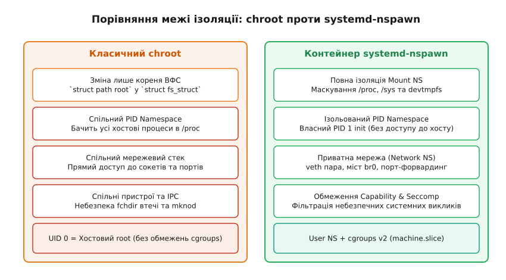
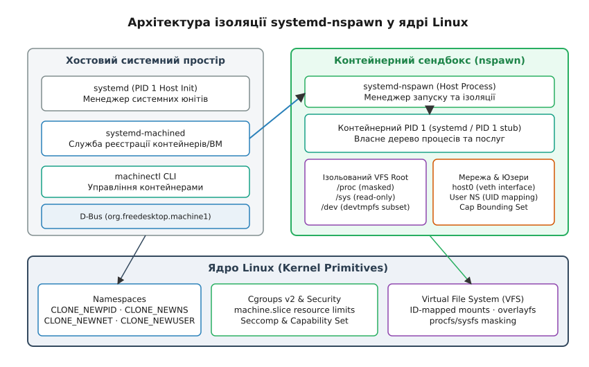
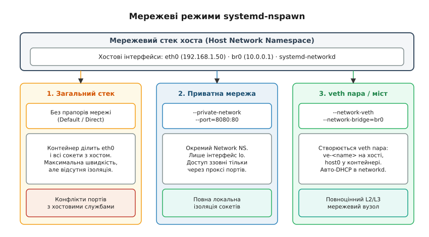

# Контейнеризація у systemd: інструмент systemd-nspawn

<preknowlist>
- [Простори імен: глибокий семантичний розбір](root:sys-unix/namespaces) — ізоляція PID, mount, net, ipc, uts та user у ядрі Linux.
- [Роль init і особливість PID 1](root:sys-unix/init-and-pid1) — прибирання зомбі-процесів, обробка сигналів та ініціалізація дерева системних служб.
- [Контролери Cgroups v2](root:sys-unix/cgroup-v2-controllers) — обмеження та облік CPU, RAM та I/O для ієрархічних груп процесів.
- [Можливості на практиці](root:sys-unix/capabilities-in-practice) — розщеплення привілеїв root через привілеї CAP_SYS_ADMIN, CAP_NET_ADMIN та безпечне пониження прав.
</preknowlist>

Спроба запустити повноцінну операційну систему або менеджер ініціалізації systemd усередині класичної директорії `chroot` призводить до миттєвого краху системного оточення хоста. Оскільки `chroot` змінює лише шлях до кореня файлової системи у підсистемі VFS, новий процес ініціалізації зчитує неізольовану псевдофайлову систему `/proc` хоста, бачить усі сторонні процеси, намагається підключитися до хостової системної шини D-Bus, надсилає сигнали завершення чужим службам та модифікує загальний мережевий стек. Для безпечного тестування збірок ОС, ізоляції системних служб та створення легковагових контейнерів у системному менеджері systemd розроблено інструмент `systemd-nspawn`.

---

### 1. Обмеження chroot та необхідність повноцінної системної ізоляції

Класичний системний виклик `chroot(2)` виконує єдину операцію у ядрі Linux: він модифікує поле `root` у структурі контексту файлової системи ядра (`struct path root` у `struct fs_struct`) для викликаючого процесу та всіх його дочірніх процесів. Під час обходу дерев директорій у VFS (операція `path_lookup`) ядро перевіряє, чи не досяг шлях значення `fs->root`. Звідси випливає фундаментальна обмеженість: `chroot` ізолює лише символьні шляхи файлової системи, залишаючи всі інші підсистеми ядра повністю спільними між хостом та середовищем `chroot`.

Небезпека та непридатність `chroot` для системної контейнеризації зумовлена п'ятьма фундаментальними факторами:

1. **Спільний простір процесів (PID Namespace):** Усередині `chroot` процес бачить увесь список процесів хоста через монтовану файлову систему `/proc`. Процес із правами суперкористувача (UID 0) усередині `chroot` може оглядати чужі процеси, зчитувати їхню пам'ять через `/proc/[pid]/mem` та надіслати сигнал `SIGKILL` будь-якому процесу на хості за допомогою системного виклику `kill(2)`.
2. **Спільні пристрої та VFS (Mount Namespace):** Створення вузлів пристроїв через `mknod(2)` або прямий доступ до блокових пристроїв у каталозі `/dev` (наприклад, `/dev/sda` чи `/dev/nvme0n1`) дозволяє процесу у `chroot` напрямую модифікувати дискові розділи хоста або перехоплювати введення з клавіатури через `/dev/input`. Крім того, привілейований процес у `chroot` може монтувати або відмонтовувати файлові системи хоста.
3. **Витік через файлові дескриптори (fchdir leak):** Класичний вектор втечі з `chroot` полягає у відкритті файлового дескриптора директорії поза межами `chroot` (через `open(2)`), наступному виконанні виклику `chroot` до глибокої вкладеної директорії та подальшому виконанні системного виклику `fchdir(2)` за відкритим раніше дескриптором. У результаті процес опиняється у директорії вище поточного кореня `chroot` і може виконувати `chroot(".")` для повного відновлення доступу до VFS хоста.
4. **Крах при спробі запуску PID 1:** Головний процес ініціалізації операційної системи (PID 1) володіє унікальними ядерними обов'язками: він підхоплює процес-«сироти» (zombie reaping через `waitpid(2)`), обробляє системні сигнали від ядра та керує службовими юнітами. Якщо запустити systemd як звичайний процес усередині `chroot` з PID, відмінним від 1 (наприклад, PID 14205), він відмовиться функціонувати, оскільки ядро Linux не делегує йому функції прибирання зомбі-процесів та обробки первинних сигналів.
5. **Відсутність ресурсного контролю (cgroups):** Процеси усередині `chroot` ділять спільне cgroup-дерево з батьківським процесом хоста. Неконтрольоване споживання пам'яті або процесорного часу усередині `chroot` може призвести до запуску OOM Killer (Out-Of-Memory Killer) на хості та аварійного знищення важливих хостових служб.


*Порівняння конструкції ізоляції chroot та systemd-nspawn.*

Історичні передумови виникнення інструменту `systemd-nspawn` та еволюція від системного виклику `chroot` 1979 року до сучасних ядерних просторів імен детально висвітлені у вставці [Від chroot до systemd-nspawn: еволюція контейнеризації у Linux](root:sys-unix/systemd-nspawn-lightweight-containers/hist-chroot-to-nspawn.md).

---

### 2. Архітектурні примітиви ізоляції systemd-nspawn у ядрі Linux

Під час запуску контейнера інструмент `systemd-nspawn` виконує складну послідовність системних викликів (`clone(2)`, `unshare(2)`, `pivot_root(2)`, `mount_setattr(2)`), збираючи автономне середовище виконання з окремих примітивів ядра Linux.

```
                  ┌─────────────────────────────────────────┐
                  │         systemd-nspawn process          │
                  └────────────────────┬────────────────────┘
                                       │ clone(CLONE_NEW*)
            ┌──────────────────────────┼──────────────────────────┐
            ▼                          ▼                          ▼
  ┌───────────────────┐      ┌───────────────────┐      ┌───────────────────┐
  │  CLONE_NEWPID     │      │   CLONE_NEWNS     │      │   CLONE_NEWNET    │
  │ (Guest PID 1)     │      │ (Masked /proc,/sys│      │  (veth host0)     │
  └───────────────────┘      └───────────────────┘      └───────────────────┘
            │                          │                          │
            ▼                          ▼                          ▼
  ┌─────────────────────────────────────────────────────────────────────────┐
  │                       Linux Kernel System Calls                         │
  └─────────────────────────────────────────────────────────────────────────┘
```

#### Ізоляція просторів імен (Namespaces)
- **`CLONE_NEWPID`:** Створює нове дерево ідентифікаторів процесів. Перший процес, створений усередині цього простору імен, отримує PID 1. Для нього ядро вмикає семантику прибирання зомбі-процесів у межах контейнера. Процеси хоста залишаються повністю невидимими усередині контейнера.
- **`CLONE_NEWNS` (Mount Namespace):** Надає контейнеру приватну таблицю монтувань VFS. Усі монтування або відмонтування, виконані усередині контейнера, не впливають на таблицю монтувань хоста.
- **`CLONE_NEWNET`:** Віртуалізує мережевий стек ядра. Контейнер отримує власні мережеві інтерфейси, власну таблицю маршрутизації, правила сокетів та Netfilter/iptables.
- **`CLONE_NEWUTS`:** Ізолює ім'я хоста (`hostname`) та доменне ім'я (`domainname`), дозволяючи контейнеру мати унікальне мережеве ім'я без зміни конфігурації хоста.
- **`CLONE_NEWIPC`:** Створює приватний простір для систем міжпроцесної взаємодії System V IPC та POSIX message queues.
- **`CLONE_NEWUSER`:** Віртуалізує ідентифікатори користувачів (UID) та груп (GID).

#### Послідовність ініціалізації та маскування VFS
Процес створення контейнера у `systemd-nspawn` складається з чіткого системного алгоритму:
1. **Створення каналу синхронізації:** Батьківський процес створює двосторонній сокет `socketpair(2)` для синхронізації етапів налаштування між хостом та дочірнім контейнерним процесом.
2. **Створення просторів імен:** Викликається `clone(2)` із прапорцями `CLONE_NEWPID | CLONE_NEWNS | CLONE_NEWNET | CLONE_NEWUTS | CLONE_NEWIPC | CLONE_NEWUSER`.
3. **Заміна кореня файлової системи (pivot_root):** Дочірній процес монтує директорію `rootfs` як точку монтування, переходить у неї та виконує системний виклик `pivot_root(2)`, переміщуючи старий корінь хоста у тимчасову точку з наступним відмонтуванням (`umount2(MNT_DETACH)`). Це повністю унеможливлює витік `fchdir`.
4. **Монтування системних псевдофайлових систем:**
   - Монтується новий екземпляр `/proc` для відображення лише процесів даного PID namespace.
   - Монтується `/sys` у режимі «тільки для читання» (`read-only`), що унеможливлює зміну параметрів ядра зсередини контейнера.
   - Створюється ізольована файлова система `tmpfs` у директоріях `/run` та `/tmp`.
   - Заповнюється директорія `/dev` мінімальним безпечним набором символьних пристроїв (`null`, `zero`, `full`, `random`, `urandom`, `tty`, `pts/ptmx`, `shm`) та створюється приватне псевдотермінальне дерево `/dev/pts`.
5. **Маскування чутливих шляхів (Path Masking):** Для захисту хостового ядра `systemd-nspawn` перекриває небезпечні вузли у `/proc` та `/sys` шляхом монтування поверх них порожніх файлів чи точок `read-only` або `tmpfs`:
   - `/proc/sys/kernel/sysrq` (захист від аварійного перезавантаження хоста);
   - `/proc/sysrq-trigger`;
   - `/proc/kcore` та `/proc/kallsyms` (захист від читання адресної структури пам'яті ядра та символів експорту);
   - `/sys/firmware` (захист від модифікації прошивок ACPI/UEFI та ключів Secure Boot).

#### Фільтрація привілеїв та системних викликів (Capabilities & Seccomp)
Усі процеси усередині `systemd-nspawn` виконуються з обмеженим набором можливостей ядра (Capability Bounding Set). За замовчуванням вилучаються критичні привілеї:
- `CAP_SYS_RAWIO` (прямий доступ до портів та пам'яті ввода-виводу);
- `CAP_SYS_MODULE` (завантаження та вилучення модулів ядра);
- `CAP_SYS_TIME` (зміна системного годинника хоста);
- `CAP_SYS_BOOT` (ініціація перезавантаження хостової системи);
- `CAP_AUDIT_CONTROL` (модифікація підсистеми аудиту ядра).

Крім того, `systemd-nspawn` застосовує фільтр Seccomp (Secure Computing Mode) на основі BPF-програм, який на рівні ядра блокує небезпечні системні виклики (такі як `kexec_load`, `reboot`, `swapon`, `sysfs`, а також застарілі 32-бітні виклики на 64-бітних архітектурах).


*Шар залежностей між системними примітивами ядра Linux, хостовим systemd та контейнером nspawn.*

---

### 3. Режими виконання: одноразовий процес проти повного завантаження ОС

Інструмент `systemd-nspawn` підтримує два кардинально відмінних режими запуску контейнера, які обираються залежно від інженерного завдання.

#### 1. Режим виконання окремої команди (Process Mode)
У цьому режимі `systemd-nspawn` запускає усередині ізольованих просторів імен конкретний викликуваний процес (наприклад, `/bin/bash` або інструмент збірки):

```bash
sudo systemd-nspawn -D /var/lib/machines/build-root /bin/bash
```

У цьому випадку `systemd-nspawn` створює унікальний процес-заглушку (stub PID 1 process). Цей внутрішній процес бере на себе обов'язки первинного PID 1: він коректно підхоплює завершені дочірні процеси через виклики `waitpid(2)` для запобігання витоку процесів-зомбі у хостову систему та перенаправляє отримані POSIX-сигнали (`SIGTERM`, `SIGHUP`, `SIGINT`) безпосередньо цільовій команді.

#### 2. Режим повноцінного завантаження операційної системи (Boot Mode)
Режим активується прапорцем `-b` або `--boot`:

```bash
sudo systemd-nspawn -b -D /var/lib/machines/web-node1
```

У цьому режимі `systemd-nspawn` шукає усередині `rootfs` двійковий файл системного менеджера `/usr/lib/systemd/systemd` (або сумісний `/sbin/init`) і передає йому керування як справжньому PID 1 усередині ізольованого PID namespace.

Під час передачі управління PID 1 `systemd-nspawn` виставляє спеціальну змінну середовища `container=systemd-nspawn`. Контейнерний systemd аналізує цю змінну та коригує свою поведінку:
- вимикає спроби мотування системних дисків з хостового `/etc/fstab`;
- пропускає ініціалізацію апаратних драйверів та утиліти `udevd`;
- запускає системні генератори systemd (`systemd-fstab-generator`, `systemd-system-update-generator`);
- будує граф залежностей юнітів (`sysinit.target` → `basic.target` → `multi-user.target`);
- запускає внутрішній демон журналювання `systemd-journald` та шину D-Bus.

При цьому контейнерний systemd сприймає свое середовище як повноцінну операційну систему, але не має доступу до апаратного забезпечення чи процесів хоста.

---

### 4. Співпраця з systemd-machined та утилітою machinectl

Для централізованого обліку всіх контейнерів та віртуальних машин у системі systemd використовується службовий демон `systemd-machined.service`.

Коли `systemd-nspawn` запускає новий контейнер (за замовчуванням із прапорцем `--register=yes`), він виконує міжпроцесний виклик D-Bus до служби `systemd-machined` через системну шину (`org.freedesktop.machine1`).

```
┌──────────────────────────┐    D-Bus Register Call    ┌──────────────────────────┐
│      systemd-nspawn      │ ────────────────────────> │     systemd-machined     │
└────────────┬─────────────┘                           └────────────┬─────────────┘
             │                                                      │
             │ creates processes                                    │ creates scope unit
             ▼                                                      ▼
┌──────────────────────────┐                           ┌──────────────────────────┐
│   Container Process Tree │ ◄──────────────────────── │ machine-web-node1.scope  │
│      (PID 1 Guest)       │   places processes into   │ (cgroups v2 hierarchy)   │
└──────────────────────────┘                           └────────────┬─────────────┘
                                                                    │
                                                                    ▼
                                                       ┌──────────────────────────┐
                                                       │  /sys/fs/cgroup/         │
                                                       │  machine.slice/          │
                                                       │  machine-web-node1.scope │
                                                       └──────────────────────────┘
```

Реєстрація включає наступні кроки:
1. **Створення cgroups scope:** `systemd-machined` звертається до системного менеджера systemd на хості та створює новий службовий юніт типу scope за адресою `/sys/fs/cgroup/machine.slice/machine-<name>.scope`.
2. **Переміщення процесів:** Усі процеси контейнера автоматично зараховуються до створеного cgroup scope. Це забезпечує точний облік споживання ресурсів (пам'ять, CPU, I/O) та дозволяє динамічно лімітувати контейнер через стандартні атрибути systemd.
3. **Прив'язка до logind:** `systemd-machined` реєструє контейнер у системі сеансів `systemd-logind`, дозволяючи виділяти псевдотермінали (PTY) для підключення користувачів.

Управління зареєстрованими контейнерами здійснюється через консольну утиліту `machinectl`:

```bash
# Перелік усіх активних контейнерів та віртуальних машин
machinectl list

# Отримання детального статусу та дерева процесів контейнера
machinectl status web-node1

# Відкриття інтерактивної консолі (PTY) усередині контейнера
machinectl shell web-node1

# Примусове завершення роботи контейнера
machinectl poweroff web-node1
```

Повний опис параметрів командного рядка, синтаксису конфігураційних файлів `.nspawn` та специфікація D-Bus методів експортованих `systemd-machined` наведено у вставці [Інтерфейс та конфігурація systemd-nspawn: параметри CLI, файли .nspawn та D-Bus](root:sys-unix/systemd-nspawn-lightweight-containers/api-nspawn-cli-and-nspawn-file.md).

---

### 5. Мережева архітектура та топології ізоляції

Інструмент `systemd-nspawn` надає гнучкі механізми налаштування мережевої взаємодії — від прямого використання сокетів хоста до створення повністю ізольованих L2/L3 мереж.


*Три мережеві топології nspawn: від прямого доступу до віртуальних мостів veth.*

#### 1. Загальний мережевий стек (Host Direct Mode)
За замовчуванням (якщо не вказано мережеві прапорці) контейнер використовує Network namespace хоста. Контейнер бачить усі хостові мережеві інтерфейси (`eth0`, `wlan0`), має доступ до всіх відкритих сокетів та прив'язується до IP-адрес хоста. Цей режим забезпечує максимальну продуктивність мережевого I/O (відсутні накладні витрати на віртуальні мости), але позбавлений мережевої ізоляції.

#### 2. Приватна мережа з трансляцією портів (Private Network Mode)
При передачі прапорця `--private-network` `systemd-nspawn` створює автономний Network namespace. Усередині контейнера доступний лише локальний інтерфейс `lo`. Для надання доступу до окремих служб використовується перенаправлення портів:

```bash
sudo systemd-nspawn -b -D /var/lib/machines/web-node1 --private-network --port=tcp:8080:80
```

У цьому випадку `systemd-nspawn` автоматично відкриває сокет на хостовому порту 8080 та створює правила трансляції портів через Netfilter/nftables для маршрутизації пакетів на порт 80 усередині контейнера.

#### 3. Віртуальна пара Ethernet (Virtual Ethernet / veth Mode)
Прапорець `-n` або `--network-veth` змушує `systemd-nspawn` створити пару віртуальних Ethernet-інтерфейсів (`veth`):
- На хості створюється інтерфейс з іменем `ve-<container_name>` (наприклад, `ve-web-node1`).
- Усередині контейнера створюється інтерфейс з іменем `host0`.

При використанні демона `systemd-networkd` на хості налаштування мережевого моста чи видача IP-адрес через DHCP відбувається повністю автоматично завдяки стандартним правилам `/usr/lib/systemd/network/80-container-ve.network`.

#### 4. Підключення до мережевого мосту (Bridge Mode)
Прапорець `--network-bridge=br0` підключає хостовий інтерфейс `ve-<container_name>` до існуючого мережевого мосту `br0`. Це дозволяє контейнеру стати повноцінним вузлом локальної мережі хоста, отримувати власні IP-адреси від зовнішнього DHCP-сервера та мати власний MAC-адрес.

---

### 6. User Namespaces та безпечне мапування ідентифікаторів (ID-mapped mounts)

Найважливішим аспектом безпеки контейнеризації є запобігання ситуаціям, коли користувач з UID 0 (root) усередині контейнера володіє привілеями UID 0 на хостовій файловій системі.

`systemd-nspawn` використовує механізм User namespace (`CLONE_NEWUSER`) для відображення діапазонів ідентифікаторів користувачів та груп:

```bash
sudo systemd-nspawn -b -D /var/lib/machines/web-node1 --private-users=pick
```

При використанні параметра `private-users=pick` служба `systemd-machined` автоматично обирає з бази неперетинний діапазон із 65536 ідентифікаторів (наприклад, від UID 524288 до 589823). Усередині контейнера процес бачить себе як UID 0, але для ядра Linux на хості всі його файли та процеси належать звичайному незахищеному UID 524288.

#### Проблема власників файлів на диску та ID-mapped mounts
Історично активація User namespace вимагала рекурсивної зміни власників усіх файлів усередині `rootfs` на диску за допомогою `chown` (`--private-users-chown`). Це було надзвичайно повільно на великих файлових системах та унеможливлювало використання спільних образах тільки для читання.

Починаючи з ядра Linux 5.12 та systemd v249, `systemd-nspawn` використовує механізм **ID-mapped mounts** (`systemd-idmapped-mounts` через системний виклик `mount_setattr(2)` з прапорцем `MOUNT_ATTR_IDMAP`). 

Механізм ID-mapped mounts виконує трансляцію UID/GID безпосередньо у шарі VFS під час виконання операцій ввода-виводу:
- На диску файли залишаються у власності стандартних `root:root` (UID 0 / GID 0).
- При монтуванні точки VFS ядро динамічно транслює UID 0 файлу у UID 524288 для хоста та назад у UID 0 для контейнера шляхом модифікації функцій `i_uid_into_mnt` та `i_gid_into_mnt` у підсистемі VFS.
- Своп та зміна файлів на диску відбувається без виконання фізичного `chown`.

---

### 7. Простеження та інспектування контейнерів через procfs та tracepoints

Для діагностики та аналізу поведінки контейнера `systemd-nspawn` системний адміністратор може використовувати вбудовані вікна ядра у простір користувача.

#### Простеження просторів імен через `/proc/[pid]/ns/`
Кожен процес у ядрі Linux містить директорію `/proc/[pid]/ns/`, де відображаються символьні посилання на унікальні ідентифікатори просторів імен:

```bash
# Огляд ідентифікаторів просторів імен контейнерного PID 1
ls -l /proc/$(pgrep -f "systemd-nspawn.*web-node1")/ns/
```

Системний адміністратор може використати системний виклик `setns(2)` або утиліту `nsenter` для підключення до просторів імен працюючого контейнера:

```bash
# Підключення до Mount та Network namespace контейнера
sudo nsenter -t $(pgrep -f "systemd-nspawn.*web-node1") -m -n /bin/bash
```

#### Інспектування cgroups v2
Ресурсний стан контейнера контролюється через інтерфейсні файли у `/sys/fs/cgroup/machine.slice/machine-<name>.scope/`:
- `cgroup.procs`: перелік усіх PIDs процесів, що входять до контейнера;
- `cpu.stat`: лічильники використаного процесорного часу (`usage_usec`, `user_usec`, `system_usec`);
- `memory.current` та `memory.max`: поточне та граничне споживання оперативної пам'яті;
- `pids.current` та `pids.max`: поточна та максимальна кількість процесів у контейнері.

#### Відстеження викликів створення контейнера через tracepoints
Для глибокого простеження ядерного створення просторів імен використовується підсистема ftrace або tracepoints ядра:

```bash
# Відстеження системного виклику clone у ядрі
sudo trace-cmd record -e sched:sched_process_fork -e syscalls:sys_enter_clone
```

---

### 8. Практичні сценарії використання та межі застосування

Інструмент `systemd-nspawn` займає чітко визначену інженерну нішу в екосистемі Linux.

#### Основні сценарії застосування:
1. **Інтеграційне тестування операційних систем:** Швидкий запуск новозібраних дистрибутивних дерев у CI/CD пайплайнах без витрат часу на ініціалізацію апаратної віртуалізації KVM/QEMU.
2. **Створення дискових образів (mkosi):** Інструмент `mkosi` (Make Operating System Images) використовує `systemd-nspawn` для безпечного розгортання та побудови системних образів у ізольованому середовищі.
3. **Ізоляція складних системних служб:** Запуск застарілих або потенційно небезпечних системних служб у ізольованому контейнері через шаблонований юніт `systemd-nspawn@.service`.

Практичні приклади розгортання контейнера, конфігурування мережевих інтерфейсів та написання програмного коду інспектування мовами C та C++ наведено у вставці [Практичне створення та програмне управління контейнером systemd-nspawn](root:sys-unix/systemd-nspawn-lightweight-containers/proj-nspawn-custom-container.md).

#### Межі застосування та порівняння з OCI/Docker runtimes:
`systemd-nspawn` **свідомо не позиціонується** як заміна мульти-тенантних контейнерних середовищ (таких як Docker, Podman, containerd або Kubernetes).

| Параметр порівняння | systemd-nspawn | OCI Container Runtimes (Docker / Podman) |
| :--- | :--- | :--- |
| **Основний фокус** | Системні контейнери (Full OS boot / init trees) | Контейнери застосунків (Application microservices) |
| **Управління образами** | Прості директорії rootfs, RAW/qcow2 диски, btrfs subvolumes | OCI image specification, шарові реєстри (Docker Registry) |
| **Інтеграція з ОС** | Нативна інтеграція з systemd, journald, networkd, cgroups v2 | Окремий демон (daemonless у Podman) з власними мережевими драйверами |
| **Накладні витрати** | Нульові (використання вбудованих компонентів systemd) | Потребує додаткових рантайм-демонів та утиліт управління |
| **Твердість безпеки** | Легковагова ізоляція для довіреного системного коду | Жорстка мульти-тенантна ізоляція (AppArmor, SELinux, Seccomp) |

`systemd-nspawn` є ідеальним інструментом для системних розробників та адміністраторів Linux, яким потрібен швидкий, нативний та легковаговий спосіб запуску системних контейнерів без встановлення додаткових важких контейнерних фреймворків.
