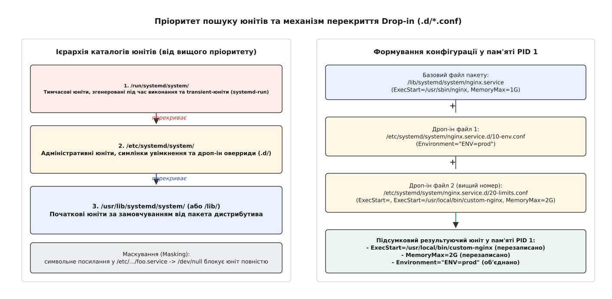
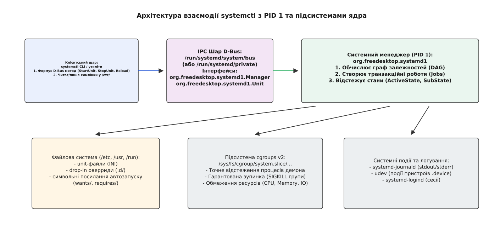
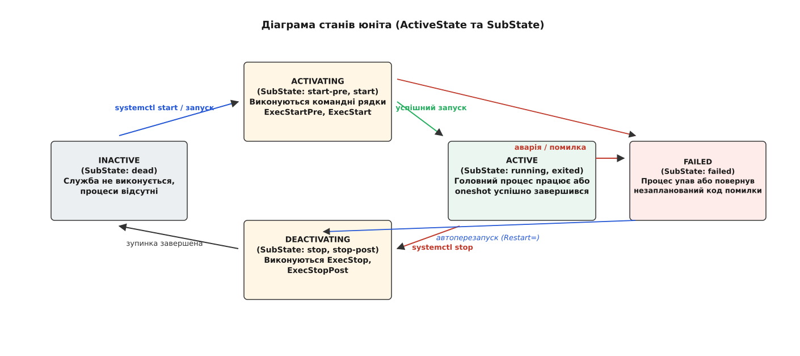

# Системний менеджер systemd: unit-файли та systemctl

<preknowlist>
- [Модель systemd: юніти, залежності, цілі](root:sys-unix/systemd-model) — концепція юнітів як вузлів графа, типи юнітів та відмінність між порядком і залежністю.
- [Роль init і особливість PID 1](root:sys-unix/init-and-pid1) — чому перший процес особливий і як він приймає сиріт та керує демонами.
- [D-Bus: шина повідомлений простору користувача](root:sys-unix/dbus) — механізм IPC, об'єкти, інтерфейси, методи та сигнали шини.
- [cgroups: облік і обмеження ресурсів](root:sys-unix/cgroups-resource-model) — групування процесів ядра Linux у контрольні групи.
</preknowlist>

Коли операційна система Linux починає роботу, перший процес у просторі користувача — PID 1 — приймає на себе задачу створення та підтримки працездатності сотень фонових служб, точок монтування, мережевих сокетів та обробників подій. У традиційних системах ця робота покладалася на імперативні командні сценарії Shell, однак відсутність стандартизованої моделі станів, складнощі при відстеженні дочірніх процесів та ризики залишення процесів-сиріт призвели до створення системного менеджера systemd. Докладніше про передумови цього переходу описано в [історичному екскурсі еволюції ініціалізації](root:sys-unix/systemd-systemctl-and-unit-files/hist-systemctl-evolution.md).

Фундаментом конфігурації системного менеджера є **юніт-файли** (unit files, від лат. *unitas* — єдність/одиниця) — декларативні описи об'єктів управління. Водночас для оперативного взаємодії з менеджерним графом утиліти системного адміністрування та автоматизації використовують інструмент **systemctl** (від англ. *system control* — управління системою), який транслює командний рядок у виклики міжпроцесного зв'язку (IPC).

---

## Анатомія юніт-файла: секції, синтаксис та ієрархія каталогів

Юніт-файл є текстом у стандартному синтаксисі `INI`. Він складається із секцій, взятих у квадратні дужки (наприклад, `[Unit]`, `[Service]`, `[Install]`), та пар ключ-значення `Key=Value`. Коментарі починаються з символів `#` або `;`. Рядки, що не вміщаються на одному екрані, можна переносувати за допомогою символу зворотного слешу `\`.

Синтаксис ключів має важливу особливість: при повторному призначенні ключа у багатьох директивах значення додаються до списку, а не перезаписують його. Щоб очистити раніше накопичений список (наприклад, у дроп-інах), задають порожнє значення виду `Key=`.

```ini
# Приклад очищення списку команд та задання нового значення
ExecStart=
ExecStart=/usr/local/bin/my-daemon --foreground
```

### Три ключові секції юніт-файла

Кожен юніт-файл розбитий на функціональні блоки, які відповідають за метадані, параметри виконання конкретного типу та правила увімкнення автозапуску.

```
+-------------------------------------------------------------------------+
| [Unit]                                                                  |
| - Метадані (Description=, Documentation=)                              |
| - Ребра графа залежностей (Wants=, Requires=, BindsTo=, Conflicts=)     |
| - Правила впорядкування часу (Before=, After=)                          |
| - Перевірки умов (ConditionPathExists=, ConditionCapability=)           |
+-------------------------------------------------------------------------+
                                    |
                                    v
+-------------------------------------------------------------------------+
| [Service] / [Socket] / [Timer] / [Mount]                                |
| - Модель запуску (Type=simple | exec | forking | oneshot | notify)     |
| - Командні рядки виконання (ExecStart=, ExecReload=, ExecStop=)         |
| - Політики перезапуску (Restart=on-failure, RestartSec=5s)              |
| - Пісочниця та ізоляція (User=, PrivateTmp=, ProtectSystem=)            |
+-------------------------------------------------------------------------+
                                    |
                                    v
+-------------------------------------------------------------------------+
| [Install]                                                               |
| - Метадані для утиліти systemctl enable/disable                         |
| - WantedBy=multi-user.target (створює символьне посилання у .wants/)    |
| - Alias=, Also= (додаткові симлінки та супутні юніти)                  |
| ⚠️ PID 1 ІГНОРУЄ цю секцію під час виконання графа запуску!             |
+-------------------------------------------------------------------------+
```

#### 1. Секція `[Unit]` та типи залежностей

Містить метадані юніта, які не залежать від його конкретного типу (будь то процес, сокет чи таймер). Тут декларується текстовий опис (`Description=`), посилання на документацію (`Documentation=`), відношення залежностей у графі, правила часового впорядкування та перевірки умов.

Розрізняють два класи відношень між юнітами в секції `[Unit]`:

- **Семантичні залежності (вимоги виконання):**
  - `Wants=` — м'яка залежність. Якщо даний юніт запускається, PID 1 спробує паралельно запустити вказані юніти, однак аварія вказаного юніта не перешкоджає запуску поточного.
  - `Requires=` — жорстка залежність. Якщо вказаний юніт не вдається запустити або він падає, запуск поточного юніта скасовується.
  - `Requisite=` — строга передумова. Поточний юніт можна запустити лише тоді, коли вказаний юніт *вже* функціонує в системі. Якщо вказаний юніт inactive, запуск негайно завершується помилкою без спроби його підняти.
  - `BindsTo=` — найжорсткіша прив'язка життєвого циклу. Якщо вказаний юніт зупиняється або раптово зникає (наприклад, мережевий пристрій `.device`), поточний юніт також негайно примусово зупиняється.
  - `PartOf=` — неявна залежність зупинки та перезапуску. Якщо юніт-батько зупиняється або перезапускається, даний юніт повторює цю дію, але його запуск не викликає запуск батька.
  - `Conflicts=` — від'ємна залежність. Запуск поточного юніта автоматично зупиняє вказані юніти.
- **Часове впорядкування (Ordering):**
  - `After=` та `Before=` — відповідають **виключно за черговість завантаження** у часі. Директива `After=network.target` означає: якщо обох юнітів включено в транзакцію, зачекати повного запуску `network.target` перед виконанням команд поточного юніта. **Важливий факт:** `After=` без `Wants=` або `Requires=` не запускає вказаний юніт, а лише впорядковує їх у разі спільного запуску!

Перевірки умов (`ConditionPathExists=`, `ConditionCapability=`, `AssertArchitecture=`) виконуються PID 1 безпосередньо перед формуванням транзакції. Якщо умова у директиві `Condition...=` повертає брехню, PID 1 пропускає запуск юніта без реєстрації помилки аварії. Якщо ж не виконується директива `Assert...=`, запуск переривається з реєстрацією збою `ActiveState=failed`.

#### 2. Секція типу (`[Service]`, `[Socket]`, `[Timer]`, `[Mount]` тощо)

Визначає специфічні параметри для даного типу об'єкта. Для служб (`[Service]`) фундаментальним є вибір моделі виконання `Type=`:

- `Type=simple` (за замовчуванням при наявності `ExecStart=`) — PID 1 створює процес через `fork()` та `execve()` і одразу вважає службу активною (`ActiveState=active`), не чекаючи завершення ініціалізації.
- `Type=exec` — PID 1 чекає, поки системний виклик `execve()` у дочірньому процесі завершиться успішно. Якщо бінарник відсутній, запуск вважається аварійним.
- `Type=forking` — класична модель традиційних демонів. PID 1 очікує, поки батьківський процес відгалузиться і завершить роботу, а новий процес залишиться у фоні. Вимагає вказувати `PIDFile=`.
- `Type=oneshot` — для одноразових задач чи скриптів. Служба вважається активною лише під час виконання командного рядка, після чого переходить у стан `ActiveState=active (exited)`.
- `Type=dbus` — служба вважається активною лише після того, як її процес зареєструє вказане ім'я на системній шині D-Bus (`BusName=`).
- `Type=notify` — розширення моделі `simple`. Процес надсилає сповіщення стану до PID 1 через сокет `sd_notify()` після завершення своєї внутрішньої ініціалізації.

#### 3. Секція `[Install]`

Містить інформацію про правила увімкнення автозапуску юніта при завантаженні системи (`WantedBy=`, `RequiredBy=`, `Alias=`, `Also=`).

**Критичний нюанс:** системний менеджер PID 1 повністю ігнорує секцію `[Install]` під час побудови графа виконання або запуску юніта! Ця секція використовується виключно утилітою `systemctl` під час виконання команд `enable` та `disable` для створення або видалення символьних посилань на диску у відповідних каталогах `.wants/` чи `.requires/`.

### Ієрархія пошуку та пріоритет каталогів

Коли PID 1 шукає юніт-файл за іменем (наприклад, `nginx.service`), він переглядає визначений список каталогів файлової системи у суворому порядку спадання пріоритету. Якщо один і той самий юніт знайдено в кількох каталогах, перемагає файл із каталогу з вищим пріоритетом.


*Ієрархія каталогів пошуку юнітів та механізм злиття оверридів Drop-in.*

- `/run/systemd/system/` (Найвищий пріоритет) — юніти, згенеровані під час виконання системи (динамічні генератори, юніти від `systemd-run`, тимчасові файли). Вони зникають після перезавантаження.
- `/etc/systemd/system/` (Середній пріоритет) — конфігураційні файли системного адміністратора, символьні посилання автозапуску та оверриди. Файли тут мають абсолютну перевагу над стандартними настройками дистрибутива.
- `/usr/lib/systemd/system/` або `/lib/systemd/system/` (Найнижчий пріоритет) — системні юніти за замовчуванням, які поставляються разом із пакетами програмного забезпечення від дистрибутива Linux. Адміністраторам суворо заборонено редагувати файли в цьому каталозі напряму, оскільки будь-якое оновлення пакета через пакетний менеджер (`apt`, `dnf`) перезапише внесені зміни.

Для юнітів користувацької сесії (`systemctl --user`) ієрархія аналогічна, але зміщена в каталог користувача: `~/.config/systemd/user/` перекриває `/etc/systemd/user/` та `/usr/lib/systemd/user/`.

---

## Спеціальні типи юнітів: `.socket`, `.timer`, `.path`, `.target`

Окрім служб `.service`, systemd керує й іншими об'єктами системної інфраструктури, кожен із яких має свій розширений синтаксис секцій.

### 1. Активація через сокети: юніти `.socket`

Юніти `.socket` дозволяють реалізувати механізм сокетної активації (socket activation). PID 1 створює та слухає мережевий або IPC сокет до запуску самій служби.

```ini
[Unit]
Description=Сокет для прийому HTTP-з'єднань вебсервера

[Socket]
ListenStream=80
ListenStream=0.0.0.0:8080
Accept=no

[Install]
WantedBy=sockets.target
```

Коли приходить вхідне TCP-з'єднання, ядро буферизує його у сокеті, а PID 1 автоматично запускає одноіменну службу `nginx.service` і передає їй відкритий дескриптор файла сокета (file descriptor) через системні змінні оточення `LISTEN_FDS` та `LISTEN_PID`. Якщо `Accept=yes`, PID 1 створює новий інстанс служби `app@.service` на кожне окреме вхідне з'єднання (подібно до `inetd`).

### 2. Запуск за розкладом: юніти `.timer`

Юніти `.timer` є сучасною заміною традиційного демона `cron`. Вони прив'язуються до одноіменного `.service` юніта і підтримують два види відліку часу:

```ini
[Unit]
Description=Таймер щоденного створення резервних копій

[Timer]
# Модель монотонного часу (відносно подій системи)
OnBootSec=15min
OnUnitActiveSec=1d

# Модель календарного часу (аналог cron)
OnCalendar=*-*-* 03:00:00
Persistent=true
RandomizedDelaySec=30m

[Install]
WantedBy=timers.target
```

Директива `Persistent=true` гарантує: якщо машина була вимкнена під час запланованого запуску (наприклад, о 03:00), PID 1 виконає пропущену службу одразу після наступного увімкнення. `RandomizedDelaySec=` додає випадкову затримку для запобігання піковим навантаженням під час одночасного запуску багатьох таймерів.

### 3. Реакція на файлову систему: юніти `.path`

Юніти `.path` відстежують зміни у файловій системі через підсистему ядра `inotify`:

```ini
[Unit]
Description=Відстеження появи нових конфігураційних файлів

[Path]
PathChanged=/etc/app/config.json
DirectoryNotEmpty=/var/spool/app/incoming
MakeDirectory=true

[Install]
WantedBy=multi-user.target
```

При зміні файла `/etc/app/config.json` або появі нових файлів у каталозі `/var/spool/app/incoming`, PID 1 автоматично активує відповідну службу `.service`.

### 4. Точки синхронізації: юніти `.target`

Юніти `.target` не мають власних команд виконання або процесів. Вони слугують віртуальними вузлами впорядкування та групування інших юнітів (наприклад, `multi-user.target`, `graphical.target`, `sockets.target`).

Перехід між тарґетами (`systemctl isolate graphical.target`) ізолює граф виконання, зупиняючи всі юніти, які не входять до графа залежностей нового тарґета.

---

## Шаблони, специфікатори та механізм Drop-in (оверриди)

У великих системах виникає потреба запускати однотипні екземпляри служб із різними параметрами — наприклад, кілька мережевих інтерфейсів, кілька процесів бази даних або контейнерів. Створення окремого юніт-файла для кожного екземпляра призвело б до дублювання конфігурації.

### Шаблонні юніти та специфікатори (Specifiers)

Для розв'язання цієї проблеми використовуються **шаблонні юніти** (template units). Назва файла шаблонного юніта містить символ `@` перед розширенням (наприклад, `app@.service`).

Коли юніт викликається з конкретним параметром інстансу — наприклад, `app@worker1.service`, системний менеджер завантажує файл `app@.service` і підставляє значення `worker1` у всі місця, де вжито спеціальні підстановочні символи — **специфікатори** (specifiers, від лат. *specificare* — визначати).

| Специфікатор | Опис підстановки | Приклад значення для `app@worker1.service` |
| :--- | :--- | :--- |
| `%i` | Назва інстансу (символи після `@`) | `worker1` |
| `%I` | Назва інстансу з декодуванням екранування | `worker1` |
| `%n` | Повне ім'я юніта | `app@worker1.service` |
| `%N` | Повне ім'я юніта без розширення | `app@worker1` |
| `%p` | Префікс юніта (символи до `@`) | `app` |
| `%u` | Ім'я користувача, від якого біжить служба | `nobody` |
| `%h` | Домашній каталог користувача | `/nonexistent` або `/home/user` |
| `%t` | Каталог тимчасових файлів виконання | `/run` |
| `%E` | Системний конфігураційний каталог | `/etc` |
| `%d` | Каталог системних креденціалів | `/run/credentials/app@worker1.service` |

Якщо параметр інстансу містить шляхи файлової системи зі слешами (наприклад, мовлення про диск `/dev/sda1`), у назві юніта слеші екрануються дефісами: `systemd-getty-generator` створює `dev-sda1.device`. Для зворотного перетворення слугує утиліта `systemd-escape`.

### Механізм Drop-in оверридів

Щоб змінити один або кілька параметрів у системному юніті (наприклад, додати змінну оточення чи підвищити межу пам'яті в `nginx.service`), немає потреби копіювати весь юніт-файл з `/lib/systemd/system/` у `/etc/systemd/system/`.

Замість цього використовується механізм **Drop-in** (від англ. *drop-in* — доважок/вкладка). У каталозі `/etc/systemd/system/` створюється підкаталог із назвою юніта та суфіксом `.d` — наприклад, `/etc/systemd/system/nginx.service.d/`. Усі файли з розширенням `.conf` у цьому каталозі парсяться PID 1 в алфавітному порядку і зливаються з основним юнітом.

> 🔧 **Навіщо це.**
> Завдяки механізму Drop-in адміністратор змінює лише потрібні пари `Key=Value` у невеликому файлі `/etc/systemd/system/nginx.service.d/override.conf`. Під час оновлення пакета `nginx` системний файл `/lib/systemd/system/nginx.service` оновлюється безпечно, а адміністративний оверрид продовжує застосовуватися поверх нового конфігу.

Для розширених шаблонів оверриди працюють як для всього шаблону (`app@.service.d/*.conf`), так і для конкретного інстансу (`app@worker1.service.d/*.conf`).

### Маскування юнітів (Masking)

Якщо службу потрібно гарантовано вимкнути так, щоб її не міг запустити ані адміністратор вручну, ані інші юніти через ребра залежностей (`Wants=`, `Requires=`), її піддають **маскуванню** (masking).

Під час виконання `systemctl mask nginx.service` утиліта створює символьне посилання `/etc/systemd/system/nginx.service`, яке вказує на спеціальний пристрій порожнечі `/dev/null`. Під час спроби завантажити такий юніт PID 1 бачить `LoadState=masked` і відхиляє будь-які транзакції з помилкою `Unit nginx.service is masked`.

---

## Безпека та ізоляція системних служб у `[Service]`

Один із найбільших здобутків systemd — інтеграція просторів імен ядра Linux (namespaces), підсистеми `cgroups v2` та підсистем фільтрації системних викликів (Seccomp) безпосередньо в директиви юніт-файла.

```ini
[Service]
# Обмеження прав та привілеїв
User=nobody
Group=nogroup
NoNewPrivileges=yes
CapabilityBoundingSet=CAP_NET_BIND_SERVICE

# Ізоляція файлової системи
ProtectSystem=strict
ProtectHome=yes
PrivateTmp=yes
PrivateDevices=yes
ProtectKernelTunables=yes
ProtectControlGroups=yes

# Фільтрація системних викликів Seccomp
SystemCallFilter=@default @network-io ~@clock ~@cpu-emulation

# Обмеження ресурсів cgroups v2
MemoryMax=512M
CPUQuota=150%
```

- **`NoNewPrivileges=yes`** — встановлює біт `PR_SET_NO_NEW_PRIVS`, запобігаючи отриманню процесів підвищених привілеїв через `setuid`/`setgid` бінарники.
- **`CapabilityBoundingSet=`** — обмежує набір POSIX capabilities. Наприклад, `CAP_NET_BIND_SERVICE` дозволяє прив'язуватися до привілейованих портів (нижчих 1024) без надання повних прав `root`.
- **`ProtectSystem=strict`** — монтує всю файлову систему у режимі лише для читання (`read-only`), окрім каталогів, явно дозволених через `ReadWritePaths=`.
- **`SystemCallFilter=`** — підключає фільтр Seccomp BPF. Символ `~` означає інверсію (заборону списку системних викликів).

---

## Архітектура `systemctl`: від командного рядка до D-Bus IPC

Утиліта `systemctl` не є безпосереднім менеджером процесів. Вона виконує роль клієнтської обгортки (IPC client), яка приймає аргументи командного рядка адміністратора, перевіряє права та надсилає структуровані запити до PID 1 через системну шину **D-Bus**.


*Архітектура взаємодії утиліти systemctl з системним менеджером PID 1 через D-Bus.*

### Канали міжпроцесного зв'язку D-Bus

Під час звичайного функціонування системи `systemctl` підключається до сокета системної шини D-Bus за адресою `/run/systemd/system/bus` (або через `dbus-daemon`/`dbus-broker` за адресою `/var/run/dbus/system_bus_socket`).

Однак під час ранньої фази завантаження (коли шина D-Bus ще не піднялася) або в режимі відновлення (emergency mode), PID 1 відкриває власний приватний сокет управління `/run/systemd/private`. Якщо шина D-Bus недоступна, `systemctl` автоматично перемикається на цей сокет, забезпечуючи можливість управління юнітами в найзахищеніших умовах.

Повний перелік методів, властивостей, сигналів та кодів помилок D-Bus наведено в [довідці за D-Bus інтерфейсом systemd](root:sys-unix/systemd-systemctl-and-unit-files/api-systemctl-dbus.md).

### Групи команд `systemctl`

Усі команди утиліти `systemctl` розбиваються на чотири чіткі категорії за принципом своєї дії:

1. **Інспекція станів (Inspection commands).**
   - `systemctl status <unit>` — запитує властивості юніта через D-Bus (`ActiveState`, `SubState`, `MainPID`, cgroup) та виводить останні рядки логів із `journald`.
   - `systemctl is-active <unit>` / `systemctl is-enabled <unit>` — повертає `0` або ненульовий код для використання у командних скриптах.
   - `systemctl show <unit>` — вивантажує абсолютно всі внутрішні властивості юніта у форматі `Key=Value`.
   - `systemctl cat <unit>` — відображає канонічний вміст основного unit-файла разом з усіма застосованими drop-in оверридами.
2. **Управління транзакціями (Lifecycle commands).**
   - `systemctl start <unit>` / `stop` / `restart` / `reload` — викликає відповідні методи (`StartUnit`, `StopUnit` тощо) на інтерфейсі `org.freedesktop.systemd1.Manager`. PID 1 створює транзакцію, обчислює необхідні роботи (`Jobs`) і повертає `systemctl` об'єктний шлях створеної роботи.
3. **Управління автозапуском та диском (Enablement commands).**
   - `systemctl enable <unit>` / `disable` / `mask` / `unmask` — ця група команд **не змінює стан процесів у пам'яті PID 1** безпосередньо. Вона маніпулює символьними посиланнями у каталозі `/etc/systemd/system/` (створює посилання у підкаталогах `.wants/` чи `.requires/` на основі секції `[Install]`). Щоб одночасно змінити посилання та запустити службу, додають прапорець `--now` (`systemctl enable --now nginx`).
4. **Переконфігурація двигуна (Daemon control).**
   - `systemctl daemon-reload` — викликає метод `Reload()` на інтерфейсі менеджера. PID 1 заново сканує всі каталоги пошуку, повторно парсить усі INI-файли та дроп-іни, перебудовує внутрішній орієнтований граф залежностей та оновлює стани юнітів у пам'яті.
   - `systemctl daemon-reexec` — викликає `execv()` для самого процесу PID 1, перезапускаючи код системного менеджера без зупинки фонових процесів та cgroups.

---

## Транзакції, роботи (Jobs) та стейт-машина юнітів

Коли системний адміністратор виконує команду `systemctl start foo.service`, PID 1 не просто запускає бінарний файл. Він виконує повноцінний алгоритм побудови та перевірки **транзакції**.

### Транзакції та роботи (Jobs)

Транзакція — це сукупність робіт (Jobs), які необхідно виконати над графом юнітів для досягнення цільового стану.

1. **Побудова графа робіт.** PID 1 аналізує юніт `foo.service` та всі юніти, з якими він пов'язаний ребрами `Requires=`, `Wants=`, `BindsTo=`, `Conflicts=`, `Before=` та `After=`. Для кожного задіяного юніта створюється об'єкт `Job` із запланованою дією (`start`, `stop`, `restart`, `nop`).
2. **Перевірка на конфлікти.** Якщо транзакція містить суперечливі вимоги (наприклад, роботу `start` для юніта A та роботу `stop` для нього ж через ребро `Conflicts=`), PID 1 намагається розв'язати конфлікт шляхом скасування другорядних робіт. Якщо конфлікт нерозв'язний, транзакція відхиляється з помилкою `TransactionJobConflict`.
3. **Асинхронне виконання та D-Bus сповіщення.** PID 1 поміщає роботи у чергу виконання і повертає утиліти `systemctl` об'єктний шлях нової роботи (наприклад, `/org/freedesktop/systemd1/job/412`). За замовчуванням `systemctl` блокується і чекає на сигнал D-Bus `JobRemoved`, який сповіщає про завершення або аварію роботи. Прапорець `--no-block` дозволяє надіслати запит і одразу повернути керування в консоль.

Приклад практичної реалізації програмного управління юнітами та підписки на сигнали робіт через бібліотеку `sd-bus` наведено у [проектній вставці на C та C++](root:sys-unix/systemd-systemctl-and-unit-files/proj-dbus-unit-control.md).

### Стейт-машина станів юніта

Кожен юніт у пам'яті PID 1 описується двома незалежними осями станів: **ActiveState** (високорівневий стан) та **SubState** (низькорівневий стан конкретного типу).


*Стейт-машина станів юніта ActiveState та SubState.*

Головні значення високорівневого стану `ActiveState`:
- `inactive` — юніт зупинений, процеси відсутні (`SubState: dead`).
- `activating` — юніт знаходиться в процесі запуску (виконуються команди `ExecStartPre=` або `ExecStart=`, `SubState: start-pre`, `start`).
- `active` — юніт успішно запущений і функціонує (для тривалих служб `SubState: running`; для одноразових завдань `Type=oneshot` після успішного виходу `SubState: exited`).
- `deactivating` — юніт знаходиться в процесі зупинки (виконуються `ExecStop=`, `ExecStopPost=`, `SubState: stop`, `stop-post`).
- `failed` — процес служби завершився з помилкою, повернув незапланований код виходу або упав за сигналом (`SubState: failed`).

---

## Діагностика, налагодження та крайові випадки

На практиці системні адміністратори та розробники зіштовхуються з випадками, коли служба відмовляється запускатися, входить у нескінченний цикл перезапусків або завершується з незрозумілими кодами помилок.

### Аналіз помилок запуску та коди помилок systemd

Коли команда `systemctl status <unit>` показує стан `Active: failed (Result: exit-code)`, першим джерелом інформації є поля `Process:` та `main process exited, code=exited, status=...`.

systemd має власну таблицю внутрішніх кодів помилок для випадків, коли сам системний менеджер не зміг підготувати оточення для запуску процесу (наприклад, не знайшов бінарний файл або не зміг змінити користувача):

| Код помилки PID 1 | Символічна назва | Причина збою |
| :--- | :--- | :--- |
| `200/CHDIR` | `EXIT_CHDIR` | Не вдалося перейти у робочий каталог, вказаний у `WorkingDirectory=`. |
| `201/NICE` | `EXIT_NICE` | Не вдалося встановити пріоритет процесу `Nice=`. |
| `202/HASHLEN` | `EXIT_MEMORY` | Брак пам'яті під час підготовки оточення. |
| `203/EXEC` | `EXIT_EXEC` | **Найпоширеніша помилка:** не вдалося виконати бінарний файл із `ExecStart=` (файл не знайдено, відсутній прапорець виконання `+x` або пошкоджений інтерпретатор shebang). |
| `209/STDOUT` | `EXIT_STDOUT` | Не вдалося перенаправити стандартний вивід у лог чи файл. |
| `216/GROUP` | `EXIT_GROUP` | Вказана у `Group=` група не існує в системі. |
| `217/USER` | `EXIT_USER` | Вказаний у `User=` користувач не існує в системі. |

### Інструменти діагностики: `systemd-analyze` та `journalctl`

Для швидкої статичної перевірки юніт-файла на наявність синтаксичних помилок перед його запуском використовують утиліту `systemd-analyze verify`:

```bash
# Статична перевірка юніт-файла на синтаксичні помилки
systemd-analyze verify /etc/systemd/system/my-app.service
```

Якщо служба запускається, але одразу падає, журнал її виводу `stdout` та `stderr` зчитують за допомогою `journalctl`:

```bash
# Перегляд детального логу конкретного юніта в режимі реального часу
journalctl -u my-app.service -f -o cat
```

### Динамічні тимчасові юніти (`systemd-run`)

У багатьох сценаріях автоматизації виникає потреба виконати одноразову команду у фоні з тими самими обмеженнями ресурсів та ізоляцією `cgroups`, якими володіють повноцінні служби, але без створення фізичного unit-файла на диску.

Для цього слугує утиліта `systemd-run`, яка формує **тимчасовий юніт** (transient unit) напряму в пам'яті PID 1 через D-Bus метод `TransientUnit`:

```bash
# Запуск одноразового процесу у фоні з обмеженням пам'яті 512M
systemd-run --unit=backup-job --property=MemoryMax=512M /usr/local/bin/do-backup.sh
```

Такий тимчасовий юніт отримує власну контрольну групу в `/sys/fs/cgroup/system.slice/backup-job.service`, а його вивід повністю реєструється в `journald`. Після завершення виконання тимчасовий юніт автоматично прибирається з пам'яті PID 1.
