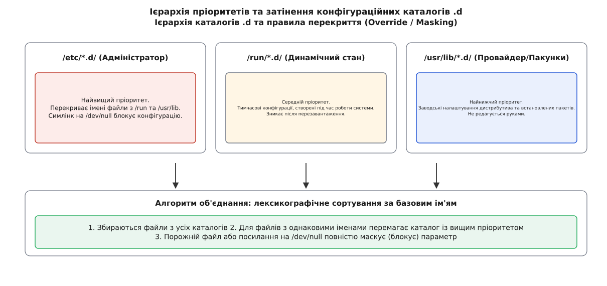
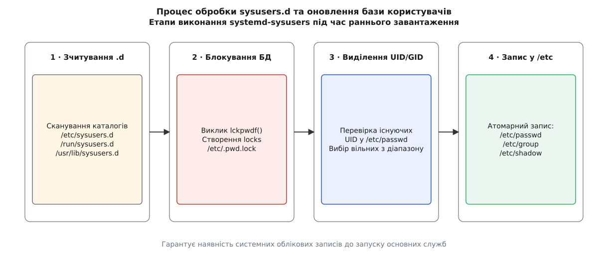
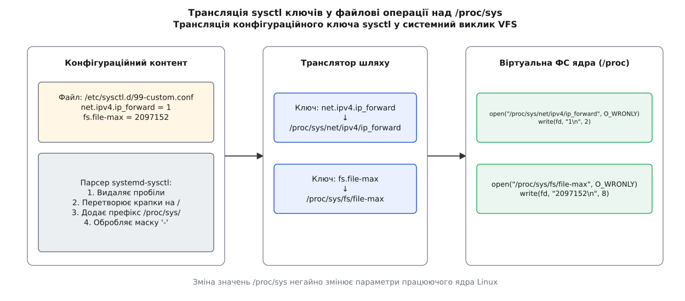
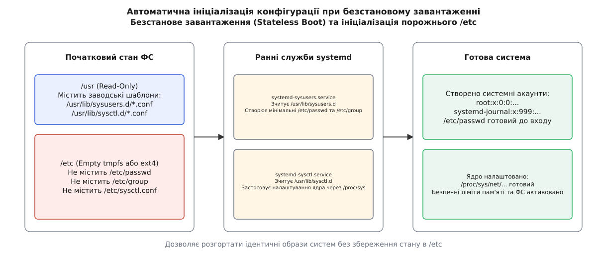

# Декларативне налаштування системи: systemd-sysusers та systemd-sysctl

<preknowlist>
- [Концепції ядра Linux](root:sys-unix/kernel-and-userspace) — системні виклики, простір користувача та файлова система VFS.
- [Модель юнітів та залежностей systemd](root:sys-unix/systemd-model) — граф залежностей, цілі (targets) та службові юніти.
- [Ініціалізація системи: init та PID 1](root:sys-unix/init-and-pid1) — запуск базових служб та передача управління від ядра.
</preknowlist>

Під час завантаження операційної системи або встановлення нового пакету програмного забезпечення на Linux-систему з порожнім або монтованим лише на читання каталогом `/etc` (наприклад, у безстанових контейнерах або атомарних дистрибутивах), традиційний імперативний запуск скриптів з командами `useradd` або `sysctl -p` завершується з помилкою відсутності прав запису або пошкодженням конфігураційних файлів. Якщо системний демон, такий як `systemd-journald`, активується до того, як його службовий обліковий запис з UID 999 зафіксовано у файлі `/etc/passwd`, або до того, як параметр переадресації пакетів `net.ipv4.ip_forward=1` записано у віртуальну файлову систему ядра, процес зупиняється з помилкою доступу `EPERM`, а мережевий стек залишається непрацездатним. Інструменти `systemd-sysusers` та `systemd-sysctl` вирішують цю проблему, замінюючи імперативні скрипти оболонки декларативними текстовими файлами у спеціальних каталогах розширення `.d` (drop-in directories), які обробляються на ранньому етапі ініціалізації системи.

Декларативний підхід (лат. *declarare* — проголошувати, описувати бажаний стан) переносить відповідальність за створення користувачів та налаштування параметрів ядра (англ. *kernel system control*) з інсталяційних скриптів окремих пакетів на централізовані службові демони systemd.

## Архітектура та пріоритет конфігураційних каталогів .d

Класична архітектура Unix спиралася на монолітні конфігураційні файли `/etc/passwd`, `/etc/group` та `/etc/sysctl.conf`. При встановленні або оновленні програмного забезпечення кожен пакет намагався модифікувати ці файли за допомогою імперативних утиліт або скриптів оболонки (`sed`, `awk`, `grep`). Це призводило до гонок станів при паралельному встановленні пакетів, виникнення недетермінованих UID/GID на різних машинах та унеможливлювало створення захищених систем з файловою системою `/etc` у режимі read-only.

Для вирішення цих структурних проблем підсистема systemd впровадила уніфікований шаблон конфігураційних каталогів розширення `.d`. Замість редагування єдиного файлу, кожен пакет постачає власні декларативні шматочки налаштувань.

*Рис. 1. Ієрархія пріоритетів та затінення конфігураційних каталогів .d*

Ієрархія обходу каталогів розділена на три фундаментальні рівні з чітко визначеним пріоритетом:

1. **Каталог адміністратора (`/etc/sysusers.d/*.conf`, `/etc/sysctl.d/*.conf`)**:
   Має найвищий пріоритет. Використовується системним адміністратором для локального перевизначення будь-яких параметрів. Зміни у цьому каталозі зберігаються при оновленні пакетів.
2. **Каталог часу виконання (`/run/sysusers.d/*.conf`, `/run/sysctl.d/*.conf`)**:
   Має середній пріоритет. Розміщується у тимчасовій файловій системі в оперативній пам'яті (`tmpfs`). Використовується генераторами systemd, контейнерними середовищами та динамічними службами для внесення тимчасових налаштувань, які автоматично видаляються при перезавантаженні.
3. **Заводський каталог дистрибутива (`/usr/lib/sysusers.d/*.conf`, `/usr/lib/sysctl.d/*.conf`)**:
   Має найнижчий пріоритет. Містить заводські конфігурації за замовчуванням, які постачаються розробниками дистрибутива та менеджерами пакетів (RPM, dpkg). Ці файли вважаються незмінними для адміністратора і перезаписуються при оновленні пакетів.

### Алгоритм дедуплікації, затінення та сортування

Обробка конфігураційних каталогів виконується парсером за чітко розробленим конвеєром (pipeline):

- **Послідовне сканування джерел**: Парсер формує список всіх файлів з розширенням `.conf` у каталогах `/etc`, `/run` та `/usr/lib`.
- **Затінення (Shadowing)**: Обробка виконується на основі базового імені файлу (filename). Якщо файл з однаковою базовою назвою (наприклад, `50-default.conf`) присутній і в `/usr/lib/sysctl.d/`, і в `/etc/sysctl.d/`, файл із каталог з вищим пріоритетом (`/etc/`) повністю затіняє заводську версію. Файл із `/usr/lib/` у цьому випадку навіть не відкривається для читання.
- **Маскування (Masking)**: Якщо системний адміністратор бажає повністю скасувати заводську конфігурацію дистрибутива, не видаляючи оригінальний файл із `/usr/lib/` (що неможливо в системі з read-only `/usr`), він створює у `/etc/sysctl.d/50-default.conf` порожній файл розміром 0 байт або символічне посилання на `/dev/null`. Утиліти systemd розпізнають це як явне маскування параметра і повністю виключають цей конфігураційний шматочок з обробки.
- **Лексикографічне сортування за кодами ASCII**: Усі унікальні конфігураційні файли, що залишилися після затінення та маскування, сортуються за кодами ASCII їхніх імен. Завдяки цьому числові префікси у назвах файлів (наприклад, `10-security.conf`, `50-default.conf`, `99-override.conf`) гарантують точний і передбачуваний порядок виконання.

Детальний аналіз алгоритму обходу та підводних каменів об'єднання каталогів висвітлено у матеріалі [Ієрархія та пріоритет каталогів .d](root:sys-unix/systemd-sysusers-and-sysctl-d/comp-dot-d-hierarchy-precedence.md). Контекст переходу від традиційних скриптів до декларативних шматочків описано в [Історії еволюції декларативного налаштування](root:sys-unix/systemd-sysusers-and-sysctl-d/hist-declarative-sysconfig-evolution.md).

## Механізм створення системних акаунтів через systemd-sysusers

Під час раннього завантаження Linux, до запуску основних системних служб та монтування мережевих файлових систем, виконується спеціальний одноразовий юніт `systemd-sysusers.service`. Він належить до категорії послуг ранньої ініціалізації та має залежність `Before=sysinit.target` з вимкненими стандартними залежностями (`DefaultDependencies=no`).

*Рис. 2. Процес обробки sysusers.d та оновлення бази користувачів*

Основне завдання `systemd-sysusers` — гарантувати наявність усіх системних користувачів, груп та їхніх членств у файлах `/etc/passwd` та `/etc/group` до того, як буде активовано відповідні демони.

### Внутрішня логіка та етапи виконання

1. **Сканування та об'єднання**: Зчитуються конфігураційні файли з ієрархії `sysusers.d`.
2. **Блокування бази даних**: Для запобігання конфліктам при паралельній роботі з іншими інструментами (наприклад, під час одночасного виконання встановлення пакетів менеджером `rpm` чи `dpkg`), утиліта викликає системну функцію `lckpwdf()`. Цей виклик створює ексклюзивне блокування через файл `/etc/.pwd.lock` з механізмом таймауту.
3. **Парсинг та виділення ID**: Зчитані декларації аналізуються за типами:
   - **`u` (User)**: Описує створення користувача та його первинної групи. Якщо конкретний UID зафіксовано в конфігурації (наприклад, `u systemd-journal 999`), утиліта перевіряє його вільність. Якщо UID вказано як `-`, утиліта шукає найменший вільний UID у діапазоні системних користувачів (`SYS_UID_MIN`..`SYS_UID_MAX` з `/etc/login.defs`, зазвичай 100–999).
   - **`g` (Group)**: Створює лише системну групу.
   - **`m` (Membership)**: Включає користувача у додаткову групу.
   - **`r` (Range)**: Резервує діапазон ID від динамічного розподілу.
4. **Атомарний запис у базу даних**: Нові записи додаються у файли `/etc/passwd`, `/etc/group`, `/etc/shadow` та `/etc/gshadow`. Після завершення викликом `ulckpwdf()` блокування знімається.

Для гарантування безпеки всі створювані системні користувачі за замовчуванням отримують заблокований пароль (`!`) у файлі `/etc/shadow` та оболонку `/sbin/nologin` або `/usr/bin/nologin`, що унеможливлює інтерактивний вхід у систему під цими акаунтами.

### Особливості виділення UID/GID та безпека системних облікових записів

Виділення числових ідентифікаторів у `systemd-sysusers` спирається на чітке розмежування між системними та звичайними користувачами. У класичних Unix-системах діапазон UID 0..999 зарезервовано для операційної системи та її служб, тоді як звичайні користувачі починаються з UID 1000 (`UID_MIN` у `/etc/login.defs`).

Коли `systemd-sysusers` обробляє запис із автоматичним виділенням (`u name -`), утиліта виконує наступні перевірки:
- Перевіряє наявні записи в локальних файлах `/etc/passwd` та `/etc/group`.
- Здійснює запити до NSS (Name Service Switch) через `getpwnam()` та `getgrnam()`, щоб запобігти колізіям з мережевими каталогами (LDAP, Active Directory, FreeIPA), якщо вони налаштовані у `/etc/nsswitch.conf`.
- Шукає найменший вільний числове значення UID у діапазоні `SYS_UID_MIN`..`SYS_UID_MAX`.

Крім того, декларація типу `u` підтримує прив'язку UID до власника існуючого файлового об'єкта. Якщо в полі `ID` вказано шлях до файлу (наприклад, `u metrics /var/lib/metrics`), `systemd-sysusers` використає UID та GID, якими володіє цей каталог на файловій системі. Це забезпечує сумісність при міграціях даних між різними системами.

При створенні системного запису у файлі `/etc/shadow` генерується стрічка з прапорцем блокування пароля (`!`), що унеможливлює використання будь-яких стандартних методів автентифікації через PAM (Pluggable Authentication Modules). Дата останньої зміни пароля встановлюється рівною кількості днів з 1 січня 1970 року, а поля терміну дії заповнюються значеннями за замовчуванням. Також для системних користувачів не створюються діапазони підпорядкованих ідентифікаторів у `/etc/subuid` та `/etc/subgid`, якщо вони не вказані явно.

Різниця між `systemd-sysusers` та механізмом `DynamicUser=yes` у службах systemd є концептуальною: `systemd-sysusers` створює **постійні** системні акаунти на диску у `/etc/passwd`, які володіють файлами у `/var/lib/`, тоді як `DynamicUser=yes` виділяє **тимчасовий UID** із діапазону 61184..65519 у оперативній пам'яті лише на час роботи процесу.

Синтаксис конфігураційних рядків та специфікацію полів наведено у довіднику [Специфікація синтаксису sysusers.d та sysctl.d](root:sys-unix/systemd-sysusers-and-sysctl-d/api-sysusers-and-sysctl-formats.md).

`systemd-sysusers` також підтримує режим офлайн-ініціалізації через прапор `--root=/target/path`. Це дозволяє збирати образи контейнерів, формувати дистрибутивні rootfs або виконувати підготовку системи інструментом `systemd-firstboot` без запусків демонів усередині цільової файлової системи.

## Динамічна трансляція та налаштування ядра через systemd-sysctl

Параметри оперативної поведінки ядра Linux (налаштування мережевого стеку, ліміти віртуальної пам'яті, параметри файлових систем та безпеки) експонуються у просторі користувача через віртуальну файлову систему `/proc/sys/`. За застосування цих параметрів під час завантаження відповідає юніт `systemd-sysctl.service`.

Ця служба запускається на ранньому етапі завантаження — після завантаження необхідних модулів ядра (`After=systemd-modules-load.service`), але строго до ініціалізації мережевих інтерфейсів (`Before=sysinit.target` та `Before=network.target`).

*Рис. 3. Трансляція sysctl ключів у файлові операції над /proc/sys*

### Механіка трансляції ключів у файлові шляхи

Утиліта `systemd-sysctl` зчитує конфігураційні шматочки з каталогів `sysctl.d` та виконує їх перетворення у системні виклики файлової системи:

1. **Стріппінг та крапкова трансляція**: Ключ виду `net.ipv4.ip_forward` очищується від пробілів. Кожна крапка замінюється на символ косої риски `/`, формуючи відносний шлях `net/ipv4/ip_forward`.
2. **Формування абсолютного шляху VFS**: Шлях поєднується з префіксом `/proc/sys/`, утворюючи підсумковий шлях до віртуального файлу `/proc/sys/net/ipv4/ip_forward`.
3. **Обробка масок масового застосування (Globbing)**: Якщо ключ містить символ зірочки (наприклад, `net.ipv4.conf.*.rp_filter = 1`), утиліта виконує обхід усіх підкаталогів у `/proc/sys/net/ipv4/conf/` і записує значення у кожен виявлений файл `rp_filter`.
4. **Запис значення**: Виконується системний виклик `open()` у режимі запису (`O_WRONLY`) та виклик `write()` для передачі текстового значення у драйвер ядра. Усередині ядра Linux обробка запису виконується функціями `proc_dostring()` або `proc_dointvec()`, які валідують межі переданих чисел.

### Основні підсистеми /proc/sys/ та їх налаштування

Віртуальна файлова система `/proc/sys/` розділена на кілька ключових підкаталогів, кожен з яких відповідає за певну підсистему ядра Linux:

- **`/proc/sys/net/` (Мережевий стек)**:
  Містить параметри протоколів IPv4, IPv6, IPC, розширення socket та фільтрації пакетів.
  Типові ключі: `net.ipv4.ip_forward = 1` (увімкнення маршрутизації), `net.core.somaxconn = 4096` (розмір черги LISTEN для високонавантажених сокетів), `net.ipv4.tcp_max_syn_backlog = 8192` (захист від SYN-flood атак).
  Важливо зазначити, що параметри мережевого стеку у `/proc/sys/net/` ізольовані у межах мережевих просторів імен (Network Namespaces). Зміни, внесені через `systemd-sysctl` на головному хості, впливають лише на початковий мережевий простір імен (`init_net`), тоді як ізольовані контейнери оперують власними копіями цих віртуальних файлів.

- **`/proc/sys/fs/` (Файлові системи та ліміти VFS)**:
  Керує глобальними лімітами дескрипторів, inotify-спостерігачів, захистом симлінків та квот.
  Типові ключі: `fs.file-max = 2097152` (максимальна кількість відкритих файлів у системі), `fs.inotify.max_user_watches = 524288` (ліміт спостереження за файлами для систем моніторингу та контейнерів), `fs.protected_symlinks = 1` та `fs.protected_hardlinks = 1` (захист від атак через символічні посилання у системних тимчасових каталогах `/tmp`).

- **`/proc/sys/vm/` (Віртуальна пам'ять та пейджинг)**:
  Налаштовує агресивність скидання сторінок на диск (swappiness), ліміти брудних сторінок (dirty ratio) та захист від вичерпання пам'яті (OOM).
  Типові ключі: `vm.swappiness = 10` (зменшення використання підкачки пам'яті), `vm.max_map_count = 262144` (максимальна кількість областей VMA для таких БД як Elasticsearch та процесів JVM).

- **`/proc/sys/kernel/` (Загальні параметри ядра)**:
  Керує механізмами випадковості адресного простору (ASLR), макросом SysRq, лімітами PID, доступом до dmesg та ptrace.
  Типові ключі: `kernel.randomize_va_space = 2` (повна рандомізація ASLR), `kernel.pid_max = 4194304` (розширення діапазону процесів у 64-бітних системах), `kernel.kptr_restrict = 2` (приховування вказівників ядра від звичайних користувачів).

### Перехоплення помилок та автозавантаження модулів

Якщо конфігураційний ключ стосується підсистеми ядра, яка реалізовано у вигляді окремого модуля (наприклад, фільтр мережевих пакетів `netfilter` або IPv6), спроба відкрити відповідний файл у `/proc/sys/` до завантаження модуля поверне системну помилку `ENOENT` (файл або каталог не існує).

Для керування поведінкою при помилках синтаксис `sysctl.d` підтримує префікс дефіса `-`:
- **Ключ без дефіса (`net.ipv4.ip_forward = 1`)**: Якщо файл у `/proc/sys/` відсутній або ядро повертає помилку доступу, `systemd-sysctl` реєструє критичну помилку в журналі та повертає ненульовий код завершення.
- **Ключ із дефісом (`-net.ipv6.conf.all.disable_ipv6 = 1`)**: Повідомляє утиліті про м'яке ігнорування помилки. Якщо ядро не підтримує цей параметр або модуль не завантажено, помилка мовчки ігнорується, а завантаження системи продовжується.

Крім того, при виклику певних параметрів sysctl ядро Linux може автоматично ініціювати внутрішньоядерне завантаження відповідних модулів через механізм `request_module()`.

## Порівняння інструментів декларативного провіжнінгу systemd

Для кращого розуміння місця `systemd-sysusers` та `systemd-sysctl` взагалі в екосистемі systemd, нижче зведено порівняльну таблицю ключових служб декларативної ініціалізації операційного середовища:

| Інструмент | Цільовий об'єкт налаштування | Конфігураційні каталоги | Термін життя змін |
| :--- | :--- | :--- | :--- |
| **`systemd-sysusers`** | Системні користувачі, групи та членства | `/usr/lib/sysusers.d/*.conf` `/etc/sysusers.d/*.conf` | Постійний (запис у `/etc/passwd` та `/etc/group`) |
| **`systemd-sysctl`** | Динамічні параметри ядра Linux | `/usr/lib/sysctl.d/*.conf` `/etc/sysctl.d/*.conf` | До перезавантаження (запис у `/proc/sys/`) |
| **`systemd-tmpfiles`** | Каталоги, файли, сокети, права та очищення | `/usr/lib/tmpfiles.d/*.conf` `/etc/tmpfiles.d/*.conf` | Залежить від типу правил (постійні файли або `tmpfs`) |
| **`systemd-binfmt`** | Реєстрація дворазових форматів (QEMU/WINE) | `/usr/lib/binfmt.d/*.conf` `/etc/binfmt.d/*.conf` | До перезавантаження (запис у `/proc/sys/fs/binfmt_misc`) |
| **`environment.d`** | Змінні оточення користувача | `/usr/lib/environment.d/*.conf` `/etc/environment.d/*.conf` | На час користувацького сеансу systemd --user |

## Безстанове завантаження (Stateless Boot) та взаємодія у екосистемі systemd

Сучасні концепції побудови операційних систем (такі як Fedora Silverblue, Flatcar Container Linux, NixOS та образно-орієнтовані системи з атомарним оновленням A/B) вимагають можливості завантаження системи з повністю порожнім каталогом `/etc` (Factory Reset або Stateless Boot).

*Рис. 4. Автоматична ініціалізація конфігурації при безстановому завантаженні*

У такій архітектурі розділ `/usr` монтується в режимі Read-Only і містить усі заводські конфігурації дистрибутива у каталогах `/usr/lib/sysusers.d/` та `/usr/lib/sysctl.d/`. Каталог `/etc` при першому старті є порожнім або розміщеним у `tmpfs`.

Під час першого завантаження:
1. `systemd-sysusers.service` зчитує заводські шаблони з `/usr/lib/sysusers.d/` та автоматично генерує мінімальні файли `/etc/passwd` і `/etc/group`.
2. `systemd-sysctl.service` зчитує `/usr/lib/sysctl.d/` і налаштовує параметри ядра без створення будь-яких файлів у `/etc`.
3. `systemd-tmpfiles.service` створює необхідні каталоги у `/var/lib/` та `/var/log/`, встановлюючи їхнім власником UID, створений на кроці 1.
4. `systemd-firstboot.service` запитує у користувача або автоматично генерує локаль, часовий пояс та ім'я хоста.

Ця синергія дозволяє отримувати ідентичний, детермінований стан системи при кожному завантаженні, повністю усуваючи проблему "дрейфу конфігурацій" (configuration drift) та спрощуючи відновлення систем після збоїв.

### Діагностика та усунення несправностей

При виникненні проблем з декларативним налаштуванням адміністратор має широкий набір діагностичних команд:
- **Перевірка стану послуг**: `systemctl status systemd-sysusers.service` та `systemctl status systemd-sysctl.service` дозволяють перевірити код завершення та час виконання служб.
- **Аналіз логів завантаження**: Команда `journalctl -u systemd-sysusers.service` покаже детальний список створених користувачів та будь-які попередження щодо колізій UID.
- **Інспектування параметрів ядра**: Команда `sysctl -a` виводить поточні значення всіх параметрів `/proc/sys/`, а `sysctl --system` повторно зчитує і застосовує всі файли з ієрархії `.d` на працюючій системі.

Розбір практичної реалізації власного рушія з блокуванням файлів та обходом каталогів наведено у матеріалі [Реалізація рушія декларативного налаштування користувачів та параметрів ядра](root:sys-unix/systemd-sysusers-and-sysctl-d/proj-declarative-provisioning-engine.md).

> 🔧 **Навіщо це.**
> Декларативне налаштування через `sysusers.d` та `sysctl.d` є стандартом для сучасного пакування програмного забезпечення та DevOps-практик. Замість написання крихких баш-скриптів у специфікаціях RPM (`%pre`) або Debian (`postinst`), розробник додає у свій пакет два статичні конфігураційні файли. Це гарантує, що системний користувач отримає однаковий UID при повторному розгортанні, параметр ядра буде застосовано до запуску мережі, а видалення або оновлення пакету не пошкодить конфігураційні файли суміжних служб.
