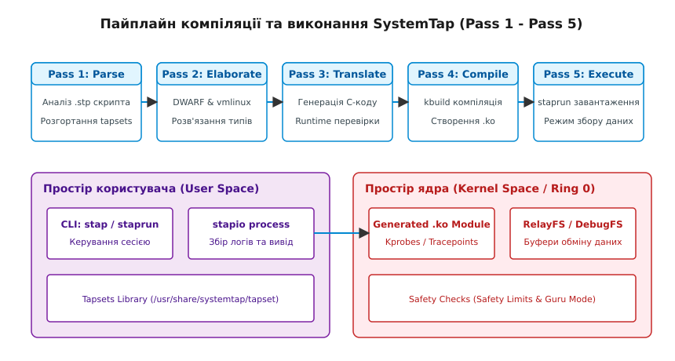
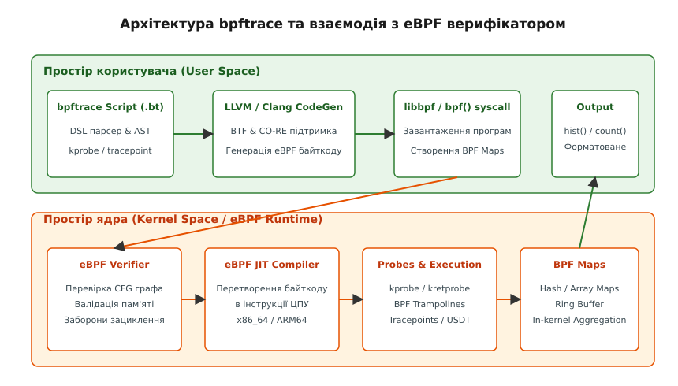
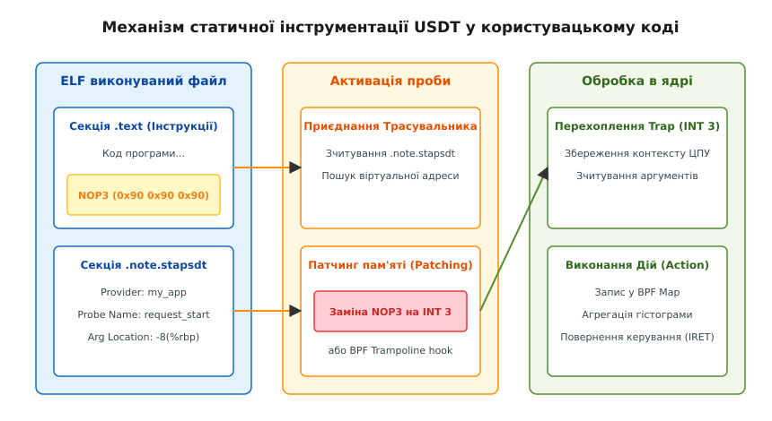

# Високорівневе трасування: SystemTap та bpftrace

<preknowlist>
- [eBPF](root:sys-unix/ebpf-programming-model-and-toolchain) — механізм віртуальної машини та інструментації в ядрі Linux.
- [Kprobes та Tracepoints](root:sys-unix/uprobes-and-kprobes) — точки динамічного та статичного перехоплення функцій у ядрі та просторі користувача.
- [Ftrace](root:sys-unix/ftrace-kernel-tracing) — внутрішній механізм трасування ядра Linux через tracefs.
- [Системні виклики](root:sys-unix/syscall-tracing) — межа між простором користувача та ядром Linux.
</preknowlist>

Аналіз аномальних затримок системних викликів `sys_enter_openat` або VFS-операцій на високонавантаженому сервісі під 100 000 запитів на секунду часто перетворюється на пошук дефекту, який виникає лише раз на кілька сотень тисяч операцій. Спроба використати низькорівневий інструментарій `ftrace` у режимі збору сирих подій генерує понад 15 Гігабайтів текстових логів на хвилину у `trace_pipe`, що блокує дискову підсистему та змінює часові характеристики системи (*Observer Effect*). Написання ж власного модуля ядра мовою C з викликами `register_kprobe()` вимагає тривалого циклу компіляції та створення власних структур даних у пам'яті Ring 0, а найменша помилка під час розпакування вказівника призводить до аварійного зупинення системи (Kernel Panic). Високорівневі інструменти трасування вирішують цю трилему шляхом надання предметно-орієнтованих мов (DSL), які компілюють короткий вираз користувача у безпечний код виконання та здійснюють агрегацію статистики безпосередньо в ядрі.

## Еволюція та парадигма високорівневого трасування

Традиційна діагностика програмного забезпечення спирається на три підходи: статичне логування, інтерактивне зневадження та аналіз лічильників продуктивності. Проте у складних операційних системах ці методи втрачають ефективність. Логування вимагає заздалегідь знати, де виникне проблема, і перекомпілювати код. Зневаджувачі зупиняють потік виконання, що є неприпустимим у продакшен-середовищі. Лічильники показують фактори навантаження (наприклад, загальну кількість помилок I/O), але не пояснюють їхньої причинно-наслідкової структури.

Високорівневе трасування спирається на подійну парадигму (*Event-Driven Observability*): система реєструє точки перехоплення (Probes), а користувач визначає обробники (Actions), які активуються лише в момент проходження процесором відповідної інструкції.

Інфраструктура високорівневого трасування спирається на три фундаментальні вимоги:

1. **Нульові накладні витрати у неактивному стані (*Zero Overhead when Disabled Probe*)**: якщо проба не виділена користувачем, точка інструментації повинна виконуватися як звичайна інструкція ЦПУ (наприклад, `nop`) або взагалі бути відсутньою у потоці виконання, не споживаючи ресурсів процесора.
2. **Гарантована безпека виконання у Ring 0 (*In-Kernel Execution Safety*)**: помилка у користувацькому скрипті трасування (спроба зчитати некоректну адресу пам'яті, нескінченний цикл або ділення на нуль) не повинна призводити до Kernel Panic або деградації ОС.
3. **Агрегація даних за місцем виникнення (*In-Kernel Aggregation*)**: замість передавання мільйонів сирих подій у простір користувача через контекстні перемикання, інструмент трасування повинен розраховувати підсумкові статистичні показники (гістограми, квантилі, суми) всередині ядра і повертати лише готові результати.

Історичним еталоном цієї концепції стала система DTrace, розроблена для Solaris. У світлі Linux-систем реалізація цих принципів проходила двома архітектурними шляхами, які матеріалізувалися у вигляді **SystemTap** та **bpftrace**. Детальний розбір історичного протистояння та юридичних обмежень наведено у вставці [📜 Історія високорівневого трасування: від Sun DTrace до eBPF](root:sys-unix/systemtap-and-bpftrace/hist-dtrace-to-bpftrace.md).

## Архітектура SystemTap: трансляція у C та модулі ядра

Інструмент **SystemTap** (компілятор `stap`) було розроблено як відповідь на відсутність у ядрі Linux власної безпечної віртуальної машини для трасування. Архітектори SystemTap вирішили проблему безпеки та продуктивності через трансляцію високорівневого скрипта (з розширенням `.stp`) у код мовою C, який згодом компілюється у завантажувальний модуль ядра (Loadable Kernel Module, `.ko`).

### П'ять етапів обробки (Pass 1 - Pass 5)

Робота SystemTap розділена на п'ять послідовних етапів, кожен з яких відповідає за трансформацію сирцевого скрипта у завантажений в ядро execution context.


*Пайплайн компіляції та виконання SystemTap від аналізу синтаксису до завантаження модуля ядра*

#### Pass 1: Синтаксичний та семантичний аналіз (Parsing)
SystemTap зчитує `.stp` скрипт і будує початкове абстрактне синтаксичне дерево (AST). На цьому ж етапі відбувається імпорт бібліотек **Tapsets** — наборів готових скриптів, розміщених у `/usr/share/systemtap/tapset/`. Tapsets надають високорівневі абстракції над низькорівневими функціями ядра. Наприклад, замість написання проби для `kprobe:sys_openat` розробник використовує уніфікований вираз `probe syscall.open`, а замість розпакування полів `struct task_struct` викликає функцію `execname()`.

#### Pass 2: Розгортання символів та аналіз типів (Elaboration)
Це найскладніший етап аналізу. Транслятор зіставляє символічні назви проб та змінних із реальними адресами у пам'яті ядра та структур даних. Для цього SystemTap використовує зневаджувальну інформацію DWARF у форматі `.debug_info`, що міститься у незтисненому образі ядра (`vmlinux`) або пакунках `kernel-debuginfo`. 

Якщо скрипт звертається до поля `$task->files->fdt`, SystemTap аналізує DWARF-дерево, розраховує точні байтові зміщення (*offsets*) полів у структурі `task_struct` для поточної версії ядра і перевіряє сумісність типів. Якщо проба вказує на функцію простору користувача, використовується DWARF-інформація відповідного виконуваного ELF-файла.

#### Pass 3: Трансляція у C-код (Translation)
SystemTap перетворює оброблене AST у сирцевий файл мовою C (файл `stap_XXXX.c`). Згенерований код включає:
- Функції ініціалізації проб на основі API `kprobes`, `tracepoints` або `uprobes`.
- Внутрішні захисні механізми (Safety Checks): автоматичні лічильники ітерацій циклів для запобігання зацикленню, обмеження на максимальний час виконання обробника та захист від рекурсивного викликання тієї ж проби.
- Структури статистичних змінних та буфери обміну.

На цьому етапі **категорично забороняється** виділення динамічної пам'яті (заборонено виклики `kmalloc` / `vmalloc` у контексті обробника). Всі масиви та змінні алокуються статично у структурі модуля.

#### Pass 4: Компіляція модуля ядра (Compilation)
Згенерований C-файл компілюється у завантажувальний модуль ядра (`.ko`) за допомогою стандартної системи збирання ядра **kbuild** та компілятора `gcc`. Для успішного виконання Pass 4 на цільовій машині обов'язково повинні бути встановлені пакунки заголовочних файлів ядра (`kernel-devel` або `linux-headers`) та інструменти збирання (`make`, `gcc`).

#### Pass 5: Виконання та вивантаження (Execution)
Утиліта `staprun` завантажує створений `.ko` модуль у ядро за допомогою системного виклику `init_module()` або `finit_module()`. Модуль реєструє свої точки перехоплення і відкриває канали зв'язку **RelayFS** або **DebugFS** для передачі сформованих логів у простір користувача, де їх зчитує процес `stapio`. При отриманні сигналу переривання (Ctrl+C / `SIGINT`) `staprun` викликає `delete_module()`, точки інструментації демонтуються, а пам'ять модуля повністю звільняється.

Увесь цей конвеєр запускається навіть заради дев'яти рядків. Скрипт, що друкує кожне відкриття файлу в системі, виглядає так:

```awk
probe begin {
    printf("Стежу за відкриттями файлів. Ctrl-C — зупинити.\n")
}

probe syscall.open {
    printf("%s (%d) відкрив %s\n", execname(), pid(), filename)
}

probe end {
    printf("Готово.\n")
}
```

Три проби тут різні за природою події. `syscall.open` — синхронна: обробник виконується в контексті того процесу, який щойно зайшов у ядро, тому `pid()` та `execname()` повертають його дані, а не дані самого трасувальника. `begin` і `end` точки в коді ядра не мають узагалі — транслятор вішає їх на завантаження та вивантаження модуля, тож вони спрацьовують рівно раз і тримають шапку таблиці й підсумковий друк. Поруч із `end` існує `error`: коли сесію зупиняє помилка виконання, звичайні `end`-проби пропускаються, і лише `error` дістає шанс вивести те, що вже накопичилося.

Окрема категорія — таймери, у яких подією є не інструкція, а годинник: `timer.s(5)` спрацьовує раз на п'ять секунд, `timer.ms(100)` — десять разів на секунду, `timer.hz(100)` прив'язується до частоти системного такту. На них вішають періодичний друк, щоб гаряча проба лише додавала числа до масиву, а вивід коштував раз на інтервал, а не раз на подію.

І нарешті те, чого в скрипті не видно. `filename` не є аргументом функції ядра: `sys_openat` отримує вказівник на рядок у пам'яті користувача, і щоб дістати звідти текст, треба знати ABI виклику, безпечно прочитати чужу сторінку й пережити випадок, коли її вивантажено у swap. Цю роботу зробив tapset, розгорнутий ще на Pass 1, — автор скрипта дістав готове ім'я файлу, а не адресу, яку довелося б розпаковувати самотужки.

### Безпека виконання, Guru Mode та групи доступу

Оскільки згенерований SystemTap модуль виконується безпосередньо у Ring 0, будь-який неконтрольований доступ до пам'яті за невалідним вказівником міг би призвести до Kernel Panic. Для запобігання цьому SystemTap огортає кожне читання пам'яті спеціальними макросами на кшталт `kread()` та `deref()`, які перевіряють адресні межі через таблиці виключень ядра.

Проте SystemTap залишає можливість обходу захисних обмежень за допомогою **Guru Mode** (прапор `-g`). У цьому режимі перевірки безпеки вимикаються, а користувач отримує можливість:
- Вставляти прямі фрагменти C-коду у скрипт за допомогою блоків `%{ ... %}`.
- Модифікувати значення змінних у пам'яті ядра та користувацьких процесів (Write Access).
- Викликати внутрішні неекспортовані функції ядра.

Управління правами доступу реалізовано через системні групи користувачів:
- `stapdev`: члени цієї групи мають право компілювати та завантажувати довільні модулі SystemTap (включаючи Guru Mode). Це еквівалентно наданню повних прав `root`.
- `stapusr`: члени групи мають право лише запускати заздалегідь підписані та скомпільовані модулі з директорії `/lib/modules/$(uname -r)/systemtap/`.
- `stapserver`: архітектура, що дозволяє винести Pass 1 - Pass 4 на окремий сервер компіляції, позбавляючи продакшен-вузли від необхідності тримати компілятор `gcc` та DWARF-символи.

## Архітектура bpftrace: віртуальна машина eBPF та JIT

З появою у ядрі Linux розширеної віртуальної машини eBPF (Extended Berkeley Packet Filter) підхід до високорівневого трасування зазнав фундаментальної трансформації. Інструмент **bpftrace** реалізує високорівневий DSL, але замість трансляції у C-код модулів ядра він компілює скрипти у байткод eBPF, який виконується ізольованим внутрішньоядерним рушієм.

Тут проходить головна архітектурна межа між Linux та Solaris. DTrace є монолітом: власна віртуальна машина DIF, компілятор мови D та користувацька утиліта вбудовані в ядро Solaris (пізніше FreeBSD) як єдина підсистема, зроблена виключно заради трасування. У Linux верифікатор, JIT-компілятор та мапи не належать трасуванню взагалі — та сама машина несе швидкий шлях обробки пакетів (XDP), мережеві політики контейнерів (Cilium) та фільтри системних викликів. bpftrace є лише одним із її споживачів, і з цього випливають дві протилежні речі. З одного боку, він задарма успадковує все, що зробили для зовсім інших задач: кільцевий буфер `BPF_MAP_TYPE_RINGBUF`, релокації CO-RE, прискорення JIT. З іншого — обмеження на скрипт (стек у 512 байтів, заборона довільних циклів) продиктовані не потребами діагностики, а тим, що ту саму віртуальну машину пускають у мережевий тракт, де помилка коштує дорожче.


*Архітектура bpftrace та шлях байткоду через eBPF Verifier до JIT-компіляції у ядрі*

### Компонентний пайплайн bpftrace

1. **Парсер та абстрактне синтаксичне дерево (AST)**: bpftrace зчитує DSL-код, розбирає проби, предикати та обробники, будуючи внутрішнє представлення AST.
2. **Генератор коду LLVM (LLVM IR CodeGen)**: AST перетворюється у Intermediate Representation компіляторного фреймворку LLVM. LLVM здійснює оптимізацію коду та компілює його у 64-бітний eBPF байткод (набір інструкцій eBPF ISA із 11 регістрами `R0` - `R10`).
3. **Завантаження через `bpf()` syscall**: утиліта використовує бібліотеку `libbpf` і викликає системний виклик `bpf(BPF_PROG_LOAD, ...)` для передачі байткоду в ядро.
4. **Верифікація ядра (In-Kernel Verifier)**: перед допуском байткоду до виконання ядро запускає статичний аналізатор графа контролю потоку (Control Flow Graph, CFG). Верифікатор гарантує, що:
   - Програма не містить недосяжного коду або недозволених нескінченних циклів.
   - Усі читання з пам'яті ядра здійснюються лише через спеціальні виклики `bpf_probe_read_kernel()` або `bpf_probe_read_user()`.
   - Програма не виходить за межі виділеного стека eBPF (512 байтів).
   - Кількість інструкцій не перевищує допустимий ліміт ядра (1 мільйон інструкцій).
   Якщо верифікатор знаходить потенційно небезпечну операцію, програма відхиляється на етапі завантаження з детальною помилкою, унеможливлюючи Kernel Panic.
5. **JIT-компіляція (Just-In-Time)**: після успішної верифікації eBPF JIT-компілятор ядра перетворює байткод у машинні інструкції ЦПУ (x86_64 або ARM64).
6. **BPF Maps та Ring Buffer**: агрегація даних виконується у спеціальних асоціативних масивах пам'яті ядра (BPF Maps). bpftrace зчитує вміст мап періодично або при завершенні скрипта.

### BTF (BPF Type Format) та CO-RE

Історичним недоліком інструментів трасування була залежність від важких DWARF-пакунків. bpftrace вирішує цю проблему за допомогою технології **BTF** (BPF Type Format) та концепції **CO-RE** (Compile Once – Run Everywhere).

BTF — це стиснутий формат опису типів даних та структур ядра, який інтегровано безпосередньо у бінарний образ ядра Linux (у секцію `.BTF` ELF-файла `/sys/kernel/btf/vmlinux`). Обсяг BTF становить лише 2–4 Мегабайти проти кількох Гігабайтів DWARF.

Сама ідея тримати опис типів усередині ядра, а не поруч із ним, старша за eBPF: разом із DTrace у Solaris прийшов формат **CTF** (Compact C Type Format), який укладав стислий опис структур прямо в об'єктні файли й образ ядра. Саме він давав однорядковому DTrace-скрипту право читати поля структур на будь-якому продакшен-вузлі, де ніхто ніколи не встановлював зневаджувальних пакунків. BTF розв'язує ту саму задачу засобами Linux, а CO-RE додає те, чого CTF не мав: скомпільований байткод не прив'язується до зміщень тієї машини, де його зібрали.

Завдяки BTF та релокаціям CO-RE (`bpf_core_read`), bpftrace здатен самостійно розпаковувати зміщення полів у структурах ядра на будь-якому вузлі без встановлення пакунків `kernel-devel` чи `gcc`. Байткод, згенерований на одній машині, автоматично коригує зміщення полів при завантаженні у ядро з іншою версією, якщо відповідні поля зберегли свої назви.

## Механізми інструментації та точки перехоплення (Probe Points)

Обидва інструменти надають доступ до чотирьох основних класів точок інструментації у ядрі та просторі користувача.


*Механізм статичної інструментації USDT: від NOP-інструкцій в ELF до перехоплення Trap у ядрі*

### 1. Динамічна інструментація ядра (kprobes та kretprobes)
Дозволяє приєднатися до першої інструкції будь-якої функції ядра (`kprobe`) або до моменту повернення з неї (`kretprobe`). 

Класичний механізм `kprobe` динамічно замінює першу інструкцію цільової функції у пам'яті ядра на інструкцію програмного переривання `int3` (opcode `0xCC` на x86). При виклику функції ЦПУ генерує Trap, керування передається обробнику kprobe, після чого оригінальна інструкція виконується одноразово out-of-line, і потік повертається у нормальне коліно.

Сучасний bpftrace на нових ядрах використовує **BPF Trampoline** (`fentry` / `fexit`). Замість переривання `int 3` компілятор ядра зарезервував 5-байтові NOP-прогалини на початку функцій (`-mfentry`), що дозволяє eBPF прямо модифікувати адреси виклику (direct call) без контекстного перемикання через Trap, зменшуючи накладні витрати у 10–20 разів.

### 2. Статичні точки ядра (Tracepoints)
`Tracepoints` — це точки інструментації, статично розміщені розробниками ядра Linux у ключових підсистемах (VFS, мережевий стек, планувальник, системні виклики). На відміну від `kprobes`, які залежать від внутрішніх імен функцій і можуть змінюватися між релізами ядра, `tracepoints` мають стабільний API-контракт та заздалегідь визначену структуру аргументів `args`.

Простежити всі наявні tracepoints можна через файлову систему `tracefs` у каталозі `/sys/kernel/debug/tracing/events/`.

### 3. Динамічна інструментація простору користувача (uprobes та uretprobes)
`uprobes` дозволяють інструментувати довільні функції у виконуваних файлах простору користувача або у спільних бібліотеках (`.so`). Механізм аналогічний `kprobes`: ядро явочним порядком підміняє інструкцію у віртуальній пам'яті процесу на `int3`. Оскільки кожен виклик `uprobe` спричиняє подвійне перемикання контексту (User Space → Kernel Trap Handler → User Space), накладні витрати на один виклик є високими (до 1–2 мікросекунд на виклик).

### 4. Статична інструментація простору користувача (USDT)
USDT (*User-Level Statically Defined Tracing*) поєднує продуктивність статичних проб із гнучкістю динамічного трасування. Розробник програми вставляє у код макрос `STAP_PROBE()` або `DTRACE_PROBE()` з заголовочного файла `<sys/sdt.h>`.

Під час компіляції програми GCC або Clang генерує:
- У секції `.text`: 3-байтову інструкцію `nop3` (`0x90 0x90 0x90`), яка у неактивному стані виконується за один такт.
- У спеціальній незавантажуваній ELF-секції `.note.stapsdt`: запис із описом провайдера, імені проби, віртуальної адреси інструкції `nop` та місця розташування аргументів у регістрах або стеку.

Коли bpftrace або SystemTap підключається до USDT-проби, інструмент зчитує секцію `.note.stapsdt`, знаходить адресу у пам'яті та підміняє `nop3` на `int3` або BPF trampoline hook.

Маркери не треба вигадувати самому: їх давно розставили автори великих рантаймів і серверів баз даних — PostgreSQL, MySQL, Node.js, CPython, Ruby. Пастка в тому, що майже скрізь вони заховані за прапорцем збирання (`--enable-dtrace` у PostgreSQL, `--with-dtrace` у Node.js, CPython і Ruby), і зібраний супроводжувачами дистрибутива пакунок часто його не має. Перевірка займає секунду:

```bash
bpftrace -l 'usdt:/usr/bin/node:*'
```

Порожній перелік означає рівно одне: бінарний файл зібрано без маркерів, і сподіватися лишається на `uprobe` за іменами функцій. Якщо ж перелік не порожній, тривалість пауз збирача сміття у Node.js читається парою проб — початок і кінець циклу:

```awk
bpftrace -e '
usdt:/usr/bin/node:node:gc__start { @start[tid] = nsecs; }
usdt:/usr/bin/node:node:gc__done /@start[tid]/ {
    @gc_pause_us = hist((nsecs - @start[tid]) / 1000);
    delete(@start[tid]);
}'
```

Подвійне підкреслення в імені (`gc__start`) не є примхою: оригінальні DTrace-назви проб пишуться через дефіс (`gc-start`), а дефіс неприпустимий в ідентифікаторі C-макроса, тому в код його вносять подвоєним підкресленням — і саме в такому вигляді ім'я потрапляє у нотатку ELF.

## Практичний розбір аналізу підсистем ядра Linux

Високорівневе трасування надає універсальне середовище для розслідування деградації продуктивності у чотирьох ключових підсистемах Linux: підсистемі пам'яті, дискового введення-виведення, мережі та виконанні процесів.

### Аналіз підсистеми пам'яті та помилок сторінок (Page Faults)

Підсистема віртуальної пам'яті Linux спирається на ліниве виділення сторінок (Lazy Page Allocation). Коли процес запитує пам'ять через системні виклики `mmap()` або `brk()`, ядро повертає діапазон віртуальних адрес без негайного виділення фізичних сторінок RAM. Фізична сторінка алокується лише у момент першого звернення процесу за цією адресою через механізм сторінкових збоїв (Page Faults).

За допомогою bpftrace можна простежити типи сторінкових збоїв:
- **Minor Page Fault**: сторінка відсутня у таблиці сторінок процесу, але вже знаходиться у Page Cache ядра (наприклад, спільна бібліотека).
- **Major Page Fault**: сторінка відсутня у пам'яті та вимагає зчитування з диска/swap-пристрою, що створює значну затримку.

Приклад однорядкового скрипта bpftrace для агрегації причин сторінкових збоїв за виконавчими процесами:

```awk
bpftrace -e 'tracepoint:exceptions:page_fault_user { @faults[comm] = count(); }'
```

Для глибшого аналізу витоків пам'яті у ядрі або підсистемі `slab`/`slub` SystemTap дозволяє інструментувати `kprobe:kmem_cache_alloc` та зіставляти адреси з викликами `kmem_cache_free`, виявляючи об'єкти, які не були звільнені після завершення системних операцій.

### Аналіз дискового введення-виведення (VFS та Block I/O)

Операція зчитування файлу з диска проходить через декілька рівнів абстракції: рівня VFS (Virtual File System), рівня конкретної файлової системи (ext4, btrfs, xfs) та рівня блочного пристрою (Block Layer / Request Queue).

Затримка дискового введення-виведення обчислюється як різниця між відправкою запиту у чергу дискового пристрою та отриманням переривання про завершення передачі:

```awk
bpftrace -e '
tracepoint:block:block_rq_issue {
    @start[args->dev, args->sector] = nsecs;
}
tracepoint:block:block_rq_complete /@start[args->dev, args->sector]/ {
    $lat_us = (nsecs - @start[args->dev, args->sector]) / 1000;
    delete(@start[args->dev, args->sector]);
    @disk_latency_us = hist($lat_us);
}'
```

Цей скрипт будує логарифмічну гістограму реальної затримки дискового пристрою у мікросекундах. Якщо високі затримки фіксуються у `block_rq_issue`, але відсутні на рівні VFS, це свідчить про проблему з фізичним диском або контролером (наприклад, вичерпання ресурсу запису NVMe SSD чи перебудова RAID-масиву).

### Аналіз мережевого стеку та скидання пакетів (Packet Drops)

Діагностика мережевого стеку за допомогою `tcpdump` вимагає захоплення сирих пакетів та їх подальшого аналізу у Wireshark. Проте якщо ядро Linux скидає пакет всередині мережевого стеку (через перевищення сокетних буферів, помилки чексум або правила iptables/nftables), `tcpdump` не пояснює причин скидання.

Високорівневе трасування через `tracepoint:skb:kfree_skb` дозволяє миттєво дізнатися локацію ядра та код причини, де пакет було знищено:

```awk
bpftrace -e '
tracepoint:skb:kfree_skb {
    @drop_reasons[args->protocol, ksym(args->location)] = count();
}'
```

Такий скрипт повертає чітку агреговану мапу із зазначенням функції ядра (наприклад, `tcp_v4_rcv` або `ip_forward`), яка ініціювала виклики скидання пакетів, заощаджуючи години збору мережевих трас.

## Крайові випадки та специфіка трасування у складних середовищах

Під час трасування продакшен-систем виникають чотири складні сценарії, які вимагають обізнаності у внутрішніх механізмах ядра:

### Трасування короткоживучих процесів (Fork-Exec Storms)
Якщо система генерує тисячі короткоживучих процесів (наприклад, CGI-скрипти чи збірки у CI/CD), спроба інструментувати їх через `uprobes` на короткоживучі бінарні файли провалюється: процес встигає завершитися раніше, ніж `bpftrace` розпарсить ELF-заголовок і підключить точку перехоплення. 

Рішення полягає у трасуванні подій створення процесів у ядрі через `tracepoint:sched:sched_process_exec` або `tracepoint:syscalls:sys_enter_execve`. Це дозволяє фіксувати аргументи командного рядка та батьківські PID у момент народження процесу.

### Трасування всередині контейнерів (Docker & Kubernetes)
Контейнеризовані процеси ізолюються за допомогою підпросторів імен (Namespaces) — зокрема PID namespace та Mount namespace. `bpftrace`, запущений всередині контейнера, може бачити лише віртуальні PID контейнера і не мати доступу до структур ядра. 

Для ефективного трасування контейнерів bpftrace запускають у хостовому просторі з привілеями `CAP_BPF` та `CAP_PERFMON`, а ідентифікацію контейнера виконують через зчитування системних полів `curtask->nsproxy->net_ns` або за cgroup ID (`cgroup` built-in variable).

### Аналіз зашифрованого трафіку (TLS / OpenSSL Tracing)
Трасування мережевих пакетів через `tcpdump` на рівні сокетів видає шифрований бінарний потік. Використання `uprobes` на функції бібліотеки `libssl.so` (`SSL_read` та `SSL_write`) дозволяє перехоплювати відкритий текстовий буфер розшифрованих даних безпосередньо у момент їх передачі додатку до або після шифрування, не володіючи приватними ключами TLS.

### Керування втратою подій у BPF Ring Buffer
При високій інтенсивності подій застарілі `perf_event_array` буфери вимагали окремого кільцевого буфера на кожний CPU, що призводило до нерівномірного використання пам'яті. Сучасний механізм `BPF_MAP_TYPE_RINGBUF` надає єдиний спільний для всіх CPU кільцевий буфер із підтримкою atomic-резервування пам'яті (`bpf_ringbuf_reserve`) та zero-copy передачею даних користувацькому процесу, мінімізуючи імовірність випадіння подій `lost events`.

## Порівняльний аналіз, накладні витрати та ціна спостереження

Вибір між SystemTap та bpftrace спирається на вимоги до безпеки, версію ядра Linux та архітектуру системи.

| Характеристика | SystemTap (`stap`) | bpftrace |
| :--- | :--- | :--- |
| **Основа виконання** | Модулі ядра C (`.ko`) | eBPF байткод + In-kernel JIT |
| **Безпека виконання** | Ручні перевірки у C-коді; ризик Kernel Panic | Повна гарантія eBPF Verifier (No Panic) |
| **Час запуску скрипта** | Повільний (3–10 сек на компіляцію модуля) | Миттєвий (< 0.1 сек, JIT під час завантаження) |
| **Залежності на цільовому вузлі**| `gcc`, `make`, `kernel-devel`, `kernel-debuginfo` | `libbpf`, `bpftrace` (за наявності BTF — без додаткових пакунків) |
| **Вимоги до версії ядра** | Працює на застарілих ядрах (Linux 2.6+) | Потребує сучасних ядер (Linux 4.9+, краще 5.4+) |
| **Підтримка мутації (Write)** | Так (у режимі Guru Mode `-g`) | Суворо заблоковано (Read-Only аналітика) |
| **Вбудовані агрегації** | Через статистичні змінні `<<<` | Потужна екосистема BPF Maps (`hist`, `lhist`, `count`) |
| **Технологія CO-RE** | Відсутня (потрібна рекомпіляція `.ko`) | Повна підтримка через BTF та `bpf_core_read` |

Порівняння двох рядків цієї таблиці приховує третю можливість, про яку варто знати заздалегідь. Коли задача переростає однорядковий скрипт — треба розібрати аргументи командного рядка, тримати стан між запусками, відформатувати звіт і віддати колегам готову утиліту — те саме eBPF заряджають із **BCC** (BPF Compiler Collection): тіло проби пишуть мовою C, а обгортку навколо неї — на Python. Саме так зроблені `execsnoop`, `biolatency` та решта пакунка `bcc-tools`. Межа проходить не по потужності (машина в ядрі одна й та сама), а по тривалості життя написаного: bpftrace — мова швидкого інтерактивного розслідування в консолі, BCC — спосіб зробити з розслідування інструмент, який запускатимуть повторно.

### Накладні витрати та механізми випадіння подій (Buffer Drops)

Незважаючи на ефективність, високорівневе трасування створює накладні витрати при інструментації гарячих функцій ядра (функції, які викликаються мільйони разів на секунду, наприклад `netif_receive_skb` або `vfs_read`).

Ціна спостереження складається з трьох факторів:

```
Загальна затримка = T_trap + T_handler + T_aggregation
```

1. **Затримка точки перехоплення (`T_trap`)**: класичний Trap `int3` вимагає скидання конвеєра ЦПУ, збереження регістрів та переходу у вектор переривання (близько 1000–1500 тактів CPU). Використання BPF Trampoline (`fentry`) зменшує це значення до 10–30 тактів.
2. **Час виконання обробника (`T_handler`)**: обчислювальна складність коду в фігурних дужках. Обчислення логарифмів або складні проходи по зв'язаних списках у ядрі збільшують час утримання проби.
3. **Накладні витрати буферизації (`T_aggregation`)**: якщо проба генерує вивід на кожну подію через `printf()`, події записуються у циклічний буфер (Ring Buffer). 

Якщо швидкість генерації подій у ядрі перевищує швидкість зчитування процесом у просторі користувача, виникає **Buffer Overflow**. У цьому випадку інфраструктура ядра починає скидати нові події, а у звітах bpftrace або SystemTap з'являється попередження `lost N events`. 

Для мінімізації випадіння подій слід уникати викликів `printf()` у гарячих пробах і використовувати вбудовані мапи агрегації (`count()`, `hist()`), які підсумовують дані атомарно в ядрі і не навантажують кільцевий буфер виводу.

Детальні технічні специфікації синтаксичних конструкцій обох мов наведено у вставці [📋 Довідник мов SystemTap та bpftrace: синтаксис, проби та агрегації](root:sys-unix/systemtap-and-bpftrace/api-bpftrace-and-systemtap.md). 

Для практичного освоєння створення власного C/C++ сервісу з USDT-маркерами та його аналізу за допомогою bpftrace скористайтеся матеріалом вставки [⚙️ Практичне трасування C/C++ застосунків з USDT та автоматизованим збором метрик](root:sys-unix/systemtap-and-bpftrace/proj-usdt-and-tracing.md).
